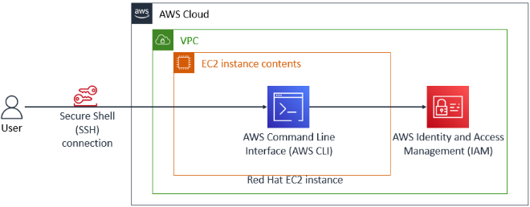
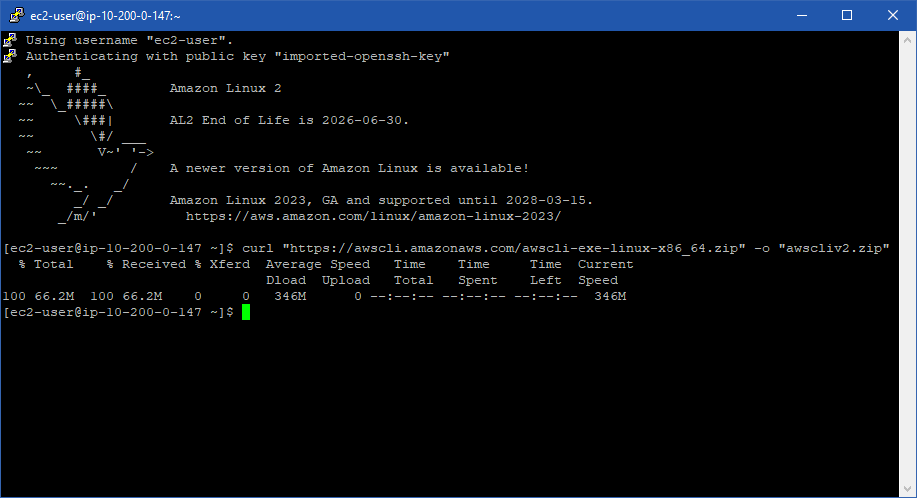
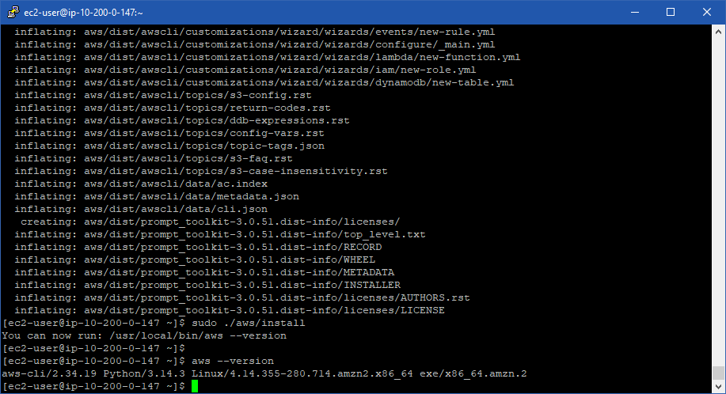
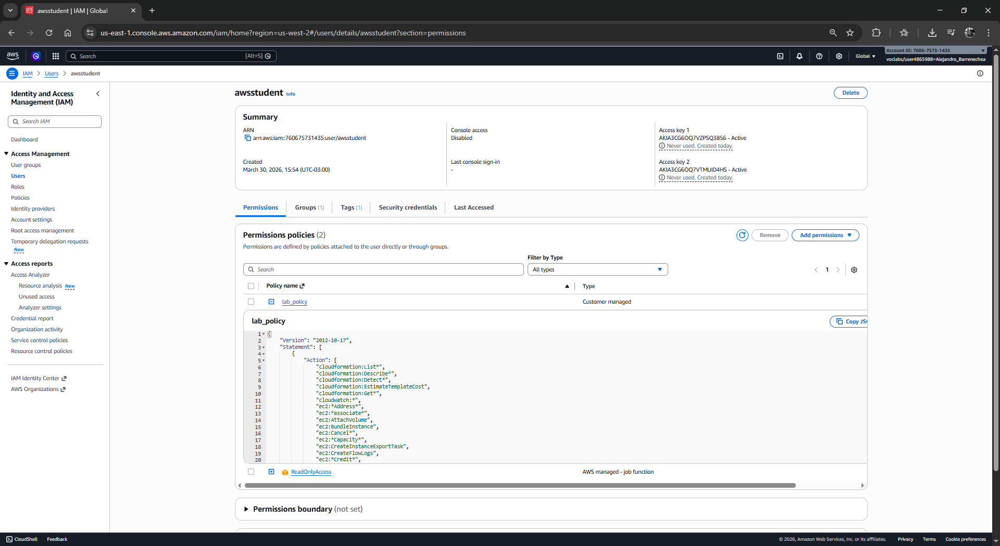
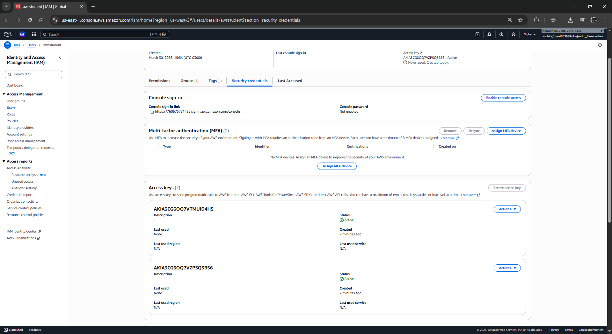
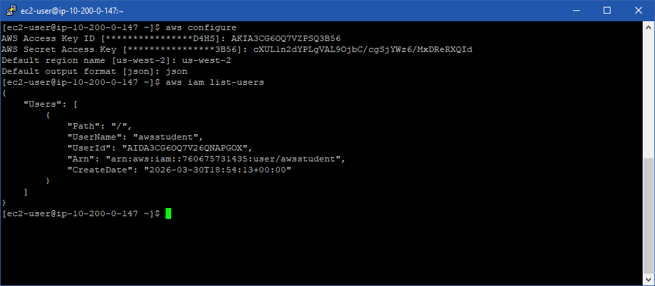
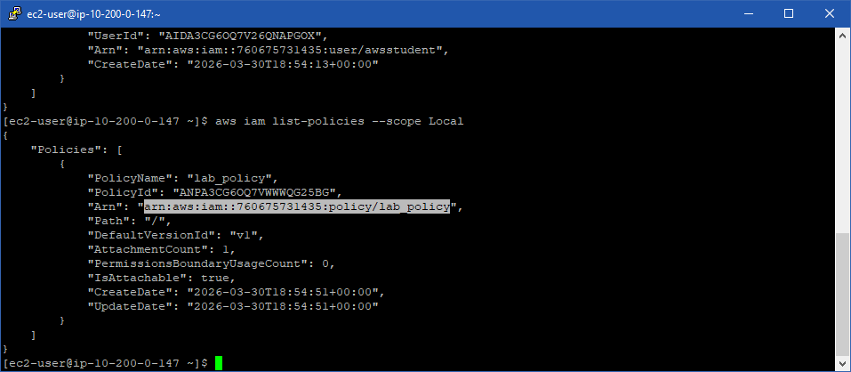
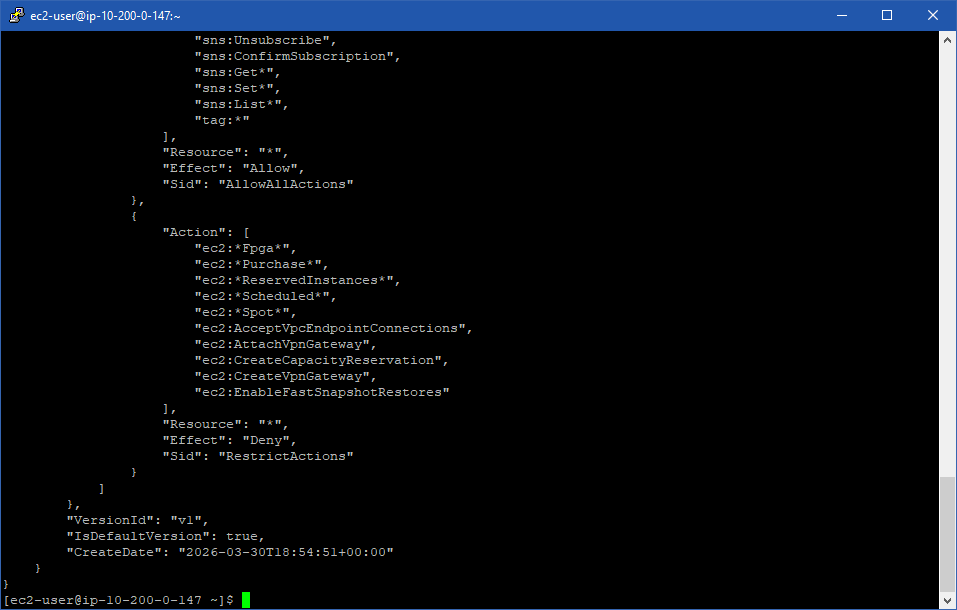

# 🛠️ Laboratorio: Instalación y Configuración de la AWS CLI en Red Hat Enterprise Linux

*   **Dificultad:** Principiante / Intermedio
*   **Tiempo Estimado:** 45 minutos
*   **Servicios Principales:** Amazon EC2, AWS Identity and Access Management (IAM), AWS CLI.

---

## 📝 Resumen y Objetivos
La interfaz de línea de comandos de AWS (AWS CLI) es una herramienta esencial para la automatización y gestión de recursos. A diferencia de Amazon Linux, otras distribuciones como **Red Hat Enterprise Linux (RHEL)** no incluyen esta herramienta preinstalada. 

**Los objetivos de este laboratorio son:**
1.  Establecer una conexión segura vía SSH a una instancia RHEL.
2.  Descargar, descomprimir e instalar la versión 2 de la AWS CLI.
3.  Vincular la herramienta a una cuenta de AWS mediante llaves de acceso (Access Keys).
4.  Interactuar con el servicio de IAM directamente desde la terminal.

---

## 🔍 Análisis del Escenario
**Diagnóstico:** El cliente dispone de un entorno basado en Red Hat dentro de una VPC. Como Administrador de SysOps, se te solicita habilitar capacidades de gestión programática dentro de este servidor. Debido a que el sistema operativo es "limpio" (vanilla), se requiere un despliegue manual de binarios y una configuración de perfiles de seguridad para permitir la comunicación con el plano de control de AWS.

---

## 🏗️ Arquitectura
El flujo de trabajo sigue esta lógica:
1.  **Usuario** -> Conexión SSH (Puerto 22) -> **Instancia EC2 (RHEL)**.
2.  **Instancia EC2** -> AWS CLI -> **API de AWS** (Validado por IAM).

<p align="center">
  
</p>

## 🚀 Desarrollo de las Tareas

### Tarea 1: Conexión a la Instancia Red Hat vía SSH
Para interactuar con el servidor, primero debes establecer una sesión remota.

1.  **Haz clic** en el botón **Details** arriba de las instrucciones del laboratorio y selecciona **Show**.
2.  **Descarga** el archivo de credenciales correspondiente a tu sistema operativo (`.ppk` para Windows/PuTTY o `.pem` para macOS/Linux).
3.  **Copia** la dirección `PublicIP` que se muestra en el panel.
4.  **Conéctate** siguiendo el método adecuado:
    *   **En Windows (PuTTY):** Carga la llave en *Auth*, escribe `ec2-user@IP-PUBLICA` y haz clic en *Open*.
    *   **En macOS/Linux:** Ejecuta los siguientes comandos en tu terminal:
        ```bash
        chmod 400 labsuser.pem
        ssh -i labsuser.pem ec2-user@<TU-IP-PUBLICA>
        ```
5.  **Escribe** `yes` si se te solicita confirmar la autenticidad del host.

### Tarea 2: Instalación de la AWS CLI
Una vez dentro de la terminal de Red Hat, procede con la instalación de los binarios.

1.  **Descarga** el paquete de instalación oficial mediante `curl`:
    ```bash
    curl "https://awscli.amazonaws.com/awscli-exe-linux-x86_64.zip" -o "awscliv2.zip"
    ```

<p align="center">
  
</p>

2.  **Descomprime** el archivo descargado:
    ```bash
    unzip -u awscliv2.zip
    ```
3.  **Ejecuta** el script de instalación con privilegios de superusuario:
    ```bash
    sudo ./aws/install
    ```
4.  **Verifica** que la instalación fue exitosa consultando la versión:
    ```bash
    aws --version
    ```

<p align="center">
  
</p>


### Tarea 3: Inspección de Credenciales en la Consola
Antes de configurar la CLI, identifica las credenciales necesarias en la consola moderna de AWS.

1.  **Busca** "IAM" en la barra de búsqueda superior y **selecciona** el servicio.
2.  **Navega** a **Usuarios** en el menú lateral izquierdo.
3.  **Haz clic** en el usuario `awsstudent`.
4.  **Explora** la pestaña **Permisos** y expande la política `lab_policy` para ver el JSON. Nota que tienes permisos específicos limitados.

<p align="center">
  
</p>


5.  **Selecciona** la pestaña **Credenciales de seguridad** e identifica que ya existe una *Access Key ID*. (Nota: El *Secret Key* solo se obtiene al momento de la creación o en el panel de **Details** de este lab).

<p align="center">
  
</p>


### Tarea 4: Configuración de la AWS CLI
Vuelve a tu terminal SSH para vincular la instancia con tu cuenta de AWS.

1.  **Ejecuta** el comando de configuración:
    ```bash
    aws configure
    ```
2.  **Ingresa** los siguientes datos cuando se te soliciten (búscalos en el botón **Details** del lab):
    *   **AWS Access Key ID:** `[Pega tu Access Key]`
    *   **AWS Secret Access Key:** `[Pega tu Secret Key]`
    *   **Default region name:** `us-west-2`
    *   **Default output format:** `json`

<p align="center">
  
</p>


### Tarea 5: Verificación de Operatividad
1.  **Ejecuta** el siguiente comando para listar los usuarios de la cuenta:
    ```bash
    aws iam list-users
    ```
2.  **Confirma** que recibes una respuesta en formato JSON con la lista de usuarios. Esto indica que la CLI está correctamente autenticada.

<p align="center">
  
</p>


---

## 🏆 Desafío: Recuperación de Políticas vía CLI
Como ingeniero de SysOps, debes ser capaz de extraer información técnica sin usar la interfaz gráfica.

**Paso 1: Listar las políticas locales para encontrar el ARN.**
```bash
aws iam list-policies --scope Local
```
*Identifica el `Arn` de la política llamada `lab_policy`.*

<p align="center">
  
</p>

**Paso 2: Obtener la versión de la política y guardarla en un archivo.**
Sustituye `<ARN_DE_TU_POLITICA>` con el valor obtenido anteriormente:
```bash
aws iam get-policy-version --policy-arn <ARN_DE_TU_POLITICA> --version-id v1 > lab_policy.json
```

**Paso 3: Visualizar el archivo generado.**
```bash
cat lab_policy.json
```

<p align="center">
  
</p>

## 🧠 Respuestas Analíticas

*   **¿Por qué es necesario instalar manualmente la CLI en Red Hat?**
    R: A diferencia de distribuciones optimizadas para la nube como *Amazon Linux 2023*, RHEL es una distribución de propósito general que prioriza la estabilidad y la soberanía del software instalado. El administrador debe decidir qué herramientas externas incorporar.

*   **¿Qué diferencia hay entre autenticarse en la Consola vs. la CLI?**
    R: La Consola de Administración utiliza autenticación basada en sesión (Usuario/Contraseña + MFA). La CLI utiliza autenticación programática mediante un par de llaves (`Access Key` y `Secret Access Key`), lo cual es ideal para scripts y automatización de sistemas.

*   **¿Cuál es la ventaja de usar el formato de salida `json` en la CLI?**
    R: El formato JSON es el estándar de la industria para el intercambio de datos. Permite que otras herramientas o lenguajes de programación (como Python o herramientas de filtrado como `jq`) procesen la información de manera estructurada y eficiente.