# Lab 190: Automatización de implementaciones con AWS CloudFormation

| Parámetro | Detalle |
| :--- | :--- |
| **Dificultad** | Intermedia |
| **Tiempo Estimado** | 45 Minutos |
| **Servicios Principales** | AWS CloudFormation, Amazon VPC, Amazon S3, Amazon EC2 |

---

## 1. Resumen y Objetivos
Este laboratorio se enfoca en el concepto de **Infraestructura como Código (IaC)**. Utilizarás AWS CloudFormation para definir, desplegar y actualizar recursos de infraestructura de forma automática y repetible mediante plantillas en formato YAML.

**Los objetivos principales son:**
*   Desplegar un entorno de red (VPC y Security Groups) mediante una plantilla base.
*   Modificar una plantilla existente para añadir recursos de almacenamiento (Amazon S3).
*   Integrar parámetros dinámicos y referencias cruzadas para desplegar una instancia de cómputo (Amazon EC2).
*   Gestionar el ciclo de vida completo de un *Stack*, incluyendo su eliminación segura.

---

## 2. Análisis del Escenario
El cliente requiere un método para desplegar infraestructura que elimine el error humano derivado de procesos manuales. La solución propuesta utiliza **AWS CloudFormation**, que actúa como el motor de orquestación. El diagnóstico técnico indica que el uso de plantillas permitirá al cliente versionar su infraestructura y asegurar que los entornos de desarrollo, prueba y producción sean idénticos, permitiendo despliegues incluso en horarios no laborables sin intervención humana directa.

---

## 3. Arquitectura del Laboratorio
La arquitectura final consistirá en:
1.  **Red:** Una VPC con una subred pública.
2.  **Seguridad:** Un Security Group permitiendo tráfico específico.
3.  **Almacenamiento:** Un bucket de Amazon S3 con nombre generado automáticamente.
4.  **Cómputo:** Una instancia EC2 (Amazon Linux 2) desplegada dinámicamente mediante el uso de **SSM Parameter Store** para obtener la AMI más reciente.

<div align="center">
  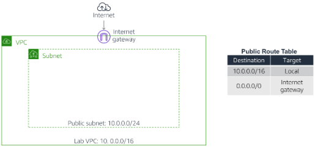
</div>

---

## 4. Desarrollo

### Tarea 1: Despliegue de un Stack inicial de CloudFormation
En esta fase, crearás la base de la red.

1.  **Descarga el archivo base:** Obtén el archivo `task1.yaml` (proporcionado en los recursos del lab) y ábrelo con un editor de texto (como VS Code o Notepad++).
2.  **Analiza la estructura:**
    *   **Parameters:** Observa que solicita rangos CIDR para la VPC.
    *   **Resources:** Define la `VPC` y un `AppSecurityGroup`.
    *   **Outputs:** Exporta el ID del grupo de seguridad.

<div align="center">
  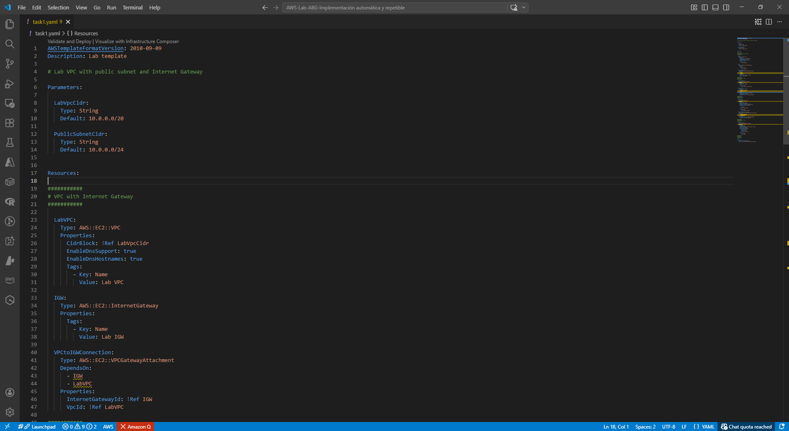
</div>

3.  **Accede a la consola:** Navega al servicio **CloudFormation**.
4.  **Crea el Stack:**
    *   Haz clic en **Create stack** -> **With new resources (standard)**.
    *   En *Prepare template*, selecciona **Template is ready**.
    *   En *Template source*, selecciona **Upload a template file**, carga `task1.yaml` y haz clic en **Next**.

<div align="center">
  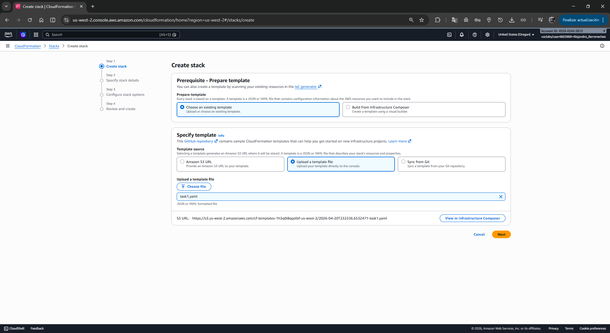
</div>

5.  **Configura los detalles:**
    *   **Stack name:** Escribe `Lab`.
    *   Mantén los parámetros IP por defecto y haz clic en **Next**.

<div align="center">
  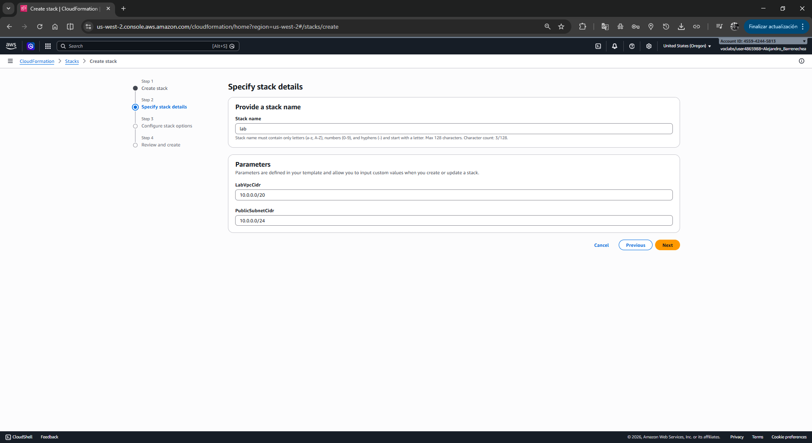
</div>

6.  **Opciones y Revisión:** Mantén las opciones predeterminadas. Haz clic en **Next** y finalmente en **Submit** (o *Create stack*).
7.  **Monitoreo:**
    *   Ve a la pestaña **Events** para ver el orden de creación.
    *   Espera a que el estado cambie a **CREATE_COMPLETE**.

<div align="center">
  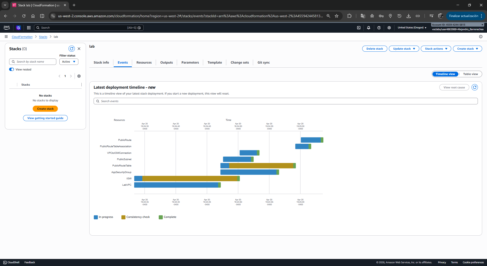
</div>

### Tarea 2: Adición de un Bucket de Amazon S3 al Stack
Aprenderás a actualizar infraestructura existente modificando el código.

1.  **Modifica el código:** Abre `task1.yaml` y añade el recurso S3 bajo la sección `Resources:`. Asegúrate de respetar la sangría (2 espacios).
    ```yaml
      S3Bucket:
        Type: AWS::S3::Bucket
    ```

<div align="center">
  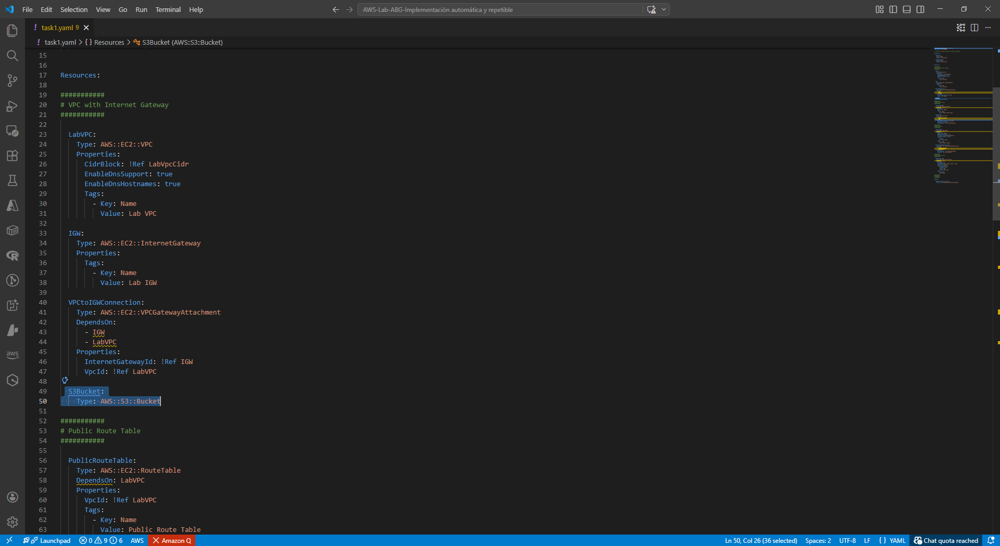
</div>

2.  **Actualiza el Stack en la consola:**
    *   Selecciona el stack **Lab**.
    *   Haz clic en **Update**.
    *   Selecciona **Replace current template** -> **Upload a template file**, carga tu archivo modificado y presiona **Next**.

<div align="center">
  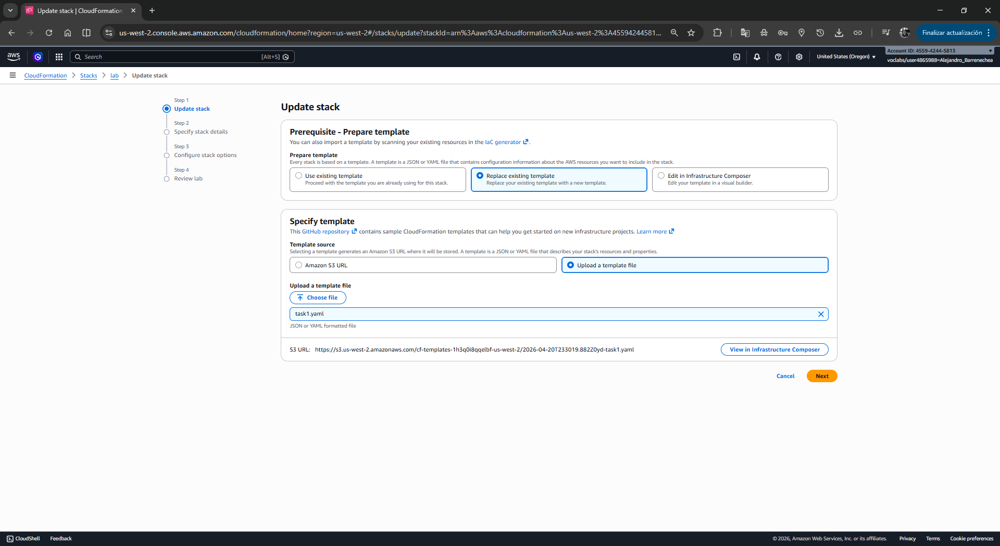
</div>

3.  **Finaliza la actualización:** Avanza por las pantallas de configuración sin cambios. En la página de revisión, verifica la sección **Change set preview**; debería indicar que se añadirá un recurso (`Add` - `S3Bucket`).
4.  **Ejecuta:** Haz clic en **Update stack**.

<div align="center">
  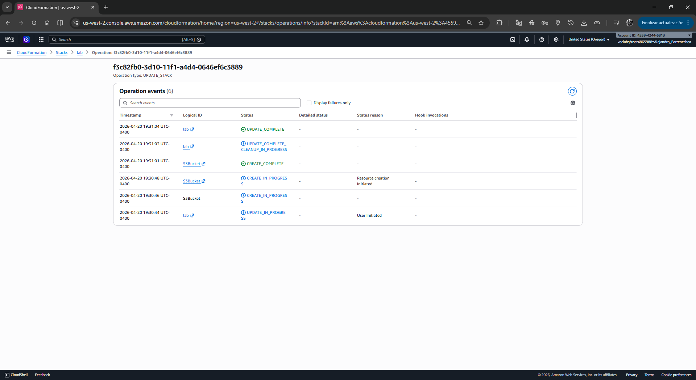
</div>
<div align="center">
  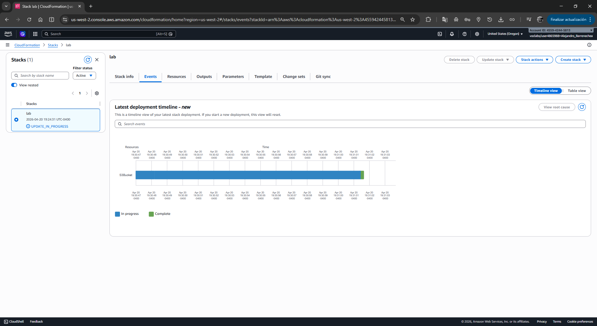
</div>

### Tarea 3: Adición de una Instancia Amazon EC2
Configurarás un recurso más complejo que depende de otros elementos del Stack.

1.  **Añade el Parámetro de AMI:** En la sección `Parameters:`, añade el siguiente bloque para obtener la última imagen de Amazon Linux 2 automáticamente:
    ```yaml
      AmazonLinuxAMIID:
        Type: AWS::SSM::Parameter::Value<AWS::EC2::Image::Id>
        Default: /aws/service/ami-amazon-linux-latest/amzn2-ami-hvm-x86_64-gp2
    ```

<div align="center">
  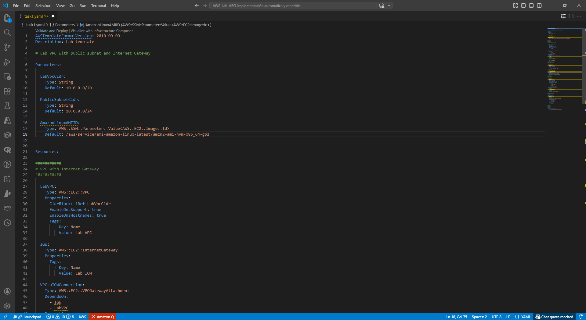
</div>

2.  **Añade el recurso EC2:** Bajo `Resources:`, define la instancia vinculándola a la red y seguridad creadas previamente mediante la función `!Ref`:
    ```yaml
      AppServer:
        Type: AWS::EC2::Instance
        Properties:
          ImageId: !Ref AmazonLinuxAMIID
          InstanceType: t3.micro
          SecurityGroupIds:
            - !Ref AppSecurityGroup
          SubnetId: !Ref PublicSubnet
          Tags:
            - Key: Name
              Value: App Server
    ```

<div align="center">
  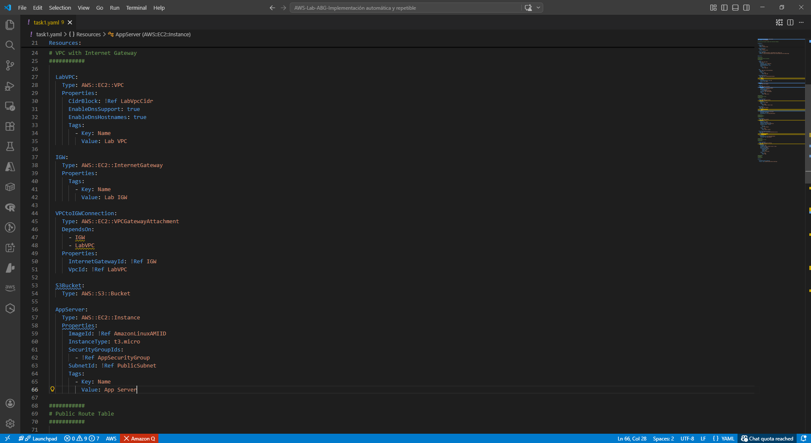
</div>

3.  **Despliega la actualización:** Repite el proceso de **Update** en la consola de CloudFormation cargando el archivo actualizado.
4.  **Verificación:** Una vez en **UPDATE_COMPLETE**, navega a la consola de **EC2** para confirmar que la instancia "App Server" está en ejecución.

<div align="center">
  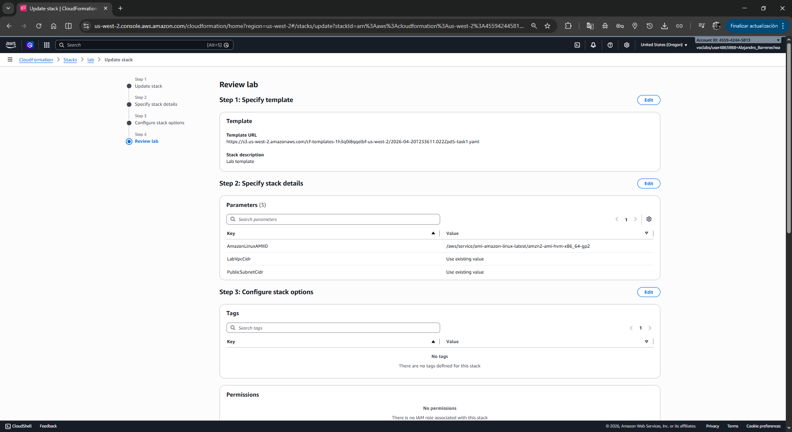
</div>
<div align="center">
  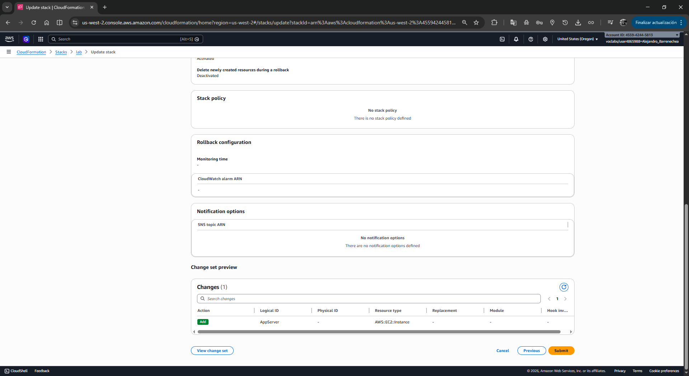
</div>
<div align="center">
  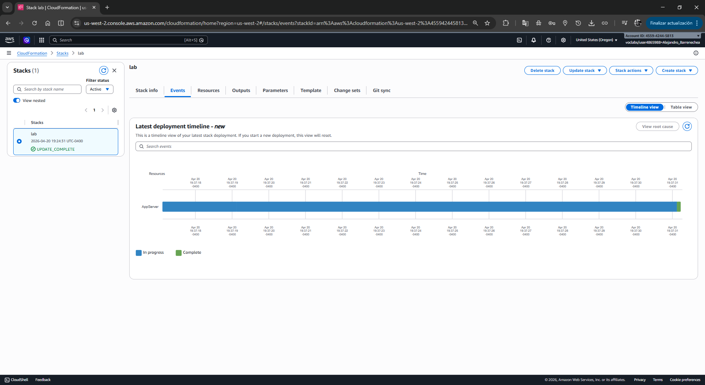
</div>
<div align="center">
  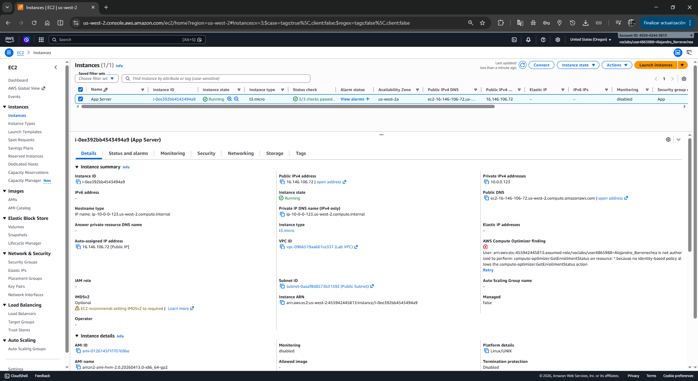
</div>

### Tarea 4: Eliminación de Recursos
Una de las mayores ventajas de CloudFormation es la limpieza total del entorno.

1.  **Elimina el Stack:** En la consola de CloudFormation, selecciona el stack **Lab**.
2.  **Confirma:** Haz clic en **Delete** y luego en **Delete stack**.

<div align="center">
  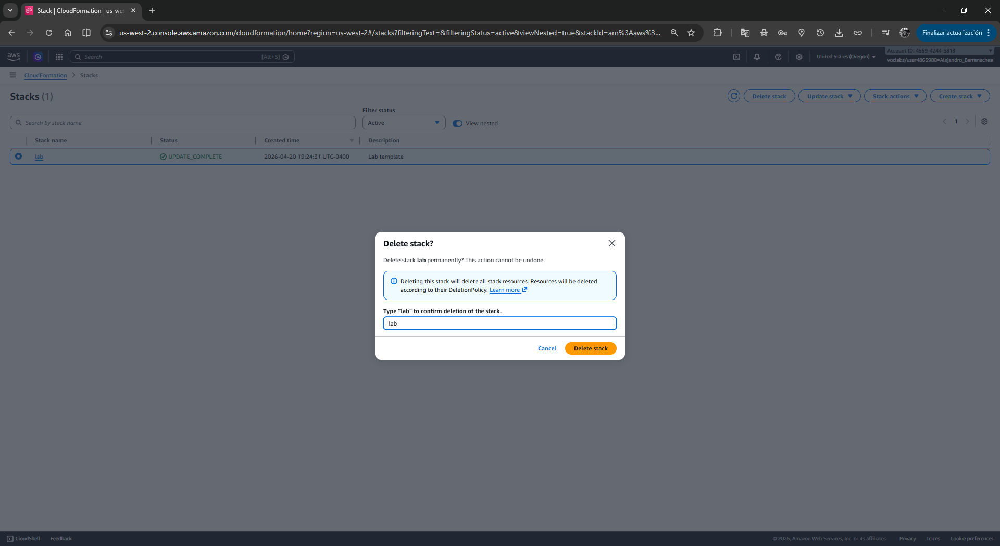
</div>

3.  **Resultado:** CloudFormation eliminará automáticamente la instancia EC2, el bucket de S3, el Security Group y la VPC en el orden inverso de dependencia.

<div align="center">
  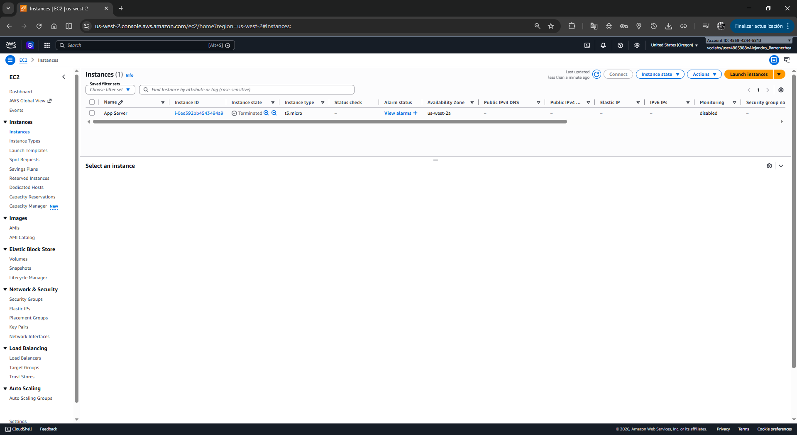
</div>

---

## 5. Respuestas Analíticas
*   **¿Por qué CloudFormation determina el orden de creación?**
    CloudFormation analiza las dependencias lógicas. Por ejemplo, no puede crear una subred sin que la VPC exista primero. Utiliza las referencias (`!Ref`) para construir un gráfico de dependencias y optimizar el despliegue.
*   **¿Qué sucede si un recurso falla durante la actualización?**
    CloudFormation cuenta con una función de **Rollback**. Si un recurso (como la EC2) falla al crearse, el servicio revertirá automáticamente todos los cambios al último estado estable conocido, asegurando que la infraestructura no quede en un estado inconsistente.
*   **¿Cuál es la ventaja de usar SSM Parameter Store para la AMI ID?**
    Evita el "Hardcoding" de IDs de AMI que cambian según la región o el tiempo. Esto hace que la plantilla sea **portátil** entre diferentes regiones de AWS sin necesidad de edición manual.