# 191--Lab - Actividad de Café: Resolución de problemas en AWS CloudFormation

| Parámetro | Detalle |
| :--- | :--- |
| **Dificultad** | Avanzada |
| **Tiempo Estimado** | 75 Minutos |
| **Servicios Principales** | AWS CloudFormation, Amazon EC2 (CLI Host), Amazon S3, AWS CLI |

---

## 1. Resumen y Objetivos
Este laboratorio práctico se centra en el diagnóstico y resolución de errores en despliegues de **Infraestructura como Código (IaC)**. Aprenderás a intervenir en el ciclo de vida de un *Stack*, analizar logs de inicialización en instancias Linux y gestionar la persistencia de recursos mediante el filtrado avanzado de datos.

**Al finalizar este laboratorio, serás capaz de:**
*   Utilizar **JMESPath** para realizar consultas precisas en documentos formateados en JSON.
*   Solucionar problemas de despliegue de Stacks mediante la AWS CLI.
*   Analizar archivos de registro en una instancia Linux para determinar la causa de fallos en el script de arranque.
*   Resolver errores en la eliminación de Stacks vinculados a recursos que contienen datos.

---

## 2. Análisis del Escenario
Asumes el papel de Sofía en el equipo del Café. El objetivo es crear una Prueba de Concepto (POC) para desplegar un servidor web automatizado. El diagnóstico inicial revela que los despliegues manuales son propensos a errores y difíciles de replicar. CloudFormation ofrece la solución, pero el despliegue inicial fallará. Tu misión como ingeniero es desactivar la reversión automática de recursos, investigar la causa raíz en la capa de sistema operativo y asegurar que la infraestructura sea consistente incluso tras intervenciones manuales.

---

## 3. Arquitectura del Laboratorio
El entorno utiliza una instancia de gestión centralizada (**CLI Host**) ubicada en la subred pública de una VPC existente (`VPC2`). Desde esta instancia, ejecutarás comandos de la AWS CLI para interactuar con el servicio de CloudFormation y desplegar el Stack de aplicación del Café.

<div align="center">
  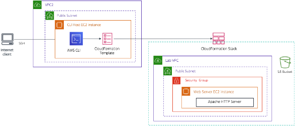
</div>

---

## 4. Desarrollo de las Tareas Paso a Paso

### Tarea 1: Práctica de consulta de datos JSON con JMESPath
1.  **Navega al evaluador:** Abre una pestaña en el navegador y dirígete a `jmespath.org`.
2.  **Carga el documento de prueba:** Copia el JSON de postres (`desserts`) del texto del laboratorio y pégalo en el panel izquierdo.
3.  **Ejecuta filtros básicos:**
    *   Escribe `desserts` para ver el array completo.
    *   Escribe `desserts[1]` para obtener el segundo elemento.
    *   Escribe `desserts[0].name` para extraer solo el nombre del primer postre.
4.  **Aplica filtros avanzados:** Escribe `desserts[?name=='Carrot cake']` para filtrar el objeto específico por su valor.
5.  **Simula una consulta de AWS:** Reemplaza el JSON por el bloque `StackResources` y extrae el `LogicalResourceId` de la instancia EC2 usando la expresión: `StackResources[?ResourceType == 'AWS::EC2::Instance'].LogicalResourceId`.

### Tarea 2: Troubleshooting y trabajo con Stacks de CloudFormation

#### 2.1 Conexión SSH al CLI Host
1.  **Obtén las credenciales:** Haz clic en **Details** > **Show** en tu entorno de laboratorio y descarga el archivo de llave (`.pem` o `.ppk`).
2.  **Establece la conexión:** Abre tu terminal (o PuTTY) y ejecuta `ssh -i labsuser.pem ec2-user@<CliHostIP>` reemplazando con la dirección IP pública del host de gestión.

#### 2.2 Configuración de la AWS CLI
1.  **Identifica la región:** Ejecuta el comando `curl http://169.254.169.254/latest/dynamic/instance-identity/document | grep region` para confirmar dónde opera tu infraestructura.

<div align="center">
  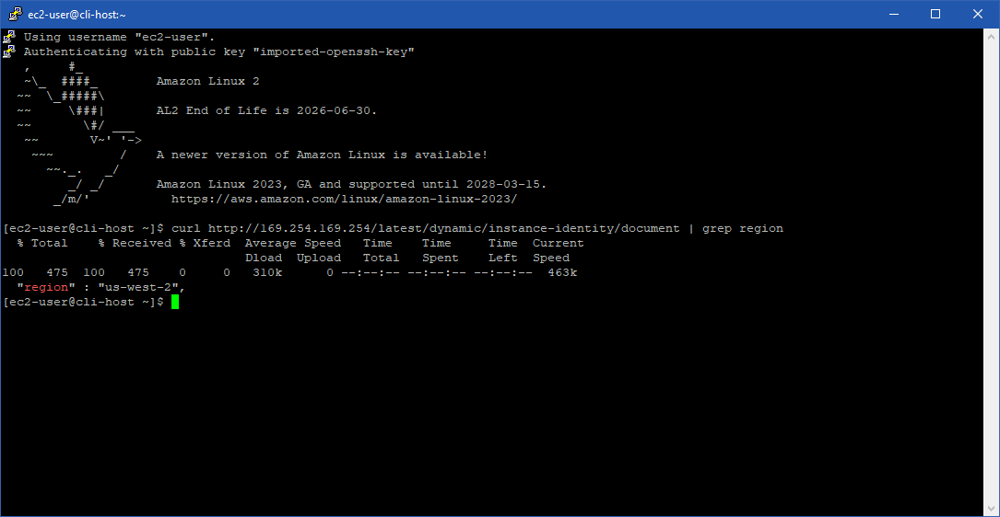
</div>

2.  **Configura el entorno:** Ejecuta `aws configure` e ingresa tu *Access Key ID*, *Secret Access Key*, la región detectada y establece `json` como formato de salida.

#### 2.3 Intento de creación de un Stack (Fallo y Rollback)
1.  **Inspecciona la plantilla:** Ejecuta `less template1.yaml` para analizar el recurso `WaitCondition` y el script de `UserData`. Presiona `q` para salir.

<div align="center">
  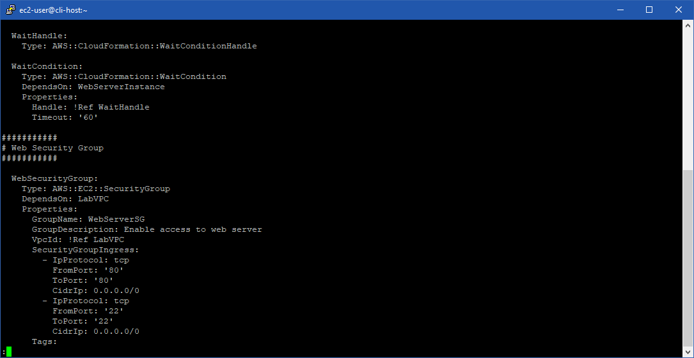
</div>

2.  **Lanza el despliegue:**
    ```bash
    aws cloudformation create-stack \
    --stack-name myStack \
    --template-body file://template1.yaml \
    --capabilities CAPABILITY_NAMED_IAM \
    --parameters ParameterKey=KeyName,ParameterValue=vockey
    ```

<div align="center">
  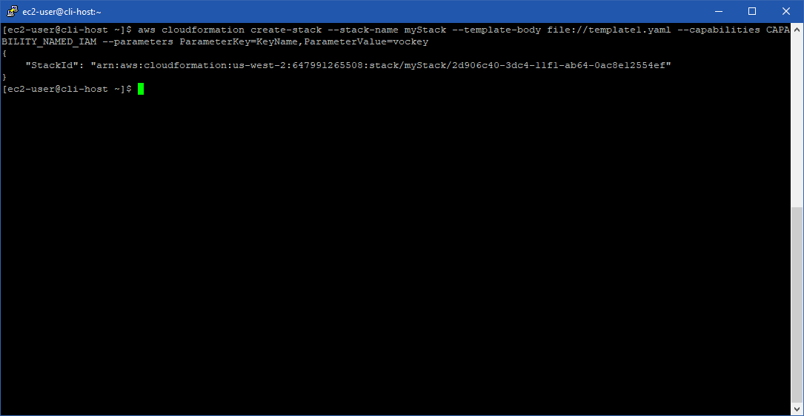
</div>

3.  **Monitorea los recursos:** Ejecuta `watch -n 5 -d aws cloudformation describe-stack-resources --stack-name myStack --output table`.

<div align="center">
  
</div>

4.  **Diagnostica el Rollback:** Observa que el `WaitCondition` falla por *timeout*. CloudFormation procederá a eliminar todos los recursos creados. Espera al estado `ROLLBACK_COMPLETE` y borra el stack con `aws cloudformation delete-stack --stack-name myStack`.

<div align="center">
  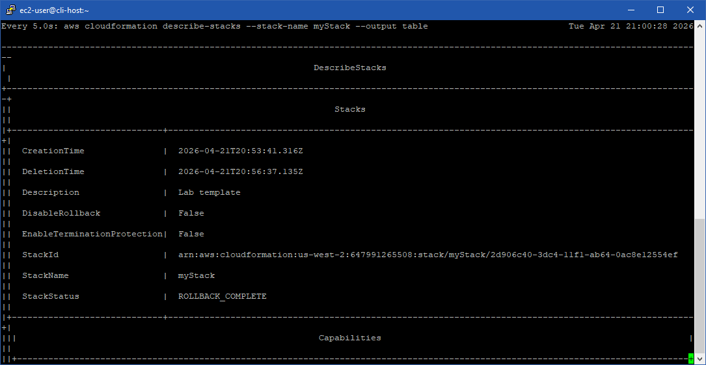
</div>
<div align="center">
  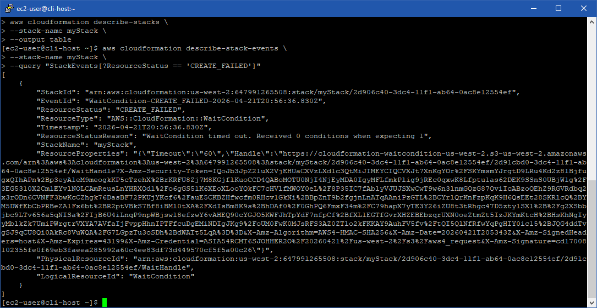
</div>
<div align="center">
  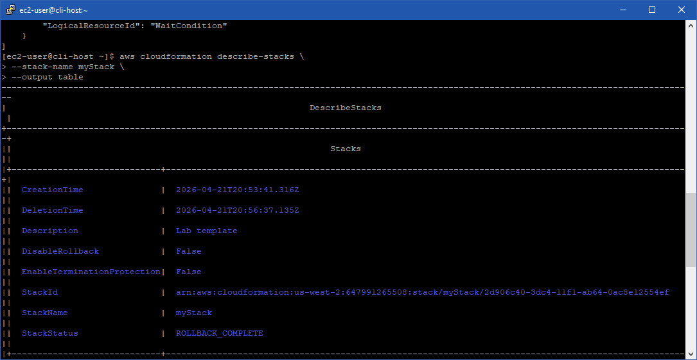
</div>

#### 2.4 Prevención de Rollback para Depuración
1.  **Despliega con persistencia:** Ejecuta nuevamente el comando `create-stack` de la tarea anterior, pero añade el parámetro `--on-failure DO_NOTHING`.

<div align="center">
  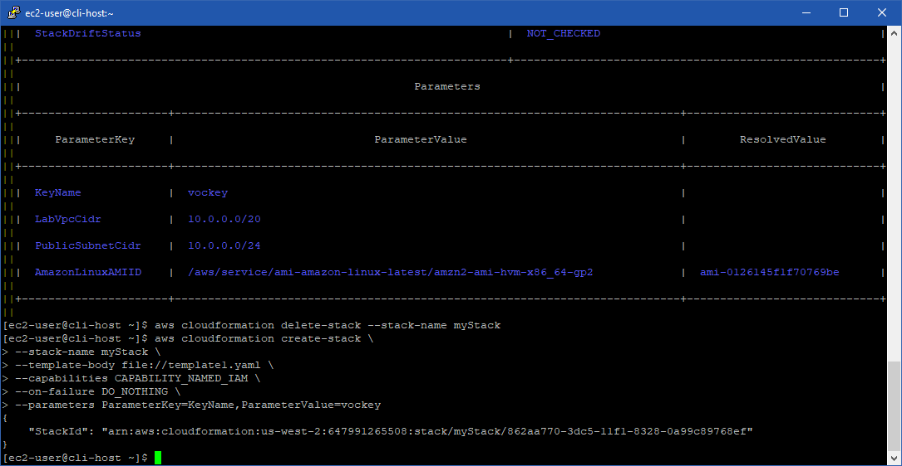
</div>

2.  **Verifica el fallo:** Espera a que el Stack marque `CREATE_FAILED`. Observarás que los recursos (incluyendo la instancia EC2) no han sido eliminados.

<div align="center">
  
</div>
<div align="center">
  
</div>

3.  **Audita el servidor web:** Obtén la IP pública del servidor web fallido con `aws ec2 describe-instances`, conéctate vía SSH y consulta los logs de inicialización:
    ```bash
    sudo tail -50 /var/log/cloud-init-output.log
    ```
    *Diagnóstico Técnico: El log indica "No package http available", confirmando un error tipográfico en el script.*

<div align="center">
  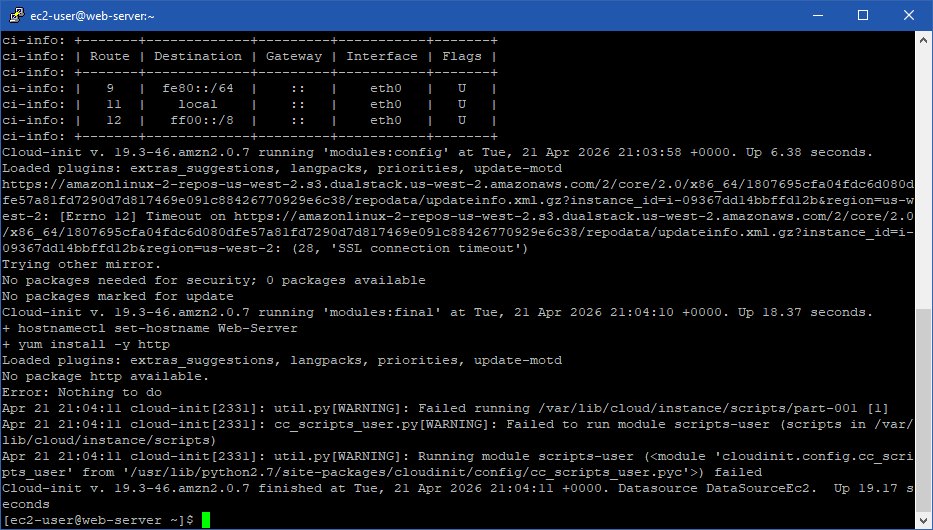
</div>
<div align="center">
  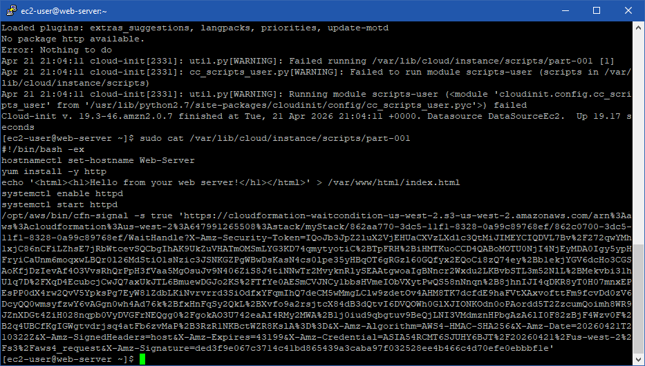
</div>

#### 2.5 Resolución y Despliegue Exitoso
1.  **Corrige la plantilla:** En el **CLI Host**, abre el archivo con `vim template1.yaml`. Navega a la línea 128 y cambia `http` por `httpd`. Guarda y sal con `:wq`.

<div align="center">
  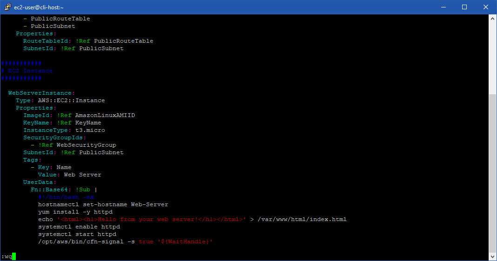
</div>

2.  **Verifica el cambio:** Ejecuta `cat template1.yaml | grep httpd` para confirmar la corrección.

<div align="center">
  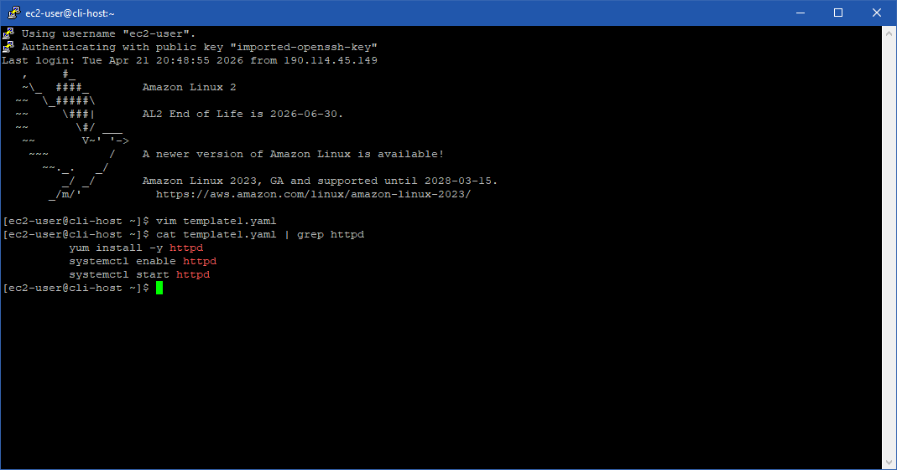
</div>

3.  **Re-despliega:** Elimina el stack de diagnóstico y lanza la plantilla corregida. Confirma que el estado final sea `CREATE_COMPLETE`.

<div align="center">
  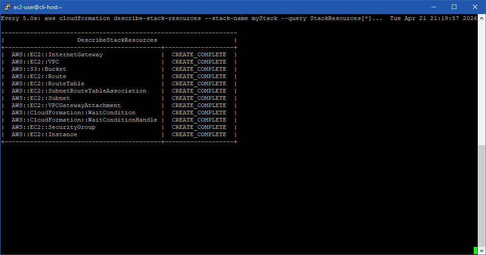
</div>
<div align="center">
  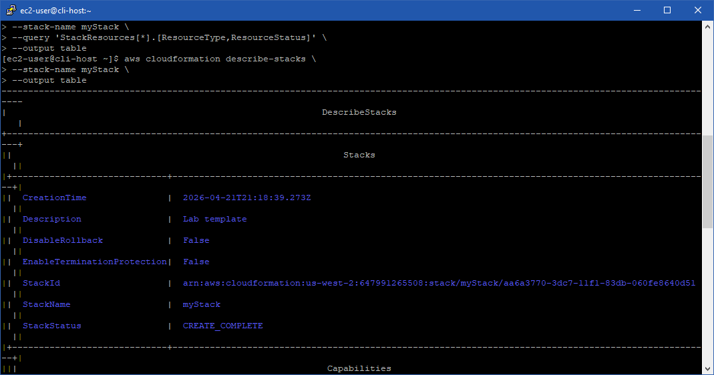
</div>

4.  **Prueba la aplicación:** Carga la IP del servidor web en tu navegador y confirma el mensaje de éxito.

<div align="center">
  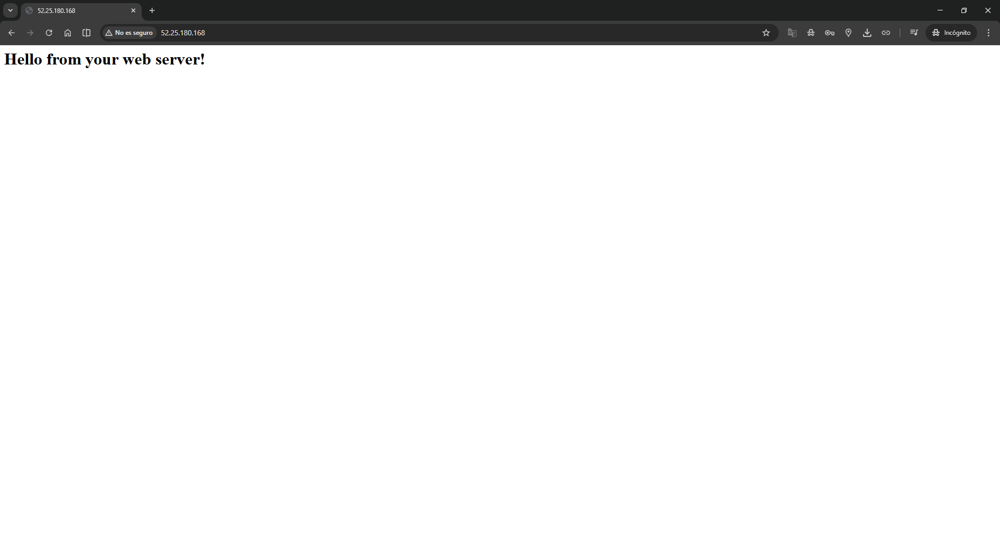
</div>

### Tarea 3: Modificaciones manuales y Detección de Desviaciones (Drift)
1.  **Cambio manual:** Entra a la consola de AWS, navega a **EC2 > Security Groups** y cambia manualmente la fuente de la regla SSH de `0.0.0.0/0` a **`My IP`**.

<div align="center">
  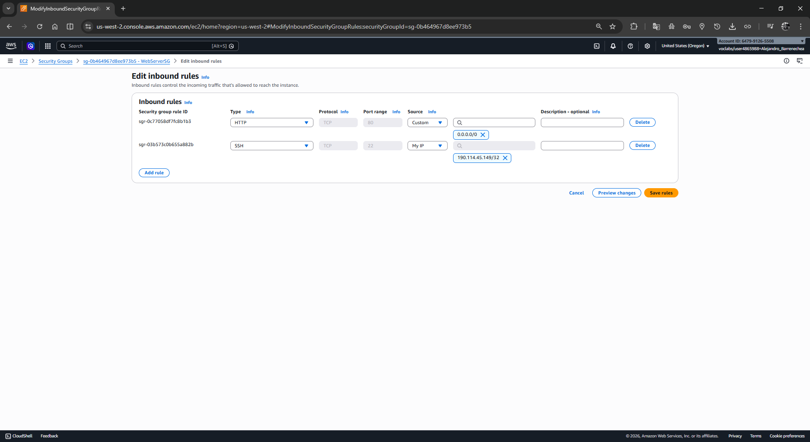
</div>

2.  **Interactúa con S3:** Crea un archivo y súbelo al bucket creado por el stack utilizando la CLI.

<div align="center">
  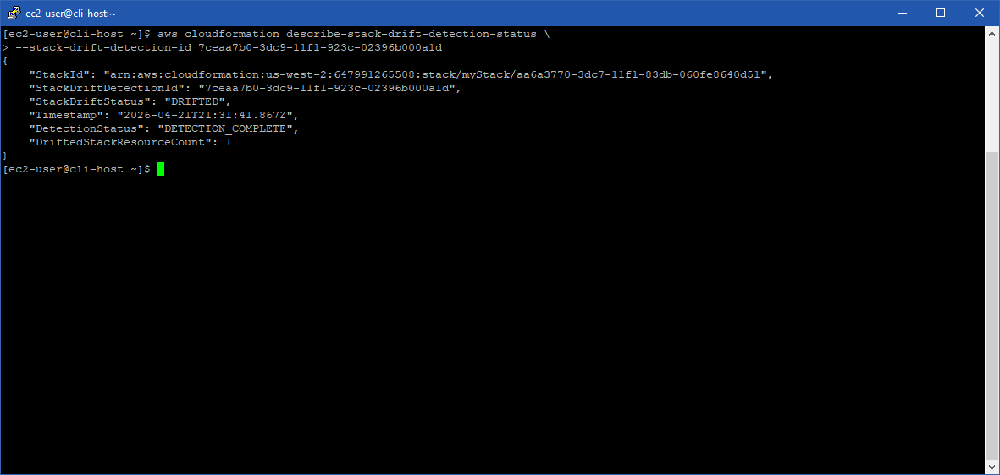
</div>

3.  **Ejecuta la detección de Drift:**
    ```bash
    aws cloudformation detect-stack-drift --stack-name myStack
    ```
4.  **Analiza los resultados:** Consulta el estado de desviación mediante `describe-stack-resource-drifts`. Observa que el Security Group marca estado **`MODIFIED`**, mientras que el Bucket de S3 permanece **`IN_SYNC`**.

<div align="center">
  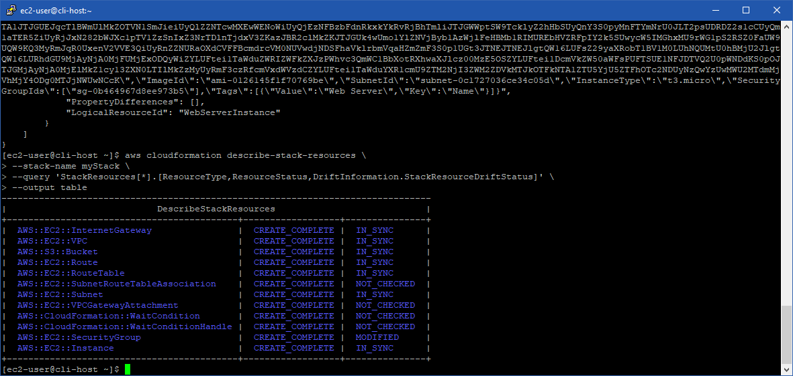
</div>

### Tarea 4: Eliminación del Stack y Challenge
1.  **Intenta borrar el Stack:** Ejecuta `aws cloudformation delete-stack --stack-name myStack`.
2.  **Analiza el error:** CloudFormation marcará `DELETE_FAILED` para el recurso de S3 debido a que contiene objetos.

<div align="center">
  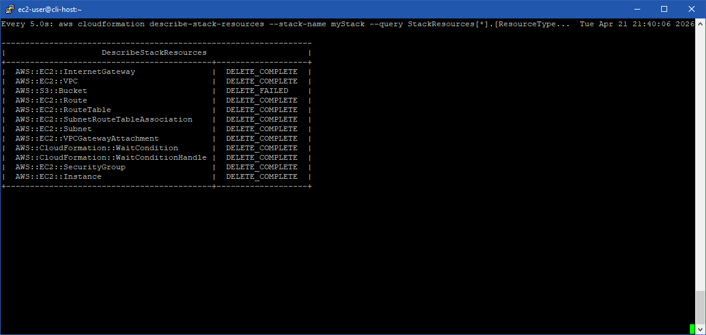
</div>
<div align="center">
  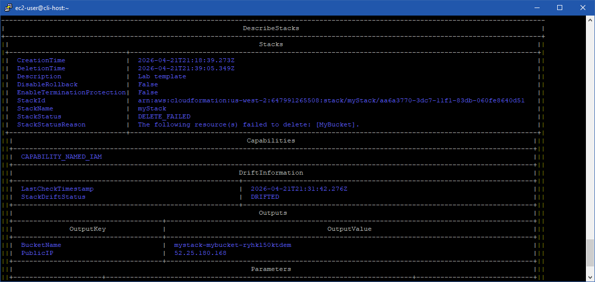
</div>

3.  **Resuelve el Challenge:** Utiliza el ID lógico del bucket para eliminar el stack reteniendo el recurso poblado:
    ```bash
    aws cloudformation delete-stack --stack-name myStack --retain-resources MyBucket
    ```

<div align="center">
  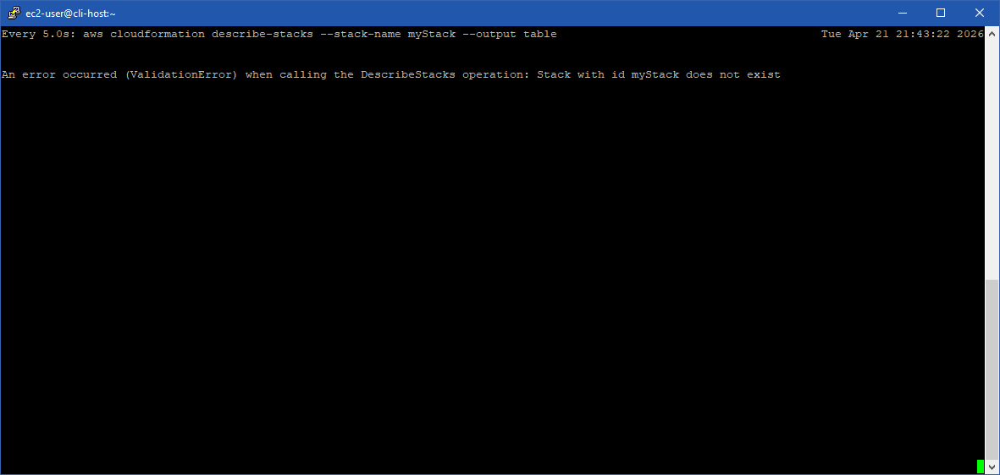
</div>

4.  **Confirmación final:** Verifica que el stack ha sido eliminado satisfactoriamente, pero el bucket de S3 con tus datos persiste en la cuenta.

<div align="center">
  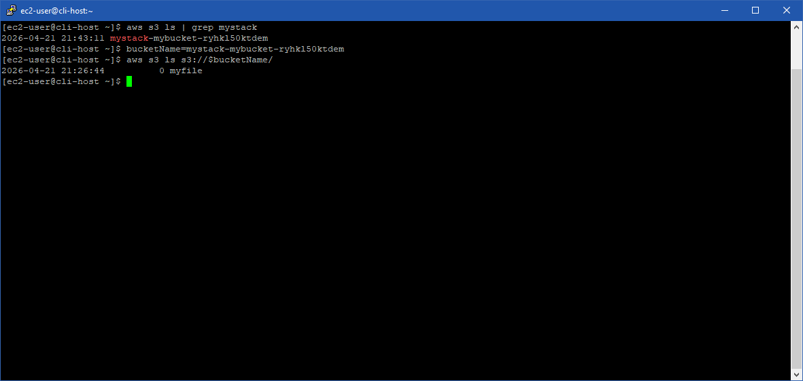
</div>

---

## 5. Respuestas Analíticas

*   **¿Cuál es la expresión JMESPath para obtener el LogicalResourceId de la EC2?**
    La expresión correcta es `StackResources[?ResourceType == 'AWS::EC2::Instance'].LogicalResourceId`. Esto filtra el array buscando el tipo de recurso específico y proyecta solo el ID deseado.
*   **¿Por qué subir archivos a S3 no genera una desviación (Drift)?**
    CloudFormation detecta cambios en las **propiedades de configuración** del recurso (como políticas o etiquetas). El contenido del bucket (objetos) se considera datos de usuario y no forma parte de la definición de infraestructura de la plantilla.
*   **¿Por qué es necesario el parámetro `--on-failure DO_NOTHING` durante el troubleshooting?**
    Por defecto, CloudFormation intenta dejar la cuenta en un estado limpio tras un fallo. Sin este parámetro, la instancia EC2 con los logs de error sería eliminada automáticamente, perdiendo la evidencia necesaria para diagnosticar fallos en el `UserData`.
*   **¿Cómo se resolvió la imposibilidad de eliminar el Stack?**
    Se utilizó el parámetro `--retain-resources` en el comando de borrado. Esto permite que CloudFormation elimine la gestión del Stack pero deje el recurso específico (el bucket de S3 poblado) intacto en la cuenta de AWS.

---