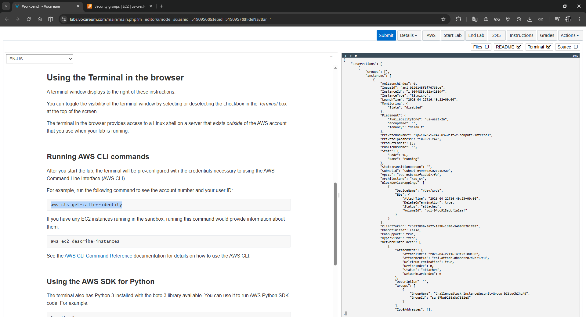
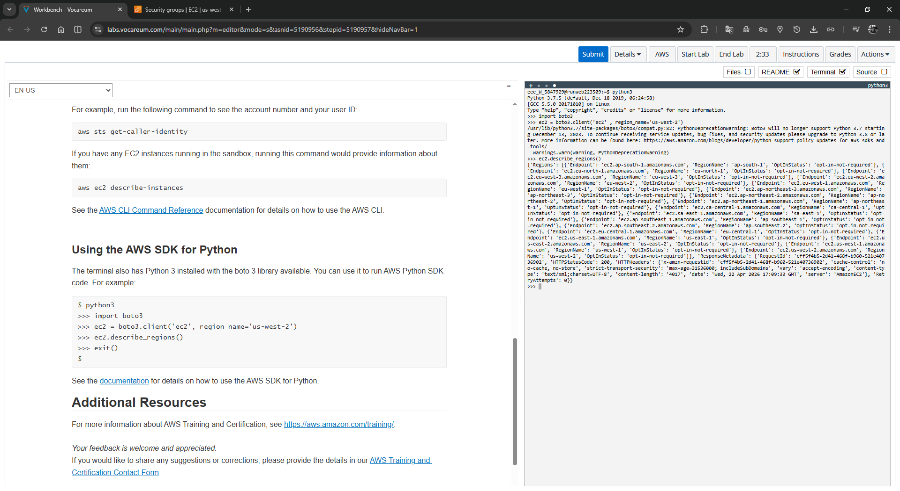
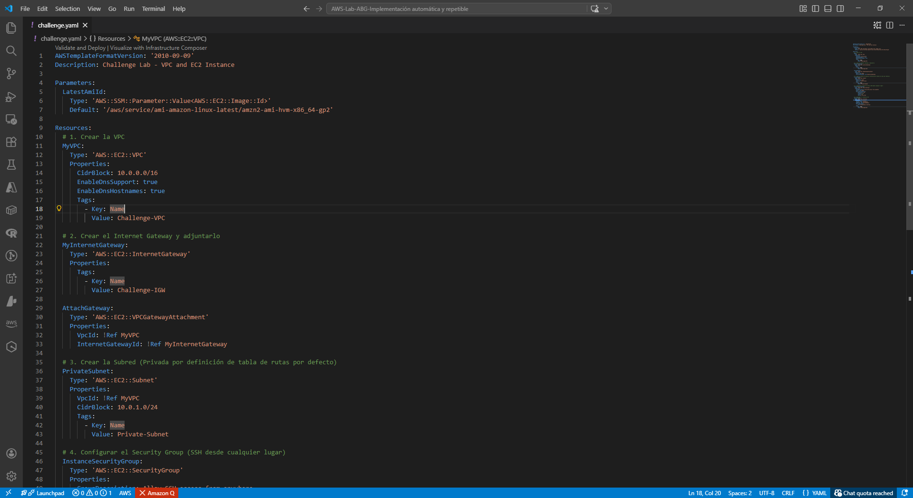
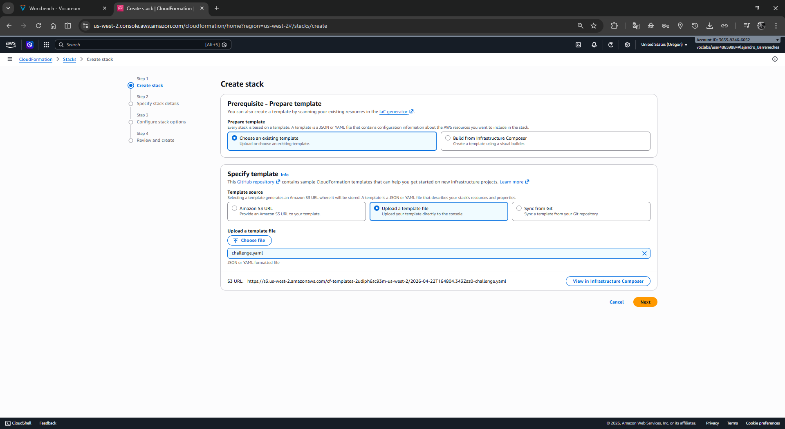
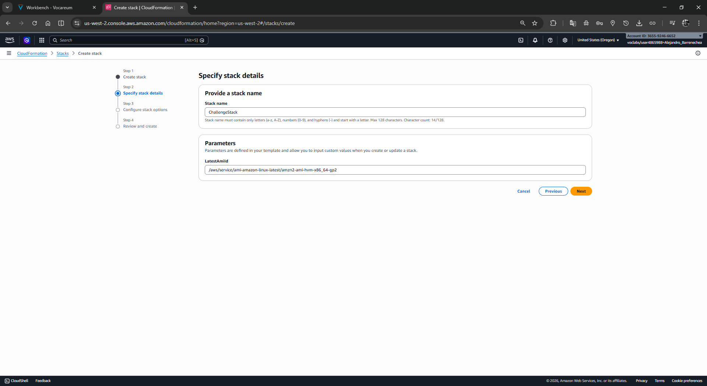
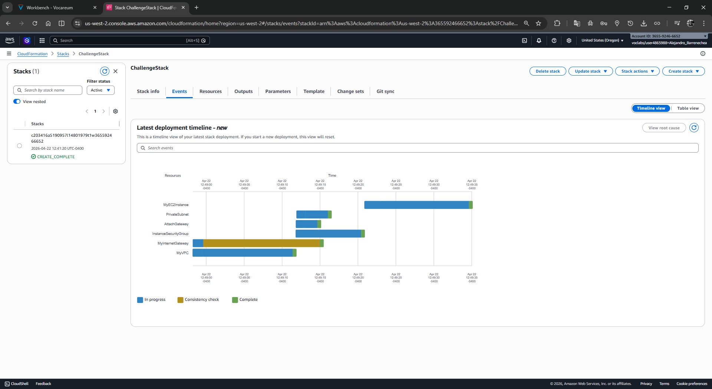
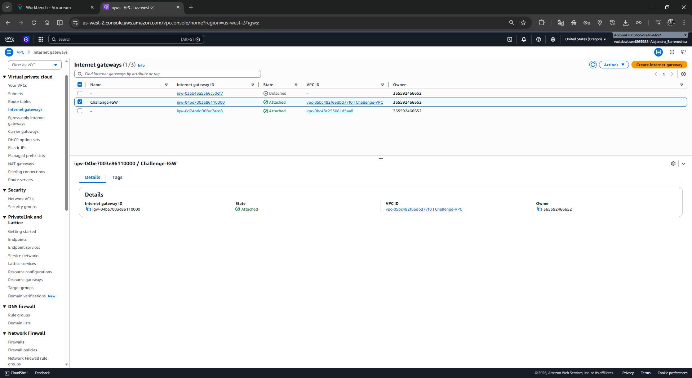
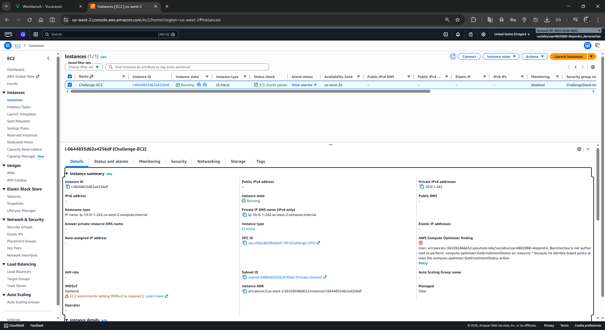

# Lab 192: [Desafío] - Uso de AWS CloudFormation para crear una VPC y una instancia EC2

| Parámetro | Detalle |
| :--- | :--- |
| **Dificultad** | Alta (Challenge Lab) |
| **Tiempo Estimado** | 60 Minutos |
| **Servicios Principales** | AWS CloudFormation, Amazon VPC, Amazon EC2, AWS SDK (Boto3) |

---

## 1. Resumen y Objetivos
Este laboratorio constituye un reto de integración de servicios mediante **Infraestructura como Código (IaC)**. El objetivo es validar el entorno de trabajo mediante herramientas de línea de comandos y programación, para luego diseñar y desplegar una arquitectura de red y cómputo completa.

**Los objetivos específicos son:**
*   Validar la identidad y conectividad del entorno mediante **AWS CLI**.
*   Comprobar la capacidad de automatización utilizando el **AWS SDK para Python (Boto3)**.
*   Diseñar una plantilla YAML de CloudFormation que incluya una VPC, un Internet Gateway, un Security Group y una instancia EC2 en una subred privada.

---

## 2. Análisis del Escenario
El equipo del Café requiere una implementación rápida y estandarizada de un entorno de red. Como profesional de AWS, debes asegurar que las herramientas de gestión (CLI y SDK) estén correctamente configuradas antes de lanzar la infraestructura. El desafío reside en configurar una **VPC** funcional que, aunque contenga una subred privada para la instancia EC2, posea la configuración necesaria para escalar o conectarse a Internet en el futuro.

---

## 3. Arquitectura del Desafío
La solución debe desplegar:
*   **VPC:** Con un bloque CIDR (ej. `10.0.0.0/16`).
*   **Internet Gateway:** Adjunto a la VPC para permitir tráfico externo.
*   **Subred Privada:** Sin ruta directa de salida al IGW para la instancia.
*   **Security Group:** Regla de entrada para SSH (Puerto 22) desde cualquier origen.
*   **EC2 Instance:** Tipo `t3.micro` desplegada en la subred privada.

---

## 4. Desarrollo

### Tarea 1: Verificación del Entorno de Gestión
Antes de crear la plantilla, realiza las comprobaciones de conectividad requeridas por el laboratorio.

#### 1.1 Validación mediante AWS CLI
1.  **Ejecuta la comprobación de identidad:** En la terminal integrada, escribe el siguiente comando para verificar tu ID de usuario y número de cuenta:
    ```bash
    aws sts get-caller-identity
    ```
2.  **Verifica instancias existentes:** Comprueba si hay recursos activos en el entorno:
    ```bash
    aws ec2 describe-instances
    ```

<div align="center">
  
</div>

#### 1.2 Validación mediante AWS SDK (Python/Boto3)
Comprueba que el entorno puede interactuar con la API de AWS de forma programática.
1.  **Entra al intérprete de Python:** Escribe `python3`.
2.  **Ejecuta el script de consulta:** Ingresa las siguientes líneas una por una:
    ```python
    import boto3
    ec2 = boto3.client('ec2', region_name='us-west-2')
    ec2.describe_regions()
    exit()
    ```
    *Nota: Ignora las advertencias de depreciación de Python 3.7; la consulta de regiones debe devolver un JSON con la lista de zonas disponibles.*

<div align="center">
  
</div>

### Tarea 2: Diseño de la Plantilla de CloudFormation
Crea un archivo llamado `challenge.yaml` con la definición de recursos solicitada.

1.  **Define la VPC y el IGW:** Asegura el vínculo mediante un recurso `VPCGatewayAttachment`.
2.  **Configura la Subred y Seguridad:** Define la subred y el Security Group con acceso SSH (Puerto 22).
3.  **Crea la Instancia EC2:** Utiliza un parámetro dinámico para obtener la AMI más reciente de Amazon Linux 2.

<div align="center">
  
</div>

### Tarea 3: Despliegue y Validación en la Consola
1.  **Carga la plantilla:** Ve al servicio **CloudFormation** en la consola de AWS.
2.  **Crea el Stack:** Sube tu archivo `challenge.yaml`, asígnale un nombre (ej. `ChallengeLab`) y completa el despliegue.

<div align="center">
  
</div>
<div align="center">
  
</div>
<div align="center">
  
</div>

3.  **Verifica los recursos:** Navega a la consola de **VPC** y verifica que existe Challenge-VPC y que el IGW está en estado attached.

<div align="center">
  
</div>

4.  **Verifica los recursos:** Navega a la consola de **EC2** y confirma que la instancia está en ejecución dentro de la subred y VPC creadas por el Stack. Confirma que la instancia tiene una dirección IP privada (ej. 10.0.1.x) pero carece de IP pública, cumpliendo el requerimiento de subred privada.

<div align="center">
  
</div>

---

## 5. Respuestas Analíticas del Desafío

*   **¿Cuál es la diferencia entre validar vía CLI y vía SDK?**
    La **CLI** se utiliza para administración rápida y comandos *ad-hoc* por parte de humanos. El **SDK (Boto3)** se utiliza para integrar AWS dentro de aplicaciones o scripts de automatización complejos, permitiendo que el código tome decisiones basadas en la respuesta de la API.
*   **¿Por qué la instancia no es accesible desde Internet si el Security Group tiene SSH abierto?**
    Aunque el Firewall (Security Group) permite el tráfico, la instancia reside en una **subred privada**. Sin una tabla de rutas que apunte al Internet Gateway y sin una IP pública asignada, la instancia permanece aislada del tráfico entrante desde Internet.
*   **¿Qué función cumple `sts get-caller-identity`?**
    Es la forma estándar de verificar que las credenciales cargadas en la terminal son válidas y para conocer exactamente qué usuario de IAM está realizando las peticiones, evitando errores de permisos durante el despliegue del Stack.

---