# 🏷️ Lab: Administración de recursos mediante el etiquetado

**Dificultad:** Intermedio  
**Tiempo Estimado:** 45 minutos  
**Servicios Principales:** Amazon EC2, AWS CLI (JMESPath), AWS SDK for PHP, Amazon VPC, AWS IAM.  

## 🎯 Resumen y Objetivos
En este laboratorio aprenderás a automatizar la administración operativa y la gobernanza de tu infraestructura mediante etiquetas (Tags) y la Interfaz de Línea de Comandos de AWS (AWS CLI). Utilizarás scripts automatizados para modificar metadatos, cambiar el estado de las instancias (detener/iniciar) y aplicar políticas de cumplimiento estricto ("etiquetar o terminar").

**Al finalizar este laboratorio, serás capaz de:**
* Aplicar y modificar etiquetas en recursos de AWS existentes mediante AWS CLI.
* Buscar y filtrar recursos basándote en parámetros de etiquetas y consultas avanzadas (JMESPath).
* Utilizar el SDK de AWS para PHP (o AWS CLI) para detener o terminar instancias EC2 en función de la presencia o el valor de sus etiquetas.

## 🕵️ Análisis del Escenario
**Diagnóstico inicial:** Tu organización posee una arquitectura en la nube con múltiples instancias EC2. Para fines de facturación y despliegue, se han definido tres etiquetas obligatorias: `Project`, `Version` y `Environment`. Sin embargo, la gestión manual se ha vuelto ineficiente. El equipo de TI necesita encontrar rápidamente las instancias de un proyecto específico, actualizar sus versiones de forma masiva, apagar entornos de desarrollo fuera de horario comercial para ahorrar costos y destruir automáticamente los recursos que no cumplan con la política de etiquetado (riesgo de seguridad/gobernanza).

## 🏗️ Arquitectura Lógica y Accesos
El entorno preconfigurado consta de:
* **VPC del Laboratorio (Lab VPC):** Con una subred pública y una subred privada.
* **Command Host (IP: `54.214.155.3`):** Una instancia EC2 Linux en la subred pública que actúa como un servidor de administración, preconfigurado con AWS CLI y scripts de PHP. **Nota de seguridad:** Se autentica de forma transparente en AWS mediante un *IAM Instance Profile*, evitando el uso de claves en texto plano.
* **Ocho (8) Instancias EC2 Linux Privadas:** Desplegadas en la subred privada con las etiquetas personalizadas: `Project`, `Version` (1.0) y `Environment`.

<div align="center">
  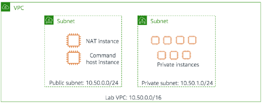
</div>

---

## 🚀 Desarrollo

### Tarea 1: Uso de etiquetas para administrar recursos (Búsqueda y Modificación)

**Paso 1: Conéctate al Command Host mediante SSH**
1. Inicia el laboratorio y descarga tu clave de acceso (`labsuser.pem` o `labsuser.ppk`) desde el panel de credenciales (Details > Show).
2. **Para Windows (PuTTY):** Configura la conexión SSH utilizando la IP pública **`54.214.155.3`**, el usuario `ec2-user` y tu archivo `.ppk`.
3. **Para Mac/Linux (Terminal):** Navega al directorio donde descargaste la clave, ajusta los permisos y conéctate usando la IP especificada:
   ```bash
   chmod 400 labsuser.pem
   ssh -i labsuser.pem ec2-user@54.214.155.3
   ```
   *(Escribe `yes` cuando se te solicite confirmar la huella del servidor).*

**Paso 2: Filtra instancias por Proyecto (ERPSystem)**
1. Desde la terminal del Command Host, extrae **solo los IDs de las instancias** utilizando el motor de consultas JMESPath integrado en el CLI (`--query`):
   ```bash
   aws ec2 describe-instances --filter "Name=tag:Project,Values=ERPSystem" --query 'Reservations[*].Instances[*].InstanceId'
   ```

<div align="center">
  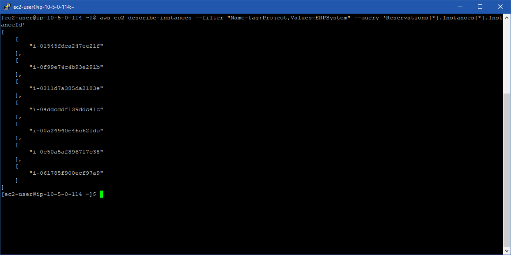
</div>

2. Amplía la consulta para obtener el ID, la Zona de Disponibilidad y los valores exactos de las etiquetas usando alias:
   ```bash
   aws ec2 describe-instances \
   --filter "Name=tag:Project,Values=ERPSystem" \
   --query 'Reservations[*].Instances[*].{ID:InstanceId,AZ:Placement.AvailabilityZone,Project:Tags[?Key==`Project`] | [0].Value,Environment:Tags[?Key==`Environment`] | [0].Value,Version:Tags[?Key==`Version`] | [0].Value}'
   ```

<div align="center">
  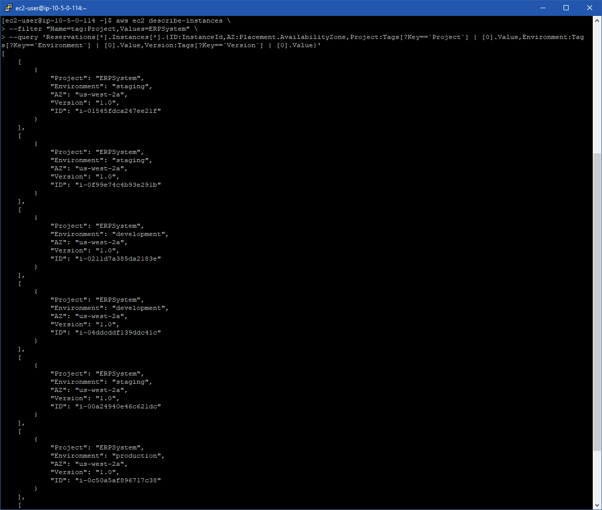
</div>

3. Agrega un segundo filtro para listar solo las instancias de `development` (desarrollo):
   ```bash
   aws ec2 describe-instances \
   --filter "Name=tag:Project,Values=ERPSystem" "Name=tag:Environment,Values=development" \
   --query 'Reservations[*].Instances[*].{ID:InstanceId,AZ:Placement.AvailabilityZone,Project:Tags[?Key==`Project`] | [0].Value,Environment:Tags[?Key==`Environment`] | [0].Value,Version:Tags[?Key==`Version`] | [0].Value}'
   ```

<div align="center">
  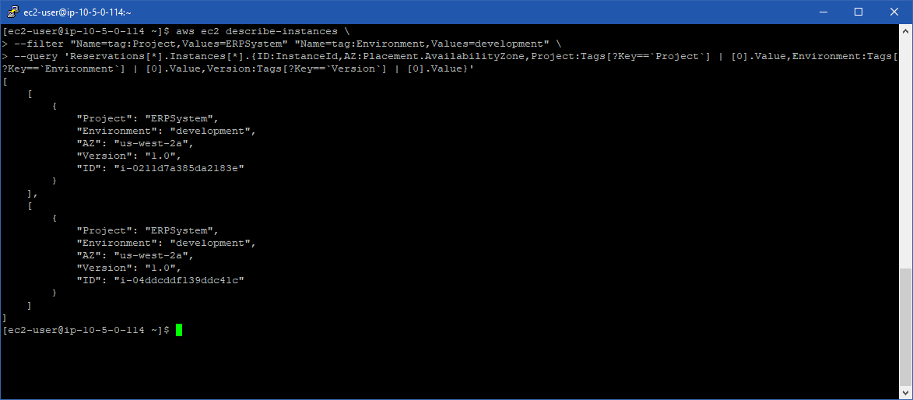
</div>

**Paso 3: Actualiza la etiqueta "Version" masivamente**
1. Abre el script preconfigurado utilizando el editor `nano`:
   ```bash
   nano change-resource-tags.sh
   ```

<div align="center">
  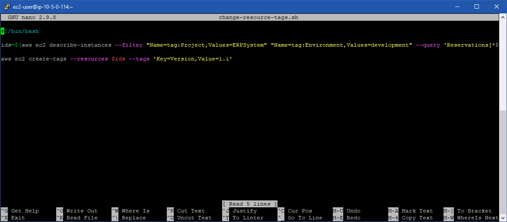
</div>

2. Cierra el editor (`Ctrl + X`) y ejecuta el script (esto actualizará la versión de 1.0 a 1.1 en las instancias filtradas):
   ```bash
   ./change-resource-tags.sh
   ```
3. Verifica los cambios ejecutando este comando de consulta para listar nuevamente las instancias de desarrollo y comprueba que la etiqueta `"Version"` ahora tenga el valor `"1.1"`:
   ```bash
   aws ec2 describe-instances \
   --filter "Name=tag:Project,Values=ERPSystem" "Name=tag:Environment,Values=development" \
   --query 'Reservations[*].Instances[*].{ID:InstanceId,AZ:Placement.AvailabilityZone,Project:Tags[?Key==`Project`] | [0].Value,Environment:Tags[?Key==`Environment`] | [0].Value,Version:Tags[?Key==`Version`] | [0].Value}'
   ```

<div align="center">
  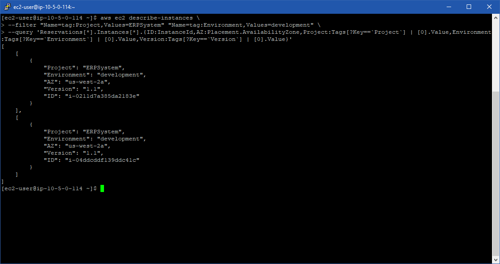
</div>

---

### Tarea 2: Detener e iniciar recursos mediante etiquetas (Cost Optimization)

1. Ingresa al directorio de herramientas:
   ```bash
   cd ~/aws-tools
   ```
2. Inspecciona el script de apagado:
   ```bash
   nano stopinator.php
   ```

<div align="center">
  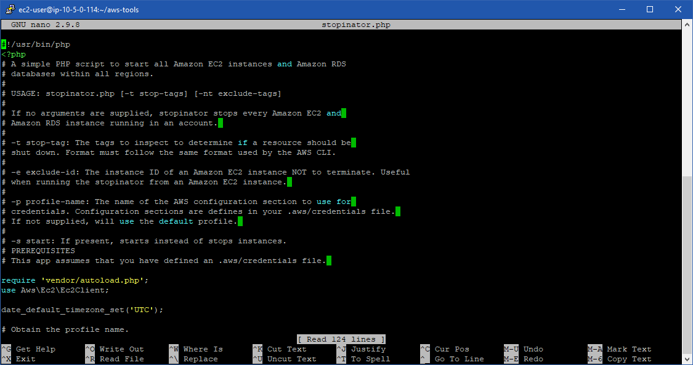
</div>

3. Cierra el editor y **detén** el entorno de desarrollo ejecutando:
   ```bash
   ./stopinator.php -t"Project=ERPSystem;Environment=development"
   ```
4. Navega a la **Consola de EC2** > **Instancias** y verifica visualmente que las dos instancias correspondientes están en estado `Stopping` o `Stopped`.

<div align="center">
  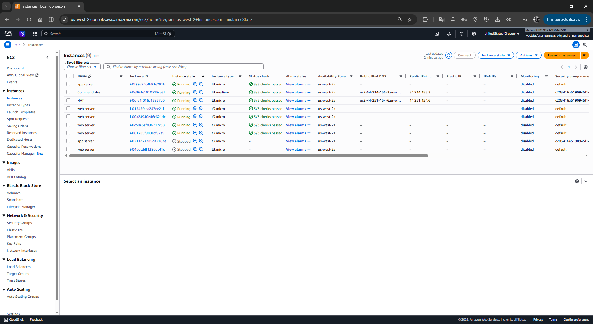
</div>

5. Regresa a tu terminal SSH y **reinicia** el entorno agregando el parámetro `-s`:
   ```bash
   ./stopinator.php -t"Project=ERPSystem;Environment=development" -s
   ```
---

### Tarea 3: Desafío: Finalizar instancias no conformes (Tag-or-Terminate)

Debes implementar una política estricta: cualquier instancia en la subred privada que no tenga la etiqueta `Environment` se considera un riesgo de seguridad/gobernanza y debe ser destruida (*Terminated*).

**Paso 1: Simula la no conformidad (riesgo de seguridad)**
1. Ve a la consola de **EC2** > **Instancias**.
2. Selecciona una de las instancias de tu subred privada, ve a la pestaña **Tags** (Etiquetas) y haz clic en **Manage tags** (Administrar etiquetas).
3. Elimina la etiqueta `Environment` y guarda los cambios. **Repite** este proceso para una segunda instancia. 

<div align="center">
  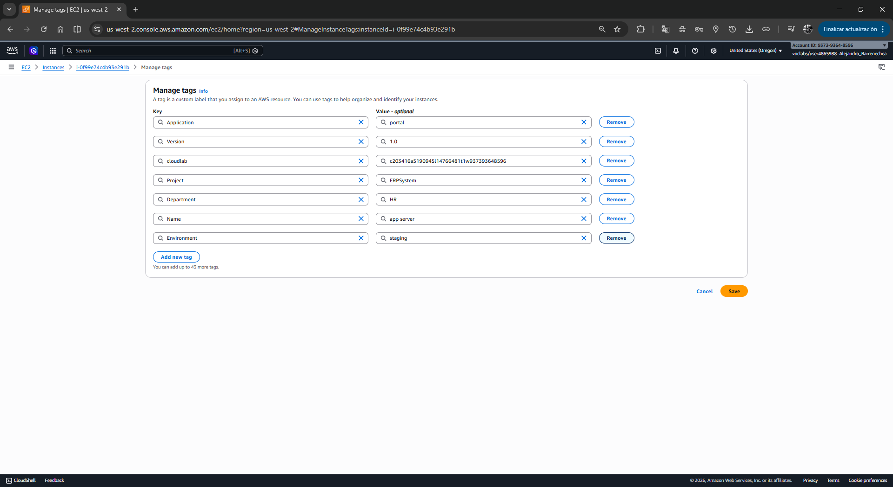
</div>

**Paso 2: Identifica la Región y la Subred**
1. Selecciona cualquier instancia de tu subred privada en la consola.
2. En la pestaña **Details** (Detalles), identifica tu **Región** (ej. si la zona de disponibilidad es `us-east-1a`, tu región es `us-east-1`).

<div align="center">
  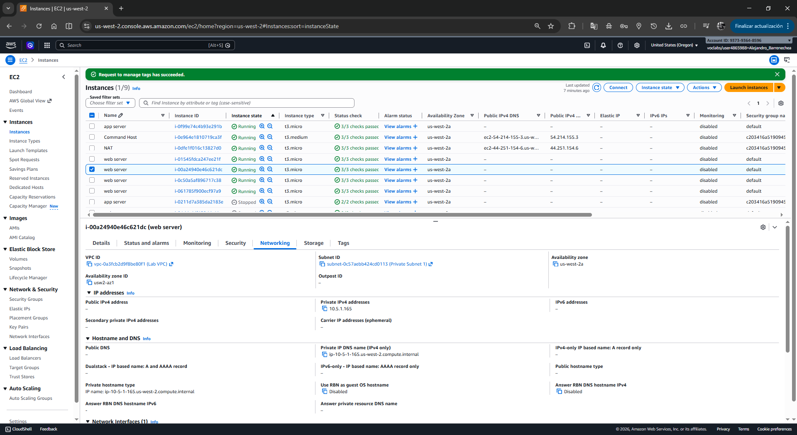
</div>

3. Localiza y copia el **Subnet ID** (ID de subred, ej. `subnet-0abcd1234efgh5678`).

<div align="center">
  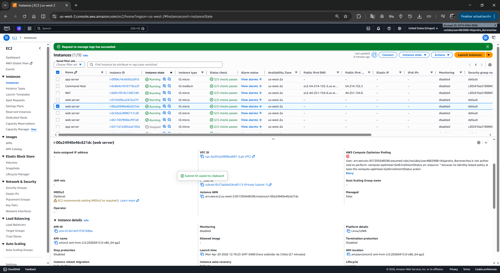
</div>

**Paso 3: Ejecuta la política de terminación**
1. En tu terminal SSH (dentro de la carpeta `~/aws-tools`), analiza el script de terminación:
   ```bash
   nano terminate-instances.php
   ```

<div align="center">
  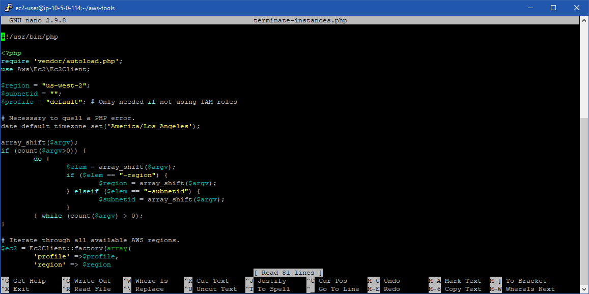
</div>

2. Ejecuta el script reemplazando los valores por los de tu entorno:
   ```bash
   ./terminate-instances.php -region <tu-region> -subnetid <tu-subnet-id>
   ```
3. El script indicará: `Terminating instances... Instances terminated`.

<div align="center">
  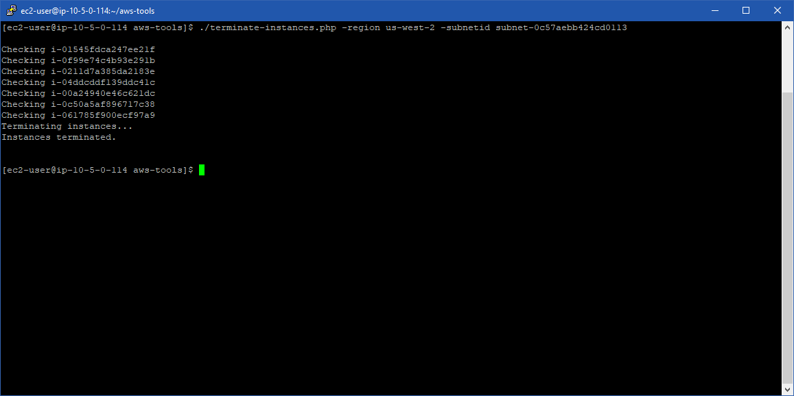
</div>

4. Ve a la Consola de EC2 y confirma que las dos instancias a las que les quitaste la etiqueta ahora están en estado **Terminated** (Terminada).

<div align="center">
  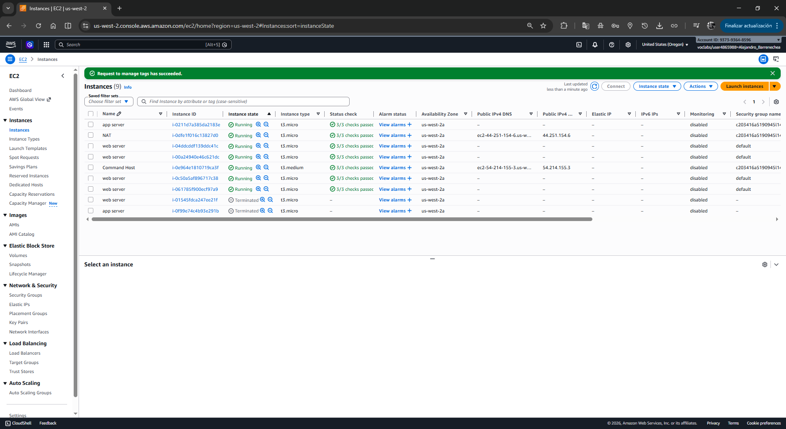
</div>

---

## 💡 Respuestas Analíticas a Conceptos del Laboratorio

**1. ¿Por qué el laboratorio no solicitó utilizar el Access Key y Secret Key proporcionados?**
*Respuesta:* Por seguridad. Al ejecutar comandos en una instancia EC2 (CommandHost) dentro de AWS, la mejor práctica es asignarle un **IAM Role**. Las credenciales temporales se rotan automáticamente y no necesitas guardarlas en texto plano. Las claves proporcionadas en la pantalla de "Detalles" existen por si un desarrollador necesita ejecutar comandos usando `aws configure` desde su estación de trabajo local (fuera de la VPC).

**2. ¿Por qué utilizar el parámetro `--query` con JMESPath en AWS CLI en lugar del formato de salida normal?**
*Respuesta:* El comando de salida estándar en EC2 devuelve toda la metadata del recurso. Utilizar `--query` con **JMESPath** te permite filtrar exactamente los datos que necesitas (ej. solo el ID y 3 etiquetas), optimizando la lectura y permitiendo canalizar (pipe) estos datos hacia otros scripts de automatización con `--output text`.

**3. ¿Cómo mejora la postura de seguridad y gobernanza la implementación de un script como `terminate-instances.php`?**
*Respuesta:* Las instancias sin etiquetar (recursos huérfanos o *Shadow IT*) representan un grave riesgo. Si no tienen etiqueta de entorno/proyecto, no se sabe quién es el dueño, a qué centro de costos asignarle el gasto ni qué nivel de acceso debe tener. Un script *Tag-or-Terminate* fuerza el cumplimiento (*Compliance*): destruye automáticamente el recurso no conforme para evitar fugas de presupuesto y vulnerabilidades.