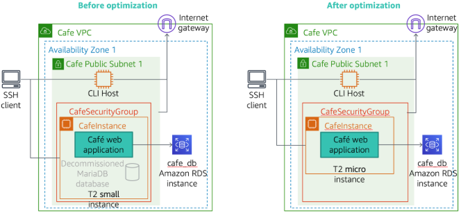
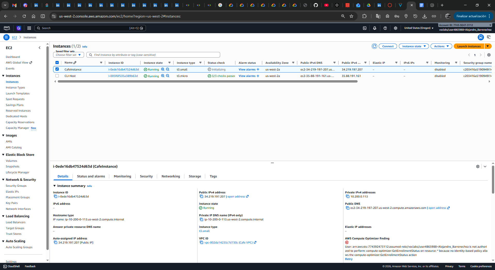
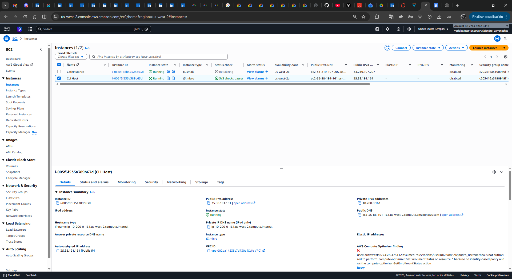
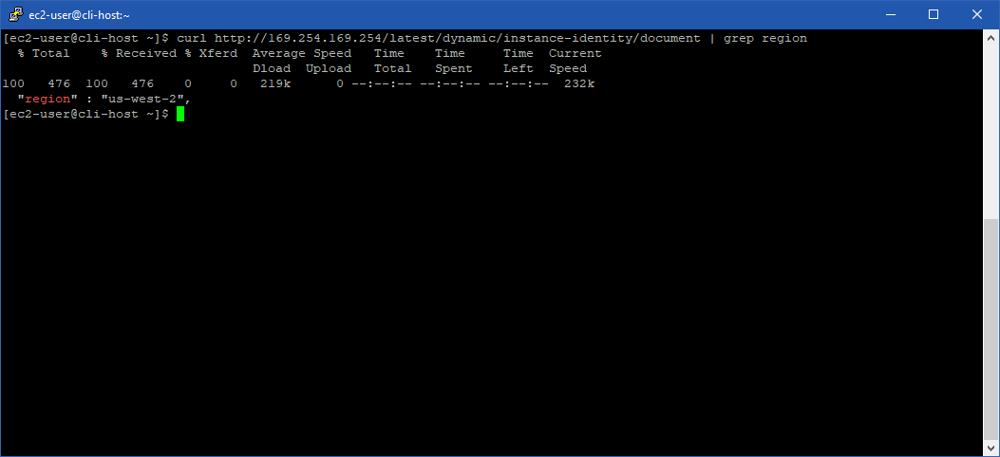
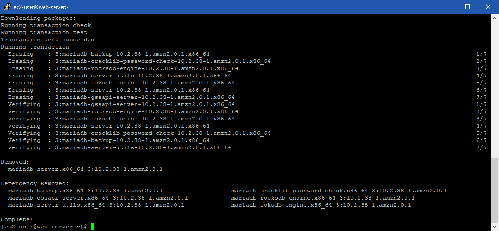
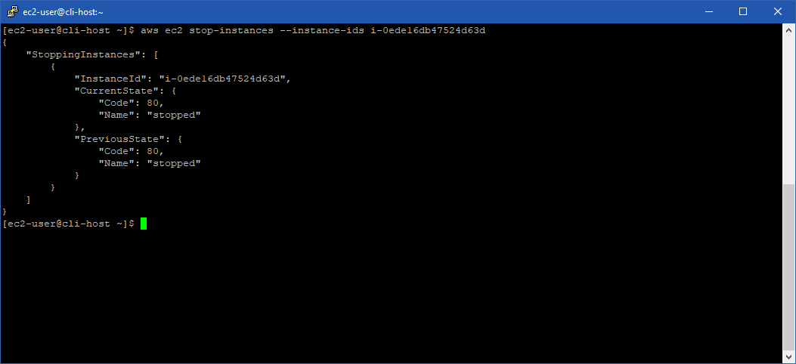
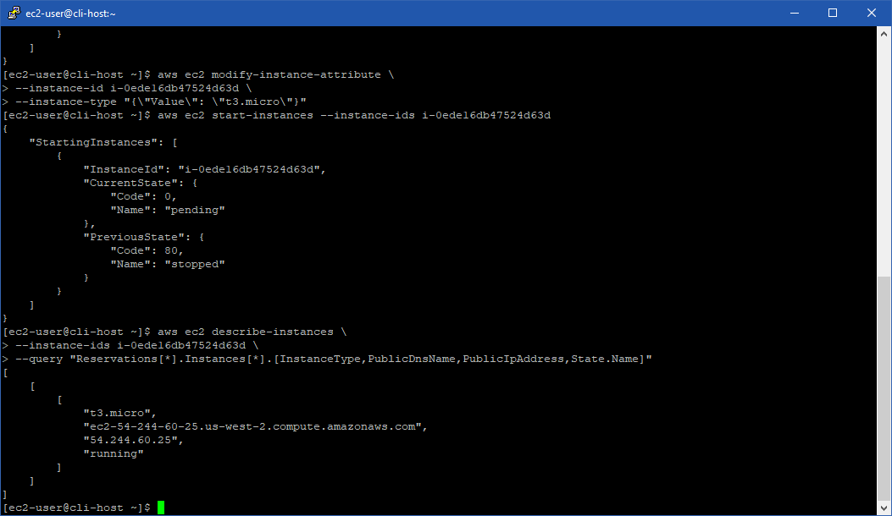
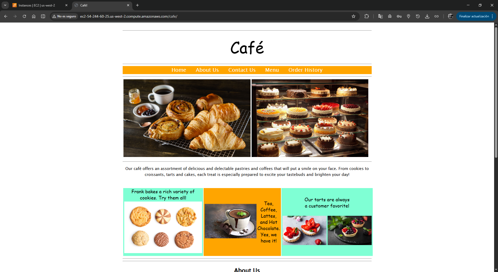
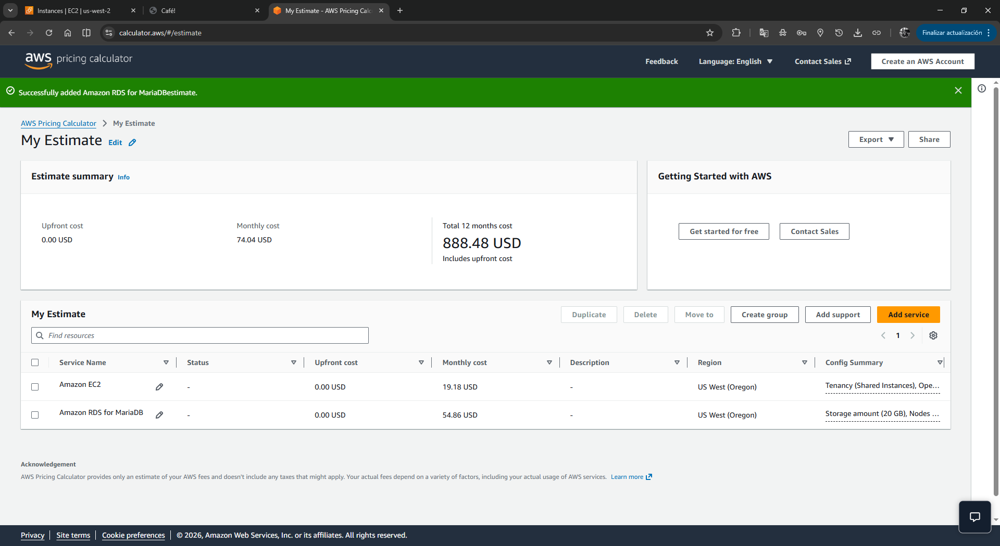
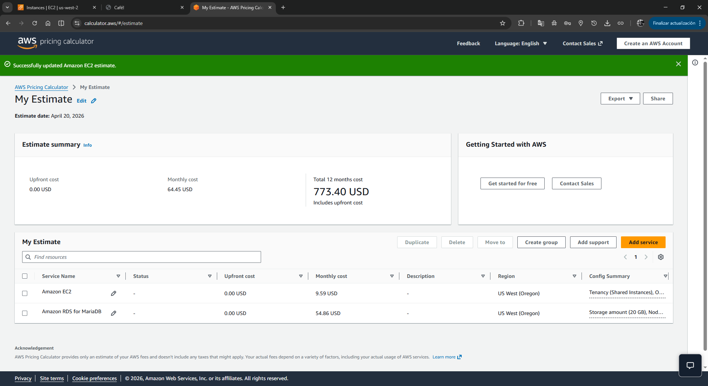

# ☕ Lab 189: Optimizar la utilización (Rightsizing y Costos)

**Dificultad:** Intermedio  
**Tiempo Estimado:** 50 minutos  
**Servicios Principales:** Amazon EC2, AWS CLI, AWS Pricing Calculator, Amazon RDS.  

## 🎯 Resumen y Objetivos
En esta actividad, optimizarás los recursos de AWS que se utilizan para ejecutar la aplicación web de un cliente (Café). Aprenderás a identificar recursos sobreaprovisionados y a aplicar técnicas de *Rightsizing* (ajuste de tamaño) para reducir el gasto mensual sin afectar el rendimiento de la aplicación.

**Al finalizar este laboratorio, serás capaz de:**
* Optimizar una instancia de Amazon EC2 desinstalando software innecesario y reduciendo su tamaño de cómputo (cambio de familia/tamaño de instancia).
* Utilizar la Interfaz de Línea de Comandos de AWS (AWS CLI) para detener, modificar y reiniciar instancias.
* Utilizar la **AWS Pricing Calculator** para estimar, comparar y documentar los costos de los servicios de AWS antes y después de una optimización.

## 🕵️ Análisis del Escenario
**Diagnóstico inicial:** El cliente "Café" ejecutaba originalmente su aplicación web y su base de datos local (MariaDB) dentro de una misma instancia EC2 de tamaño `t3.small`. En un proyecto anterior, la base de datos fue migrada exitosamente a un servicio administrado (Amazon RDS). 
Actualmente, la instancia EC2 sigue siendo de tamaño `t3.small` y mantiene el motor de base de datos instalado consumiendo espacio de almacenamiento, lo que significa que el cliente está pagando por cómputo y almacenamiento (EBS) que ya no necesita.

**Solución propuesta:** 
1. Eliminar el motor de base de datos local de la instancia EC2.
2. Reducir el tamaño de la instancia de `t3.small` a `t3.micro` (*Rightsizing*).
3. Calcular y presentar el ahorro de costos proyectado utilizando la calculadora de AWS.

## 🏗️ Arquitectura Lógica
* **Antes de la optimización:** EC2 `t3.small` (App Web + MariaDB inactivo) + 40 GB EBS + Amazon RDS `db.t3.micro`.
* **Después de la optimización:** EC2 `t3.micro` (Solo App Web) + 20 GB EBS + Amazon RDS `db.t3.micro`.
* **Herramienta de Administración:** Instancia EC2 adicional llamada *CLI Host*, utilizada para ejecutar comandos remotos contra la infraestructura.

<div align="center">
  
</div>


---

## 🚀 Desarrollo de las Tareas

### Tarea 1: Preparación y Autenticación
En este laboratorio utilizarás dos terminales SSH distintas: una para entrar al servidor web (`CafeInstance`) y otra para el servidor de administración (`CLI Host`).

**Paso 1: Identifica las direcciones IP**
1. Inicia el laboratorio y accede a la **Consola de AWS**.
2. Navega al servicio **EC2** > **Instances**.
3. Selecciona la instancia **CafeInstance** y copia su dirección **IPv4 Pública**.
4. Selecciona la instancia **CLI Host** y copia también su dirección **IPv4 Pública**.

<div align="center">
  
</div>
<div align="center">
  
</div>

5. Descarga tu clave de acceso (`labsuser.pem` o `labsuser.ppk`) desde el panel de detalles del laboratorio.

**Paso 2: Conéctate a la CafeInstance (Terminal 1)**
1. Abre tu cliente SSH (PuTTY o Terminal local).
2. Conéctate a la **CafeInstance**:
   ```bash
   ssh -i labsuser.pem ec2-user@<IP-Publica-CafeInstance>
   ```

**Paso 3: Conéctate al CLI Host y configura AWS CLI (Terminal 2)**
1. Abre una **nueva ventana** de terminal.
2. Conéctate al **CLI Host**:
   ```bash
   ssh -i labsuser.pem ec2-user@<IP-Publica-CLI-Host>
   ```
3. Descubre en qué región está operando este host ejecutando:
   ```bash
   curl http://169.254.169.254/latest/dynamic/instance-identity/document | grep region
   ```

<div align="center">
  
</div>

4. Configura las credenciales de AWS CLI (obtén el *Access Key* y *Secret Key* del panel de tu laboratorio):
   ```bash
   aws configure
   ```
   * **AWS Access Key ID:** *(Pega tu Access Key)*
   * **AWS Secret Access Key:** *(Pega tu Secret Key)*
   * **Default region name:** *(Ingresa la región obtenida en el paso 3, ej. `us-east-1`)*
   * **Default output format:** `json`

---

### Tarea 2: Desinstalar MariaDB (CafeInstance)
Liberarás espacio y carga de CPU eliminando el motor de base de datos local que ya no se utiliza.

1. Ve a la **Terminal 1 (CafeInstance)**.
2. Detén el servicio de base de datos local:
   ```bash
   sudo systemctl stop mariadb
   ```
3. Desinstala el software del servidor:
   ```bash
   sudo yum -y remove mariadb-server
   ```
   *(Espera a ver el mensaje `Complete!`)*.
4. Cierra la conexión de esta terminal (puedes escribir `exit`), ya que no la necesitarás más.

<div align="center">
  
</div>

---

### Tarea 3: Modificar el tipo de instancia - Rightsizing (CLI Host)
Ahora usarás el servidor de administración para detener la aplicación, cambiar su hardware virtual y volver a encenderla.

1. Ve a la **Terminal 2 (CLI Host)**.
2. Comprueba el **ID de la Instancia** de la CafeInstance ejecutando esta consulta:
   ```bash
   aws ec2 describe-instances \
   --filters "Name=tag:Name,Values=CafeInstance" \
   --query "Reservations[*].Instances[*].InstanceId"
   ```
3. **Detén** la CafeInstance:
   ```bash
   aws ec2 stop-instances --instance-ids i-0ede16db47524d63d
   ```

<div align="center">
  
</div>

4. **Modifica el tipo de instancia** para reducirla a `t3.micro`:
   ```bash
   aws ec2 modify-instance-attribute \
   --instance-id i-0ede16db47524d63d \
   --instance-type "{\"Value\": \"t3.micro\"}"
   ```
   *(Nota: Si el comando es exitoso, no devolverá ninguna salida en pantalla).*

<div align="center">
  
</div>

5. **Inicia** nuevamente la CafeInstance:
   ```bash
   aws ec2 start-instances --instance-ids i-0ede16db47524d63d
   ```
6. Verifica el estado y obtén la nueva IP pública y DNS generados:
   ```bash
   aws ec2 describe-instances \
   --instance-ids i-0ede16db47524d63d \
   --query "Reservations[*].Instances[*].[InstanceType,PublicDnsName,PublicIpAddress,State.Name]"
   ```
   *(Repite este comando hasta que el estado muestre `running`. Copia el nuevo `PublicDnsName`)*.

<div align="center">
  
</div>

7. Abre un navegador web e ingresa a `http://<Nuevo-PublicDnsName>/cafe` para confirmar que la aplicación sigue funcionando correctamente con sus nuevos recursos.

<div align="center">
  
</div>

---

### Tarea 4: Estimar los ahorros con AWS Pricing Calculator
Demostrarás el impacto financiero de tus acciones simulando el entorno antes y después.

**Paso 1: Costo "Antes de la optimización"**
1. Abre un navegador y navega a [https://calculator.aws](https://calculator.aws).
2. Haz clic en **Create estimate** (Crear estimación).
3. Busca **Amazon EC2** y haz clic en **Configure**.
4. Configura los parámetros iniciales:
   * **Region:** Selecciona la región de tu laboratorio.
   * **Operating system:** Linux
   * **Workload:** Constant usage (Uso constante), 1 instance.
   * **Instance type:** Busca y selecciona `t3.small`.
   * **Pricing strategy:** On-Demand (Bajo demanda).
   * **EBS Storage:** General Purpose SSD (gp2), **40 GB**.
5. Haz clic en **Add to my estimate**.
6. Haz clic en **Add service** nuevamente, busca **Amazon RDS for MariaDB** y configúralo:
   * **Instance type:** `db.t3.micro`.
   * **Deployment option:** Single-AZ.
   * **Storage:** General Purpose SSD (gp2), **20 GB**.
7. Haz clic en **Add to my estimate**.
8. Observa el total (aprox. **$74.04 / mes**).

<div align="center">
  
</div>

**Paso 2: Costo "Después de la optimización"**
1. En la página de tu estimación actual, haz clic en el botón **Edit** (Editar) junto al servicio Amazon EC2.
2. Cambia los siguientes valores:
   * **Instance type:** Busca y selecciona `t3.micro`.
   * **EBS Storage:** Reduce el tamaño a **20 GB**.
3. Haz clic en **Save** (Guardar).
4. Observa el nuevo total (aprox. **$64.45 / mes**).

<div align="center">
  
</div>

**Conclusión Financiera:** 
Al comparar ambos reportes, has logrado una reducción de costos mensual de aproximadamente **$10 USD**, optimizando la infraestructura sin impactar la experiencia del usuario final.

---

## 💡 Respuestas Analíticas a Conceptos del Laboratorio

**1. ¿Por qué fue necesario detener (`stop-instances`) la CafeInstance antes de cambiar su tamaño a `t3.micro`?**
*Respuesta:* En AWS, no es posible cambiar el tipo de instancia (Hardware virtual subyacente como CPU y RAM) mientras la instancia está en estado *running*. Detener la instancia permite que AWS la migre a un host físico diferente en el centro de datos que tenga la capacidad para soportar la nueva familia/tamaño de instancia configurada.

**2. ¿Por qué cambió la dirección IP Pública y el DNS de la CafeInstance al reiniciarla?**
*Respuesta:* Al detener e iniciar una instancia EC2, AWS libera la IP Pública dinámica que tenía asignada y le otorga una nueva desde su pool de direcciones. Si el cliente necesita que la IP se mantenga estática permanentemente (incluso tras reinicios o cambios de tamaño), se debe aprovisionar y asociar una **Elastic IP (IP Elástica)**, lo cual es una mejor práctica para servidores web front-end.

**3. ¿Cuál es el propósito empresarial de utilizar la AWS Pricing Calculator?**
*Respuesta:* El *Rightsizing* no solo es un ejercicio técnico, es una decisión de negocio. La calculadora permite a los ingenieros de nube y arquitectos presentar casos de negocio (*Business Cases*) basados en datos al equipo de Finanzas (FinOps). Exportar las estimaciones a formato CSV permite justificar presupuestos, planificar migraciones y demostrar el retorno de inversión (ROI) antes de ejecutar comandos destructivos o modificaciones en la infraestructura real.