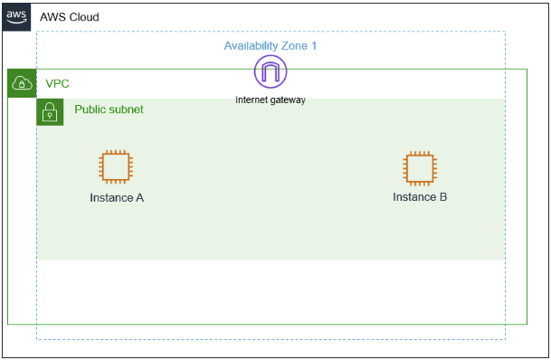
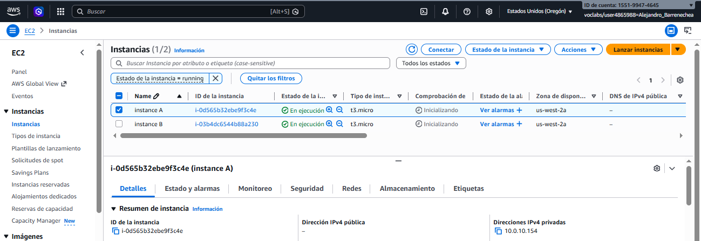
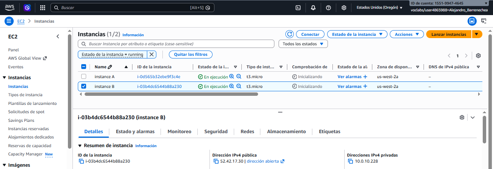
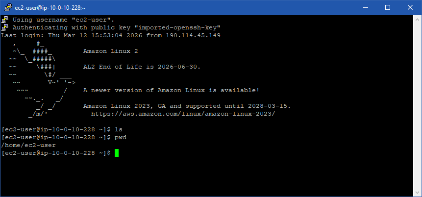
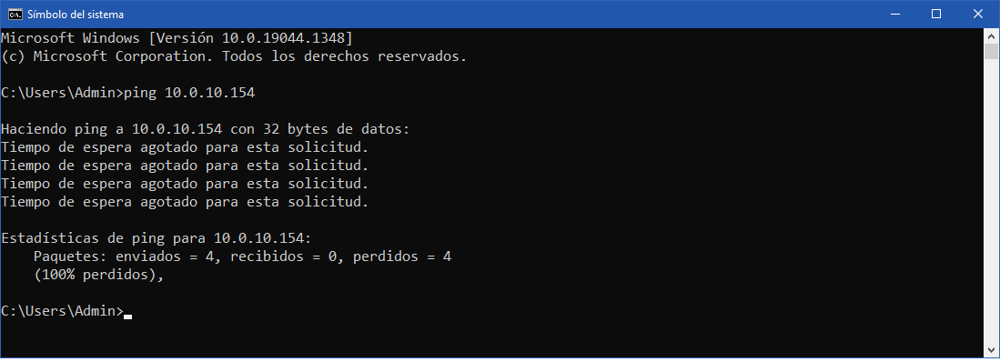

# ☁ Lab 261: Direcciones IP públicas y privadas

**Nivel de Dificultad:** 🟢 Básico 

**Tiempo Estimado:** ⏱ 1 hora

**Servicios Principales:** Amazon VPC (Subredes, IGW), Amazon EC2

### 📑 Resumen del Laboratorio
Este laboratorio se presenta como un escenario práctico de soporte técnico. Como Ingeniero de Soporte Cloud en AWS, debes asistir a una empresa de la lista Fortune 500 (representada por Jess, Cloud Admin) con un problema de redes. 

El cliente tiene dos instancias EC2 en la misma subred de una VPC, pero solo una tiene acceso a Internet. Además, el cliente consulta sobre la viabilidad de utilizar un bloque CIDR público (`12.0.0.0/16`) para crear una nueva VPC. El laboratorio se centra en investigar este escenario, comprender empíricamente la función del enrutamiento y la diferencia vital entre el direccionamiento IP público y privado dentro de la infraestructura de AWS.

### 🎯 Objetivos de Aprendizaje
Al finalizar este laboratorio, serás capaz de:
1.  **Resumir e investigar** el escenario del cliente mediante la exploración de la consola de AWS.
2.  **Analizar la diferencia** fundamental entre una dirección IP privada (interna) y una dirección IP pública (enrutable en Internet).
3.  **Desarrollar una solución** práctica para restablecer la conectividad a Internet de los recursos afectados.
4.  **Resumir y describir** tus hallazgos técnicos de manera profesional (actividad grupal).

### 🏗 Arquitectura del Laboratorio
El entorno inicial preconfigurado por AWS consta de:
*   **Availability Zone (Zona de Disponibilidad):** Todo el despliegue reside en una sola AZ.
*   **Amazon VPC:** Una Virtual Private Cloud configurada con el bloque CIDR `10.0.0.0/16`.
*   **Internet Gateway (IGW):** Acoplado a la VPC para permitir la comunicación bidireccional con el exterior.
*   **Public Subnet:** Una única subred pública dentro de la VPC.
*   **Amazon EC2 Instances:** Dos máquinas virtuales (Instancia A e Instancia B) desplegadas dentro de la misma subred pública, pero con comportamientos de red diferentes.

  

***

### 📝 Tarea 1: Investigación del entorno

Para diagnosticar el problema reportado por Jess (la Instancia A no tiene acceso a Internet), realicé los siguientes pasos de verificación (troubleshooting) directamente en la Consola de AWS:

**Paso 1: Navegar al panel de EC2**
1. En la Consola de Administración de AWS, utilicé la barra de búsqueda superior y escribí **"EC2"**.
2. Seleccioné el servicio **EC2** bajo la categoría *Compute*.
3. En el panel de navegación izquierdo, hice clic en **"Instances"** (Instancias) para ver los recursos informáticos desplegados en la VPC.

**Paso 2: Inspeccionar la configuración de red de la Instancia A**
1. En la lista de instancias, seleccioné la casilla de verificación junto a **"instance A"**.
2. En el panel inferior de detalles, seleccioné la pestaña **"Networking"** (Redes).
3. Localicé la sección *Networking details* y registré los siguientes valores:

  

**Paso 3: Inspeccionar la configuración de red de la Instancia B (para comparar)**
1. Desmarqué la "instance A" y seleccioné la casilla junto a **"instance B"**.
2. Nuevamente, fui a la pestaña **"Networking"** (Redes) en el panel inferior.
3. Registré sus valores:

  

**Paso 4: Análisis y Hallazgos**

La diferencia clave es que, a pesar de estar en la misma subred y compartir la misma configuración de seguridad y enrutamiento subyacente, **la Instancia B tiene asignada una Dirección IP Pública (Public IPv4 address) y la Instancia A no la tiene.** 
    Esta es la causa raíz de por qué la Instancia A no puede comunicarse con Internet, ya que el *Internet Gateway* requiere una IP pública en la instancia para poder realizar la traducción de direcciones (NAT) hacia el exterior.

***

### 📝 Tarea 2: Conexión SSH a una instancia de Amazon EC2

Para validar la conectividad de la arquitectura y acceder a la Instancia B (que es la única con acceso desde el exterior), realicé los siguientes pasos de conexión utilizando el cliente SSH **PuTTY** en Windows:

**Paso 1: Obtener las credenciales y la IP de acceso**
1. En la interfaz del laboratorio seleccione el botón **"Details"** y luego **"Show"**.
2. Se abre la ventana *Credentials*.
3. Clic en el botón **"Download PPK"** para descargar el archivo de clave privada (`labsuser.ppk`). Este archivo es la llave de autenticación segura.
4. Copie el valor que aparece en la línea **PublicIP**.
5. Cerré el panel de detalles haciendo clic en la **"X"**.

**Paso 2: Configurar la conexión SSH en PuTTY**
1. En la aplicación **PuTTY** en local (Windows).
2. En la categoría **"Session"** del panel izquierdo, configure los siguientes campos:
   * **Host Name (or IP address):** Ingresé la dirección **PublicIP** copiada en el paso anterior (Instancia B).
   * **Port:** `22`.
   * **Connection type:** `SSH`.
3. Para configurar la autenticación, navegué en el panel izquierdo expandiendo **"Connection"**, luego **"SSH"**, luego **"Auth"** y finalmente seleccioné **"Credentials"**.
4. En el campo *"Private key file for authentication"*, clic en **"Browse..."**.
5. Busque y seleccioné el archivo **`labsuser.ppk`** de descarga en el Paso 1.

**Paso 3: Iniciar la sesión y conectarse**
1. Vuelva a la categoría **"Session"** en el panel superior izquierdo.
2. (Opcional pero recomendado): En el campo *Saved Sessions*, escriba "Lab_Instancia_B" y presioné **"Save"** para no tener que volver a configurar esto si necesito entrar de nuevo.
3. Clic en **"Open"** en la parte inferior de la ventana de PuTTY.
4. Aparece una alerta de seguridad de PuTTY preguntando si confiaba en el host. Hice clic en **"Accept"** o "Yes" para agregar la clave del servidor a la caché.
5. En la terminal, apareció el mensaje `login as:`.
6. La conexión se estableció exitosamente utilizando la clave pública (`labsuser.ppk`), confirmando que **la Instancia B es accesible desde Internet.**

***

### 🛠️ Verificación de Conectividad mediante SSH (Windows / PuTTY)

---

#### Prueba 1: Conexión exitosa a la Instancia B (Con IP Pública)

  

---

#### Prueba 2: Intento fallido de conexión a la Instancia A (Sin IP Pública)

Al intentar hacer ping a la IP privada (`10.0.10.100`) desde mi computadora, la solicitud fallaría de inmediato, ya que esa dirección solo es válida y enrutable *dentro* de la red virtual de la VPC en AWS.

  

### 📝 Tarea 3: Respuesta al Cliente - Actividad Grupal

**Rol:** Cloud Support Engineer

**Cliente:** Jess, Cloud Admin de una empresa Fortune 500

---

**Respuesta Formal al Ticket de Soporte:**

Hola Jess,

Gracias por contactar al equipo de Cloud Support de AWS. He revisado la arquitectura de red que nos adjuntaste y he realizado un análisis detallado de tu entorno, específicamente de la VPC (`10.0.0.0/16`) y las dos instancias EC2 (A y B) que mencionas.

Tengo las respuestas y soluciones a ambos problemas que nos planteaste:

#### 1. Sobre la falta de conexión a Internet en la Instancia A:

He investigado la configuración de ambas instancias y he encontrado la causa raíz. 

*   **El Diagnóstico:** Como bien mencionaste, ambas instancias están en la misma VPC y comparten la misma Subred Pública y configuraciones de enrutamiento (lo que significa que la ruta hacia el *Internet Gateway* está correcta). Sin embargo, al revisar la pestaña de *Networking* de cada servidor, noté una diferencia crucial: **La Instancia B tiene asignada una Dirección IPv4 Pública, pero la Instancia A no la tiene.**
*   **La Explicación Técnica:** Para que un recurso dentro de una VPC pueda enviar y recibir tráfico desde Internet, no basta con estar en una subred con una ruta al *Internet Gateway (IGW)*. La instancia **debe** tener una IP Pública. El IGW utiliza esta IP pública para realizar la traducción de direcciones de red (NAT), mapeando tu IP privada interna (ej. `10.0.10.100`) a una IP enrutable globalmente. Sin esta IP pública, la Instancia A puede enviar la petición hacia afuera, pero el servidor web destino en Internet no tiene una dirección válida a la cual devolver la respuesta.
*   **La Solución:** Para que la Instancia A tenga acceso a Internet, debes asociarle una IP Pública. La forma más rápida y recomendada de hacerlo en una instancia que ya está en ejecución es **asignarle y asociarle una *Elastic IP* (Dirección IP Elástica)** desde la consola de EC2.

#### 2. Sobre el uso del rango público 12.0.0.0/16 para una nueva VPC:

Respondiendo a tu consulta sobre si habría problemas al crear una nueva VPC con ese bloque CIDR: **Sí, te desaconsejamos fuertemente utilizar ese rango.**

*   **La Razón:** El bloque `12.0.0.0/16` es un espacio de **Direcciones IP Públicas** (enrutables en Internet), no un rango privado. 
*   **El Problema (Conflicto de Enrutamiento):** Si configuras tu red interna con ese rango público, el enrutador local de tu VPC considerará que cualquier tráfico dirigido a una IP que empiece por `12.0.x.x` es tráfico interno y lo mantendrá dentro de tu red. Si en el futuro tus servidores necesitan comunicarse con el verdadero dueño de esa IP pública en el Internet real (por ejemplo, una página web o un servicio de un tercero que casualmente use una IP `12.0...`), tus servidores nunca podrán alcanzarlo, porque su tráfico nunca saldrá hacia el *Internet Gateway*.
*   **La Recomendación (Mejores Prácticas):** Por favor, para la creación de VPCs, utiliza siempre los rangos de **Direcciones IP Privadas** definidos por el estándar RFC 1918. Te sugiero utilizar bloques dentro de `10.0.0.0/8`, `172.16.0.0/12` o `192.168.0.0/16` para evitar cualquier conflicto de enrutamiento asimétrico o pérdida de paquetes hacia recursos externos.

Espero que esta información clarifique tus dudas. Quedo a tu entera disposición si necesitas ayuda guiada para asignar la Elastic IP a la Instancia A.

Saludos cordiales,

Alejandro Barrenechea

AWS Cloud Support Engineer

***

