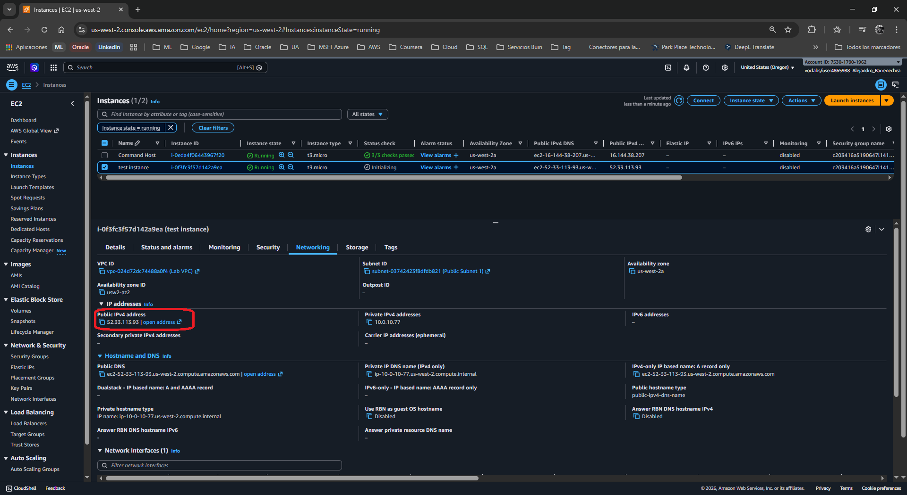
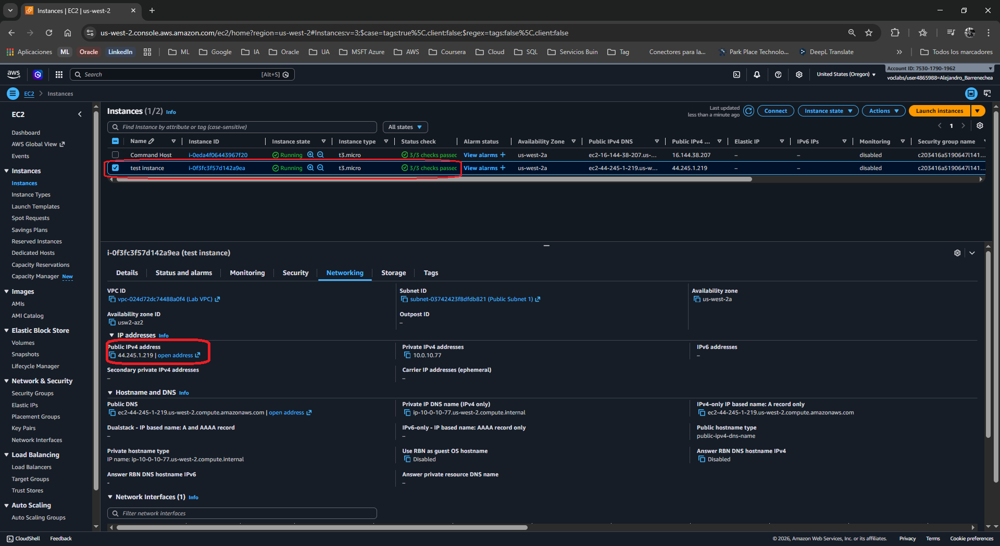
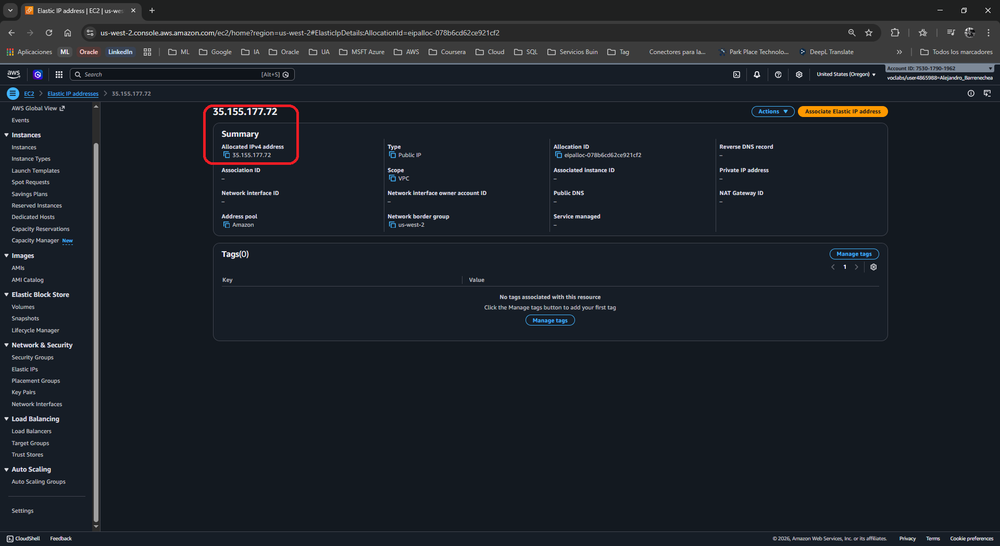
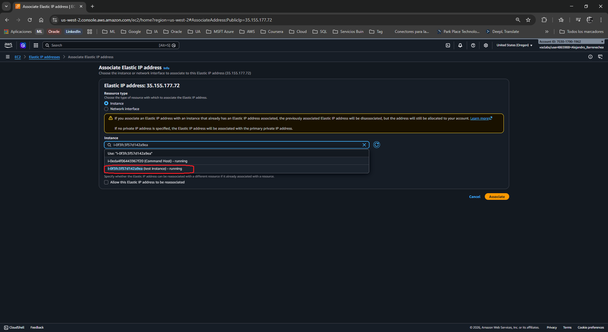
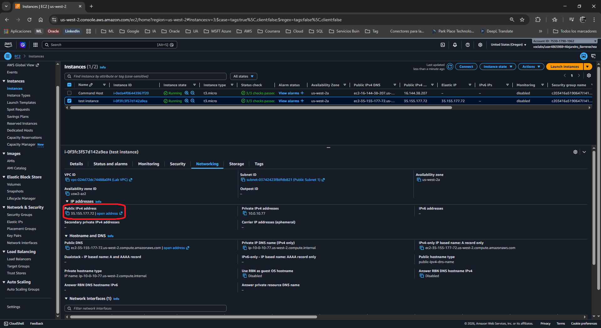
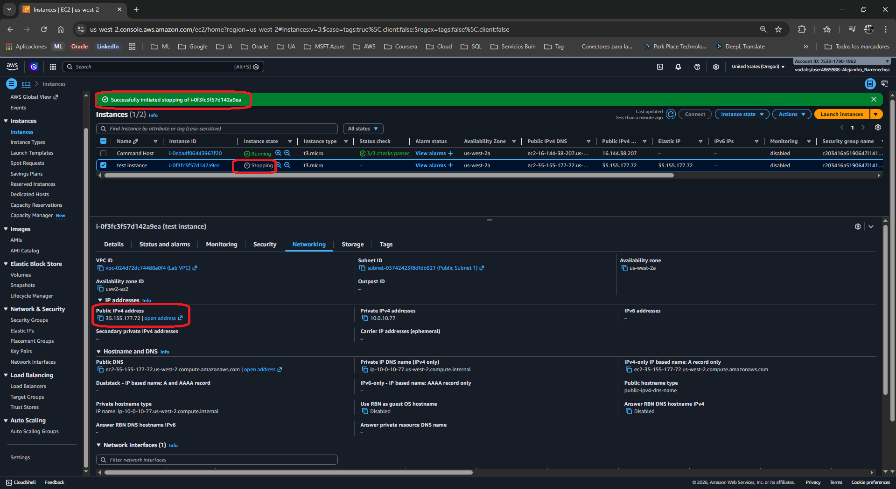
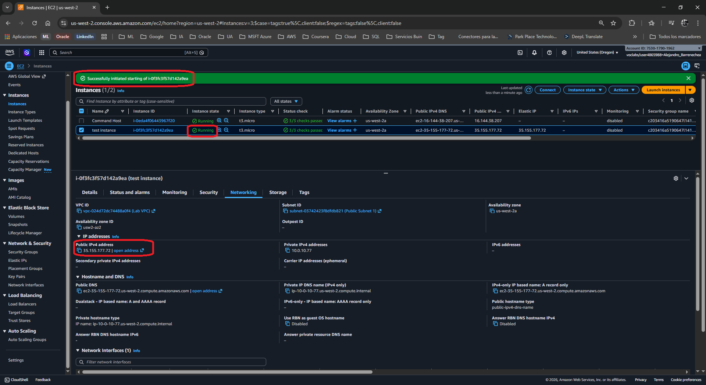

# ☁ Lab: Protocolos de Internet - Direcciones Estáticas y Dinámicas
**Nivel de Dificultad:** 🟢 Básico

**Tiempo Estimado:** ⏱ 45 - 60 minutos

**Servicios Principales:** Amazon EC2, Amazon VPC (Elastic IPs)

### 📑 Resumen del Laboratorio
En este laboratorio se explora el comportamiento de las direcciones IP públicas en el entorno de AWS. Aprenderás la diferencia práctica entre una **dirección IP pública dinámica** (asignada automáticamente por AWS y que cambia si la instancia se detiene) y una **dirección IP estática** (conocida en AWS como *Elastic IP* o IP Elástica, que permanece constante hasta que el usuario decide liberarla).

### 🎯 Objetivos de Aprendizaje
Al finalizar este laboratorio, serás capaz de:
1. Observar cómo cambian las direcciones IP públicas dinámicas al detener e iniciar una instancia EC2.
2. Asignar (Allocate) una dirección IP Elástica (estática) en tu cuenta de AWS.
3. Asociar (Associate) una dirección IP Elástica a una instancia EC2 en ejecución.
4. Comprobar la persistencia de una IP Elástica tras reiniciar o detener la instancia.

***

### 🛠️ Tarea 1: Investigar el entorno y replicar el problema

Para entender el problema de Bob, primero debes replicar su entorno lanzando una instancia EC2 de prueba, para luego observar el comportamiento de sus direcciones IP.

#### Parte A: Lanzar una instancia EC2 de prueba
1. Abre la Consola de Administración de AWS y busca **EC2** en la barra de búsqueda superior. Selecciona el servicio.
2. En el panel de navegación izquierdo, selecciona **Instances** (Instancias).
3. Haz clic en el botón naranja **Launch instances** (Lanzar instancias) en la esquina superior derecha.
4. Sigue estos pasos exactos para configurar la máquina:
   * **Paso 1 (AMI):** Selecciona la primera opción correspondiente a **Amazon Linux 2 AMI (HVM)**.
   * **Paso 2 (Instance Type):** Selecciona **t3.micro**. Haz clic en *Next: Configure Instance Details*.
   * **Paso 3 (Network):** 
     * Network: Selecciona `vpc-xxxxxxxx | Lab VPC`.
     * Subnet: Selecciona `subnet-xxxxxx | Public Subnet 1`.
     * Auto-assign Public IP: Selecciona **Enable** (Habilitar).
     * Haz clic en *Next: Add Storage*.
   * **Paso 4 (Storage):** Deja los valores por defecto y haz clic en *Next: Add Tags*.
   * **Paso 5 (Tags):** Haz clic en *Add Tag*. En **Key** escribe `Name` y en **Value** escribe `test instance`. Haz clic en *Next: Configure Security Group*.
   * **Paso 6 (Security Group):** Selecciona *Select an existing security group* y elige el que se llama **Linux Instance SG**. Haz clic en *Review and Launch*.
   * **Paso 7 (Review):** Revisa y haz clic en **Launch**.
   * **Key Pair:** En la ventana emergente, elige *Choose an existing key pair*, selecciona **vockey | RSA**, marca la casilla de confirmación y haz clic en **Launch Instances**.
5. Vuelve al panel de instancias y espera a que el estado (Instance state) de tu `test instance` cambie a **Running** y los chequeos de estado digan *2/2 checks passed*.

---

#### Parte B: Observar el comportamiento dinámico de la IP Pública
1. Selecciona la casilla de tu `test instance`.
2. En la parte inferior, ve a la pestaña **Networking** (Redes).
3. **Anota** mentalmente (o en un bloc) la *Public IPv4 address* y la *Private IPv4 address*.

  

4. Navega a la parte superior, haz clic en **Instance state** y selecciona **Stop instance** (Detener instancia). Espera a que el estado cambie a *Stopped*.
5. Vuelve a revisar la pestaña *Networking*. Observarás que la **Dirección IPv4 Pública ha desaparecido**.
6. Ve nuevamente a **Instance state** y selecciona **Start instance** (Iniciar instancia).
7. Una vez que esté en *Running*, revisa nuevamente la pestaña *Networking*.

  

**🔍 Análisis de Resultados (Comportamiento Dinámico):**
*   **¿Qué ocurre al detener e iniciar la instancia?** La dirección IP Privada se mantiene idéntica, pero la dirección IP Pública **cambia por una completamente nueva**.
*   **Conclusión:** La IP pública asignada automáticamente por AWS es **Dinámica**. La IP privada interna es **Estática** durante el ciclo de vida de la instancia. Hemos replicado exitosamente el problema del cliente: cada vez que detiene su servidor por costos, AWS recupera la IP pública y le asigna una distinta al volver a encenderlo.

---

#### Parte C: La Solución - Asignar y Asociar una Elastic IP (EIP)
Para solucionar el problema de Bob, necesitas asignarle una IP persistente (estática). En AWS, esto se llama **Elastic IP**.

1. En el panel de navegación izquierdo de EC2, baja hasta la sección *Network & Security* y selecciona **Elastic IPs**.
2. Haz clic en el botón naranja **Allocate Elastic IP address** (Asignar dirección IP elástica) en la esquina superior derecha.
3. Deja la configuración por defecto y haz clic en **Allocate** (Asignar).
4. **Anota** la nueva dirección IP que AWS te ha otorgado.

  

5. Selecciona la casilla junto a la nueva Elastic IP.
6. Ve al menú superior **Actions** (Acciones) y selecciona **Associate Elastic IP address** (Asociar dirección IP elástica).
7. Configura la asociación:
   * *Resource type:* Deja marcado **Instance**.
   * *Instance:* Haz clic en la caja de búsqueda y selecciona tu **test instance**.
   * *Private IP address:* Haz clic en la caja y selecciona la IP privada que aparece sugerida.
8. Haz clic en el botón **Associate** (Asociar).

  

---

#### Parte D: Comprobación de la Solución
1. Vuelve a la página principal de **Instances** usando el menú izquierdo.
2. Selecciona tu `test instance` y ve a la pestaña **Networking**. Verifica que la *Public IPv4 address* es ahora tu Elastic IP.

  

3. **Prueba final:** Ve a *Instance state*, selecciona **Stop instance** y espera a que se detenga. Luego, selecciona **Start instance**.

  

4. Verifica nuevamente la pestaña *Networking*.

  

**🔍 Análisis de Resultados (Comportamiento Estático):**
*   **¿Qué observas ahora?** A pesar de haber detenido e iniciado la máquina, **la dirección IP Pública (Elastic IP) no ha cambiado**. Sigue siendo exactamente la misma.
*   **Conclusión:** La IP ahora es **Estática**. Hemos resuelto el problema de Bob. Ahora puede apagar su instancia para ahorrar costos sin miedo a romper la configuración de su aplicación por un cambio de IP.

***

### 📨 Tarea 2: Respuesta al cliente (Actividad de reporte)

**Rol:** Cloud Support Engineer
**Para:** Bob, Cloud Admin

Hola Bob,

He investigado el problema que reportaste sobre la instancia "Public Instance" que cambia de IP constantemente.

**Diagnóstico:**
El comportamiento que experimentas es el esperado para la configuración actual. Cuando habilitas la asignación automática de IP pública en una subred, AWS te otorga una IP **Dinámica**. Cada vez que aplicas la acción de "Stop" (Detener) a la instancia, AWS libera esa IP a su grupo general de direcciones. Al volver a iniciarla ("Start"), te asigna una dirección pública aleatoria completamente nueva.

**Solución Implementada:**
Para que tu aplicación no se rompa y tengas una IP estática, la solución en AWS es utilizar una **Elastic IP (EIP)**. Una Elastic IP es una dirección IPv4 pública estática diseñada para computación en la nube dinámica.
He procedido a crear (Allocate) una Elastic IP en tu cuenta y la he asociado (Associate) a tu instancia.

**Resultado:**
A partir de este momento, tu instancia tiene una dirección IP persistente. Puedes detener e iniciar tu servidor para ahorrar costos con total seguridad, ya que la Elastic IP se mantendrá atada a tu instancia hasta que decidas desasociarla manualmente.

Quedo a tu disposición si necesitas ayuda adicional.

Saludos cordiales.

***