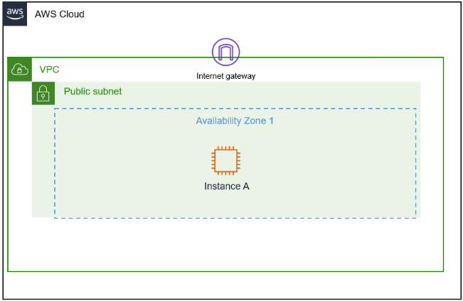
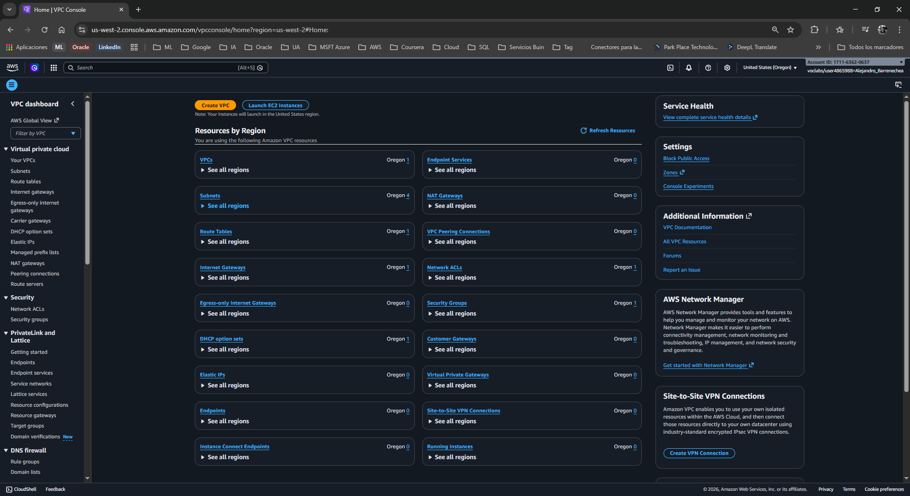
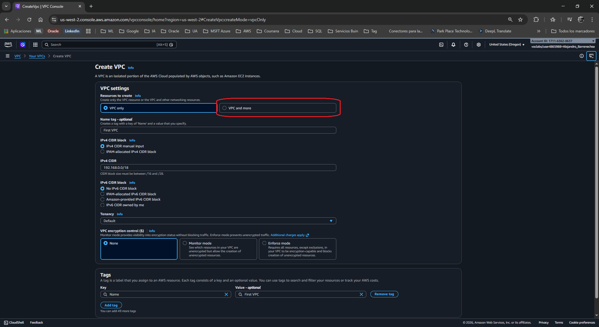
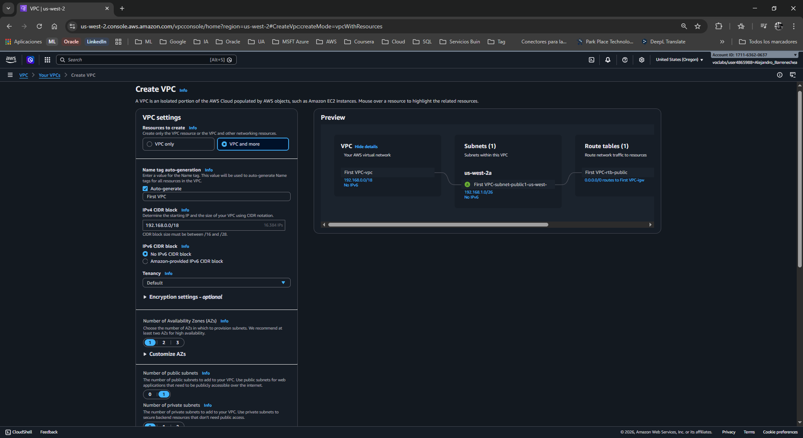
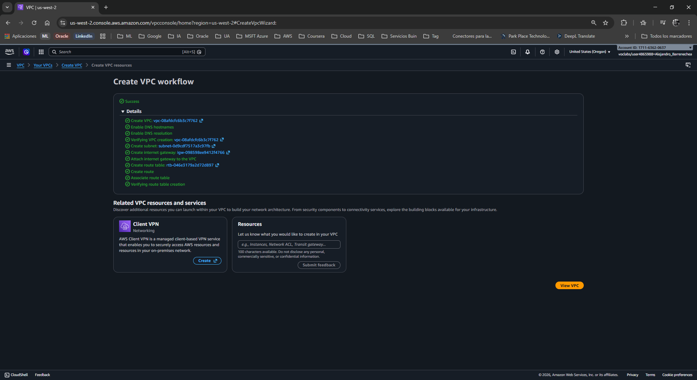
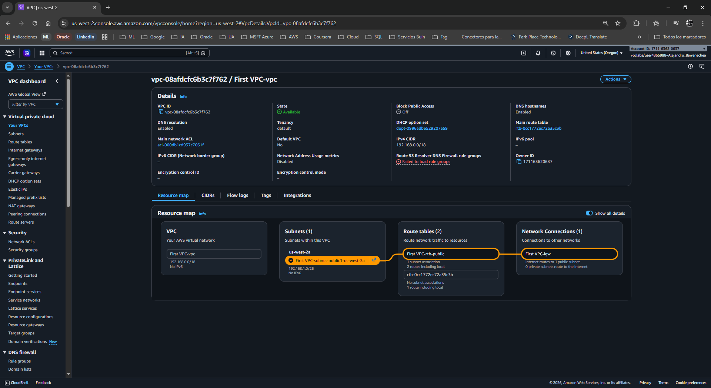

# ☁ Lab 263: Crear subredes y asignar direcciones IP en una Amazon VPC
**Nivel de Dificultad:** 🟢 Básico

**Tiempo Estimado:** ⏱ 1 hora

**Servicios Principales:** Amazon VPC

### 📑 Resumen del Laboratorio
En este escenario actúas como Ingeniero de Soporte Cloud de AWS. El cliente, Paulo Santos (propietario de una startup), te solicita asistencia para crear su primera VPC desde cero. 

El cliente tiene requerimientos muy específicos de diseño de red:
1.  Desea utilizar un rango de direcciones IP privadas de clase C que empiece por **192.x.x.x** (necesita que le confirmes si es válido).
2.  La **VPC completa** debe tener capacidad para **aproximadamente 15,000 direcciones IP**.
3.  Debe existir una **Subred Pública** capaz de albergar al menos **50 direcciones IP** para su departamento de operaciones.

## 🏗️ Arquitectura del Laboratorio
A continuación se describe la arquitectura que desplegaremos:

  

### 🎯 Objetivos de Aprendizaje
Al finalizar este laboratorio, serás capaz de:
1. Calcular bloques CIDR para satisfacer los requisitos de tamaño de red del cliente.
2. Utilizar el asistente de Amazon VPC (VPC Wizard) para crear una red virtual.
3. Comprender la distinción lógica entre una red enrutable externamente (subred pública) y la asignación de IPs privadas estándar RFC 1918.
4. Generar una guía de pasos para el cliente como resolución del ticket.

***

### 📋 Análisis Inicial y Cálculos de Red

Antes de ir a la consola, es fundamental calcular los tamaños de bloque CIDR (Classless Inter-Domain Routing) solicitados:

1.  **¿El rango 192.x.x.x es un rango privado válido?**
    Sí. Según el estándar global RFC 1918, el bloque `192.168.0.0/16` está reservado exclusivamente para uso en redes privadas (junto con los rangos `10.0.0.0/8` y `172.16.0.0/12`).

2.  **Cálculo del CIDR de la VPC (Aprox. 15,000 IPs):**
    Se necesita una máscara de subred que deje suficientes bits de host para crear 15,000 direcciones. 
    * Una máscara `/19` permite 8,192 IPs (insuficiente).
    * Una máscara **`/18`** permite hasta **16,384 IPs** (perfecto para la petición del cliente).
    * **VPC CIDR asignado:** `192.168.0.0/18`

3.  **Cálculo del CIDR de la Subred Pública (Mínimo 50 IPs):**
    * Una máscara `/27` permite 32 IPs (insuficiente).
    * Una máscara **`/26`** permite hasta **64 IPs** (perfecto para cubrir el mínimo de 50).
    * **Subred CIDR asignado:** `192.168.1.0/26`

***

### 🛠️ Tarea 1: Crear el entorno utilizando el VPC Wizard

Aplica el cálculo anterior configurando directamente la red del cliente en la consola de AWS.

#### Paso 1: Navegar al Panel de Amazon VPC
1. Abre la Consola de Administración de AWS.
2. Utiliza la barra de búsqueda en la esquina superior izquierda, escribe **VPC** y selecciona el servicio (bajo la categoría *Networking & Content Delivery*).
3. Una vez en el Dashboard (Panel de Control) de VPC, asegúrate de tener una visión general.

  

#### Paso 2: Ejecutar el Creador (Create VPC)
1. Haz clic en el botón naranja Create VPC (Crear VPC) en la esquina superior derecha del Dashboard.
2. En la sección Resources to create (Recursos a crear), asegúrate de seleccionar VPC and more (VPC y más). Esta es la experiencia de topología unificada que automatiza la creación del Internet Gateway y la vinculación de tablas de rutas simultáneamente.

  

*Respuestas a las preguntas analíticas del lab durante la creación:*
> * **P: ¿Por qué crees que existen subredes públicas y privadas?**
> * **R:** Para segmentar la seguridad. Las subredes públicas albergan recursos expuestos a Internet (mediante un Internet Gateway) como balanceadores de carga o servidores web front-end. Las privadas mantienen componentes críticos (bases de datos o servidores back-end) completamente ocultos del acceso público y ajenos a Internet, sumando una barrera fuerte de ciberseguridad.

#### Paso 3: Configurar los Detalles de la VPC y Subred
Modifica los valores del panel izquierdo basándote en los requerimientos calculados (nota que el diagrama de la derecha se actualizará dinámicamente según modifiques estos valores):

1.  Name tag auto-generation: Ingresa First VPC. (AWS agregará automáticamente prefijos descriptivos para tus subredes usando este nombre de base).
2.  IPv4 CIDR block: Elimina el sugerido e ingresa 192.168.0.0/18 (Satisface la solicitud de ~15,000 IPs).
3.  IPv6 CIDR block: Deja seleccionado No IPv6 CIDR block.
4.  Number of Availability Zones (AZs): Selecciona 1.
5.  Number of public subnets: Selecciona 1.
6.  Number of private subnets: Selecciona 0 (El cliente solicita específicamente arrancar su prueba solo con la capa de operaciones pública).
7.  Expande la pestaña de ajustes detallados que dice Customize subnets CIDR blocks (Personalizar bloques CIDR de subredes).
8.  En el apartado Public subnet CIDR block in [us-este-X], ingresa nuestra cifra exacta: 192.168.1.0/26.
9.  NAT gateways ($): Déjalo en None.
10. VPC endpoints: Déjalo en None.
11. Deja el check sobre Enable DNS hostnames y Enable DNS resolution.

*Respuestas a las preguntas analíticas del lab durante la configuración:*
> * **P: ¿Por qué crees que se utilizan direcciones IP privadas dentro de la VPC?**
> * **R:** Porque las IPs privadas (definidas en RFC 1918) no son enrutables ni visibles en el Internet público global. Esto mantiene la infraestructura oculta. Para que haya salida, se enmascaran en una puerta de enlace de manera centralizada.

  

#### Paso 4: Finalizar la Creación
1. Revisa visualmente en el panel lateral derecho (Preview) que el gráfico de topología coincida: Solo una Availability Zone conteniendo la "First VPC-public", acoplada con una "route table" hacia un "Internet Gateway".
2. Haz clic en el botón naranja inferior **Create VPC** (Crear VPC).
3. AWS desplegará un flujo que marcará en verde la creación instantánea de las piezas solicitadas (VPC, Subred, IGW y Route table). Haz clic al botón View VPC para finalizar.

  

4. Accede en el menú izquierdo en la opción de Your VPCs. Asegúrate de que First VPC figure presente en estado Available.
(Puedes también verificar yendo a Subnets en el panel izquierdo que nuestra capa ha tomado el bloque estipulado correctamente).

  

***

### 📨 Tarea 2: Respuesta al cliente y Walkthrough (Actividad Grupal)

**Rol:** Cloud Support Engineer
**Para:** Paulo Santos, Propietario Startup (o Brock según aplique en el equipo)

Hola Paulo,

Bienvenido a AWS. Es un placer ayudarte con el diseño de arquitectura fundacional para tu empresa.
Analicé detenidamente tu requerimiento y he calculado una arquitectura funcional en la nueva consola (la plataforma tuvo grandes mejoras simplificando esta labor y quiero instruirte directamente en su vista más reciente).

Respondiendo directamente a tus preguntas técnicas:
1. **¿El bloque 192.x.x.x es un rango privado válido?** Sí, está catalogado como privado bajo el estándar de redes global (RFC 1918), por ende no entra en conflicto global con servicios en internet. Puedes usarlo dentro de tus configuraciones en la Nube con tranquilidad.
2. **Para lograr 15,000 direcciones** requieres usar específicamente la siguiente encriptación del Bloque CIDR IPv4 **192.168.0.0/18** para asignar tu gran "Nube VPC" (Otorgando soporte matemático total para 16,384 instancias al límite operativo de IP privada).
3. **Para albergar como piso firme a 50 puestos operativos (Subred Pública)** hemos calculado de igual modo que debes asignarles como prefijo para que encajen perfectos en un rango mediano el siguiente sector: **192.168.1.0/26**. Este trozo retiene de 1 a 64 puestos de rango exacto.

A continuación compartimos nuestro **Walkthrough Simplificado y Vigente** en cinco movimientos de autoayuda para que lo despliegues veloz en consola tú mismo usando un menú visual incorporado que reemplazó las rutinas manuales obsoletas:

**Walkthrough (Self-Service Dashboard AWS):**
1. Adentro del Portal AWS dirígete veloz abriendo tu explorador interno al campo "VPC".
2. Pulsa firme en la esquina de mano derecha arriba, sobre tu principal activador "Crear VPC" (Create VPC).
3. Visualizarás la estructura gráfica nueva; indica encendiendo "VPC and more" en las cajitas top selector. Abarcando eso: la Red e internet gateways encajarán mágicamente como ensamble lego tras el nombre maestro (First VPC) llenado dentro del sector Etiqueta Automática / Generador Nombres.
4. Desmarca e invalida cualquier matemática previa que brinde default (El CIDR maestro AWS común suele fijar /16 en rangos distintos de prueba) ingresando el maestro bloque calculado **192.168.0.0/18**. Exige abajo que existan exactamente configurada "1" Zona De Disponibilidad (AZs), y solo presencias en nivel Red Pública solicitada (Subnets Public= 1; Private=0). Desplegando Personalizar subred en el cinturón de abjo (Customize Subnet CIDR block) ingresar nuestra meta para el área expuesta en: **192.168.1.0/26**.
5. Al pulsar "Crear VPC" abajo, te revelará las tildes afirmativas completadas listadas finalizando.

Responde informando a vuelta del sistema de mensajería Cloud en Soporte ante un inicio activo si quieres extender una posterior partición en paralelo base-datos privado al respecto del futuro paso 2, el que estipules conveniente planificar.
Felicidades sumándose hoy de nuestra tecnología estructural moderna en la capa más limpia orientada en servicios lógicos de primer corte; el inmenso potencial inicia justo desde acá.
Cordial en Saludos.