# ☁ Lab 264: Recursos de red para una VPC
**Nivel de Dificultad:** 🟢 Básico

**Tiempo Estimado:** ⏱ 60 minutos

**Servicios Principales:** Amazon VPC, Amazon EC2

### 📑 Resumen del Laboratorio
El cliente Brock (propietario de una startup) ha intentado crear su propia infraestructura de red, pero tiene problemas: su instancia EC2 está completamente aislada y no puede ni siquiera realizar un *ping* a Internet. 

Tu tarea como Ingeniero de Soporte es construir una arquitectura funcional, acoplando manualmente los 6 componentes vitales que hacen a una red enrutable: VPC, Subredes, Tablas de Enrutamiento, Puertas de Enlace de Internet (IGW), Listas de Control de Acceso (NACLs) y Grupos de Seguridad (SG).

## 🏗️ Arquitectura del Cliente (El Objetivo)
Esta es la topología final a conseguir para que exista conectividad hacia el exterior.

<p align="center">
  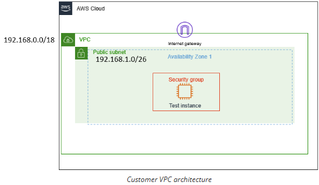
</p>

### 🎯 Objetivos de Aprendizaje
Al finalizar este laboratorio, serás capaz de:
1. Ensamblar los componentes individuales de una VPC paso a paso (Troubleshooting de ruteo).
2. Comprender la ruta exacta del tráfico: Instancia -> SG -> Subred (NACL) -> Tabla de Rutas -> Internet Gateway.
3. Crear un entorno enrutable funcional desde cero comprobado mediante conectividad Ping externa.

***

### 🛠️ Tarea 1: Construcción manual de recursos de red

*Nota técnica sobre la Consola Moderna: Aunque la experiencia "VPC and more" automatiza esto, crearemos todo manualmente bajando progresivamente por el panel izquierdo, lo cual es clave para el troubleshooting avanzado.*

#### Paso 1: Crear la VPC base
1. Desde la Consola AWS, accede al servicio **VPC**.
2. En el panel lateral izquierdo superior, haz clic en **Your VPCs** (Tus VPCs) y selecciona el botón naranja **Create VPC**.
3. En *Resources to create* elige explícitamente **VPC only** (Solo VPC).
4. Configura los siguientes parámetros:
   * **Name tag:** `Test VPC`
   * **IPv4 CIDR block:** Ingresa `192.168.0.0/18`
   * Deja las opciones de IPv6 en *No IPv6 CIDR block* y Tenancy en *Default*.
5. Haz clic en **Create VPC**.

<p align="center">
  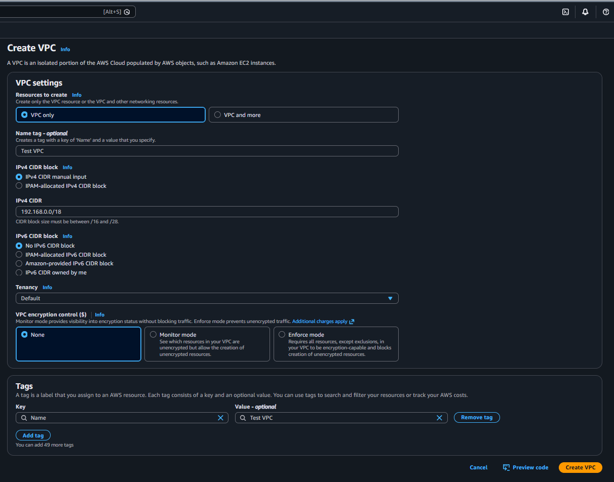
</p>

<p align="center">
  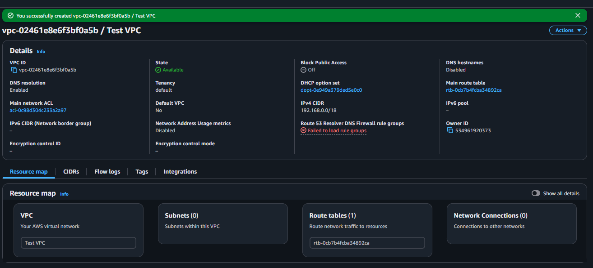
</p>

#### Paso 2: Crear la Subred (Segmentación)
1. Navega en el menú izquierdo hacia **Subnets** (Subredes) y presiona **Create subnet**.
2. En *VPC ID*, selecciona tu nueva `Test VPC`.
3. Baja a los ajustes de subred e ingresa:
   * **Subnet name:** `Public subnet`
   * **Availability Zone:** Elige *No preference* (Sin preferencia).
   * **IPv4 CIDR block:** Ingresa `192.168.1.0/26`.
4. Haz clic en **Create subnet**.

<p align="center">
  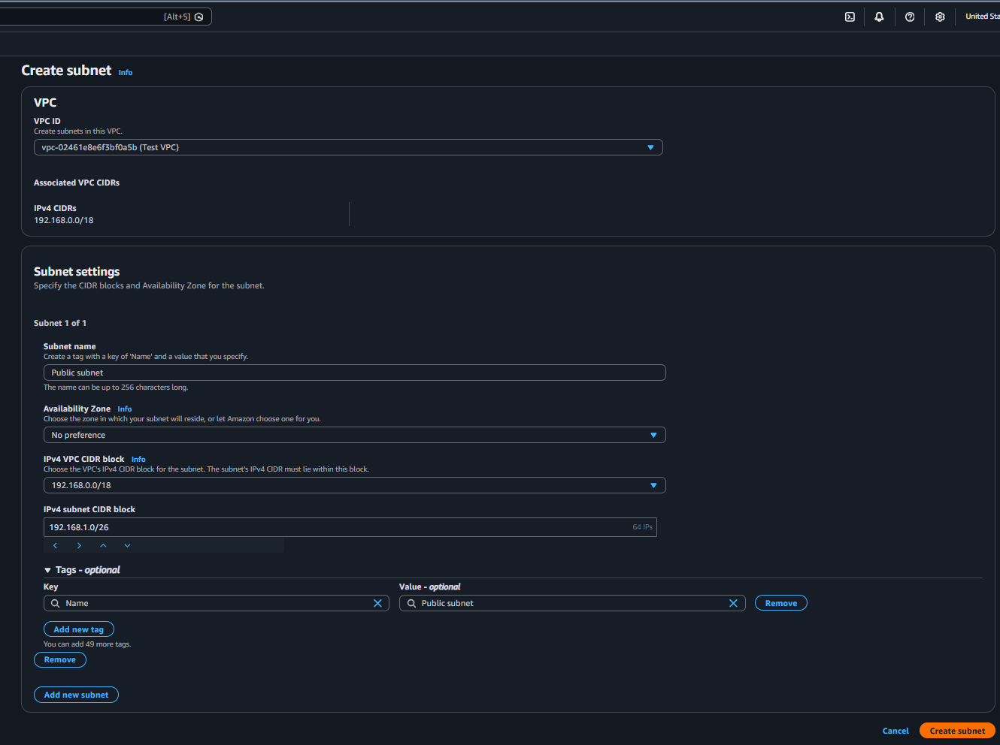
</p>

<p align="center">
  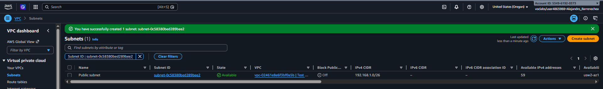
</p>

#### Paso 3: Crear y Acoplar el Internet Gateway (IGW)
El IGW realiza la traducción (NAT) entre tus IPs privadas y el internet global.

1. Ve a **Internet gateways** en el panel izquierdo. Haz clic en **Create internet gateway**.
2. **Name tag:** `IGW test VPC` y presiona **Create**.

<p align="center">
  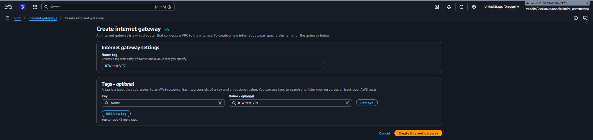
</p>

3. Una vez creado, nota que su estado es *Detached* (Desconectado). Haz clic en el botón superior derecho **Actions** y elige **Attach to VPC** (Asociar a la VPC).
4. Selecciona `Test VPC` del menú desplegable y presiona **Attach internet gateway**.

<p align="center">
  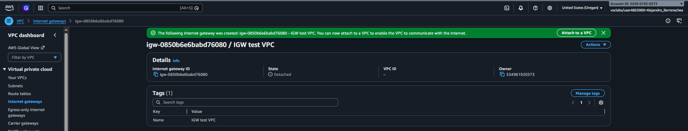
</p>

<p align="center">
  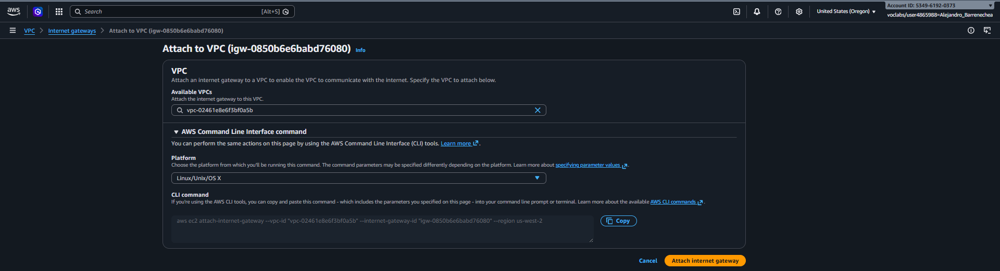
</p>

<p align="center">
  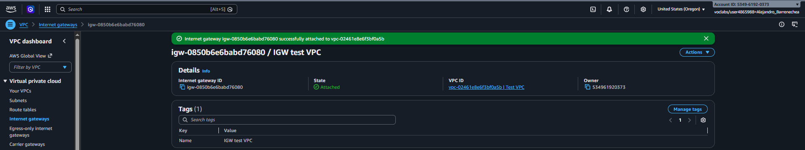
</p>

#### Paso 4: Configurar el Ruteo (Tablas de enrutamiento)
A la fecha, el tráfico de tu subred está bloqueado porque no sabe llegar al Gateway. Debes trazar el mapa.

1. Navega a **Route tables** en el menú izquierdo.
2. Haz clic en **Create route table** y ponle por nombre `Public route table`. En *VPC*, selecciona la `Test VPC` y créala.
3. Selecciónala de la lista. En la sección inferior, ve a la pestaña **Routes** (Rutas) y pulsa **Edit routes**.

<p align="center">
  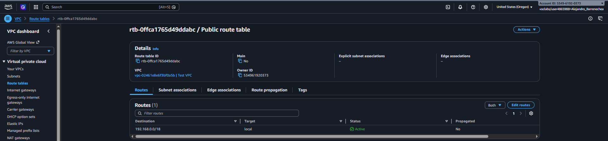
</p>

4. Haz clic en **Add route**.
   * En **Destination** escribe la ruta universal: `0.0.0.0/0` (Todo el internet).
   * En **Target** haz clic en la caja, elige *Internet Gateway*, y selecciona el identificador de tu `IGW test VPC`.
5. Haz clic en **Save changes**.

<p align="center">
  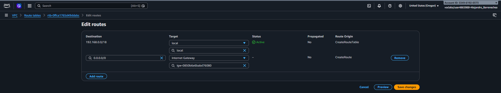
</p>

<p align="center">
  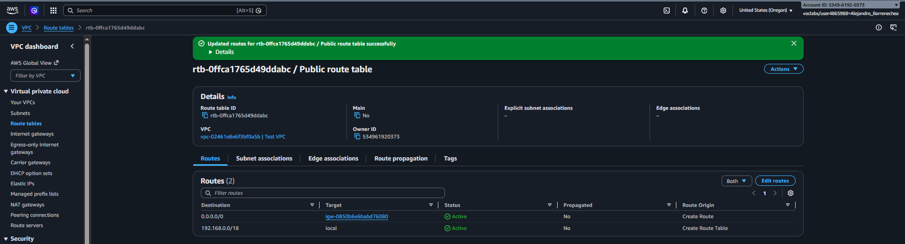
</p>

6. Ahora asóciala a tu subred. Ve a la pestaña **Subnet associations**, pulsa **Edit subnet associations**.
7. Marca la casilla de tu `Public subnet` y presiona **Save associations**.

<p align="center">
  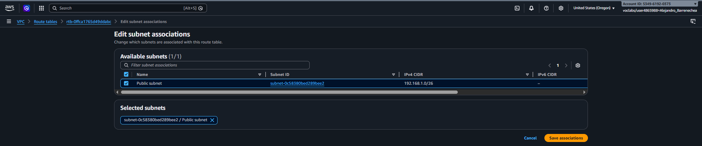
</p>

<p align="center">
  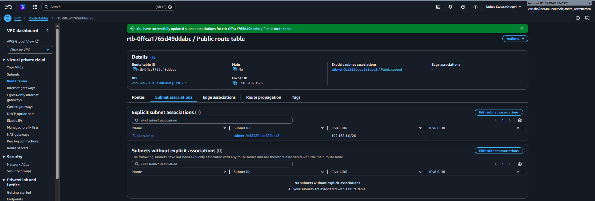
</p>

#### Paso 5: Listas de control de acceso (NACLs) a nivel Subred
Asegura la red construyendo la cerca perimetral (El Firewall de Subred Stateless). Al crear uno nuevo y manual en AWS, por seguridad bloqueará todo hasta que crees reglas.

1. Selecciona **Network ACLs** en el panel izquierdo y pulsa **Create network ACL**.
2. Nombre: `Public Subnet NACL`. VPC: `Test VPC`. Clic en **Create**.

<p align="center">
  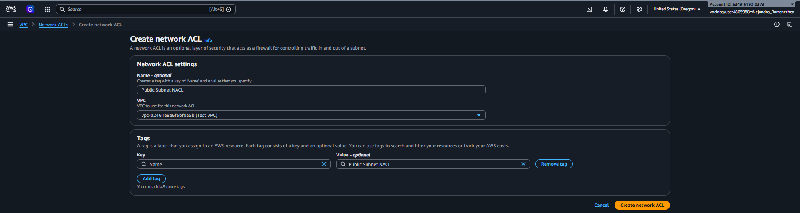
</p>

3. Selecciona tu recién creado NACL en la lista. 
4. Ve a la pestaña **Inbound rules** (Reglas de entrada) en el detalle inferior y pulsa **Edit inbound rules**.
   * Presiona *Add new rule*: **Rule number**: `100`, **Type**: `All traffic` (Tira de todas las opciones hacia 0.0.0.0/0) -> **Save changes**.

<p align="center">
  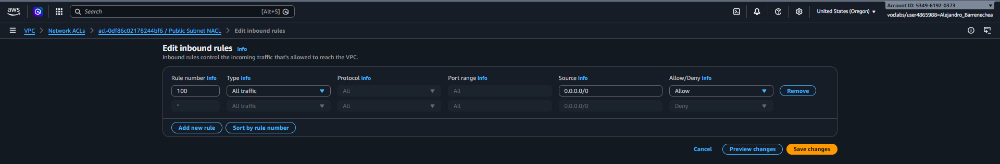
</p>

5. Pásate a la pestaña **Outbound rules** (Reglas de salida) y pulsa **Edit outbound rules**.
   * Presiona *Add new rule*: **Rule number**: `100`, **Type**: `All traffic` -> **Save changes**.

<p align="center">
  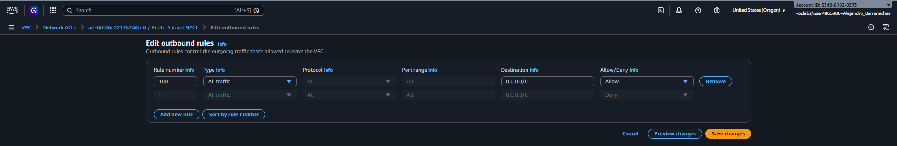
</p>

#### Paso 6: Grupos de Seguridad (SG) a nivel Servidor
Crea un muro firewall enfocado única y puramente a tus servidores individuales. 

1. Ve a **Security Groups** en el panel izquierdo. Haz clic en **Create security group**.
2. Datos básicos: 
   * **Security group name:** `public security group`. 
   * **Description:** `allows public access`.
   * **VPC:** Elimina la existente pinchando en la 'X' y selecciona tú explícitamente la `Test VPC`.
3. En Inbound rules (Entrada) añade 3 nuevas reglas haciendo clic en Add rule:
   * Tipo **SSH** / Origen **Anywhere-IPv4 (0.0.0.0/0)**.
   * Tipo **HTTP** / Origen **Anywhere-IPv4**.
   * Tipo **HTTPS** / Origen **Anywhere-IPv4**.
4. En Outbound rules (Salida), por lo general ya dice **All traffic** a `0.0.0.0/0`. Confirma que es así. 
5. Clic en **Create security group**.

<p align="center">
  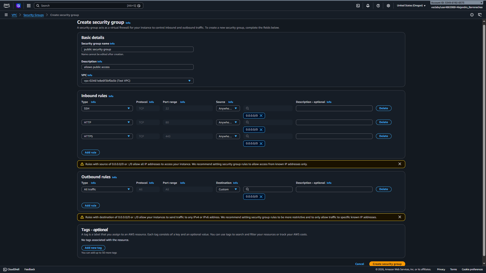
</p>

---

### 🚀 Tarea 2: Lanza y Asigna tu Instancia EC2 a la Arquitectura
Comprueba de inmediato tu plataforma creada sembrando la EC2 solicitada:

1. Ve al menú central global de **AWS / Servicio EC2**. 
2. Haz clic en el panel izquierdo bajo *Instances* -> **Instances**. Y pulsa en el área principal naranja **Launch Instances**.
3. Establece sus parámetros puros en sus áreas asignables correspondientes a continuación:
   * **Name / Nombre:** Bastion Server *(Sugerencia técnica referencial al nombre clásico externo)*.
   * **OS/Imagen Base:** Amazon Linux 2023 AMI.
   * **Instance type:** `t3.micro`.
   * **Key Pair Login:** Elige del listón preconfigurado *`vockey`*.
   * **Capa / Panel Red Network settings**: Edita pulsando Editar en esquina: Selecciona que viva estricto sobre *Test VPC*, dentro de la única red posible (*Public Subnet*). Pulsa afirmativo el área donde indique dar Autoasignación global *Auto-assign public IP: **Enable***. (Obligatorio en todo ruteo IGW hacia máquinas limpias sin capa NAT Gateway de costo extra). Y abajo enganchar cortafuego asignable "Seleccionando de los grupos base que ya construiste previamente": -> ***`public security group`***.
4. Baja directo a la confirmación de ensamblado y lánzala usando: **Launch instance**. 
5. Ve en el listón hacia: "Ver tus instancias". Espérala iniciar el panel *Status = Running* / estado final aprobado y estable *2/2 comprobaciones (2/2 Check)*.

<p align="center">
  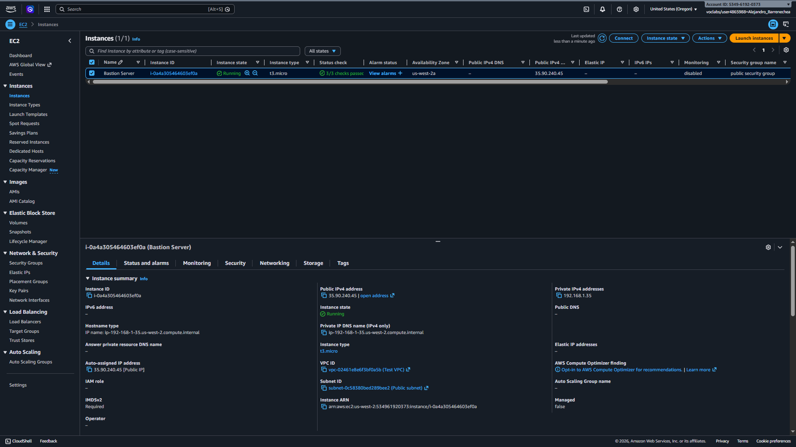
</p>

***

### 🌐 Tarea 3: Probar la conectividad a Internet usando el comando `ping`

El objetivo de esta fase final es comprobar empíricamente que la arquitectura funciona. Si logras enviar un ping al exterior y recibir respuesta, significa que la configuración que ensamblaste fluye correctamente: tu instancia logra atravesar el Security Group, la NACL de la subred, sigue la regla de la Tabla de Enrutamiento y sale a Internet por el Internet Gateway (IGW).

*(Nota: Conéctate a la consola de tu instancia EC2 mediante SSH usando tu cliente preferido, utilizando la Dirección IP Pública asignada a tu servidor "Bastion Server").*

**Pasos para la verificación:**

1. Una vez que hayas iniciado sesión en la línea de comandos de tu instancia Amazon Linux, ejecuta el siguiente comando para probar la salida hacia un dominio externo:

```bash
ping google.com
```

2. Permite que el comando se ejecute durante unos segundos para ver si el servidor externo responde. Luego, detén la prueba presionando **CTRL + C** (en Windows o Linux) o **CMD + C** (en Mac).

3. **Verifica los resultados:** Analiza el resumen estadístico al final de la ejecución (ping statistics).
   * **Resultado Exitoso:** Verás líneas con el formato *64 bytes from...* que confirman la comunicación, y el reporte final debe indicar **0% packet loss** (0% de pérdida de paquetes).
   * **Conclusión:** Las respuestas confirman que la VPC está correctamente enrutada y tiene acceso a Internet. ¡Has resuelto el problema de Brock!

*[📸 Inserta tu captura aquí: Ventana de terminal SSH mostrando la respuesta exitosa del comando ping a google.com y el reporte de 0% packet loss]*

***

Ahora sí suena como un verdadero manual de AWS en español nativo. ¡Agrégalo a tu proyecto en Visual Basic! ¿Vamos por el siguiente paso o lab?

<p align="center">
  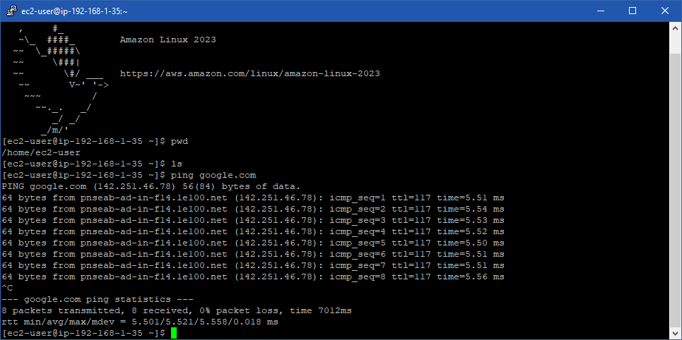
</p>