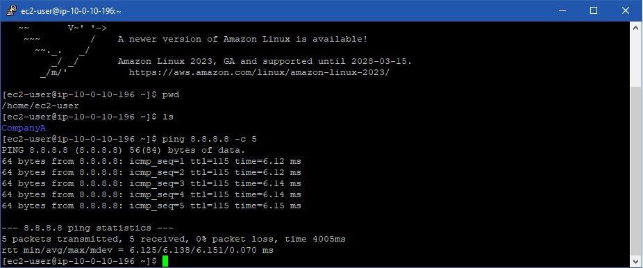
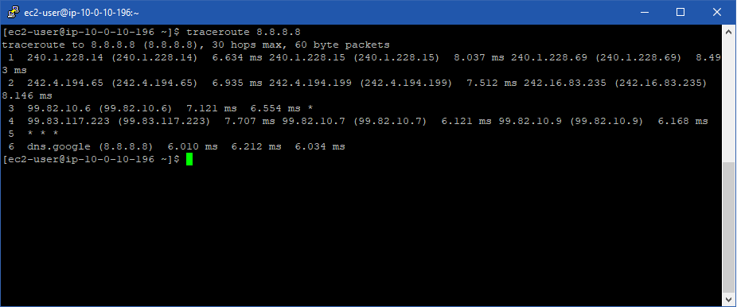
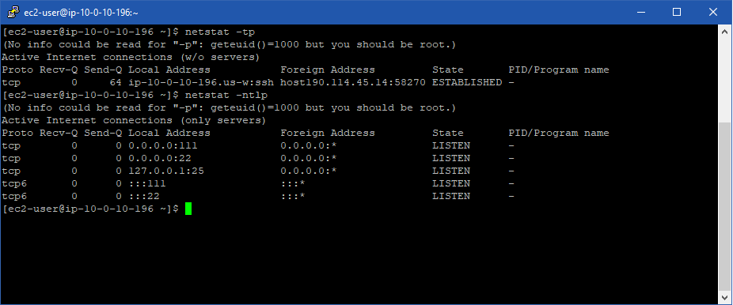
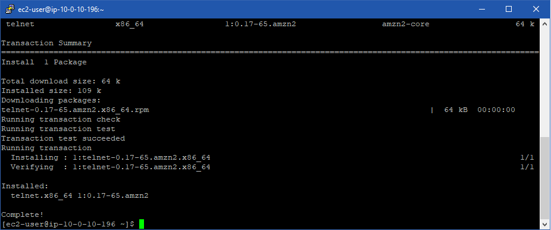
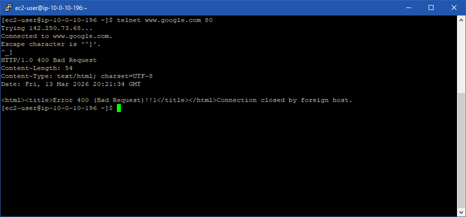
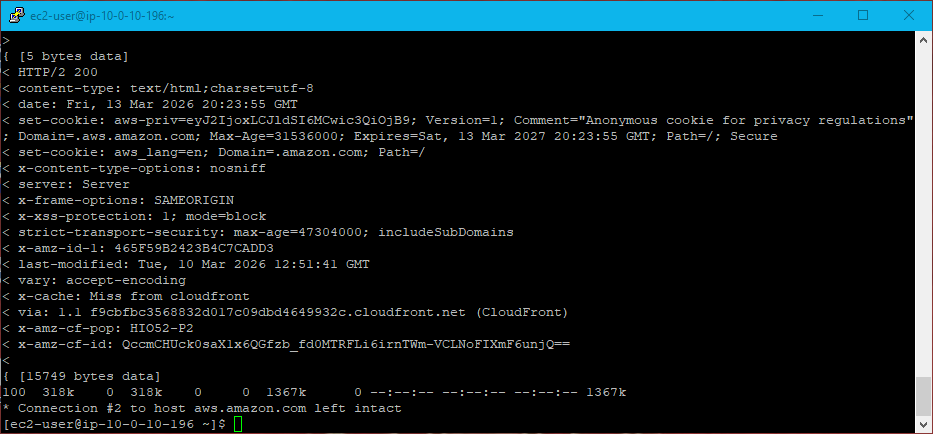

# ☁ Lab 265: Comandos de solución de problemas del protocolo de Internet
**Nivel de Dificultad:** 🟢 Básico

**Tiempo Estimado:** ⏱ 30 minutos

**Servicios Principales:** Amazon EC2 (Linux CLI)

### 📑 Resumen del Laboratorio
Como nuevo administrador de red o Ingeniero de Soporte, es vital que sepas cómo diagnosticar problemas de conectividad utilizando la línea de comandos (CLI). 

En este laboratorio explorarás herramientas nativas de Linux alineadas con el Modelo OSI. Estas herramientas te permitirán aislar fallas de red, determinar si el problema reside en el enrutamiento base, en el bloqueo de puertos específicos por un firewall, o a nivel de la aplicación web del cliente.

### 🎯 Objetivos de Aprendizaje
Al finalizar este laboratorio, serás capaz de:
1. Ejecutar y comprender comandos de diagnóstico de red en un entorno Linux.
2. Identificar cómo y cuándo utilizar estas herramientas en escenarios reales de soporte al cliente.
3. Correlacionar cada comando con su respectiva capa del Modelo OSI (Capa 3: Red, Capa 4: Transporte, Capa 7: Aplicación).

***

### 🛠️ Tarea 1: Acceso a la instancia de diagnóstico

*Nota: Se asume que has completado el inicio del laboratorio y posees las credenciales SSH (archivo .pem o .ppk) para conectarte a la instancia Amazon Linux EC2 proporcionada en el entorno.*

1. Abre tu cliente SSH (PuTTY en Windows o la Terminal en Mac/Linux).
2. Conéctate a la Dirección IP Pública de tu instancia utilizando el usuario `ec2-user` y tu clave privada descargada.
3. Una vez conectado, deberás ver el *prompt* de la línea de comandos de Amazon Linux listo para recibir instrucciones.
---

### 🔍 Tarea 2: Práctica de comandos de Troubleshooting (Resolución de problemas)

A continuación, simularás diversos escenarios de clientes ejecutando herramientas de diagnóstico estructuradas por capas del modelo OSI.

#### 📍 Capa 3 (Red): Comprobación de Enrutamiento y Alcance

**Comando 1: `ping`**
*   **Escenario de cliente:** Un cliente lanza una instancia EC2 y necesita saber si su Security Group permite tráfico ICMP y si el servidor tiene salida básica a Internet.
*   **Acción:** En tu terminal Linux, ejecuta el siguiente comando para enviar 5 paquetes de prueba a los servidores DNS de Google:
    ```bash
    ping 8.8.8.8 -c 5
    ```
*   **Análisis:** El flag `-c 5` limita la prueba a 5 "ecos". Si recibes respuestas (*64 bytes from...*), confirmas que hay conectividad IP básica y que no hay firewalls bloqueando el protocolo ICMP.

<p align="center">
  
</p>

**Comando 2: `traceroute`**
*   **Escenario de cliente:** Un cliente experimenta alta latencia (lentitud) al conectar con un servidor externo y sospecha de la red de AWS.
*   **Acción:** Ejecuta el siguiente comando para trazar la ruta exacta y el tiempo de salto (hop) que toman los paquetes:
    ```bash
    traceroute 8.8.8.8
    ```
*   **Análisis:** Verás una lista de enrutadores (saltos). Si aparecen asteriscos `***`, significa que un salto específico no respondió (posible bloqueo o pérdida de paquetes). Esto ayuda a culpar al proveedor de Internet (ISP) o a un enrutador defectuoso en el camino, demostrando si el problema está dentro o fuera de AWS.

<p align="center">
  
</p>

---

#### 📍 Capa 4 (Transporte): Comprobación de Puertos y Servicios TCP/UDP

**Comando 3: `netstat`**
*   **Escenario de cliente:** El equipo de seguridad detecta que un puerto extraño podría estar abierto en una subred. Quieren verificar directamente en el servidor si hay servicios escuchando en puertos no autorizados.
*   **Acción:** Ejecuta el siguiente comando para ver las conexiones TCP establecidas y los procesos asociados:
    ```bash
    netstat -tp
    ```
    *(Nota: También puedes usar `netstat -ntlp` para ver todos los servicios escuchando sin resolver nombres DNS).*
*   **Análisis:** Esto muestra qué programas están ocupando qué puertos en tu máquina local. Es el primer paso para detectar servicios ocultos o mal configurados.

<p align="center">
  
</p>
<p align="center">
  
</p>

**Comando 4: `telnet`**
*   **Escenario de cliente:** Un cliente configuró un servidor web seguro y cree que el puerto 80 (HTTP no seguro) está bloqueado por su Security Group, pero quiere comprobarlo.
*   **Acción:** Primero, instala la herramienta telnet ejecutando:
    ```bash
    sudo yum install telnet -y
    ```
    Luego, intenta abrir una conexión TCP pura al puerto 80 de Google:
    ```bash
    telnet www.google.com 80
    ```
*   **Análisis:** 
    * Si la pantalla se pone en blanco o dice *Connected*, el puerto está abierto y no hay firewalls bloqueando.
    * Si dice *Connection refused*, el servidor destino rechaza la conexión.
    * Si se queda pensando y da *Connection timed out*, hay un firewall (como un Security Group de AWS) descartando el tráfico silenciosamente.
    *(Para salir de telnet si se conecta, presiona `CTRL + ]` y luego escribe `quit`)*.

<p align="center">
  
</p>
---

#### 📍 Capa 7 (Aplicación): Comprobación de Respuestas Web HTTP

**Comando 5: `curl`**
*   **Escenario de cliente:** El cliente tiene un servidor web Apache. Sabe que la red (Capa 3) y los puertos (Capa 4) están bien, pero quiere confirmar si la aplicación web en sí está respondiendo correctamente con un código "200 OK".
*   **Acción:** Ejecuta el siguiente comando para realizar una petición HTTP detallada (verbosa) ignorando la descarga del contenido visual:
    ```bash
    curl -vLo /dev/null https://aws.com
    ```
*   **Análisis:** 
    * `-v` (verbose) te muestra toda la "conversación" oculta entre tu equipo y el servidor web (certificados SSL, Handshakes).
    * Busca en el output la línea que dice `< HTTP/1.1 200 OK` (o similar). Si la ves, la aplicación web está viva, sana y respondiendo peticiones a nivel de software.

<p align="center">
  
</p>

### 📨 Tarea 3: Plantilla de Respuesta al Cliente (Ejemplo de uso de los comandos)

**Rol:** Cloud Support Engineer

**Para:** Equipo de Operaciones del Cliente

Hola equipo,

En respuesta a sus problemas de conectividad, he utilizado herramientas de diagnóstico estándar (CLI) para aislar la falla de red reportada en su instancia:

1. **Prueba de Capa 3 (Red):** Ejecuté un `ping` hacia el exterior. Tuvimos un 0% de pérdida de paquetes, lo que confirma que las Tablas de Enrutamiento y el Internet Gateway de su VPC están perfectamente configurados.
2. **Prueba de Capa 4 (Transporte):** Utilicé `telnet` para probar el puerto específico de su base de datos remota. Obtuvimos un error de *"Connection timed out"*. 
3. **Diagnóstico:** Dado que la red base funciona pero el puerto específico no responde, el problema no es de AWS ni del sistema operativo, sino de un firewall.
4. **Solución:** Sugiero revisar las reglas de salida (Outbound) del Security Group asociado a su instancia para asegurarse de que el puerto TCP requerido esté permitido hacia la IP destino.