# ☁ Lab 266: Solución de problemas de una red

**Nivel de Dificultad:** 🟢 Básico

**Tiempo Estimado:** ⏱ 60 minutos

**Servicios Principales:** Amazon VPC, Amazon EC2, Apache (httpd)

### 📑 Resumen del Laboratorio
En este escenario de *troubleshooting* asumes el rol de Ingeniero de Soporte Cloud de AWS. La cliente, Ana (contratista), ha configurado un servidor web Apache dentro de una VPC, pero tiene un problema grave: no puede realizar *ping* hacia el servidor y la página web no carga en absoluto cuando ingresa la dirección IP en el navegador. 

Tu misión es ingresar al entorno, activar el servicio web y realizar una revisión metódica (capa por capa) de la infraestructura de red de AWS para descubrir qué está bloqueando la conexión.

***

## 🏗️ Arquitectura del Laboratorio
A continuación se describe la arquitectura del cliente que debemos diagnosticar y reparar:

<p align="center">
  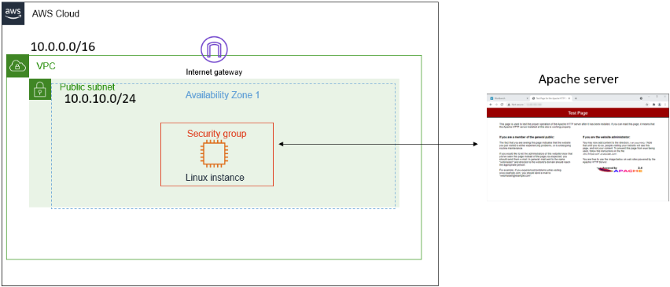
</p>

***

### 🎯 Objetivos de Aprendizaje
Al finalizar este laboratorio, serás capaz de:
1. Iniciar servicios web básicos (Apache) mediante línea de comandos en Linux.
2. Analizar metódicamente los componentes de una VPC (Route Tables, IGW, Security Groups, NACLs) para detectar fallos.
3. Solucionar problemas de bloqueo de red modificando las reglas de firewall (Security Groups) correctas para habilitar el tráfico web.

***

### 🛠️ Tarea 1 y 2: Activar el servidor Apache (httpd)

El primer paso para solucionar el problema es asegurarte de que la aplicación web (Capa 7) esté realmente funcionando dentro del servidor, antes de culpar a la red.

*Nota: Se asume que ya te has conectado a la instancia EC2 por SSH (PuTTY o Terminal) utilizando tu clave `.ppk` o `.pem`.*

1. Una vez en la terminal de tu instancia Amazon Linux, verifica el estado actual del servidor Apache ejecutando el siguiente comando:
   ```bash
   sudo systemctl status httpd.service
   ```
2. Observarás que el estado marca **Inactive (dead)**. Esto significa que el software está instalado, pero apagado.

3. Para encender el servicio web, ejecuta:
   ```bash
   sudo systemctl start httpd.service
   ```
4. Vuelve a comprobar el estado para confirmar el inicio exitoso:
   ```bash
   sudo systemctl status httpd.service
   ```
5. Ahora el estado debe mostrarse en verde como **Active (running)**. Presiona la tecla `q` para salir del panel de estado y volver al *prompt*.

<p align="center">
  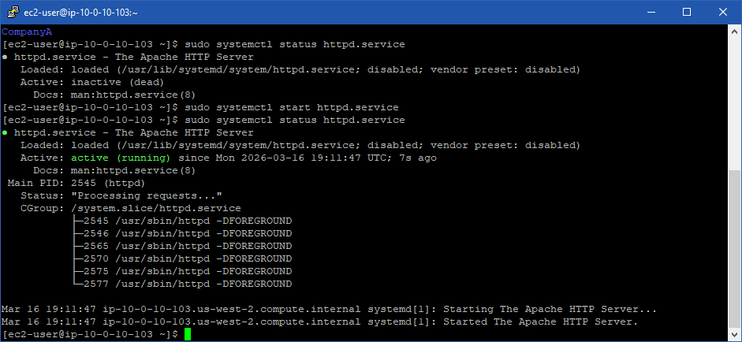
</p>

6. **Prueba Inicial del Cliente:** Abre una nueva pestaña en tu navegador web e intenta ingresar a la IP Pública de tu instancia:
   `http://34.220.168.24`
7. Notarás que la página **se queda cargando infinitamente y falla** (dando un error de *Timeout* o *No se puede acceder a este sitio*). Hemos replicado el problema exacto de Ana. El servidor funciona, pero algo en la red bloquea la entrada.

<p align="center">
  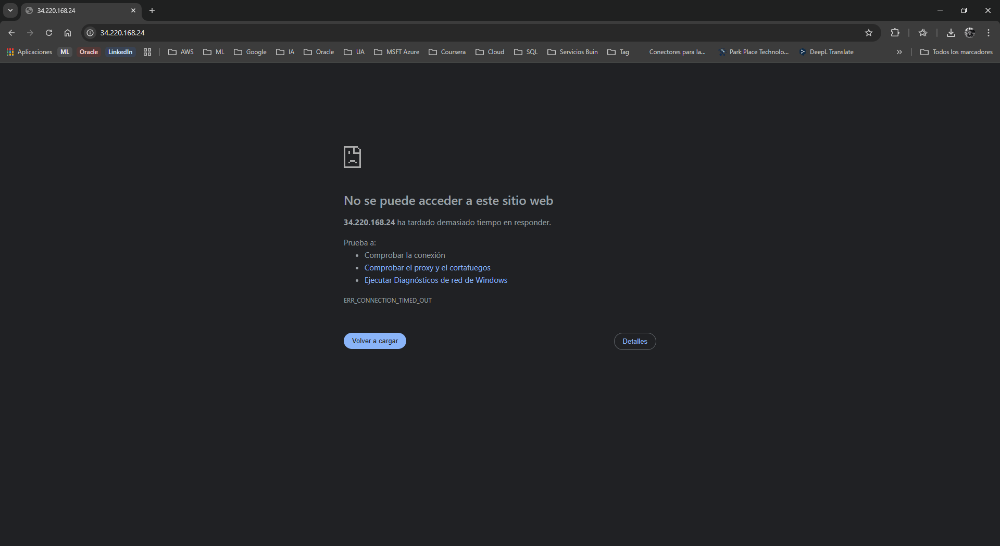
</p>

---

### 🔍 Tarea 3: Investigar y Solucionar la configuración de la VPC

Ahora que sabemos que el servidor Apache está vivo, debes aplicar el método de *Troubleshooting top-down* en la consola de AWS.

#### Paso 1: Revisión del Enrutamiento Básico (IGW y Route Tables)
1. Abre la Consola de Administración de AWS y navega al servicio **VPC**.
2. En el panel izquierdo, ve a **Internet gateways**. Verifica que el IGW existe y está en estado *Attached* (Conectado) a la VPC del cliente.

<p align="center">
  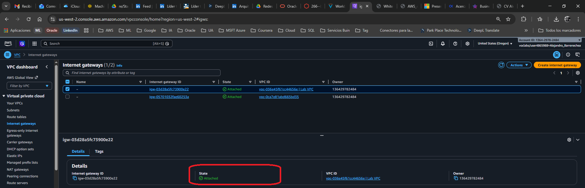
</p>

3. En el panel izquierdo, ve a **Route tables** y selecciona la tabla de rutas de la subred pública.
4. En la pestaña inferior **Routes**, verifica que exista la ruta `0.0.0.0/0` apuntando hacia el *Internet Gateway* (igw-xxxxx).
   *(Diagnóstico parcial: Si todo esto está correcto, el enrutamiento base funciona. El problema debe ser un Firewall).*

<p align="center">
  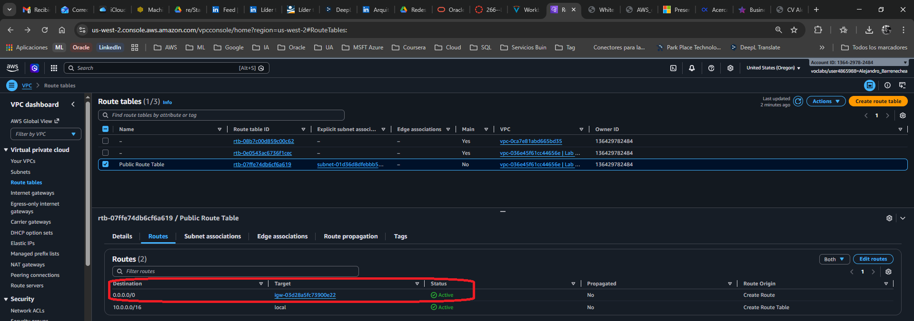
</p>

#### Paso 2: Revisión de la Lista de Control de Acceso (NACLs)
1. En el panel izquierdo de VPC, selecciona **Network ACLs**.
2. Selecciona la NACL asociada a tu subred.
3. En las pestañas inferiores, revisa tanto las **Inbound rules** como las **Outbound rules**.
4. Ambas deberían tener una regla (generalmente la número 100) que permite (*Allow*) todo el tráfico (*All traffic*) desde `0.0.0.0/0`. 
   *(Diagnóstico parcial: Si la NACL permite todo, el bloqueo no está a nivel de subred).*

<p align="center">
  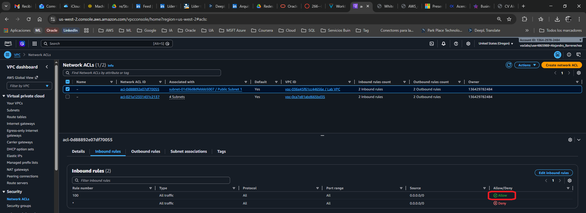
</p>
<p align="center">
  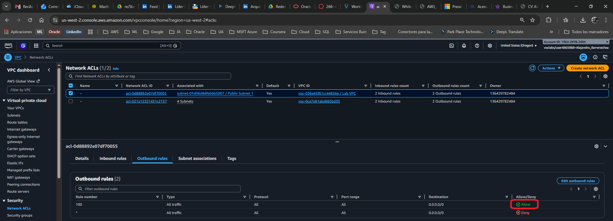
</p>

#### Paso 3: Revisión y Solución del Grupo de Seguridad (Security Group)
Llegamos al muro final que protege directamente a la instancia EC2.

1. Ve a la consola del servicio **EC2**.
2. En el menú izquierdo, bajo *Network & Security*, selecciona **Security Groups**.
3. Selecciona el Grupo de Seguridad que está asociado a la instancia web de Ana (puedes identificarlo por su nombre o descripción).
4. Selecciona la pestaña **Inbound rules** (Reglas de entrada) en el panel inferior.
5. **¡Aquí está el problema!** El servidor Apache (httpd) opera sobre el protocolo **HTTP (Puerto 80)**. Si revisas las reglas de entrada, notarás que el puerto 80 no está permitido, o quizás solo esté habilitado el puerto 22 (SSH) para que pudieras conectarte.

<p align="center">
  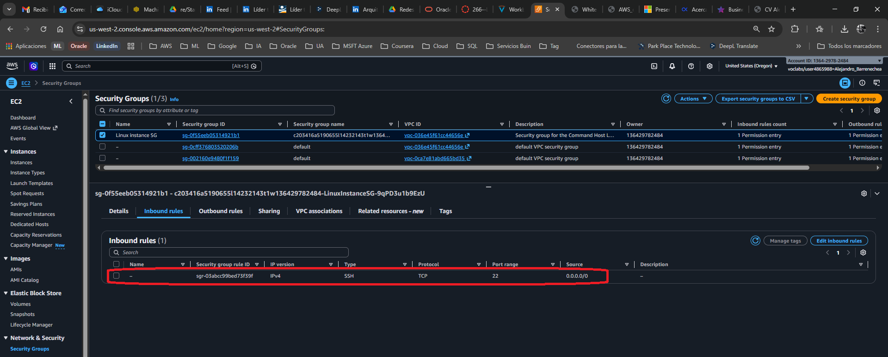
</p>

6. Haz clic en **Edit inbound rules** (Editar reglas de entrada).
7. Haz clic en **Add rule** (Agregar regla) y configúrala exactamente así:
   * **Type:** `HTTP`
   * **Source:** `Anywhere-IPv4` (0.0.0.0/0)
8. *(Opcional)* Si Ana mencionó que tampoco podía hacer *ping*, agrega otra regla:
   * **Type:** `All ICMP - IPv4`
   * **Source:** `Anywhere-IPv4` (0.0.0.0/0)
9.  Haz clic en **Save rules** (Guardar reglas).

<p align="center">
  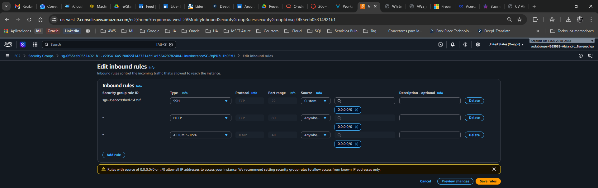
</p>

---

### 🌐 Comprobación de la Solución
1. Vuelve a la pestaña de tu navegador web donde intentaste cargar la página antes.
2. Refresca la página (F5) dirigiéndote a: `http://34.220.168.24`
3. **Resultado Exitoso:** Inmediatamente debe cargar la página de prueba oficial de **"Test Page for the Apache HTTP Server"**.

<p align="center">
  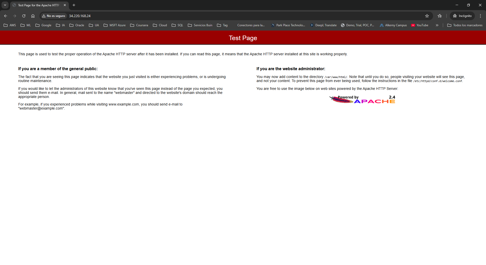
</p>

***

### 📨 Respuesta al Cliente (Cierre del Ticket)

**Rol:** Cloud Support Engineer
**Para:** Ana, Contratista

Hola Ana,

He revisado la arquitectura de tu VPC y he logrado identificar y solucionar el problema que impedía el acceso a tu servidor web.

**Diagnóstico:**
Accedí a tu servidor y comprobé que el servicio de Apache (`httpd`) estaba instalado pero se encontraba detenido. Procedí a iniciarlo. Sin embargo, al aplicar la resolución de problemas sobre tu red, detecté que el **Grupo de Seguridad (Security Group)** asociado a tu instancia EC2 estaba bloqueando todo el tráfico web entrante. Recuerda que los Grupos de Seguridad en AWS son restrictivos por defecto; si no permites un puerto explícitamente, este será bloqueado.

**Solución Implementada:**
1. Inicié el servicio Apache mediante el comando `sudo systemctl start httpd.service`.
2. Modifiqué tu Grupo de Seguridad agregando una regla de entrada (Inbound rule) para permitir el tráfico **HTTP (Puerto 80)** desde cualquier origen (`0.0.0.0/0`).
3. Agregué una regla adicional para permitir tráfico **ICMP - IPv4**, lo cual habilita el comando *ping* que nos solicitaste.

<p align="center">
  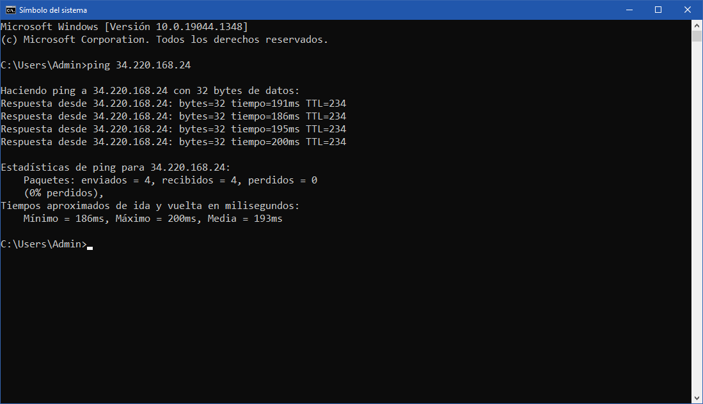
</p>

**Resultado:**
Ya puedes acceder a tu servidor Apache a través de tu navegador utilizando la Dirección IP Pública de tu instancia. Todo se encuentra operando con normalidad.