***

# ☁ Lab 267: Creación de una VPC y lanzamiento de un servidor web
**Nivel de Dificultad:** 🟢 Básico

**Tiempo Estimado:** ⏱ 45 minutos

**Servicios Principales:** Amazon VPC, Amazon EC2, NAT Gateway

### 📑 Resumen del Laboratorio
En este laboratorio aplicarás todos tus conocimientos sobre redes construyendo una arquitectura completa y lista para producción para un cliente Fortune 100. 

A diferencia de los laboratorios anteriores, aquí desplegarás un diseño de **Alta Disponibilidad (Multi-AZ)**. Crearás una VPC base, establecerás subredes públicas y privadas en diferentes Zonas de Disponibilidad, configurarás enrutamiento avanzado (incluyendo un NAT Gateway para la salida segura de las redes privadas), y finalmente, lanzarás un servidor web automatizado mediante un *script* (User Data) en la zona pública para comprobar el funcionamiento.

## 🏗️ Arquitectura del Laboratorio (El Objetivo)
A continuación se describe la arquitectura del cliente que debes construir desde cero:

<p align="center">
  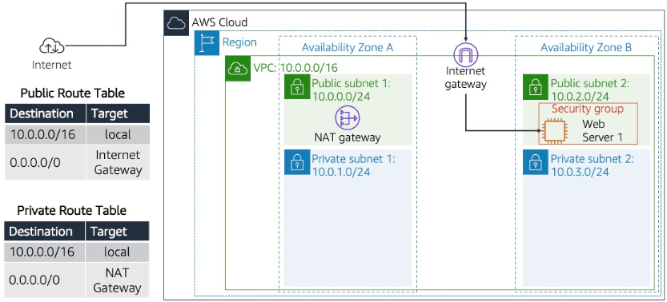
</p>

### 🎯 Objetivos de Aprendizaje
Al finalizar este laboratorio, serás capaz de:
1. Crear una Virtual Private Cloud (VPC) utilizando el asistente visual.
2. Añadir y distribuir subredes públicas y privadas a través de múltiples Zonas de Disponibilidad (Alta Disponibilidad).
3. Configurar grupos de seguridad (*Security Groups*) orientados a servicios web.
4. Desplegar una instancia EC2 inyectándole un script de auto-configuración (*User Data*) para convertirla en un servidor web Apache.

***

### 🛠️ Tarea 1: Crear tu VPC base y los primeros recursos

1. En la Consola de AWS, busca y abre el servicio **VPC**.
2. En el panel principal, haz clic en **Create VPC**.
3. Configura los siguientes parámetros exactos para la red del cliente:
   * **Resources to create:** Selecciona **VPC and more**.
   * **Name tag auto-generation:** **Desmarca** la casilla *Auto-generate*.
   * **IPv4 CIDR block:** Ingresa `10.0.0.0/16`.
   * **IPv6 CIDR block:** Deja *No IPv6 CIDR block*.
   * **Tenancy:** Deja *Default*.
   * **Number of Availability Zones (AZs):** Selecciona **1** (por ahora).
   * **Number of public subnets:** Selecciona **1**.
   * **Number of private subnets:** Selecciona **1**.
4. Despliega la pestaña **Customize subnets CIDR blocks** (Personalizar bloques CIDR) y ajusta:
   * **Public subnet CIDR block:** `10.0.0.0/24`
   * **Private subnet CIDR block:** `10.0.1.0/24`
5. **NAT gateways ($):** Selecciona **In 1 AZ** (Esto es clave para que la subred privada pueda descargar actualizaciones sin exponerse a Internet).
6. **VPC endpoints:** Selecciona **None**.
7. Ahora, en el panel lateral derecho (*Preview*), renombra los elementos lógicos haciendo clic en sus cajas de texto:
   * **VPC:** Escribe `Lab VPC`.
   * **Subnets (2):**
     * En la primera caja (pública): `Public Subnet 1`
     * En la segunda caja (privada): `Private Subnet 1`
   * **Route tables (2):**
     * En la primera caja (pública): `Public Route Table`
     * En la segunda caja (privada): `Private Route Table`
8. Haz clic en el botón inferior naranja **Create VPC**.
9. Espera a que termine la creación de todos los recursos (verás marcas de verificación verdes) y presiona **View VPC**.

<p align="center">
  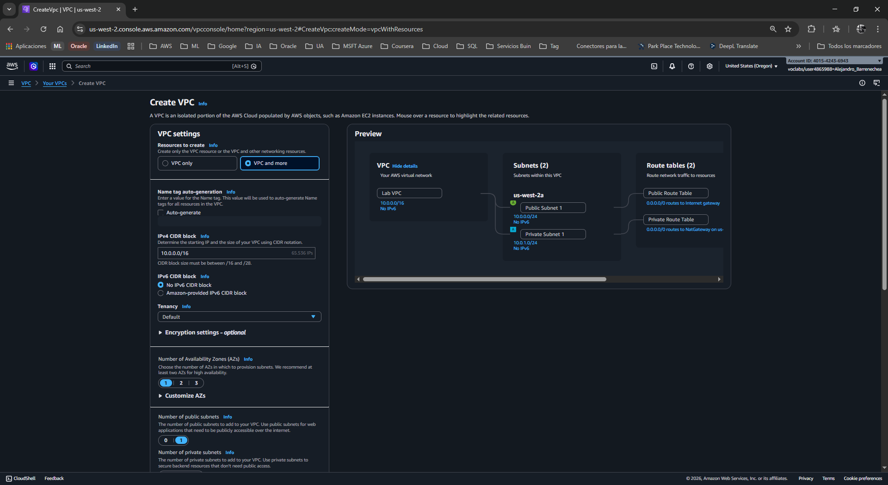
</p>
<p align="center">
  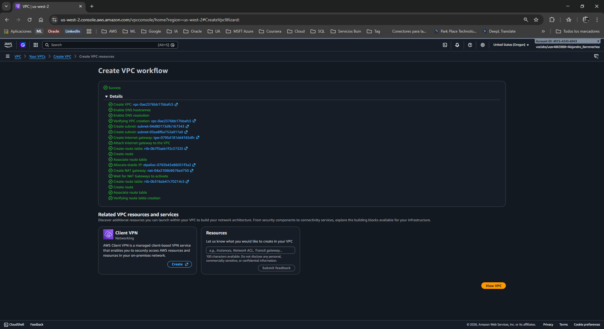
</p>
<p align="center">
  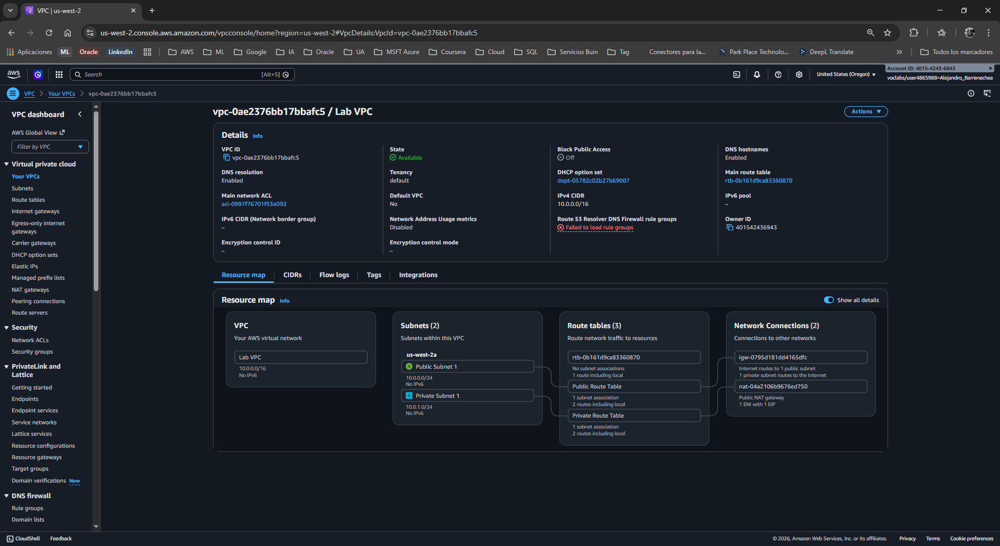
</p>
---

### 🌐 Tarea 2: Expandir la Red (Alta Disponibilidad - Crear subredes adicionales)

Para asegurar que la aplicación del cliente no se caiga si un centro de datos falla, debes extender la red a una segunda Zona de Disponibilidad.

1. En el panel izquierdo de la consola VPC, selecciona **Subnets** y haz clic en **Create subnet**.
2. **Crear Subred Pública 2:**
   * **VPC ID:** Selecciona tu `Lab VPC`.
   * **Subnet name:** `Public Subnet 2`
   * **Availability Zone:** *No preference* (AWS elegirá una distinta o la misma, para el laboratorio no es estricto, pero en la vida real elegirías explícitamente una AZ diferente a la de la Subnet 1).
   * **IPv4 CIDR block:** `10.0.2.0/24`
   * Clic en **Create subnet**.
3. Repite el proceso haciendo clic nuevamente en **Create subnet**.
4. **Crear Subred Privada 2:**
   * **VPC ID:** Selecciona tu `Lab VPC`.
   * **Subnet name:** `Private Subnet 2`
   * **Availability Zone:** *No preference*
   * **IPv4 CIDR block:** `10.0.3.0/24`
   * Clic en **Create subnet**.

<p align="center">
  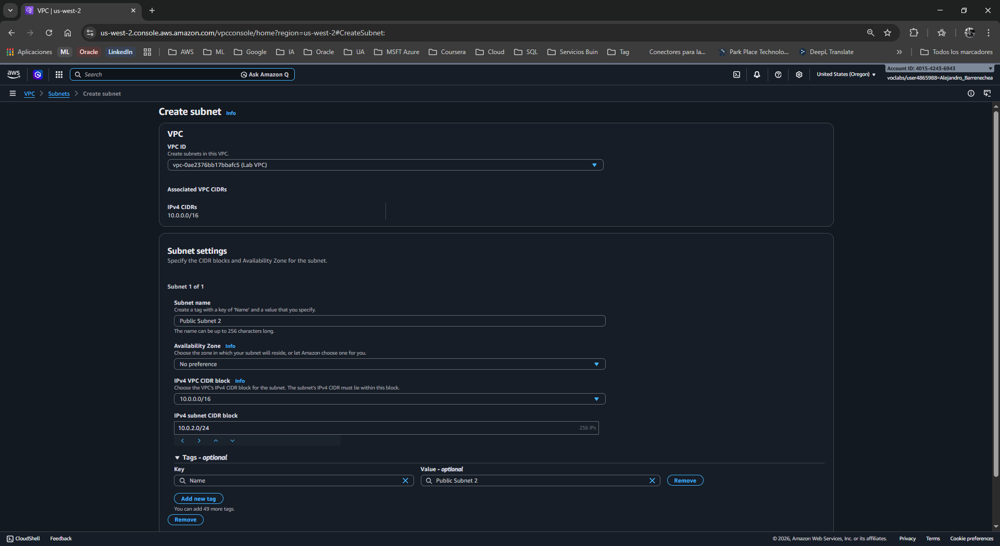
</p>
<p align="center">
  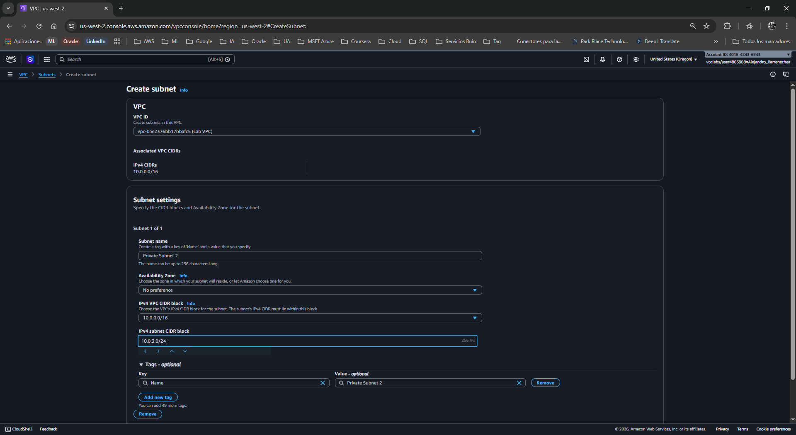
</p>
---

### 🗺️ Tarea 3: Asociar las nuevas subredes a las tablas de enrutamiento

Las subredes que acabas de crear no sirven de nada si no saben por dónde enviar el tráfico. Debes asociarlas a las "brújulas" correctas de la red.

1. En el panel izquierdo, selecciona **Route Tables**.
2. **Configurar la ruta Pública:**
   * Selecciona la tabla llamada `Public Route Table` (usando la casilla de verificación).
   * En el panel inferior, selecciona la pestaña **Subnet associations**.
   * Haz clic en el botón **Edit subnet associations**.
   * Marca la casilla junto a `Public Subnet 2`.
   * Haz clic en **Save associations**.

<p align="center">
  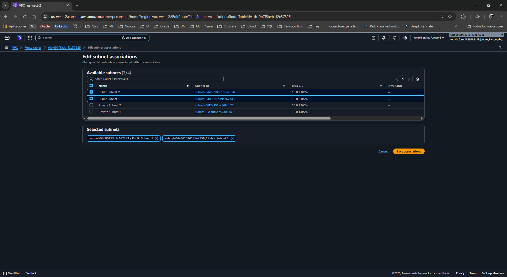
</p>

3. **Configurar la ruta Privada:**
   * Desmarca la tabla anterior y selecciona la `Private Route Table`.
   * Ve a la pestaña **Subnet associations** y haz clic en **Edit subnet associations**.
   * Marca la casilla junto a `Private Subnet 2`.
   * Haz clic en **Save associations**.

<p align="center">
  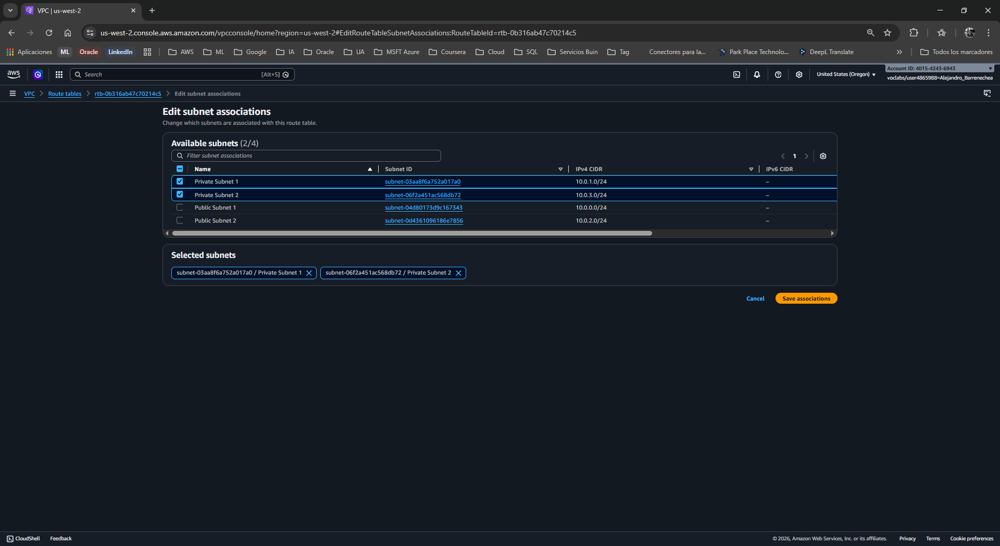
</p>

---

### 🛡️ Tarea 4: Crear un Grupo de Seguridad para el Servidor Web

Crea el firewall que protegerá específicamente a las instancias EC2 que alojen la página web.

1. En el panel izquierdo (aún en el servicio VPC), selecciona **Security Groups**.
2. Haz clic en **Create security group**.
3. Configura los siguientes detalles base:
   * **Security group name:** `Web Security Group`
   * **Description:** `Enable HTTP access`
   * **VPC:** Elimina la existente pinchando en la 'X' y selecciona tu `Lab VPC`.
4. En la sección **Inbound rules** (Reglas de entrada), haz clic en **Add rule**:
   * **Type:** `HTTP`
   * **Source:** `Anywhere-IPv4`
   * **Description:** `Permit web requests`
5. Haz clic en **Create security group**.

<p align="center">
  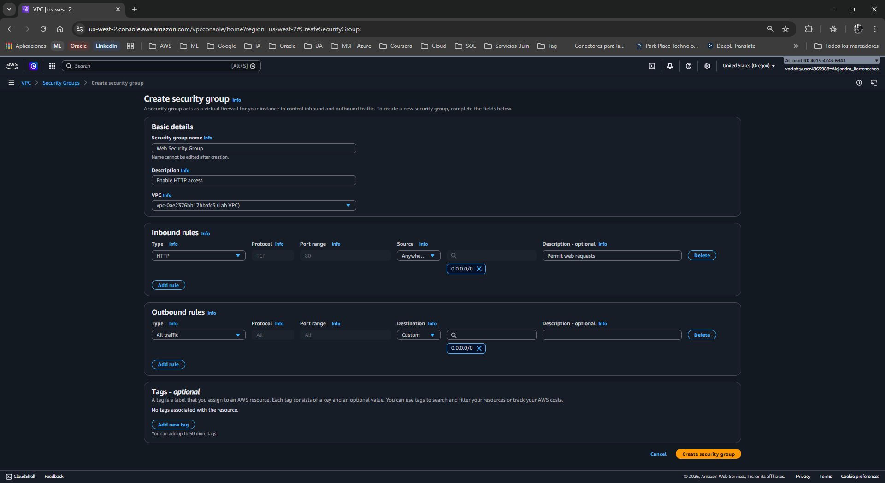
</p>

---

### 🚀 Tarea 5: Lanzar un servidor web automatizado

Finalmente, sembrarás un servidor dentro de la infraestructura que construiste para validar que todo funcione.

1. En la barra superior de AWS, busca y abre el servicio **EC2**.
2. En el panel izquierdo, selecciona **Instances** y haz clic en el botón naranja **Launch instances**.
3. Configura el servidor paso a paso:
   * **Name:** `Web Server 1`
   * **Amazon Machine Image (AMI):** Selecciona *Amazon Linux* y en el desplegable elige estrictamente **Amazon Linux 2 AMI (HVM)** *(Nota: No elijas la versión 2023 para este laboratorio específico).*
   * **Instance type:** `t3.micro`
   * **Key pair (login):** Selecciona `vockey`.
4. En **Network settings**, haz clic en el botón **Edit** (Editar) y configura:
   * **VPC:** Selecciona `Lab VPC`.
   * **Subnet:** Selecciona `Public Subnet 2`.
   * **Auto-assign public IP:** Selecciona **Enable** (Habilitar).
   * **Firewall (security groups):** Selecciona *Select existing security group* y marca la casilla de tu `Web Security Group`.
5. Despliega la pestaña **Advanced details** (Detalles avanzados) al final de la página.
6. Desplázate hasta el fondo, al cuadro de texto **User data**. Copia y pega el siguiente script exacto *(Este script instala Apache, PHP, descarga la página web del cliente y enciende el servidor automáticamente durante el arranque)*:

```bash
#!/bin/bash
#Install Apache Web Server and PHP
yum install -y httpd mysql php
#Download Lab files
wget https://aws-tc-largeobjects.s3.us-west-2.amazonaws.com/CUR-TF-100-RESTRT-1/267-lab-NF-build-vpc-web-server/s3/lab-app.zip
unzip lab-app.zip -d /var/www/html/
#Turn on web server
chkconfig httpd on
service httpd start
```

7. Haz clic en **Launch instance**.
8. Clic en **View all instances**. Espera hasta que *Web Server 1* muestre el estado *Running* y *2/2 checks passed*. (Puedes usar el botón de refrescar ↻).

<p align="center">
  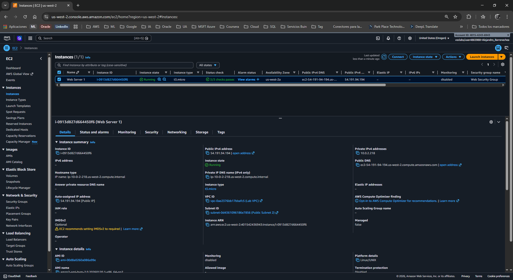
</p>

---

### 🌐 Comprobación Final del Cliente

1. Selecciona la casilla de tu `Web Server 1`.
2. En la pestaña inferior **Details**, copia el valor que aparece en **Public IPv4 DNS** (o la IP pública).
3. Abre una nueva pestaña en tu navegador, pega la dirección y presiona Enter.
4. **Resultado Exitoso:** Deberías ver la página web corporativa azul y blanca que indica que la aplicación del laboratorio funciona correctamente sobre tu infraestructura.

<p align="center">
  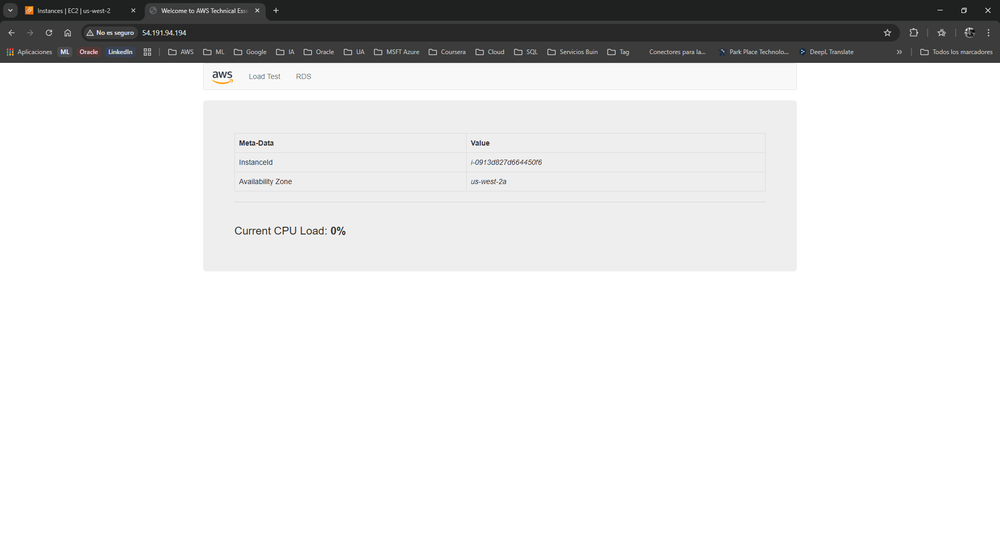
</p>
<p align="center">
  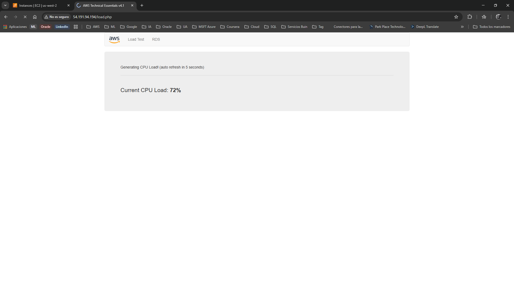
</p>
<p align="center">
  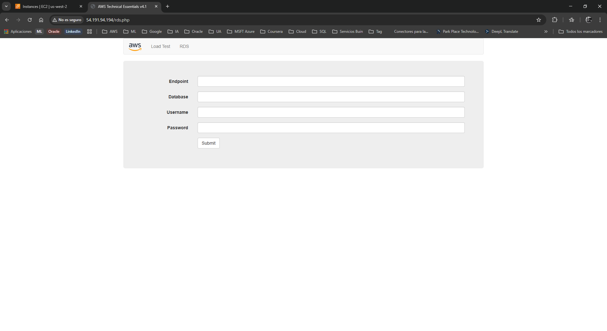
</p>
***