## 🛠️ Configuring an Amazon VPC
- **Dificultad:** Intermedia
- **Tiempo Estimado:** 45 min
- **Servicios Principales:** Amazon VPC ☁️, Amazon EC2 ☁️

### 📋 Resumen y Objetivos
En este laboratorio aprenderás a establecer la infraestructura de red base para cualquier despliegue seguro en AWS. Los hitos clave de aprendizaje incluyen:
- Crear una Virtual Private Cloud (VPC) con una subred pública y una privada.
- Configurar y adjuntar un Internet Gateway (IGW) y un NAT Gateway.
- Construir y asociar tablas de enrutamiento (Route Tables) para el tráfico de red interno e interconectado.
- Desplegar un servidor seguro tipo Bastion (Jump Box) en una subred pública.
- Acceder administrativamente a una instancia aislada en una subred privada pivotando a través del servidor Bastion host.

### 🔍 Análisis del Escenario
El diseño seguro de redes empresariales exige minimizar la superficie de ataque de la infraestructura a nivel lógico. Mediante este escenario, se demuestra la capacidad para delimitar perímetros de red virtuales. La solución técnica separa estrictamente los recursos que requieren accesibilidad global de aquellos que procesan o almacenan datos, impidiendo el acceso entrante desde el exterior a la capa privada. Al recurrir a un NAT Gateway, garantizas que los servidores backend puedan conectarse de forma unidireccional a internet (para aplicar parches o actualizaciones) sin quedar expuestos de forma pública. Además, el protocolo administrativo subyacente se canaliza controladamente a una única instancia reforzada, el Bastion.

### 🏗️ Arquitectura
La arquitectura de red comprende los siguientes componentes desplegados dentro de una única Zona de Disponibilidad:
- **VPC** (Rango CIDR `10.0.0.0/16`) como contenedor lógico de la red.
- **Subred Pública** (Rango CIDR `10.0.0.0/24`) con un host EC2 Bastion configurado para obtener una IPv4 pública.
- **Subred Privada** (Rango CIDR `10.0.2.0/23`) con una instancia de EC2 aislada.
- **Internet Gateway (IGW)** conectado a la VPC para proveer interconectividad.
- **NAT Gateway** desplegado en la subred pública y dotado de una Elastic IP para manejar la traducción de red saliente.
- **Tablas de Enrutamiento:** La tabla pública ruteando a internet vía el IGW y la tabla privada desviando el tráfico global `0.0.0.0/0` hacia el NAT Gateway.

<div align="center">
  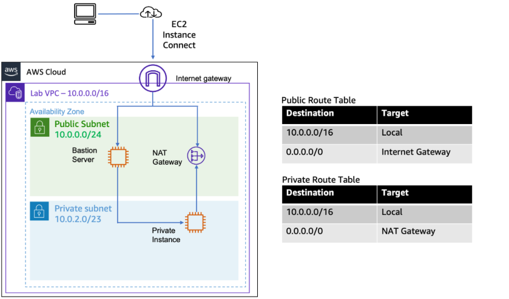
</div>

### 🚀 Desarrollo

#### 1. Creación e Inicialización de la VPC
1. Ve a la consola web de AWS, busca **VPC** en la barra superior unificada y accede al servicio.
2. En el panel de navegación izquierdo, dentro de *Virtual private cloud*, selecciona **Your VPCs**.
3. Selecciona **Create VPC** y configura lo siguiente:
   - **Resources to create:** Selecciona **VPC only**.
   - **Name tag:** Ingresa `Lab VPC`.
   - **IPv4 CIDR block:** Selecciona **IPv4 CIDR manual input**.
   - **IPv4 CIDR:** Escribe el bloque `10.0.0.0/16`.
   - **IPv6 CIDR block:** Mantén **No IPv6 CIDR block**.
   - **Tenancy:** Déjalo en **Default**.
4. Haz clic en **Create VPC**.

   <div align="center">
     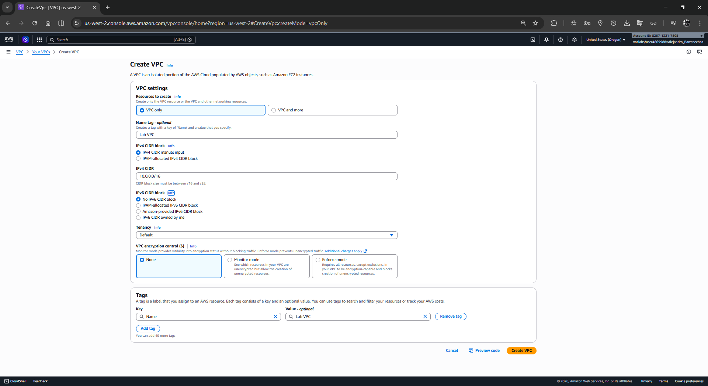
   </div>

5. Con la VPC creada, dirígete al menú **Actions** (esquina superior derecha) y luego a **Edit VPC settings**.
6. En la sección de *DNS settings*, marca el recuadro **Enable DNS hostnames**. Configurar esto es crítico para que las instancias reciban nombres de dominio DNS públicos.
7. Haz clic en **Save**.

   <div align="center">
     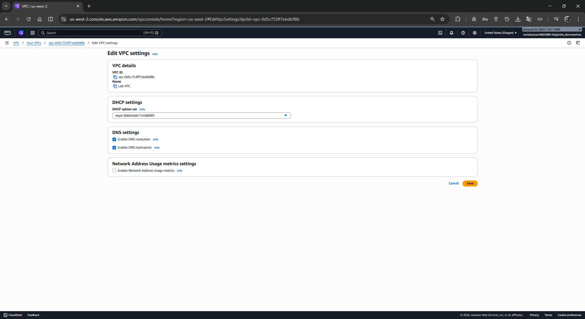
   </div>


#### 2. Segmentación de Subredes
**Paso 2.1: Crear y Configurar la Subred Pública**
1. En el panel lateral, dirígete a **Subnets** y haz clic en **Create subnet**.
2. Bajo *VPC ID*, selecciona tu `Lab VPC`.
3. En la sección *Subnet details*, ajusta los campos:
   - **Subnet name:** Ingresa `Public Subnet`.
   - **Availability Zone:** Selecciona la primera de la lista (Evita *No preference* para asegurar consistencia arquitectónica).
   - **IPv4 CIDR block:** Ingresa `10.0.0.0/24`.
4. Haz clic en **Create subnet**.

   <div align="center">
     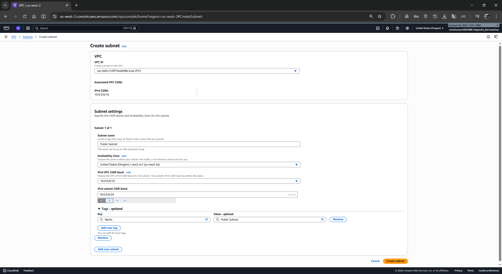
   </div>

5. Regresa a tu listado de subredes y marca tu nueva **Public Subnet**.
6. Ve al menú superior **Actions** y selecciona **Edit subnet settings**.
7. En el apartado *Auto-assign IP settings*, marca el recuadro **Enable auto-assign public IPv4 address**. 
8. Haz clic en **Save**. *(Nota: El auto-asignar IP no la vuelve pública. Necesitamos un Gateway en los siguientes pasos).*

   <div align="center">
     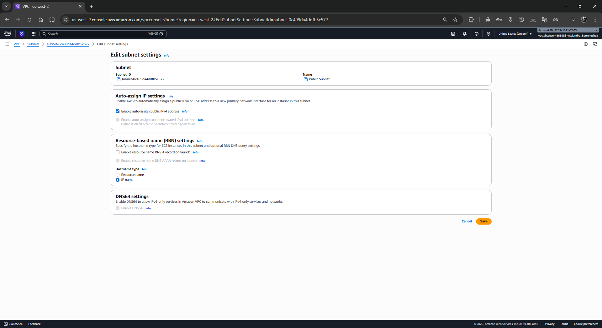
   </div>


**Paso 2.2: Crear la Subred Privada**
1. Nuevamente en **Subnets**, haz clic en **Create subnet**.
2. **VPC ID:** Selecciona de nuevo la `Lab VPC`.
3. Ingresa estos parámetros para encapsular la sección de red oculta:
   - **Subnet name:** Ingresa `Private Subnet`.
   - **Availability Zone:** Verifica usar exactamente **la misma AZ** que usaste en la subred pública.
   - **IPv4 CIDR block:** Ingresa el bloque ampliado `10.0.2.0/23`.
4. Haz clic en **Create subnet**.

   <div align="center">
     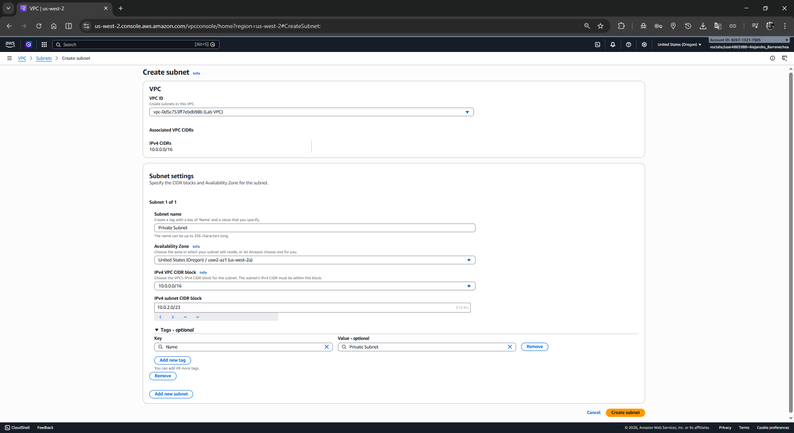
   </div>


#### 3. Configuración del Internet Gateway
1. En el menú de red izquierdo, dirígete a **Internet gateways**.
2. Selecciona **Create internet gateway**.
3. Bajo *Name tag*, ingresa `Lab IGW`.
4. Haz clic en **Create internet gateway**.

   <div align="center">
     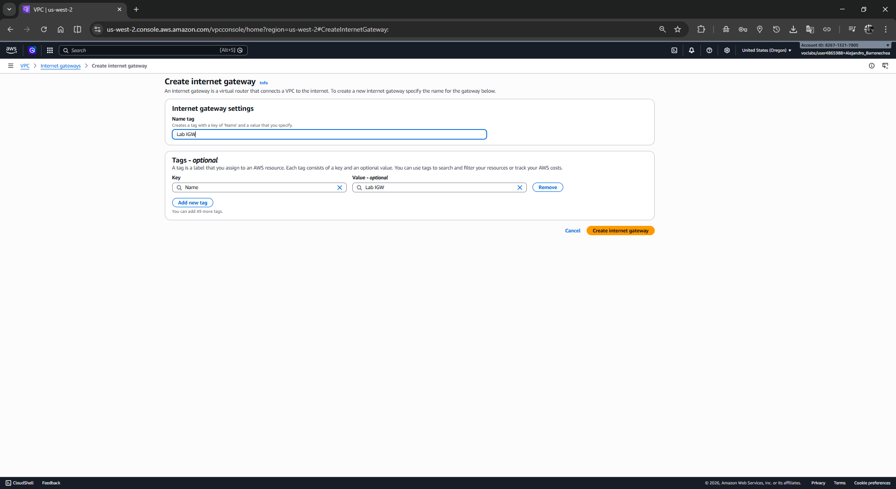
   </div>

5. Notarás que el estado de tu gateway es *Detached*. Ve a **Actions** y selecciona **Attach to a VPC**.
6. En el menú desplegable, selecciona tu `Lab VPC` y vincula el Gateway.

   <div align="center">
     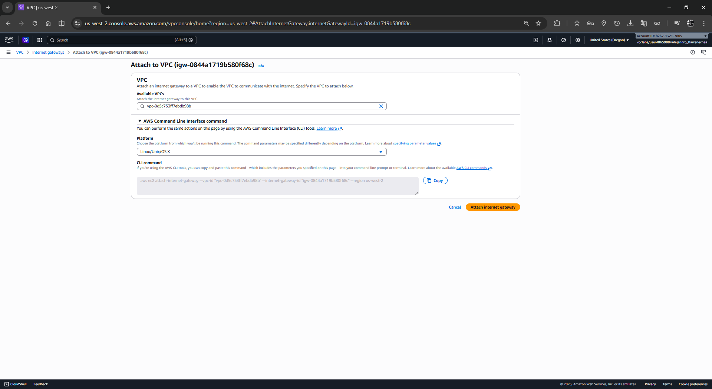
   </div>


#### 4. Manipulación de Tablas de Enrutamiento
1. En el panel izquierdo, selecciona **Route tables**. 
2. Observarás una tabla asignada a `Lab VPC`. Selecciona esta tabla predeterminada y, usando el ícono del lápiz en la columna *Name*, renómbrala a `Private Route Table` y guarda el cambio.

   <div align="center">
     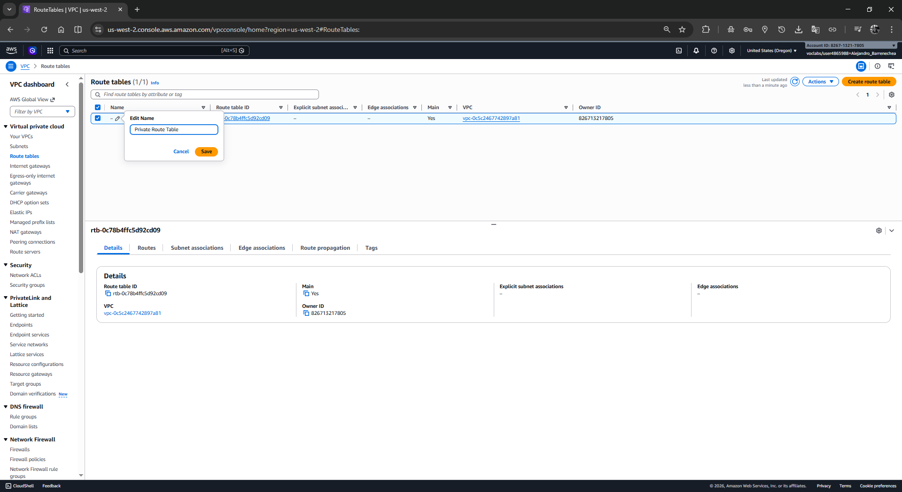
   </div>

3. Ahora haz clic en **Create route table**.
4. Configura sus parámetros:
   - **Name:** Ingresa `Public Route Table`.
   - **VPC:** Selecciona `Lab VPC`.
5. Selecciona **Create route table**.

   <div align="center">
     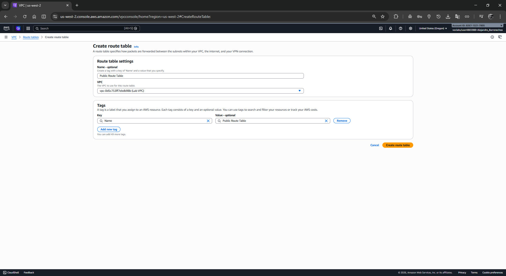
   </div>

6. Con la tabla pública recién generada a la vista, ve a la pestaña inferior **Routes** y selecciona **Edit routes**.
7. Crea una vía de escape al internet dando clic en **Add route**:
   - **Destination:** Ingresa la ruta de red global de ceros (`0.0.0.0/0`).
   - **Target:** Despliega, selecciona **Internet Gateway** y elige el `Lab IGW` que creaste.
8. Haz clic en **Save changes**.

   <div align="center">
     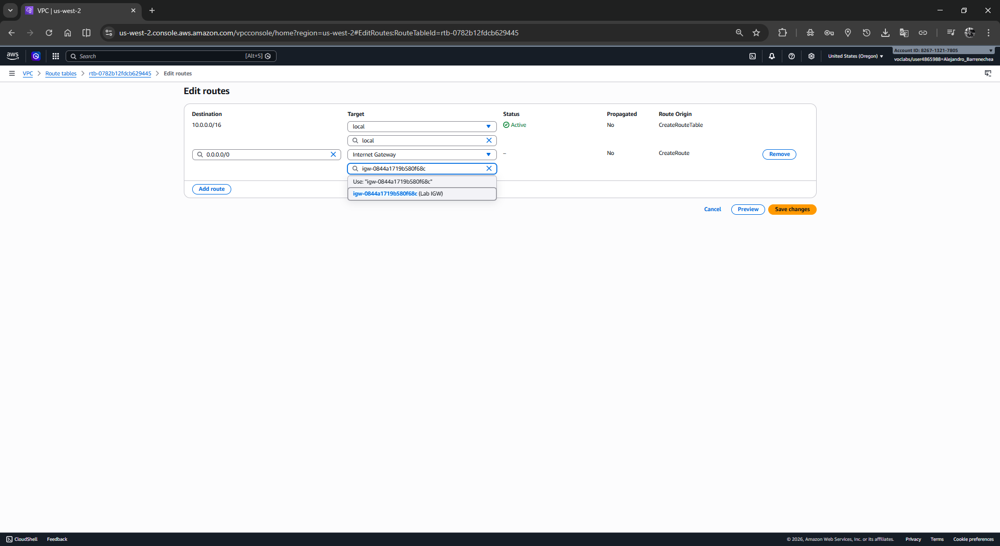
   </div>

9. Dirígete a la pestaña **Subnet associations** y luego a **Edit subnet associations**.
10. Ubica y selecciona tu registro **Public Subnet**, finalmente presiona **Save associations**.

   <div align="center">
     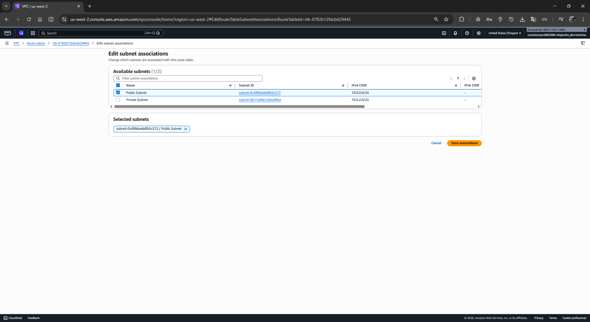
   </div>


#### 5. Despliegue de un Bastion Host (Red Pública)
1. Ubícate en el buscador principal unificado, teclea **EC2** y navega al servicio.
2. Accede a **Instances** y selecciona **Launch instances**.
3. **Nombre y Etiquetas:** Escribe `Bastion Server`.
4. **Imágenes de Sistema y SO (AMI):** Confirma que la pestaña *Amazon Linux* y la versión **Amazon Linux 2023 AMI** se encuentran seleccionadas.
5. **Tipo de instancia:** Mantén el tamaño dentro de la capa gratuita, *t3.micro* o *t2.micro* según tu región.
6. **Par de claves (Login):** Extrae el colector y selecciona **Proceed without a key pair**. Utilizaremos Instance Connect directo en su capa de shell.

   <div align="center">
     
   </div>

7. Ubica el panel **Network settings**, haz clic en **Edit** y aplica estos parámetros estandarizados:
   - **VPC:** Mueve el selector hacia `Lab VPC`.
   - **Subnet:** Selecciona `Public Subnet`.
   - **Auto-assign public IP:** Asegúrate de que apunte a `Enable`.
   - **Firewall:** Marca la opción **Create security group**.
   - **Nombre de grupo de seguridad:** `Bastion Security Group`.
   - **Descripción:** `Allow SSH`.
   - En las reglas integradas, el tipo debe ser **ssh** y el origen **Anywhere** (0.0.0.0/0).
8. Haz clic en **Launch instance**.

   <div align="center">
     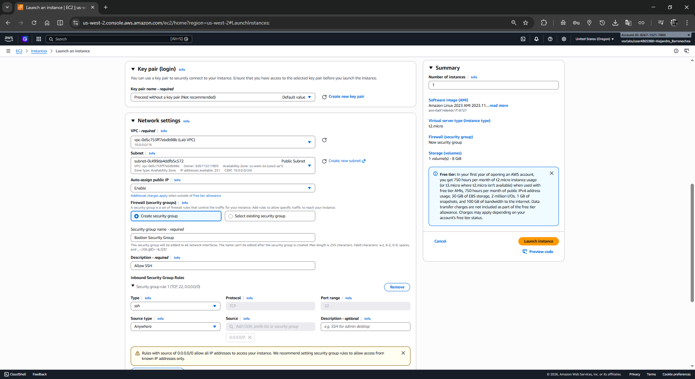
   </div>


#### 6. Instalación de un NAT Gateway (Túnel para Tráfico Privado)
1. Nuevamente en la barra de búsqueda de la AWS Console, accede al catálogo escribiendo **NAT gateways** y selecciona el recurso bajo *Features*. 
2. Haz clic en **Create NAT gateway**.
3. Define sus propiedades:
   - **Name:** Ingresa `Lab NAT gateway`.
   - **Subnet:** Selecciona de la lista la **Public Subnet**.
   - Haz clic al botón paramétrico **Allocate Elastic IP** para registrar una IP de borde perimetral robusta.
4. Finaliza en **Create a NAT gateway**.

   <div align="center">
     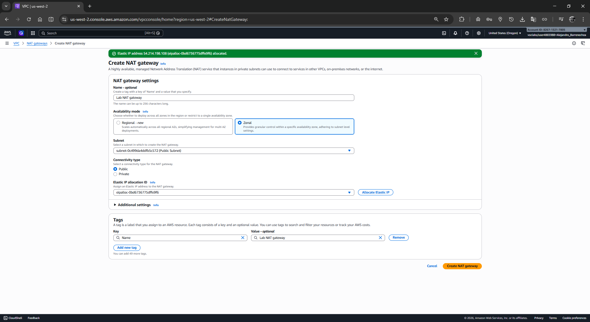
   </div>

5. Regresa usando el panel lateral de VPC hacia **Route tables**, y selecciona la tabla `Private Route Table`.
6. En la barra inferior usa la pestaña **Routes** -> **Edit routes** y presiona la opción **Add route**:
   - **Destination:** Ingresa destino global `0.0.0.0/0`.
   - **Target:** Busca el tipo **NAT Gateway** y enlaza tu nodo recién elaborado (`nat-xxxxxxxxx`).
7. Confirma haciendo clic en **Save changes**.

   <div align="center">
     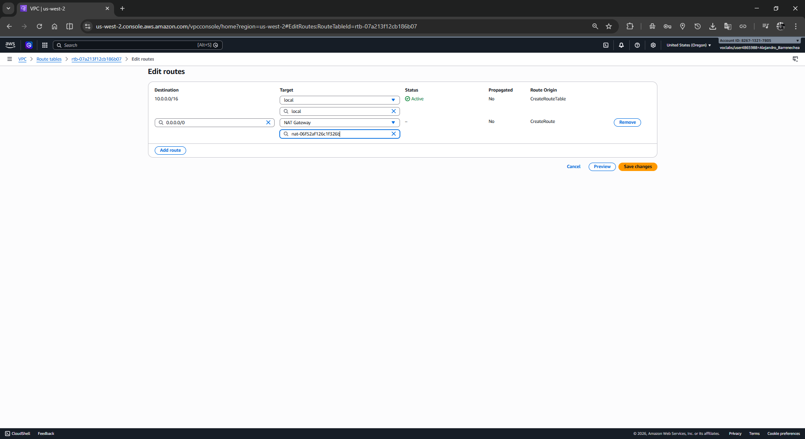
   </div>


#### 7. Reto Adicional: Aprovisionar Instancia Privada y Validación
1. Vuelve al panel web de **EC2**, desplázate a **Instances** y haz un lanzamiento nuevo con **Launch instances**.
2. Configura los siguientes identificadores:
   - **Name:** `Private Instance`.
   - **AMI:** Usa la confiable **Amazon Linux 2023 AMI**.
   - **Tipo de instancia:** `t3.micro`.
   - **Key pair:** Selecciona **Proceed without a key pair**.

   <div align="center">
     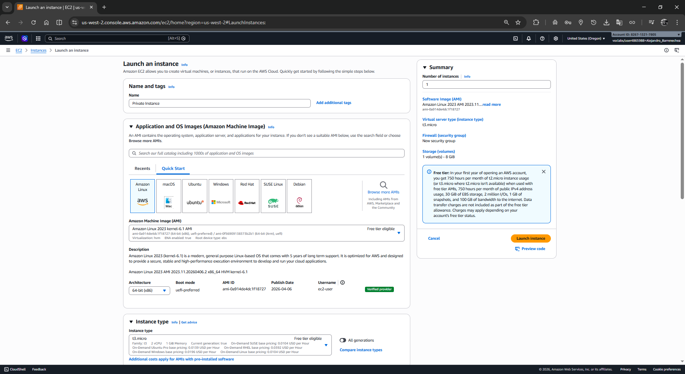
   </div>

3. Edita sus redes (*Network settings*):
   - **VPC:** Anclado a tu `Lab VPC`.
   - **Subnet:** ¡Extrema precaución! Selecciona tu `Private Subnet`.
   - Crea un nuevo componente de seguridad llamado `Private Instance SG` integrando la descripción `Allow SSH from Bastion`.
   - Para el tráfico entrante, mantén el tipo **ssh**, pero cambia el componente y origen a **Custom**, asignando el bloque de IP de tu propia red: `10.0.0.0/16`.

   <div align="center">
     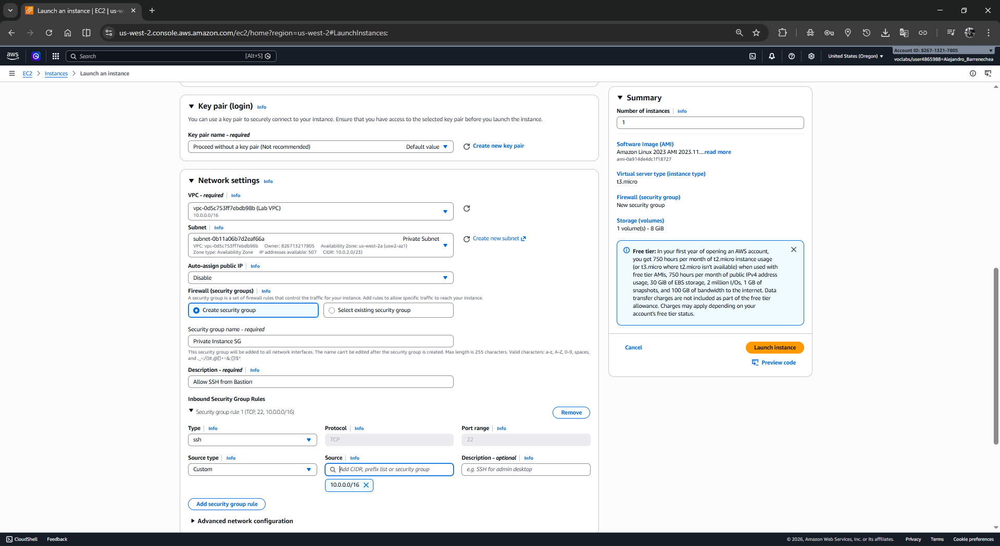
   </div>

4. Ve hasta la barra desplegable al fondo nombrada **Advanced Details**, encuentra el recuadro final *User data*, y copia este código exacto para omitir las llaves RCA e inyectar validación por contraseña:
   ```bash
   #!/bin/bash
   # Turn on password authentication for lab challenge
   echo 'lab-password' | passwd ec2-user --stdin
   sed -i 's|[#]*PasswordAuthentication no|PasswordAuthentication yes|g' /etc/ssh/sshd_config
   systemctl restart sshd.service
   ```
5. Aplica los cambios usando **Launch instance**.

   <div align="center">
     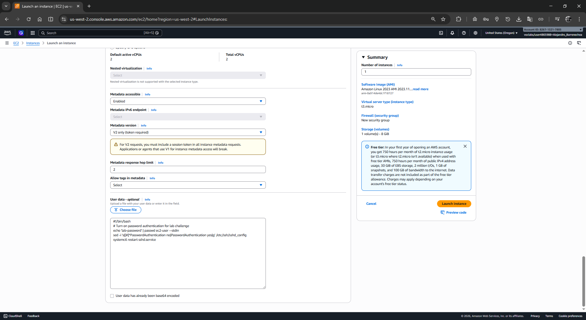
   </div>

6. En el apartado de instancias de EC2, selecciona tu instancia privada sin marcar nada más. Anota en tu portapapeles su número **Private IPv4 address**. (Típicamente empezará por *10.0.2.* o *10.0.3.*).

   <div align="center">
     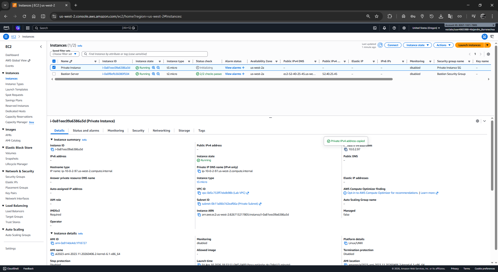
   </div>

7. Selecciona ahora estrictamente la instancia **Bastion Server** y pulsa el botón en pantalla superior **Connect**. Ingresa por vía **EC2 Instance Connect** a su formato Web SSH interactivo.
8. Unifica y ejecuta la cadena siguiente desde esta terminal, reemplazando con la IP privada previamente guardada:
   ```bash
   ssh 10.0.2.XXX
   ```
9. Recibirás una alerta estandarizada criptográfica de entorno. Ingresa `yes` seguido de la clave embebida `lab-password`.
10. Una vez dentro de la nueva máquina EC2 de tu capa privada, inyecta tráfico ping a un perímetro global exterior para verificar exitosamente el enrutamiento bidireccional del NAT Gateway. *(Nota: Usaremos Google u 8.8.8.8 en lugar de amazon.com, ya que los balanceadores perimetrales de Amazon suelen bloquear las peticiones ICMP por motivos de seguridad, lo que arrojaría un falso error).*
   ```bash
   ping -c 3 google.com
   ```

   <div align="center">
     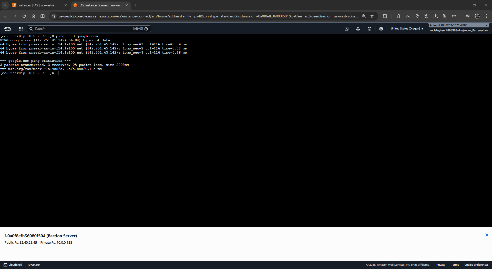
   </div>


### 🧠 Análisis de Control (Q&A)

**P: Arquitectónicamente, ¿por qué ubicar el Bastion Server en la red pública mientras los servidores y bases de datos deben existir en la privada?**  
Al existir el host tipo Jump Box o Bastion de manera atenuada en la subred pública, este logra abstraer todo tráfico administrativo. Actúa como el único equipo dotado inherentemente de IP pública, reduciendo notoriamente la superficie técnica de ataque. Al cerrar el Security Group interno (`Private Instance SG`) para permitir peticiones entrantes exclusivas desde el origen CIDR local (el Bastion), los recursos de red privada se desvanecen ante cualquier ataque perimetral que ingrese enrutado desde redes foráneas de la web general.

**P: Analizando el tamaño definido, ¿por qué la subred pública emplea una máscara /24 local frente a una máscara /23 nativa de la subred privada?**  
Las arquitecturas bajo estatus de AWS Well-Architected Framework fomentan dimensionar la cantidad de direcciones IP en relación a una expansión natural e intrínseca de servicios. El bloque `/23` ofrece 512 IPs nominales; el doble con respecto a las 256 de un bloque `/24`. Las EC2 subyacentes, contenedores EKS/ECS, y bases de datos RDS, generalmente viven de facto en las capas privadas, consumiendo la mayor parte de las direcciones generadas intra-VPC. La red pública se concibe pragmáticamente como alojamiento simplificado y transitorio solo para un grupo de componentes menores de balanceador (ALBs) o bastiones. 

**P: ¿Qué deficiencia solucionó enrutar la red privada local a través de un Gateway tipo NAT transversal junto al IGW?**  
Los sistemas sin interface pública virtual de enrutamiento son incapaces de navegar por internet inclusive adjuntando un Internet Gateway y una tabla por defecto, siendo vulnerables a quedar incomunicados y sin parches (Patch Management Caching). Al disponer de un Gateway NAT en una subred expuesta perimetralmente con Elastic IP y asignar a los servicios ocultos (Privados) una ruta a todo el tráfico foráneo (`0.0.0.0/0`), se les dota mecánicamente con internet exterior para descarga o actualizaciones (Outbound) pero repeliendo cualquier flujo exótico de iniciativa entrante (Inbound) del exterior al negar un túnel portuario abierto o el acceso nominal.
