# Actividad: Solución de Problemas en una VPC (Troubleshooting)

## 🌐 Resumen del Laboratorio
En este laboratorio, solucionarás problemas de configuración de una Virtual Private Cloud (VPC) y analizarás capturas de red utilizando *VPC Flow Logs*.

Comenzarás con un entorno que incluye dos VPCs, instancias Amazon Elastic Compute Cloud (Amazon EC2) y otros componentes de red que se muestran en el siguiente diagrama. El diagrama también muestra cuatro círculos numerados (#1–4) que indican el orden en el que realizarás las tareas.

<div align="center">
  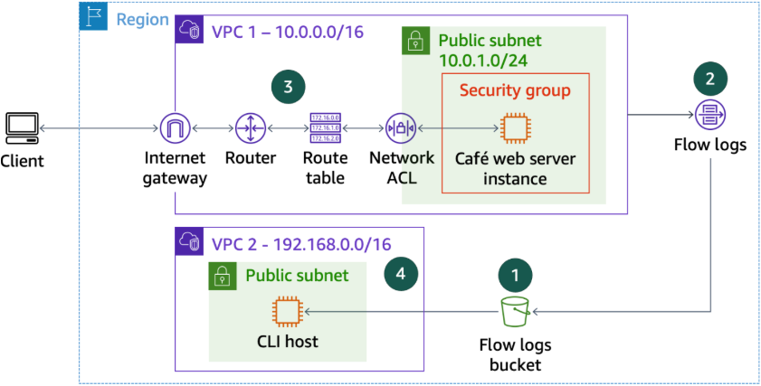
</div>

*Componentes de VPC que soportan el entorno de ejecución de la instancia café web server. El diagrama también muestra una instancia CLI Host ubicada en una VPC separada para ejecutar los comandos necesarios. Las etiquetas numeradas en el diagrama identifican los pasos principales a seguir.*

**Tus tareas incluyen lo siguiente:**
1. Crear un bucket de Amazon S3 para guardar los datos de VPC Flow Logs.
2. Crear un registro de flujo (*flow log*) para capturar todo el tráfico IP que pasa por las interfaces de red de la VPC.
3. Solucionar los problemas de configuración de la VPC para permitir el acceso a los recursos.
4. Descargar y analizar los datos arrojados por el *flow log*.

## 🎯 Objetivos
Al finalizar este laboratorio, serás capaz de:
* Crear VPC Flow Logs.
* Solucionar problemas (*troubleshooting*) de configuración en una VPC.
* Analizar registros de tráfico de red.
---

## 💻 Tarea 1: Conexión a la instancia anfitriona de la CLI (CLI Host)
En esta tarea, usarás EC2 Instance Connect para conectarte a la instancia CLI Host y ejecutar comandos de AWS Command Line Interface (AWS CLI).

1. En la consola de AWS, busca y selecciona `EC2` para abrir la consola de **EC2**.
2. En el panel de navegación, elige **Instances** (Instancias).
3. De la lista, selecciona la instancia **CLI Host**.
4. Haz clic en **Connect** (Conectar).

<div align="center">
  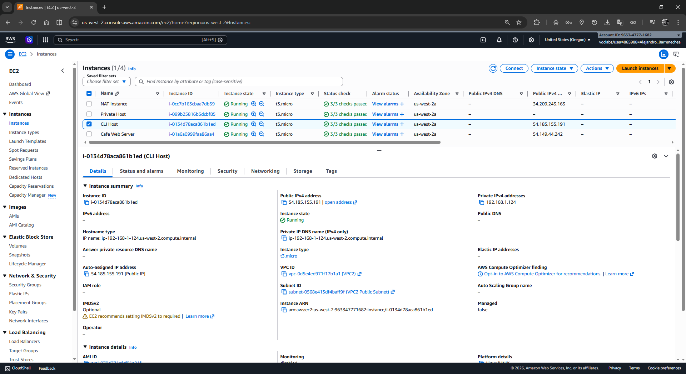
</div>

5. En la pestaña de **EC2 Instance Connect**, presiona **Connect**.

<div align="center">
  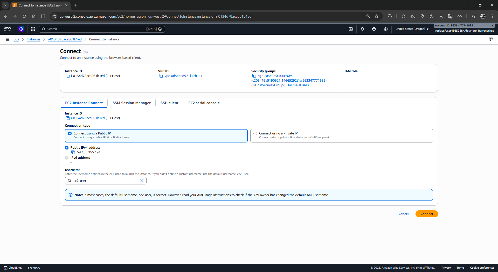
</div>

### Tarea 1.1: Configuración de AWS CLI
Ahora que estás conectado a la instancia CLI Host, debes configurar un perfil con credenciales para realizar llamadas a los diferentes servicios de AWS desde la consola.

En la terminal, ejecuta este comando: 
```bash
aws configure
```

Completa los valores introduciendo las credenciales listadas en la tabla inicial de esta guía:
* **AWS Access Key ID**: Ingresa
* **AWS Secret Access Key**: Ingresa 
* **Default region name**: Ingresa `us-west-2`
* **Default output format**: Ingresa `json`

<div align="center">
  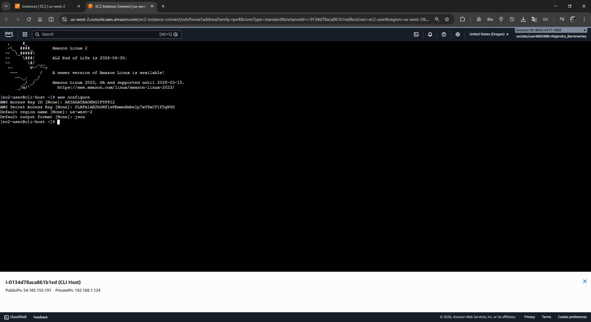
</div>

---

## 📝 Tarea 2: Creación de VPC Flow Logs
En esta tarea, crearás un bucket S3 para publicar datos desde VPC Flow Logs. Luego crearás flujos en la **VPC1** para capturar el tráfico IP que transite por ella.

1. Crea tu bucket S3 ejecutando el respectivo comando (Asegúrate que devuelva el enlace a tu 'Location'):

```bash
aws s3api create-bucket --bucket flowlog74921abg --region 'us-west-2' --create-bucket-configuration LocationConstraint='us-west-2'
```

> La salida en JSON debe mostrar `http://flowlog74921abg.s3.amazonaws.com`.

2. Puedes consultar el ID de tu **VPC1** (`vpc-0ecb7455557ae438c`) ejecutando el siguiente comando:

```bash
aws ec2 describe-vpcs \
  --query 'Vpcs[*].[VpcId,Tags[?Key==`Name`].Value,CidrBlock]' \
  --filters "Name=tag:Name,Values='VPC1'"
```

<div align="center">
  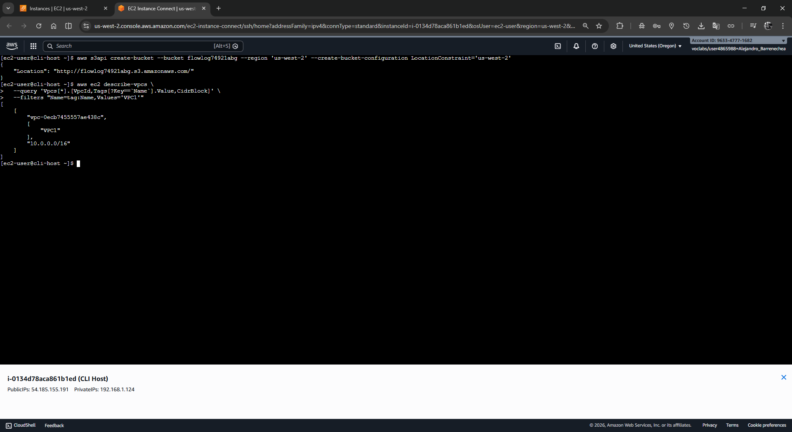
</div>

3. Crea los VPC Flow Logs sobre tu **VPC1** dirigiendo la salida a tu bucket aprovisionado:

```bash
aws ec2 create-flow-logs \
  --resource-type VPC \
  --resource-ids vpc-0ecb7455557ae438c \
  --traffic-type ALL \
  --log-destination-type s3 \
  --log-destination arn:aws:s3:::flowlog74921abg
```

> El resultado arroja un `FlowLogIds`. Puedes ignorar el mensaje de *Unsuccessful* si llegara a aparecer.

4. Confirma que el registro se creó exitosamente:

```bash
aws ec2 describe-flow-logs
```

Verifica en la salida JSON que el `FlowLogStatus` sea **ACTIVE**.

<div align="center">
  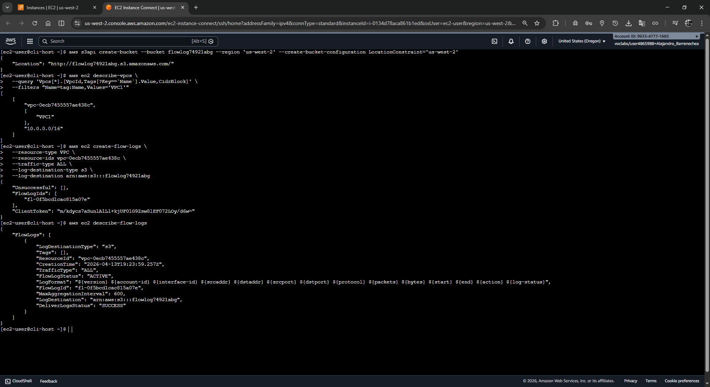
</div>

---

## 🕵️‍♂️ Tarea 3: Solución de problemas de configuración (Troubleshooting) de la VPC
En esta tarea, analizaremos por qué está fallando el acceso al **Web Server** y qué problemas tiene la red. El web server (`54.149.44.242`) debería correr en la subred pública de tu **VPC1**, pero algo está impidiendo acceder a él.

1. Abre una nueva pestaña en tu navegador y escribe la IP del servidor web: `54.149.44.242`.
2. Espera unos momentos. Cargar la página debe fallar por alcance de tiempo de espera (timeout). **Este fallo es esperado.**
3. Deja esa pestaña abierta.

<div align="center">
  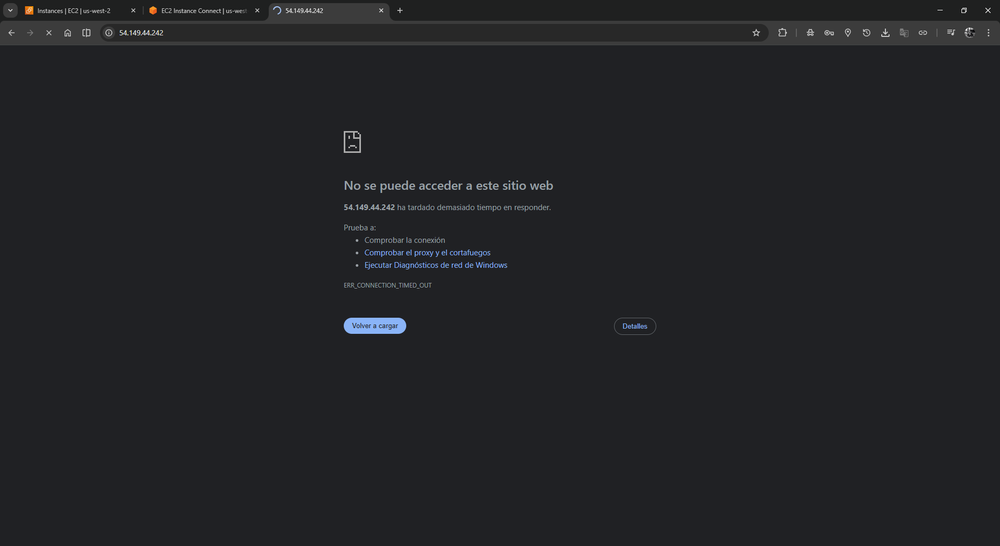
</div>

Vuelve a la terminal del **CLI Host** e inspecciona los detalles de tu Web Server ejecutando este filtro por IP:

```bash
aws ec2 describe-instances --filter "Name=ip-address,Values='54.149.44.242'" \
  --query 'Reservations[*].Instances[*].[State,PrivateIpAddress,InstanceId,SecurityGroups,SubnetId,KeyName]'
```

El comando confirmará que la instancia está corriendo (*running*), devolviendo el grupo de seguridad `sg-00c8a2530595ed156` y la subred `subnet-075b3df055df1ff49`.

<div align="center"> 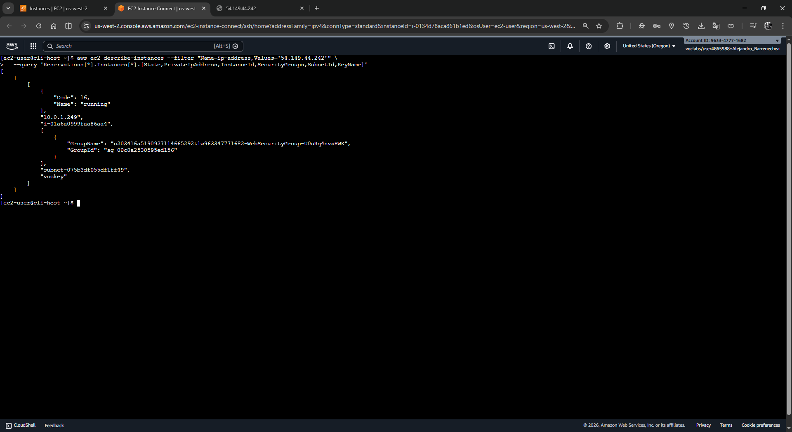

A continuación, intenta conectarte usando SSH desde la consola de EC2 Web:
1. Ve a **EC2** en AWS Management Console, elige **Instances** y selecciona **Cafe Web Server**.
2. Dale clic en **Connect** > Pestaña **EC2 Instance Connect** > **Connect**.
3. **El intento fallará tras unos segundos.** Esto también es el comportamiento esperado.

<div align="center">
  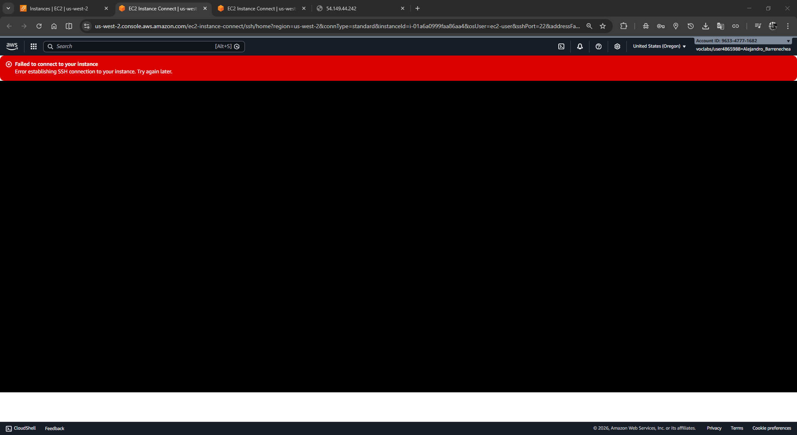
</div>

### 🔍 Desafío de Troubleshooting #1: Sin acceso Web (Puerto 80) e intento de SSH fallido

Sabes que el servidor web existe y está corriendo, pero tanto el web (Pto. 80) como el EC2 Connect por SSH (Pto. 22) te están tirando error.

[!NOTE]
**Insight de Arquitectura: Análisis OSPF/Tráfico del flujo**
En AWS, para que una subred sea verdaderamente "pública" y podamos alcanzar sus instancias desde la web, requerimos dos cosas vitales:
1. Que las reglas de los Security Groups permitan la conexión.
2. Que la **Tabla de Ruteo** (**Route Table**) asignada a la subred apunte explícitamente cualquier tráfico no local `0.0.0.0/0` hacia un Internet Gateway (IGW).

**Pistas y Pasos de Investigación (Vía CLI):**
* **Security Groups:** Puedes usar `aws ec2 describe-security-groups --group-ids sg-00c8a2530595ed156`. Verás que las reglas aparentemente no tienen problema para permitir tráfico.
* **Route Tables:** Revisa la ruta de tu subred `subnet-075b3df055df1ff49`:
  ```bash
  aws ec2 describe-route-tables --filters "Name=association.subnet-id,Values='subnet-075b3df055df1ff49'"
  ```

<div align="center">
  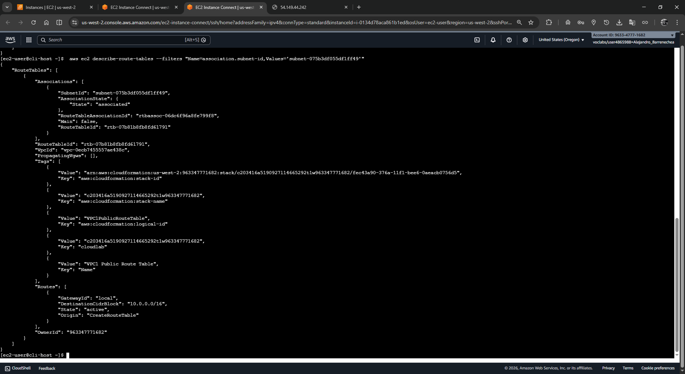
</div>

* **El Arreglo:** ¡Ahí está el problema! Al analizar el output, verás que la tabla de ruteo (`rtb-07b81b8fb8fd61791`) asignada al Web Server carece de una ruta a internet. Conociendo tu Internet Gateway (`igw-09d6bd0d0f00efed6`), inyectemos la ruta nosotros mismos:
  ```bash
  aws ec2 create-route \
    --route-table-id rtb-07b81b8fb8fd61791 \
    --destination-cidr-block 0.0.0.0/0 \
    --gateway-id igw-09d6bd0d0f00efed6
  ```

Actualiza la pestaña de tu navegador (`54.149.44.242`). ¡Ahora debería cargar indicando **"Hello From Your Web Server!"**!

<div align="center">
  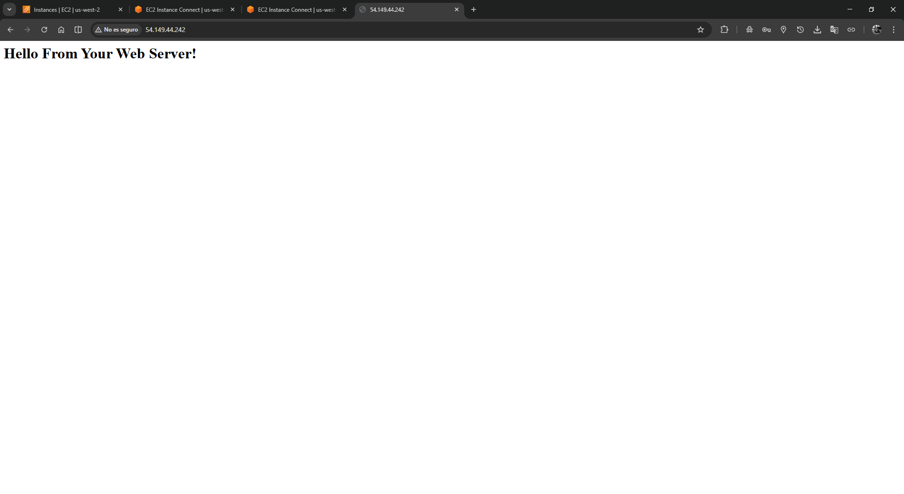
</div>

---

### 🔍 Desafío de Troubleshooting #2: Sigue fallando el SSH y EC2 Connect

A pesar de que arreglaste el enrutamiento a internet y la página web ya funciona, si tratas de conetarte a la instancia **Web Server** vía EC2 Instance Connect ¡Volverá a fallar! ¿Qué falta?

> [!NOTE]
> **Insight de Arquitectura: Security Groups vs Network ACLs**
> Recuerda la regla de oro en AWS: Los Security Groups son stateful (con estado) y operan a nivel de interfaz de red (instancia), pero las **Network ACLs** son stateless (sin estado) y operan como un muro a nivel de **subred completa**. Es altamente probable que un bloqueo manual con un "DENY" explícito en la NACL esté afectando tu puerto de SSH (22).

**Pistas y Pasos de Investigación (Vía CLI):**
* **Network ACLs:** Examina las configuraciones NACL en la subred de tu Web Server (`subnet-075b3df055df1ff49`):
  ```bash
  aws ec2 describe-network-acls \
    --filters "Name=association.subnet-id,Values='subnet-075b3df055df1ff49'" \
    --query 'NetworkAcls[*].[NetworkAclId,Entries]'
  ```

  **Salida devuelta (`NetworkAclId` y Entradas evaluadas):**
  ```json
  [
      "acl-015baf106974e4dc9", 
      [
          { "RuleNumber": 40, "Protocol": "6", "PortRange": { "To": 22, "From": 22 }, "Egress": false, "RuleAction": "deny", "CidrBlock": "0.0.0.0/0" }, 
          { "RuleNumber": 100, "Protocol": "-1", "Egress": false, "CidrBlock": "0.0.0.0/0", "RuleAction": "allow" }
      ]
  ]
  ```
  *(Nota: Se han omitido reglas adicionales de la salida para facilitar la lectura).*

  Al analizar el código devuelto, observarás que la **Regla 40** bajo el identificador `acl-015baf106974e4dc9` está bloqueando proactivamente el tráfico de ingreso (`"RuleAction": "deny"`, `"Egress": false`) precisamente en el puerto 22. ¡Ahí está el culpable!

<div align="center">
  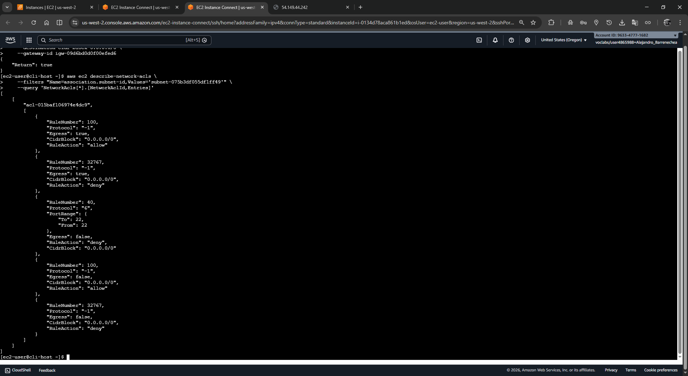
</div>

* **El Arreglo:** Elimina de raíz esa regla maliciosa que impide el puerto 22, inyectando los identificadores exactos que hallaste:
  ```bash
  aws ec2 delete-network-acl-entry \
    --network-acl-id acl-015baf106974e4dc9 \
    --rule-number 40 \
    --ingress
  ```

Trata de conectarte a **EC2 Instance Connect** desde la web nuevamente. Al ingresar, ejecuta el comando `hostname` en la terminal linux web para confirmar que, esta vez, estás dentro de la máquina `web-server`. 

¡Felicidades! Has resuelto ambos bloqueos de red.

<div align="center">
  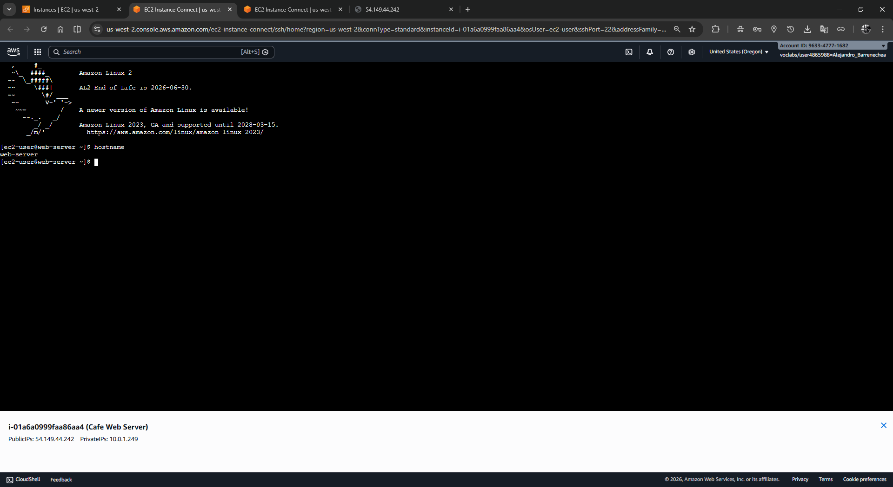
</div>

---

## 📊 Tarea 4: Análisis de Flow Logs
Mientras solucionabas los problemas anteriores, generaste intentos de accesos fallidos que fueron capturados por el VPC Flow Logs de la tarea 2. Ahora vas a extraerlos de AWS S3.

### Tarea 4.1: Descargar y descomprimir los Flow Logs
1. En tu terminal original (CLI Host), crea una carpeta local para los registros y entra a ella:
```bash
mkdir flowlogs
cd flowlogs
```
2. Descarga la totalidad de logs desde tu bucket utilizando la ruta recursiva:
```bash
aws s3 cp s3://flowlog74921abg/ . --recursive
```
3. Navega de manera adyacente dentro del sistema de directorios usando tu Account ID e inyectando la fecha correspondiente:
```bash
cd AWSLogs/963347771682/vpcflowlogs/us-west-2/2026/04/13/
```
4. El comando `ls` revelará los archivos comprimidos correspondientes a tus flujos:
```text
963347771682_vpcflowlogs_us-west-2_fl-0f5bcd1cac815a07e_20260413T1920Z_3f4e3764.log.gz  963347771682_vpcflowlogs_us-west-2_fl-0f5bcd1cac815a07e_20260413T1930Z_20034881.log.gz
963347771682_vpcflowlogs_us-west-2_fl-0f5bcd1cac815a07e_20260413T1925Z_7c2439fe.log.gz  963347771682_vpcflowlogs_us-west-2_fl-0f5bcd1cac815a07e_20260413T1930Z_90af117b.log.gz
963347771682_vpcflowlogs_us-west-2_fl-0f5bcd1cac815a07e_20260413T1925Z_cf348c96.log.gz  963347771682_vpcflowlogs_us-west-2_fl-0f5bcd1cac815a07e_20260413T1935Z_1fa5f42d.log.gz
```
   Para descomprimirlos masivamente en texto plano y analizarlos, corre el comando GNU Zip:
```bash
gunzip *.gz
```

<div align="center">
  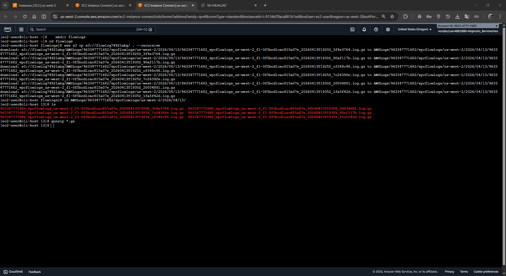
</div>

### Tarea 4.2: Análisis interno de los registros
Veamos cómo la red registró tus negaciones para SSH.

1. **Lectura Base:** Inspecciona las cabeceras formativas de alguno de los archivos ya descomprimidos en texto plano valiéndote del comando `head`:
   ```bash
   head 963347771682_vpcflowlogs_us-west-2_fl-0f5bcd1cac815a07e_20260413T1920Z_3f4e3764.log
   ```
   > Cada registro posee información estricta: Dirección IP Origen (Columna 4), Puerto de destino (Columna 7), rango temporal en Unix (Timestamp) y una acción determinística (ACCEPT o REJECT).

<div align="center">
  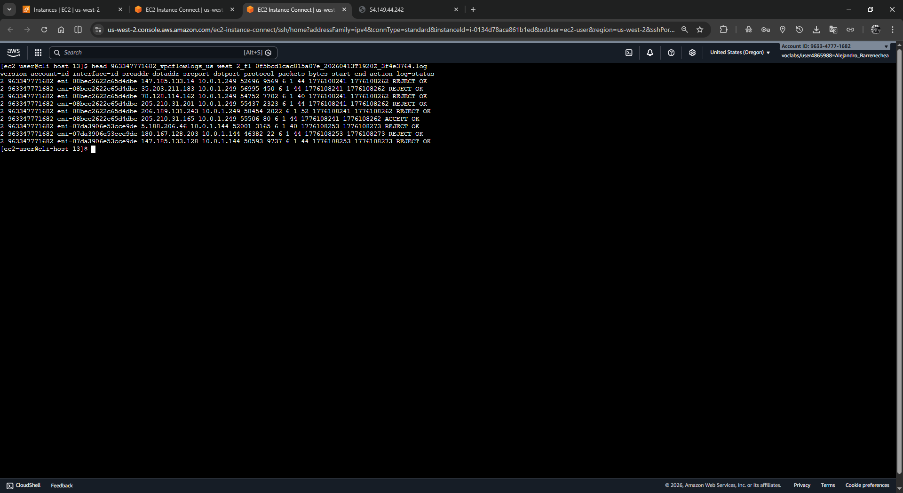
</div>

2. **Filtro global con Grep de Puerto 22:** Realizamos una criba masiva que solo muestre las líneas etiquetadas con "22" sumadas al filtro de "REJECT":
   ```bash
   grep -rn 22 . | grep REJECT
   ```

<div align="center">
  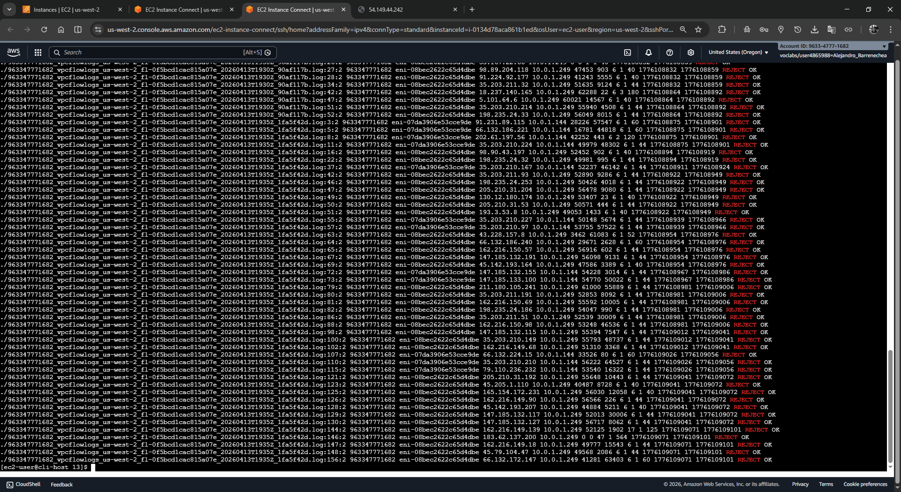
</div>

3. **Obtén tu dirección IP real local paso a paso:** 
   * Vuelve a la pestaña de tu navegador donde tienes abierta la Consola de AWS (AWS Management Console).
   * En la barra de búsqueda superior busca y entra a **EC2**.
   * En el menú de navegación izquierdo, baja hasta la sección *Red y seguridad* y clica en **Security Groups** (Grupos de Seguridad).
   * Localiza y selecciona el grupo llamado `WebSecurityGroup`.
   * En el panel inferior, haz clic en la pestaña **Inbound rules** (Reglas de entrada) y luego en **Edit inbound rules** (Editar reglas de entrada).
   * Al final de la página, presiona el botón **Add Rule** (Agregar regla).
   * En la fila nueva, dirígete directamente a la columna **Source** (Origen) y selecciona la opción **My IP** (Mi IP).
   * AWS detectará automáticamente tu red y llenará el recuadro adjunto con tu IP real en formato CIDR (ejemplo: `184.21.56.192/32`).
   * Copia **ÚNICAMENTE los números** de la IP (ignorando el `/32`) y anótala en un bloc de notas.
   * **¡IMPORTANTE!:** No guardes los cambios. Sencillamente presiona el botón **Cancel** (Cancelar). Solo usamos esto como truco visual para revelar de forma segura tu IP pública.

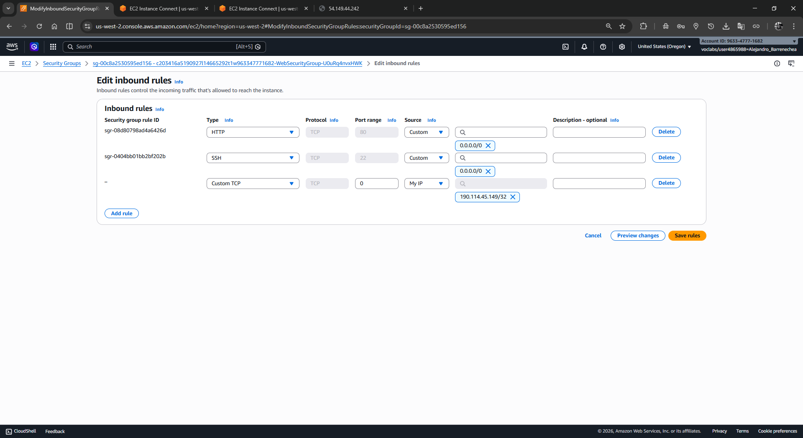

4. **Filtrar tus rechazos estrictos:**
   Ejecuta el rastreador en CLI usando **tu IP** para evidenciar los momentos precisos donde la VPC te rebotó por problemas del NACL:

```bash
grep -rn 22 . | grep REJECT | grep <tu-direccion-ip-publica>
```

<div align="center">
  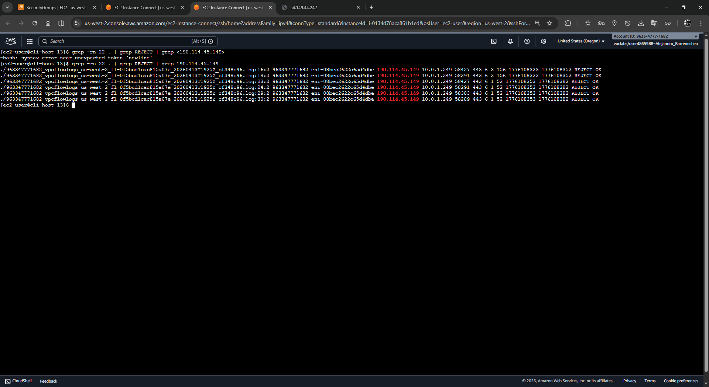
</div>

5. **Conversión de Timestamp UNIX a formato Humano:** En las líneas filtradas devueltas por el comando anterior, busca al final del registro la palabra `REJECT`. Justo a la izquierda de esa palabra verás dos números largos de 10 dígitos cada uno (por ejemplo, `1554496931`). Ese número corresponde al tiempo *Epoch de Unix* que registra el momento exacto de la denegación de red. 

   Copia cuidadosamente uno de esos números de 10 dígitos y pégalo en el siguiente comando, sustituyendo por completo el bloque `<timestamp-unix-largo>`. *(Asegúrate de mantener el símbolo `@` antes de los números)*:
```bash
date -d @<timestamp-unix-largo>
```

*(Ejemplo práctico de uso: `date -d @1554496931`)*

<div align="center">
  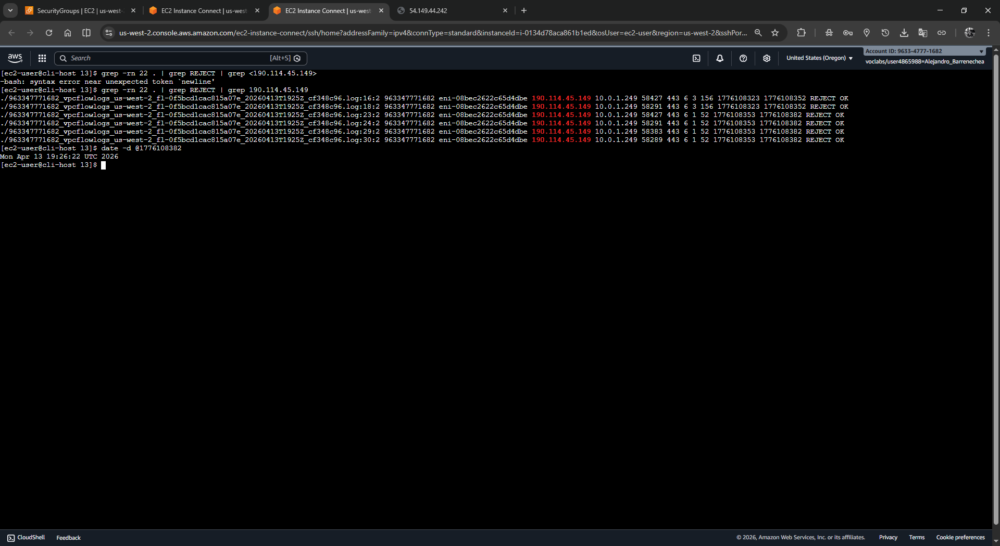
</div>

> [!TIP]
Usar `grep` es una forma primordial y cruda de obtener variables. Para operaciones de alta envergadura y a nivel empresarial, lo ideal es importar toda la ruta de logs a servicios como **Amazon Athena**, el cual estructurará los logs en Data Bases que podrán ser consultadas nativamente usando lenguaje SQL estándar.

---

## ✅ Conclusión del Laboratorio
¡Felicidades! Has completado el laboratorio "Troubleshooting a VPC" donde realizaste con éxito lo siguiente:

- [x] Desplegaste un servicio integral de telemetría de red con VPC Flow Logs.
- [x] Entendiste la interacción vital entre Route Tables (IGW) y Network ACLs.
- [x] Solucionaste problemas de conectividad críticos (Troubleshooting) combinando deducción e investigación con AWS CLI.
- [x] Realizaste minería de logs de bajo nivel rastreando tu propio paso por la red.