# 🛠️ Lab - Escalado y Balanceo de Carga de una Arquitectura

**Dificultad:** 🟡 Intermedio  
**Tiempo Estimado:** ⏱️ 45 minutos  
**Servicios Principales:** ☁️ Amazon EC2, ⚖️ Elastic Load Balancing (ELB), 📈 Amazon EC2 Auto Scaling, 📊 Amazon CloudWatch.  

---

## 📑 Resumen y Objetivos

En este laboratorio utilizarás Elastic Load Balancing (ELB) y Amazon EC2 Auto Scaling para balancear la carga y escalar automáticamente tu infraestructura. ELB distribuye automáticamente el tráfico de red de las aplicaciones a través de múltiples instancias EC2, mientras que Auto Scaling ayuda a mantener la disponibilidad ajustando automáticamente la capacidad según las condiciones que definas.

**🎯 Objetivos:**
- 💿 Crear una AMI a partir de una instancia EC2 existente.
- ⚖️ Crear un balanceador de carga de aplicación (ALB).
- 📝 Crear una plantilla de lanzamiento y un grupo de Auto Scaling.
- 🔒 Configurar el grupo de Auto Scaling para desplegar instancias en subredes privadas.
- 🚨 Utilizar alarmas de Amazon CloudWatch para monitorear el rendimiento.

---

## 🔎 Análisis del Escenario

El cliente cuenta con una arquitectura de inicio con un servidor web simple (Web Server 1) operando en una subred pública, lo cual expone la instancia a internet directamente y representa un punto único de falla (SPOF) en caso de sufrir una sobrecarga o caída. 

Se requiere implementar una arquitectura resiliente y elástica migrando dicho entorno hacia instancias aprovisionadas en subredes privadas para mayor seguridad, distribuidas dinámicamente en múltiples Zonas de Disponibilidad, todo orquestado por un Balanceador de Carga Application Load Balancer que servirá como punto único de entrada. Además, deberás implementar políticas de de Auto Scaling según patrones de utilización de la CPU (Target Tracking al 50%). 

---

## 🏗️ Arquitectura

- 🏛️ **Arquitectura Inicial**: Infraestructura tradicional con un único "Web Server 1" expuesto dentro de una subred pública en una única AZ.
- 🏰 **Arquitectura Final**: Application Load Balancer recibiendo tráfico de internet, y enrutándolo hacia múltiples instancias de EC2 desplegadas dinámicamente (Auto Scaling) a través de subredes privadas, repartidas en 2 Zonas de Disponibilidad.

  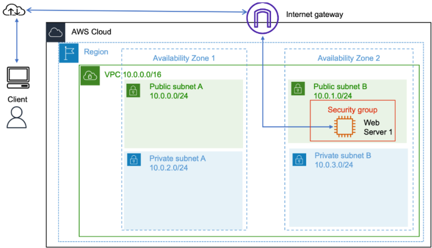

  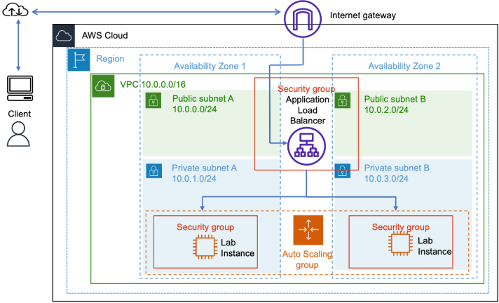

---

## 🚀 Desarrollo

### 💿 Tarea 1: Creación de una AMI para Auto Scaling

En este paso, crea una Imagen de Máquina de Amazon (AMI) conservando la configuración del disco de arranque original del Web Server 1. 

1. 🌐 En la consola de administración de AWS, ubica la barra de búsqueda superior, escribe **EC2** y selecciona **EC2** para abrir la consola.
2. 🗂️ En el panel de navegación izquierdo, localiza la sección **Instancias** y haz clic en **Instancias**.
3. ☑️ Selecciona la instancia **Web Server 1** (asegúrate de que figura con el estado de *En ejecución* o *Running*).
4. ⚙️ Desde el menú desplegable superior **Acciones**, elige **Imágenes y plantillas** > **Crear imagen**.

  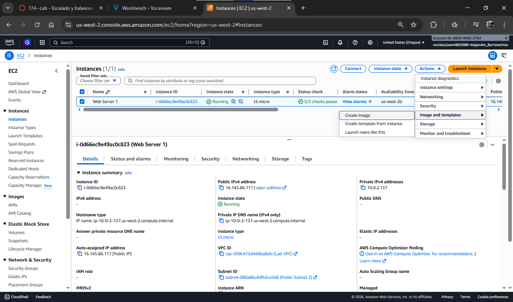

5. ✍️ Configura los siguientes parámetros:
   - **Nombre de la imagen**: Escribe `Web Server AMI`
   - **Descripción de la imagen**: Escribe `Lab AMI for Web Server`
6. 💾 Haz clic en **Crear imagen**.  

  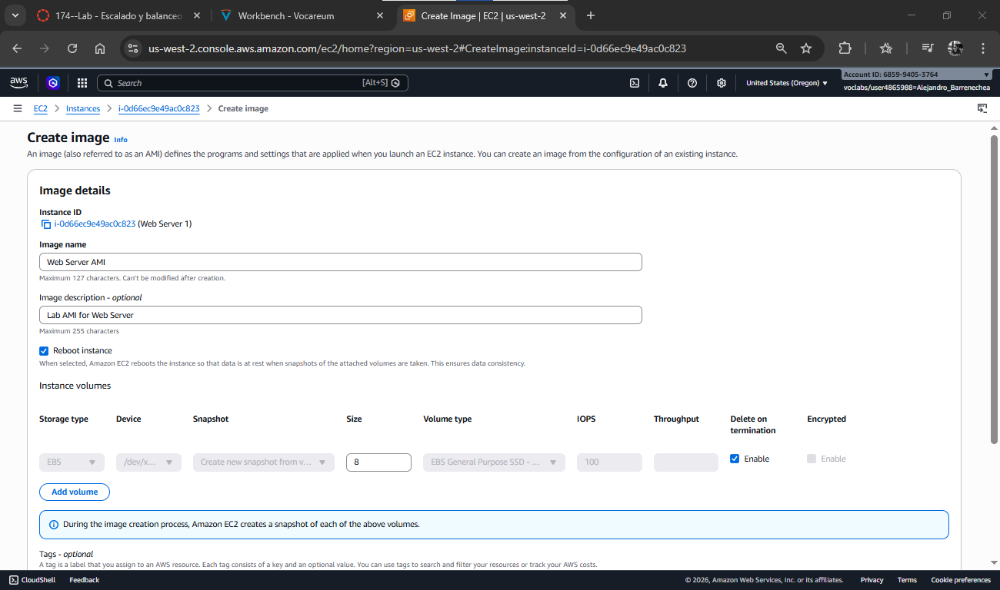

> 💡 **Nota analítica:**  La consola te notificará el ID de la AMI creada. Has creado una "plantilla" de oro (Golden Image) la cual será reutilizada para que cada instancia lanzada por el Auto Scaling sea un clon idéntico del entorno original.

### ⚖️ Tarea 2: Creación de un Balanceador de Carga

Crea un balanceador de carga (Application Load Balancer) para enrutar eficientemente el tráfico TCP/HTTP hacia las múltiples instancias EC2 a lo largo de diversas AZs.

1. 🧭 En el panel de navegación izquierdo, dirígete a la sección **Balanceo de carga** y selecciona **Balanceadores de carga**.
2. ➕ Haz clic en **Crear balanceador de carga**.
3. 📇 En la tarjeta de **Application Load Balancer**, haz clic en **Crear**.

  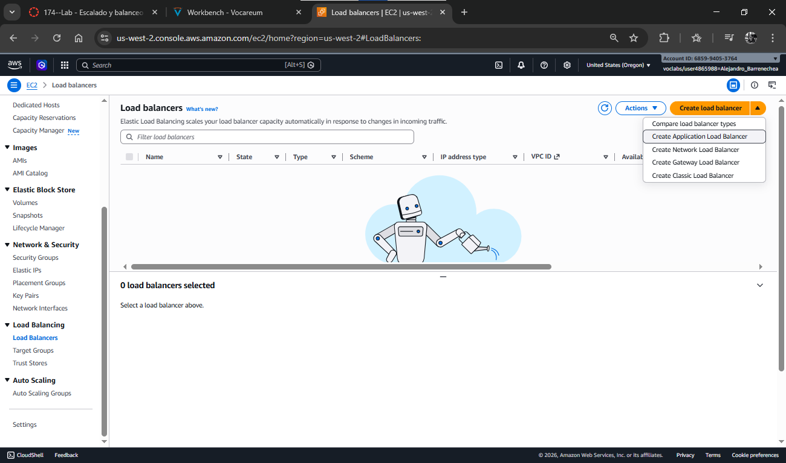

4. ⚙️ En **Configuración básica**:
   - **Nombre del balanceador de carga**: Escribe `LabELB`
5. 🕸️ En la sección de **Mapeo de red**:
   - **VPC** (Opcional según interfaz de consola actual): Selecciona **Lab VPC**.
   - ✔️ Marca **ambas** zonas de disponibilidad listadas.
   - 📍 Para la primera zona, selecciona **Public Subnet 1**.
   - 📍 Para la segunda zona, selecciona **Public Subnet 2**.

  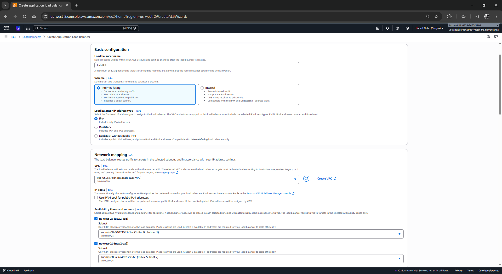

6. 🛡️ En la sección **Grupos de seguridad**:
   - ❌ Elimina el grupo predeterminado haciendo clic en la "X".
   - 🛡️ Selecciona del menú el grupo llamado **Web Security Group** (ya configurado para permitir HTTP).
7. 🎧 En **Agentes de escucha y enrutamiento**, haz clic en el enlace **Crear grupo de destino** (esto abrirá una pestaña nueva del navegador).

  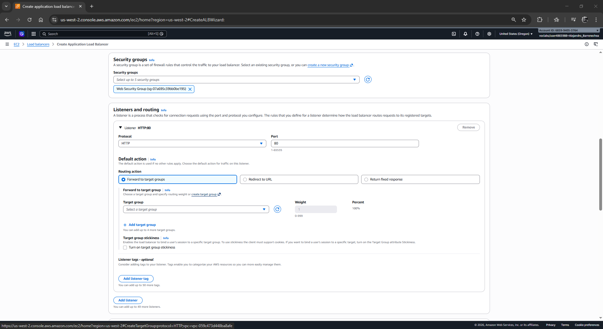

8. 📄 En la nueva pestaña, bajo **Configuración básica**:
   - **Tipo de destino**: Selecciona **Instancias**.
   - **Nombre del grupo de destino**: Escribe `lab-target-group`.
   - ⬇️ Desplázate al fondo y haz clic en **Siguiente**.

  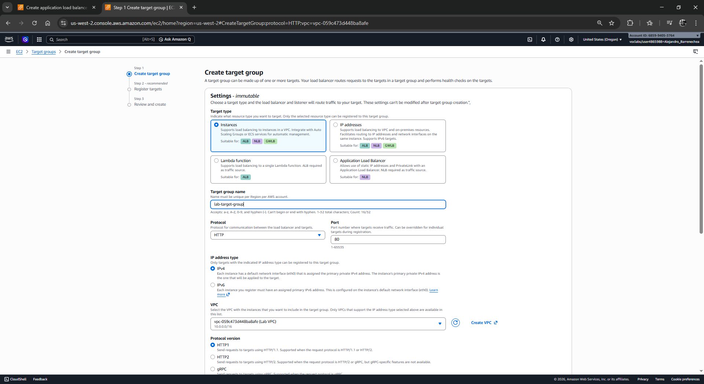

9. ⏭️ En la página de *Registrar destinos* (Register targets), no interactúes con la lista de instancias (el Auto Scaling se encargará luego) y simplemente haz clic en **Siguiente** (Next).

  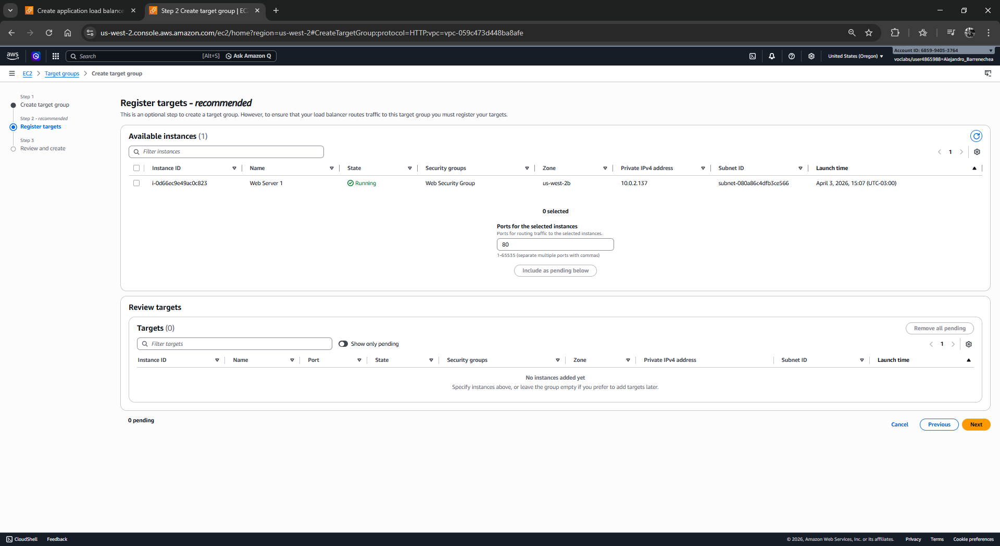

10. ✅ En la página de *Revisar y crear* (Review and create), desliza hacia abajo y haz clic en **Crear grupo de destino**. Una vez creado, cierra la pestaña y vuelve a la original del Balanceador.

  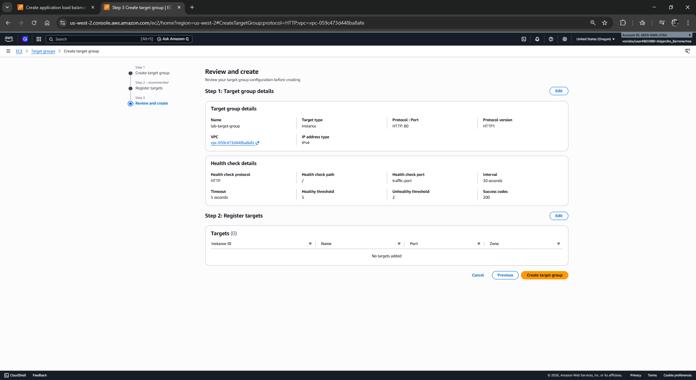

11. 🔁 Haz clic en el ícono de **Actualizar** (🔁) junto a "Reenviar a" y elige tu grupo recién creado `lab-target-group`.

  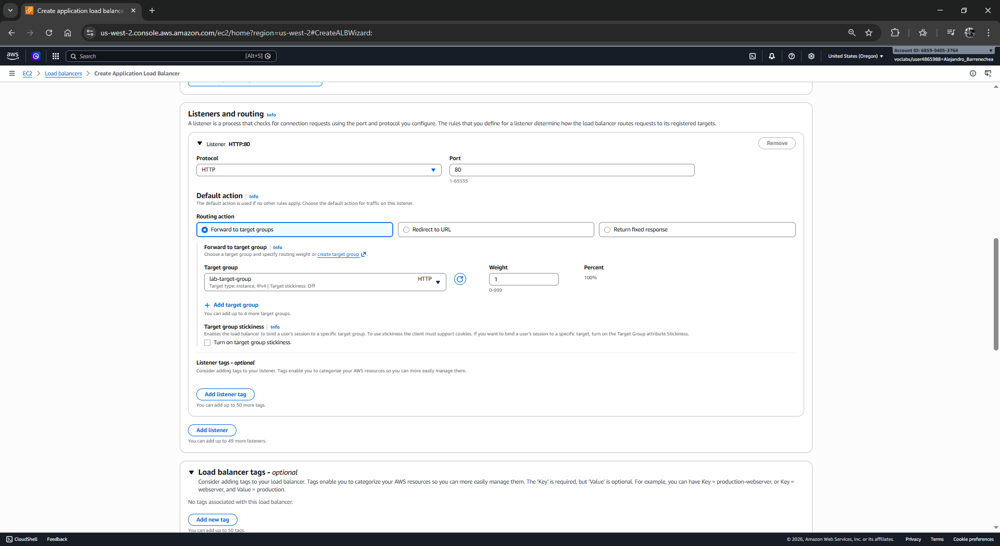

12. 🚀 Presiona **Crear balanceador de carga** ubicado al final.
13. 🔗 Entra en **Ver balanceador de carga** y copia el valor mostrado como **Nombre DNS** (guárdalo en tu portapapeles o en un anotador, es el endpoint principal).

  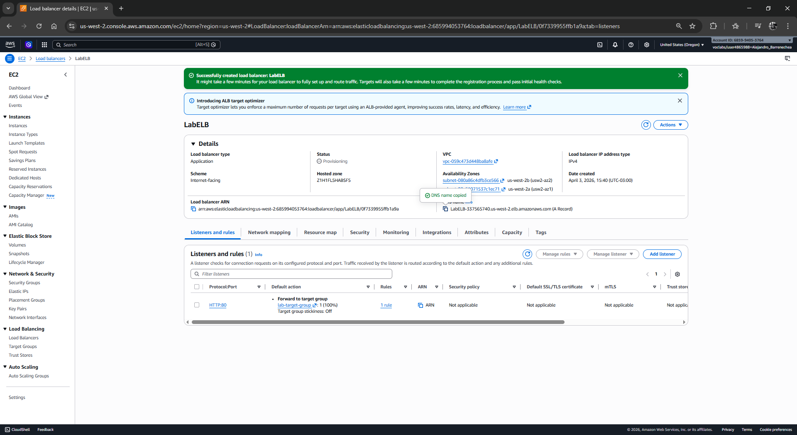

### 📝 Tarea 3: Creación de una plantilla de lanzamiento (Launch Template)

Define una receta con los parámetros específicos (IAM, Tipo, Security Group, AMI) para la creación de las nuevas instancias gestionadas.

1. 🔍 Desde tu buscador superior accede nuevamente a la consola **EC2**.
2. 🗂️ En el panel izquierdo, bajo **Instancias**, selecciona **Plantillas de lanzamiento**.
3. ➕ Selecciona **Crear plantilla de lanzamiento**.

  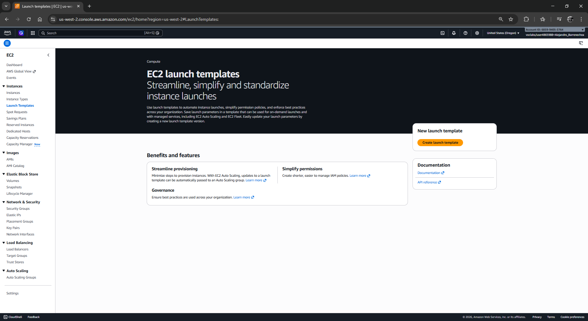

4. ✍️ En **Nombre y descripción de la plantilla de lanzamiento**:
   - **Nombre de plantilla de lanzamiento**: Escribe `lab-app-launch-template`
   - **Descripción de versión de la plantilla**: Escribe `A web server for the load test app`
   - ☑️ Marca la casilla: **Proporcionar orientación que me ayude a configurar...**
5. 🖼️ En **Imágenes de aplicación y SO (AMI)**, posiciónate en la pestaña **Mis AMI** y verifica que `Web Server AMI` (la que creaste al inicio) se encuentre seleccionada automáticamente.

  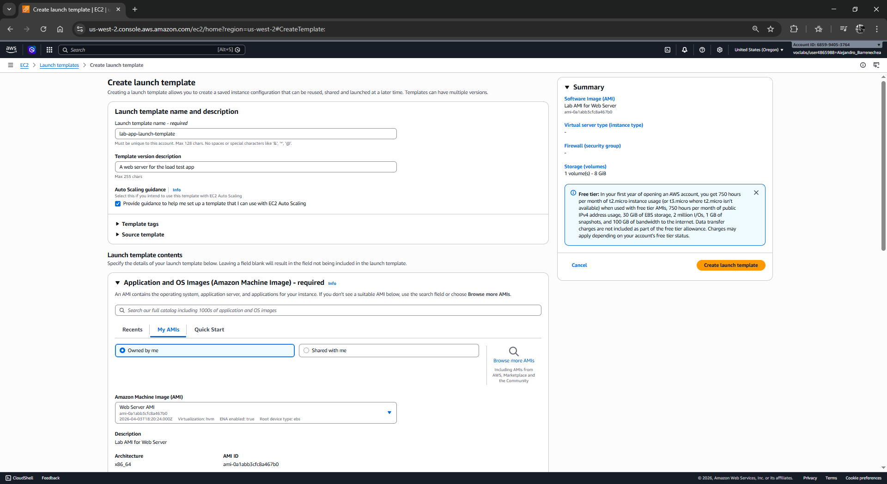

6. 📟 En **Tipo de instancia**, selecciona `t3.micro` (o `t2.micro` si el primero da error debido a stock regional).
7. 🔑 En **Par de claves**, asegúrate de que esté configurado como **No incluir en la plantilla de lanzamiento**. (No conectaremos vía SSH).
8. 🛡️ En **Configuraciones de red** > **Grupos de seguridad**, elige el **Web Security Group**.
9. 💾 Haz clic en el botón naranja **Crear plantilla de lanzamiento** y luego en **Ver plantillas de lanzamiento**.

  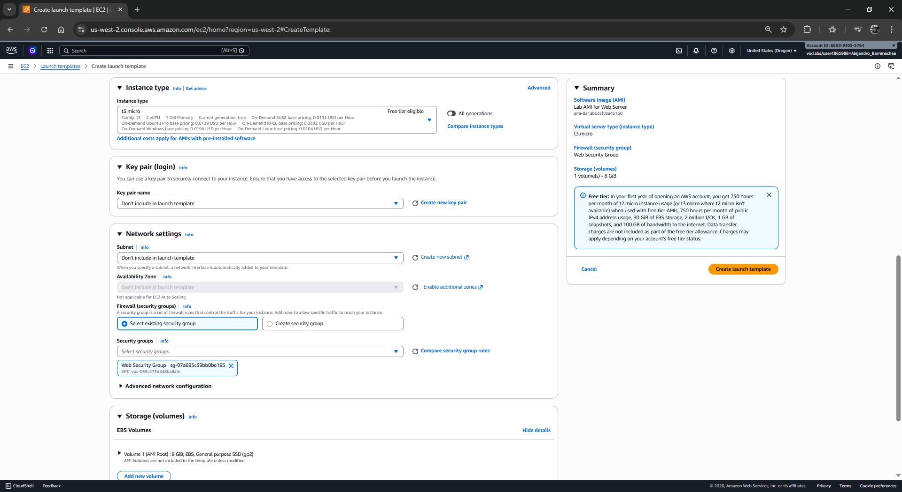

### 📈 Tarea 4: Creación de un Grupo de Auto Scaling

Utiliza la plantilla base creada para provisionar los recursos bajo capacidad controlada y segura.

1. ☑️ Activa la casilla de tu `lab-app-launch-template`. Desde el menú desplegable **Acciones**, elige **Crear grupo de Auto Scaling**.

  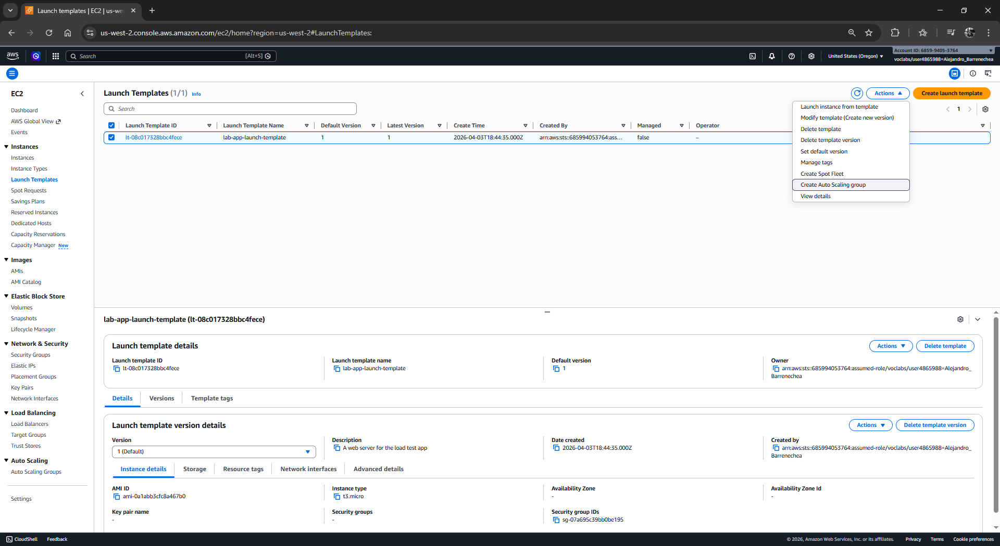

2. ✍️ En la página de nombre, ingresa `Lab Auto Scaling Group` como **Nombre de grupo de Auto Scaling** y haz clic en **Siguiente**.

  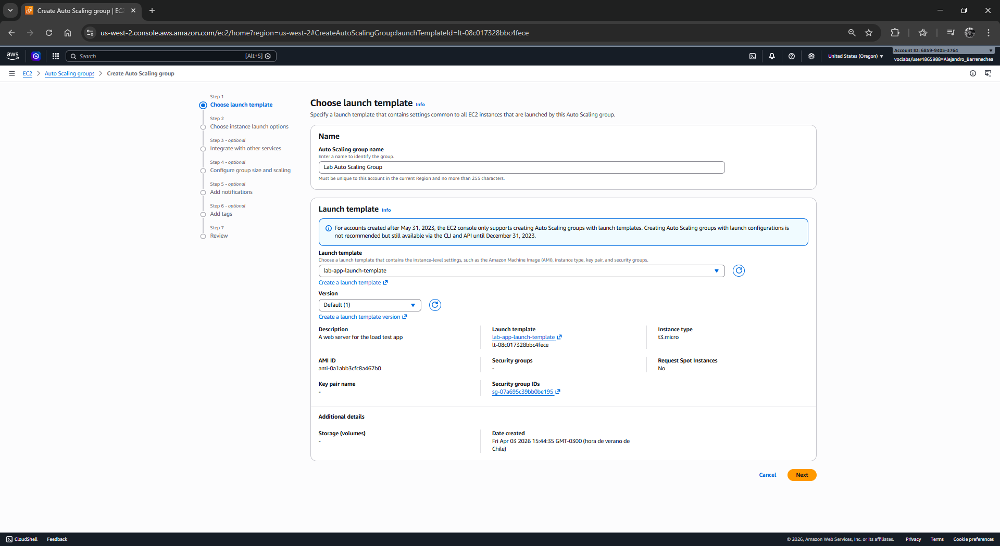

3. 🕸️ En la sección de red:
   - **VPC**: Elige **Lab VPC**.
   - **Zonas de Disponibilidad y subredes**: Elige **Private Subnet 1 (10.0.1.0/24)** y **Private Subnet 2 (10.0.3.0/24)**. Esto garantiza que las instancias de computo finales no estén expuestas a internet directamente.
   - ⏭️ Haz clic en **Siguiente**.

  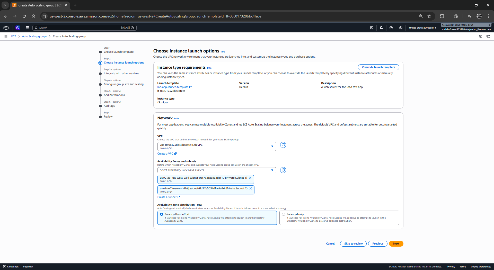

4. ⚖️ En opciones avanzadas de Balanceo de carga:
   - 🔗 Selecciona **Asociar a un balanceador de carga existente**.
   - 🎯 En opciones de grupo de destino, opta por **Elegir de los grupos de destino con balanceador de carga creados...**
   - ✔️ Selecciona `lab-target-group | HTTP`.
   - ❤️ En **Tipos de comprobación de estado**, marca la casilla de **ELB**.
   - ⏭️ Haz clic en **Siguiente**.

  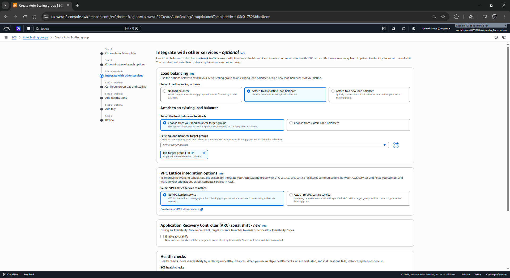

  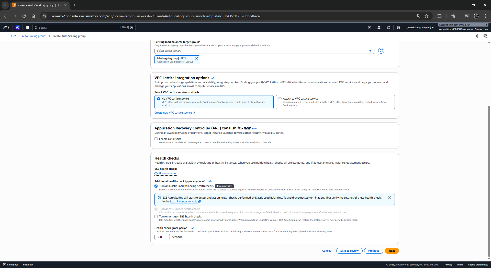

5. 📊 En la página de tamaño del grupo y las políticas:
   - **Capacidad deseada**: `2`
   - **Capacidad mínima**: `2`
   - **Capacidad máxima**: `4`
   - 📈 En **Políticas de escalado**, marca la opción **Política de escalado de seguimiento de destino** (Target tracking).
   - ⏱️ **Tipo de métrica**: Deja la opción en **Uso promedio de CPU**.
   - 🎯 **Valor de destino**: Modifica a `50`. 
   - ⏭️ Haz clic en **Siguiente**.

  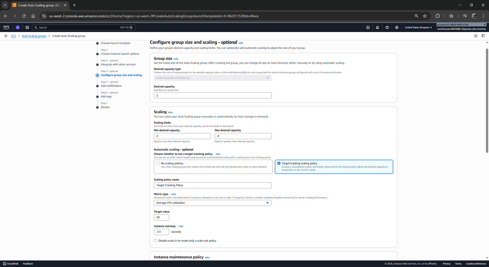

6. ⏭️ Salta las opciones de las notificaciones haciendo clic en **Siguiente**.
7. 🏷️ En Etiquetas, haz clic en **Agregar etiqueta**:
   - **Clave**: `Name`
   - **Valor**: `Lab Instance`
   - ⏭️ Haz clic en **Siguiente**.

  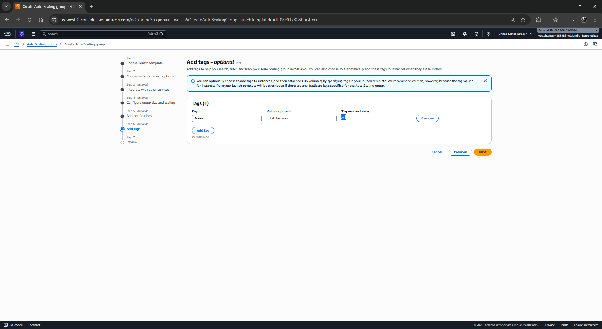

8. 🚀 Revisa los datos y finaliza en **Crear grupo de Auto Scaling**.
 *(Estas instancias tardarán un momento en lanzarse e iniciarse)*.

### 🔍 Tarea 5: Verificación del balanceo de carga

Comprueba que las instancias despliegan el servicio correctamente a través del grupo de destino bajo el paraguas del ALB.

1. 💻 Sitúate nuevamente en el panel de navegación izquierdo en **Instancias** > **Instancias**. Verás hasta 2 instancias denominadas "Lab Instance" arrancando inicializadas por el grupo auto escalable.

  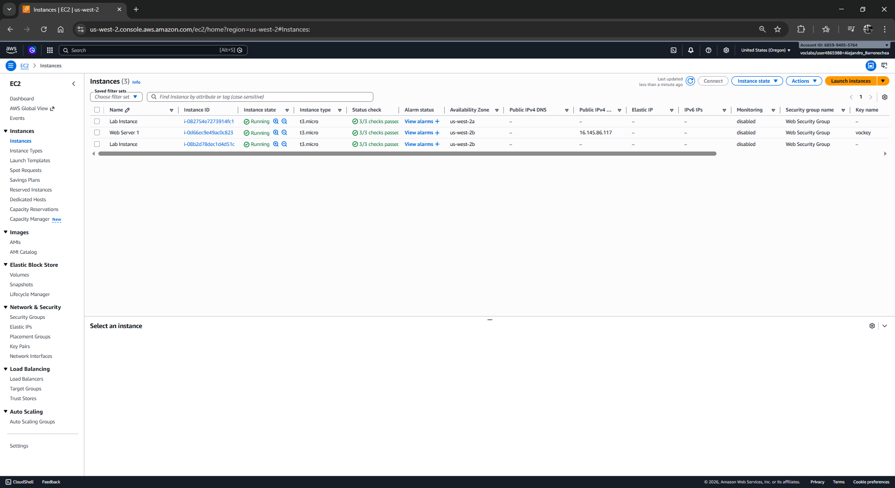

2. 🎯 Navega al apartado de **Balanceo de Carga** > **Grupos de destino** y selecciona el tuyo (`lab-target-group`).
3. 🩺 En la pestaña **Destinos**, monitorea el **Estado de comprobación de estado** de ambas instancias "Lab Instance". *(Presiona actualizar hasta que su estado cambie a **Healthy** / Saludable)*.

  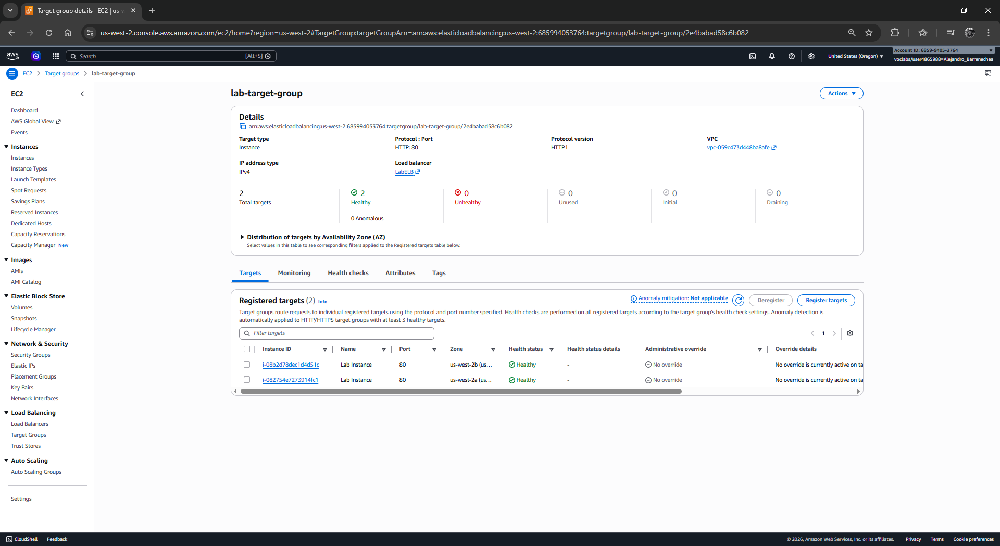

4. 🌐 Abre una nueva pestaña de navegador web, e ingresa el **Nombre DNS del balanceador de carga** (aquel que guardaste en el bloc de notas).
5. 🎉 Observarás tu aplicación llamada "Load Test" ejecutándose por el puerto HTTP. Felicidades, el balanceador funciona.

### 🚨 Tarea 6: Prueba de la Elasticidad y Auto Scaling

Como configuraste la capacidad mínima en 2 instancias, hasta el momento los niveles están estables. Deberás generar un consumo masivo forzado para activar la recolección de métricas.

1. ☁️ Regresa a tu consola AWS, abre la búsqueda e ingresa **CloudWatch** para abrir la consola del servicio de monitorización.
2. 🔔 En el panel izquierdo dirígete a **Alarmas** > **Todas las alarmas**. Allí encontrarás las alarmas generadas automáticamente por tu Auto Scaling (sus nombres actualmente inician con `TargetTracking-` seguido del nombre de tu grupo e incluyen términos como `AlarmHigh` o `AlarmLow`). *Si no las visualizas, verifica estar en la misma Región o búscalas desde EC2 > Grupos de Auto Scaling > tu grupo > pestaña "Escalado Automático"*.
3. ✅ Identifica la alarma que detecta la subida de CPU (la que dice "High"). Su estado debe ser **OK** (Significa que por ahora los niveles de uso están bajo métricas normales y aceptables).
4. 🌐 Vuelve a la pestaña exterior de la aplicación web (La del balanceador de carga *Load Test app*) alojada en el navegador externo.
5. ⚡ Haz clic en el botón superior verde **Load Test**. (Esto saturará artificialmente el CPU al 100%).

  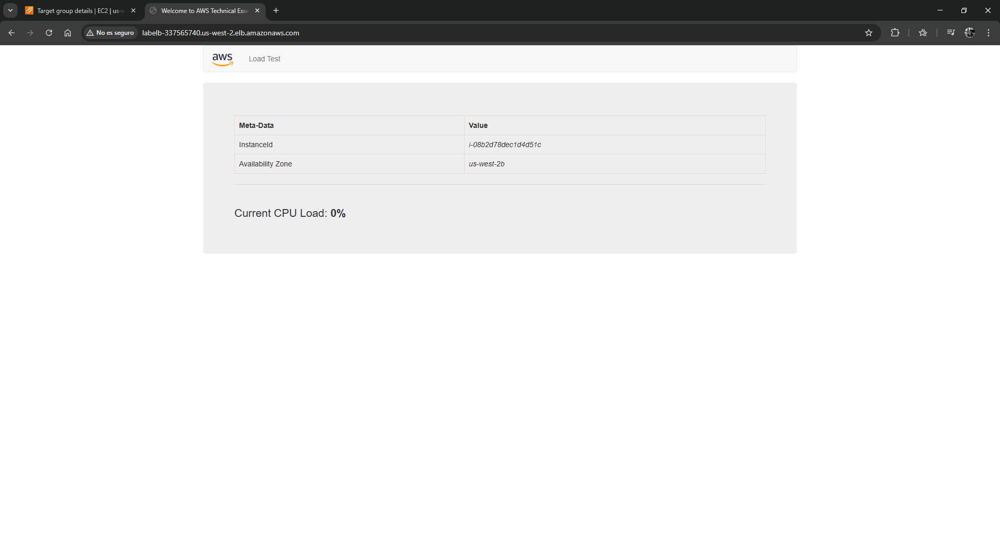

6. 🔄 Regresa a **CloudWatch** y actualiza el gráfico. En el transcurso de aproxiadamente 3 a 5 minutos, la alarma *AlarmHigh* pasará a encontrarse en estado de **En Alarma** (*In Alarm*) sobrepasando la línea de seguridad del 50%.

 
  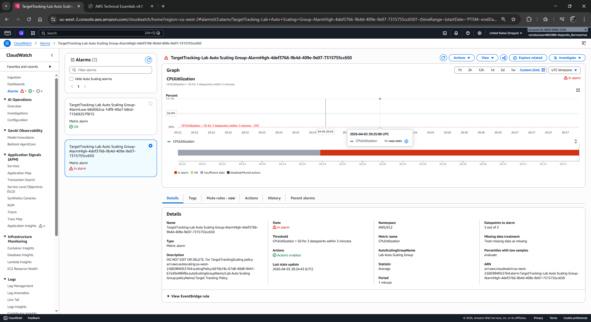

 

7. 📈 Por último, ve a la consola de **EC2 > Instancias**. Comprobarás que se han provisto y están arrancando automáticamente nuevas *"Lab Instance"* para mitigar la saturación de procesos respondiendo proactivamente al aumento de carga (Scaled Out).

 
  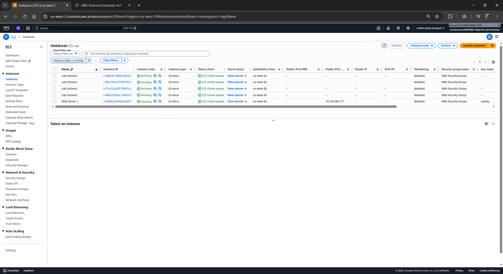

 

### 🗑️ Tarea 7: Terminación de la instancia original Web Server 1

1. 🖥️ Selecciona exclusivamente tu instancia semilla **Web Server 1**.
2. ⚙️ Entra en el menú **Estado de la instancia**, y selecciona **Terminar instancia** (Terminate).
3. ❌ Confirma el cuadro de diálogo. Esta instancia, habiendo derivado en la creación de la AMI inicial, ya no es necesaria dado que toda la infraestructura se apoya y sostiene en instancias abstraídas de la conexión directa detrás del Balanceador.

 
  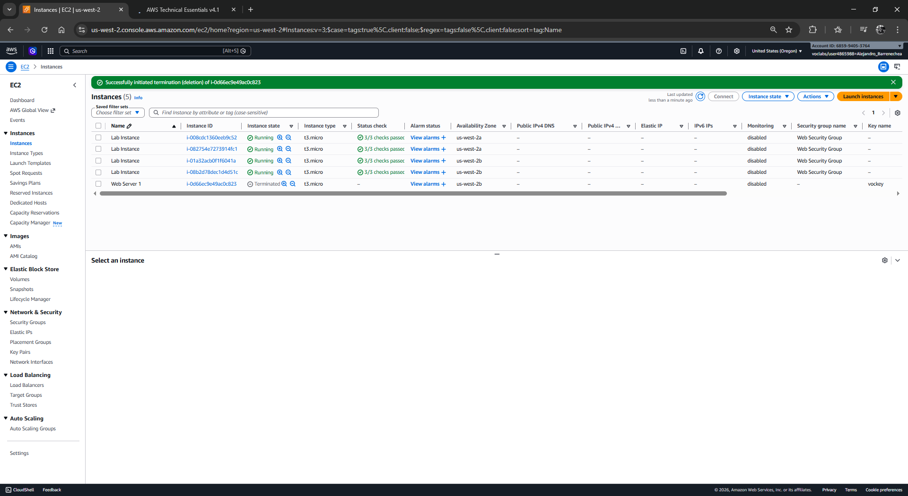

 

---

✅ **¡Felicidades!** Has concluido este laboratorio.
