# 🛠️ Lab - Uso de escalado automático en AWS (Linux)

**Dificultad:** 🟡 Intermedio  
**Tiempo Estimado:** ⏱️ 45 minutos  
**Servicios Principales:** ☁️ Amazon EC2, 💻 AWS CLI, ⚖️ Elastic Load Balancing (ELB), 📈 Amazon EC2 Auto Scaling, 📊 Amazon CloudWatch.  

---

## 📑 Resumen y Objetivos

En este laboratorio usarás la Interfaz de Línea de Comandos de AWS (AWS CLI) para crear una instancia Amazon EC2 que aloje un servidor web y luego crearás una Amazon Machine Image (AMI) a partir de dicha instancia. Después, utilizarás esa AMI como base para desplegar un sistema que escale dinámicamente frente a picos de consumo apoyándote en Auto Scaling y distribuyendo el ingreso a las diferentes instancias en múltiples Zonas de Disponibilidad (AZs) albergadas bajo un Application Load Balancer (ALB).

**🎯 Objetivos:**
- 💻 Crear una instancia EC2 utilizando AWS CLI.
- 💿 Crear una nueva AMI personalizada mediante programación con AWS CLI.
- 📝 Crear una plantilla de lanzamiento (Launch template) en Amazon EC2.
- 📈 Crear una configuración de lanzamiento de Auto Scaling.
- ⚖️ Configurar políticas de escalado y crear un grupo de Auto Scaling para mitigar de forma automatizada las cargas de tráfico variables.

---

## 🔎 Análisis del Escenario

Se busca automatizar la preparación y aprovisionamiento de recursos. Ejecutar comandos a través de AWS CLI en lugar de la consola gráfica (UI) permite integrarlos velozmente a flujos de integración continua (CI/CD) usando de base una instancia de comandos autorizada a nivel IAM para actuar sobre AWS. Luego, se encapsula el servidor modelado en una AMI maestra para que Auto Scaling pueda proveer copias idénticas frente a la elasticidad requerida. 

Todo este tráfico entrante público será segmentado por balanceador, permitiendo a los nodos ejecutarse seguros y ocultos en subredes privadas. 

---

## 🏗️ Arquitectura

- 🏛️ **Arquitectura Inicial**: Una instancia de comando (*Command Host*) aprovisionada en una subred pública lista para que operes sobre la AWS CLI en un entorno seguro y delegues desde ahí.
- 🏰 **Arquitectura Final**: Application Load Balancer canalizando el tráfico de entrada de internet y repartiéndolo mediante un grupo de destino a múltiples instancias EC2 web, yacentes dentro de subredes privadas configuradas dinámicamente por un grupo de Auto Scaling en 2 Zonas de Disponibilidad distintas (Escalado In / Out apoyado en CloudWatch).

<p align="center">
    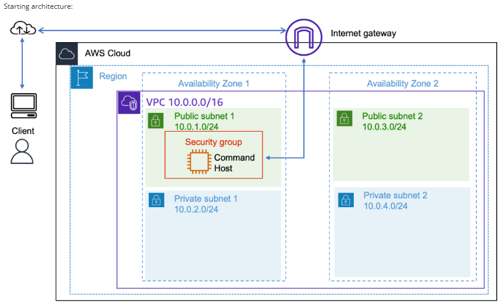
</p>
<p align="center">
    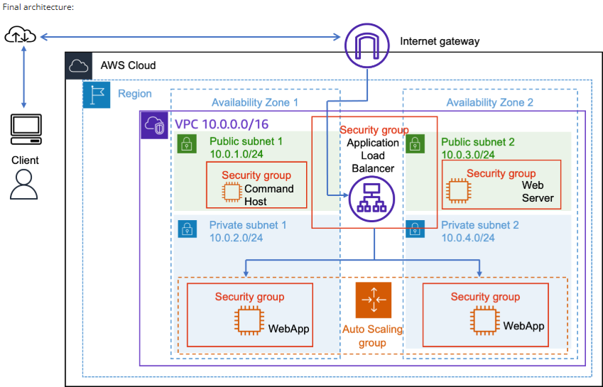
</p>
---

## 🚀 Desarrollo

### 💻 Tarea 1: Creación de una AMI para el Auto Scaling mediante AWS CLI

Usarás la máquina de comando (*Command Host*) para enviar instrucciones directas hacia AWS a través de la terminal, levantar un nuevo servidor con una app y generalizar su estado extrayendo una AMI.

#### 🔗 Tarea 1.1: Conexión a la instancia Command Host
1. 🌐 En la consola de administración de AWS, dirígete a **EC2**.
2. 🗂️ En el menú lateral izquierdo entra en **Instancias**.
3. ☑️ Selecciona la instancia **Command Host**.
4. 🔌 Haz clic en el botón superior de **Conectar** (Connect).

<p align="center">
    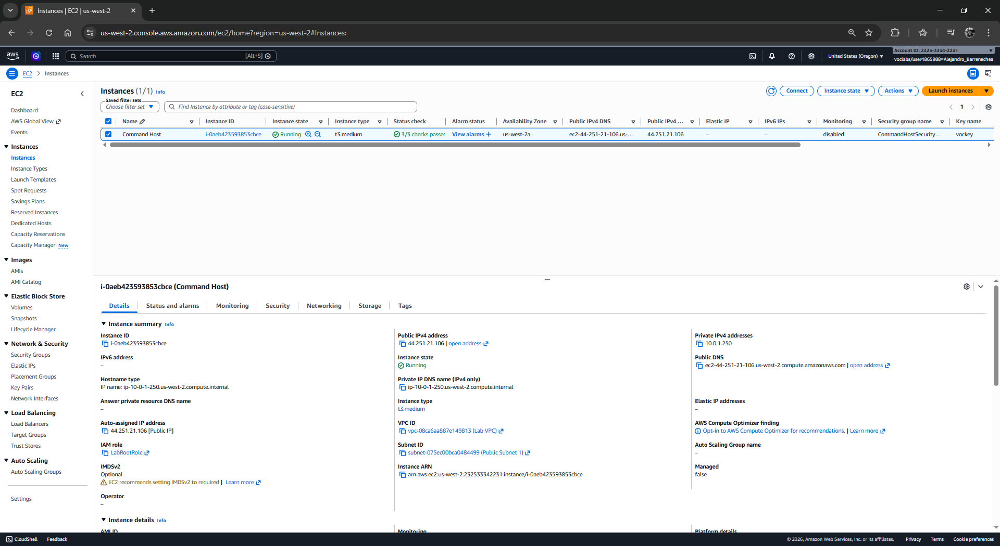
</p>

5. 💻 Mantente predeterminado en la pestaña **EC2 Instance Connect** y presiona de nuevo en **Conectar**. Se te abrirá una terminal Linux en línea dentro del navegador.

<p align="center">
    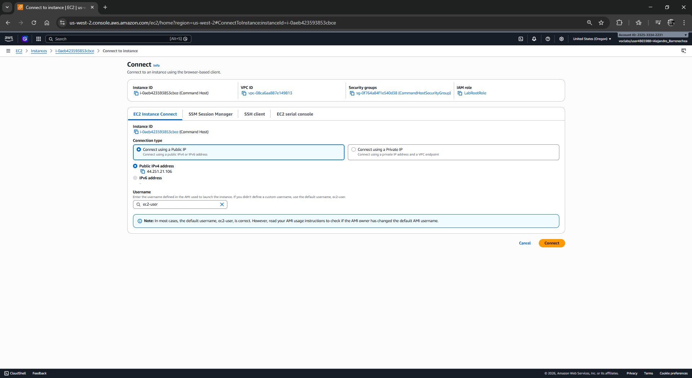
</p>

#### ⚙️ Tarea 1.2: Configuración de la AWS CLI
La CLI ya está instalada, pero necesitamos actualizar sus datos del perfil para apuntar al mismo sector físico de tus recursos.
1. 📟 Para consultar explícitamente en qué Región estas trabajando, extrae los metadatos de AWS ejecutando:
   ```bash
   curl http://169.254.169.254/latest/dynamic/instance-identity/document | grep region
   ```
   *(Toma nota de ese valor de tu Región, por ejemplo: `us-west-2` o similar).*
2. 🔑 Actualiza las credenciales de Amazon invocando la configuración:
   ```bash
   aws configure
   ```
3. ✍️ Al ser consultado ingresa en el prompt:
   - **AWS Access Key ID**: (Presiona la tecla *Enter*, la CLI ya heredó el ID de Vocareum).
   - **AWS Secret Access Key**: (Presiona *Enter*).
   - **Default region name**: Ingresa la región que averiguaste previamente (ej. `us-west-2`) y presiona *Enter*.
   - **Default output format**: Escribe la palabra `json` y presiona *Enter*.
4. 📂 Ubícate en tu propio directorio *Home* de scripts:
   ```bash
   cd /home/ec2-user/
   ```

<p align="center">
    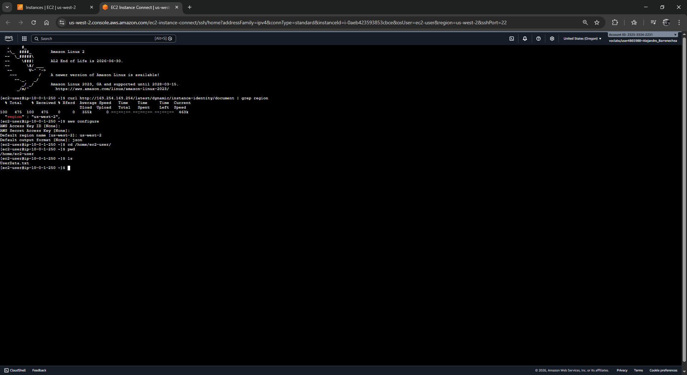
</p>

#### 🚀 Tarea 1.3: Creación de una nueva Instancia EC2 desde la CLI
1. 📖 Explora el script de inicialización (`UserData.txt`) local a la máquina leyendo su contenido:
   ```bash
   more UserData.txt
   ```
   *(Nota: Este script instalará PHP y una pequeña aplicación web (Load Test app) diseñada para simular consumos de CPU. Finaliza eliminando cachés, llaves autorizadas e historial por pura seguridad de la plantilla). Presiona `Espacio` para terminar de leer o la letra `q` para salir inmediatamente.*
2. 📋 A la izquierda externa a esa pestaña, verifica en tu entorno general del Lab, localiza la sección arriba **AWS details** > **Show**. 
3. 📝 Toma nota y copia a un bloc de texto local en tu computadora los valores exactos definidos en tu módulo para: `KEYNAME`, `AMIID`, `HTTPACCESS`, y `SUBNETID`. (Cierra el panel con X luego).
4. 💻 Reemplaza minuciosamente las variables en MAYÚSCULAS en el siguiente comando con los valores que recién copiaste en el bloc de notas, cópialo ensamblado y arrójalo a tu terminal:
   ```bash
   aws ec2 run-instances --key-name KEYNAME --instance-type t3.micro --image-id AMIID --user-data file:///home/ec2-user/UserData.txt --security-group-ids HTTPACCESS --subnet-id SUBNETID --associate-public-ip-address --tag-specifications 'ResourceType=instance,Tags=[{Key=Name,Value=WebServer}]' --output text --query 'Instances[*].InstanceId'
   ```
   > 💡 **Nota analítica:** Observa lo ágil que es AWS CLI. Un solo comando asocia Llaves de conexión, define la máquina `t3.micro`, lanza los scripts al arrancar pre configurados, asocia una IP Pública, etiquetas (Tags) y devuelve el ID. Todo programáticamente automatizado.
5. 💾 El "output" del comando nos escupirá un identificador único (Lo llamaremos a partir de aquí *`NEW-INSTANCE-ID`*). **Resérvalo o cópialo**.

<p align="center">
    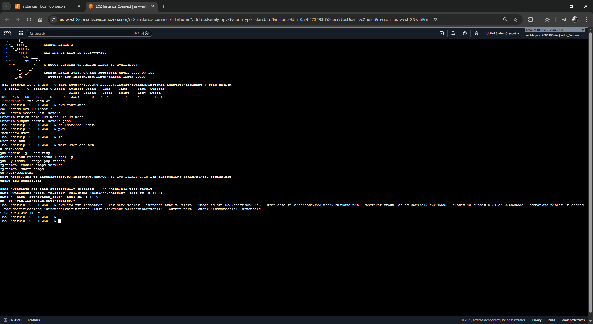
</p>

6. ⏱️ Supervisar la inicialización requeriría revisar manualmente. Utilicemos la CLI nuevamente como sondeador agregando tu ID:
   ```bash
   aws ec2 wait instance-running --instance-ids NEW-INSTANCE-ID
   ```
   *(Este comando bloqueará tu consola. Cuando finalmente la libere y veas de vuelta el cursor regular, significará que el nodo físico arrancó y la nueva API EC2 la marcó "Running". Paciencia).*
7. 🌐 Una vez corriendo, extrae de la base de AWS tu DNS Pública, reemplazando de nuevo `NEW-INSTANCE-ID`:
   ```bash
   aws ec2 describe-instances --instance-id NEW-INSTANCE-ID --query 'Reservations[0].Instances[0].NetworkInterfaces[0].Association.PublicDnsName'
   ```
   *Copia el nombre DNS proporcionado asegurándote de no extraer las comillas dobles ni espacios ("")*. (Guarda esto, lo usaremos como *`PUBLIC-DNS-ADDRESS`*).

<p align="center">
    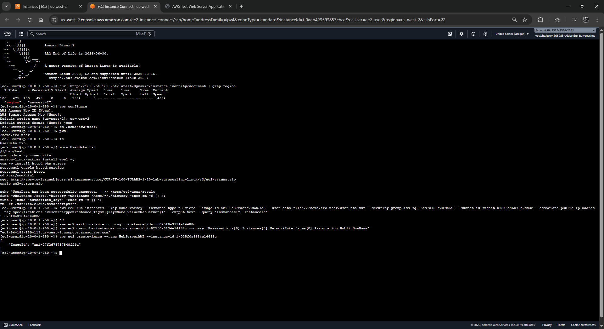
</p>

8. ⏳ *Recuerda que aunque esté encendida, el servidor web y los comandos de inicialización están rodando. Espera obligatoriamente alrededor de 5 minutos.*
9. 📌 En otra pestaña de navegador, pega tu DNS combinada con la ruta PHP validando su ejecución HTTP:
   `http://PUBLIC-DNS-ADDRESS/index.php`
   *(Debría desplegarte la pantallita PHP con el botón de "Load Test". No inicies el estrés de uso todavía).*

<p align="center">
    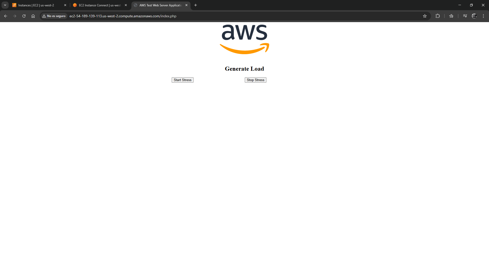
</p>

#### 💿 Tarea 1.4: Crear una AMI Base Personalizada (Custom AMI)
Basa tu futuro autoscale en el esqueleto actual inmutable para clonaje.
1. 💻 De regreso a tu terminal de Linux EC2, ejecuta empaquetar una Amazon Machine Image referenciando el `NEW-INSTANCE-ID`:
   ```bash
   aws ec2 create-image --name WebServerAMI --instance-id NEW-INSTANCE-ID
   ```
*(Opcionalmente esto reinicia ligeramente la máquina madre apuntada del `instance-id` vaciando memorias volátiles pre-instantánea a nivel de hypervisor, protegiendo así la integridad de archivos disco duro base).*

---

### 🌐 Tarea 2: Entorno de escalado automático desde la Consola gráfica (AWS Management Console)

Mientras tu AMI se destila en los discos rígidos en background de la nube, pasarás a gestionar la infraestructura desde el entorno visual de la consola AWS.

#### ⚖️ Tarea 2.1: Crear un Application Load Balancer
1. 🧭 Desde la consola general EC2 en el navegador, ve abajo en la columna de la izquierda hacia **Balanceadores de carga**.
2. ➕ Selecciona el botón **Crear balanceador de carga**.
3. 📇 Elige la tarjeta **Application Load Balancer** y oprime **Crear**.

<p align="center">
    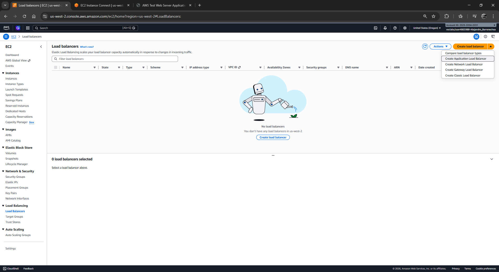
</p>

4. ⚙️ Para **Nombre del balanceador de carga**, nómbralo `WebServerELB`.
5. 🕸️ En **Mapeo de Red**, elige del menú desplegable `Lab VPC`.
6. 📍 Marca las 2 zonas de disponibilidad que te asoman y escoge la cara de red pública:
   - Para la primera, elije **Public Subnet 1**.
   - Para la segunda, elija la **Public Subnet 2**.

<p align="center">
    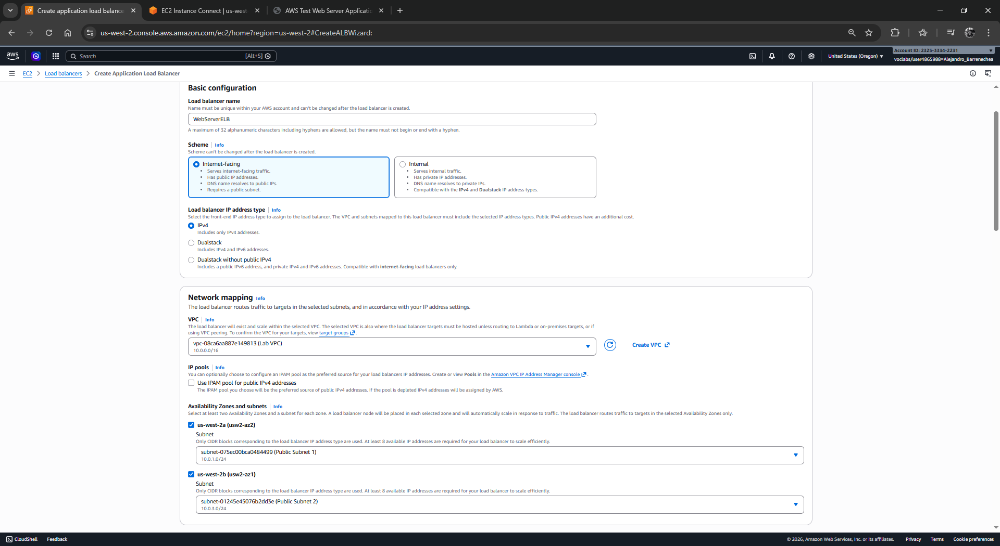
</p>

7. 🛡️ En **Grupos de seguridad**: marca la X para remover el predeterminado. Elige el ya prehecho e identificado como **HTTPAccess**.
8. 🎧 En **Agentes de escucha y enrutamiento**: Haz clic en el texto o enlace **Crear grupo de destino** (abrirá una pestaña nueva).

<p align="center">
    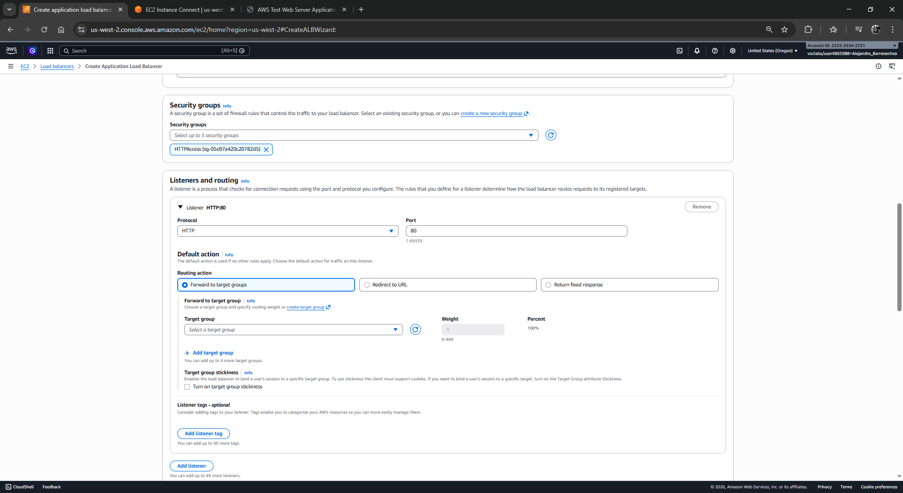
</p>

9. 📄 Dentro de tu flamante pestaña Target Groups para *Configuración Básica*:
   - **Tipo de destino**: Selecciona explícitamente **Instancias**.
   - **Nombre de grupo de destino**: `webserver-app`

<p align="center">
    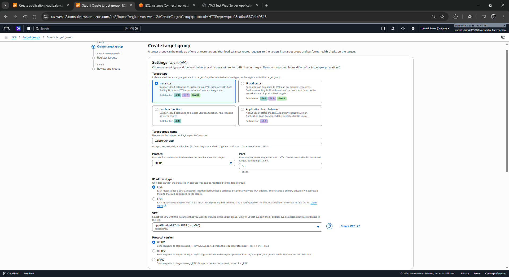
</p>

   - **Inspecciones de estado** (*Health check path*): Introduce manualmente en la ruta o Path `/index.php` (crucial para apuntar a la base de la app correcta).
   - ⬇️ Ve al fondo y dale **Siguiente** (Next).

<p align="center">
    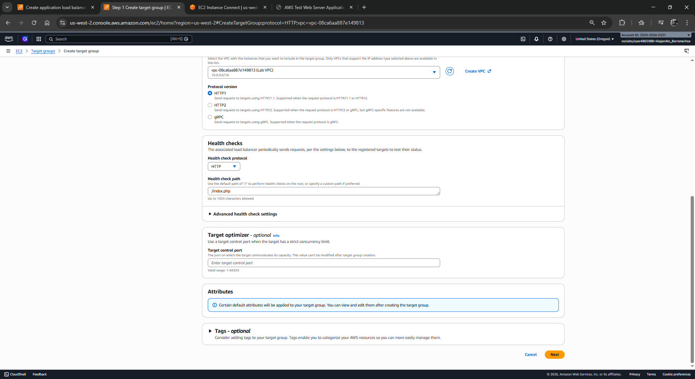
</p>

10. ⏭️ En la página de *Registrar destinos* (Register Targets), no hagas *nada* manual. Haz clic en **Siguiente** (Auto Scaling se encargará de las instancias).

<p align="center">
    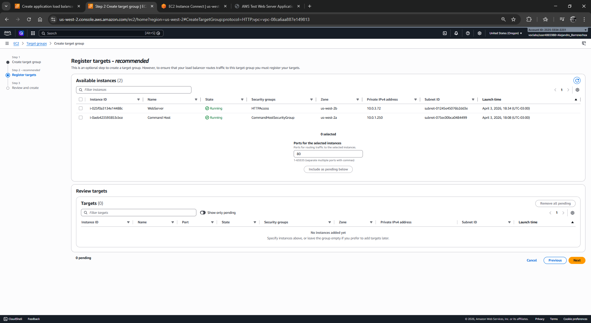
</p>

11. ✅ En la página conclusiva *Revisar y crear* haz clic final en **Crear grupo de destino**.

<p align="center">
    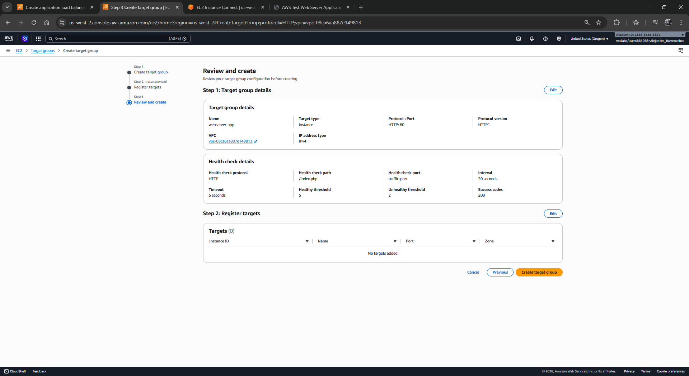
</p>

12. 🔁 Cierra esta recién creada pestaña y en la primaria e inconclusa ventana del **Load Balancer**, usa el botón circular de Actualizar (🔁) y localiza para anexar el nuevo recurso listado: `webserver-app`.
13. 🚀 Termina todo el proceso al final de página presionando **Crear balanceador de carga**. 
14. 🔗 Oprime posteriormente en **Ver balanceador de carga** para seleccionar tu ALB y asegurarte de copiar su **Nombre DNS** que oficiará de entrada oficial a la internet.

#### 📝 Tarea 2.2: Creación de la Plantilla de lanzamiento
1. 🔍 Navega en el margen izquierdo bajo *Instancias* a **Plantillas de lanzamiento** (Launch Templates).
2. ➕ Haz clic en el banner naranja **Crear plantilla de lanzamiento**.

<p align="center">
    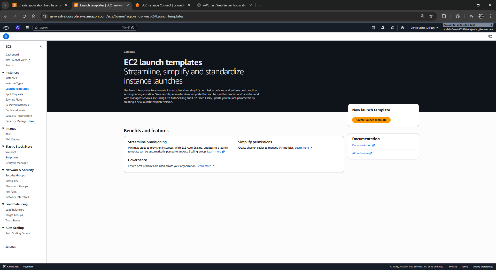
</p>

3. ✍️ Configura **Nombre de plantilla de lanzamiento**: `web-app-launch-template` y **Descripción**: `A web server for the load test app`.
   - Activa el *checkbox* de **Proporcionar orientación para ayudarme a configurar...** bajo *Autoscaling guidance*.
4. 🖼️ En *Imágenes de aplicación y SO*, pestaña **Mis AMI**: Selecciona tu AMI generada en consola de comandos anteriormente: `WebServerAMI`.

<p align="center">
    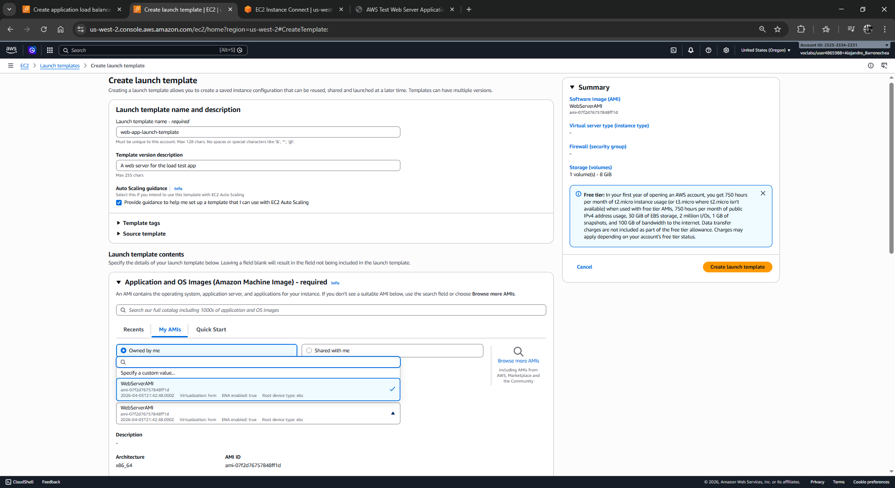
</p>

5. 📟 En **Tipo de instancia**: Busca por menú y anexa la familia `t3.micro`.
6. 🔑 En **Par de claves (inicio de sesión)**: Determínalo estrictamente marcando *No incluir en la plantilla de lanzamiento*.
7. 🛡️ En **Configuraciones de red** > **Grupos de Seguridad**: Selecciona la opción idónea `HTTPAccess`.
8. 💾 Al fondo de todo oprime **Crear plantilla de lanzamiento**. (Confirma mirando un éxito indicando  `Successfully created...`).

<p align="center">
    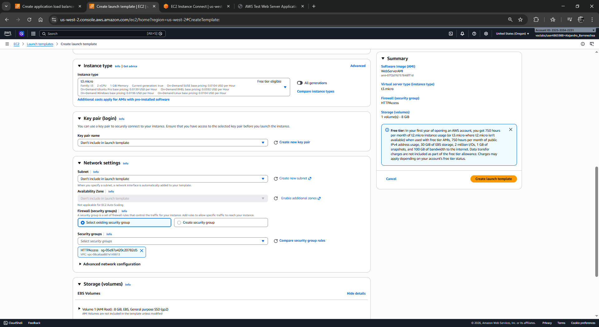
</p>

#### 📈 Tarea 2.3: Configurar el Grupo de Auto Scaling
1. ☑️ Haz clic en "Ver plantillas de lanzamiento". Tilda tu nueva `web-app-launch-template` a modo selección simple. Accede en la zona superior de **Acciones**, elige del menú **Crear Grupo de Auto Scaling**.

<p align="center">
    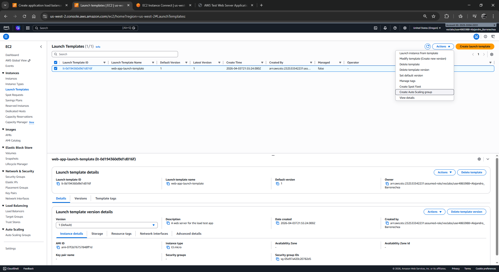
</p>

2. ✍️ Asigna el valor del nombre del contenedor: `Web App Auto Scaling Group` (en *Nombre de grupo...*). Usa **Siguiente**.

<p align="center">
    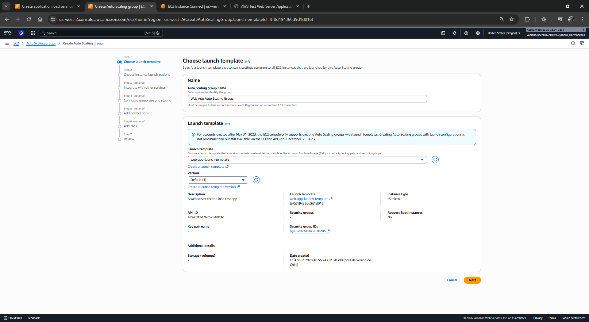
</p>

3. 🕸️ Para las selecciones de RED:
   - Apunta a tu **VPC**: `Lab VPC`. 
   - Zonas de subredes: selecciona únicamente `Private Subnet 1 (10.0.2.0/24)` y `Private Subnet 2 (10.0.4.0/24)`. Esto asegura abstracción total frente a la nube abierta escondiendo nuestros nodos de bases de datos o computo. Haz clic en **Siguiente**.

<p align="center">
    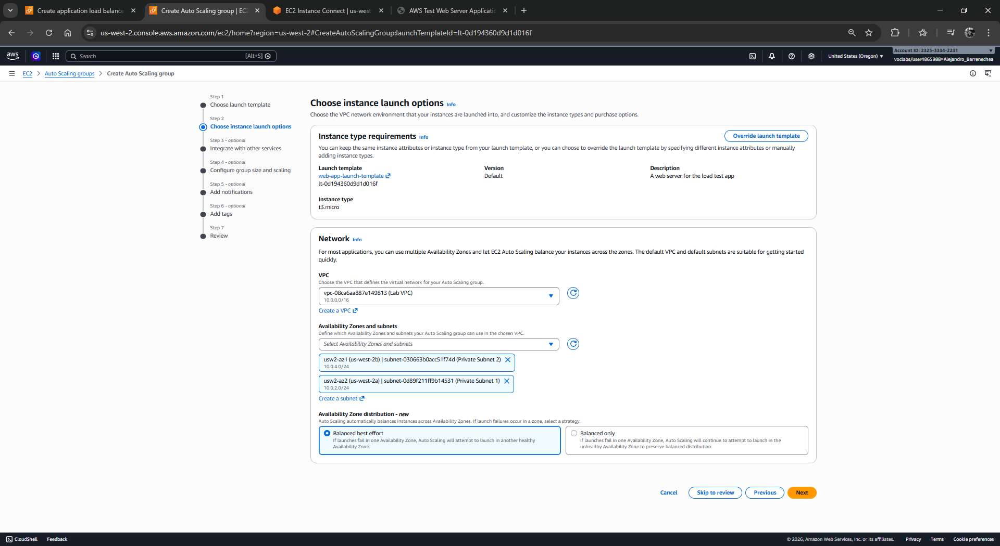
</p>    

4. ⚖️ Funciones Avanzadas y de Balanceador:
   - En Balanceo de Carga selecciona: **Asociar a un balanceador de carga existente**.
   - Haz clic en *Elegir de los grupos de destino...* y selecciona el link a tu Target de grupo `webserver-app | HTTP`.
   - Marca la casilla *Activar comprobación de estado de ELB* de igual forma en la inspección médica. Acepta y ve a **Siguiente**.

<p align="center">
    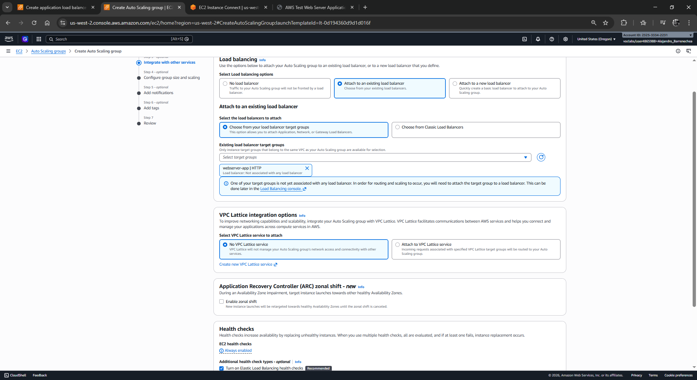
</p>    

5. 📊 Configuración de las métricas de variabilidad del grupo:
   - Capacidad Deseada (*Desired*): `2`
   - Capacidad Mínima (*Min*): `2`
   - Capacidad Máxima (*Max*): `4`
6. 🎯 Más abajo, en *Políticas de escalado*, selecciona a la orden de **Política de escalado de seguimiento de destino** (*Target Tracking scaling policy*).
   - Constata que siga en Uso Promedio de CPU, y setea el margen del **Valor de destino al 50** (*50%*). Pulsa **Siguiente**.

<p align="center">
    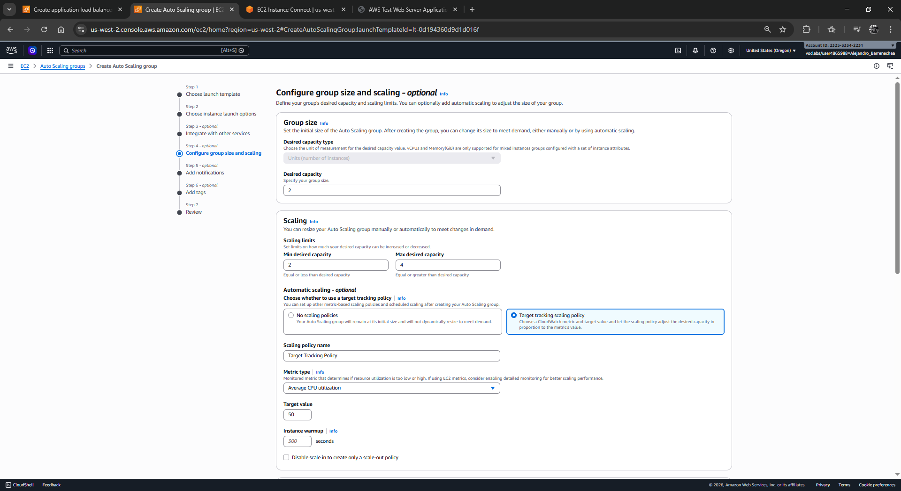
</p>    

7. ⏭️ Salta Notificaciones con **Siguiente**.
8. 🏷️ Inserta metadatos útiles en las etiquetas clicando "Agregar etiqueta": Clave (Key): `Name`. Valor (Value): `WebApp`. **Siguiente.**

<p align="center">
    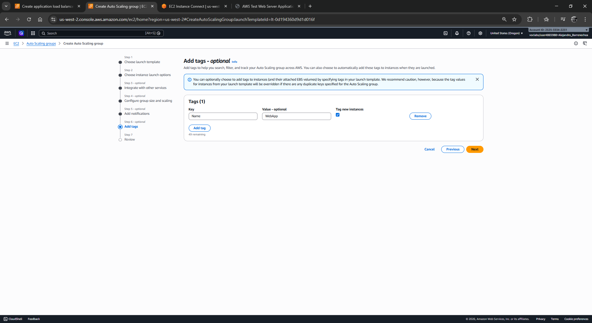
</p> 

9. 🚀 Finaliza presionando **Crear grupo de Auto Scaling**. 
 *(Tu grupo ha sido ordenado, las dos copias iniciales de instancias están preparadas para inyectarse de inmediato por detrás dentro de entornos de subred privada).*

---

### 🔍 Tarea 3: Verificación de Estado en conjunto Autoscaling / Load Balancer

1. 💻 Ve al panel maestro izquierdo y explora la visibilidad en **Instancias**. Deberás presenciar dos máquinas "WebApp" arrancando. Como notarás el *Status Check* dirá algo como "Inicializando...".

<p align="center">
    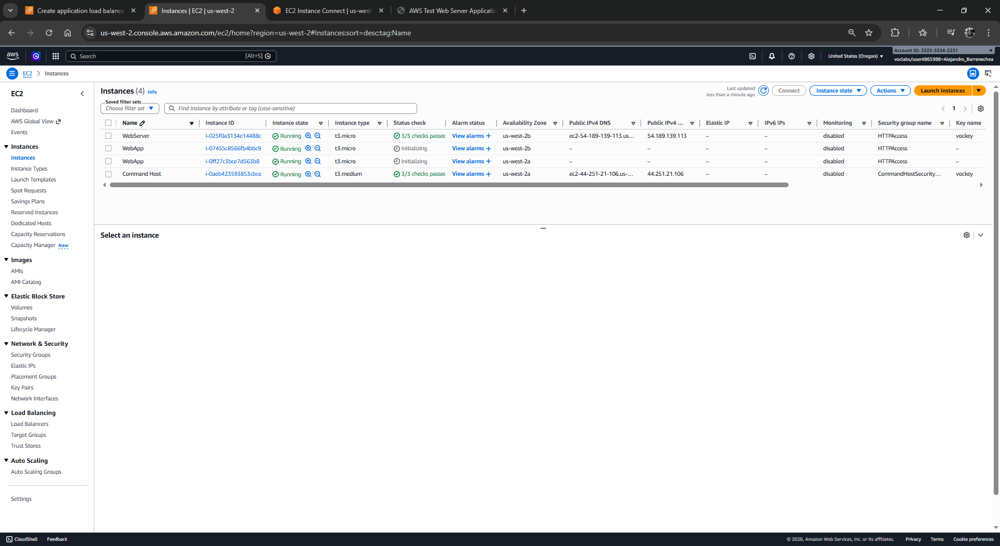
</p> 

2. ⏳ No las pierdas de vista (usando Refresh / Actualizar `🔁`). Tu indicador verde es cuando las dos lleguen pacientemente en su chequeo a indicar **2/2 Checks passed**.

<p align="center">
    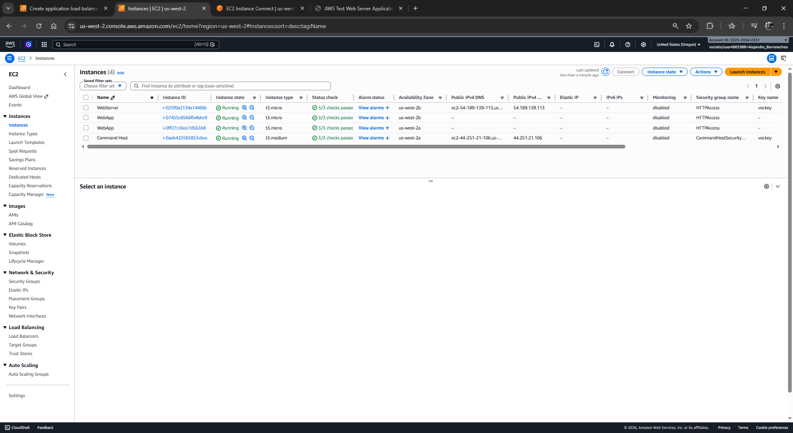
</p> 

3. 🩺 El Balanceador debe poder sondear esas instancias ahora. Ve a tu panel bajo *Balanceo de Carga* y haz clic en **Grupos de Destino** (Target Groups), tocando arriba de tú `webserver-app`.
4. 🌐 Posiciónate en la pestaña superior de **Destinos** (*Targets*); si Auto Scaling fue exitoso, el balanceador ya los conoce y muestra listados. Al principio tendrán Health status como *Initial*, luego si recargas por unos minutos pasarán todas finalmente a arrojar test exitoso y saludable: **Healthy**.

<p align="center">
    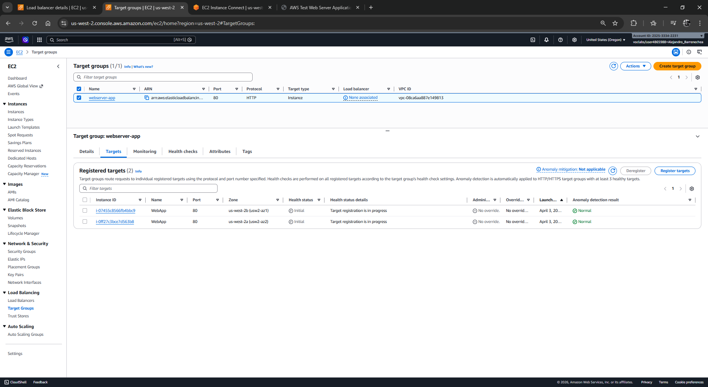
</p> 

---

### 🚨 Tarea 4: Someter la arquitectura probando una Escalada Dinámica a demanda

Como validación, deberás emular un comportamiento que amenace colapsar un nodo de computo provocando la reacción programada previamente de CPU y AWS CloudWatch.

1. 🌐 Abre tu navegador en pestaña externa. Copia e ingresa la **URL DNS de tu balanceador de carga** (ELB) guardada anteriormente, y accede con un Enter.
2. ⚡ En el sitio visualizado oprime velozmente el mandato o botón en la interfaz web de **Start Stress**.
   *(Por detrás, una solicitud a base de loops infinitos está corriendo para que tu instancia empuje la CPU a reportar cerca del 100% al sistema).*

<p align="center">
    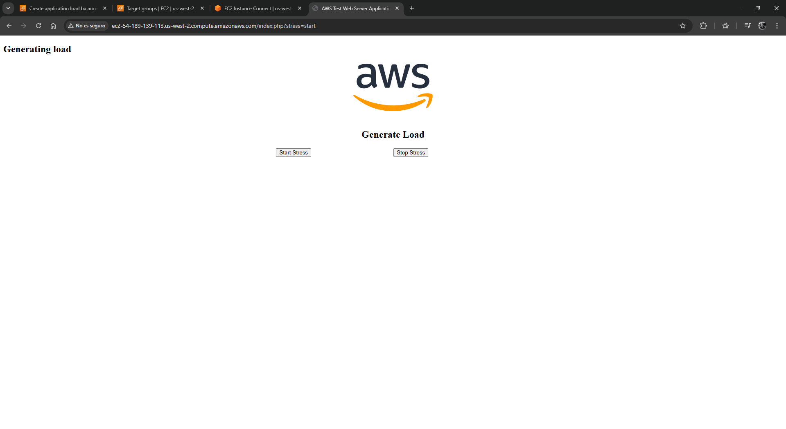
</p> 

3. ☁️ Regresa al Dashboard de la plataforma Amazon EC2. Haz Scroll abajo sobre el panel al segmento *Auto Scaling* hacia **Grupos de Auto Scaling** y selecciona tu `Web App Auto Scaling Group`.
4. 📝 En el desglose detallado de ese grupo asila la pestaña vinculada a **Actividad** (Activity).

<p align="center">
    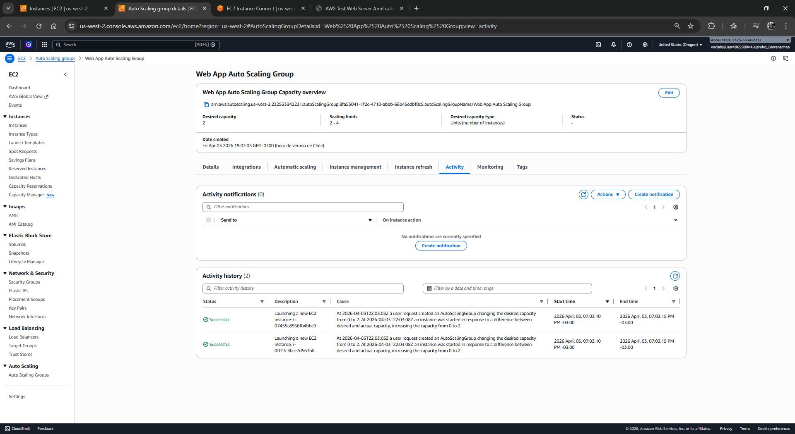
</p> 

5. 📈 Al igual que las alarmas de Cloudwatch, el Auto Scaling tardará aproximadamente de tres a cinco plenos minutos. Puedes apretar actualización (Refresh) o ver en paralelo el menú de *Cloudwatch - Alarmas*. 
   *(Notarás como producto de rebasar la marca estadística del 50%, AWS lanza de manera automática sin intevención de humano otra instancia, incrementando la escalabilidad "Scale Out").*
6. 💻 Como evidencia conclusiva, si navegas por la barra de **Instancias**, atestiguarás la inicialización flamante y sin problemas de la tercera / nueva máquina agregada a las anteriores bajo demanda.

<p align="center">
    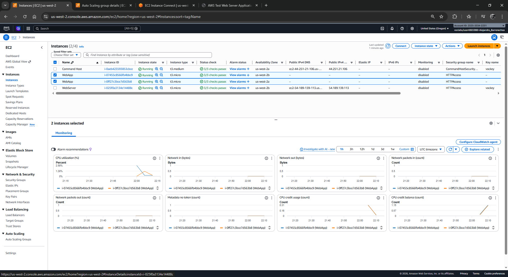
</p> 

✅ **¡Felicidades!** Has concluido este robusto pero metódico laboratorio.
