# 🛠️ Activity - Route 53 Failover Routing

**Dificultad:** 🟡 Intermedio  
**Tiempo Estimado:** ⏱️ 45 minutos  
**Servicios Principales:** ☁️ Amazon EC2, 🌐 Amazon Route 53, 📊 Amazon CloudWatch, 📩 Amazon SNS.  

---

## 📑 Resumen y Objetivos

En esta actividad configurarás el enrutamiento de conmutación por error (Failover Routing) para una aplicación web sencilla mediante Amazon Route 53. El entorno ya incluye dos instancias EC2 preconfiguradas con stack LAMP y el sitio web "Café" ejecutándose, distribuidas en diferentes Zonas de Disponibilidad para evitar puntos únicos de fallo.

Configurarás tu dominio para que, si el sitio web alojado en la Zona de Disponibilidad primaria deja de estar disponible, Amazon Route 53 redirija automáticamente el tráfico hacia la instancia ubicada en la zona secundaria.

**🎯 Objetivos:**
- 🩺 Configurar un Health Check (comprobación de estado) en Route 53 que envíe notificaciones por correo electrónico cuando el punto de enlace HTTP resulte poco saludable.
- 🔀 Configurar las políticas de enrutamiento Failover (Conmutación por error) usando los registros DNS de Amazon Route 53.

---

## 🔎 Análisis del Escenario

Lograr alta disponibilidad requiere que frente a desastres físicos, de red o caídas lógicas en una ubicación primaria, el tráfico bascule inmediatamente hacia una ubicación de respaldo. Route 53 monitoreará el servicio empleando un Health Check y, de cumplirse el umbral de errores configurado, generará una alerta vía SNS mientras actualiza instantáneamente la resolución de los registros DNS de tipo 'A' (Failover) enviando a los futuros clientes hacia el servidor secundario o pasivo.

---

## 🏗️ Arquitectura

- 🏛️ **Arquitectura de Base**: Dos instancias EC2 preexistentes, `CafeInstance1` (Primaria) y `CafeInstance2` (Secundaria) ubicadas en distintas Availability Zones (ej. `us-west-2a` y `us-west-2b`). Ambas sirven copias idénticas del aplicativo "Café".
- 🏰 **Arquitectura Final**: Registros DNS dentro de Route 53 condicionados por un Monitor de Estado (Health Check). El registro dirige el tráfico web usualmente hacia la IP de `CafeInstance1`, pero si esta cae, automáticamente la resolución de dominio entregará la IP de `CafeInstance2` para mantener a flote el servicio sin intervención humana.

    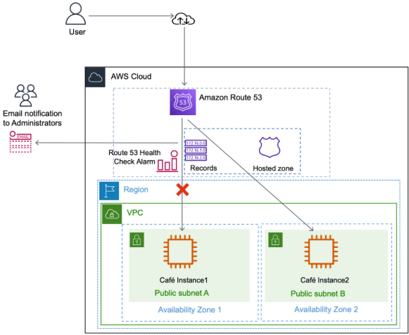

 

## 🚀 Desarrollo

### 💻 Tarea 1: Confirmación de los sitios web
En esta tarea, auditarás e identificarás los recursos que CloudFormation ha provisto previamente para ti.

1. 📋 Expande la pestaña **AWS details** provista por el entorno del lab y en **AWS** elige **Show**.
2. 📝 En el panel de credenciales copia a un bloc de notas externo los siguientes valores exactos:
   - `CafeInstance1IPAddress`
   - `PrimaryWebSiteURL`
   - `SecondaryWebsiteURL`
   - `CafeInstance2IPAddress`
3. ✖️ Cierra el panel.
4. 🌐 En la consola de AWS, busca e ingresa al servicio **EC2**.
5. 🗂️ En el menú lateral elige **Instancias**. Deberías notar que `CafeInstance1` y `CafeInstance2` ya están allí y en ejecución dentro de distintas Zonas de Disponibilidad.

    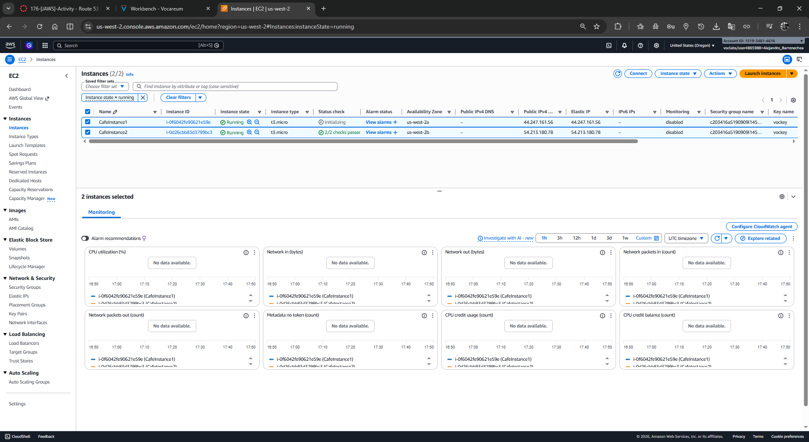

6. 🔗 Abre una nueva pestaña de navegador y pega el valor que copiaste para tu `PrimaryWebSiteURL`. Debería cargar la web del café y mostrarte en los metadatos qué Región y AZ te está atendiendo.
7. 🔗 Abre otra pestaña e ingresa la URL paralela `SecondaryWebsiteURL`. Confirmarás que luce idéntico pero lo atiende la máquina secundaria.

    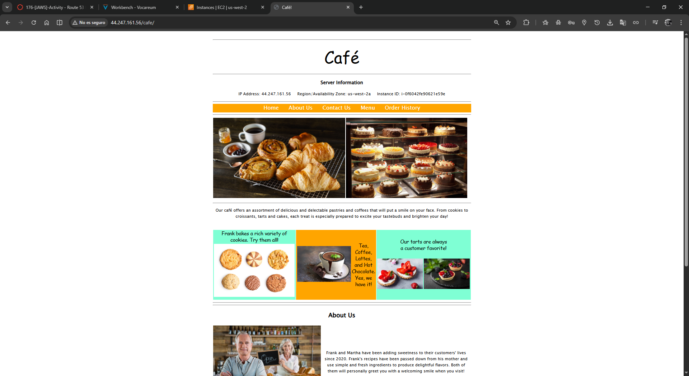

8. 🍽️ Para probar funcionalidad en una de ellas, haz clic en el menú (Menu), elige una orden y haz clic en **Submit Order**. Se confirmará el pedido. 

    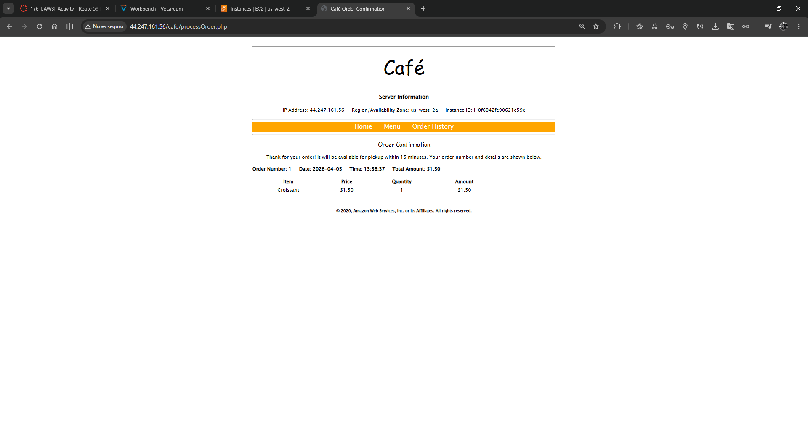

### 🩺 Tarea 2: Configuración de la comprobación de estado de Route 53 (Health Check)
El paso inicial es crear un objeto que mida constantemente si tu servidor primario sigue con vida.

1. 🧭 Desde la caja de búsqueda general superior introduce y accede a **Route 53**. *(Ignora si salen pequeños banners rojos de IAM debido a permisos restringidos del lab).*
2. 🗂️ En el panel lateral, dirígete al menú de **Comprobaciones de estado** (Health checks).

    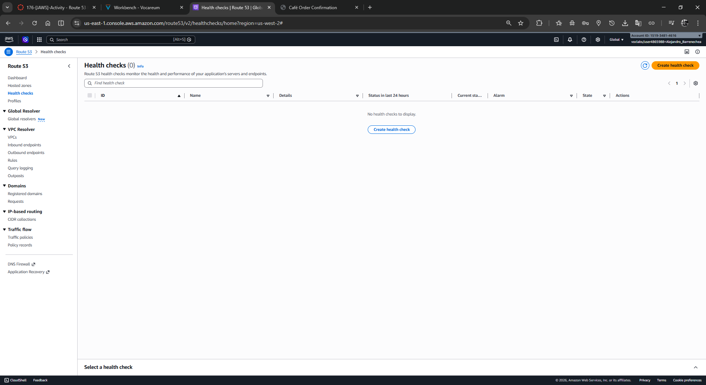

3. ➕ Da clic a **Crear comprobación de estado** y configura las siguientes propiedades:
   - **Nombre**: `Primary-Website-Health`
   - **Qué monitorear**: Endpoint (Punto de enlace)
   - **Especificar el punto de enlace por**: Dirección IP (IP address).
   - **Dirección IP**: Pega tu `CafeInstance1IPAddress` recuperado de tu bloc de notas.
   - **Ruta** (Path): Escribe `cafe`
4. ⚙️ Despliega la **Configuración avanzada** y cambia los siguientes valores clave:
   - **Intervalo de solicitud** (Request interval): Escoge *Rápido (Fast) (10 segundos)*.
   - **Umbral de error** (Failure threshold): Ingresa `2`.
   *(Esto endurece los niveles de tolerancia para declarar caída a la máquina de forma ágil).*
5. 🚀 Desplázate al final de la página y presiona directamente **Crear comprobación de estado**.

    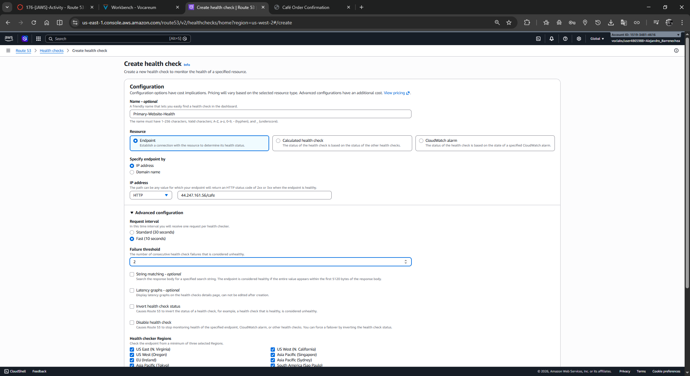

6. 📩 Una vez creado tu Health Check, selecciónalo desde la lista y dirígete a la pestaña de **Alarmas** (Alarms) en el panel inferior. Haz clic en el botón **Crear una alarma de CloudWatch** (Create a CloudWatch alarm). Esto te llevará al asistente de CloudWatch. Configúralo así:
   - **Condiciones (Conditions)**: Asegúrate que esté en Estático (Static).
   - **Cuando HealthCheckStatus sea...**: Selecciona **Menor** (Lower / `< threshold`).
   - **que... (than...)**: Escribe `1`. *(La métrica devuelve 1 si está bien, y 0 si se cae).*
   - Haz clic en **Siguiente** (Next).

    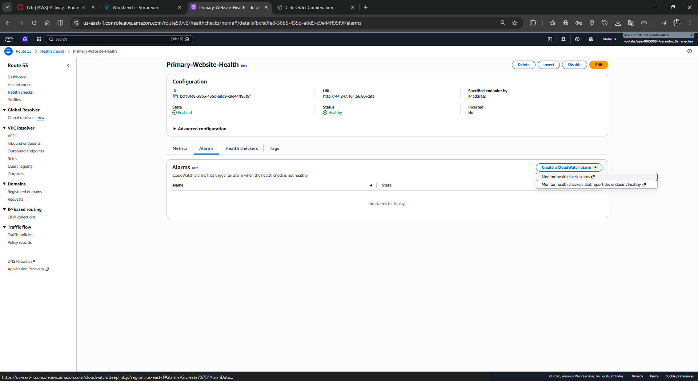

    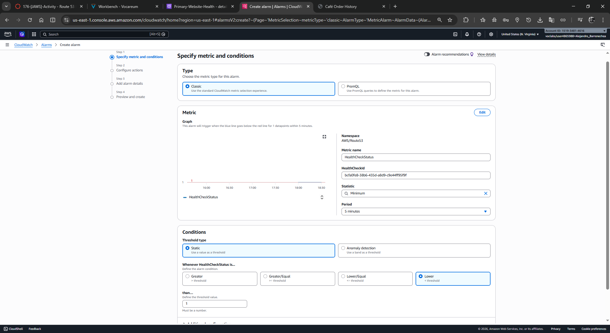

7. 📩 En el paso 2 (*Configurar acciones*):
   - ➕ Haz clic en el botón blanco **Añadir notificación** (Add notification) en el primer recuadro.
   - **Activador**: En alarma (In alarm).
   - **Enviar notificación a**: Selecciona *Crear un nuevo tema* (Create a new topic).
   - **Nombre del tema**: `Primary-Website-Health`.
   - **Puntos de enlace...**: *Ingresa tu correo electrónico real al que tengas acceso*.

    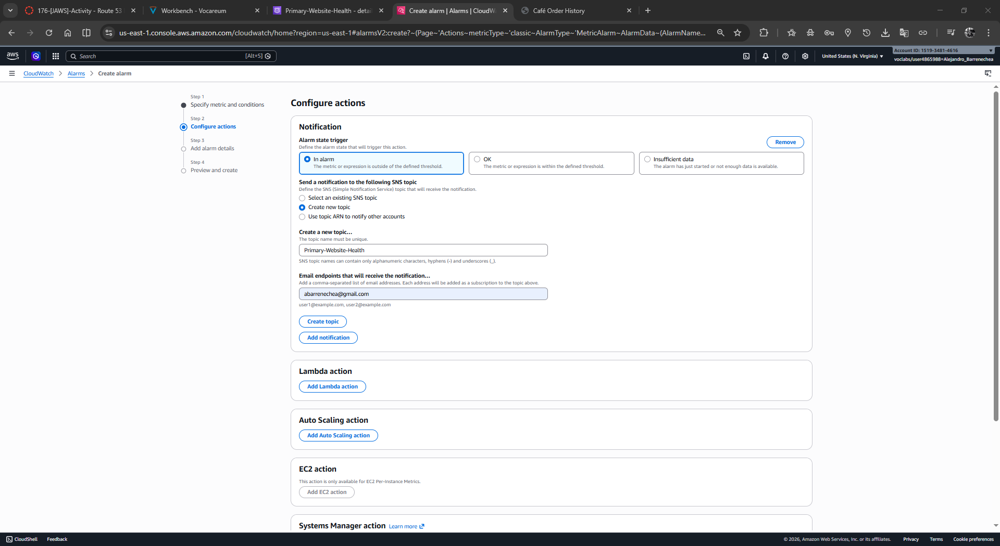

   - 📍 Haz clic en el botón **Crear tema** (Create topic) que aparece encasillado justo debajo del campo de tu correo.

    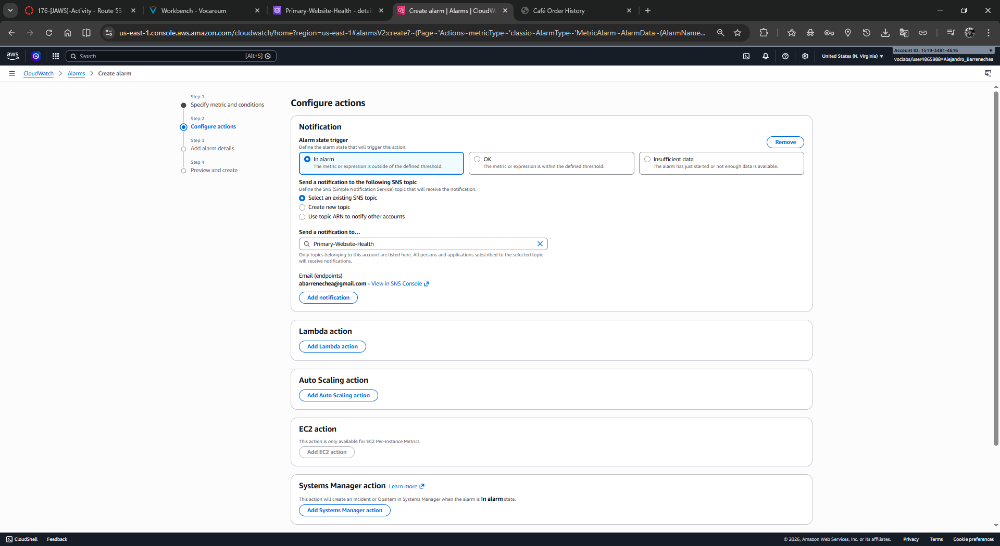

   - Ahora sí, dale a **Siguiente** al fondo de la página.
8. ✍️ En el paso 3 (*Add alarm details*), asígnale como Nombre de alarma `Primary-Website-Health`, avanza a **Siguiente** y finaliza en el último paso presionando **Crear alarma**.

    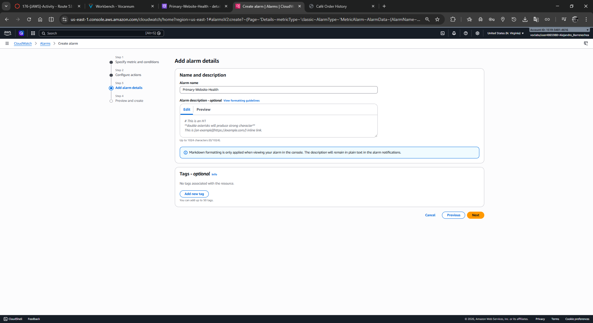

9. ⏳ Espera alrededor de un minuto revisando en la consola Route 53 (🔁) hasta que el Estado reflejado sea contundentemente "Saludable" (Healthy).

    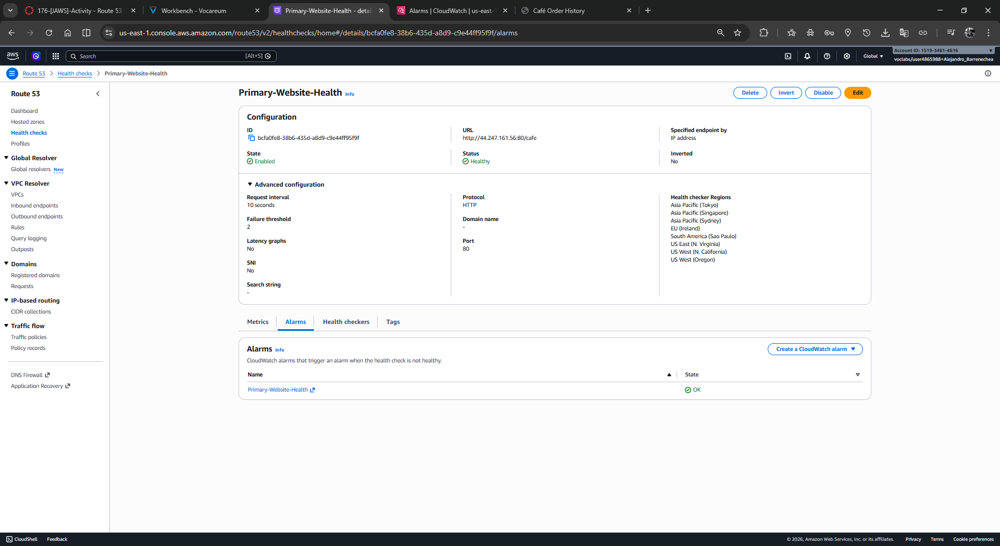

10. 📊 Selecciona tu comprobación de estado desde la lista de Route 53 y en el panel inferior, haz clic en la pestaña de **Métricas** (Metrics) para visualizar la gráfica en tiempo real.
11. 📞 Ve a tu bandeja de correo y abre el mensaje enviado automáticamente por AWS Notifications. Confirma haciendo clic firme en el enlace **Confirm subscription** para dejar activa la alerta por caída.

    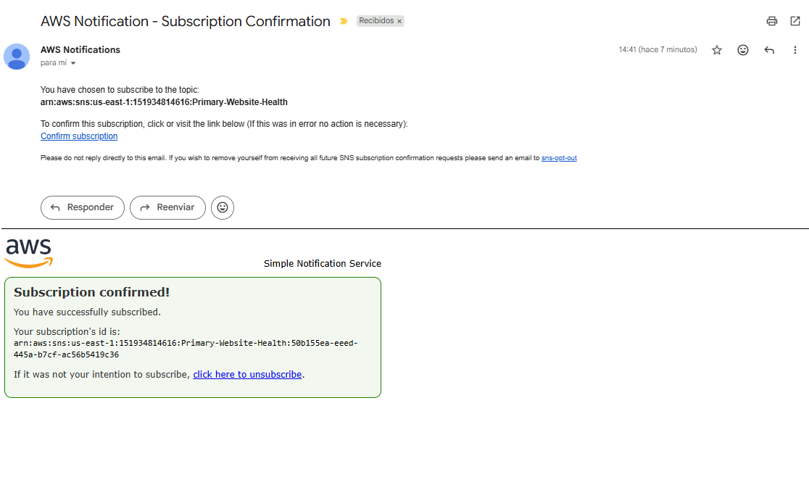

### 🌐 Tarea 3: Configuración de los registros DNS en Route 53

Ahora usarás ese Health Check para generar decisiones y condicionar a los registros de dominio (A Records).

#### ⏺️ Tarea 3.1: Creación del registro "A" Primario
1. 🗂️ En Route 53, en el menú principal izquierdo, escoge **Zonas alojadas** (Hosted zones).
2. 🔍 Haz clic directamente en el dominio `6042705_1775411342.vocareum.training` que ya fue provisionado y pagado para este ejercicio. Exiten dos sub registros `NS` y `SOA` (nunca los alteres).

    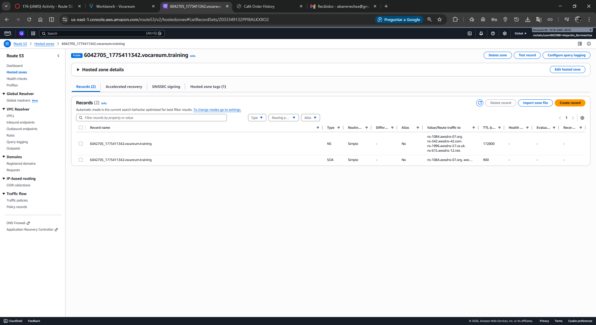

3. ➕ Presiona **Crear registro** (Create record) y configúralo:
   - **Nombre del registro**: Ingresa `www`
   - **Tipo de registro**: `A - Routes traffic to an IPv4 address...`
   - **Valor** (Value): Pega la IP Pública que guardaste como `CafeInstance1IPAddress`.
   - **TTL (segundos)**: Establécelo en `15`. 
   - **Política de enrutamiento** (Routing policy): Selecciona explícitamente **Conmutación por error** (Failover).
   - **Tipo de registro de conmutación por error**: Elige **Primario** (Primary).
   - **ID de la comprobación de estado**: Seleccióna tu creado `Primary-Website-Health`.
   - **ID de registro**: Pon el nombre `FailoverPrimary`.
4. 💾 Oprime **Crear registros**. Ahora tendrás una tercera fila en tu panel de Hosted Zones.

    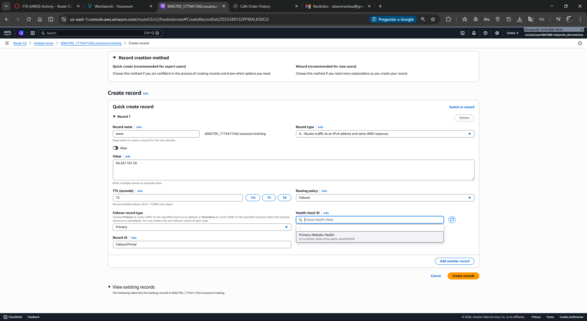

#### ⏺️ Tarea 3.2: Creación del registro "A" Secundario
Establezcamos al servidor que saldrá de banca cuando el primario falle.
1. ➕ Presiona **Crear registro** de nuevo:
   - **Nombre del registro**: Ingresa `www`.
   - **Tipo de registro**: `A - Routes traffic to an IPv4 address...`
   - **Valor**: Inserta la IP del segundo servidor: `CafeInstance2IPAddress`.
   - **TTL (segundos)**: `15`
   - **Política de enrutamiento**: **Conmutación por error** (Failover).
   - **Tipo de registro de conmutación por error**: Este será el **Secundario** (Secondary).
   - **ID de la comprobación de estado**: *Déjalo vacío/en blanco.*
   - **ID de registro**: Nómbralo `FailoverSecondary`.
2. 💾 Vuelve a **Crear registros**. ¡Tus dos caminos (El activo condicionado y el Backup listo) están fijados!

    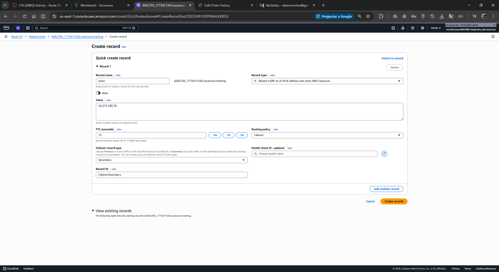

### ✔️ Tarea 4: Verificando la resolución del DNS
Probemos que la configuración DNS favorece inicialmente a tu base primaria.
1. 📋 Selecciona cualquiera de tus registros A creados. En el panel lateral copia todo el contenido del campo visible como "Nombre del registro" (`www.6042705_1775411342.vocareum.training`).

    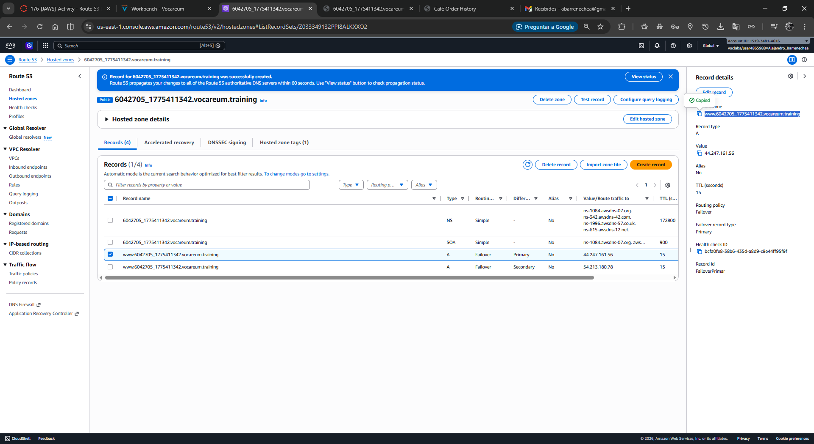

2. 🌐 Abre otra pestaña del navegador.
3. ⌨️ Pega todo ese largo de la URL del dominio que copiaste para el Registro A, y agrégale muy importante la ruta `/cafe` al final (Ej: `www.6042705_1775411342.vocareum.training`). Da Enter.
4. 🎉 El sitio "Cafe" deberá cargar, e indicar en el pie de servidor que estás sirviendo tráfico desde la Zona Inicial `us-west-2a` (la Región de tu Primario).

    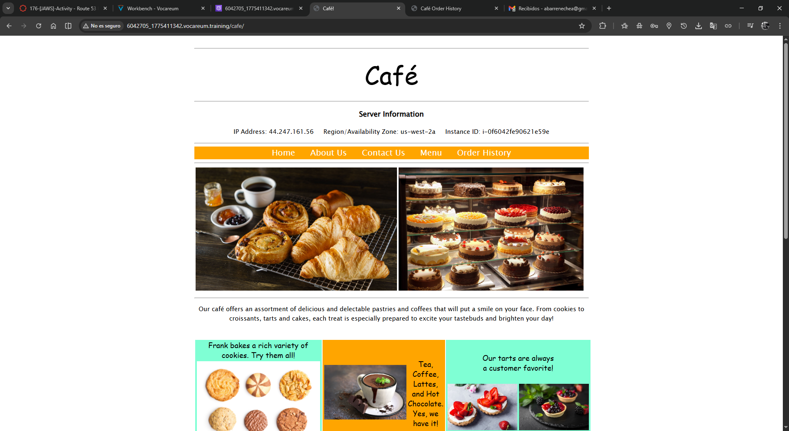

### 🚨 Tarea 5: Validando la Conmutación por error (Failover) de la arquitectura en acción
Efectuarás un desastre de forma manual, colapsando el servidor EC2 base, forzando a Route53 y DNS a cambiar de lado.

1. 💻 De vuelta a la Consola madre de AWS, usa la lupa arriba y dirígete a **EC2 > Instancias**.
2. ☑️ Selecciona severamente tu máquina **CafeInstance1**.
3. ⚙️ Despliega en el menú **Estado de la instancia**, y escoge **Detener instancia** (Stop instance).
4. 🛑 Confirma tu accionar haciendo clic en **Detener**. Acabas de derrumbar tu sitio primario base.

    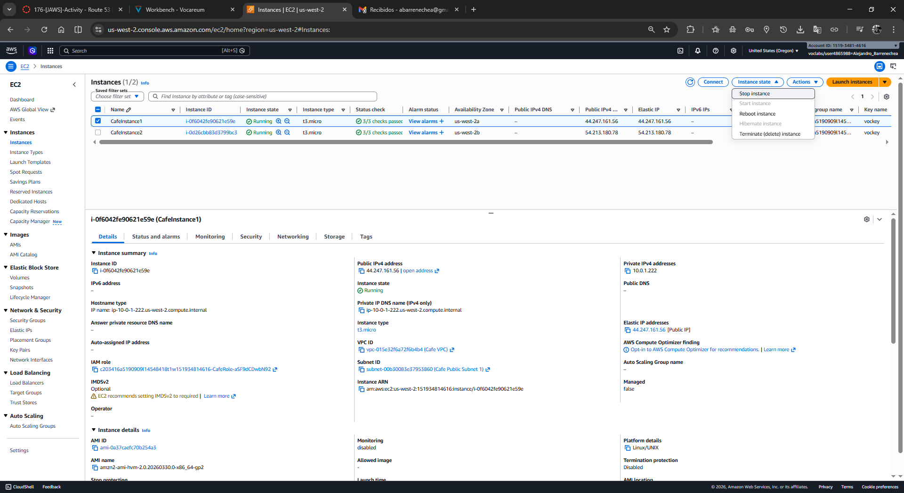

5. 🌐 Navega a la consola de **Route 53**.
6. 🗂️ Entra a mano izquierda al panel **Comprobaciones de Estado** (Health checks).
7. 📊 Selecciona el `Primary-Website-Health` y monitorea su gráfica y estatus. Después de unos minutos de latencia normal actualizando (🔁), el Estado deberá volverse tajantemente a uno **No Saludable** (Unhealthy).

    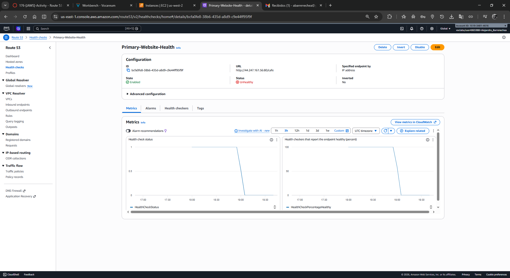

8. 📞 En poco tiempo tu correo electrónico reaccionará con la alarma remitente  "ALARM: Primary-Website-Health-awsroute53..." reportándote la grave alerta levantada por SNS.
9. 🚀 Vuelve a tu pestaña con la web abierta el domino amigable del entorno publico cargado (la url con el `/cafe`). Refresca o haz F5 repetidas veces a la pantalla.
10. 🎉 Mágicamente la capa visible de los archivos estáticos seguirá operando. Revisa los metadatos y te confirmará la maravilla: Tu petición no se colgó, simplemente te atiende ahora la Availability Zone de Respaldo (`us-west-2b`). Route 53 cambió la dirección por debajo para ti debido a la alta disponibilidad lograda.
*(Si aún no te redirige, corrobora el estado "No saludable" y dale pocos minutos al DNS para propagar el caché de tu proveedor de internet)*.

    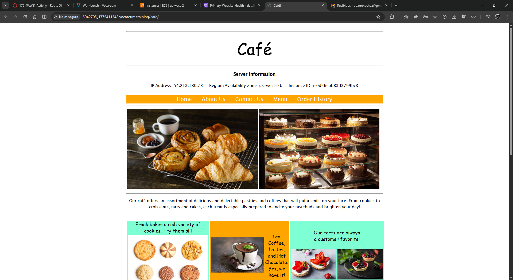

---

✅ **¡Felicidades!** Has concluido este laboratorio dominando el enrutamiento y tolerancia a fallas en alta disponibilidad con AWS Route53.
