# 🏆 Lab Desafío: Ejercicio de AWS Lambda

**Dificultad:** Desafío | ⏱️ **Tiempo Estimado:** 90 minutos
**Servicios Principales:** ƛ AWS Lambda, 🪣 Amazon S3, 🔔 Amazon SNS, 🛡️ AWS IAM.

## 📋 Resumen y Objetivos
En este laboratorio de desafío, crearás una función **AWS Lambda** para contar el número de palabras en un archivo de texto.

**Objetivos técnicos:**
*   ƛ Crear una función Lambda para contar el número de palabras en un archivo de texto.
*   🪣 Configurar un bucket de **Amazon Simple Storage Service (Amazon S3)** para invocar una función Lambda cuando se suba un archivo de texto.
*   🔔 Crear un tema de **Amazon Simple Notification Service (Amazon SNS)** para reportar el conteo de palabras en un correo electrónico.

---

## 🎯 Tu Desafío
Crea una función Lambda para contar el número de palabras en un archivo de texto. Los pasos generales son los siguientes:

1. **Desarrollo de la Función:** Usa la Consola de Administración de AWS para desarrollar una función Lambda en **Python** y crea los recursos requeridos por la función.
2. **Notificaciones (SNS):** Reporta el conteo de palabras en un correo electrónico usando un tema SNS. *(Opcionalmente, también puedes enviar el resultado en un mensaje SMS).*
   * **Formato del mensaje:** Debe ser exactamente así: `The word count in the <textFileName> file is nnn.` *(Reemplaza `<textFileName>` con el nombre real del archivo).*
   * **Asunto del correo:** Ingresa el siguiente texto como asunto: `Word Count Result`.
3. **Configuración de Eventos (S3):** Configura la arquitectura para invocar automáticamente la función cuando un archivo de texto sea subido a un bucket de S3.
4. **Pruebas:** Prueba la función subiendo algunos archivos de texto de muestra con diferentes conteos de palabras al bucket de S3.
5. **Validación:** Reenvía el correo electrónico generado por una de tus pruebas junto con una captura de pantalla de tu función Lambda a tu instructor.

---

## 🛠️ Desarrollo

### 1️⃣ Tarea 1: Configurar las Notificaciones 🔔 (Amazon SNS)
1. 🌐 **Navega** a la consola de **Amazon SNS** y selecciona **Topics** (Temas).
2. ➕ Haz clic en **Create topic** (Crear tema).
   * **Type** (Tipo): Selecciona **Standard**.
   * **Name** (Nombre): Escribe `WordCountTopic` (o el nombre que prefieras).
   * 💾 Haz clic en **Create topic** al final de la página.

<p align="center"> 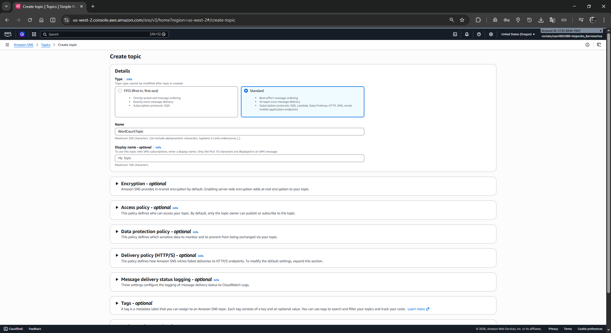</p>
<p align="center"> 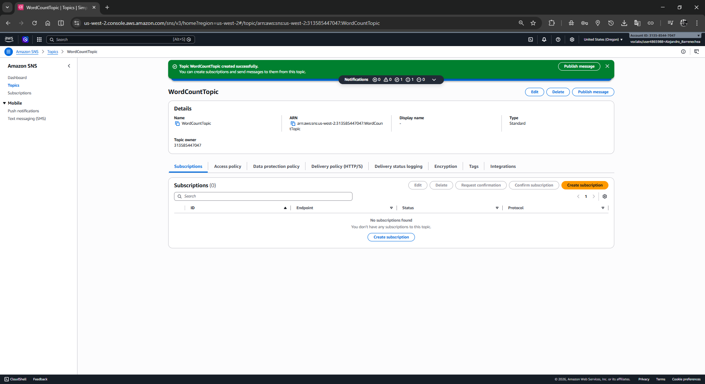</p>

3. 📝 Dentro del tema recién creado, haz clic en **Create subscription** (Crear suscripción).
   * **Protocol** (Protocolo): Selecciona **Email**.
   * **Endpoint**: Ingresa tu dirección de correo electrónico a la que tengas acceso.
   * 💾 Haz clic en **Create subscription**.

<p align="center"> 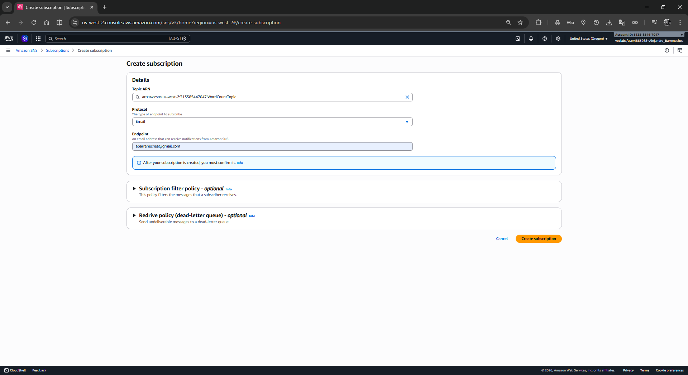</p>

4. ✉️ **Confirmación:** Revisa tu bandeja de entrada de correo electrónico. Abre el mensaje temporal de *"AWS Notifications"* y haz clic en el enlace **Confirm subscription**. Debería abrirse una pestaña validando el éxito.

<p align="center"> 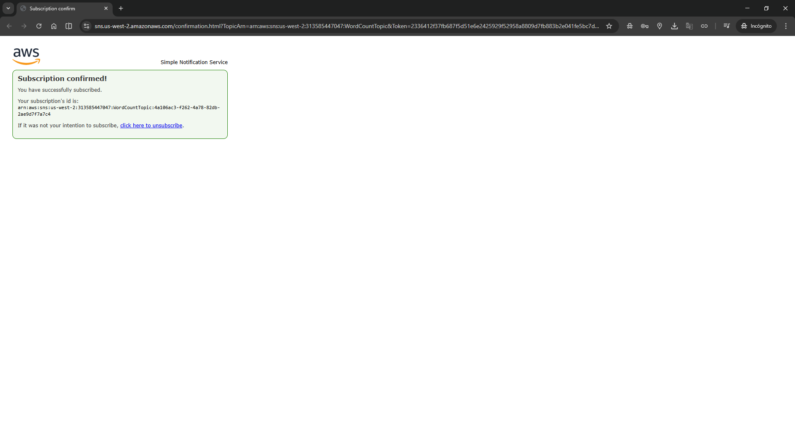</p>

### 2️⃣ Tarea 2: Crear el Almacenamiento 🪣 (Amazon S3)
1. 🌐 **Navega** a la consola de **Amazon S3** y selecciona **Buckets**.
2. ➕ Haz clic en **Create bucket** (Crear bucket).
   * **Bucket name**: Ingresa un nombre **globalmente único** en minúsculas (ej. `tu-nombre-wordcount-lab-12345`).
   * **AWS Region**: Asegúrate de que sea la misma región donde creaste tu tema SNS.
3. 💾 Deja el resto de las opciones por defecto y haz clic en **Create bucket** al final de la página.

<p align="center"> 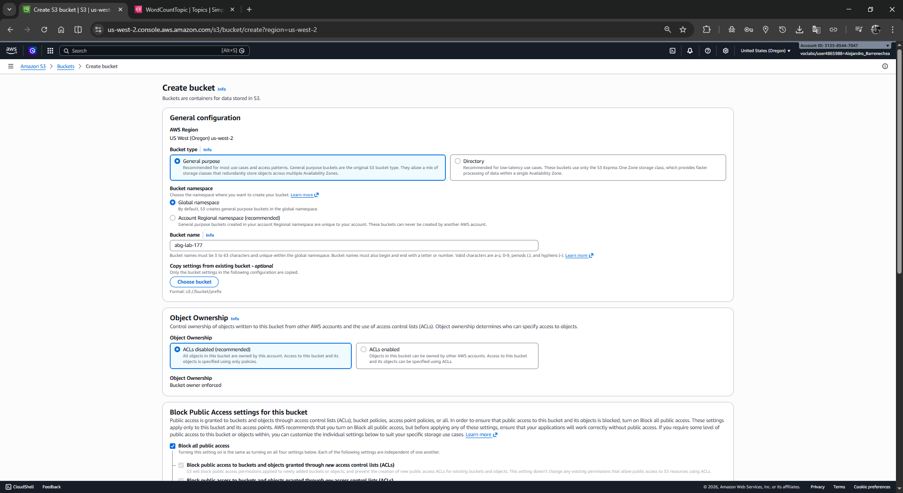</p>

### 3️⃣ Tarea 3: Desarrollar la Lógica ƛ (AWS Lambda)
1. 🌐 **Navega** a la consola de **AWS Lambda** y haz clic en **Create function** (Crear función).
2. ⚙️ **Configuración Básica:**
   * Selecciona **Author from scratch** (Crear desde cero).
   * **Function name**: Escribe `WordCounterFunction`.
   * **Runtime**: Selecciona **Python 3.12** (o la versión reciente que prefieras).
3. 🛡️ **Permisos:**
   * Despliega la opción **Change default execution role**.
   * Elige 🔘 **Use an existing role** (Usar un rol existente).
   * En el menú desplegable, selecciona **`LambdaAccessRole`** (requerimiento estricto del laboratorio).
   * 💾 Haz clic en **Create function**.

<p align="center"> 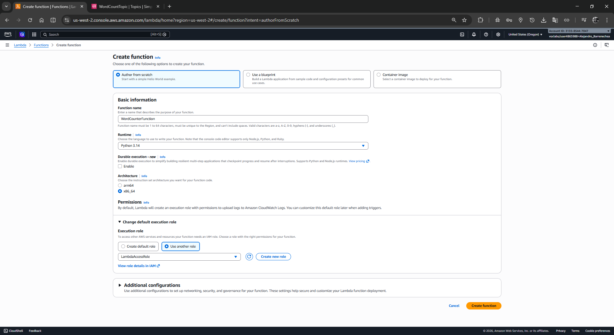</p>

4. 🐍 **Código de la Función:**
   * Desplázate hacia abajo hasta la sección de **Code source**.
   * 🗑️ Borra el código por defecto en `lambda_function.py` y **pega** la siguiente solución:

```python
import os
import boto3
import urllib.parse

# 🚀 Inicializar clientes de SDK
s3 = boto3.client('s3')
sns = boto3.client('sns')

def lambda_handler(event, context):
    try:
        # 📂 Extraer el nombre del bucket y la clave del archivo desde el evento
        bucket = event['Records'][0]['s3']['bucket']['name']
        key = urllib.parse.unquote_plus(event['Records'][0]['s3']['object']['key'], encoding='utf-8')
        
        # ⬇️ Obtener el objeto de texto desde S3
        response = s3.get_object(Bucket=bucket, Key=key)
        texto = response['Body'].read().decode('utf-8')
        
        # 🧮 Calcular el conteo de palabras
        conteo_palabras = len(texto.split())
        
        # 💬 Dar formato exacto al mensaje final
        mensaje = f"The word count in the {key} file is {conteo_palabras}."
        
        # 🔐 Obtener el ARN del tema SNS desde las variables de entorno
        topic_arn = os.environ['SNS_TOPIC_ARN']
        
        # 📡 Publicar el recuento en el tema SNS
        sns.publish(
            TopicArn=topic_arn,
            Message=mensaje,
            Subject="Word Count Result"
        )
        
        return {
            'statusCode': 200,
            'body': 'Mensaje procesado y enviado con éxito.'
        }
    except Exception as e:
        print(f"❌ Error procesando el archivo: {e}")
        raise e
```

<p align="center"> 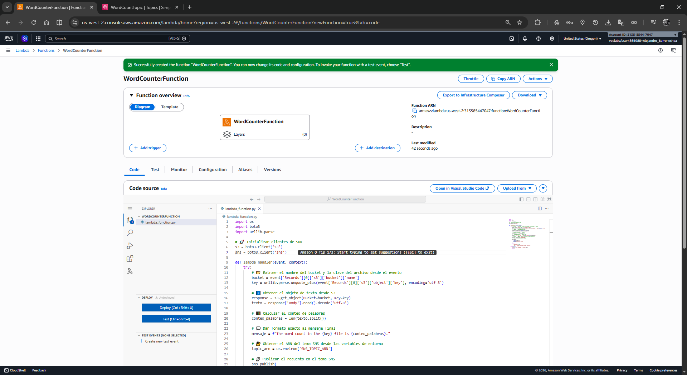</p>

   * 🖱️ Haz clic en el botón **Deploy** (Implementar).
5. 🔧 **Variables de Entorno:**
   * Pásate a la pestaña **Configuration** de tu función y selecciona en la izquierda **Environment variables**.
   * Haz clic en **Edit** y luego en **Add environment variable**.
   * **Key**: Escribe `SNS_TOPIC_ARN`.
   * **Value**: Pega el **ARN completo** del tema SNS que creaste en la Tarea 1 (ej. `arn:aws:sns:us-west-2:313585447047:WordCountTopic`).
   * 💾 Haz clic en **Save** (Guardar).

<p align="center"> 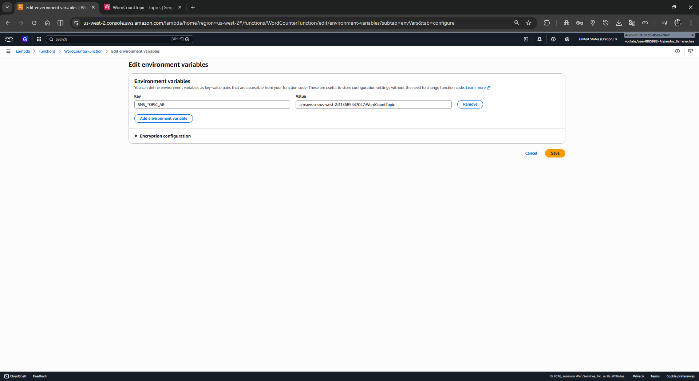</p>

### 4️⃣ Tarea 4: Conectar los Eventos 🔗 (Triggers)
1. 🖱️ En la consola de tu función Lambda, ve a la sección **Function overview** (mapa superior) y haz clic en **+ Add trigger**.
2. ⚙️ En la lista desplegable de configuración del desencadenador, busca y selecciona **S3**.
   * **Bucket**: Elige el bucket que creaste en la Tarea 2.
   * **Event types**: Asegúrate de que esté marcado `All object create events`.
   * ⚠️ Marca la casilla obligatoria de "Recursive invocation" reconociendo que tus salidas de la Lambda no se escriben de nuevo en el mismo bucket.
   * 💾 Haz clic en **Add** (Agregar).

<p align="center"> 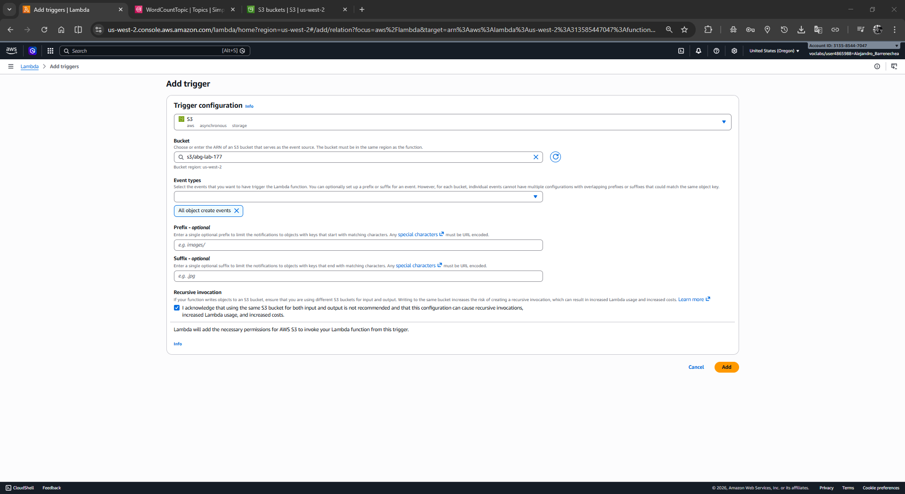</p>

### 5️⃣ Tarea 5: Pruebas y Validación Final 🧪
1. 📝 En tu computadora, crea un documento de texto en blanco (ej. `prueba.txt`) y escribe un párrafo con unas cuantas palabras.
2. 🌐 Regresa a la consola de **Amazon S3** y entra a fondo en tu bucket.
3. ⬆️ Haz clic en el botón **Upload** (Cargar), después en **Add files**. Selecciona tu archivo `prueba.txt` y finaliza dándole clic a **Upload** en la parte inferior.

<p align="center"> 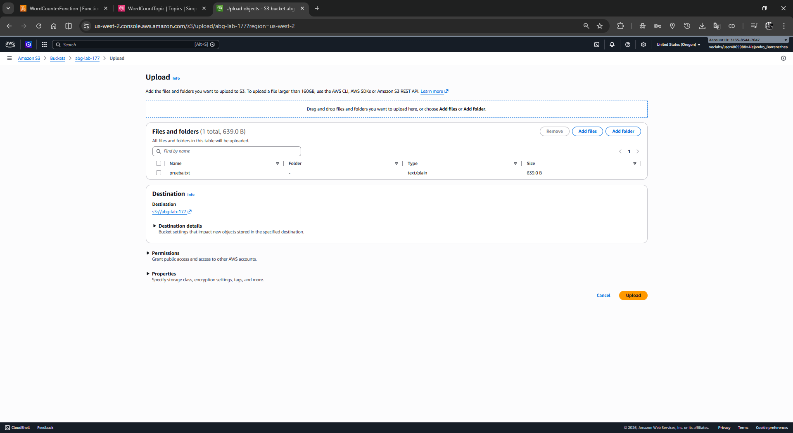</p>

4. ✉️ OJO a tu bandeja de correo: En unos minutos o segundos deberías recibir un email titulado `Word Count Result`. El cuerpo debería decir: `"The word count in the prueba.txt file is X."`

<p align="center"> 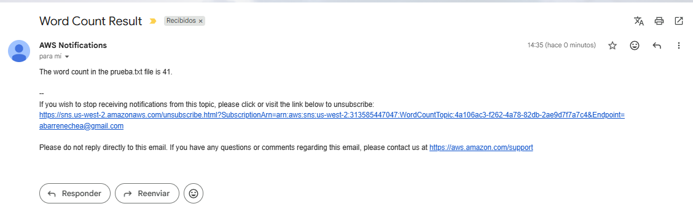</p>

---

## 💡 Pistas y Recomendaciones
* 🌍 **Región:** Asegúrate de crear **todos** tus recursos en la misma Región de AWS.
* 🛡️ **Permisos (IAM):** Necesitas un rol de IAM para que la función Lambda acceda a otros servicios de AWS. Debido a que la política de este laboratorio no permite crear un nuevo rol de IAM desde cero, **debes utilizar el rol proporcionado llamado `LambdaAccessRole`**.
  
  El rol `LambdaAccessRole` proporciona los siguientes permisos:
  * `AWSLambdaBasicExecutionRole`: Política administrada de AWS que proporciona permisos de escritura en Amazon CloudWatch Logs.
  * `AmazonSNSFullAccess`: Política administrada de AWS que proporciona acceso completo a Amazon SNS a través de la consola.
  * `AmazonS3FullAccess`: Política administrada de AWS que proporciona acceso completo a todos los buckets a través de la consola.
  * `CloudWatchFullAccess`: Política administrada de AWS que proporciona acceso completo a Amazon CloudWatch.
* 📚 Para obtener orientación adicional, puedes consultar el laboratorio anterior: *"Trabajo con AWS Lambda"*.

---

## ✅ Conclusión
¡Felicidades! Al completar este desafío, habrás logrado con éxito lo siguiente:
* Crear una función Lambda para procesar y contar el número de palabras en un archivo de texto.
* Configurar una integración impulsada por eventos usando un bucket S3 para invocar automáticamente tu Lambda.
* Configurar Amazon SNS para emitir un reporte generado dinámicamente vía correo electrónico.
