# 🌐 Lab: Creación de un sitio web estático en Amazon S3 mediante AWS CLI
*   **Dificultad:** 🟡 Intermedio
*   **Tiempo Estimado:** ⏳ 45 minutos
*   **Servicios Principales:** 📦 Amazon S3, 💻 Amazon EC2, 🔐 AWS IAM.

## 1. Resumen y Objetivos
En este laboratorio, practicarás el uso de la interfaz de línea de comandos de AWS (AWS CLI) desde una instancia de Amazon EC2. El propósito es configurar la infraestructura necesaria para alojar el sitio web de "Café & Bakery" directamente en un bucket de S3, gestionando identidades de acceso y automatizando procesos.

**Objetivos técnicos:**
*   Ejecutar comandos de AWS CLI para servicios de IAM y Amazon S3.
*   Desplegar un sitio web estático en un bucket de S3.
*   Crear un script de automatización para la sincronización de archivos locales hacia la nube.

## 2. Análisis del Escenario
El cliente "Café & Bakery" requiere una solución de hosting de bajo coste y alta disponibilidad. Como Ingeniero de AWS, configurarás un entorno donde los archivos del sitio se gestionen desde una instancia administrativa (EC2), se almacenen en S3 y sean accesibles al público. Se implementará además un mecanismo de actualización repetible mediante scripts para optimizar el flujo de trabajo del desarrollador.

## 3. Arquitectura
*   **Estación de trabajo:** Instancia Amazon EC2 con Amazon Linux.
*   **Almacenamiento:** Bucket de Amazon S3 configurado como sitio web estático.
*   **Seguridad:** Usuario de IAM (`awsS3user`) con permisos específicos para la gestión de objetos.

<p align="center">
  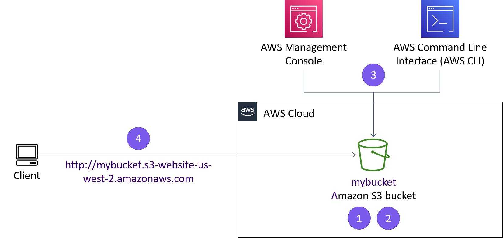
</p>

---

## 4. Desarrollo

### ➊ Conexión a la instancia EC2 mediante SSM
1.  **Haz clic** en el botón **Details** en la parte superior y selecciona **Show**.
2.  **Copia** el valor de `InstanceSessionUrl` y **pégalo** en una nueva pestaña de tu navegador.
3.  **Ejecuta** los siguientes comandos en la terminal que aparece para configurar el entorno de usuario:
    ```bash
    sudo su -l ec2-user
    pwd
    ```

<p align="center">
  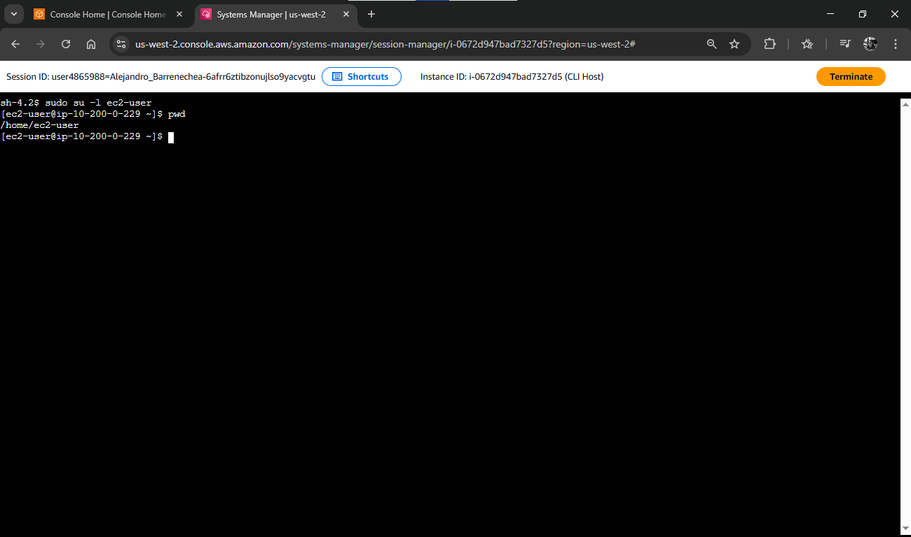
</p>

### ➋ Configuración de la AWS CLI
1.  **Escribe** el comando de configuración inicial:
    ```bash
    aws configure
    ```
2.  **Ingresa** los siguientes parámetros cuando se te soliciten (usa los valores del panel de detalles del lab):
    *   **AWS Access Key ID:** Pega el valor de `AccessKey`.
    *   **AWS Secret Access Key:** Pega el valor de `SecretKey`.
    *   **Default region name:** `us-west-2`
    *   **Default output format:** `json`

<p align="center">
  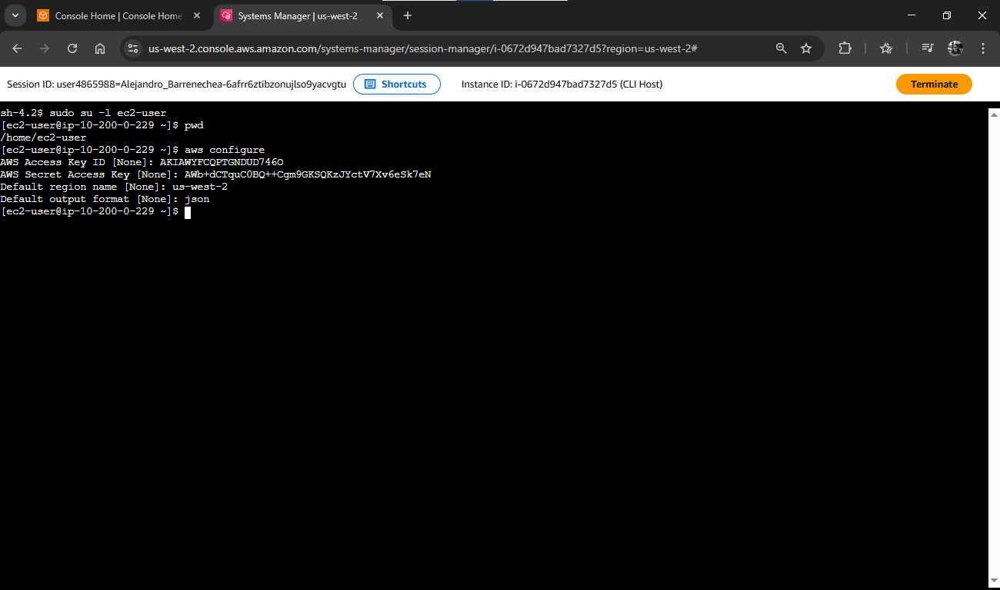
</p>

### ➌ Creación del bucket de S3 vía CLI
1.  **Crea** un nombre único para tu bucket (ej. iniciales + apellido + 3 números).
2.  **Ejecuta** el comando para crear el bucket en la región específica:
    ```bash
    aws s3api create-bucket --bucket <TU-NOMBRE-DE-BUCKET> --region us-west-2 --create-bucket-configuration LocationConstraint=us-west-2
    ```
3.  **Verifica** que el sistema devuelva una respuesta JSON con la ubicación (`Location`) del bucket.

<p align="center">
  
</p>

### ➍ Creación de usuario IAM y gestión de acceso
1.  **Crea** el nuevo usuario de IAM:
    ```bash
    aws iam create-user --user-name awsS3user
    ```
2.  **Asigna** una contraseña al usuario:
    ```bash
    aws iam create-login-profile --user-name awsS3user --password Training123!
    ```
3.  **Copia** tu ID de cuenta de 12 dígitos desde el menú desplegable `VocLabsUser` en la consola de AWS.
4.  **Cierra la sesión** de la consola de AWS (Sign Out).
5.  **Inicia sesión nuevamente** como **IAM User**:
    *   Ingresa el ID de cuenta (sin guiones).
    *   Usuario: `awsS3user` | Contraseña: `Training123!`
6.  **Navega** a S3 y observa que es posible que no veas el bucket o veas errores de acceso.

<p align="center">
  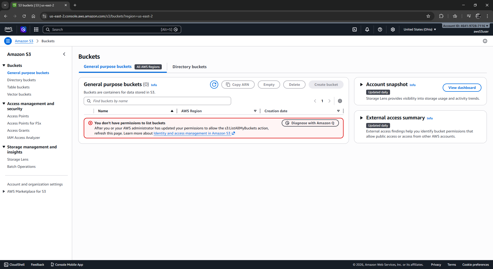
</p>

7.  **Regresa a la terminal** (SSM) y busca la política de acceso total:
    ```bash
    aws iam list-policies --query "Policies[?contains(PolicyName,'S3')]"
    ```

<p align="center">
  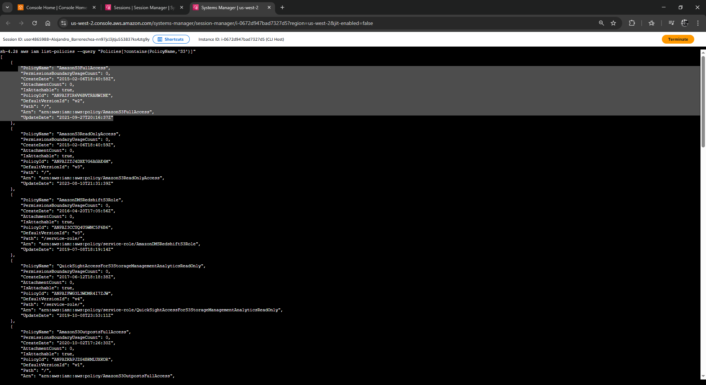
</p>

8.  **Adjunta** la política encontrada (ej. `AmazonS3FullAccess`) al usuario:
    ```bash
    aws iam attach-user-policy --policy-arn arn:aws:iam::aws:policy/AmazonS3FullAccess --user-name awsS3user
    ```

<p align="center">
  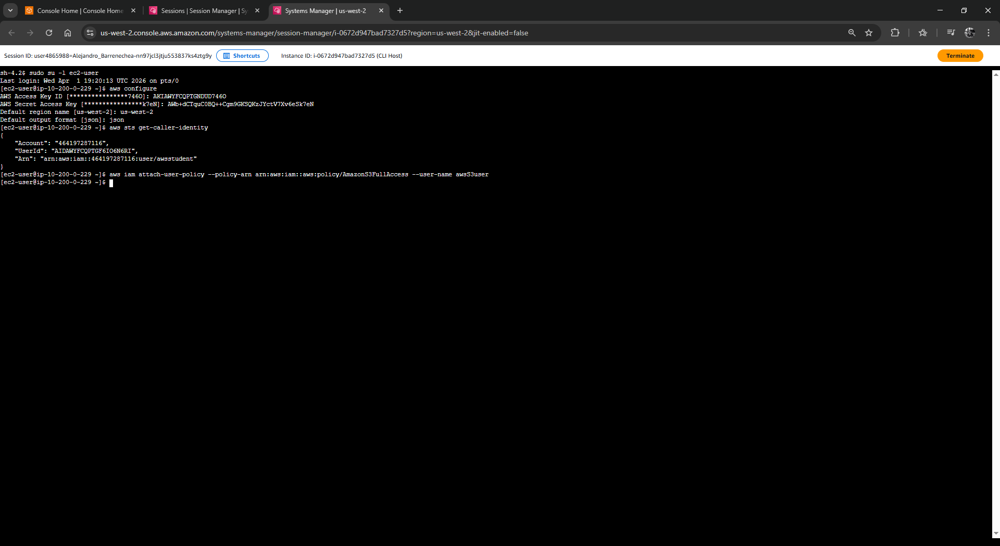
</p>

9.  **Refresca** la consola de AWS y verifica que ahora tienes acceso.

### ➎ Ajuste de permisos del Bucket (Acceso Público)
1.  **Selecciona** tu bucket en la consola de Amazon S3.
2.  **Ve** a la pestaña **Permissions** (Permisos).
3.  **Edita** "Block public access", **desmarca** la casilla "Block all public access" y guarda los cambios (escribe `confirmar`).

<p align="center">
  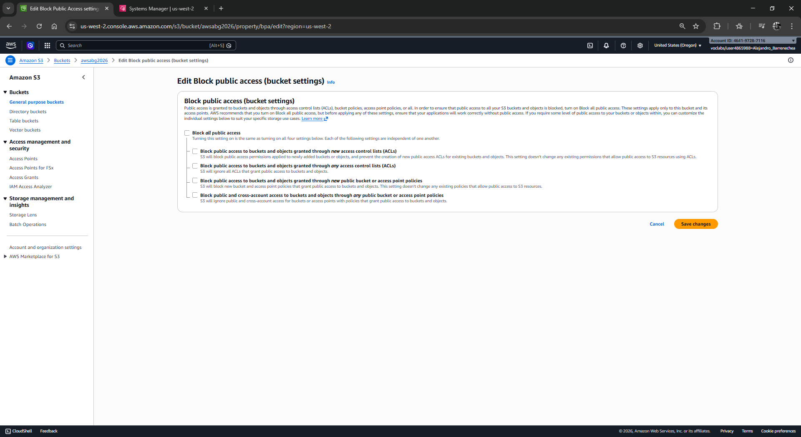
</p>

4.  **Edita** "Object Ownership", selecciona **ACLs enabled**, marca la casilla de confirmación y guarda los cambios.

<p align="center">
  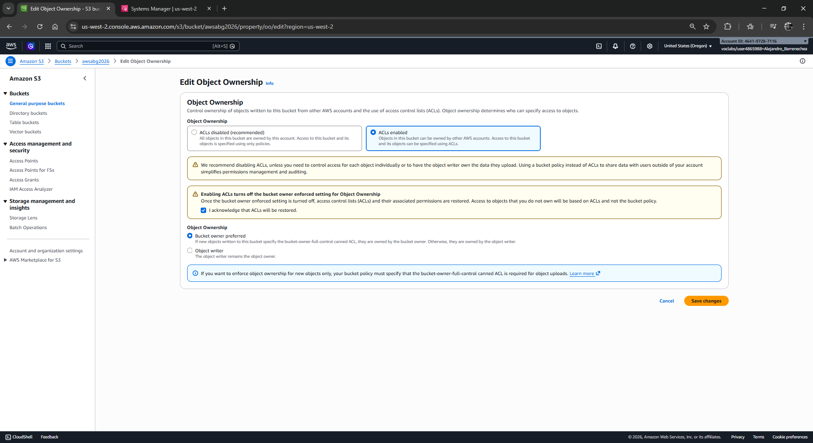
</p>

### ➏ Extracción de archivos del sitio
1.  **Regresa** a la terminal SSH y ejecuta:
    ```bash
    cd ~/sysops-activity-files
    tar xvzf static-website-v2.tar.gz
    cd static-website
    ls
    ```
2.  **Confirma** que ves el archivo `index.html` y las carpetas `css` e `images`.

<p align="center">
  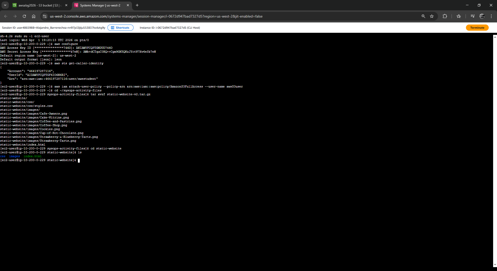
</p>

### ➐ Carga de archivos y configuración Web
1.  **Habilita** el bucket como sitio web:
    ```bash
    aws s3 website s3://<TU-NOMBRE-DE-BUCKET>/ --index-document index.html
    ```
2.  **Sube** los archivos con permisos de lectura pública:
    ```bash
    aws s3 cp /home/ec2-user/sysops-activity-files/static-website/ s3://<TU-NOMBRE-DE-BUCKET>/ --recursive --acl public-read
    ```
3.  **Verifica** la carga: `aws s3 ls <TU-NOMBRE-DE-BUCKET>`.

<p align="center">
  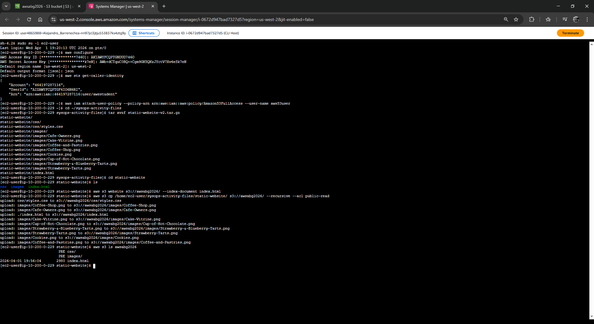
</p>

4.  **Busca** el "Bucket website endpoint" en la pestaña **Properties** (al final) y ábrelo en tu navegador.

<p align="center">
  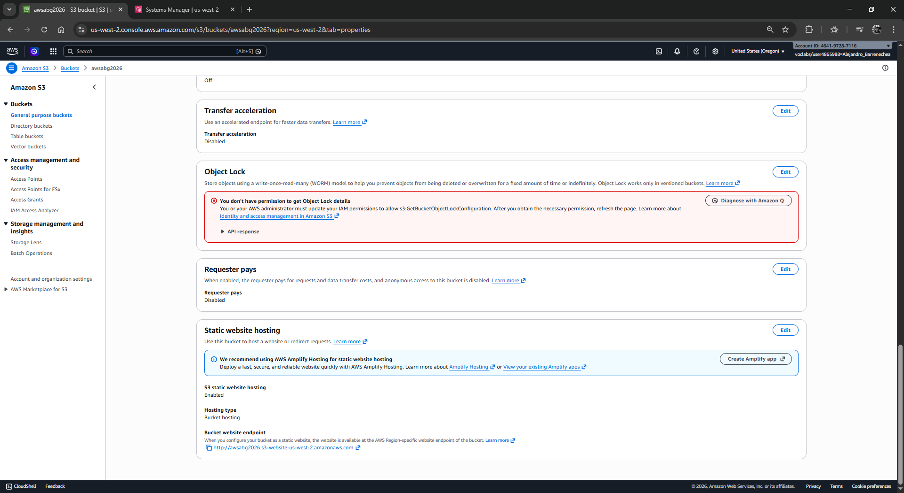
</p>
<p align="center">
  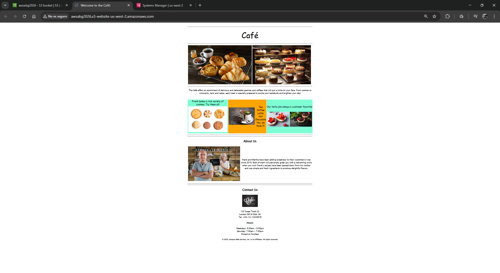
</p>

### ➑ Automatización con archivos Batch (Script)
1.  **Crea** un archivo vacío en tu directorio personal:
    ```bash
    cd ~
    touch update-website.sh
    ```
2.  **Abre** el archivo con el editor VI: `vi update-website.sh`.
3.  **Presiona** `i` e inserta el siguiente código (reemplaza con tu bucket):
    ```bash
    #!/bin/bash
    aws s3 cp /home/ec2-user/sysops-activity-files/static-website/ s3://<TU-NOMBRE-DE-BUCKET>/ --recursive --acl public-read
    ```
4.  **Guarda** y sal (`Esc`, luego `:wq`, `Enter`).

<p align="center">
  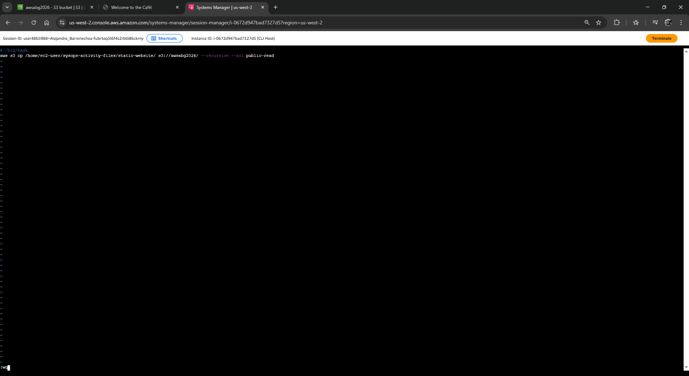
</p>

5.  **Otorga** permisos de ejecución: `chmod +x update-website.sh`.

<p align="center">
  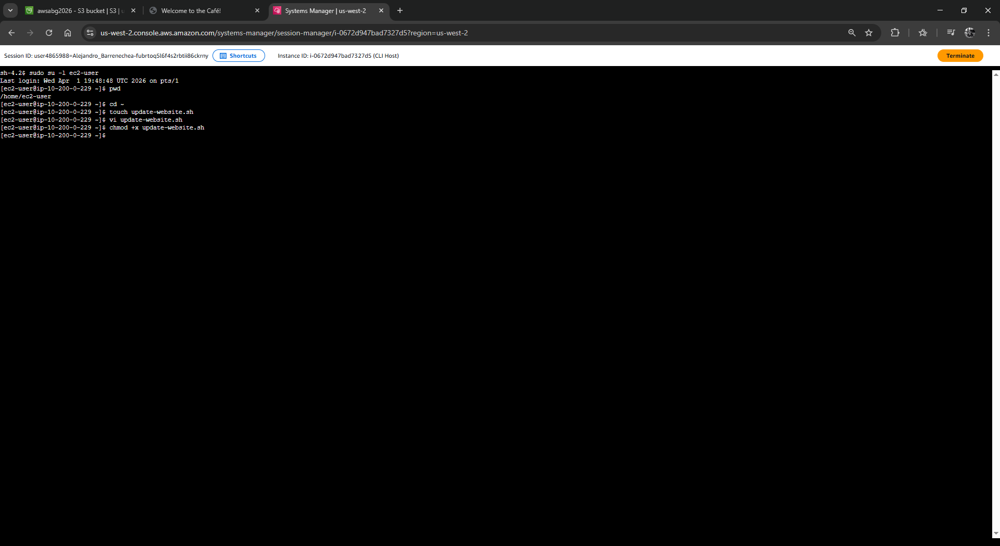
</p>

6.  **Edita** el HTML local: `vi sysops-activity-files/static-website/index.html`.
    *   Cambia los colores `bgcolor` según las instrucciones del lab (ej. "gainsboro" y "cornsilk").

<p align="center">
  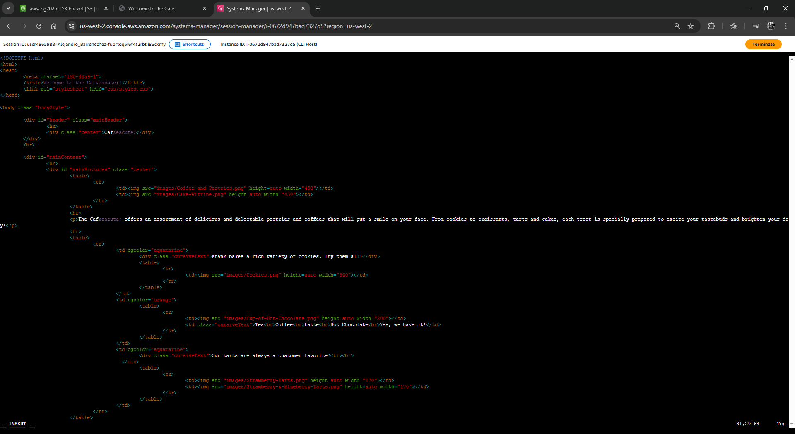
</p>
<p align="center">
  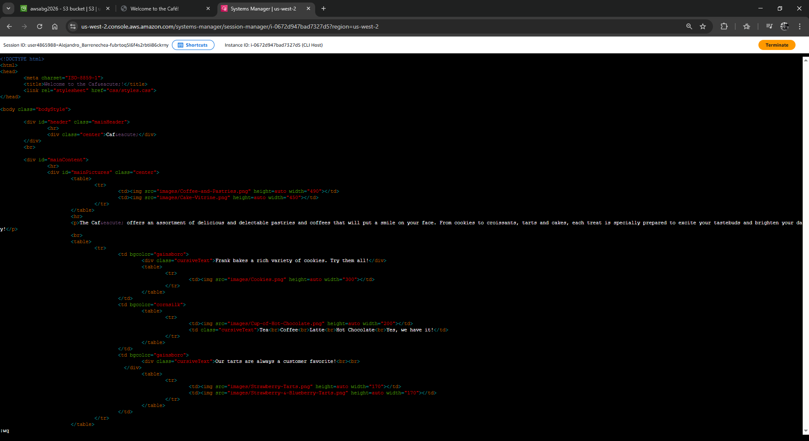
</p>

7.  **Ejecuta** tu script: `./update-website.sh`.

<p align="center">
  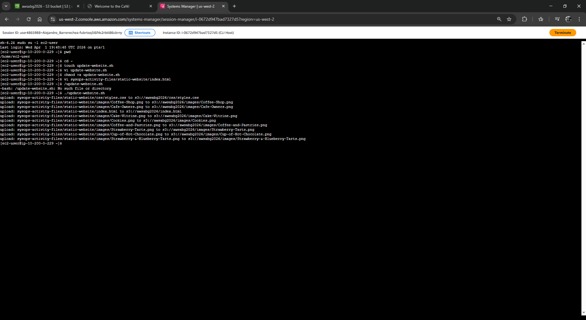
</p>

8.  **Refresca** la página web para ver los cambios aplicados.

<p align="center">
  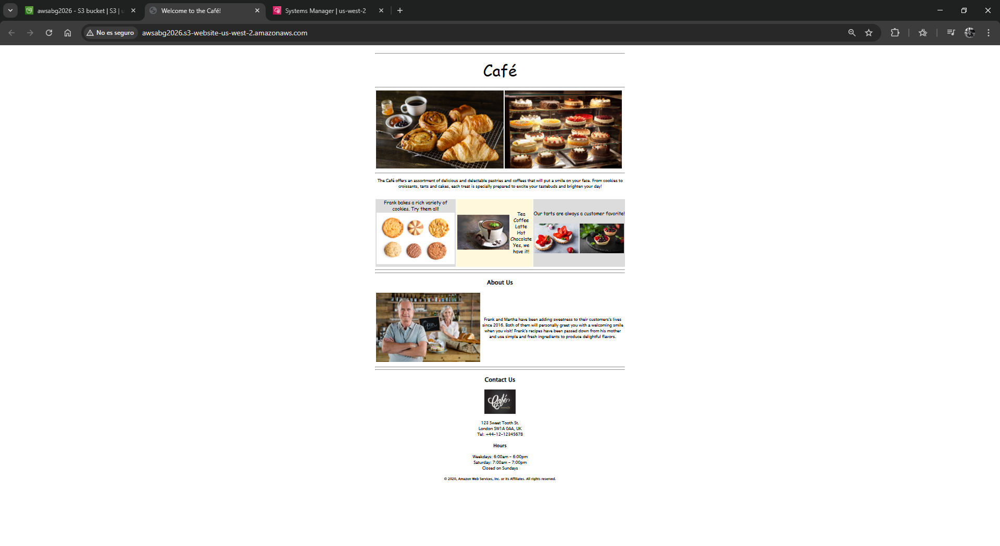
</p>

---

## 5. Respuestas Analíticas

**Pregunta del Desafío: ¿Cómo fue el comando `aws s3 sync` más eficiente que el comando `aws s3 cp`?**

**Respuesta:** El comando `aws s3 cp --recursive` carga todos los archivos al bucket sin importar si ya existen o si han sido modificados, lo que consume más tiempo y ancho de banda. Por el contrario, el comando `aws s3 sync` compara el origen y el destino basándose en el tamaño del archivo y la fecha de última modificación; por lo tanto, solo transfiere los archivos que han cambiado (en este caso, solo el `index.html`), haciendo el proceso mucho más rápido y eficiente.