# 🖥️ Lab 171: Creación de Instancias Amazon EC2 (Consola y CLI)
*   **Dificultad:** 🟡 Intermedia
*   **Tiempo Estimado:** ⏳ 45 minutos
*   **Servicios Principales:** 🖥️ **Amazon EC2**, 🛠️ **AWS CLI**, 🔐 **EC2 Instance Connect**, 📂 **Systems Manager (SSM)**.

## 1. Resumen y Objetivos
Este laboratorio práctico explora las múltiples metodologías para el aprovisionamiento de cómputo en AWS. Implementarás un **Bastion Host** (servidor de salto) mediante la Consola y automatizarás el despliegue de un **Web Server** funcional mediante la interfaz de línea de comandos (CLI). Además, aplicarás técnicas de **Troubleshooting** para corregir fallos de conectividad en entornos mal configurados.

**Competencias técnicas:**
*   🚀 Lanzamiento manual de instancias EC2.
*   🔌 Conectividad segura mediante EC2 Instance Connect.
*   🤖 Automatización programática vía AWS CLI y scripts de **User Data**.
*   🛠️ Diagnóstico y resolución de problemas de red y seguridad (Capa 3 y 4).

## 2. Análisis del Escenario
El diseño requiere una arquitectura de gestión segura. Se desplegará un **Bastion Host** en una subred pública para actuar como estación de trabajo administrativa. Desde este punto, el ingeniero debe interactuar con la API de Amazon EC2 para lanzar servidores web de forma consistente y escalable. Finalmente, se debe auditar una instancia preexistente (`Misconfigured Web Server`) para restablecer sus servicios de administración y visualización web.

## 3. Arquitectura
*   **VPC de Laboratorio:** Red segmentada con subredes públicas.
*   **Bastion Host:** Estación de administración con un **IAM Role** (`Bastion-Role`) adjunto para permisos de API.
*   **Web Server:** Instancia configurada dinámicamente con Apache.
*   **Seguridad:** Firewalls virtuales (**Security Groups**) gestionando puertos 22 (SSH) y 80 (HTTP).

<p align="center">
  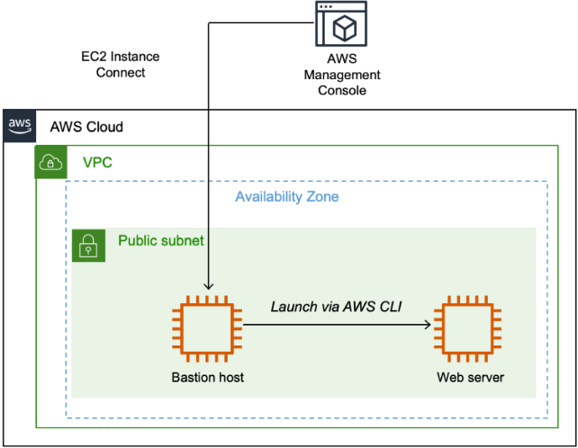
</p>

---

## 4. Desarrollo de las Tareas Paso a Paso

### ➊ Lanzamiento del Bastion Host (Consola de AWS)
1.  **Navega** al servicio **EC2** y haz clic en **Launch instance**.
2.  **Configura** los parámetros:
    *   **Name:** `Bastion host`.
    *   **AMI:** Amazon Linux 2.
    *   **Instance type:** `t3.micro`.
    *   **Key pair:** Selecciona **Proceed without key pair**.
3.  **Configura** los **Network settings**:
    *   **VPC:** `Lab VPC`.
    *   **Subnet:** `Public Subnet`.
    *   **Auto-assign public IP:** `Enable`.
    *   **Security group:** Crea uno llamado `Bastion security group` con permiso para **SSH (Puerto 22)**.
4.  **Despliega** la sección **Advanced details**:
    *   **IAM instance profile:** Selecciona `Bastion-Role`.
5.  **Ejecuta** el lanzamiento haciendo clic en **Launch instance**.

<p align="center">
  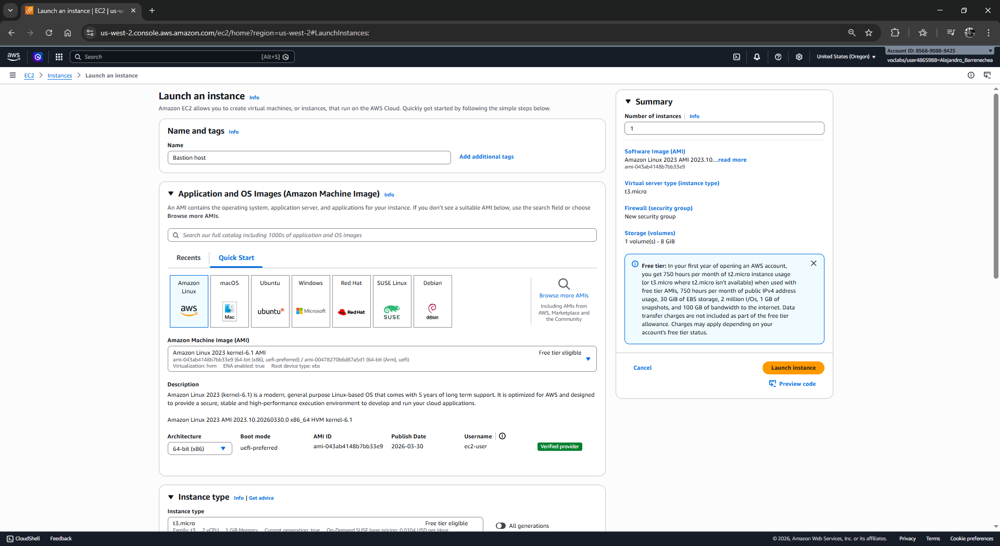
</p>
<p align="center">
  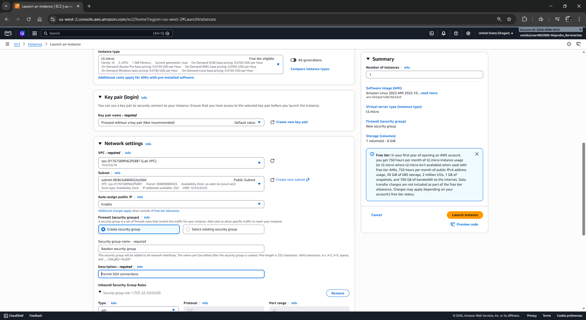
</p>
<p align="center">
  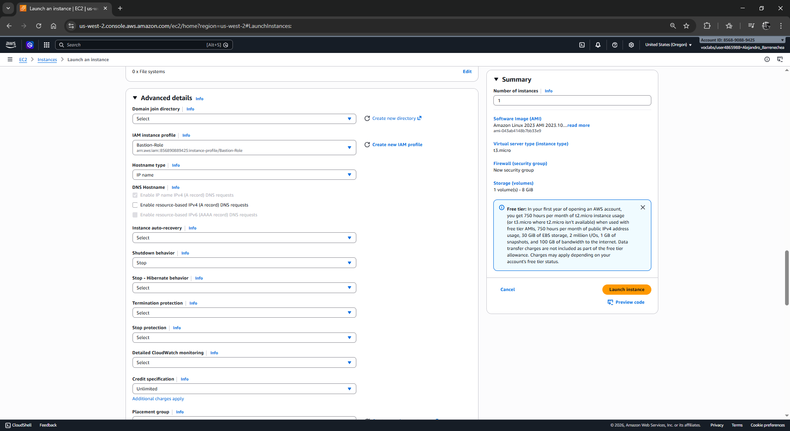
</p>
<p align="center">
  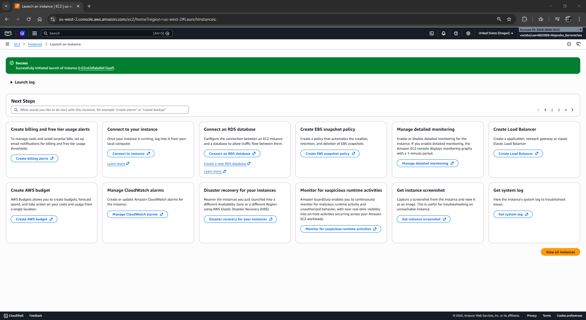
</p>

### ➋ Conexión al Host mediante EC2 Instance Connect
1.  **Selecciona** tu instancia `Bastion host` en la lista.
2.  **Haz clic** en **Connect**.
3.  **Usa** la pestaña **EC2 Instance Connect** y presiona **Connect**. Se abrirá una terminal en una nueva pestaña del navegador.

<p align="center">
  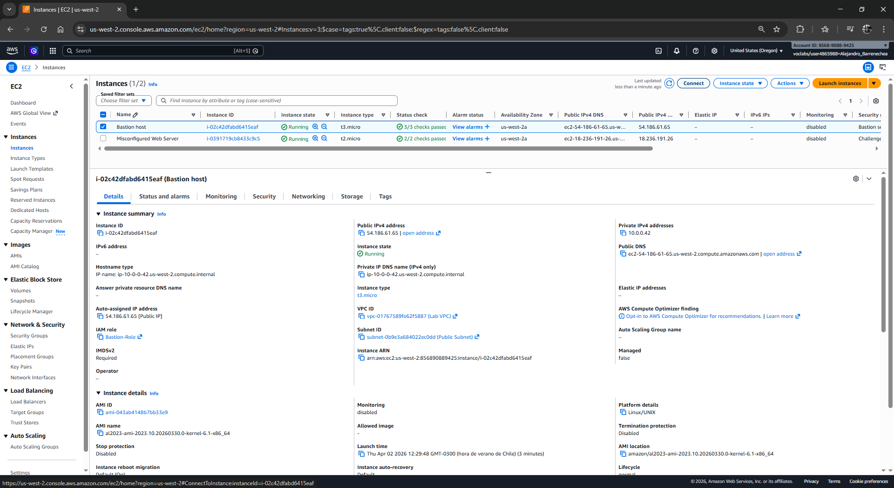
</p>
<p align="center">
  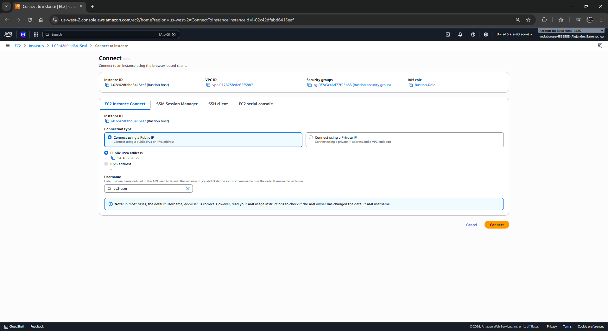
</p>
<p align="center">
  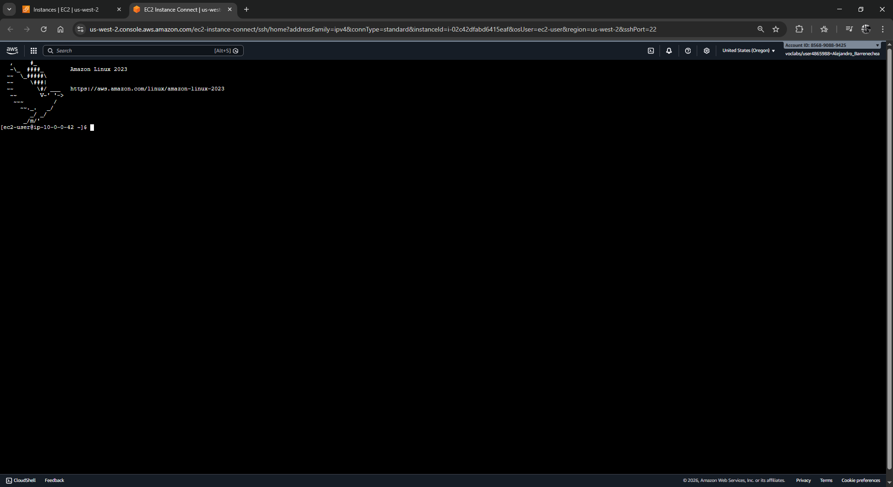
</p>

### ➌ Lanzamiento del Web Server mediante AWS CLI (Automatización)
Dentro de la terminal del Bastion, ejecuta los siguientes comandos técnicos:

1.  **Recupera** la AMI más reciente y configura la región:
    ```bash
    AZ=`curl -s http://169.254.169.254/latest/meta-data/placement/availability-zone`
    export AWS_DEFAULT_REGION=${AZ::-1}
    AMI=$(aws ssm get-parameters --names /aws/service/ami-amazon-linux-latest/amzn2-ami-hvm-x86_64-gp2 --query 'Parameters[0].[Value]' --output text)
    ```
2.  **Identifica** los IDs de red necesarios:
    ```bash
    SUBNET=$(aws ec2 describe-subnets --filters 'Name=tag:Name,Values=Public Subnet' --query Subnets[].SubnetId --output text)
    SG=$(aws ec2 describe-security-groups --filters Name=group-name,Values=WebSecurityGroup --query SecurityGroups[].GroupId --output text)
    ```

<p align="center">
  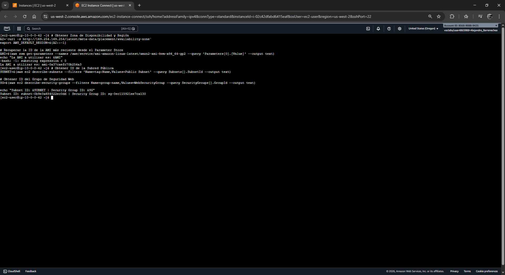
</p>

3.  **Descarga** el script de instalación (User Data):
    ```bash
    wget https://aws-tc-largeobjects.s3.us-west-2.amazonaws.com/CUR-TF-100-RSJAWS-1-23732/171-lab-JAWS-create-ec2/s3/UserData.txt
    ```
4.  **Ejecuta** el lanzamiento de la instancia:
    ```bash
    INSTANCE=$(aws ec2 run-instances --image-id $AMI --subnet-id $SUBNET --security-group-ids $SG --user-data file:///home/ec2-user/UserData.txt --instance-type t3.micro --tag-specifications 'ResourceType=instance,Tags=[{Key=Name,Value=Web Server}]' --query 'Instances[*].InstanceId' --output text)
    ```
5.  **Verifica** el despliegue y obtén la URL:
    ```bash
    # Espera a que el estado sea "running"
    aws ec2 describe-instances --instance-ids $INSTANCE --query 'Reservations[].Instances[].State.Name' --output text
    # Obtén el DNS público
    aws ec2 describe-instances --instance-ids $INSTANCE --query Reservations[].Instances[].PublicDnsName --output text
    ```

<p align="center">
  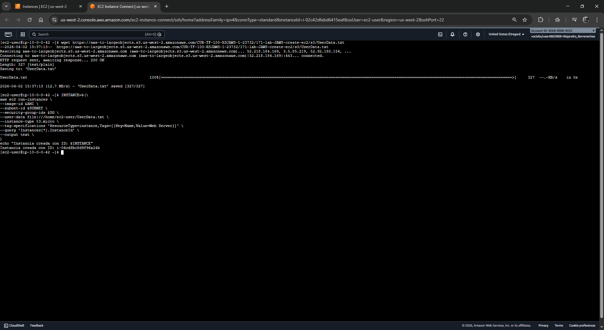
</p>
<p align="center">
  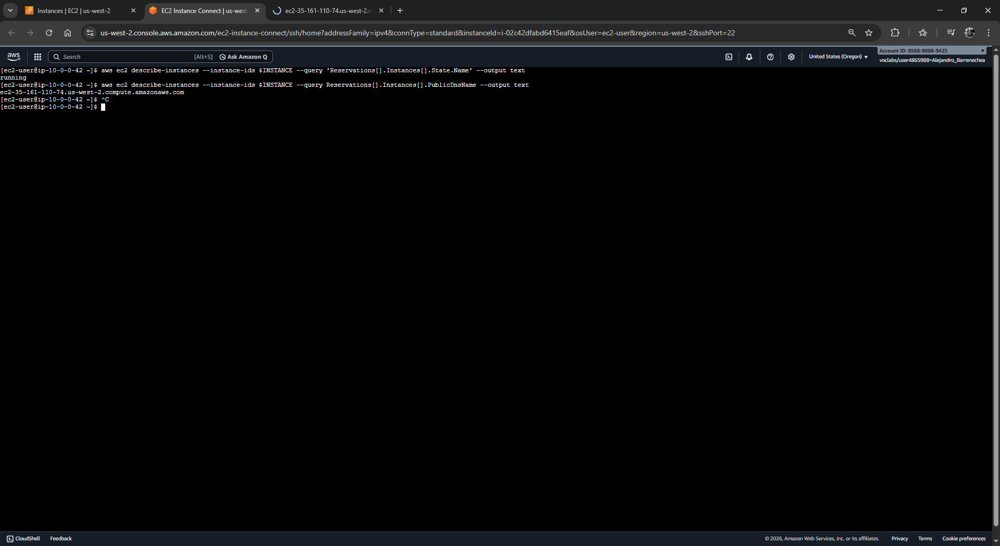
</p>

6.  **Pega** el DNS en el navegador asegurándote de escribir `http://` al inicio (ej: `http://ec2-xx-xxx.compute.amazonaws.com`).

<p align="center">
  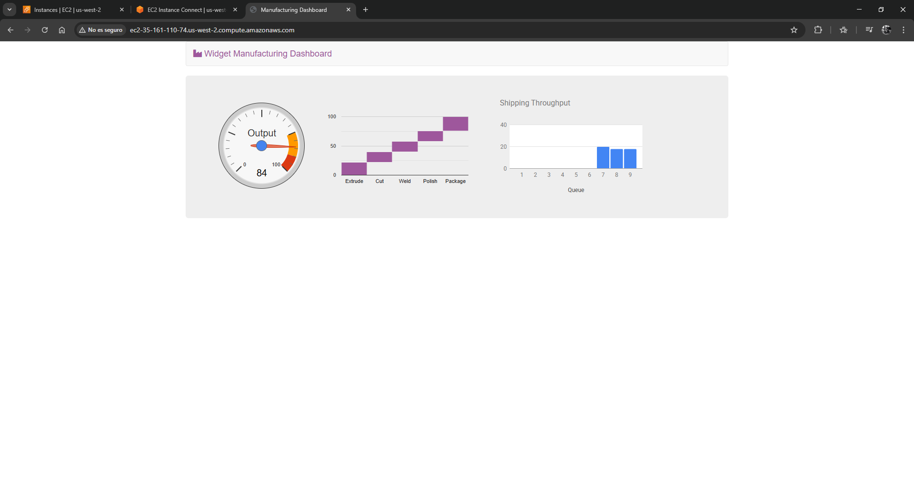
</p>

### ➍ Desafío Opcional 1: Diagnóstico de Conexión (SSH)
1.  **Tarea:** Intenta conectar a la instancia `Misconfigured Web Server` vía Instance Connect.
2.  **Fallo detectado:** Error de *timeout* (Puerto 22 bloqueado).

<p align="center">
  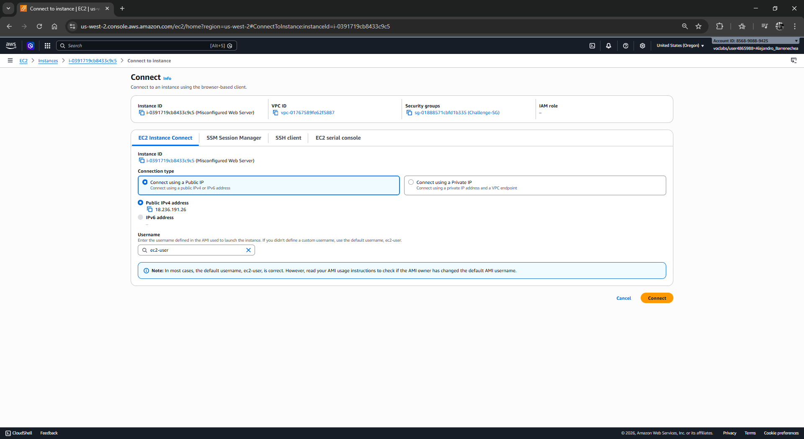
</p>
<p align="center">
  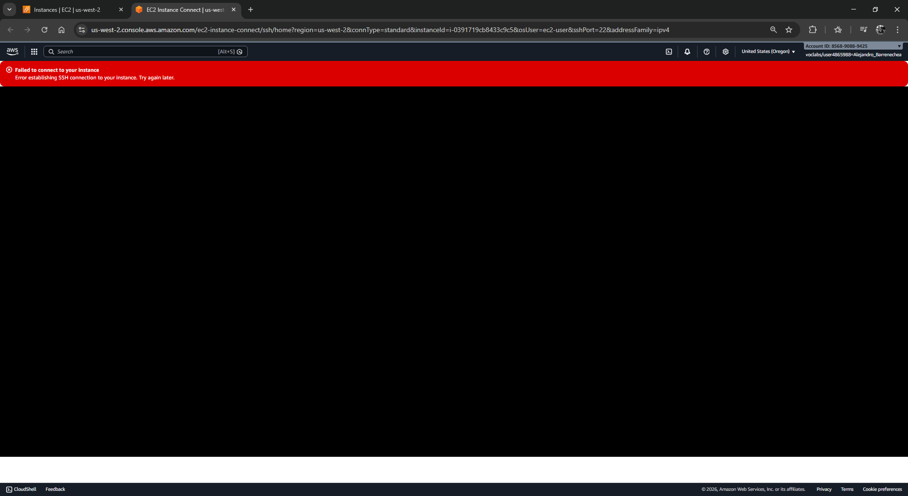
</p>

3.  **Solución:** 
    *   **Navega** a **Security Groups** en la consola de EC2.
    *   **Selecciona** el grupo asociado a esa instancia.
    *   **Agrega** una regla de entrada para **SSH (22)** desde `0.0.0.0/0`.
4.  **Resultado:** El botón "Connect" ahora establece sesión exitosamente.

<p align="center">
  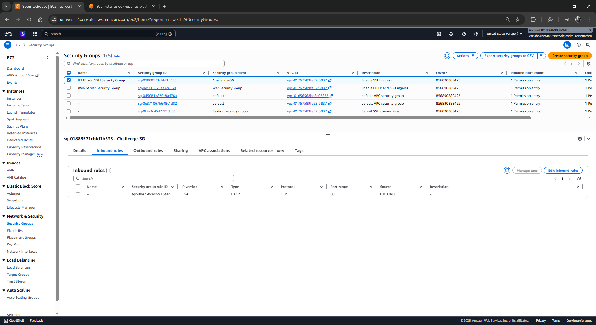
</p>
<p align="center">
  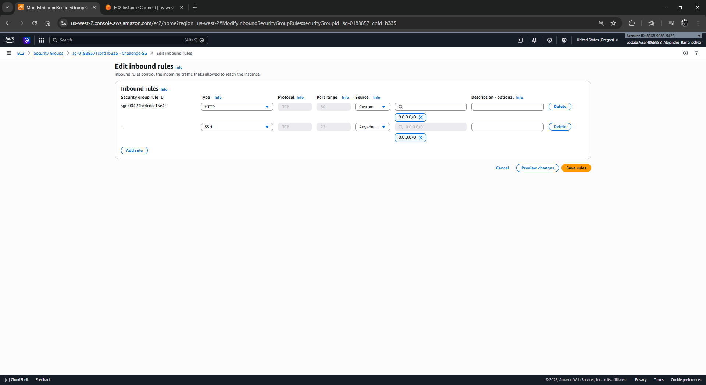
</p>
<p align="center">
  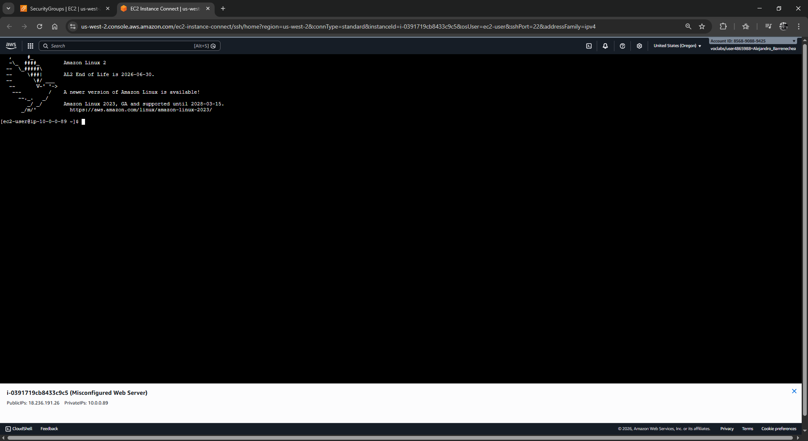
</p>

### ➎ Desafío Opcional 2: Diagnóstico de Instalación Web (HTTP)
1.  **Tarea:** Acceder a la URL pública de `Misconfigured Web Server`.
2.  **Fallo detectado:** El navegador no responde (Puerto 80 bloqueado o servicio apagado).

<p align="center">
  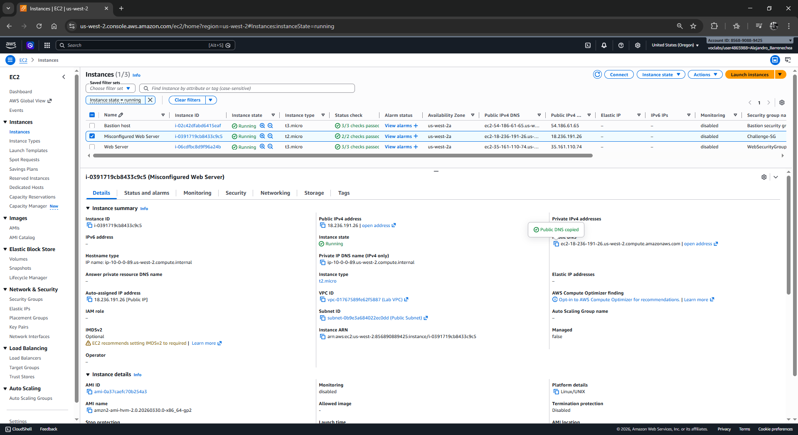
</p>
<p align="center">
  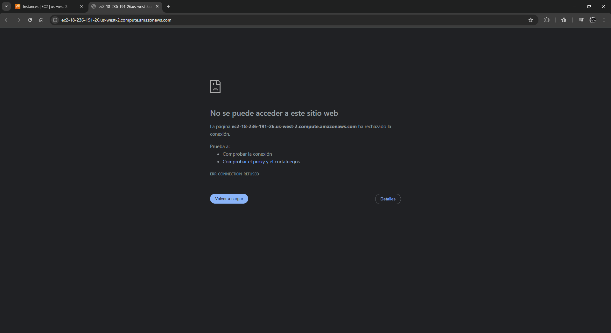
</p>

3.  **Solución:**
    *   **Agrega** una regla de entrada para **HTTP (80)** desde `0.0.0.0/0` en su Security Group.
    *   **Conéctate** a la instancia y verifica el servicio Apache:
        ```bash
        sudo systemctl start httpd
        sudo systemctl enable httpd
        ```
4.  **Resultado:** La página web del laboratorio carga correctamente.

<p align="center">
  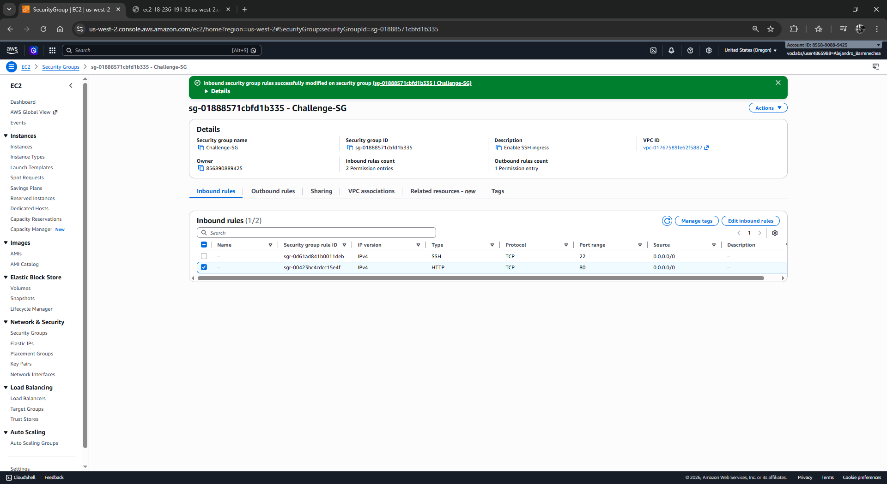
</p>
<p align="center">
  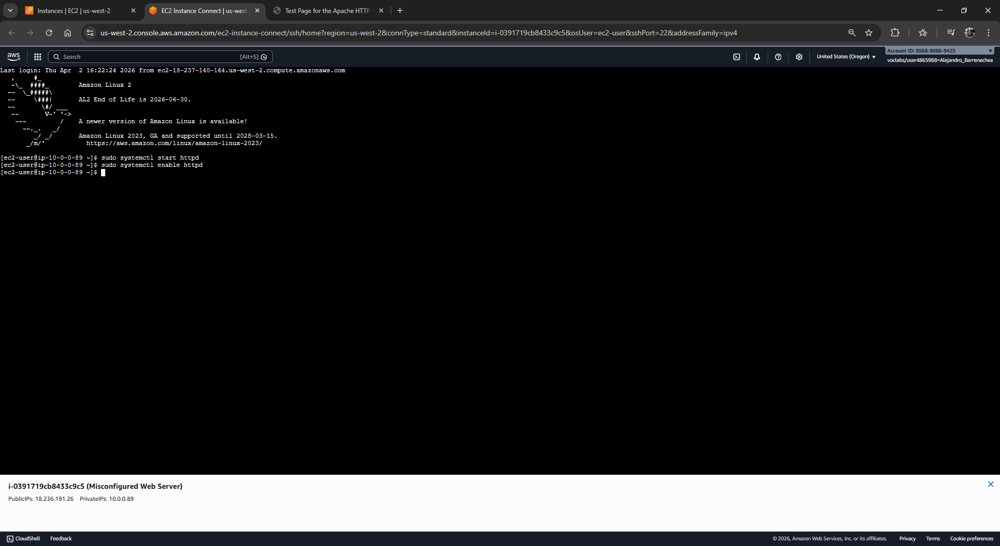
</p>
<p align="center">
  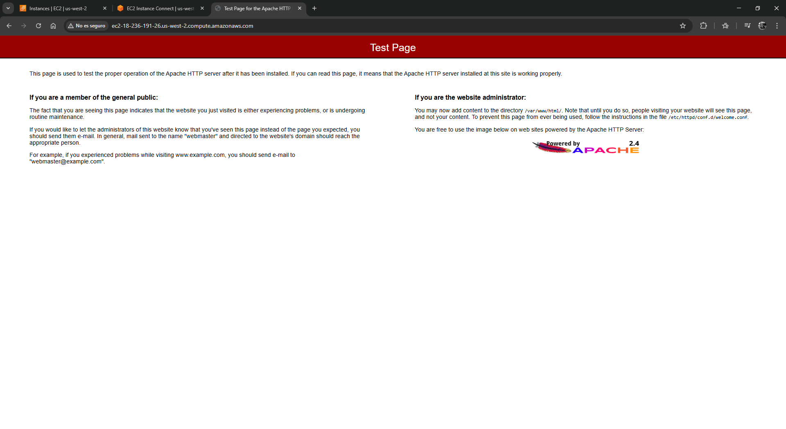
</p>

---

## 🧠 5. Respuestas Analíticas

### Comparativa de Métodos de Lanzamiento
*   **Management Console:** Se debe usar cuando se requiere lanzar una instancia única o temporal de forma rápida y visual.
*   **AWS CLI / Scripting:** Se debe usar cuando se requiere automatizar la creación de recursos de manera fiable, repetible y sin errores humanos.
*   **CloudFormation:** Se debe usar para lanzar infraestructuras completas (stacks) con múltiples recursos interconectados.

### Informe de Troubleshooting (Misconfigured Web Server)
1.  **¿Cuál era el problema?**
    *   Doble configuración errónea: El **Security Group** no permitía tráfico entrante por los puertos 22 (administración) ni 80 (visualización). Adicionalmente, el servicio `httpd` (Apache) no estaba en estado de ejecución.
2.  **¿Qué hiciste para solucionarlo?**
    *   Se auditaron y corrigieron las **Inbound Rules** del Security Group. Se intervino el sistema operativo mediante terminal para iniciar el servicio de servidor web manualmente.

---

## ✅ Conclusión
Has completado con éxito la gestión avanzada de instancias EC2. Has demostrado dominio en el lanzamiento manual, el uso de metadatos para automatización vía **CLI**, la implementación de **User Data** y, lo más importante, has desarrollado el criterio técnico para diagnosticar y resolver fallos de seguridad en la nube de AWS.