# 🌐 Lab 172: [Desafío] Ejercicio de instancias de Amazon EC2
*   **Dificultad:** ⭐⭐⭐ (Intermedia / Desafío)
*   **Tiempo Estimado:** ⏳ 45 minutos
*   **Servicios Principales:** 🛰️ **Amazon VPC**, 🖥️ **Amazon EC2**, 🛡️ **Security Groups**, 🌍 **Internet Gateway (IGW)**.

## 1. Resumen y Objetivos
Este laboratorio de desafío requiere la implementación de una pila tecnológica completa para una aplicación web estática. A diferencia de los laboratorios guiados, deberás construir los cimientos de red (VPC) y conectividad antes de desplegar el poder de cómputo.

**Objetivos del desafío:**
*   🛰️ **Diseñar** una red virtual aislada y personalizada.
*   🌍 **Habilitar** conectividad bidireccional con el Internet público.
*   🖥️ **Aprovisionar** una instancia de cómputo Amazon Linux optimizada.
*   📜 **Automatizar** la configuración del servidor web mediante scripts de arranque.
*   🚀 **Desplegar** contenido personalizado y verificar la alta disponibilidad.

## 2. Análisis del Escenario
El diagnóstico técnico indica que la aplicación requiere un entorno "VPC-Only" para garantizar el aislamiento. El éxito del despliegue depende de tres factores críticos: la correcta asociación del **Internet Gateway** a la tabla de rutas, la asignación de una **IP pública dinámica** y la ejecución impecable del script de **User Data** para evitar configuraciones manuales post-lanzamiento.

## 3. Arquitectura
*   **VPC:** `10.0.0.0/16`.
*   **Subred Pública:** `10.0.1.0/24`.
*   **Enrutamiento:** Tabla de rutas con destino `0.0.0.0/0` hacia el IGW.
*   **Instancia:** Amazon Linux (t3.micro) con almacenamiento General Purpose SSD (gp2).

---

## 4. Desarrollo de las Tareas Paso a Paso

### ➊ Fase de Red: Creación de la VPC y Conectividad
1.  **Navega** al servicio **VPC** desde la consola de AWS.
2.  **Haz clic** en **Create VPC**. Selecciona la opción **VPC only**.
    *   **Name tag:** `Challenge-VPC`.
    *   **IPv4 CIDR block:** `10.0.0.0/16`.
    *   **Haz clic** en **Create VPC**.

<p align="center">
  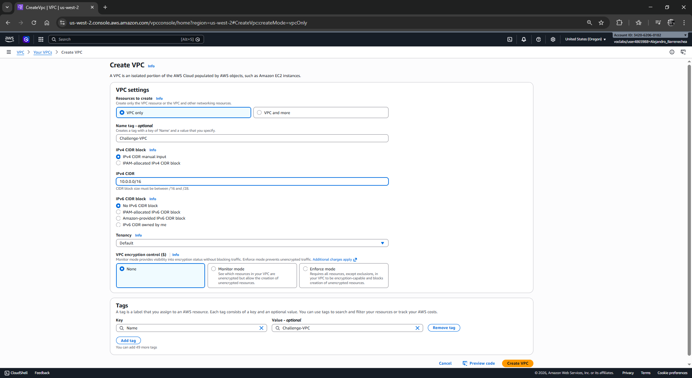
</p>

3.  **Crea** la Subred: En el panel izquierdo, selecciona **Subnets** -> **Create subnet**.
    *   **VPC ID:** Selecciona `Challenge-VPC`.
    *   **Subnet name:** `Public-Subnet-Challenge`.
    *   **IPv4 CIDR block:** `10.0.1.0/24`.
    *   **Haz clic** en **Create subnet**.

<p align="center">
  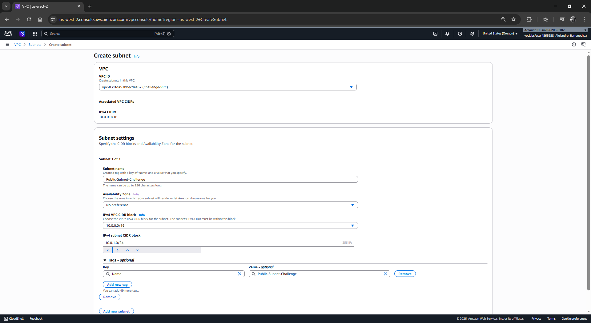
</p>

4.  **Crea** el Internet Gateway: Selecciona **Internet gateways** -> **Create internet gateway**.
    *   **Name tag:** `Challenge-IGW`.
    *   **Haz clic** en **Create internet gateway**.
    *   **Selecciona** el IGW recién creado, haz clic en **Actions** -> **Attach to VPC** y elige tu `Challenge-VPC`.

<p align="center">
  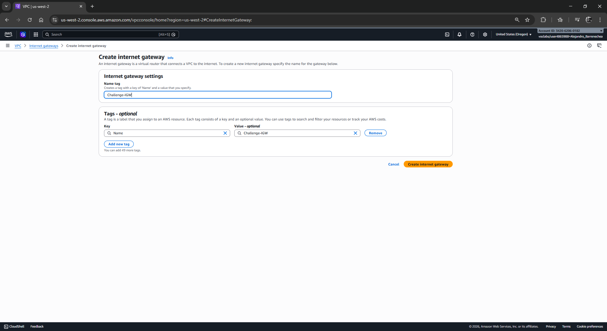
</p>
<p align="center">
  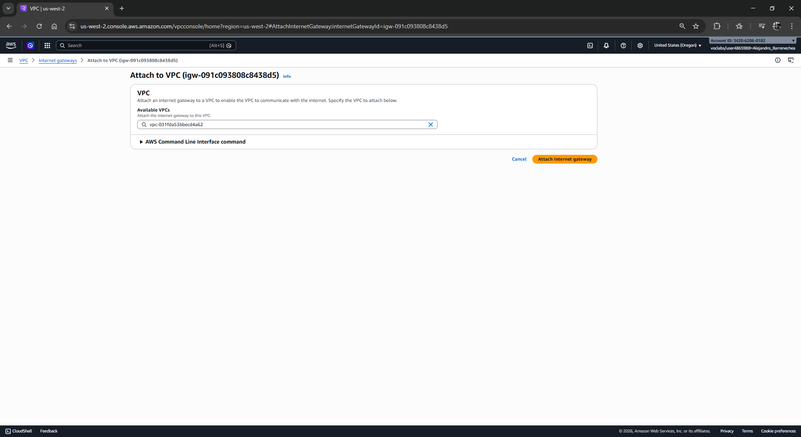
</p>

5.  **Configura** la Tabla de Rutas: Selecciona **Route tables**. Busca la tabla asociada a tu `Challenge-VPC`.
    *   **Haz clic** en el ID de la tabla -> pestaña **Routes** -> **Edit routes**.
    *   **Añade una ruta:** Destination `0.0.0.0/0` | Target: `Internet Gateway` -> Selecciona `Challenge-IGW`.
    *   **Guarda** los cambios.

<p align="center">
  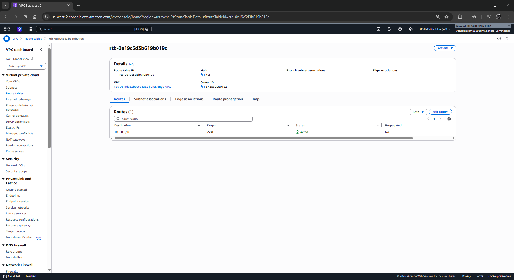
</p>
<p align="center">
  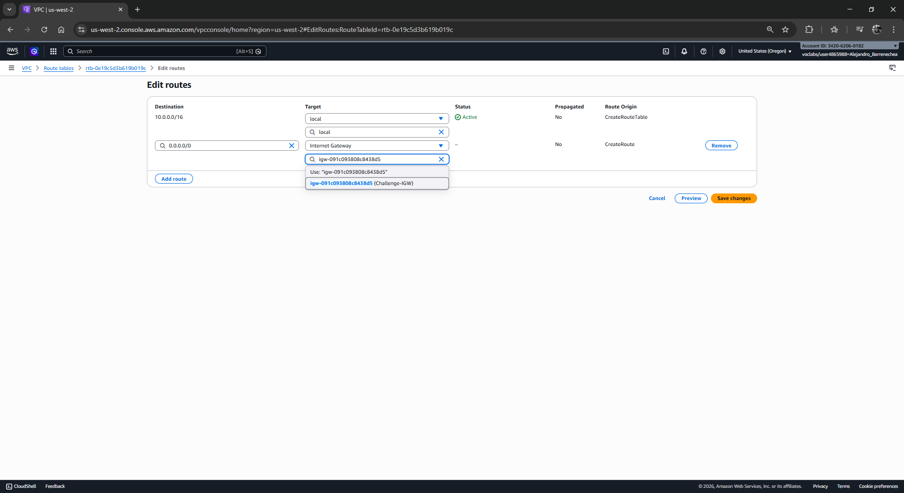
</p>

### ➋ Fase de Cómputo: Lanzamiento de la Instancia EC2
1.  **Navega** al servicio **EC2** y haz clic en **Launch instance**.
2.  **Nombre y Etiquetas:** Escribe `Web-Server-Challenge`.
3.  **Imagen (AMI):** Selecciona **Amazon Linux 2023** (o Amazon Linux 2).
4.  **Tipo de Instancia:** Busca y selecciona **t3.micro**.

<p align="center">
  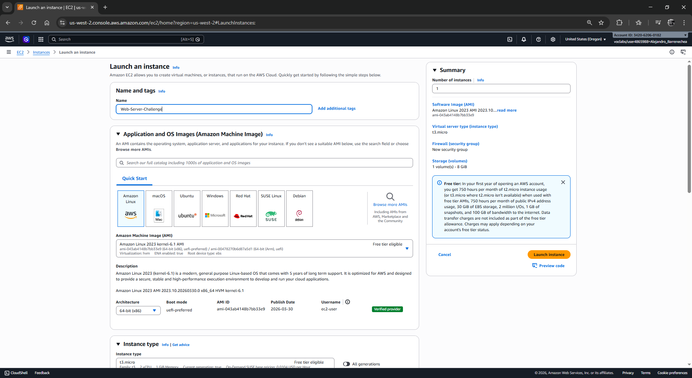
</p>

5.  **Key pair (Login):** Selecciona **Proceed without a key pair (Not recommended)**.
6.  **Network settings (Configuración de red):** Haz clic en **Edit**.
    *   **VPC:** Selecciona `Challenge-VPC`.
    *   **Subnet:** Selecciona `Public-Subnet-Challenge`.
    *   **Auto-assign public IP:** Cambia a **Enable**.
    *   **Security group:** Selecciona **Create security group**.
        *   **Security group name:** `Web-Challenge-SG`.
        *   **Regla SSH:** Permite puerto 22 desde `Anywhere (0.0.0.0/0)`.
        *   **Regla HTTP:** Haz clic en **Add security group rule**, selecciona **HTTP** (puerto 80) desde `Anywhere (0.0.0.0/0)`.

<p align="center">
  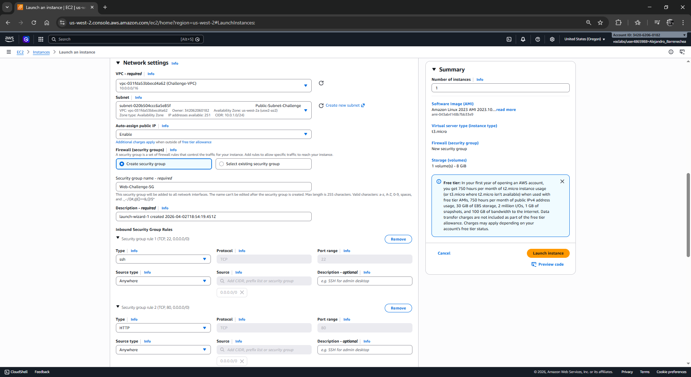
</p>

7.  **Almacenamiento:** Mantén 8 GiB de tipo **gp2**.

<p align="center">
  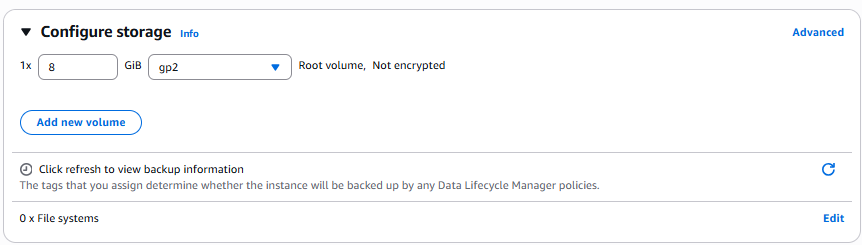
</p>

8.  **Detalles Avanzados (User Data):** Despliega **Advanced details**, ve al final y **pega** el siguiente script:
    ```bash
    #!/bin/bash
    yum update -y
    yum install -y httpd
    systemctl start httpd
    systemctl enable httpd
    # Ajuste de permisos para ec2-user
    chown -R ec2-user:ec2-user /var/www/html
    chmod -R 775 /var/www/html
    ```
9.  **Haz clic** en **Launch instance**.

<p align="center">
  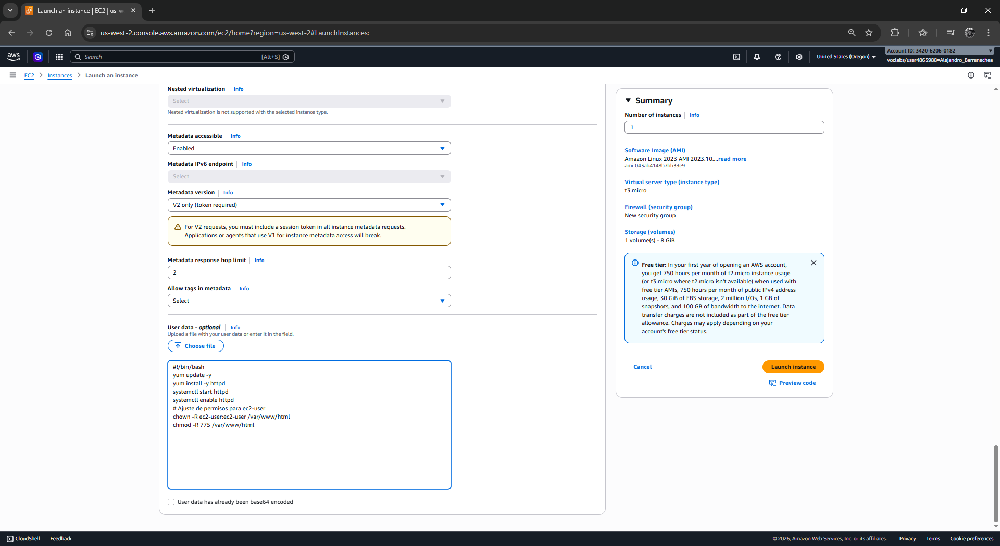
</p>

### ➌ Fase de Aplicación: Despliegue de Contenido
1.  **Espera** a que el estado sea `Running` y los "Status Checks" sean `2/2 passed`.
2.  **Selecciona** la instancia y haz clic en el botón superior **Connect**.

<p align="center">
  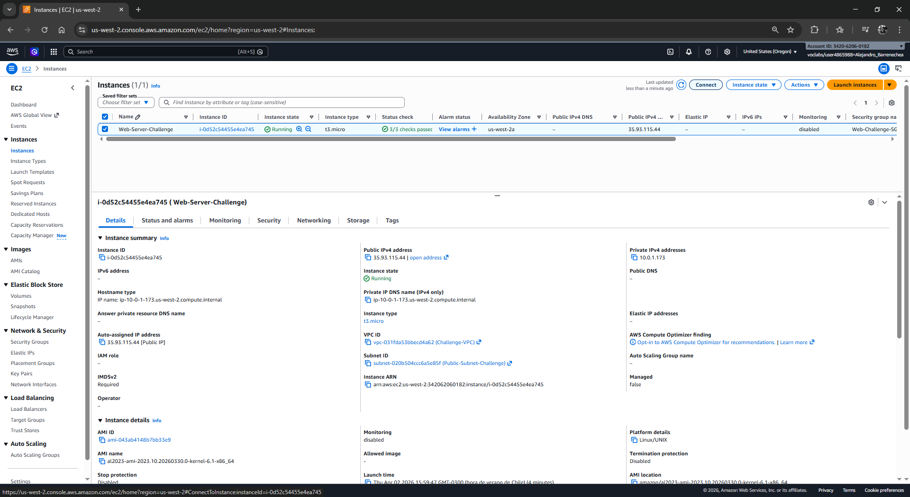
</p>

3.  **Usa** la pestaña **EC2 Instance Connect** y haz clic en **Connect**.

<p align="center">
  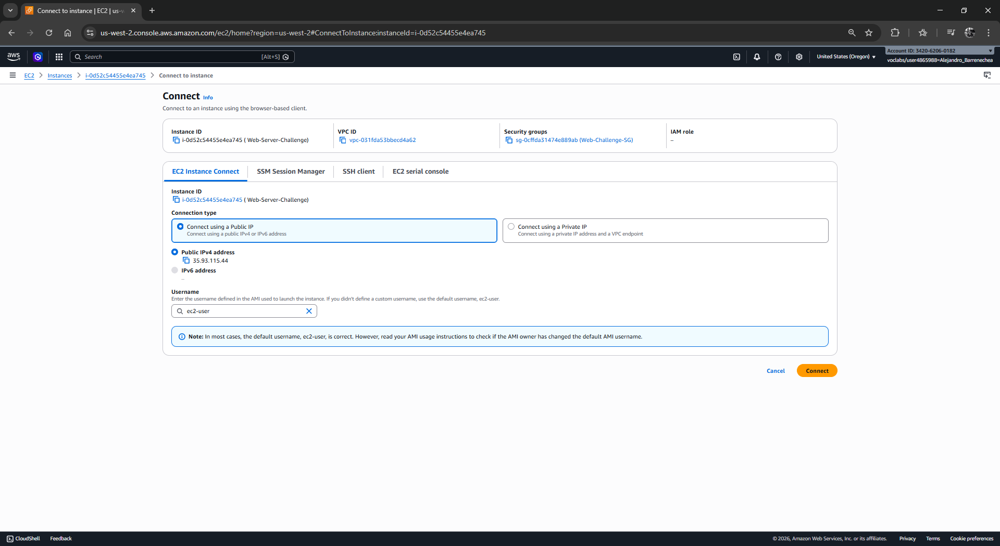
</p>

4.  **Crea** el archivo del proyecto mediante el editor `vi`:
    ```bash
    vi /var/www/html/projects.html
    ```
5.  **Presiona** la tecla `i` e inserta el siguiente código HTML (personaliza con tu nombre):
    ```html
    <!DOCTYPE html>
    <html>
    <body>
    <h1>Trabajo del Proyecto re/Start de [TU-NOMBRE]</h1>
    <p>EC2 Instance Challenge Lab</p>
    </body>
    </html>
    ```
6.  **Presiona** `Esc`, escribe `:wq` y presiona `Enter`.

<p align="center">
  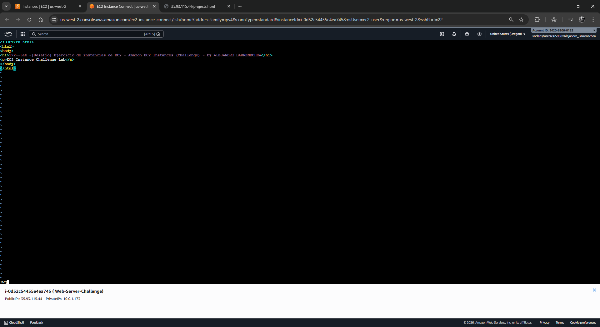
</p>

### ➍ Fase de Verificación y Evidencia
1.  **Copia** la **Public IPv4 address** de tu instancia desde la consola EC2.
2.  **Abre** una nueva pestaña en tu navegador y navega a: `http://<TU-IP-PUBLICA>/projects.html`.
3.  **Captura de Pantalla 1:** Toma una imagen de tu página web funcionando.

<p align="center">
  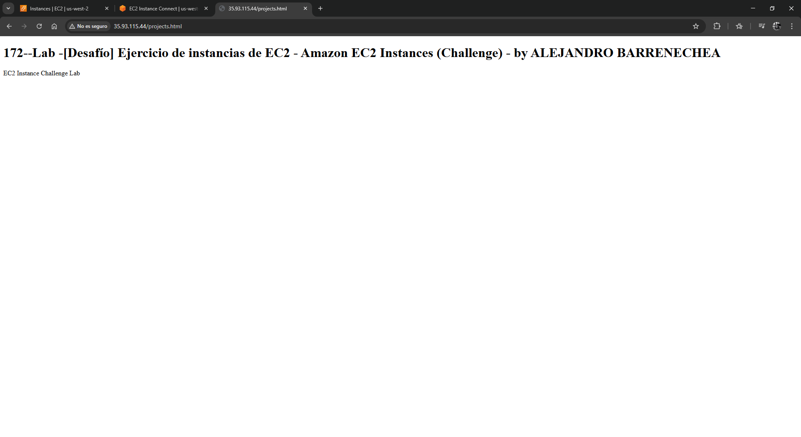
</p>

4.  **Captura de Pantalla 2 (System Log):** En la consola EC2, selecciona la instancia -> **Actions** -> **Monitor and troubleshoot** -> **Get system log**. Desliza hasta encontrar las líneas que confirman que `httpd` se inició correctamente.

<p align="center">
  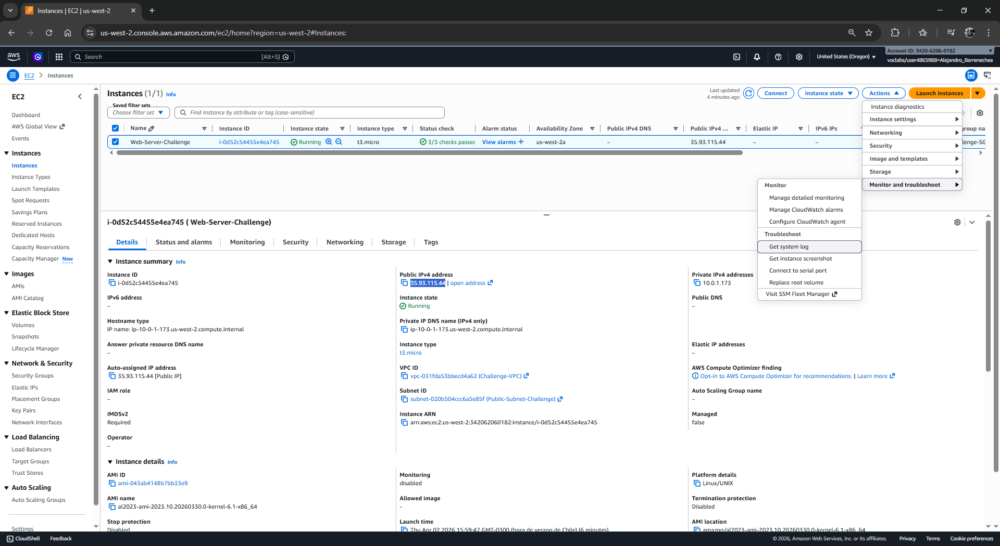
</p>
<p align="center">
  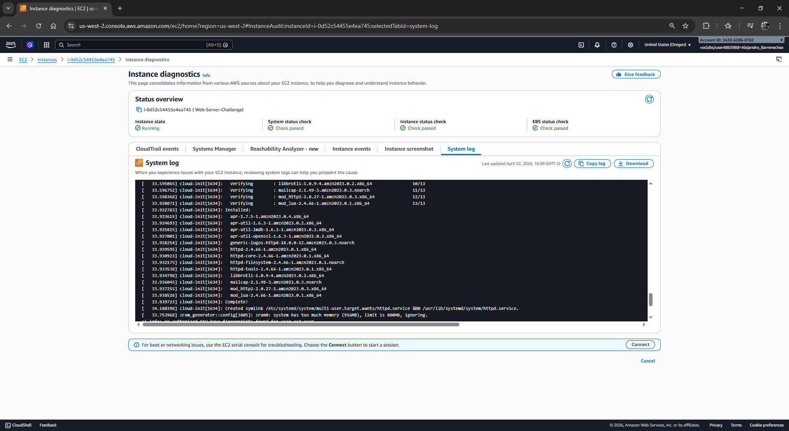
</p>

---

## 5. Respuestas Analíticas

**1. ¿Por qué se debe habilitar manualmente la "Auto-assign public IP" en este desafío?**
En una VPC creada manualmente (VPC Only), las subredes por defecto no asignan IPs públicas a las instancias para mantener la seguridad. Como este servidor debe ser accesible desde el navegador, es imperativo forzar esta asignación durante el lanzamiento para obtener una dirección ruteable en internet.

**2. ¿Cuál es la importancia del Internet Gateway (IGW) en la tabla de rutas?**
El IGW actúa como el puente entre la red privada de AWS y la red pública mundial. Sin la entrada `0.0.0.0/0` apuntando al IGW en la tabla de rutas, la instancia puede tener una IP pública, pero los paquetes de datos no sabrán cómo salir de la VPC ni cómo regresar, resultando en un error de "Connection Timeout".

**3. ¿Qué beneficio técnico aporta el uso de User Data en comparación con la instalación manual?**
El User Data garantiza la **idempotencia** y la **automatización**. Permite que la infraestructura esté lista para producir inmediatamente después del arranque, eliminando errores humanos en la consola y permitiendo que, en caso de fallo, se pueda lanzar una nueva instancia idéntica automáticamente (escalabilidad).