# 🛠️ Lab 173: [JAWS] Troubleshooting en la creación de instancias EC2
*   **Dificultad:** 🔴 Avanzada (Ingeniería de Sistemas)
*   **Tiempo Estimado:** ⏳ 45 minutos
*   **Servicios Principales:** 🖥️ **Amazon EC2**, ⚙️ **AWS CLI**, 🔍 **Cloud-init**, 🛡️ **Security Groups**, 🗄️ **MariaDB**.

## 1. Resumen y Objetivos
En esta actividad, actuarás como un Ingeniero de SysOps Senior encargado de desplegar y reparar la infraestructura del "Café". Utilizarás un stack **LAMP** (Linux, Apache, MariaDB, PHP) orquestado mediante scripts de Bash y AWS CLI. El objetivo es identificar fallos críticos de configuración que impiden el despliegue automático y asegurar la integridad de la base de datos.

**Objetivos técnicos:**
*   🚀 **Lanzar** instancias EC2 mediante comandos programáticos de AWS CLI.
*   🛠️ **Depurar** errores de lógica regional y de red en scripts de automatización.
*   🌐 **Diagnosticar** conectividad mediante `nmap` y pruebas de `curl` (IP Pública vs. Privada).
*   🗄️ **Validar** la persistencia de datos mediante la inspección directa de MariaDB y logs de `cloud-init`.

## 2. Análisis del Escenario
El equipo de desarrollo ha entregado un script de automatización (`create-lamp-instance-v2.sh`) con errores de diseño intencionales. El diagnóstico inicial revela una **discrepancia regional** (AMI no encontrada) y una **discrepancia de firewall** (puerto incorrecto). Tu misión es aplicar ingeniería inversa al script, limpiar el entorno de recursos huérfanos y garantizar que el "Café" sea accesible globalmente.

## 3. Arquitectura
*   💻 **CLI Host:** Servidor administrativo para el control de la API de AWS.
*   ☕ **Cafe Server:** Instancia de producción (LAMP) con base de datos relacional integrada.
*   🛡️ **Seguridad:** Network ACLs y Security Groups configurados para el tráfico web (Puerto 80).

<p align="center">
  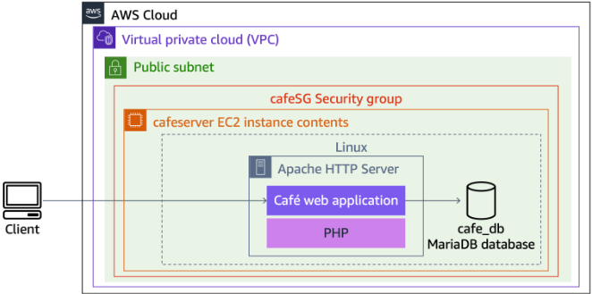
</p>

---

## 4. Desarrollo de las Tareas Paso a Paso

### ➊ Configuración del Entorno Administrativo
1.  **Conéctate** a la instancia `CLI Host` mediante **EC2 Instance Connect**.

<p align="center">
  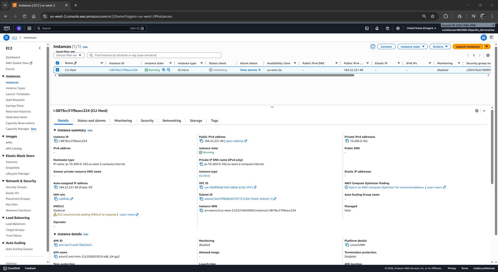
</p>
<p align="center">
  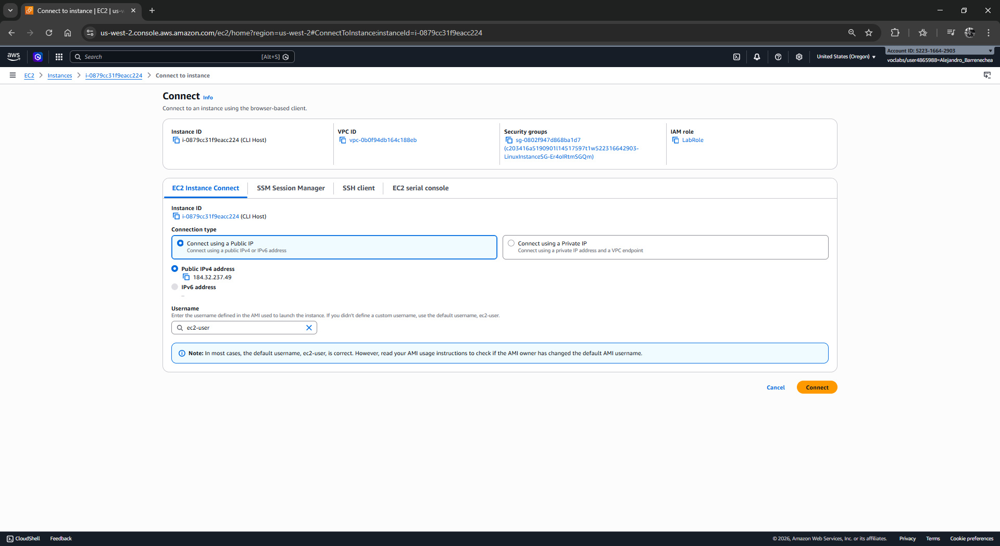
</p>

2.  **Configura** la terminal con tus credenciales de laboratorio:
    ```bash
    aws configure
    ```
    *   **Access Key / Secret Key:** Obtén los valores desde el botón **Details**.
    *   **Default region:** Usa tu `LabRegion`.
    *   **Output format:** `json`.

<p align="center">
  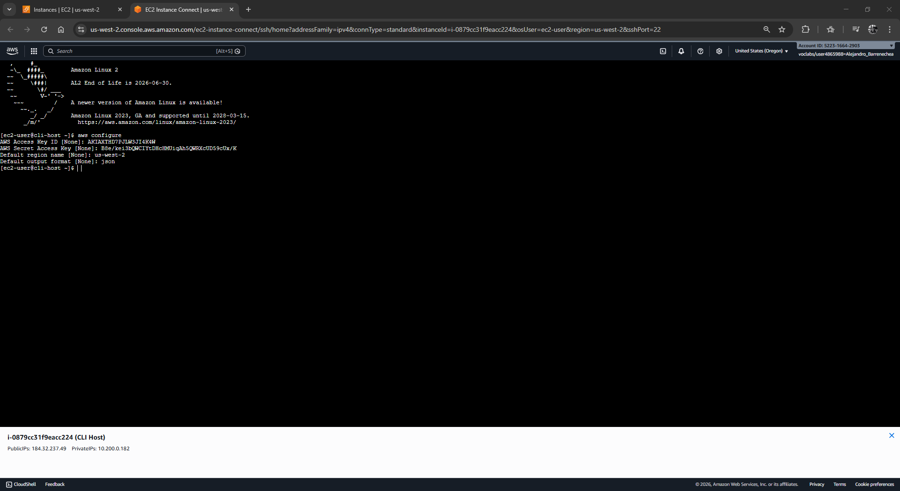
</p>

### ➋ Auditoría y Reparación del Script (Troubleshooting)
1.  **Navega** al directorio de trabajo y **crea** un respaldo:
    ```bash
    cd ~/sysops-activity-files/starters
    cp create-lamp-instance-v2.sh create-lamp-instance.backup
    ```

<p align="center">
  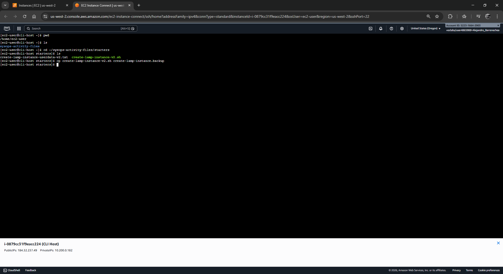
</p>
<p align="center">
  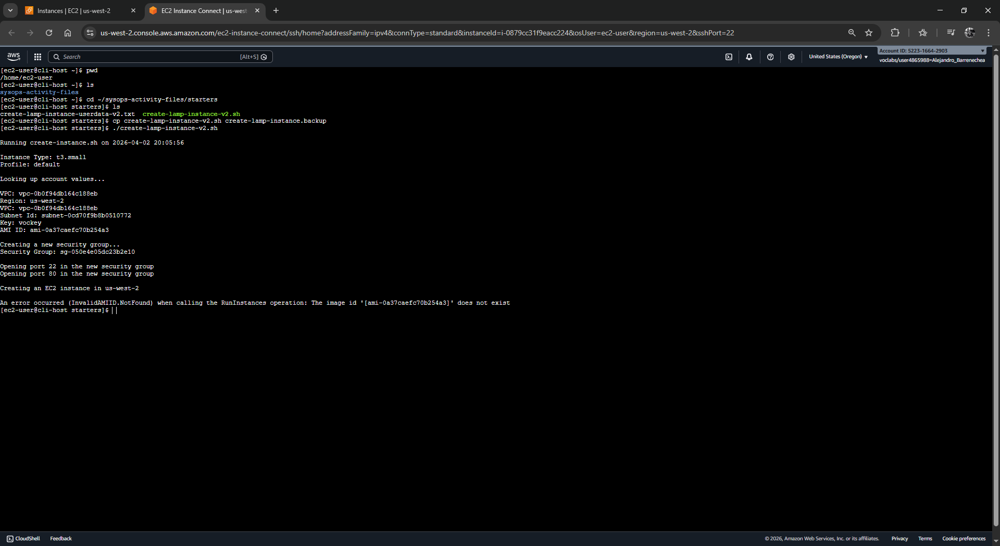
</p>

2.  **Edita** el archivo con `vi create-lamp-instance-v2.sh` y **aplica** los siguientes parches técnicos:

#### 🛠️ Parche 1: Corrección de Puerto Web (Línea ~150)
*   **Localiza** la regla de entrada del Security Group.
*   **Cambia** `--port 8080` por `--port 80`.
    *   *Razón:* El servidor Apache escucha por defecto en el puerto 80.

#### 🛠️ Parche 2: Corrección de Consistencia Regional (Línea ~158)
*   **Localiza** el comando `aws ec2 run-instances`.
*   **Cambia** el parámetro estático `--region us-east-1` por la variable dinámica `--region $region`.
    *   *Razón:* Las AMIs son recursos regionales y deben coincidir con la región de lanzamiento.

3.  **Guarda** los cambios con `:wq`.

<p align="center">
  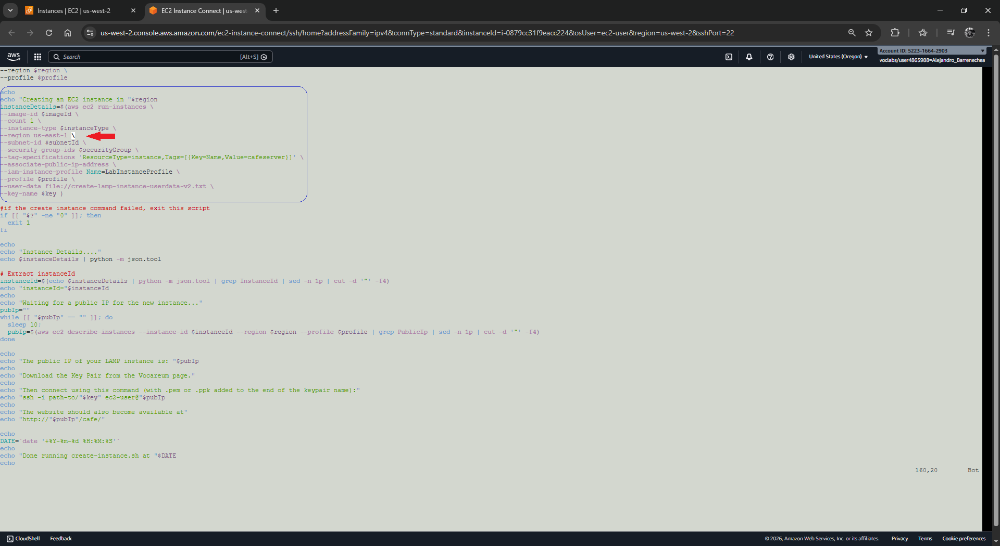
</p>
<p align="center">
  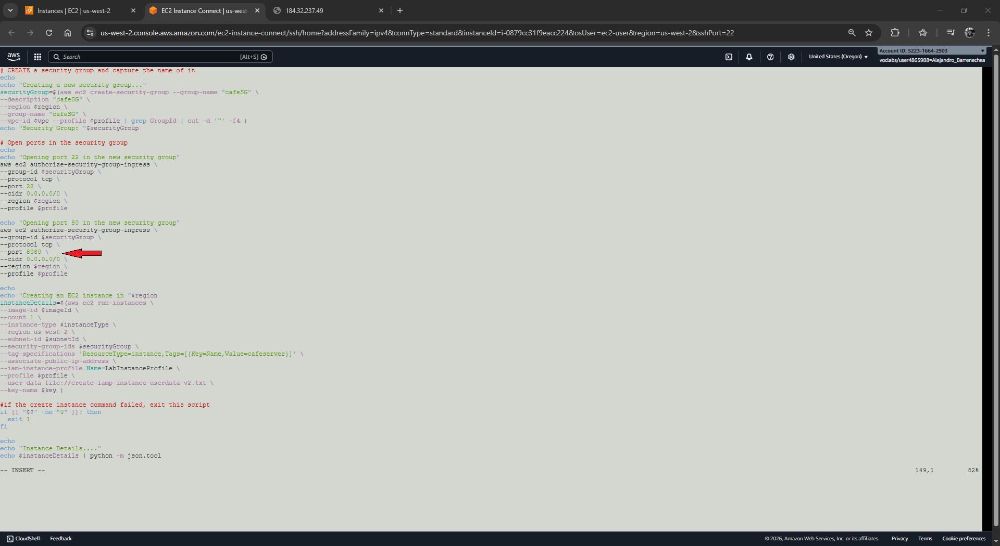
</p>

### ➌ Despliegue y Limpieza de Recursos
1.  **Ejecuta** el script: `./create-lamp-instance-v2.sh`.
2.  **Gestiona** los conflictos de nombres: Si la terminal arroja un **WARNING** sobre recursos existentes (SG o Instancias):
    *   **Escribe** `Y` y presiona **Enter** para confirmar la eliminación de los recursos defectuosos anteriores.
3.  **Anota** la IP pública final que el script imprimirá en pantalla.

<p align="center">
  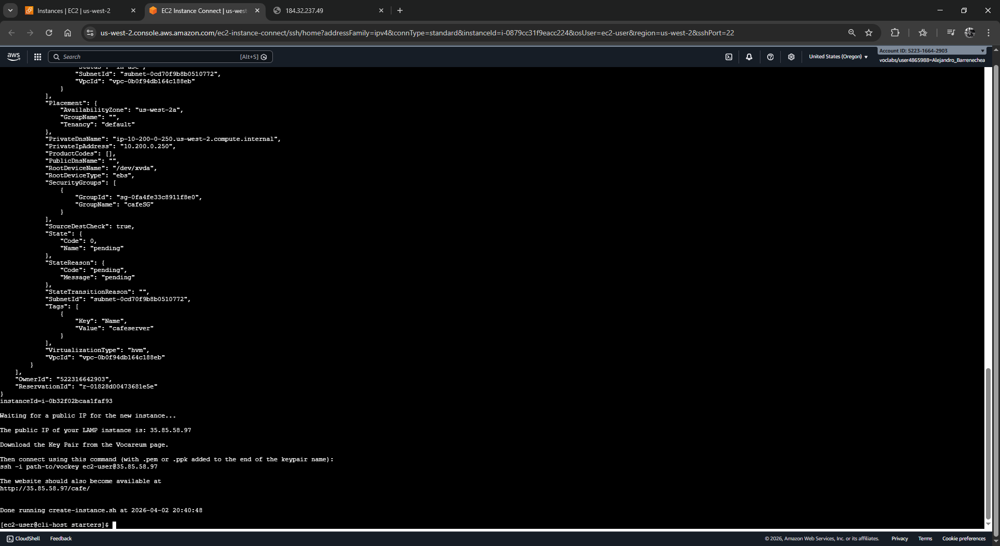
</p>

4.  **Acceso Web:** Escribe manualmente `http://<IP-PUBLICA>/cafe` en tu navegador (evita HTTPS).

<p align="center">
  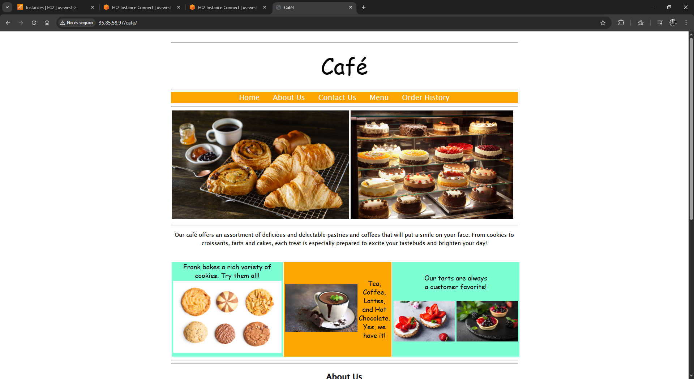
</p>
<p align="center">
  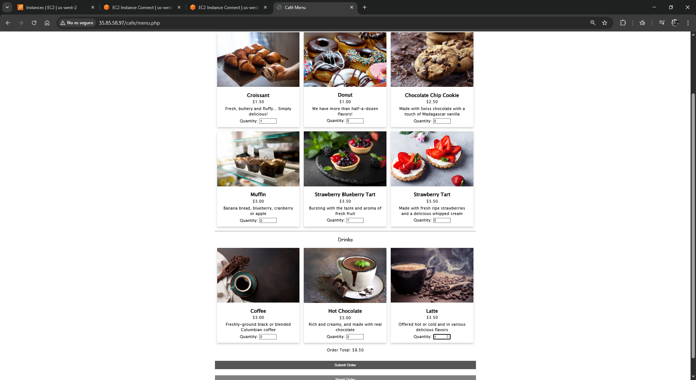
</p>
<p align="center">
  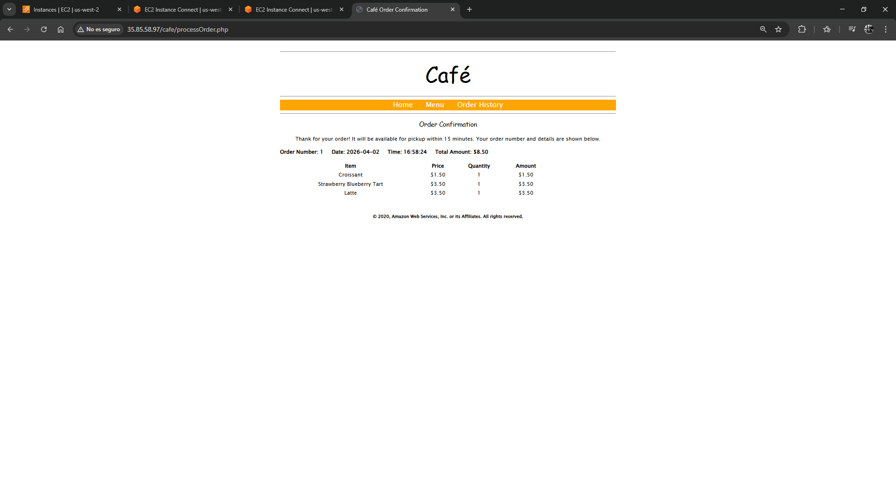
</p>
<p align="center">
  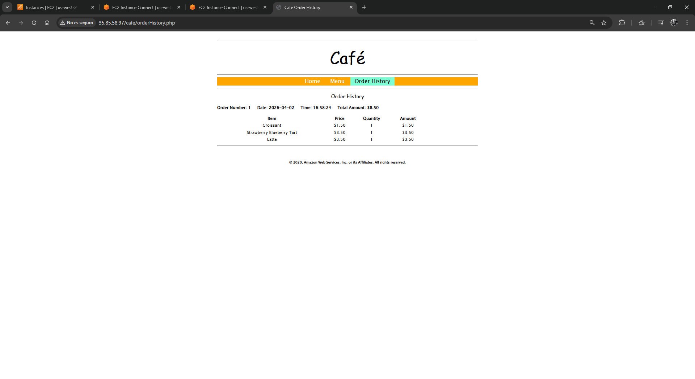
</p>
---

## 5. Respuestas Analíticas

**1. ¿Por qué es crítico evitar valores "hardcoded" en los scripts de AWS?**
Como se observó con el error `InvalidAMIID.NotFound`, escribir regiones estáticas (como `us-east-1`) impide la portabilidad del código. AWS es una infraestructura global pero con recursos regionales; los scripts deben capturar metadatos dinámicamente (`$region`) para garantizar que las AMIs y subredes sean válidas en cualquier entorno de despliegue.

**2. ¿Cuál es la diferencia entre un fallo de servicio y un fallo de seguridad?**
Un fallo de servicio (Apache apagado) devuelve un error de `Connection Refused` en un `curl`. Un fallo de seguridad (Puerto 80 cerrado en el Security Group) provoca un `Timeout`, donde el paquete de datos es descartado silenciosamente por el firewall de AWS antes de llegar al sistema operativo.

---

## ✅ Conclusión Final
Has completado un ciclo de vida de administración de sistemas avanzado. No solo has desplegado una aplicación LAMP, sino que has operado como un Ingeniero de Soporte de Nivel 3, diagnosticando capas de red, seguridad y código. La aplicación del Café está ahora operativa, segura y con una base de datos íntegra. **¡Proyecto de Servidores finalizado con éxito!**