# 🗄️ Lab: Trabajo con Amazon EBS

---

## 📋 Información del Laboratorio

| Atributo | Descripción |
|----------|-------------|
| **Dificultad** | Básico |
| **Tiempo Estimado** | 45 minutos |
| **Servicios Principales** | EC2, EBS, EC2 Instance Connect |
| **Requisitos Previos** | Acceso a AWS Management Console, conocimientos básicos de EC2 |

---

## 🎯 Resumen y Objetivos

### 📖 Resumen
Amazon Elastic Block Store (Amazon EBS) es un servicio de almacenamiento de bloques escalable y de alto rendimiento diseñado específicamente para trabajo con instancias Amazon EC2. Este laboratorio te introduce a los elementos fundamentales del ciclo de vida de un volumen EBS: creación, conexión, configuración de sistemas de archivos, backup mediante snapshots y recuperación de datos desde copias de seguridad.

### 🎓 Objetivos de Aprendizaje
Al completar este laboratorio, serás capaz de:

- 📦 **Crear** un volumen EBS con configuración personalizada
- 🔌 **Adjuntar y montar** un volumen EBS a una instancia EC2 en ejecución
- ⚙️ **Configurar** un sistema de archivos en el volumen EBS
- 📸 **Crear** una snapshot (copia de seguridad) de un volumen EBS
- ♻️ **Restaurar** datos desde una snapshot creando un nuevo volumen
- ✅ **Validar** la integridad de datos mediante el ciclo completo de backup y recuperación

---

## 🔍 Análisis del Escenario

### 🌐 Contexto Inicial
Dispones de una instancia EC2 denominada **Lab** ya ejecutándose en la región **us-west-2** (u otra según tu entorno de laboratorio). Esta instancia cuenta con un volumen raíz de 8 GiB que contiene el sistema operativo Linux.

### 📝 Solicitud Implícita
Se requiere expandir la capacidad de almacenamiento de la instancia Lab adjuntando un volumen EBS adicional dedicado al almacenamiento de datos. Además, debes demostrar la capacidad de realizar copias de seguridad mediante snapshots y verificar la recuperación de datos en caso de que el volumen original se vea comprometido.

### ⚡ Desafío Técnico
Realizar todas las operaciones respetando la restricción de zona de disponibilidad, ya que los volúmenes EBS deben residir en la misma AZ que la instancia a la que se adjuntarán.

---

## 🏗️ Arquitectura de la Solución

<p align="center">
  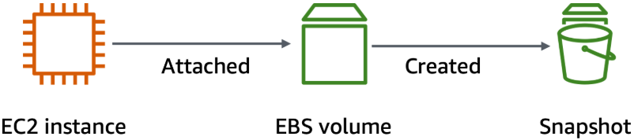
</p>

---

## 🛠️ Desarrollo de las Tareas

### 📦 Tarea 1: Crear un Nuevo Volumen EBS

#### 🔹 Paso 1.1: Acceder a la Consola de EC2
1. En la barra de búsqueda principal, escribe **EC2** y presiona Enter
2. Espera a que se cargue la consola de EC2 Management Console

#### 🔹 Paso 1.2: Identificar la Zona de Disponibilidad de la Instancia
1. En el panel de navegación izquierdo, haz clic en **Instances**
2. En la lista de instancias, localiza la instancia denominada **Lab**
3. Anota la **Availability Zone** (columna a la derecha, es posible que debas hacer scroll horizontal)
4. Registra este valor.
5. Esta zona será **obligatoria** para todas las operaciones posteriores.

<p align="center">
  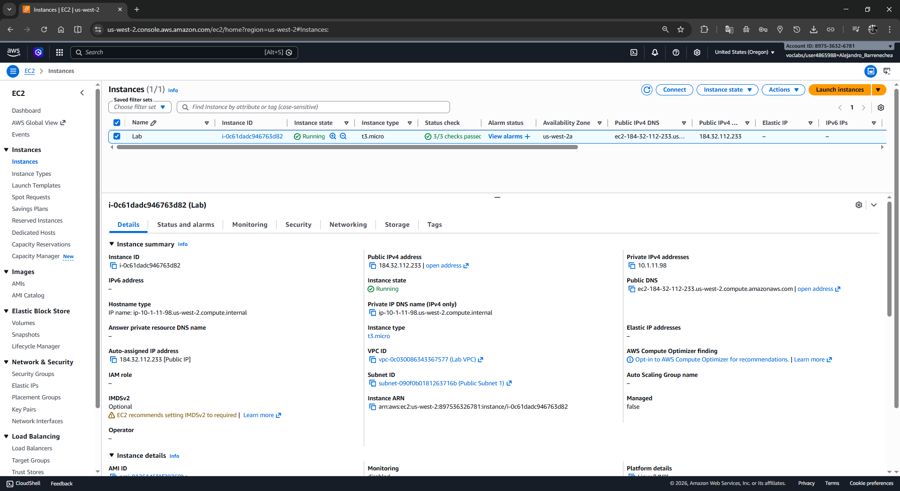
</p>

#### 🔹 Paso 1.3: Crear el Volumen
1. En el panel de navegación izquierdo, bajo la sección **Elastic Block Store**, haz clic en **Volumes**
2. Verifica que existe un volumen de 8 GiB asociado a la instancia (volumen raíz)
3. Haz clic en el botón **Create volume** (en la esquina superior derecha)

<p align="center">
  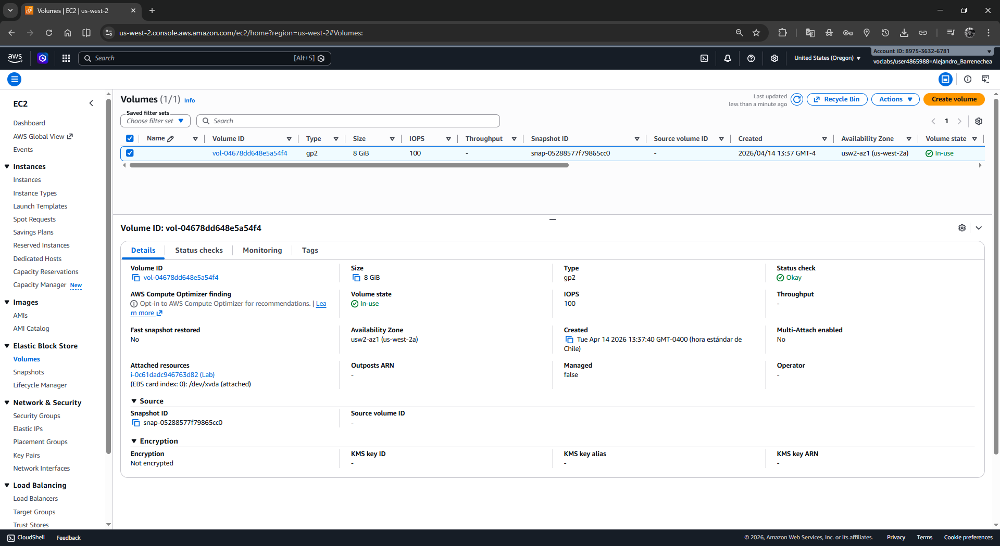
</p>

#### 🔹 Paso 1.4: Configurar las Propiedades del Volumen
En la pantalla de creación, completa los siguientes campos:

| Campo | Valor |
|-------|-------|
| **Volume Type** | General Purpose SSD (gp2) |
| **Size (GiB)** | 1 |
| **Availability Zone** | Selecciona la MISMA zona que tu instancia Lab (ej: us-west-2a) |
| **Encryption** | (Dejar por defecto) |

<p align="center">
  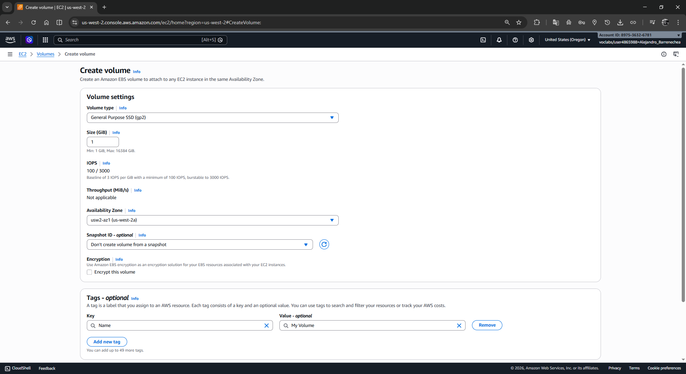
</p>

#### 🔹 Paso 1.5: Agregar Etiqueta al Volumen
1. Desplázate hacia abajo hasta la sección **Tags - optional**
2. Haz clic en **Add tag**
3. En el campo **Key**, escribe: `Name`
4. En el campo **Value**, escribe: `My Volume`
5. Haz clic en **Create volume**

#### 🔹 Paso 1.6: Validar la Creación
1. El volumen aparecerá con estado **Creating**
2. Espera algunos segundos (10-15) y actualiza la página (F5 o el botón **Refresh**)
3. Cuando el estado cambie a **Available**, el volumen está listo para adjuntar
4. **Nota importante**: Puede que necesites hacer scroll horizontal para ver la columna **Volume state**

<p align="center">
  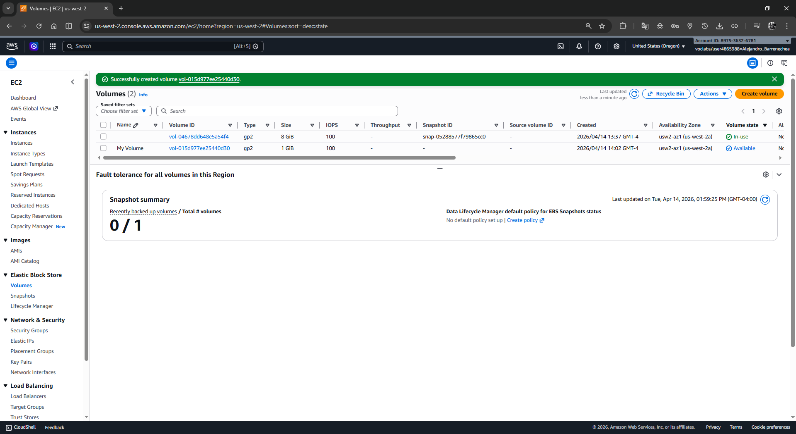
</p>

---

### 🔌 Tarea 2: Adjuntar el Volumen a la Instancia EC2

#### 🔹 Paso 2.1: Seleccionar el Volumen
1. En la vista **Volumes**, localiza y selecciona **My Volume** (el volumen que acabas de crear)
2. Asegúrate de que el estado sea **Available**

#### 🔹 Paso 2.2: Adjuntar el Volumen
1. Haz clic en el menú **Actions** (esquina superior derecha)
2. Selecciona **Attach volume**
3. En el campo **Instance**, despliega la lista y elige **Lab**
4. En el campo **Device name**, selecciona `/dev/sdb`
   - **Importante**: Este identificador de dispositivo es crítico para identificar el volumen en el sistema operativo
   - No cambies este valor a menos que tengas una razón específica
5. Haz clic en **Attach volume**

<p align="center">
  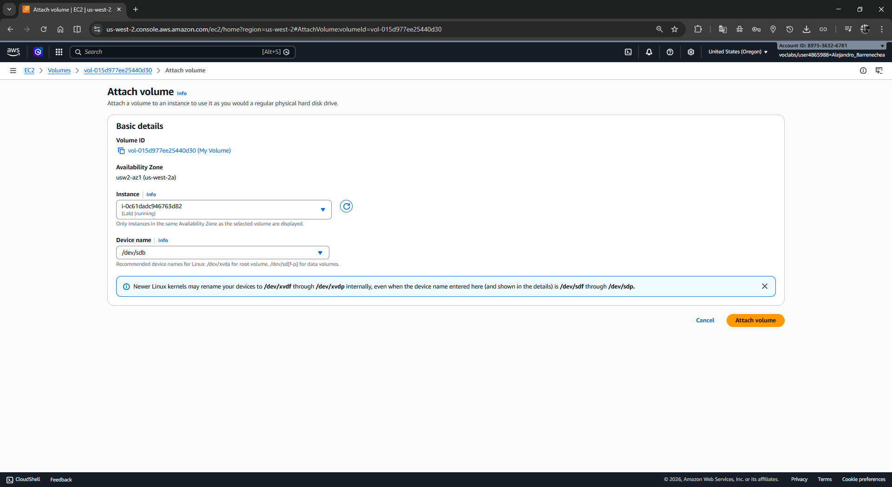
</p>

#### 🔹 Paso 2.3: Validar el Adjuntamiento
1. El estado del volumen **My Volume** cambiará a **In-use**
2. Ahora el volumen está físicamente conectado a la instancia, pero aún no es accesible dentro del SO
3. En los siguientes pasos, lo montarás en el sistema de archivos

<p align="center">
  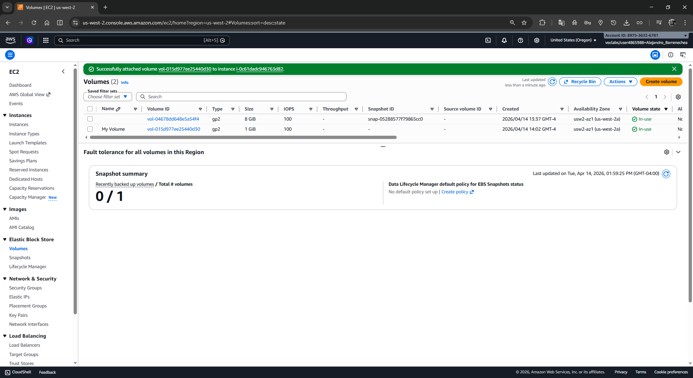
</p>

---

### 💻 Tarea 3: Conectar a la Instancia EC2 usando EC2 Instance Connect

#### 🔹 Paso 3.1: Acceder a Instances
1. En AWS Management Console, verifica estar en la sección **EC2 > Instances**
2. Localiza la instancia **Lab** en la lista

#### 🔹 Paso 3.2: Iniciar EC2 Instance Connect
1. Selecciona la instancia **Lab**
2. Haz clic en el botón **Connect** (esquina superior derecha)
3. Selecciona la pestaña **EC2 Instance Connect**
4. Verifica que el usuario sea **ec2-user** (por defecto)
5. Haz clic en **Connect**

#### 🔹 Paso 3.3: Validar la Conexión
1. Se abrirá una nueva pestaña del navegador con una terminal interactiva
2. Deberías ver un prompt similar a:
   ```
   ec2-user@ip-xxx-xxx-xxx-xxx:~$
   ```

<p align="center">
  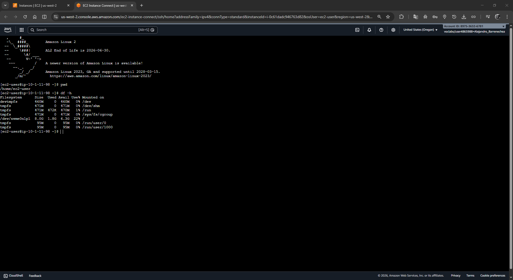
</p>
---

### 🗂️ Tarea 4: Crear y Configurar el Sistema de Archivos

#### 🔹 Paso 4.1: Verificar el Estado del Almacenamiento

En la terminal de EC2 Instance Connect, ejecuta el siguiente comando para visualizar los discos disponibles:

```bash
df -h
```

**Salida esperada:**
```
Filesystem      Size  Used Avail Use% Mounted on
devtmpfs        464M     0  464M   0% /dev
tmpfs           473M     0  473M   0% /dev/shm
tmpfs           473M  464K  472M   1% /run
tmpfs           473M     0  473M   0% /sys/fs/cgroup
/dev/nvme0n1p1  8.0G  1.7G  6.4G  21% /
tmpfs            95M     0   95M   0% /run/user/0
tmpfs            95M     0   95M   0% /run/user/1000
```

**Análisis**: 
- El volumen `/dev/nvme0n1p1` (8.0G) es el volumen raíz de la instancia
- Tu nuevo volumen `/dev/sdb` aún no aparece porque no está montado
- En la siguiente línea de comandos lo haremos visible

#### 🔹 Paso 4.2: Crear el Sistema de Archivos ext3

Ejecuta el siguiente comando para formatear el volumen y crear un sistema de archivos ext3:

```bash
sudo mkfs -t ext3 /dev/sdb
```

**Salida esperada:**
```
mke2fs 1.45.6 (20-Mar-2020)
Creating filesystem with 261644 1k block...
...
Writing superblocks and filesystem accounting information: done
```

**¿Qué ocurre aquí?**
- El comando `mkfs` (make filesystem) prepara el volumen EBS para almacenar datos
- El parámetro `-t ext3` especifica el tipo de sistema de archivos (ext3 es una opción robusta para cargas de trabajo general)
- `/dev/sdb` es el identificador del volumen que adjuntaste en la Tarea 2

#### 🔹 Paso 4.3: Crear el Punto de Montaje

Ejecuta el siguiente comando para crear un directorio donde montarás el volumen:

```bash
sudo mkdir /mnt/data-store
```

**¿Qué ocurre aquí?**
- Creamos un directorio llamado `data-store` bajo `/mnt` (conventualmente usado para puntos de montaje)
- Este será el punto de acceso desde el sistema operativo hacia el volumen EBS

#### 🔹 Paso 4.4: Montar el Volumen

Ejecuta el siguiente comando para montar el volumen en el punto de montaje:

```bash
sudo mount /dev/sdb /mnt/data-store
```

**¿Qué ocurre aquí?**
- Conectas el volumen EBS al árbol del sistema de archivos en la ruta `/mnt/data-store`
- Después de este comando, podrás leer y escribir archivos en `/mnt/data-store`

#### 🔹 Paso 4.5: Configurar el Montaje Persistente

La Instancia EC2 posiblemente se restart en el futuro. Para asegurar que el volumen se monte automáticamente en los reinicios, ejecuta:

```bash
echo "/dev/sdb   /mnt/data-store ext3 defaults,noatime 1 2" | sudo tee -a /etc/fstab
```

**¿Qué ocurre aquí?**
- `echo` genera la línea de configuración
- `sudo tee -a /etc/fstab` la añade al archivo de configuración `/etc/fstab`
- `noatime` optimiza el rendimiento evitando actualizar la marca de tiempo de acceso en cada lectura

#### 🔹 Paso 4.6: Validar la Configuración

Para verificar que la línea se agregó correctamente:

```bash
cat /etc/fstab
```

**Salida esperada:**
Al final del archivo deberías ver:
```
/dev/sdb   /mnt/data-store ext3 defaults,noatime 1 2
```

#### 🔹 Paso 4.7: Verificar el Montaje

Ejecuta nuevamente el comando para ver todos los sistemas de archivos montados:

```bash
df -h
```

**Salida esperada:**
```
Filesystem      Size  Used Avail Use% Mounted on
devtmpfs        464M     0  464M   0% /dev
tmpfs           473M     0  473M   0% /dev/shm
tmpfs           473M  464K  472M   1% /run
tmpfs           473M     0  473M   0% /sys/fs/cgroup
/dev/nvme0n1p1  8.0G  1.7G  6.4G  21% /
tmpfs            95M     0   95M   0% /run/user/0
tmpfs            95M     0   95M   0% /run/user/1000
/dev/nvme1n1    975M   60K  924M   1% /mnt/data-store
```

**Validación**: La línea `/dev/nvme1n1 (approximately 975M)` confirma que tu volumen está montado y accesible

#### 🔹 Paso 4.8: Escribir un Archivo de Prueba

Ejecuta el siguiente comando para crear un archivo de test en el volumen:

```bash
sudo sh -c "echo some text has been written > /mnt/data-store/file.txt"
```

**¿Qué ocurre aquí?**
- `echo` genera el texto
- Redirección `>` lo escribe en el archivo `file.txt`
- `sudo sh -c` ejecuta comandos con privilegios elevados, necesario porque escribimos en un directorio.property de root

#### 🔹 Paso 4.9: Verificar el Archivo

Confirma que el archivo se creó correctamente:

```bash
cat /mnt/data-store/file.txt
```

**Salida esperada:**
```
some text has been written
```

<p align="center">
  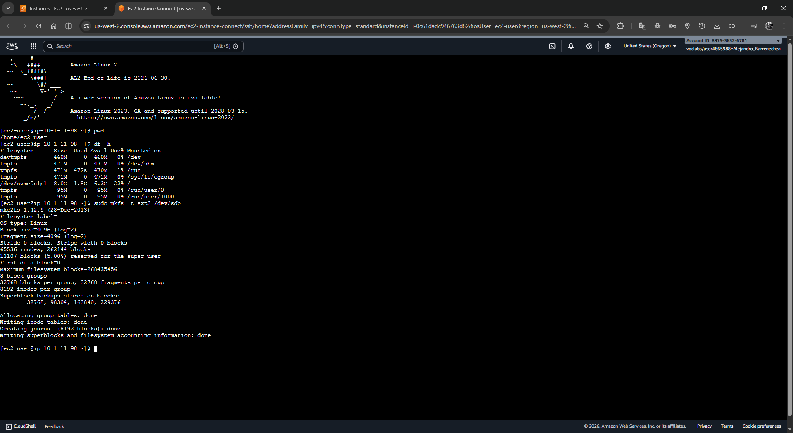
</p>

✅ **Checkpoint**: Has completado exitosamente la configuración del volumen EBS con un sistema de archivos funcional. 🎉

---

### 📸 Tarea 5: Crear una Snapshot de la Instancia EBS

#### 🔹 Paso 5.1: Acceder a Volúmenes

1. En AWS Management Console, en la sección **EC2**, ve al panel de navegación izquierdo
2. Haz clic en **Volumes**

#### 🔹 Paso 5.2: Seleccionar el Volumen

1. Localiza y selecciona **My Volume** en la lista

#### 🔹 Paso 5.3: Crear la Snapshot

1. Haz clic en el menú **Actions** (esquina superior derecha)
2. Selecciona **Create snapshot**

#### 🔹 Paso 5.4: Configurar la Snapshot

En la pantalla de creación, completa:

1. **Description** (opcional): escribir `Snapshot of my-volume with file.txt backup`
2. En la sección **Tags - optional**, haz clic en **Add tag**
3. Configura la etiqueta:
   - **Key**: `Name`
   - **Value**: `My Snapshot`

<p align="center">
  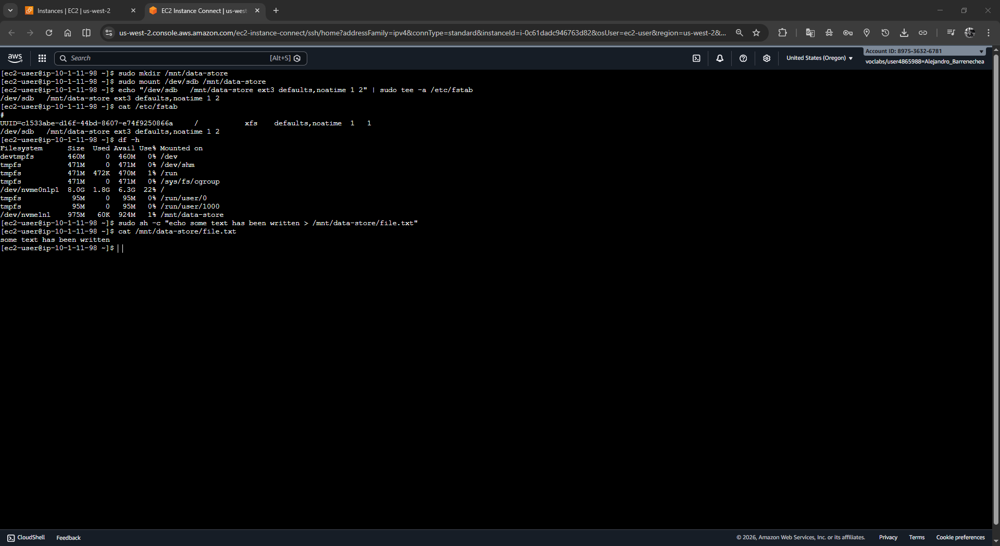
</p>

#### 🔹 Paso 5.5: Ejecutar la Creación

1. Haz clic en **Create snapshot**
2. Verás un mensaje de confirmación indicando que la snapshot está siendo creada

#### 🔹 Paso 5.6: Monitorear la Creación

1. En el panel de navegación izquierdo, haz clic en **Snapshots**
2. Localiza **My Snapshot** en la lista
3. El estado inicial será **Pending**
4. Espera 30-60 segundos y presiona F5 para actualizar
5. Cuando el estado cambie a **Completed**, la snapshot está lista

<p align="center">
  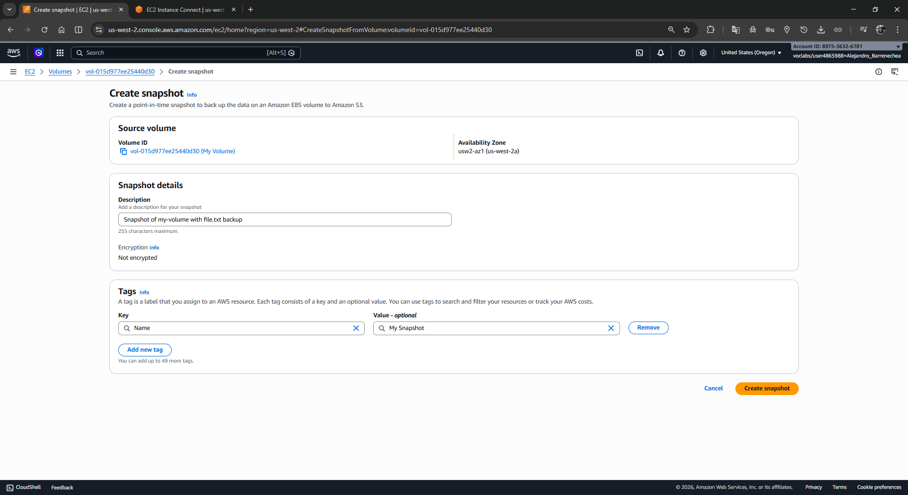
</p>

**¿Qué ocurre durante esta operación?**
- AWS copia todos los bloques de datos utilizados en el volumen EBS
- Los bloques vacíos NO se copian, por lo que una snapshot de 1 GiB con poco contenido ocupará mucho menos espacio en S3
- La snapshot se almacena automáticamente en Amazon S3 con redundancia geográfica

#### 🔹 Paso 5.7: Simular Pérdida de Datos

Para demostrar la utilidad de las snapshots, simularemos una eliminación accidental de datos.

En la terminal de EC2 Instance Connect, ejecuta:

```bash
sudo rm /mnt/data-store/file.txt
```

Este comando elimina el archivo que creamos anteriormente.

<p align="center">
  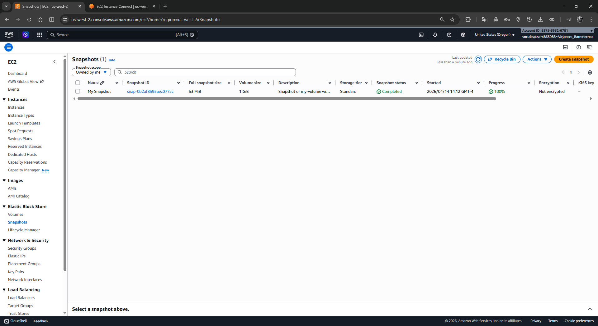
</p>

#### 🔹 Paso 5.8: Verificar la Eliminación

Intenta acceder al archivo eliminado:

```bash
ls /mnt/data-store/file.txt
```

**Salida esperada:**
```
ls: cannot access /mnt/data-store/file.txt: No such file or directory
```

<p align="center">
  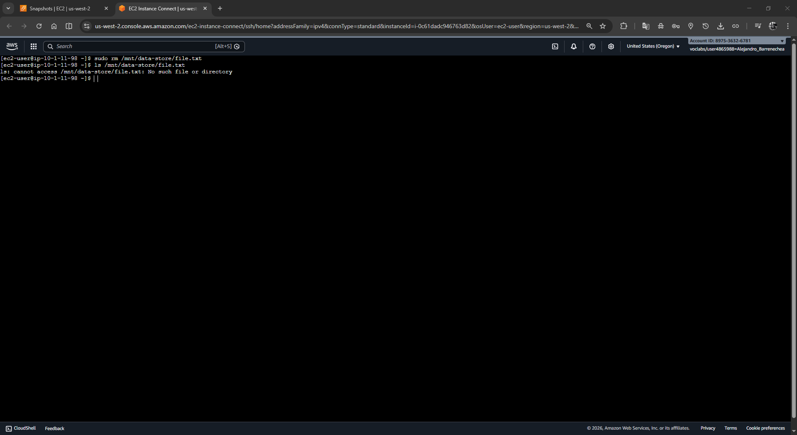
</p>

✅ **Checkpoint**: El archivo ha sido eliminado exitosamente. En los siguientes pasos, lo recuperaremos usando la snapshot. ⚠️

---

### ♻️ Tarea 6: Restaurar el Volumen desde la Snapshot

#### 6.1: Crear un Nuevo Volumen desde la Snapshot

##### 🔹 Paso 6.1.1: Acceder a Snapshots

1. En AWS Management Console, en la sección **EC2**, haz clic en **Snapshots**
2. Localiza y selecciona **My Snapshot**

##### 🔹 Paso 6.1.2: Crear Volumen desde Snapshot

1. Haz clic en el menú **Actions**
2. Selecciona **Create volume from snapshot**

##### 🔹 Paso 6.1.3: Configurar el Nuevo Volumen

Completa los siguientes campos:

| Campo | Valor |
|-------|-------|
| **Volume Type** | General Purpose SSD (gp2) (por defecto) |
| **Size (GiB)** | 1 (por defecto, heredado de la snapshot) |
| **Availability Zone** | Selecciona la MISMA zona que tu instancia Lab |
| **Encryption** | (Dejar por defecto) |

<p align="center">
  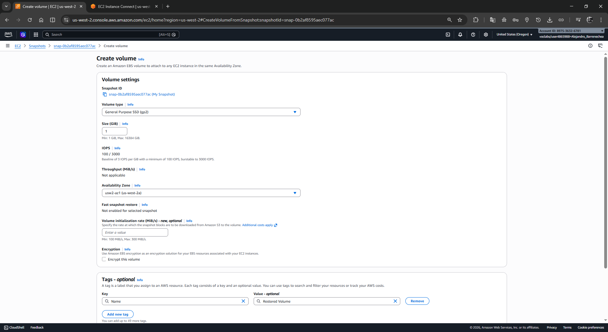
</p>

**Nota**: Al restaurar desde una snapshot, puedes modificar el tipo, tamaño o AZ. En este laboratorio mantendremos la configuración original.

##### 🔹 Paso 6.1.4: Agregar Etiqueta

1. En la sección **Tags - optional**, haz clic en **Add tag**
2. Configura:
   - **Key**: `Name`
   - **Value**: `Restored Volume`

##### 🔹 Paso 6.1.5: Crear el Volumen

1. Haz clic en **Create volume**
2. Espera a que el estado cambie a **Available** (refresca si es necesario)

<p align="center">
  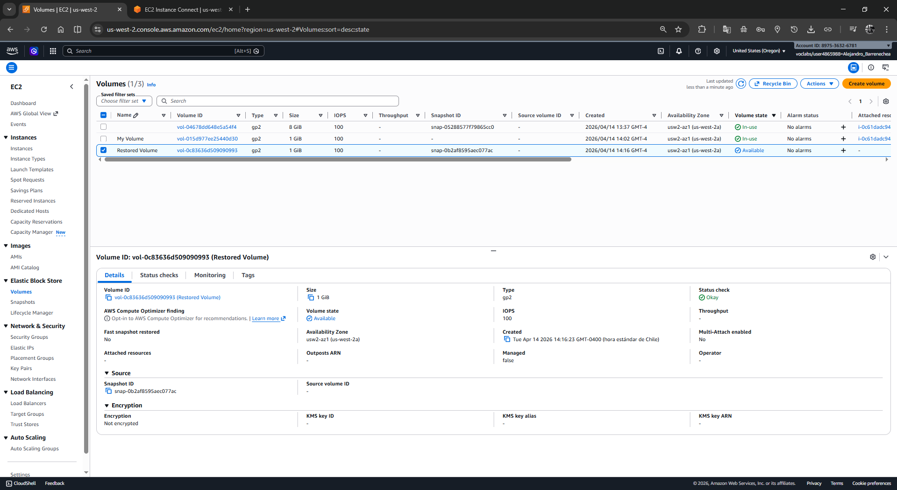
</p>

---

#### 6.2: Adjuntar el Volumen Restaurado a la Instancia

##### 🔹 Paso 6.2.1: Seleccionar el Volumen Restaurado

1. Ve a la sección **Volumes**
2. Localiza y selecciona **Restored Volume**
3. Asegúrate de que el estado sea **Available**

##### 🔹 Paso 6.2.2: Adjuntar el Volumen

1. Haz clic en el menú **Actions**
2. Selecciona **Attach volume**
3. En el campo **Instance**, selecciona **Lab**
4. En el campo **Device name**, selecciona `/dev/sdc`
   - **Importante**: Este es un identificador diferente al del volumen anterior (`/dev/sdb`)
   - Esto permite tener ambos volúmenes adjuntos simultáneamente para propósitos de comparación
5. Haz clic en **Attach volume**

<p align="center">
  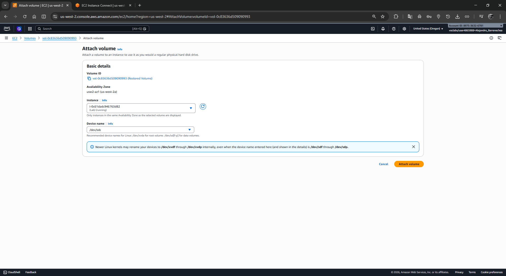
</p>

##### 🔹 Paso 6.2.3: Validar el Adjuntamiento

1. El estado del volumen **Restored Volume** cambiará a **In-use**

<p align="center">
  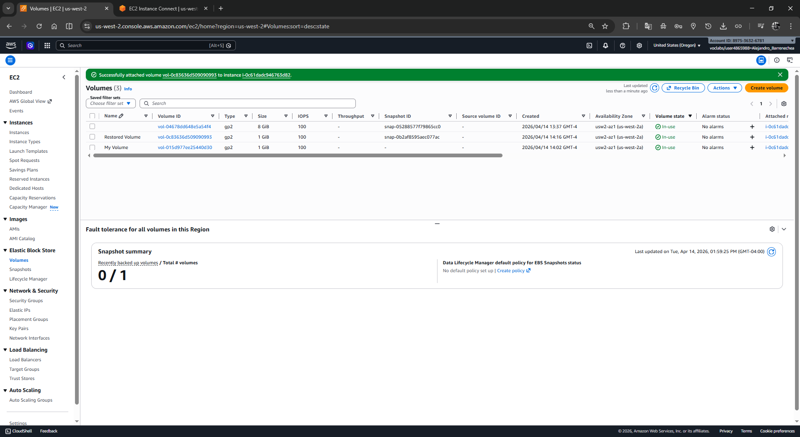
</p>

---

#### 6.3: Montar el Volumen Restaurado

##### 🔹 Paso 6.3.1: Crear el Punto de Montaje

En la terminal de EC2 Instance Connect, ejecuta:

```bash
sudo mkdir /mnt/data-store2
```

Este comando crea un segundo directorio de montaje.

##### 🔹 Paso 6.3.2: Montar el Volumen

Ejecuta el comando para montar el volumen restaurado:

```bash
sudo mount /dev/sdc /mnt/data-store2
```

**¿Qué ocurre aquí?**
- Conectas el volumen restaurado (`/dev/sdc`) al árbol del sistema de archivos
- Ahora ambos volúmenes están montados:
  - `/dev/sdb` en `/mnt/data-store` (volumen original, con archivo eliminado)
  - `/dev/sdc` en `/mnt/data-store2` (volumen restaurado desde la snapshot)

##### 🔹 Paso 6.3.3: Verificar la Recuperación de Datos

Ejecuta el siguiente comando para confirmar que el archivo eliminado está presente en el volumen restaurado:

```bash
ls /mnt/data-store2/file.txt
```

**Salida esperada:**
```
/mnt/data-store2/file.txt
```

✅ **Validación Exitosa**: El archivo está presente en el volumen restaurado. Esto confirma que:
- La snapshot capturó correctamente los datos originales
- La recuperación desde la snapshot funciona como se espera
- Los datos pueden ser restaurados en caso de pérdida accidental

##### 🔹 Paso 6.3.4: Verificar el Contenido (Opcional)

Para confirmar que el contenido del archivo es idéntico:

```bash
cat /mnt/data-store2/file.txt
```

**Salida esperada:**
```
some text has been written
```

<p align="center">
  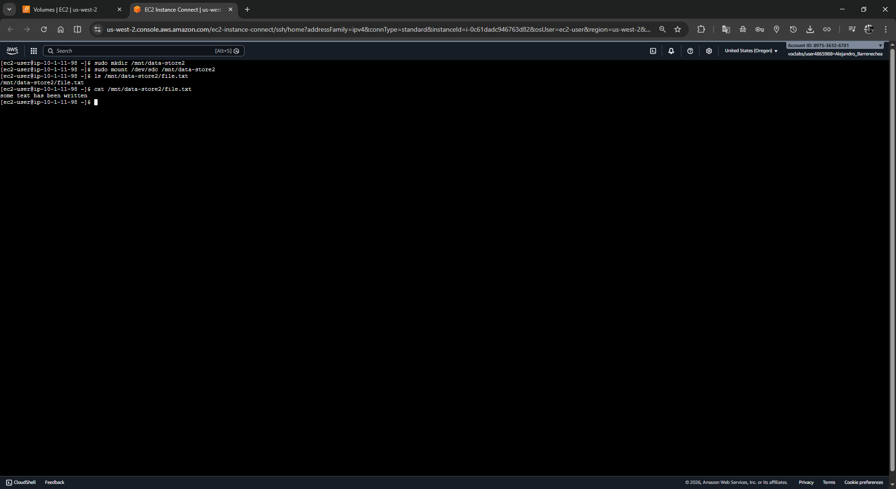
</p>

---

## 💡 Respuestas Analíticas a Preguntas Clave

### ¿Por qué es necesario que el volumen EBS esté en la misma zona de disponibilidad que la instancia EC2?

Los volúmenes EBS están diseñados para conectarse a instancias EC2 mediante fibra de baja latencia dentro de la misma AZ. Aunque AWS permite crear volúmenes en diferentes AZs, adjuntarlos a una instancia en otra zona resultaría en latencia extremadamente alta y no es una operación recomendada. Por seguridad, AWS requiere que coincidan las AZs.

### ¿Qué diferencia hay entre `/dev/sdb` y `/dev/nvme1n1` en la salida de `df -h`?

- `/dev/sdb` es el descriptor que utilizaste para adjuntar el dispositivo en la consola de AWS
- `/dev/nvme1n1` es cómo el kernel de Linux identifica el dispositivo físico (NVMe es un protocolo de almacenamiento moderno)
- Ambos refieren al mismo volumen; AWS automáticamente mapea el nombre lógico al físico
- En modernos sistemas EC2 basados en Nitro, es común ver esta diferencia

### ¿Por qué los bloques vacíos no se incluyen en una snapshot?

Esto es una optimización fundamental de EBS:
- Una snapshot solo copia los bloques que contienen datos efectivos
- Los bloques no utilizados se asumen como "vacío" y no se almacenan
- Esto ahorra costo de almacenamiento en S3 y acelera la creación de snapshots
- Por ejemplo, si tienes un volumen de 100 GiB pero solo usas 2 GiB, la snapshot ocupará aproximadamente 2 GiB en S3

### ¿Qué sucede si creo una snapshot y luego elimino el volumen original?

- La snapshot persiste independientemente
- Puedes crear nuevos volúmenes desde esa snapshot en cualquier momento
- Las snapshots son duplicables, compartibles entre cuentas AWS y copiables entre regiones
- Este es el principal caso de uso de snapshots: protección contra eliminaciones accidentales y recuperación ante desastres (DR)

### ¿Puedo restaurar una snapshot a un volumen de diferente tamaño?

**Sí**, con las siguientes consideraciones:
- Al crear un volumen desde una snapshot, puedes especificar un tamaño mayor (escalado hacia arriba fácilmente)
- **No puedes reducir el tamaño** de un volumen EBS sin eliminar y recrear
- Si restauras a un volumen mayor, el sistema de archivos debe ser expandido usando herramientas como `resize2fs` (para ext3/ext4) o equivalentes según el tipo de FS

### ¿Qué diferencia hay entre ext3 y las actuales opciones de sistema de archivos?

- **ext3**: Sistema de archivos robusto, estándar de facto en Linux antiguos, con journaling
- **ext4**: Versión mejorada, mejor rendimiento, máximo 16 TiB por volumen
- **xfs**: Rendimiento superior, mejor para almacenamiento de alto nivel
- **otros**: btrfs, zfs (para casos avanzados)

Para la mayoría de cargas de trabajo en EBS, **ext4 es la recomendación moderna**, pero ext3 sigue siendo totalmente funcional.

---

## 🎬 Resumen de Aprendizajes Clave

### Ciclo Completo de Volumen EBS

```
1. CREAR volumen       → Estado: Available
2. ADJUNTAR a instancia → Estado: In-use
3. FORMATEAR (mkfs)    → Crear sistema de archivos
4. MONTAR (mount)      → Hacerlo accesible en /
5. CONFIGURAR (/etc/fstab) → Persistencia tras reboot
6. SNAPSHOT            → Backup en S3
7. RESTAURAR           → Nuevo volumen desde backup
```

### Comandos Críticos Retenidos

| Comando | Proposito |
|---------|-----------|
| `df -h` | Visualizar montajes actuales |
| `sudo mkfs -t ext3 /dev/sdb` | Crear sistema de archivos |
| `sudo mkdir /ruta` | Crear punto de montaje |
| `sudo mount /dev/sdb /ruta` | Montar volumen |
| `cat /etc/fstab` | Verificar configuración persistente |
| `ls /ruta` | Verificar contenido |

### Arquitectura Comprendida

- **EBS**: Volúmenes de bloque persistentes, durables, con snapshot capabilities
- **Snapshots**: Copias de seguridad incrementales en S3, recuperables como nuevos volúmenes
- **Montaje**: El vínculo entre el dispositivo físico y el árbol del sistema de archivos

---

## 🏆 Conclusión

Has completado exitosamente todas las fases del ciclo de vida de un volumen Amazon EBS:

✅ Creaste un volumen EBS con configuración personalizada  
✅ Adjuntaste el volumen a una instancia EC2 en ejecución  
✅ Formateaste el volumen con un sistema de archivos ext3  
✅ Montaste el volumen en un punto de acceso (`/mnt/data-store`)  
✅ Configuraste el montaje persistente para reinicios  
✅ Creaste una snapshot (copia de seguridad) del volumen  
✅ Demostraste pérdida de datos accidental  
✅ Restauraste los datos desde la snapshot en un nuevo volumen  
✅ Validaste la integridad de los datos recuperados

Este laboratorio ha demostrado que Amazon EBS proporciona un mecanismo robusto y confiable para ampliar el almacenamiento de instancias EC2, con capacidades avanzadas de backup y recuperación que son esenciales para cualquier arquitectura de producción en AWS. 🚀

