# 📦 Lab: Administración del almacenamiento
---

## 📋 Información del Laboratorio

| Atributo | Descripción |
|----------|-------------|
| **Dificultad** | Intermedio |
| **Tiempo Estimado** | 45 minutos |
| **Servicios Principales** | EC2, EBS, S3, IAM, AWS CLI |
| **Requisitos Previos** | Cuenta AWS con acceso a consola, nociones básicas de EC2 y Linux |

---

## 🎯 Resumen y Objetivos

### 📖 Resumen
Este laboratorio te guía en la administración de almacenamiento AWS mediante AWS CLI y recursos EC2. Crearás snapshots de volúmenes EBS, programarás automatizaciones con cron, y sincronizarás datos locales con un bucket Amazon S3 usando versioning para recuperar archivos eliminados.

### 🎓 Objetivos de Aprendizaje
Al completar este laboratorio, serás capaz de:

- 📸 **Crear y mantener** snapshots de volúmenes EBS para instancias EC2
- 🧰 **Configurar recursos** S3 e IAM para integración con instancias EC2
- 🕒 **Programar** creación recurrente de snapshots con cron
- 🧹 **Mantener** un historial de snapshots conservando únicamente los más recientes
- ☁️ **Sincronizar** datos desde un volumen EBS a un bucket S3 con `aws s3 sync`
- 🔁 **Recuperar** archivos eliminados en S3 mediante versioning

---

## 🔍 Análisis del Escenario

### 🌐 Contexto Inicial
El entorno incluye una VPC con un subnet público y dos instancias EC2: **Command Host** y **Processor**. La instancia **Command Host** se utilizará para administrar recursos y ejecutar comandos AWS CLI, mientras que **Processor** contiene el volumen EBS de datos.

<p align="center">
  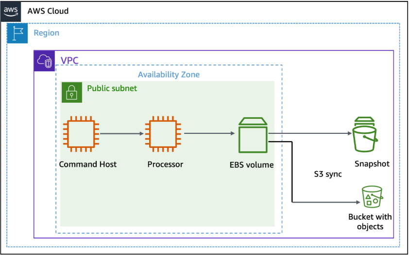
</p>

### 📝 Solicitud Implícita
Se necesita establecer un flujo de trabajo de respaldo y recuperación para EBS, automatizar la retención de snapshots y sincronizar datos de un volumen local a un bucket S3 con capacidad de versionado.

### ⚡ Desafío Técnico
Implementar un proceso seguro y automatizado que abarque:
- creación de bucket S3
- enlace de roles IAM
- uso de AWS CLI para snapshots y sincronización
- uso de cron para automatización temporal
- restauración de objetos con versioning

---

## 🏗️ Arquitectura de la Solución

La solución es un flujo de tres capas:

1. **Command Host**: interfaz de administración AWS CLI
2. **Processor**: instancia con volumen EBS que contiene datos a respaldar y sincronizar
3. **S3 Bucket**: repositorio de archivos sincronizados con versioning habilitado

El pipeline incluye:
- snapshot EBS desde Command Host
- control de retención con Python
- sincronización de datos con `aws s3 sync`
- recuperación de versiones con `aws s3api`

---

## 🛠️ Desarrollo

### 🧩 Tarea 1: Crear y configurar recursos

#### 🔹 Paso 1.1: Crear un bucket S3
1. En la barra de búsqueda de AWS Console, escribe **S3** y selecciona **S3**.
2. Elige **Create bucket**.
3. En **Bucket name** ingresa el nombre real del bucket: `lab-183-abg`.
   - Este valor será referenciado como `lab-183-abg`.
4. Deja **Region** en el valor por defecto.
5. Haz clic en **Create bucket**.

#### 🔹 Paso 1.2: Adjuntar el perfil de instancia al Processor
1. En la barra de búsqueda, escribe **EC2** y elige **EC2**.
2. En el panel izquierdo, haz clic en **Instances**.
3. Selecciona la instancia **Processor**.
4. Elige **Actions > Security > Modify IAM role**.
5. En el desplegable **IAM role**, selecciona **S3BucketAccess**.
6. Haz clic en **Update IAM role**.

<p align="center">
  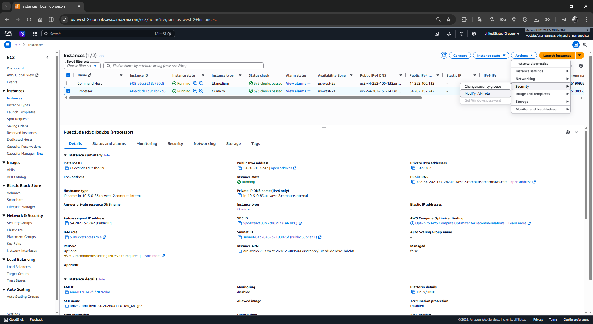
</p>

<p align="center">
  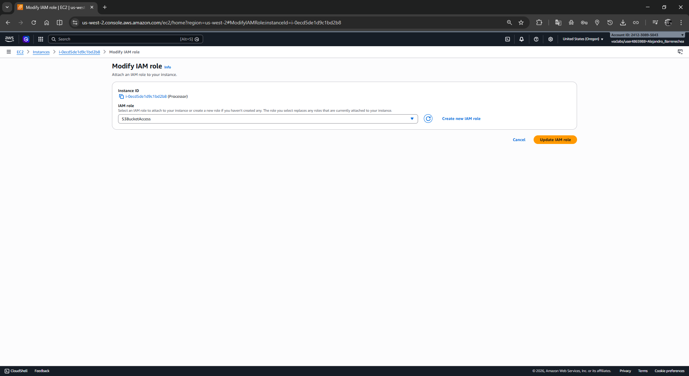
</p>

---

### 🧾 Tarea 2: Tomar snapshots de tu instancia

#### 🔹 Paso 2.1: Conectar al Command Host
1. En la consola, ve a **EC2 > Instances**.
2. Selecciona **Command Host**.
3. Haz clic en **Connect**.
4. En la pestaña **EC2 Instance Connect**, elige **Connect**.
5. Mantén abierta la terminal en la nueva pestaña.

#### 🔹 Paso 2.2: Tomar un snapshot inicial
1. Identifica el volume-id del Processor:

```bash
aws ec2 describe-instances --filter 'Name=tag:Name,Values=Processor' --query 'Reservations[0].Instances[0].BlockDeviceMappings[0].Ebs.{VolumeId:VolumeId}'
```

2. Identifica el instance-id del Processor:

```bash
aws ec2 describe-instances --filters 'Name=tag:Name,Values=Processor' --query 'Reservations[0].Instances[0].InstanceId'
```

3. Detén la instancia Processor:

```bash
aws ec2 stop-instances --instance-ids INSTANCE-ID
```

4. Verifica que se detuvo:

```bash
aws ec2 wait instance-stopped --instance-id i-0ecd5de1d9c1bd2b8
```
<p align="center">
  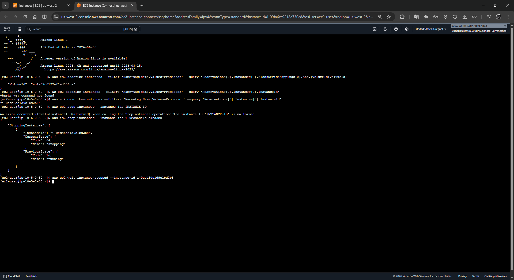
</p>

5. Crea el snapshot del volumen:

```bash
aws ec2 create-snapshot --volume-id vol-07c6122ef1ed356ca
```

6. Espera a que finalice:

```bash
aws ec2 wait snapshot-completed --snapshot-id SNAPSHOT-ID
```

7. Reinicia la instancia Processor:

```bash
aws ec2 start-instances --instance-ids i-0ecd5de1d9c1bd2b8
```

<p align="center">
  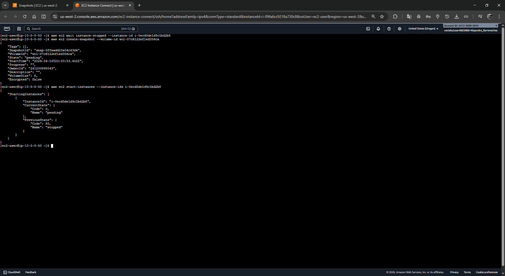
</p>

---

### ⏱️ Tarea 2.3: Programar creación recurrente de snapshots

#### 🔹 Paso 2.3.1: Crear el cron job
1. En la terminal del Command Host, crea un archivo de cron:


```bash
echo "* * * * *  aws ec2 create-snapshot --volume-id vol-07c6122ef1ed356ca 2>&1 >> /tmp/cronlog" > cronjob
```

2. Instala el cron job:

```bash
crontab cronjob
```

#### 🔹 Paso 2.3.2: Verificar la creación continua
1. Ejecuta:

```bash
aws ec2 describe-snapshots --filters "Name=volume-id,Values=vol-07c6122ef1ed356ca"
```

<p align="center">
  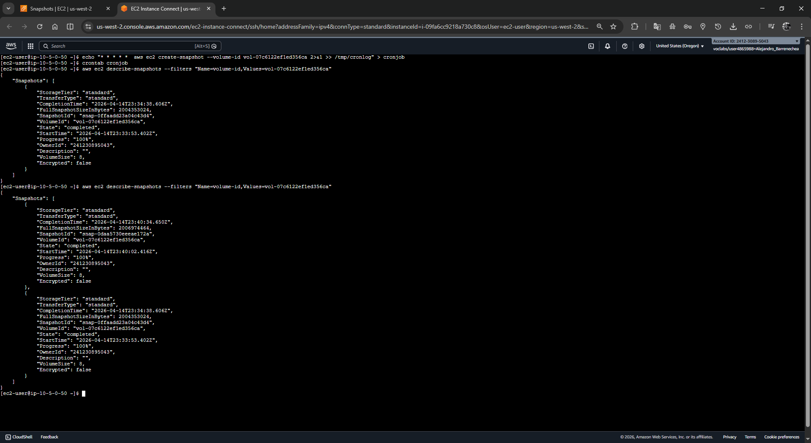
</p>

2. Repite después de unos minutos para observar más snapshots.

<p align="center">
  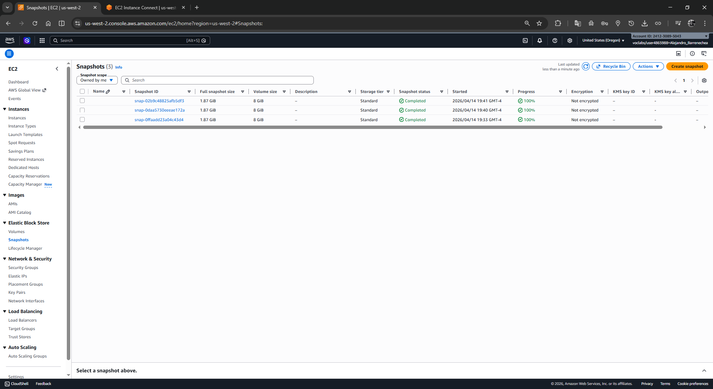
</p>

---

### 🧹 Tarea 2.4: Retener únicamente los dos snapshots más recientes

#### 🔹 Paso 2.4.1: Detener el cron job

```bash
crontab -r
```

#### 🔹 Paso 2.4.2: Revisar el script de retención

```bash
more /home/ec2-user/snapshotter_v2.py
```

#### 🔹 Paso 2.4.3: Verificar los snapshots actuales

```bash
aws ec2 describe-snapshots --filters "Name=volume-id, Values=vol-07c6122ef1ed356ca" --query 'Snapshots[*].SnapshotId'
```

#### 🔹 Paso 2.4.4: Ejecutar el script de retención

```bash
python3.8 snapshotter_v2.py
```

<p align="center">
  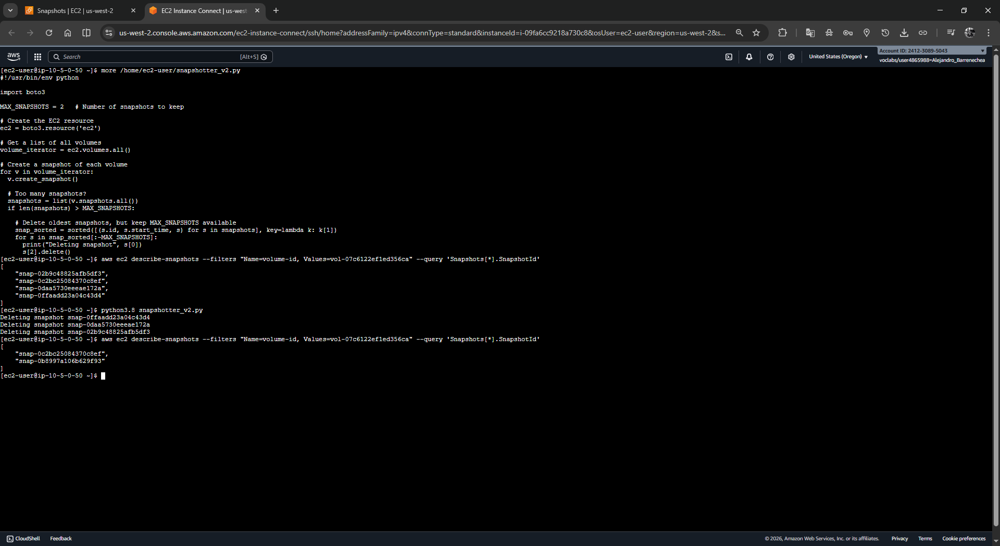
</p>

El script eliminará las snapshots antiguas y dejará solo las dos más recientes.

#### 🔹 Paso 2.4.5: Confirmar el resultado

```bash
aws ec2 describe-snapshots --filters "Name=volume-id, Values=vol-07c6122ef1ed356ca" --query 'Snapshots[*].SnapshotId'
```

El resultado debe mostrar solamente dos IDs de snapshot.

---

## 🏁 Tarea 3: Challenge - Sincronizar archivos con Amazon S3

### 🔹 Paso 3.1: Descargar y extraer archivos de ejemplo
1. Conéctate a la instancia **Processor** usando EC2 Instance Connect.
2. Descarga el paquete de archivos:

```bash
wget https://aws-tc-largeobjects.s3.us-west-2.amazonaws.com/CUR-TF-100-RSJAWS-3-124627/183-lab-JAWS-managing-storage/s3/files.zip
```

3. Descomprime el archivo:

```bash
unzip files.zip
```

<p align="center">
  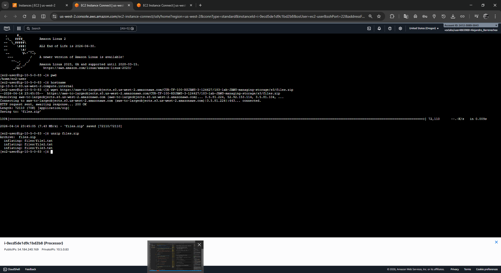
</p>

### 🔹 Paso 3.2: Activar versioning y sincronizar archivos
1. Habilita versioning en tu bucket S3:

```bash
aws s3api put-bucket-versioning --bucket lab-183-abg --versioning-configuration Status=Enabled
```

2. Sincroniza la carpeta local `files` con S3:

```bash
aws s3 sync files s3://lab-183-abg/files/
```

3. Verifica el contenido del bucket:

```bash
aws s3 ls s3://lab-183-abg/files/
```

<p align="center">
  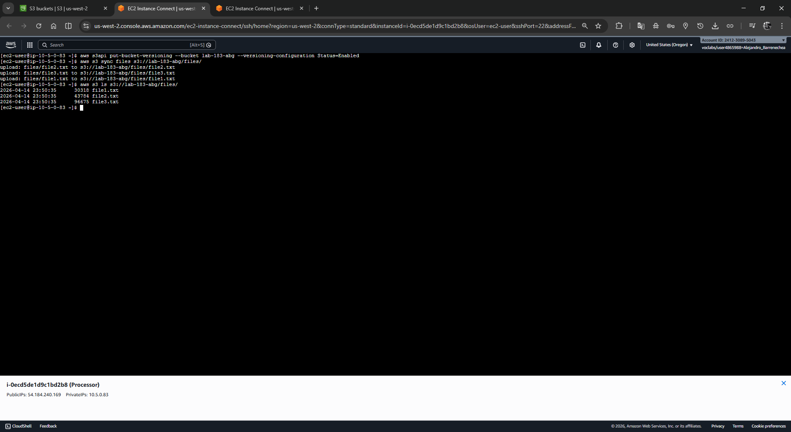
</p>

### 🔹 Paso 3.3: Eliminar un archivo local y propagar el cambio
1. Borra un archivo local:

```bash
rm files/file1.txt
```

2. Sincroniza con eliminación remota:

```bash
aws s3 sync files s3://lab-183-abg/files/ --delete
```

3. Verifica el archivo eliminado en el bucket:

```bash
aws s3 ls s3://lab-183-abg/files/
```

<p align="center">
  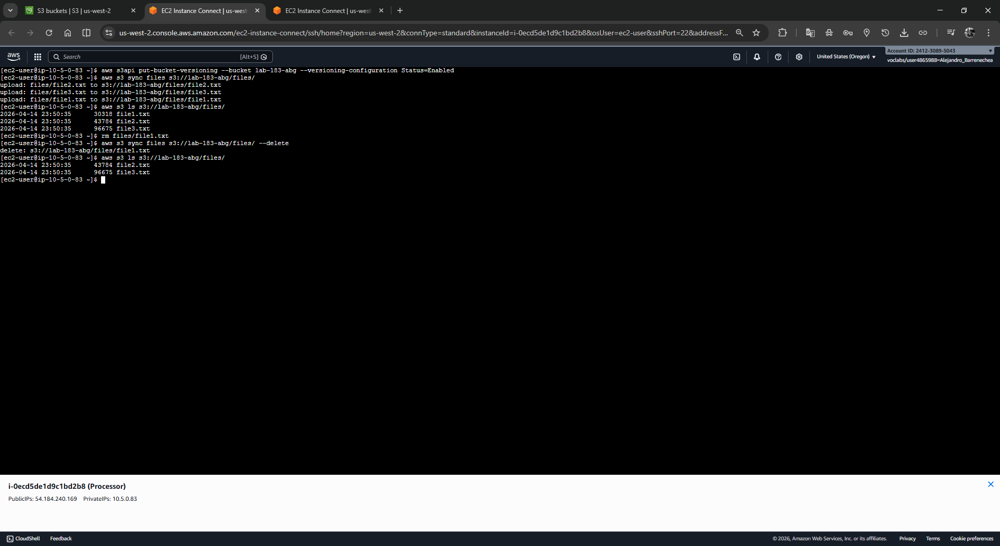
</p>

### 🔹 Paso 3.4: Recuperar el archivo eliminado usando versioning
1. Lista las versiones de `file1.txt`:

```bash
aws s3api list-object-versions --bucket lab-183-abg --prefix files/file1.txt
```

<p align="center">
  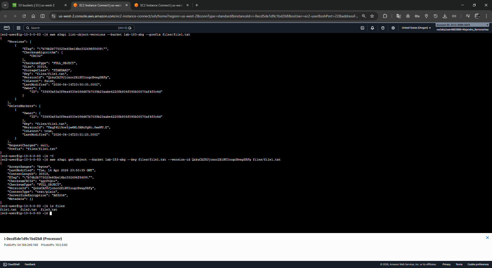
</p>

2. Descarga esa versión localmente:

```bash
aws s3api get-object --bucket lab-183-abg --key files/file1.txt --version-id QzkuCAZUJjcnoc2XiHUIoogcBvaySRFy files/file1.txt
```

3. Verifica que el archivo volvió a estar local:

```bash
ls files
```

4. Re-sincroniza la carpeta local con S3:

```bash
aws s3 sync files s3://lab-183-abg/files/
```

5. Confirma que el nuevo objeto fue cargado:

```bash
aws s3 ls s3://lab-183-abg/files/
```

<p align="center">
  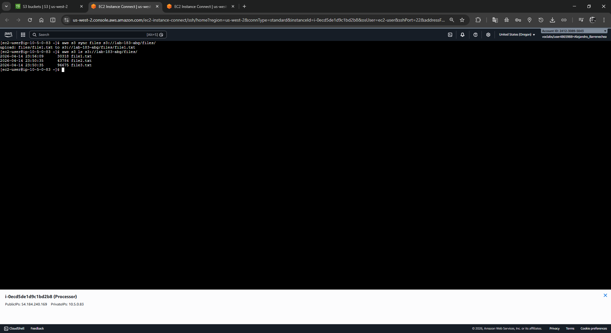
</p>

---

## 💡 Respuestas Analíticas a Preguntas Clave

### ¿Por qué usar AWS CLI en lugar de solo consola?
AWS CLI permite automatizar tareas repetitivas, ejecutar scripts, y reproducir procesos exactamente con comandos. En este laboratorio, AWS CLI es esencial para cron, snapshots y sincronización de archivos.

### ¿Por qué activar versioning en S3?
Versioning permite recuperar objetos eliminados o revertir cambios. Una sincronización con `--delete` crea un marcador de borrado, pero la versión previa del objeto sigue disponible.

### ¿Por qué detener Processor antes de crear el primer snapshot?
Se detiene para garantizar consistencia de datos en el volumen. Un snapshot en caliente puede ser válido, pero detener la instancia elimina el riesgo de escribir datos durante la copia.

### ¿Qué hace el script `snapshotter_v2.py`?
El script ordena snapshots por fecha y elimina las copias más antiguas, manteniendo solo las dos más recientes. Esto minimiza costos y mantiene un historial útil.

### ¿Por qué usar `aws s3 sync` con `--delete`?
Porque sincroniza el bucket con la estructura local. Si un archivo se borra localmente, `--delete` elimina automáticamente su copia en S3.

---

## ✅ Conclusión
Has completado el flujo completo de gestión de almacenamiento AWS:

- Creaste un bucket S3 y configuraste permisos con IAM
- Tomaste snapshots de un volumen EBS con AWS CLI
- Programaste y detuviste snapshots automatizados con cron
- Ejecutaste un script para retener solo los snapshots más recientes
- Sincronizaste datos locales con S3 usando `aws s3 sync`
- Verificaste y recuperaste un archivo eliminado con S3 versioning

Este laboratorio demuestra cómo combinar EBS, EC2, S3 y AWS CLI para una administración de almacenamiento segura, automatizada y recuperable.