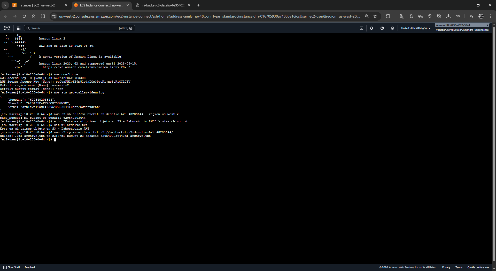
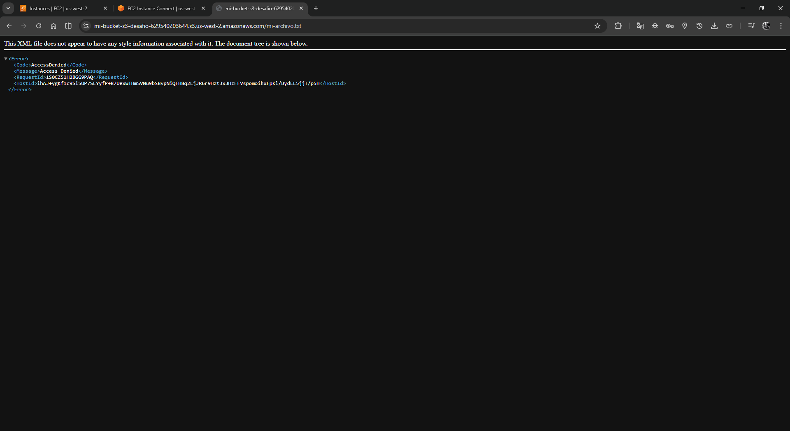
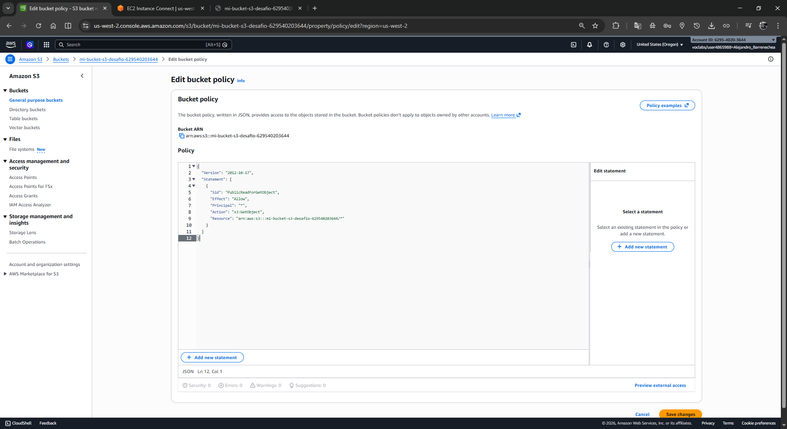
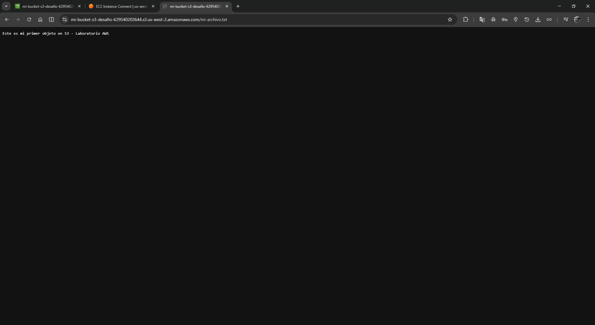

# 📦 Laboratorio Desafío: Amazon S3 - Gestión de Buckets y Objetos

---

## 📋 Encabezado Formal

| Atributo | Valor |
|----------|-------|
| **Dificultad** | Intermedia |
| **Tiempo Estimado** | 45 minutos |
| **Servicios Principales** | Amazon S3, Amazon EC2, AWS CLI |
| **Requisitos Previos** | Acceso a AWS Management Console, CLI Host EC2 aprovisionado |

---

## 🎯 Resumen y Objetivos

En este laboratorio desafío, demostrarás tu capacidad para **crear y administrar buckets de Amazon S3**, realizar operaciones de carga de objetos y configurar permisos de acceso público. Trabajarás con tanto la consola de AWS como con la interfaz de línea de comandos (AWS CLI) para consolidar tus conocimientos en almacenamiento de objetos.

### Objetivos de Aprendizaje

Al completar este laboratorio, serás capaz de:

✅ Crear un bucket de S3 con nomenclatura única y validada  
✅ Cargar objetos en el bucket utilizando la consola y la CLI  
✅ Configurar políticas de acceso a nivel de objeto para lectura pública  
✅ Acceder a objetos públicos a través de URLs con protocolo HTTPS  
✅ Enumerar contenidos de buckets empleando comandos AWS CLI  

---

## 🔍 Análisis del Escenario

**Contexto empresarial:** Tu organización necesita almacenar y distribuir archivos estáticos (documentos, imágenes, etc.) de forma segura pero con acceso público controlado. 

**Desafío inicial:** Implementar una solución de almacenamiento de objetos que permita:
- Alojar archivos en la nube de forma permanente
- Acceder a los archivos mediante URLs públicas (sin necesidad de autenticación)
- Mantener control granular sobre qué objetos son públicos y cuáles no
- Automatizar operaciones mediante CLI para escalabilidad futura

**Flujo esperado:**
1. Aprovisionamiento de credenciales AWS en la instancia CLI
2. Creación del repositorio de almacenamiento (bucket)
3. Carga del contenido digital
4. Implementación de permisos públicos
5. Validación de accesibilidad y listado de inventario

---

## 📝 Desarrollo

### Tarea 1: Conexión a la Instancia CLI Host

Accede a la instancia EC2 aprovisionada para ejecutar comandos AWS CLI:

1. Dirígete a la **AWS Management Console** en tu navegador.

2. En la barra de búsqueda superior, escribe **EC2** y selecciona el servicio.

3. En el panel de navegación izquierdo, haz clic en **Instancias**.

4. Localiza y selecciona la instancia denominada **CLI Host**.

5. Haz clic en el botón **Conectar** (parte superior derecha).

6. En la pestaña **EC2 Instance Connect**, haz clic nuevamente en **Conectar**.

   > 💡 **Nota:** Si prefieres utilizar un cliente SSH local, puedes conectarte usando:
   > ```bash
   > ssh ec2-user@34.213.225.42
   > ```

7. **Verifica la conexión exitosa** cuando veas el terminal interactivo con el prompt de la shell.

```
ec2-user@ip-xxx-xxx-xxx-xxx:~$
```

---

### Tarea 2: Configuración del AWS CLI

Una vez conectado a la instancia CLI Host, configura las credenciales de AWS y parámetros predeterminados.

#### Paso 2.1: Ejecuta el Comando de Configuración

Escribe el siguiente comando en el terminal:

```bash
aws configure
```

#### Paso 2.2: Ingresa las Credenciales

Cuando se solicite cada valor, cópialo **exactamente** de los siguientes datos de credenciales proporcionados:

| Solicitud | Valor a Ingresar |
|-----------|------------------|
| **AWS Access Key ID** |  |
| **AWS Secret Access Key** |  |
| **Default region name** | `us-west-2` |
| **Default output format** | `json` |

<div align="center">
  
</div>

#### Paso 2.3: Valida la Configuración

Verifica que la configuración fue correcta ejecutando:

```bash
aws sts get-caller-identity
```

✅ Si ves tu información de cuenta, estás **listo para proceder**.


<div align="center">
  
</div>
---

### Tarea 3: Creación e Implementación del Bucket S3

Completa las operaciones core del laboratorio ejecutando comandos CLI y navegando la consola.

#### Paso 3.1: Crear el Bucket S3

En el terminal EC2, crea un nuevo bucket con un nombre único y globalmente válido. Los nombres de bucket de S3 deben cumplir:
- Ser únicos a nivel mundial
- Contener solo letras minúsculas, números y guiones
- Comenzar y terminar con letra o número

```bash
aws s3 mb s3://mi-bucket-s3-desafio-629540203644 --region us-west-2
```

En la instancia EC2, crea un archivo de prueba:

```bash
echo "Este es mi primer objeto en S3 - Laboratorio AWS" > mi-archivo.txt
cat mi-archivo.txt
```

#### Paso 3.3: Cargar el Objeto en el Bucket

Sube el archivo a tu bucket de S3:

```bash
aws s3 cp mi-archivo.txt s3://mi-bucket-s3-desafio-629540203644/
```

<div align="center">
  
</div>

#### Paso 3.4: Intenta Acceder al Objeto (Acceso Privado)

Obtén la URL del objeto:

```
https://mi-bucket-s3-desafio-629540203644.s3.us-west-2.amazonaws.com/mi-archivo.txt
```

Copia esta URL en tu navegador. **Observarás un error de acceso denegado (HTTP 403)** porque el objeto es privado por defecto.

<div align="center">
  
</div>

---

#### Paso 3.5: Hacer el Objeto Públicamente Accesible

Deshabilita la configuración de Bloqueo de Acceso Público en el bucket. Así el bucket permite configuraciones públicas y puedes exponer el archivo mediante ACL `public-read` o mediante política de bucket si tus permisos IAM lo permiten.

##### Paso 3.5.2: Alternativa con política de bucket

Si prefieres aplicar el acceso público a nivel de bucket y tienes permisos `s3:PutBucketPolicy`, usa esta política:

```json
{
  "Version": "2012-10-17",
  "Statement": [
    {
      "Sid": "PublicReadForGetObject",
      "Effect": "Allow",
      "Principal": "*",
      "Action": "s3:GetObject",
      "Resource": "arn:aws:s3:::mi-bucket-s3-desafio-629540203644/*"
    }
  ]
}
```

> ⚠️ **Nota:** Esta política solo abre lectura de objetos. El bucket sigue sin permitir escritura o listado público.

<div align="center">
  
</div>

#### Paso 3.6: Accede al Objeto Público (Acceso Permitido)

Vuelve a acceder a la misma URL en tu navegador:

```
https://mi-bucket-s3-desafio-629540203644.s3.us-west-2.amazonaws.com/mi-archivo.txt
```

<div align="center">
  
</div>

---

#### Paso 3.7: Enumera el Contenido del Bucket (CLI)

Lista todos los objetos del bucket para validar su contenido:

```bash
aws s3 ls s3://mi-bucket-s3-desafio-629540203644/
```

Para un listado más detallado con metadatos:

```bash
aws s3api list-objects-v2 --bucket mi-bucket-s3-desafio-629540203644
```

---

## 🧠 Respuestas Analíticas a Preguntas Implícitas

### ¿Por qué el acceso es denegado inicialmente?

**Respuesta:** Amazon S3 implementa el principio de **"cerrado por defecto"** (deny by default). Todos los nuevos buckets y objetos son **privados** y requieren configuración explícita de ACLs o políticas de bucket para permitir acceso público. Esto protege contra exposiciones accidentales de datos sensibles.

### ¿Cuál es la diferencia entre ACL de bucket vs. ACL de objeto?

**Respuesta:**

| Aspecto | ACL de Bucket | ACL de Objeto |
|--------|---------------|---------------|
| **Alcance** | Controla acceso a listar/crear objetos | Controla lectura/escritura del objeto específico |
| **Granularidad** | Nivel de contenedor | Nivel de archivo individual |
| **Mejor práctica** | Mantener privado (restringido) | Configurar caso por caso según necesidad |
| **Recomendación** | Usar políticas de bucket en su lugar | Usar ACLs heredadas (migrar a políticas) |

### ¿Cómo aseguro que solo ciertos objetos son públicos?

**Respuesta:** Con el bloqueo de acceso público deshabilitado en el bucket, la forma más práctica es usar ACL `public-read` en el objeto específico. Esto entregará acceso de lectura pública sin necesidad de exponer otros objetos.

Si prefieres una solución más moderna y tienes permisos `s3:PutBucketPolicy`, puedes usar una política de bucket que permita `s3:GetObject` para los objetos específicos.

Esto permite que:
- El objeto seleccionado sea descargable vía URL pública
- El acceso a `ListBucket` permanezca restringido
- Otros objetos en el bucket sigan siendo privados

---

## ✅ Lista de Verificación de Completitud

Antes de finalizar el laboratorio, confirma que has completado:

- [ ] Conexión exitosa a CLI Host EC2
- [ ] AWS CLI configurado con credenciales válidas (comprobado con `aws sts get-caller-identity`)
- [ ] Bucket S3 creado con nomenclatura única
- [ ] Objeto cargado en el bucket
- [ ] Bloqueo de acceso público desactivado en el bucket
- [ ] ACL del objeto modificado a `public-read`
- [ ] Objeto accesible públicamente (screenshot del contenido)
- [ ] Contenido del bucket listado vía AWS CLI (screenshot)
- [ ] Todas las screenshots capturadas y etiquetadas con fecha/hora

---

## 🎓 Conclusión y Validación del Aprendizaje

**¡Felicidades!** Has completado exitosamente el laboratorio desafío de Amazon S3. 

**Has demostrado:**

✅ Capacidad para crear infraestructura de almacenamiento escalable en AWS  
✅ Comprensión de modelos de seguridad en S3 (privado vs. público)  
✅ Dominio de operaciones básicas y avanzadas mediante AWS CLI  
✅ Habilidad para implementar controles de acceso granulares  
✅ Entendimiento del flujo de arquitectura de almacenamiento de objetos  

**Próximos pasos sugeridos:**
- Explorar políticas de bucket para control más granular
- Aprender sobre versionamiento de objetos
- Implementar ciclos de vida de objetos (transiciones a Glacier)
- Configurar CloudFront para distribución de contenido

---

**Documenta tus screenshots y resultados para presentación a tu instructor.**
