# 185--Lab - Trabajo con Amazon S3

---

## 📋 Encabezado Formal

| Atributo | Valor |
|----------|-------|
| **Dificultad** | Intermedia |
| **Tiempo Estimado** | 90 minutos |
| **Servicios Principales** | Amazon S3, Amazon SNS, IAM, AWS CLI |
| **Requisitos Previos** | Acceso a AWS Management Console, CLI Host EC2, credenciales provisionales |

---

## 🎯 Resumen y Objetivos

En este laboratorio configuras un bucket de Amazon S3 para compartir imágenes con un usuario externo denominado `mediacouser`. Además, implementas notificaciones automáticas vía SNS cada vez que el contenido del bucket cambia.

### Objetivos de este laboratorio

- Usar los comandos `aws s3api` y `aws s3` para crear y configurar un bucket S3.
- Verificar permisos de escritura de un usuario IAM sobre un bucket S3.
- Configurar notificaciones de eventos en un bucket S3 para entrega a SNS.

---

## 🔍 Análisis del Escenario

**Objetivo operativo:** Crear una solución de intercambio de imágenes entre un café y una agencia de medios externa, donde el usuario externo pueda administrar imágenes y el administrador reciba alertas de cambios.

**Actores y responsabilidades:**
- `mediacouser`: usuario externo con permisos para agregar, modificar y eliminar objetos en el bucket.
- `voclabs/user` o administrador: configura el bucket, crea el tópico SNS y recibe las notificaciones.
- SNS `s3NotificationTopic`: recibe eventos de S3 y envía correos de notificación.

**Requerimientos clave:**
- El bucket debe ser creado con prefijo `cafe-` y un sufijo único.
- Las imágenes deben cargarse en el prefijo `images/`.
- La configuración de eventos debe notificar solo sobre creación y eliminación de objetos.
- El usuario externo no debe poder cambiar permisos de bucket.

---

## 🧱 Arquitectura de Solución

El flujo de la solución es el siguiente:

1. El administrador crea el bucket S3 y carga imágenes iniciales.
2. El usuario `mediacouser` realiza cambios en el bucket a través de la consola o CLI.
3. S3 detecta cambios en objetos bajo `images/`.
4. S3 publica eventos en el tópico SNS `s3NotificationTopic`.
5. El administrador recibe el correo de SNS con los detalles del evento.

<div align="center">
  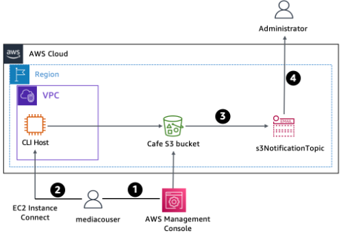
</div>

---

## 📝 Desarrollo

### Tarea 1: Conexión al CLI Host y configuración del AWS CLI

#### Paso 1.1: Conectarte al EC2 CLI Host

1. Abre la **AWS Management Console**.
2. Busca y selecciona **EC2**.
3. En el panel izquierdo, elige **Instancias**.
4. Selecciona la instancia llamada **CLI Host**.
5. Haz clic en **Conectar**.
6. En la pestaña **EC2 Instance Connect**, selecciona **Conectar**.
7. Verifica que el terminal se abra correctamente en tu navegador.

#### Paso 1.2: Configurar AWS CLI

En el terminal del EC2 CLI Host, ejecuta:

```bash
aws configure
```

Ingresa los valores que copiaste desde el panel de credenciales:

- **AWS Access Key ID**:
- **AWS Secret Access Key**:
- **Default region name**: `us-west-2`
- **Default output format**: `json`

Verifica la configuración con:

```bash
aws sts get-caller-identity
```

Si el comando devuelve tu ARN y cuenta, estás listo.

<div align="center">
  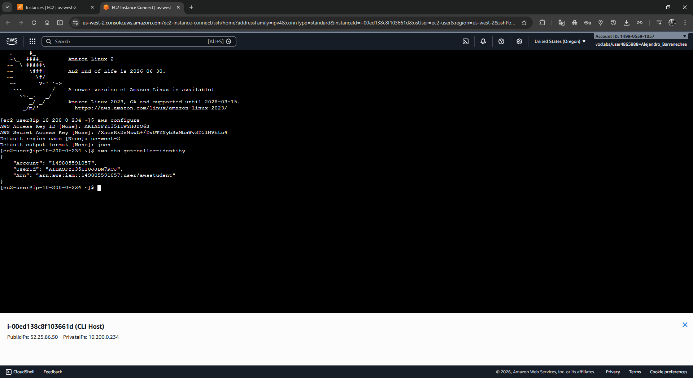
</div>
---

### Tarea 2: Crear e inicializar el bucket S3 de intercambio

#### Paso 2.1: Crear el bucket S3

En el terminal, crea un bucket con un nombre único que empiece con `cafe-`:

```bash
aws s3 mb s3://cafe-xxxnnn --region us-west-2
```

Asegúrate de reemplazar `cafe-xxxnnn` por un nombre único y en minúsculas.

#### Paso 2.2: Cargar las imágenes iniciales

Sincroniza el contenido de la carpeta `~/initial-images/` al prefijo `images/` del bucket:

```bash
aws s3 sync ~/initial-images/ s3://cafe-xxxnnn/images
```

#### Paso 2.3: Verificar la carga

Verifica que los archivos existen en el bucket:

```bash
aws s3 ls s3://cafe-xxxnnn/images/ --human-readable --summarize
```

Espera un listado con la cantidad de archivos y el tamaño total.

<div align="center">
  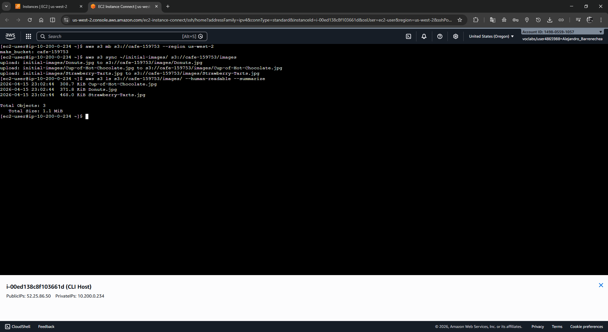
</div>

---

### Tarea 3: Revisar permisos del grupo y usuario IAM

#### Paso 3.1: Revisar el grupo IAM `mediaco`

1. En la consola de AWS, busca y selecciona **IAM**.
2. En el panel izquierdo, elige **User groups**.
3. Selecciona el grupo `mediaco`.
4. En la pestaña **Permissions**, expande la política `IAMUserChangePassword` y revisa su propósito.
5. Expande la política `mediaCoPolicy`.

Revisa que contiene las declaraciones clave:
- `AllowGroupToSeeBucketListInTheConsole` permite ver buckets en la consola.
- `AllowRootLevelListingOfTheBucket` permite ver objetos de primer nivel en el bucket.
- `AllowUserSpecificActionsOnlyInTheSpecificPrefix` permite `GetObject`, `PutObject` y `DeleteObject` en `cafe-*/images/*`.

<div align="center">
  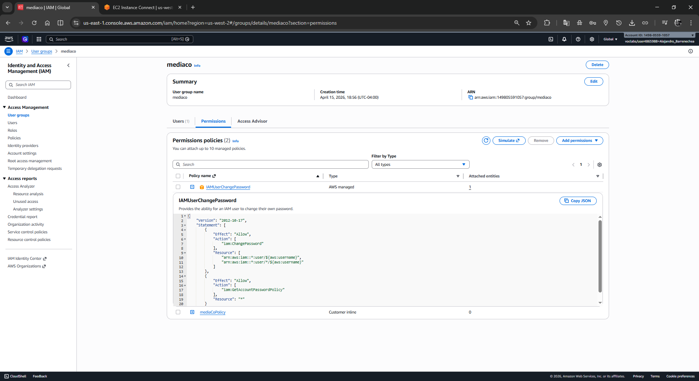
</div>
<div align="center">
  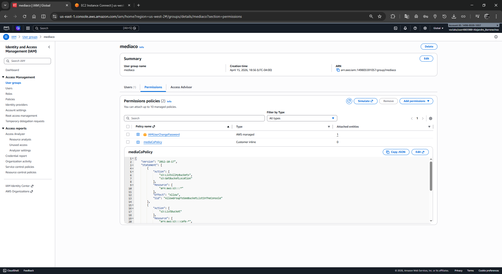
</div>

#### Paso 3.2: Revisar el usuario IAM `mediacouser`

1. En IAM, elige **Users**.
2. Selecciona `mediacouser`.
3. En la pestaña **Permissions**, verifica que hereda `IAMUserChangePassword` y `mediaCoPolicy` desde el grupo `mediaco`.

<div align="center">
  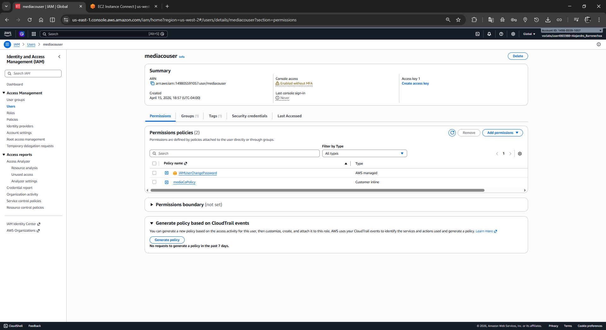
</div>

4. En la pestaña **Groups**, confirma que `mediacouser` es miembro de `mediaco`.

<div align="center">
  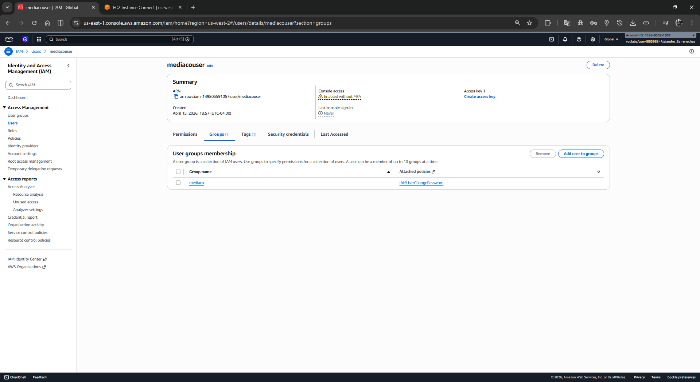
</div>

#### Paso 3.3: Crear credenciales para `mediacouser`

1. Ve a la pestaña **Security credentials** de `mediacouser`.
2. En la sección **Access keys**, elige **Create access key**.
3. Selecciona **Command Line Interface (CLI)**.
4. Marca la casilla de confirmación y elige **Next**.
5. Elige **Create access key**.

<div align="center">
  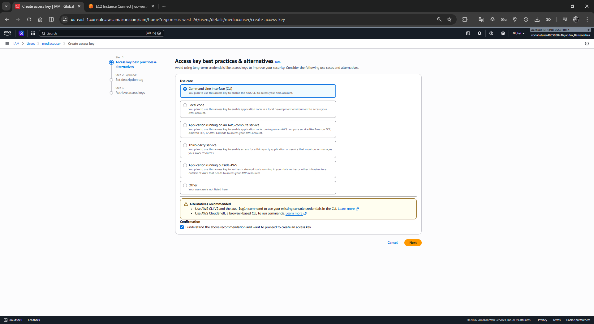
</div>

6. Descarga el archivo `.csv`.

<div align="center">
  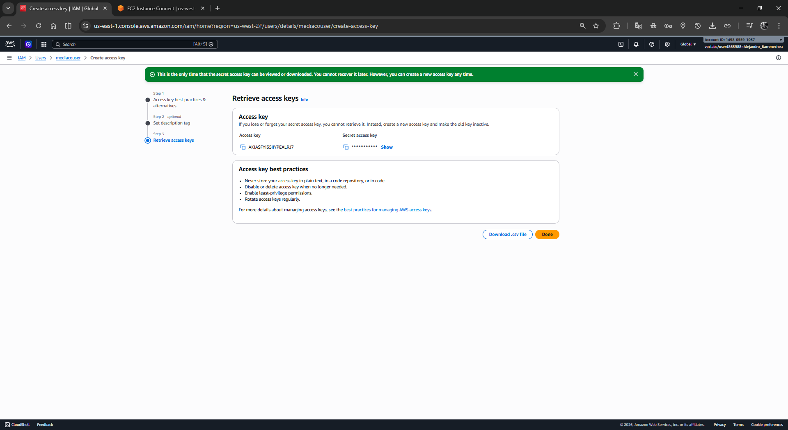
</div>

7. Copia el enlace de inicio de sesión de la consola para el usuario `mediacouser`.

<div align="center">
  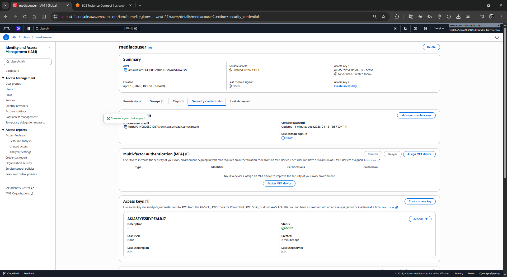
</div>

#### Paso 3.4: Probar permisos de `mediacouser` en la consola

1. Abre un navegador diferente o una ventana de incógnito.
2. Ingresa el enlace de inicio de sesión de `mediacouser`.
3. Usa las credenciales:
   - **IAM user name**: `mediacouser`
   - **Password**: `Training1!`

<div align="center">
  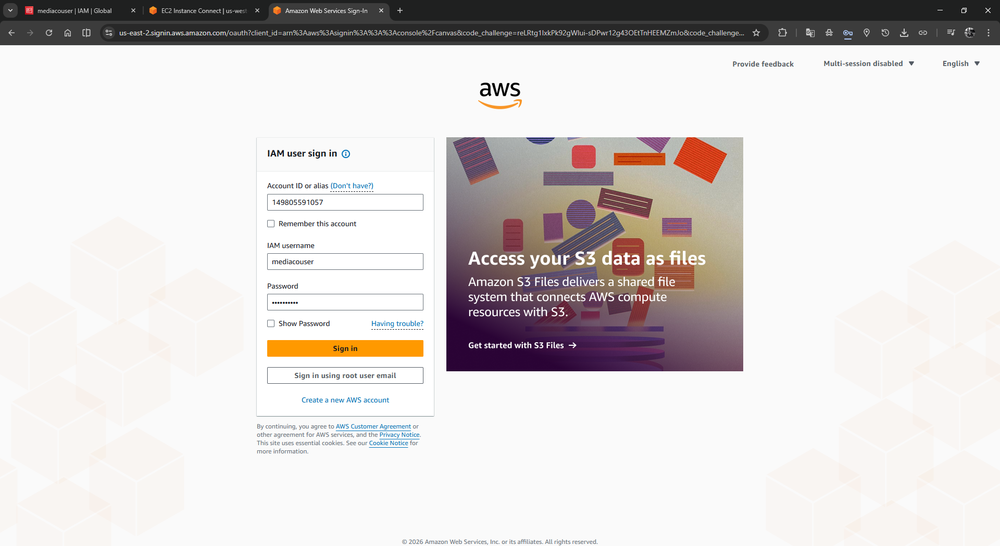
</div>

4. Abre el servicio **S3**.
5. Selecciona el bucket creado anteriormente.
6. Navega al prefijo `images/`.

<div align="center">
  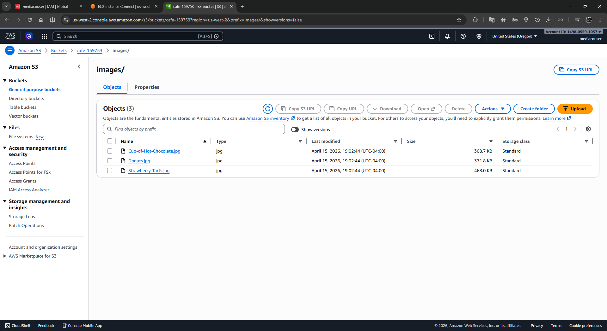
</div>

Prueba las operaciones de este usuario:
- Abrir `Donuts.jpg`.

<div align="center">
  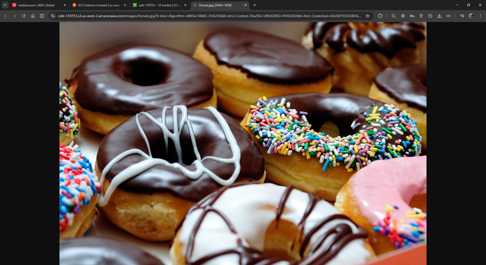
</div>

- Subir un archivo desde tu equipo.

<div align="center">
  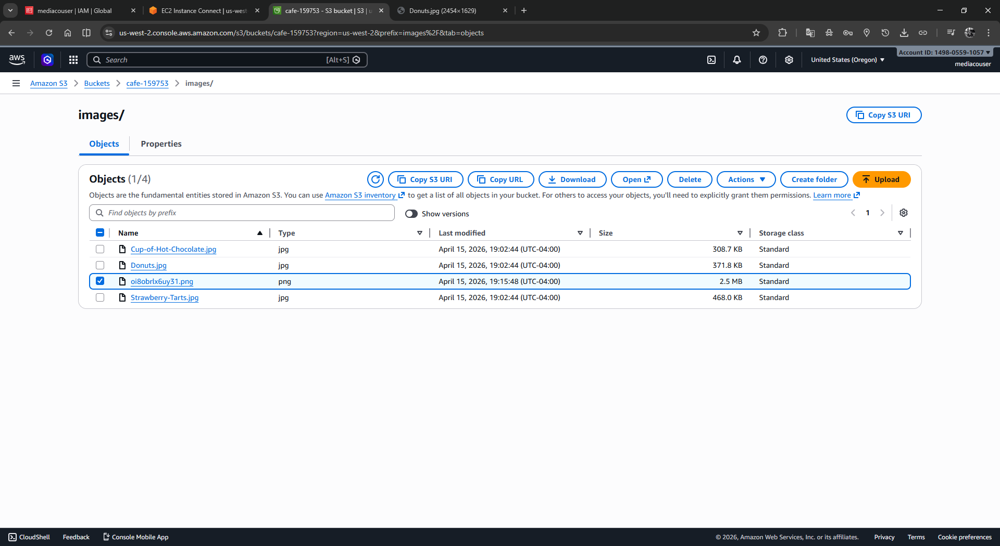
</div>

- Eliminar `Cup-of-Hot-Chocolate.jpg`.

<div align="center">
  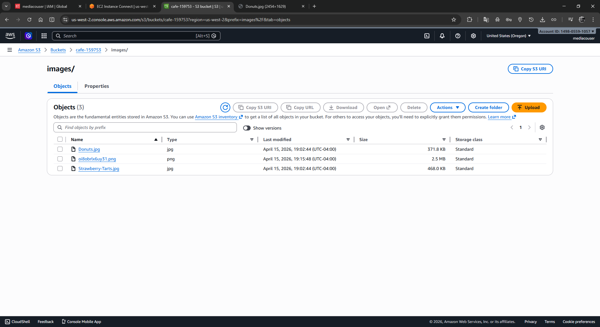
</div>

#### Paso 3.5: Verificar que `mediacouser` no puede cambiar permisos

Para confirmar que la política del grupo `mediaco` restringe correctamente las operaciones de administración de permisos:

1. En la consola de `mediacouser`, selecciona nuevamente el bucket `cafe-xxxnnn`.
2. Haz clic en la pestaña **Permissions**.
3. Intenta modificar cualquier configuración de permiso (por ejemplo, en la sección **Block public access** o **Bucket policy**).
4. Observa que aparece un mensaje de error: **Insufficient permissions** o similar.

<div align="center">
  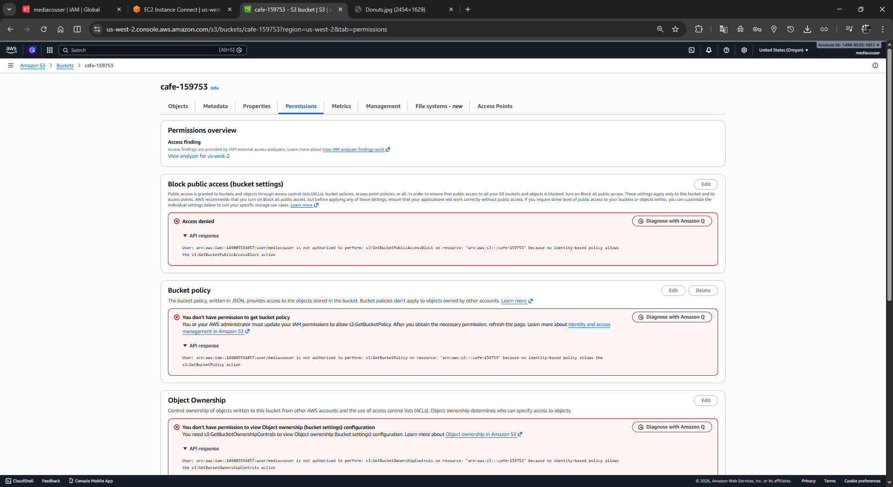
</div>

Este comportamiento confirma que `mediacouser` solo tiene permisos de lectura/escritura de datos (`GetObject`, `PutObject`, `DeleteObject`) pero **no tiene permisos administrativos** para cambiar la configuración de acceso del bucket.

---

### Tarea 4: Configurar notificaciones de eventos en el bucket S3

#### Paso 4.1: Crear el tópico SNS `s3NotificationTopic`

1. En la consola de AWS, busca y selecciona **SNS**.
2. En el panel izquierdo, elige **Topics**.
3. Elige **Create topic**.
4. Selecciona **Standard**.
5. Para **Name**, ingresa `s3NotificationTopic`.
6. Elige **Create topic**.

<div align="center">
  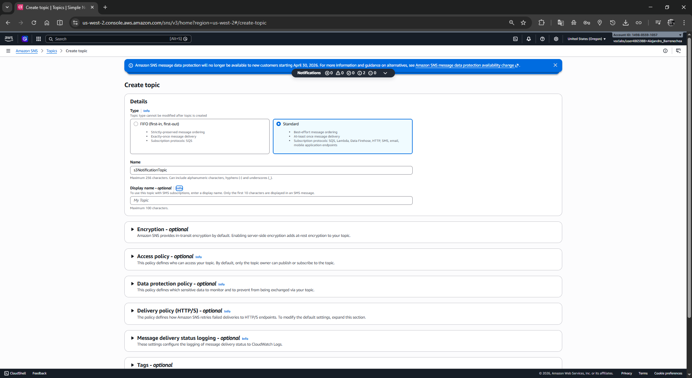
</div>

Copia el ARN del tópico y guárdalo en un editor.

<div align="center">
  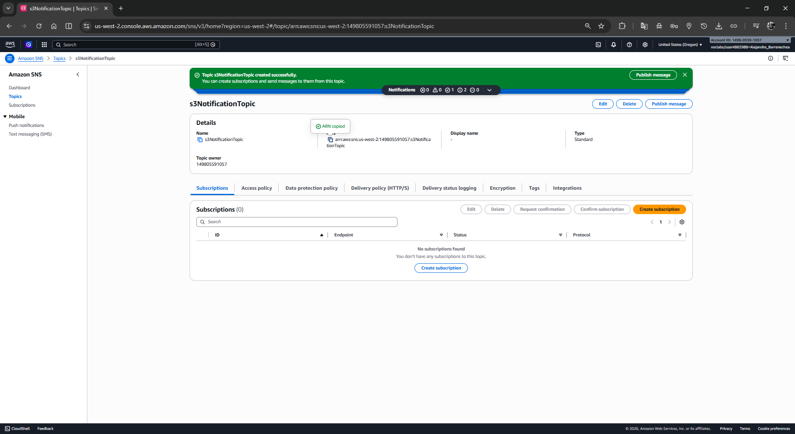
</div>

#### Paso 4.2: Configurar la política de acceso del tópico SNS

1. En la página del tópico, elige **Edit**.
2. Expande **Access policy - optional**.
3. Reemplaza el contenido JSON con lo siguiente:

```json
{
  "Version": "2008-10-17",
  "Id": "S3PublishPolicy",
  "Statement": [
    {
      "Sid": "AllowPublishFromS3",
      "Effect": "Allow",
      "Principal": {
        "Service": "s3.amazonaws.com"
      },
      "Action": "SNS:Publish",
      "Resource": "<ARN of s3NotificationTopic>",
      "Condition": {
        "ArnLike": {
          "aws:SourceArn": "arn:aws:s3:*:*:cafe-xxxnnn"
        }
      }
    }
  ]
}
```

Reemplaza ` <ARN of s3NotificationTopic>` por el ARN real del tópico y `cafe-xxxnnn` por el nombre de tu bucket.

<div align="center">
  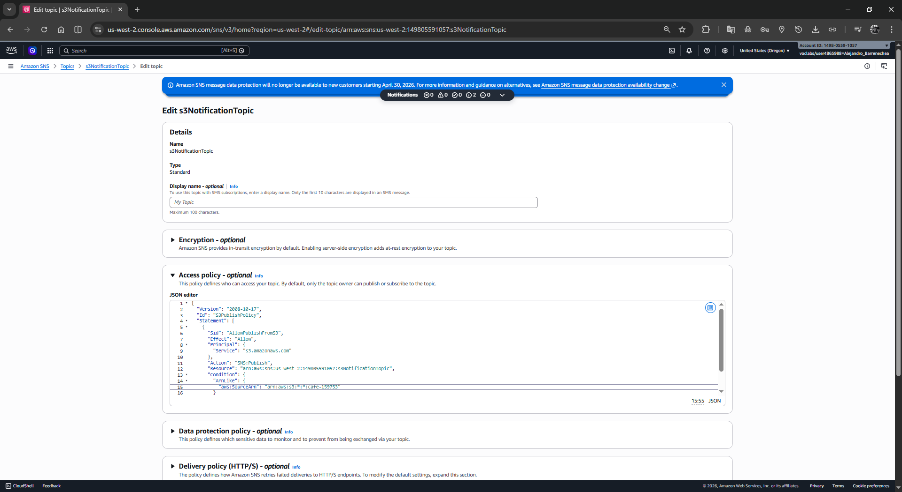
</div>

4. Elige **Save changes**.

#### Paso 4.3: Suscribirte al tópico SNS

1. En la página del tópico, selecciona la pestaña **Subscriptions**.
2. Elige **Create subscription**.
3. En **Topic ARN**, selecciona `s3NotificationTopic`.
4. En **Protocol**, elige **Email**.
5. En **Endpoint**, ingresa un correo accesible.
6. Elige **Create subscription**.

<div align="center">
  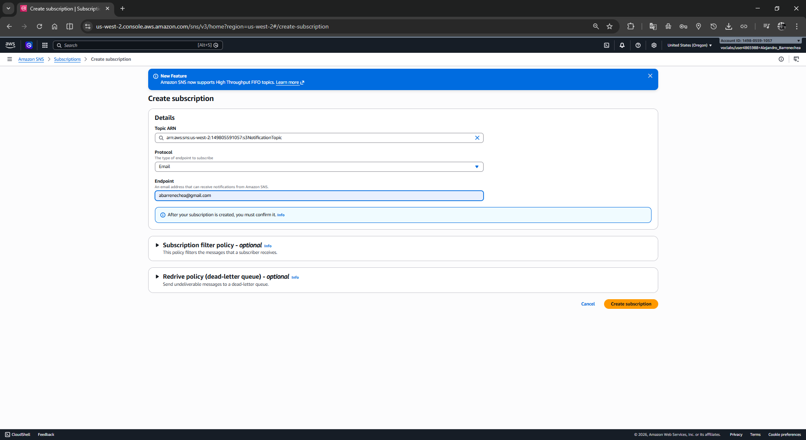
</div>

7. Revisa el correo y confirma la suscripción desde el mensaje de AWS.

<div align="center">
  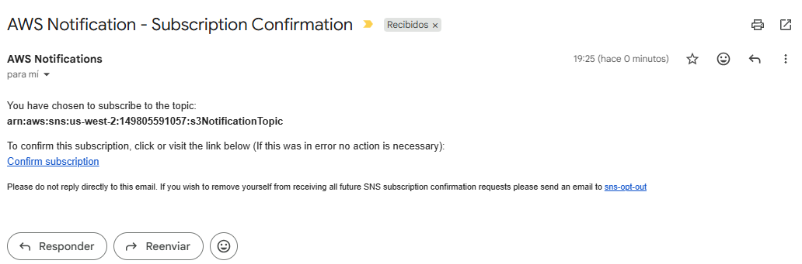
</div>
<div align="center">
  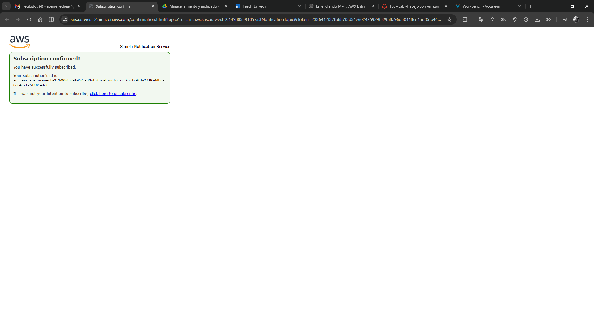
</div>

#### Paso 4.4: Configurar la notificación de eventos del bucket

En el terminal del CLI Host, crea el archivo `s3EventNotification.json` usando el comando `cat` con heredoc. Esta es una forma más práctica que abrir un editor:

```bash
cat > s3EventNotification.json << 'EOF'
{
  "TopicConfigurations": [
    {
      "TopicArn": "arn:aws:sns:us-west-2:ACCOUNT-ID:s3NotificationTopic",
      "Events": ["s3:ObjectCreated:*","s3:ObjectRemoved:*"],
      "Filter": {
        "Key": {
          "FilterRules": [
            {
              "Name": "prefix",
              "Value": "images/"
            }
          ]
        }
      }
    }
  ]
}
EOF
```

**Antes de ejecutar el comando**, edita la línea del `TopicArn` y reemplaza `ACCOUNT-ID` por tu ID de cuenta de AWS real. Por ejemplo:

```bash
      "TopicArn": "arn:aws:sns:us-west-2:123456789012:s3NotificationTopic",
```

Para obtener tu ID de cuenta, ejecuta:

```bash
aws sts get-caller-identity --query Account --output text
```

Una vez que presiones Enter, el archivo se creará automáticamente. Verifica que el archivo fue creado correctamente:

```bash
cat s3EventNotification.json
```

<div align="center">
  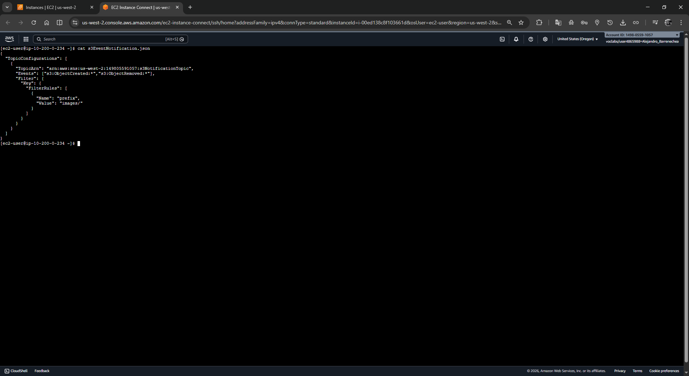
</div>

Ahora asocia la configuración al bucket:

```bash
aws s3api put-bucket-notification-configuration --bucket cafe-xxxnnn --notification-configuration file://s3EventNotification.json
```

Espera unos minutos y revisa tu correo; debes recibir una notificación de prueba de Amazon S3.

---

### Tarea 5: Probar las notificaciones de eventos

#### Paso 5.1: Configurar CLI con credenciales `mediacouser`

En el terminal del CLI Host, ejecuta de nuevo:

```bash
aws configure
```

Ingresa los valores del archivo `mediacouser_accessKeys.csv`:

- **AWS Access Key ID**: valor del `Access key ID`
- **AWS Secret Access Key**: valor del `Secret Access Key`
- **Default region name**: presiona Enter para conservar `us-west-2`
- **Default output format**: `json`

#### Paso 5.2: Probar creación de objeto

Sube la imagen de prueba desde `~/new-images/`:

```bash
aws s3api put-object --bucket cafe-xxxnnn --key images/Caramel-Delight.jpg --body ~/new-images/Caramel-Delight.jpg
```

Verifica en el buzón de correo que recibiste una notificación de SNS con `eventName` `ObjectCreated:Put`.

#### Paso 5.3: Probar lectura de objeto

Descarga el objeto `Donuts.jpg` para verificar el acceso de lectura:

```bash
aws s3api get-object --bucket cafe-xxxnnn --key images/Donuts.jpg Donuts.jpg
```

Nota que esta operación no genera notificación, porque la configuración solo publica eventos de creación y eliminación.

#### Paso 5.4: Probar eliminación de objeto

Elimina la imagen `Strawberry-Tarts.jpg`:

```bash
aws s3api delete-object --bucket cafe-xxxnnn --key images/Strawberry-Tarts.jpg
```

Revisa el correo: debes recibir una notificación con `eventName` `ObjectRemoved:Delete`.

#### Paso 5.5: Probar operación no autorizada

Intenta cambiar el ACL del objeto `Donuts.jpg`:

```bash
aws s3api put-object-acl --bucket cafe-xxxnnn --key images/Donuts.jpg --acl public-read
```

<div align="center">
  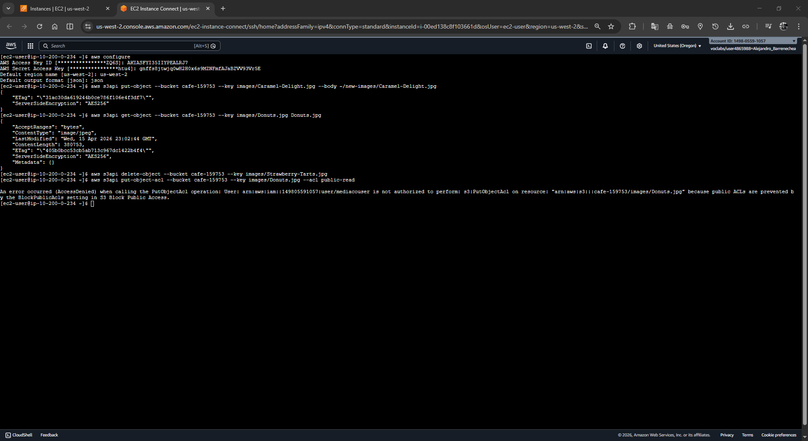
</div>

Debes ver el error esperado `AccessDenied`, lo que confirma que `mediacouser` no tiene permiso para modificar ACLs.

---

## 🧠 Respuestas Analíticas a Preguntas Implícitas

### ¿Por qué se crea el bucket con el prefijo `cafe-`?

Porque el laboratorio exige un nombre de bucket único y reconocible, y el prefijo `cafe-` facilita la asociación con el caso de uso del café.

### ¿Por qué se usa `images/` como prefijo?

Para organizar los archivos del bucket y limitar los permisos de usuario a un objeto específico dentro de ese prefijo.

### ¿Por qué el usuario `mediacouser` no puede cambiar permisos?

La política del grupo `mediaco` está diseñada para otorgar solo operaciones de datos (`GetObject`, `PutObject`, `DeleteObject`) y no operaciones de administración de permisos.

---

## ✅ Lista de Verificación de Completitud

Antes de finalizar, verifica los siguientes elementos:

- [ ] Conexión exitosa al CLI Host EC2
- [ ] AWS CLI configurado con las credenciales iniciales
- [ ] Bucket S3 creado con nombre único y prefijo `cafe-`
- [ ] Imágenes sincronizadas en `s3://cafe-xxxnnn/images/`
- [ ] Revisión del grupo `mediaco` y del usuario `mediacouser`
- [ ] Credenciales de `mediacouser` creadas y almacenadas
- [ ] Usuario `mediacouser` pudo ver, subir y eliminar imágenes
- [ ] SNS `s3NotificationTopic` creado y suscripción confirmada
- [ ] Configuración de notificación de eventos aplicada al bucket
- [ ] Notificaciones recibidas para creación y eliminación de objetos
- [ ] Operación de cambio de ACL denegada para `mediacouser`

---

## 🎓 Conclusión

Has completado con éxito el laboratorio de trabajo con Amazon S3. Has creado un bucket seguro, verificado permisos de usuario y configurado notificaciones automáticas de eventos con SNS.
