# ☁️ Monitoreo de Infraestructura en AWS
**Dificultad:** 🟡 Intermedia  
**Tiempo Estimado:** ⏱️ 60 Minutos  
**Servicios Principales:** 🛠️ Amazon CloudWatch, AWS Systems Manager (SSM), Amazon EC2, Amazon SNS, AWS Config, Amazon EventBridge (CloudWatch Events).

## 📝 Resumen y Objetivos
La capacidad de monitorear aplicaciones e infraestructura es crítica para entregar servicios de TI confiables. Este laboratorio te guiará en la implementación de un ecosistema de monitoreo y auditoría completo.
Al finalizar esta práctica, serás capaz de:
* Instalar el agente de CloudWatch en instancias Amazon EC2 mediante AWS Systems Manager (Run Command).
* Monitorear logs de aplicaciones y crear filtros de métricas usando CloudWatch Logs.
* Analizar métricas a nivel de sistema operativo usando CloudWatch Metrics.
* Configurar notificaciones en tiempo real ante cambios de estado en instancias usando Amazon EventBridge.
* Auditar el cumplimiento de la infraestructura de forma continua mediante AWS Config.

## 🔎 Análisis del Escenario
El cliente requiere visibilidad profunda sobre el rendimiento de sus servidores web y sus aplicaciones. Las métricas predeterminadas de EC2 no son suficientes, ya que no proporcionan información sobre el uso de memoria RAM, espacio en disco ni los errores internos del servidor web (como errores 404). Además, por políticas de seguridad y gobernanza, el cliente necesita ser alertado inmediatamente si un servidor se detiene, y requiere un sistema automatizado que audite si los recursos creados cumplen con las normas de etiquetado (Tags) de la empresa y si existen discos (EBS) huérfanos generando costos.

## 🏗️ Arquitectura
1. **AWS Systems Manager (SSM)** actúa como orquestador para inyectar y configurar el Agente de CloudWatch de forma remota en la instancia EC2 (Web Server).
2. El **Agente de CloudWatch** extrae logs de Apache (`access_log`, `error_log`) y métricas del sistema operativo (RAM, Disco) enviándolos hacia **CloudWatch Logs** y **CloudWatch Metrics** respectivamente.
3. Un **Filtro de Métricas** escanea los logs en busca de errores HTTP 404 y dispara una **Alarma de CloudWatch** si se supera el umbral, enviando un correo mediante **Amazon SNS**.
4. **Amazon EventBridge** intercepta los cambios de estado de la instancia EC2 (Parada/Terminada) y notifica vía SNS.
5. **AWS Config** escanea la cuenta de AWS evaluando reglas predefinidas (Etiquetas obligatorias e instancias EBS en uso).

---

## 🚀 Desarrollo de las Tareas

### Tarea 1: Instalación del agente de CloudWatch usando SSM
Para recopilar métricas a nivel de sistema operativo y logs de aplicaciones, debes instalar un agente dentro de la instancia.

**Ejecución de la instalación:**
1. **Navega** a la consola de **AWS Systems Manager**.
2. En el panel de navegación izquierdo, **haz clic** en **Run Command**. *(Si no ves el panel, haz clic en el icono de menú superior izquierdo).*
3. **Haz clic** en **Run a command**.
4. En la barra de búsqueda, busca y **selecciona** el botón de opción junto a `AWS-ConfigureAWSPackage`.

<div align="center">
  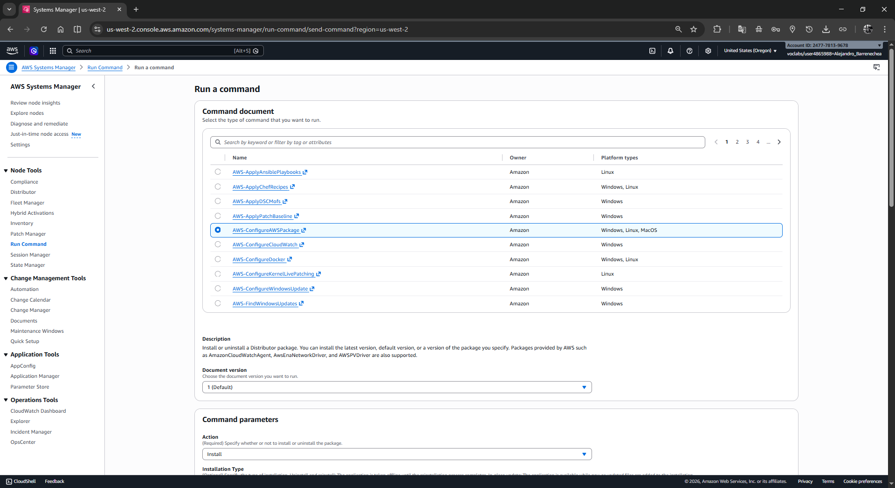
</div>

5. Desplázate a la sección *Command parameters* y **configura** lo siguiente:
   * **Action:** Selecciona **Install**.
   * **Name:** Escribe `AmazonCloudWatchAgent`
   * **Version:** Escribe `latest`
6. En la sección *Targets*, **selecciona** la opción **Choose instances manually**.
7. En la lista de instancias, **marca** la casilla junto a **Web Server**.
8. Desplázate al final de la página y **haz clic** en **Run**.
9.  **Espera** hasta que el estado general cambie a *Success*.

<div align="center">
  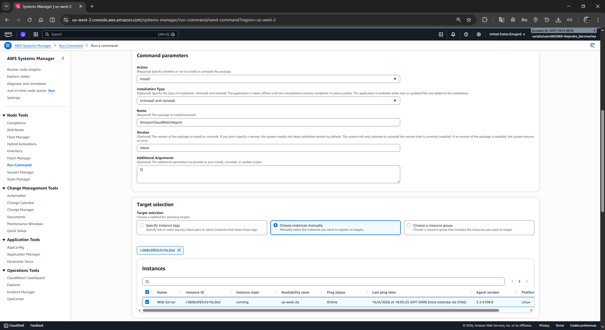
</div>
<div align="center">
  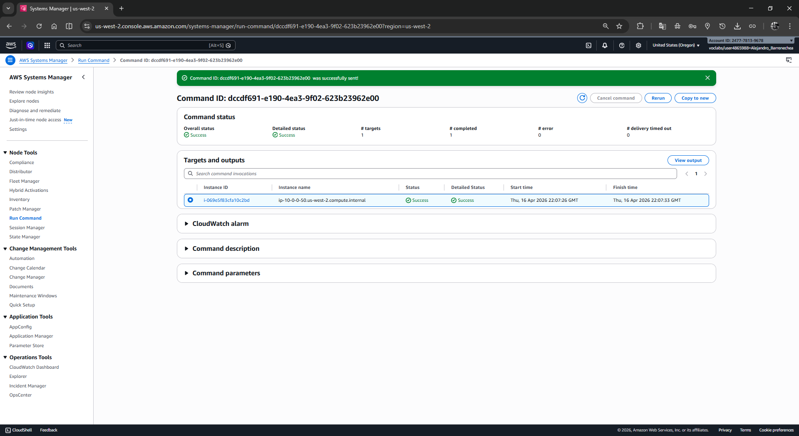
</div>

**Configuración del Agente vía Parameter Store:**
1. En el panel izquierdo de Systems Manager, **haz clic** en **Parameter Store**.
2. **Haz clic** en **Create parameter** y **configura** los siguientes datos:
   * **Name:** Escribe `Monitor-Web-Server`
   * **Description:** Escribe `Collect web logs and system metrics`
   * **Tier:** Standard (por defecto).
   * **Type:** String (por defecto).
   * **Value:** Copia y pega el siguiente bloque JSON:

```json
{
  "logs": {
    "logs_collected": {
      "files": {
        "collect_list": [
          {
            "log_group_name": "HttpAccessLog",
            "file_path": "/var/log/httpd/access_log",
            "log_stream_name": "{instance_id}",
            "timestamp_format": "%b %d %H:%M:%S"
          },
          {
            "log_group_name": "HttpErrorLog",
            "file_path": "/var/log/httpd/error_log",
            "log_stream_name": "{instance_id}",
            "timestamp_format": "%b %d %H:%M:%S"
          }
        ]
      }
    }
  },
  "metrics": {
    "metrics_collected": {
      "cpu": {
        "measurement": ["cpu_usage_idle", "cpu_usage_iowait", "cpu_usage_user", "cpu_usage_system"],
        "metrics_collection_interval": 10,
        "totalcpu": false
      },
      "disk": {
        "measurement": ["used_percent", "inodes_free"],
        "metrics_collection_interval": 10,
        "resources": ["*"]
      },
      "diskio": {
        "measurement": ["io_time"],
        "metrics_collection_interval": 10,
        "resources": ["*"]
      },
      "mem": {
        "measurement": ["mem_used_percent"],
        "metrics_collection_interval": 10
      },
      "swap": {
        "measurement": ["swap_used_percent"],
        "metrics_collection_interval": 10
      }
    }
  }
}
```

<div align="center">
  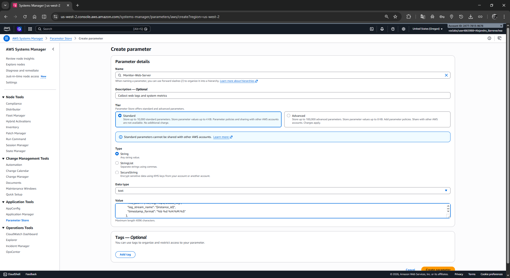
</div>

3. **Haz clic** en **Create parameter**.

**Inicio del Agente de CloudWatch:**
1. En el panel izquierdo, **regresa** a **Run Command** y **haz clic** en **Run command**.
2. En la barra de búsqueda, **haz clic** en la caja y **selecciona**: `Document name prefix` -> `Equals` -> Escribe `AmazonCloudWatch-ManageAgent` y presiona **Enter**.
3. **Selecciona** el botón de opción junto a `AmazonCloudWatch-ManageAgent`.
4. En *Command parameters*, **configura** lo siguiente:
   * **Action:** Selecciona **configure**.
   * **Mode:** Selecciona **ec2**.
   * **Optional Configuration Source:** Selecciona **ssm**.
   * **Optional Configuration Location:** Escribe `Monitor-Web-Server`
   * **Optional Restart:** Selecciona **yes**.

<div align="center">
  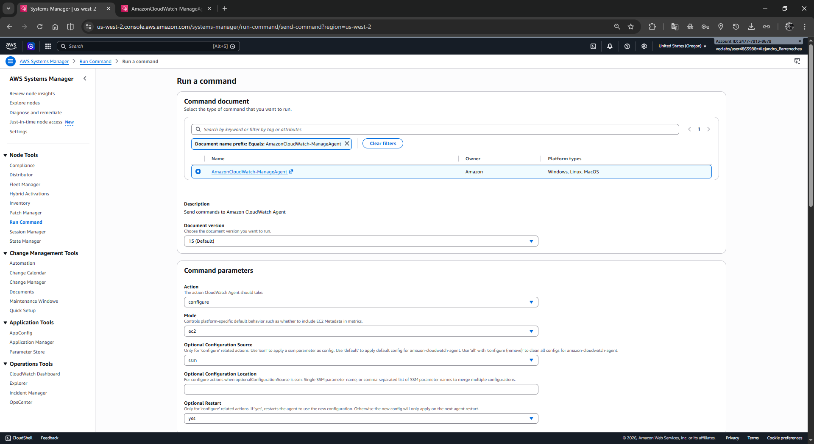
</div>

5. En la sección *Targets*, **selecciona** **Choose instances manually** y **marca** el servidor **Web Server**.

<div align="center">
  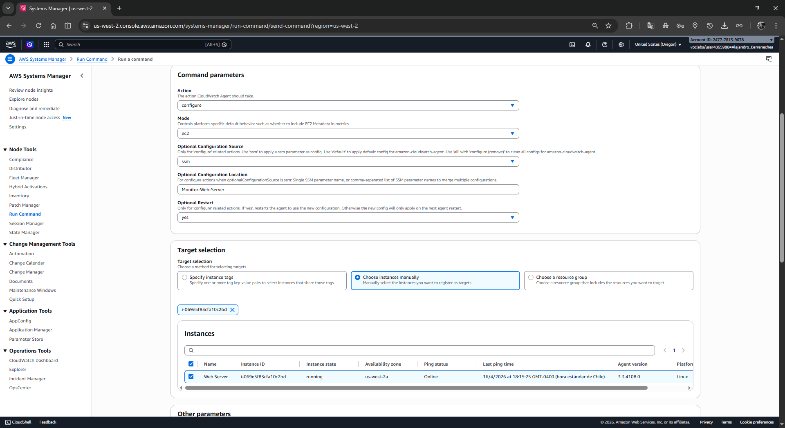
</div>

6. **Haz clic** en **Run** y **espera** a que el estado cambie a *Success*.

<div align="center">
  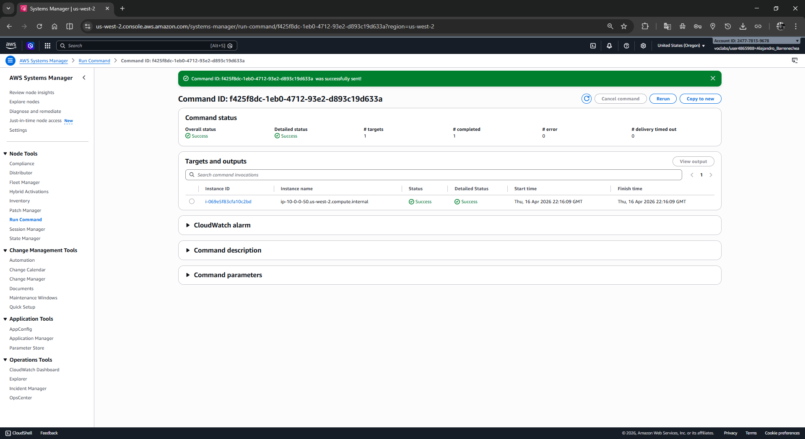
</div>

### Tarea 2: Monitoreo de logs de aplicaciones usando CloudWatch Logs
Generarás tráfico web falso para que el agente envíe logs a CloudWatch.

**Generación de Logs:**
1. **Obtén** la IP pública del Web Server (de las instrucciones del laboratorio o desde la consola EC2).
2. **Abre** una nueva pestaña en tu navegador, pega la IP y presiona **Enter**. Verás una página de prueba.

<div align="center">
  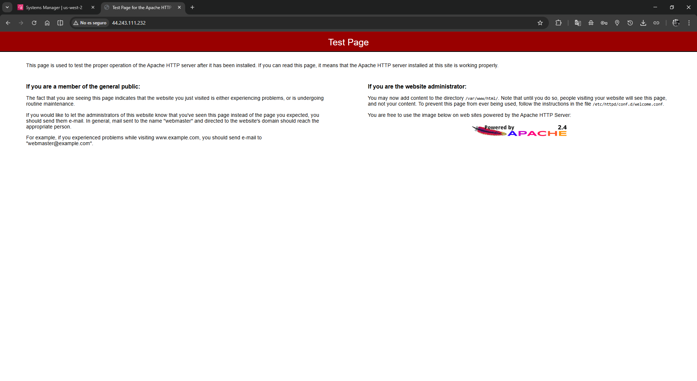
</div>

3. Al final de la URL, **añade** `/start` (ej. `http://[IP-DEL-SERVIDOR]/start`) y presiona **Enter**.
4. Recibirás un error 404. Esto es correcto, acabas de generar un evento en el log de acceso web.

<div align="center">
  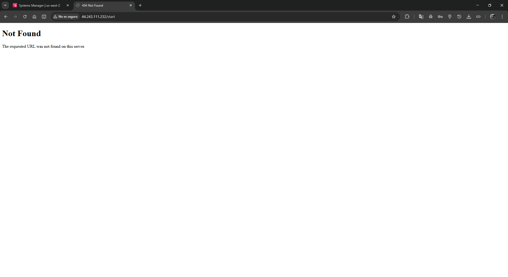
</div>

**Creación de un Filtro de Métricas:**
1. **Navega** a la consola de **CloudWatch**.
2. En el panel izquierdo, bajo *Logs*, **haz clic** en **Log groups**.

<div align="center">
  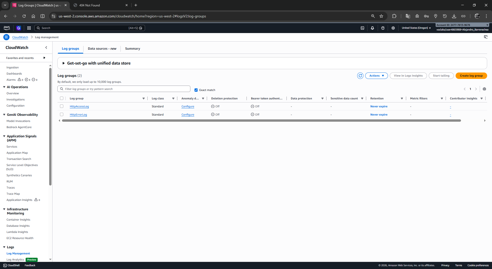
</div>

3. **Marca** la casilla de verificación junto a `HttpAccessLog`.
4. En el menú desplegable de *Actions*, **selecciona** **Create metric filter**.
5. En la caja de *Filter pattern*, **escribe** exactamente la siguiente línea:
   ```text
   [ip, id, user, timestamp, request, status_code=404, size]
   ```
6. En la sección *Test pattern*, **selecciona** el ID de la instancia EC2 en el menú desplegable y **haz clic** en **Test pattern**. (Deberías ver el error 404 que generaste).

<div align="center">
  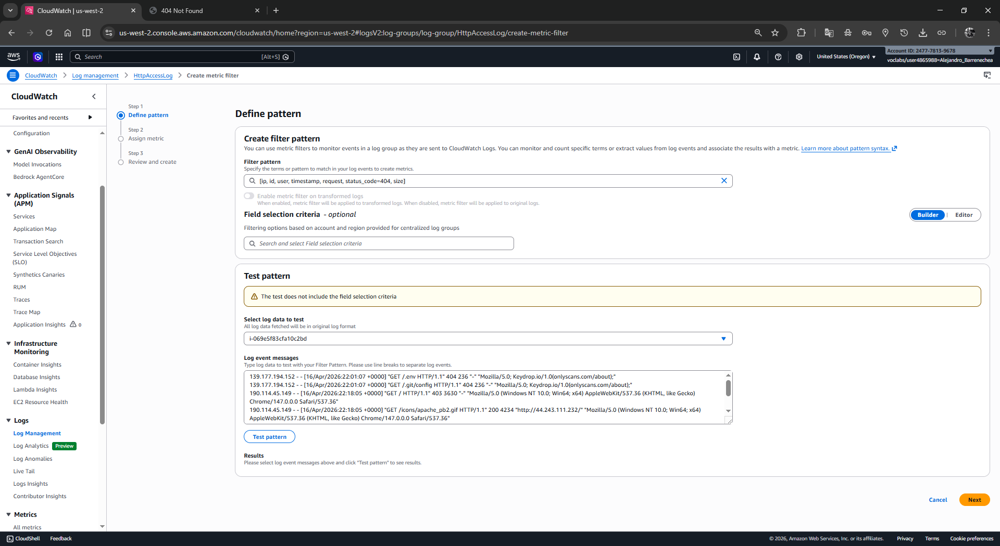
</div>
<div align="center">
  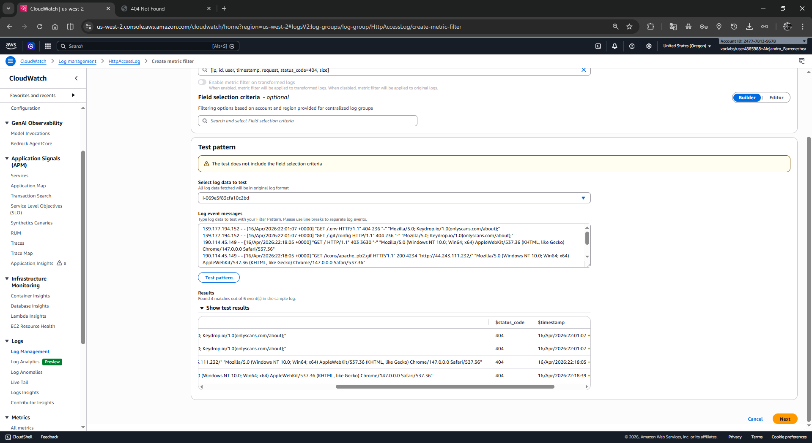
</div>

7. **Haz clic** en **Next**.
8. En *Filter name*, **escribe** `404Errors`.
9.  En *Metric details*, **configura**:
   * **Metric namespace:** `LogMetrics`
   * **Metric name:** `404Errors`
   * **Metric value:** `1`

<div align="center">
  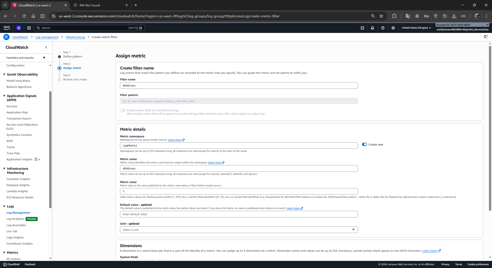
</div>

10. **Haz clic** en **Next** y luego en **Create metric filter**.

<div align="center">
  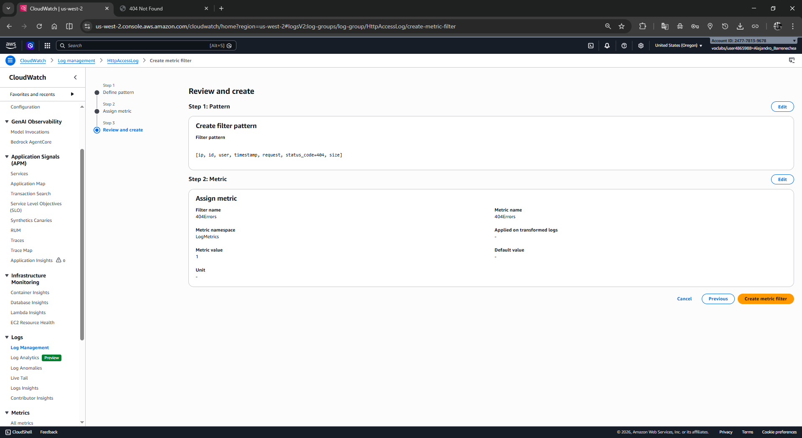
</div>

**Creación de la Alarma:**
1. En la pantalla del filtro creado, **selecciona** la casilla de verificación del filtro `404Errors` y **haz clic** en **Create alarm**.

<div align="center">
  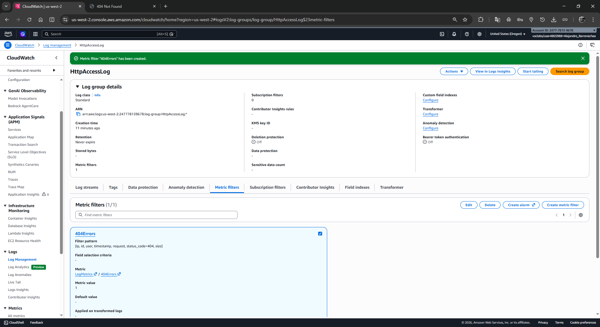
</div>

2. En *Metrics*, para *Period*, **selecciona** **1 minute**.
3. En *Conditions*, **configura**:
   * **Whenever 404Errors is:** Greater/Equal
   * **than:** Escribe `5`

<div align="center">
  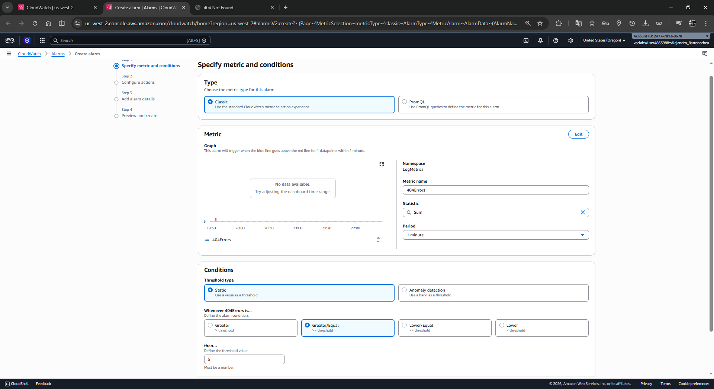
</div>

4. **Haz clic** en **Next**.
5. En *Notification*, **configura**:
   * Selecciona **Create new topic**.
   * **Email endpoints...:** Escribe tu correo electrónico personal.
   * **Haz clic** en **Create topic**.

<div align="center">
  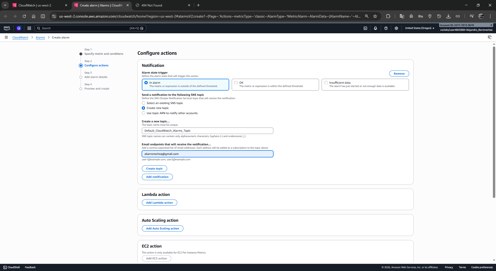
</div>

6. **Haz clic** en **Next**.
7. En *Alarm name*, **escribe** `404 Errors` y en *Description* `Alert when too many 404s detected on an instance`.

<div align="center">
  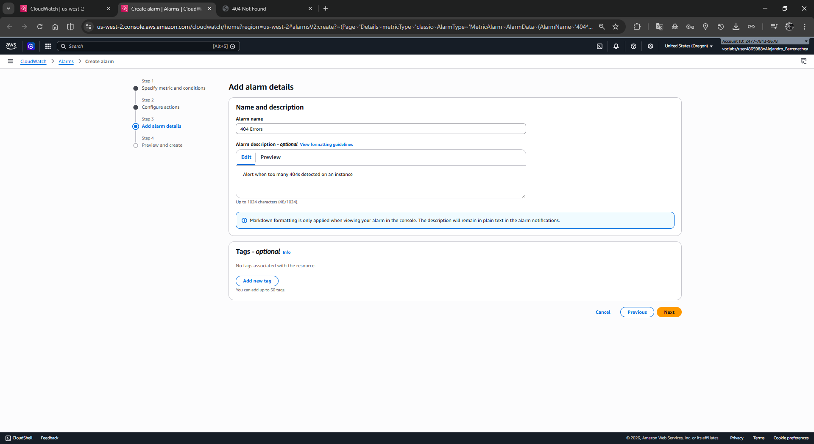
</div>

8. **Haz clic** en **Next** y luego en **Create alarm**.
9.  **Revisa** tu bandeja de entrada de correo electrónico y **haz clic** en el enlace **Confirm subscription**.

<div align="center">
  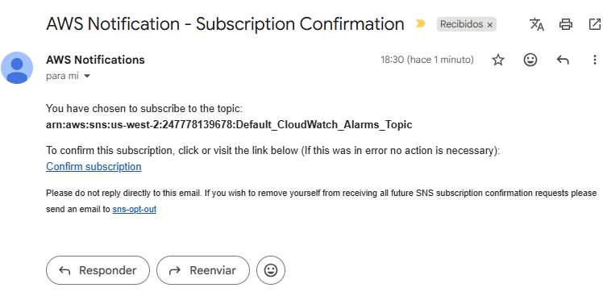
</div>

10. **Regresa** a la pestaña del servidor web y genera al menos 5 errores más (añadiendo rutas falsas como `/start2`, `/start3`). Espera 1-2 minutos hasta recibir el correo electrónico de alerta de CloudWatch.

### Tarea 3: Monitoreo de métricas de instancia usando CloudWatch
1. En la consola de **CloudWatch**, en el panel izquierdo expande **Metrics** y **haz clic** en **All metrics**.
2. Bajo *Custom Namespaces*, **haz clic** en **CWAgent**.
3. **Selecciona** `device, fstype, host, path`. Aquí podrás ver las métricas de espacio en disco que el agente está capturando.
4. En la miga de pan superior (All > CWAgent > ...), **haz clic** en **CWAgent** y luego selecciona **host** para ver las métricas de memoria RAM del sistema.
5. **Selecciona** las casillas de verificación de estas métricas para graficarlas en la parte superior.

### Tarea 4: Creación de notificaciones en tiempo real
*(Nota: En la interfaz moderna de AWS, CloudWatch Events ha migrado a Amazon EventBridge).*

1. **Navega** a la consola de **Amazon EventBridge** (o desde CloudWatch > Events > Rules, serás redirigido).
2. En el panel izquierdo, **haz clic** en **Rules** y luego en **Create rule**.
3. **Escribe** en Name `Instance_Stopped_Terminated`.
4. Deja seleccionado *Rule with an event pattern* y **haz clic** en **Next**.
5. En *Event pattern*, **configura**:
   * **Event source:** AWS Services
   * **AWS service:** EC2
   * **Event type:** EC2 Instance State-change Notification
   * Selecciona **Specific state(s)** y elige `stopped` y `terminated`.
6. **Haz clic** en **Next**.
7. En *Select target(s)*, **configura**:
   * **Target types:** AWS service
   * **Select a target:** SNS topic
   * **Topic:** Selecciona el topic creado anteriormente (ej. `Default_CloudWatch_Alarms_Topic`).
8. **Haz clic** en **Next** hasta llegar al final y **haz clic** en **Create rule**.
9. Para probarlo, **navega** a la consola de **EC2**, selecciona tu **Web Server**, **haz clic** en *Instance state* y selecciona **Stop instance**. En unos minutos, recibirás un correo electrónico con el JSON del evento.

### Tarea 5: Monitoreo de cumplimiento de infraestructura usando AWS Config
1. **Navega** a la consola de **AWS Config**. (Si es la primera vez, haz clic en *Get started*, acepta los valores por defecto haciendo clic en *Next* repetidas veces y luego en *Confirm*).
2. En el panel izquierdo, **haz clic** en **Rules** y luego en **Add rule**.
3. En la barra de búsqueda de *AWS Managed Rules*, **escribe** `required-tags` y selecciona el botón junto a ella. **Haz clic** en **Next**.
4. En la sección *Parameters*, en el campo `tag1Key`, **escribe** `project` (borra cualquier valor existente).
5. **Haz clic** en **Next** y luego en **Add rule**.
6. **Haz clic** nuevamente en **Add rule**, busca `ec2-volume-inuse-check`, selecciónala y avanza hasta hacer clic en **Add rule**.
7. **Espera** unos minutos y refresca la pantalla. Al hacer clic sobre las reglas y filtrar por *Compliant* o *Noncompliant*, podrás auditar qué recursos de tu cuenta cumplen con la etiqueta obligatoria de proyecto y si tienes volúmenes EBS huérfanos.

---

## 🧠 Análisis y Respuestas a Preguntas del Laboratorio

* **Pregunta implícita en el diseño del Lab:** *Si AWS EC2 ya cuenta con monitoreo predeterminado mediante la pestaña "Monitoring", ¿por qué es obligatorio instalar el Agente de CloudWatch a través de SSM?*
* **Respuesta Analítica:** Las métricas nativas de EC2 actúan a nivel del hipervisor de AWS. Desde fuera, el hipervisor puede ver cuánto uso de CPU de procesamiento, tráfico de red o lectura/escritura de disco (I/O) tiene la máquina virtual. Sin embargo, el hipervisor no tiene permisos para inspeccionar el Sistema Operativo huésped; por lo tanto, no puede saber cuánta memoria RAM libre queda, o qué porcentaje del disco duro está lleno, ni mucho menos leer archivos de log (como los de Apache). Instalar el Agente de CloudWatch permite extraer telemetría interna y enviarla al plano de control de AWS para una visibilidad de 360 grados.

* **Pregunta implícita en el diseño del Lab:** *¿Cuál es la diferencia de enfoque entre usar CloudWatch Alarmas y Amazon EventBridge para ser notificado de eventos de instancias?*
* **Respuesta Analítica:** **CloudWatch Alarms** es reactivo basado en *umbrales estadísticos* o *patrones* que ocurren a lo largo de un período de tiempo (ej. "Avisame si hay más de 5 errores 404 en 1 minuto"). Por otro lado, **Amazon EventBridge (Events)** reacciona en *tiempo casi real* basándose en *cambios de estado* o invocaciones de APIs en el plano de control (ej. "Avisame en el milisegundo exacto en que alguien hace clic en Stop sobre esta instancia"). Ambos son fundamentales para una estrategia de seguridad completa.