# ☁️ Trabajo con AWS CloudTrail (Auditoría e Investigación de Seguridad)
**Dificultad:** 🔴 Avanzada  
**Tiempo Estimado:** ⏱️ 75 Minutos  
**Servicios Principales:** 🛠️ AWS CloudTrail, Amazon EC2, Amazon Athena, Amazon S3, AWS IAM, AWS CLI.

## 📝 Resumen y Objetivos
En esta práctica de nivel avanzado, actuarás como un analista de seguridad respondiendo a un incidente. Configurarás un rastro (trail) de auditoría y utilizarás múltiples herramientas de análisis para investigar un hackeo en vivo de un servidor web.
Al finalizar esta práctica, serás capaz de:
* Configurar un rastro en AWS CloudTrail para auditar la actividad de la cuenta.
* Analizar logs de CloudTrail desde la línea de comandos de Linux usando `grep` y procesadores JSON.
* Utilizar AWS CLI para buscar eventos específicos de CloudTrail.
* Importar y consultar logs masivos mediante lenguaje SQL en Amazon Athena.
* Remediar vulnerabilidades a nivel de sistema operativo (Linux) y de red (Security Groups) para expulsar al atacante y asegurar el entorno.

## 🔎 Análisis del Escenario
El equipo directivo del "Café" ha reportado que su sitio web ha sido alterado (defacement). Los administradores realizan cambios frecuentes, pero esta vez un usuario no autorizado ha vulnerado la seguridad del servidor. Tu misión como Ingeniero Cloud es implementar trazabilidad inmediata, identificar cómo entró el atacante, qué usuario de AWS comprometió la red, expulsarlo del servidor y revertir los daños.

## 🏗️ Arquitectura
1. **Amazon EC2 & Security Groups:** El servidor web Apache reside en una instancia EC2 protegida por un grupo de seguridad (`sg-02b80909cfccf5861`). El atacante manipula este grupo para abrir el puerto 22 a todo internet (`0.0.0.0/0`).
2. **AWS CloudTrail & Amazon S3:** CloudTrail captura cada llamada a la API de AWS (incluyendo el cambio malicioso en el Security Group) y guarda los logs en formato JSON comprimido dentro de un bucket de S3.
3. **Amazon Athena:** Se utiliza para montar una tabla virtual sobre los logs de S3, permitiendo ejecutar consultas SQL estructuradas para encontrar rápidamente la "aguja en el pajar".
4. **Sistema Operativo Linux:** El atacante explota una mala configuración del servicio SSH (`PasswordAuthentication yes`) para entrar sin llave criptográfica como el usuario `chaos-user`.

<div align="center">
  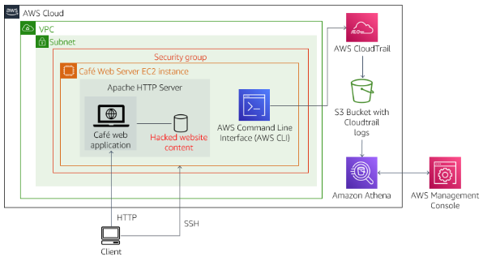
</div>

---

## 🚀 Desarrollo

### Tarea 1: Modificación del grupo de seguridad y observación inicial
Primero, asegurarás tu propio acceso legítimo al servidor web.

1. **Navega** a la consola de **EC2**.
2. En el panel izquierdo, **haz clic** en **Instances** y **selecciona** la instancia `Café Web Server`.
3. **Haz clic** en la pestaña **Security** en la parte inferior y **haz clic** en el enlace del grupo de seguridad (`sg-02b80909cfccf5861`).
4. **Haz clic** en la pestaña **Inbound rules** y luego en **Edit inbound rules**.
5. **Haz clic** en **Add rule** y **configura** lo siguiente:
   * **Type:** Selecciona **SSH**.
   * **Port Range:** `22`
   * **Source:** Selecciona **My IP** *(Esto restringirá el acceso SSH únicamente a tu dirección IP actual)*.
6. **Haz clic** en **Save rules**.

<div align="center">
  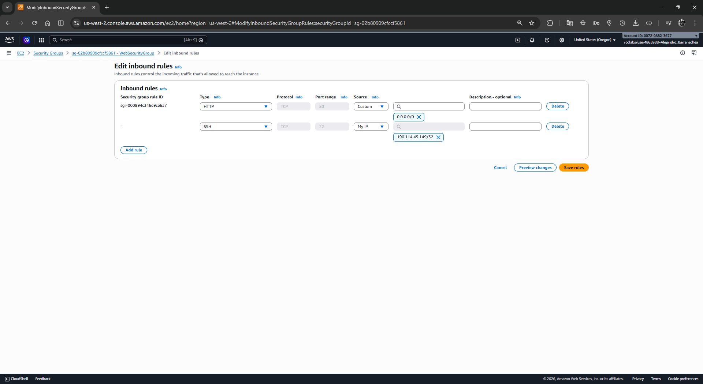
</div>

7. **Abre** una nueva pestaña en tu navegador y **navega** a la dirección del sitio web usando la IP proporcionada: `http://54.191.217.250/cafe/`. 
8. **Observa** que el sitio web se ve normal con imágenes de pastelería.

<div align="center">
  
</div>

### Tarea 2: Creación del rastro (Trail) y detección del hacke
1. **Navega** a la consola de **CloudTrail**.
2. En el panel izquierdo, **haz clic** en **Trails** y luego en **Create trail**.
3. **Configura** las opciones del rastro de la siguiente manera:
   * **Trail name:** Escribe `monitor` *(Debe llamarse exactamente así)*.
   * **Storage location:** Selecciona **Create a new S3 bucket**.
   * **Trail log bucket and folder:** Escribe `monitoring####` (reemplaza `####` con 4 números aleatorios únicos).
   * **AWS KMS alias:** Escribe tus iniciales seguidas de `-KMS` (ej. `abc-KMS`).

<div align="center">
  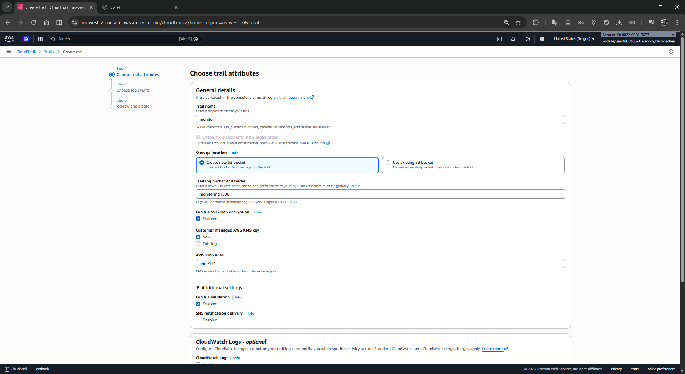
</div>

4. **Haz clic** en **Next**, deja los eventos por defecto en la siguiente pantalla, **haz clic** en **Next** nuevamente y finalmente en **Create trail**.

<div align="center">
  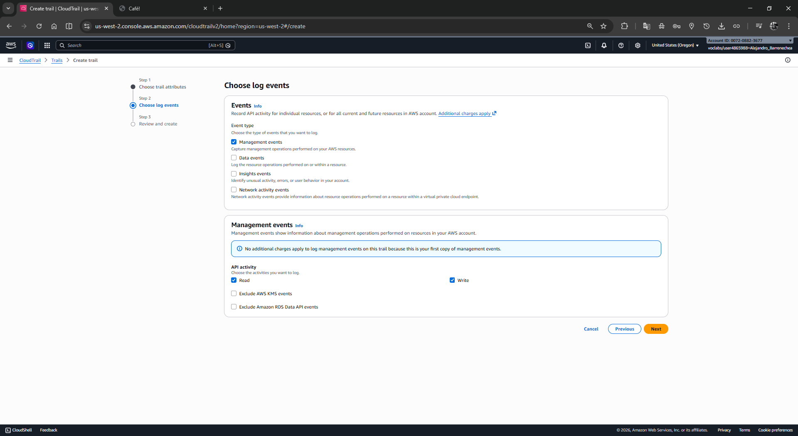
</div>

5. **Regresa** a la pestaña de tu navegador con el sitio web del Café y **refresca** la página (presiona *Shift + F5* para limpiar la caché). **Notarás que la página ha sido hackeada y la imagen ha cambiado.**

<div align="center">
  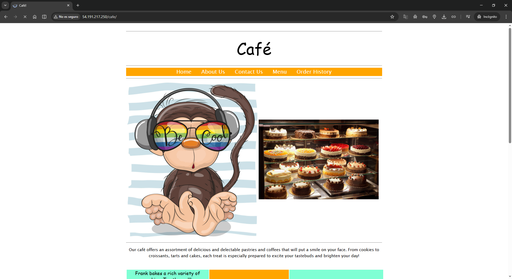
</div>

6. **Regresa** a la consola de **EC2**, selecciona tu instancia y revisa nuevamente las **Inbound rules** de su Security Group. Notarás que un atacante ha añadido una regla SSH con origen `0.0.0.0/0` (acceso desde cualquier parte del mundo).

<div align="center">
  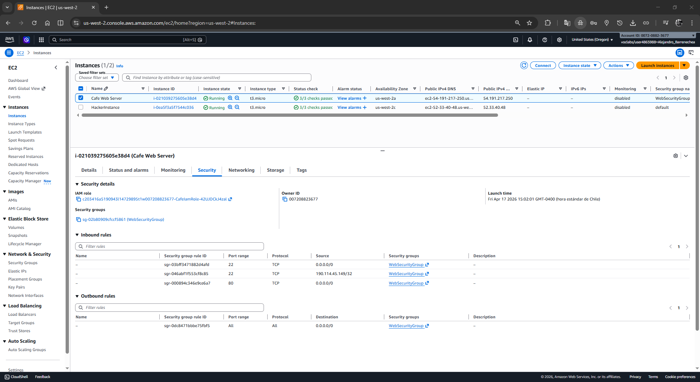
</div>

### Tarea 3: Análisis de logs usando AWS CLI y Grep
1. **Conéctate** por SSH a tu instancia EC2 usando la IP `54.191.217.250` y el archivo PEM proporcionado (`labsuser.pem`).
   * *Si usas Linux/Mac:* Ejecuta `chmod 400 labsuser.pem` y luego `ssh -i labsuser.pem ec2-user@54.191.217.250`.
2. **Ejecuta** los siguientes comandos en la terminal para descargar los logs de S3:
   ```bash
   mkdir ctraillogs
   cd ctraillogs
   aws s3 ls
   ```
<div align="center">
  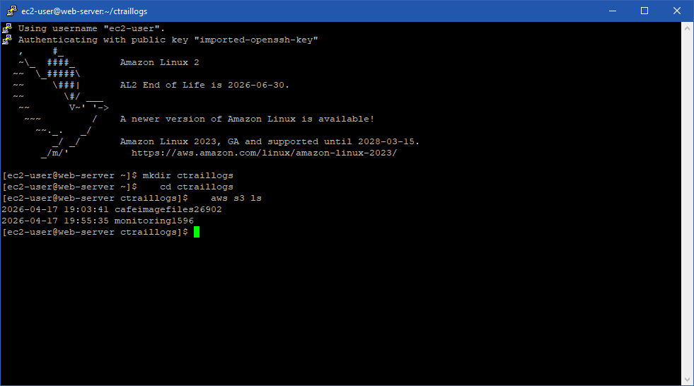
</div>

3. **Copia** el nombre del bucket que empieza con `monitoring` del resultado anterior y **ejecuta** la descarga recursiva (reemplaza `<monitoring####>`):
   ```bash
   aws s3 cp s3://<monitoring####>/ . --recursive
   ```
   *(Nota: Si no descarga nada, espera 5 minutos a que CloudTrail envíe el primer lote de logs y vuelve a ejecutarlo).*

<div align="center">
  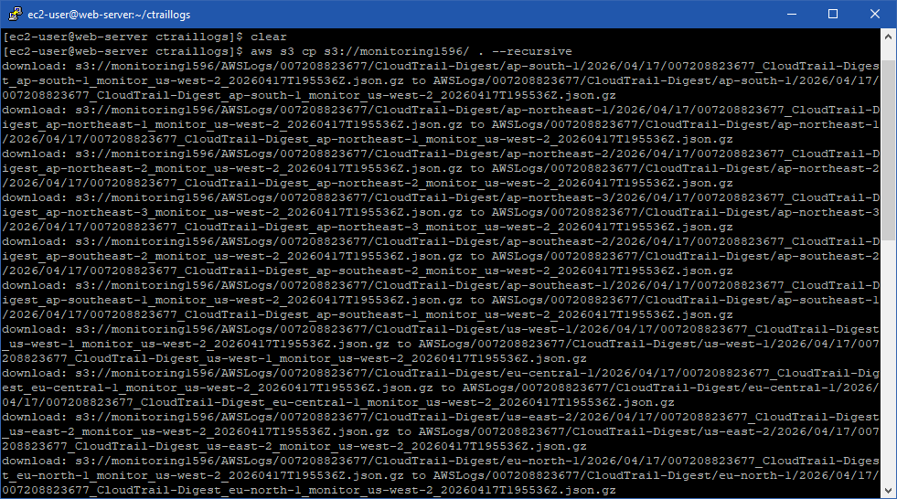
</div>

4. **Navega** por las carpetas descargadas usando `cd` hasta llegar a la fecha de hoy, y **descomprime** los archivos:
   ```bash
   gunzip *.gz
   ```

<div align="center">
  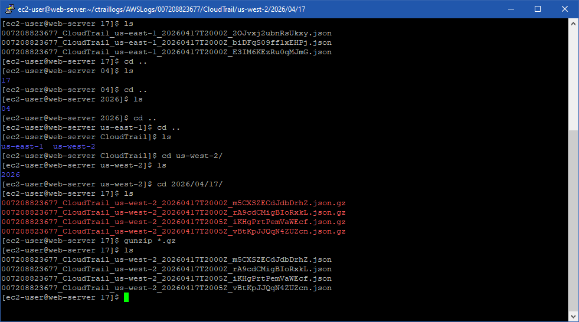
</div>

5. **Busca** mediante AWS CLI directamente sobre la API de CloudTrail qué cambios sufrieron los Security Groups (usando tu ID `sg-02b80909cfccf5861` y región `us-west-2`):
   ```bash
   aws cloudtrail lookup-events --lookup-attributes AttributeKey=ResourceType,AttributeValue=AWS::EC2::SecurityGroup --region us-west-2 --output text | grep sg-02b80909cfccf5861
   ```
   *Esto devolverá mucha información en texto plano, lo que demuestra que la línea de comandos es útil, pero difícil de leer para bases de datos complejas.*

<div align="center">
  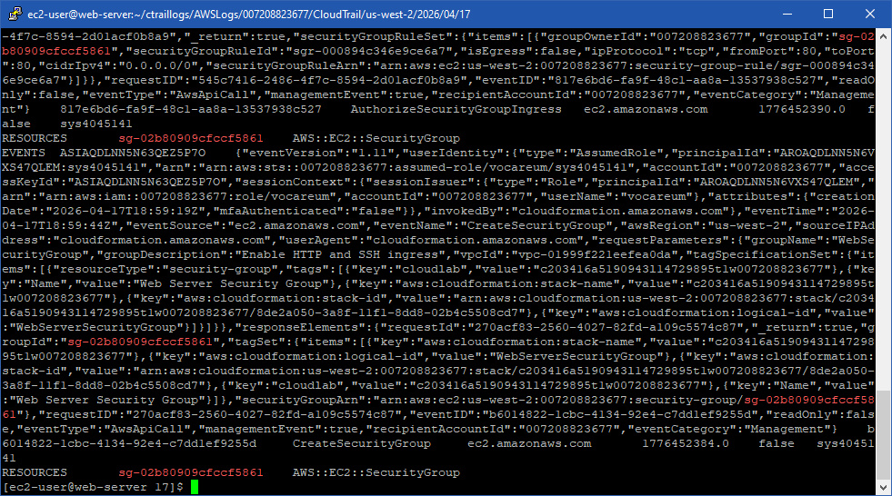
</div>

### Tarea 4: Análisis de logs usando Amazon Athena
Para investigar de manera profesional, utilizarás SQL.
1. **Navega** a la consola de **CloudTrail**, **haz clic** en **Event history** y luego en el botón **Create Athena table**.
2. **Selecciona** tu bucket `monitoring####` en el menú desplegable y **haz clic** en **Create table**.

<div align="center">
  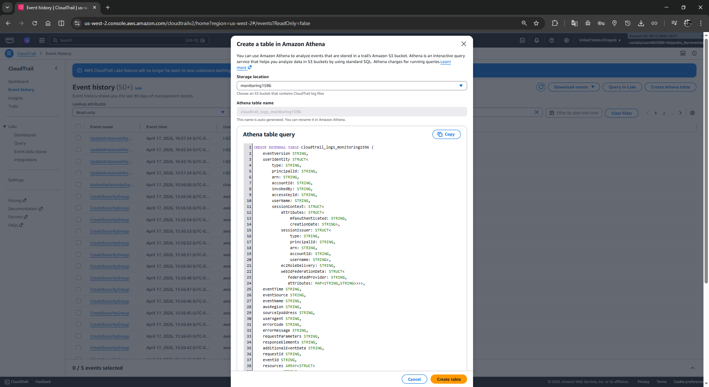
</div>

3. **Dirígete** a la barra de búsqueda superior unificada de la consola de AWS, **escribe** `Athena` y **selecciona** el servicio **Athena** en los resultados.
4. En el panel de navegación izquierdo de la nueva pantalla, **haz clic** en **Query editor**. *(Nota: Si aparece una pantalla de bienvenida o un tutorial, ciérralo haciendo clic en la "X" o haz clic en el botón **Explore query editor** para acceder directamente al área de trabajo).*
5. **Haz clic** en **Settings** (esquina superior derecha de la pantalla de consultas), luego en **Manage**. **Configura** el campo *Location of query result* escribiendo `s3://monitoring####/results/` (asegúrate de reemplazar `####` por los números de tu bucket) y **haz clic** en **Save**.

<div align="center">
  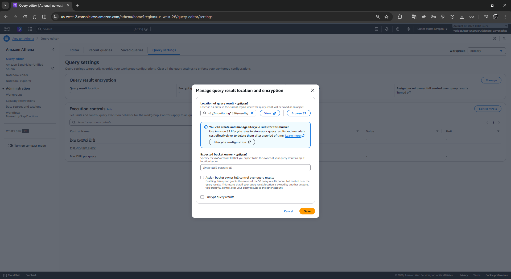
</div>

6. En el panel de consultas de Athena (bajo la pestaña *Query 1*), **copia y pega** el siguiente código SQL para descubrir al hacker (asegúrate de reemplazar `####` en el nombre de la tabla por tus números correspondientes) y **haz clic** en **Run**:
   ```sql
   SELECT useridentity.userName, eventtime, sourceipaddress, useragent
   FROM cloudtrail_logs_monitoring####
   WHERE eventname = 'AuthorizeSecurityGroupIngress'
   ```
   *Con esta consulta resolverás el desafío identificando exactamente quién, a qué hora y desde qué IP autorizó la entrada de red al modificar el Security Group.*

<div align="center">
  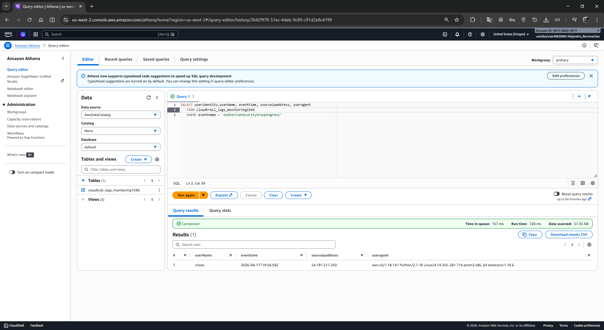
</div>

### Tarea 5: Expulsión del atacante y remediación
Debes sacar al hacker del servidor, parchar la vulnerabilidad y arreglar el sitio.

1. **Regresa** a tu conexión SSH en la terminal y **ejecuta** `who` para ver quién más está conectado. Verás a `chaos-user`.
2. **Busca** el número de proceso (PID) del atacante ejecutando:
   ```bash
   sudo userdel -r chaos-user
   ```
   *El comando fallará porque el usuario está conectado, pero te revelará su Process ID (ej. `1234`).*
3. **Mata** el proceso del atacante usando el PID obtenido:
   ```bash
   sudo kill -9 <ProcNum>
   ```
4. **Verifica** con `who` que ya no esté, y **elimina** el usuario permanentemente:
   ```bash
   sudo userdel -r chaos-user
   ```

<div align="center">
  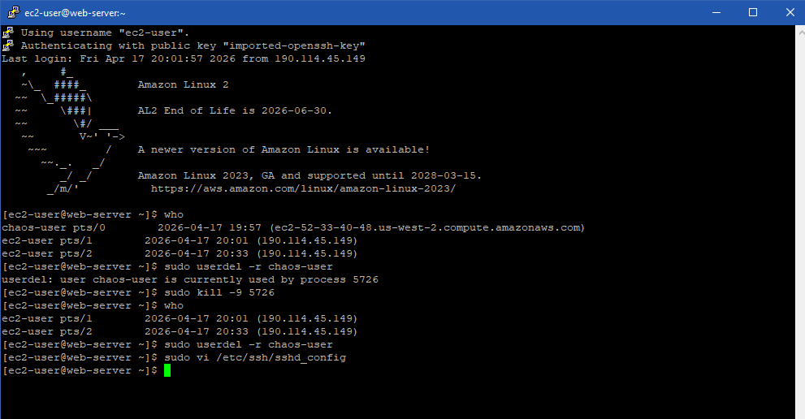
</div>

5. **Corrige** la vulnerabilidad del servicio SSH que permitió entrar al atacante con contraseña en lugar de llave:
   ```bash
   sudo vi /etc/ssh/sshd_config
   ```
   * Presiona la tecla `i` para entrar en modo inserción.
   * Busca la línea `PasswordAuthentication yes` y coméntala agregando un `#` al inicio (`#PasswordAuthentication yes`).
   * Busca la línea `#PasswordAuthentication no` y descoméntala (`PasswordAuthentication no`).
   * Presiona `Esc`, escribe `:wq` y presiona `Enter` para guardar y salir.

<div align="center">
  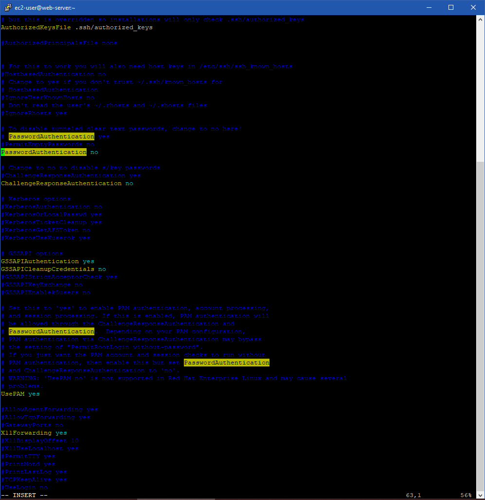
</div>

6. **Reinicia** el servicio SSH:
   ```bash
   sudo service sshd restart
   ```
7. **Regresa** a la consola de **EC2**, ve al Security Group del Web Server, **edita** las Inbound Rules y **elimina** la regla maliciosa `0.0.0.0/0` del puerto 22. Guarda los cambios.

<div align="center">
  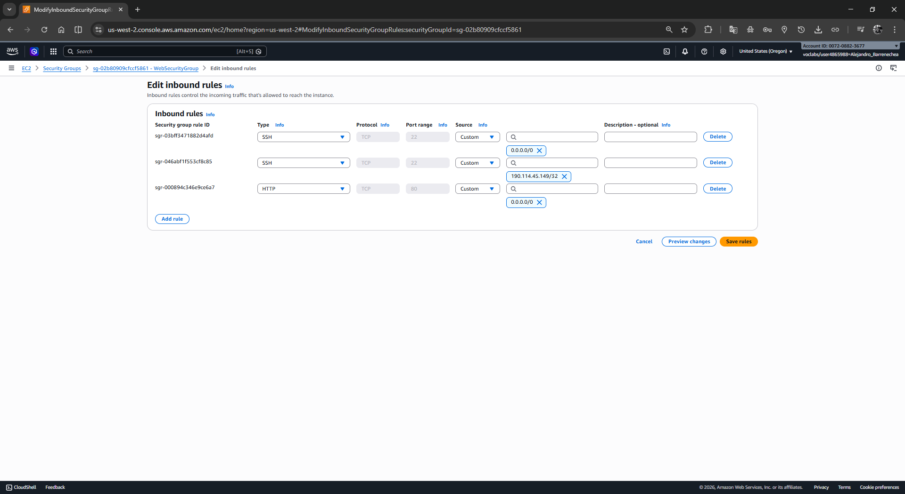
</div>
<div align="center">
  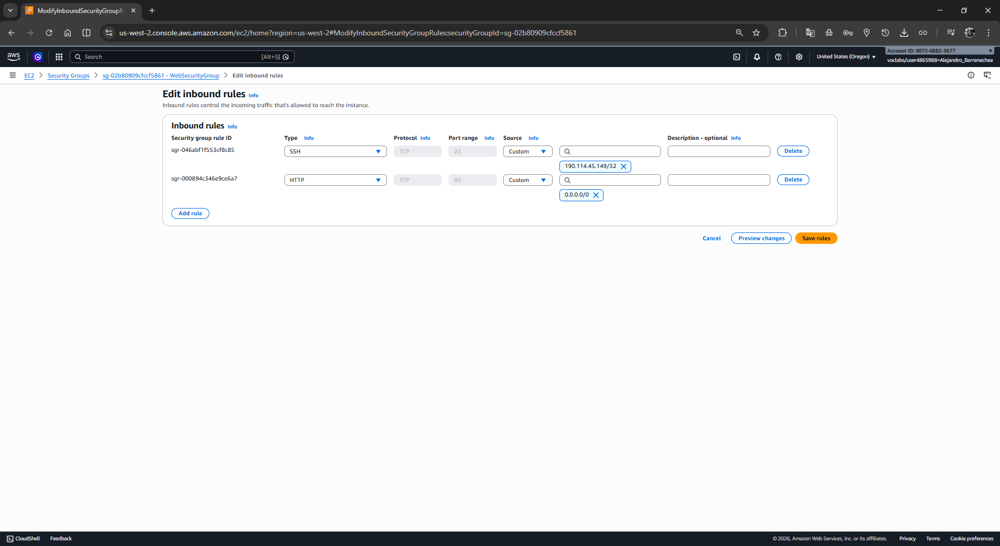
</div>

8. **Restaura** la imagen original del sitio web en el servidor ejecutando:
   ```bash
   cd /var/www/html/cafe/images/
   sudo mv Coffee-and-Pastries.backup Coffee-and-Pastries.jpg
   ```

<div align="center">
  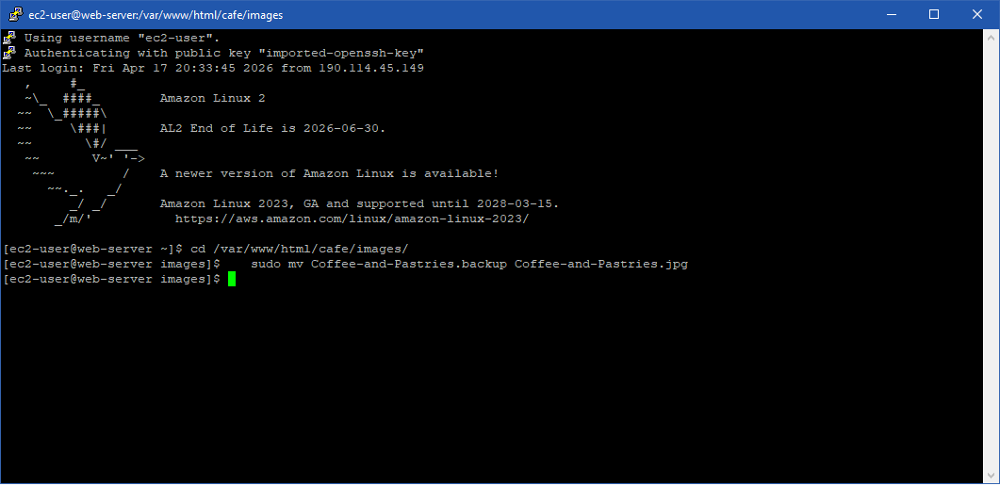
</div>

9.  **Refresca** tu navegador (`http://54.191.217.250/cafe/`) para comprobar que el sitio volvió a la normalidad.

<div align="center">
  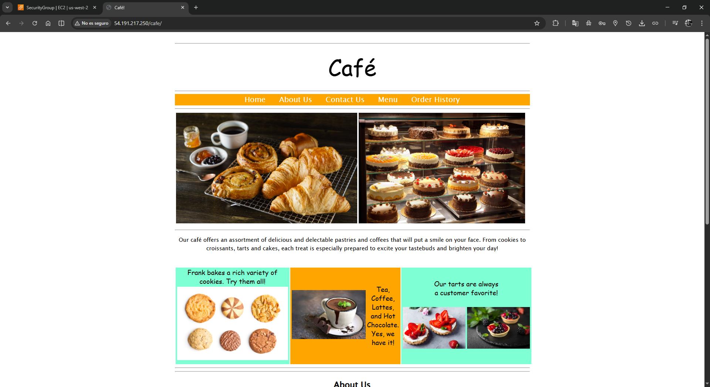
</div>

10. **Navega** a la consola de **IAM**, **haz clic** en **Users**, selecciona al usuario de AWS `chaos`, **haz clic** en **Delete**, confirma su nombre y elimínalo definitivamente de la cuenta.

<div align="center">
  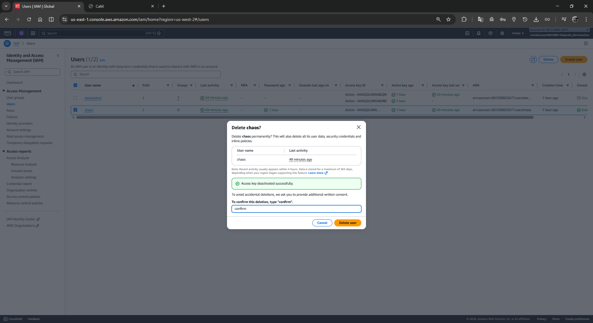
</div>
<div align="center">
  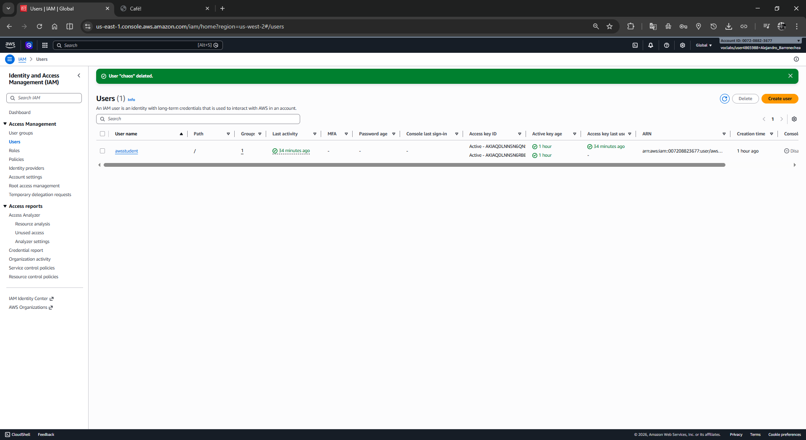
</div>

## 🧠 Análisis y Respuestas a Preguntas del Laboratorio

* **Pregunta del Challenge:** *Identifica al hacker: Nombre del usuario de AWS, hora exacta, IP desde donde atacó y el método.*
* **Respuesta Analítica:** Tras ejecutar la consulta SQL en Athena filtrando por `AuthorizeSecurityGroupIngress`, se revela que el atacante usó el usuario de IAM **`chaos`**. La fecha/hora y la dirección IP exacta aparecerán en las columnas `eventtime` y `sourceipaddress` de tus resultados de Athena. El método utilizado fue mediante **AWS CLI / Programático**, lo cual se evidencia revisando la columna `useragent`, que mostrará la firma típica de la CLI de AWS en lugar de `signin.amazonaws.com` (que indicaría acceso por consola web).

* **Pregunta implícita en el diseño del Lab:** *¿Cómo logró conectarse al sistema operativo como `chaos-user` si AWS por defecto requiere una llave `.pem` para conexiones SSH?*
* **Respuesta Analítica:** El atacante, o una configuración defectuosa previa, modificó el archivo de configuración del demonio SSH (`/etc/ssh/sshd_config`). Al establecer la directiva `PasswordAuthentication yes`, el servidor permitió la autenticación tradicional basada en contraseña de texto plano. Una vez que el atacante usó su usuario de IAM `chaos` para inyectar la regla `0.0.0.0/0` en el Security Group de AWS, tuvo vía libre de red para conectarse al puerto 22 y simplemente adivinar o realizar fuerza bruta sobre la contraseña del usuario local `chaos-user`. Restablecer esta directiva a `no` bloqueó de inmediato este vector de ataque.