# 🛡️ Evaluación y Remediación de Vulnerabilidades con Amazon Inspector

📊 **Dificultad:** Intermedio  
⏳ **Tiempo Estimado:** 30 minutos  
🛠️ **Servicios Principales:** Amazon Inspector, AWS Lambda  

---

## 🎯 Resumen y Objetivos
En este laboratorio, utilizarás Amazon Inspector para escanear en busca de vulnerabilidades en tus recursos de AWS, específicamente en funciones de AWS Lambda. Aprenderás a activar el servicio, interpretar los informes de hallazgos (*findings*) y aplicar las remediaciones correspondientes en el código.

**Objetivos alcanzados al finalizar:**
* ✅ Activar Amazon Inspector en la cuenta de AWS.
* ✅ Analizar e interpretar los hallazgos de vulnerabilidades basándose en bases de datos estándar (NVD/NIST).
* ✅ Remediar vulnerabilidades de dependencias directamente en el código de una función Lambda.

---

## Análisis del Escenario
El equipo de desarrollo de **AnyCompany** está construyendo una aplicación basada principalmente en arquitectura *Serverless* (AWS Lambda). Como Ingeniero de Soporte Cloud, has recibido la solicitud de implementar una herramienta de seguridad automatizada que se integre en su proceso de desarrollo. La herramienta debe ser capaz de escanear tanto los paquetes de software vulnerables como el código en sí cada vez que se realice un nuevo despliegue. 

**Diagnóstico:** La solución ideal nativa de AWS para este requerimiento es **Amazon Inspector (v2)**. Este servicio proporciona gestión automatizada y continua de vulnerabilidades a gran escala, detectando automáticamente nuevas funciones Lambda y evaluándolas en el momento en que se despliegan o actualizan.

---

## 🏗️ Arquitectura del Laboratorio
1. **Despliegue:** Una función Lambda existente (`get-request`) contiene una dependencia de Python desactualizada y vulnerable.
2. **Detección Continua:** Amazon Inspector se activa y escanea automáticamente el entorno, generando un hallazgo (*Finding*) de seguridad.
3. **Análisis:** El administrador revisa el panel de Inspector, identifica el CVE (*Common Vulnerabilities and Exposures*) y lee la recomendación de remediación.
4. **Remediación:** Se actualiza el archivo de dependencias en Lambda y se redespliega la función.
5. **Validación:** El redespliegue activa un nuevo escaneo automático de Inspector, el cual cierra el hallazgo al confirmar que la vulnerabilidad ha sido mitigada.

---

## ⚙️ Desarrollo de las Tareas

### 🚀 Tarea 1: Activar Amazon Inspector
En esta tarea, habilitarás el servicio para que comience el escaneo continuo de tu entorno.

1. En la barra de búsqueda superior de la consola de AWS, escribe `Inspector` y selecciona **Inspector** en la lista de servicios.
2. En la página de bienvenida, localiza y haz clic en el botón **Activate Inspector** (Activar Inspector).
   * *Nota:* Este paso solo es necesario la primera vez que configuras el servicio en una cuenta.
3. Cierra cualquier mensaje emergente o encuesta de retroalimentación que pueda aparecer haciendo clic en **Cancel** (Cancelar).
4. Navega por el panel izquierdo hacia **Dashboard** (Panel de control).
5. Observa la sección **Environment coverage** (Cobertura del entorno). Actualiza la página periódicamente hasta que veas que la métrica de **Lambda functions** alcanza el **100%**.

<p align="center">
  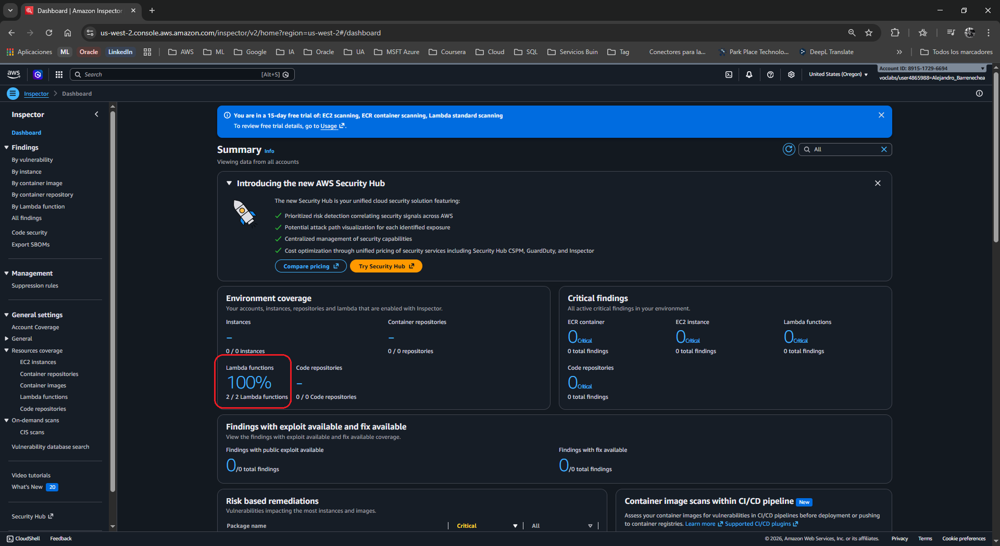
</p>

### 🔍 Tarea 2: Revisar los recursos inspeccionados y los hallazgos
Mientras Inspector finaliza su escaneo, analizarás las vulnerabilidades detectadas en el entorno actual.

1. En el panel de navegación izquierdo, bajo la sección **Findings** (Hallazgos), selecciona **All findings** (Todos los hallazgos).
   1. Observa la lista de vulnerabilidades. Deberías ver filas correspondientes a la función Lambda afectada. Presta atención a los siguientes detalles clave:
   * **Severity (Gravedad):** Medium (Media).
   * **Impacted resource (Recurso afectado):** Muestra el nombre de tu función Lambda.
   * **Title (Título):** Indica la razón del hallazgo (ej. nombre del paquete vulnerable).

<p align="center">
  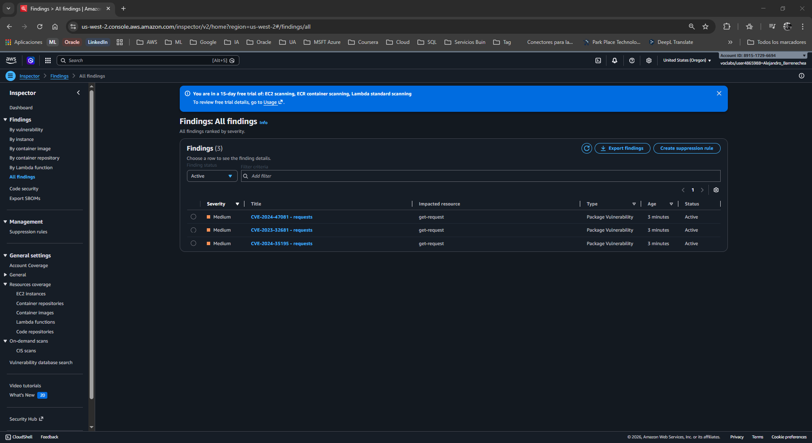
</p>

2. Haz clic en el título del hallazgo denominado **CVE-2023-32681 - requests** para abrir el panel de detalles de la vulnerabilidad.

<p align="center">
  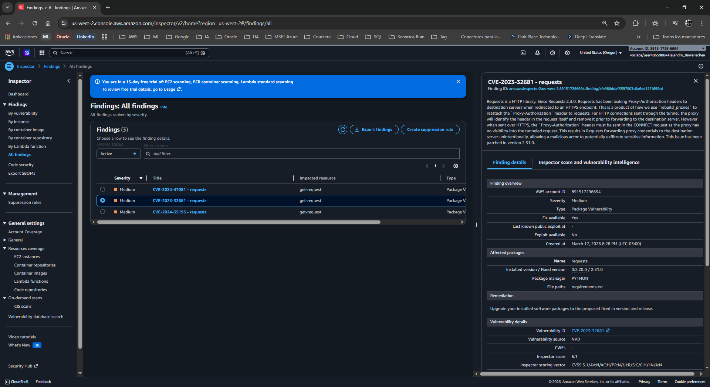
</p>

3. En el panel de información, bajo la sección **Vulnerability details**, haz clic en el enlace externo situado junto al **Vulnerability ID** (ID de vulnerabilidad).
   * *Análisis:* Este enlace te dirige a la Base de Datos Nacional de Vulnerabilidades (NVD) del NIST. Como profesional de seguridad, utilizarás frecuentemente esta base de datos para entender los vectores de ataque y el impacto real de un CVE específico.

<p align="center">
  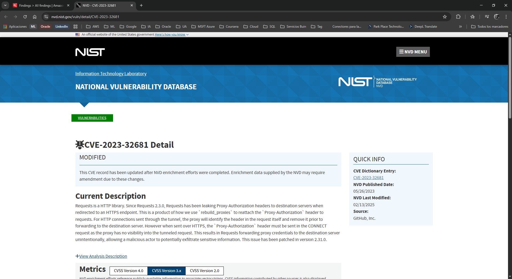
</p>

4. Regresa a la consola de AWS y, en el mismo panel de información de Inspector, desplázate hasta la sección **Remediation** (Remediación).
   * *Diagnóstico de remediación:* La recomendación indica que la librería `requests` de Python está desactualizada y es vulnerable. La acción requerida es actualizar el paquete.

<p align="center">
  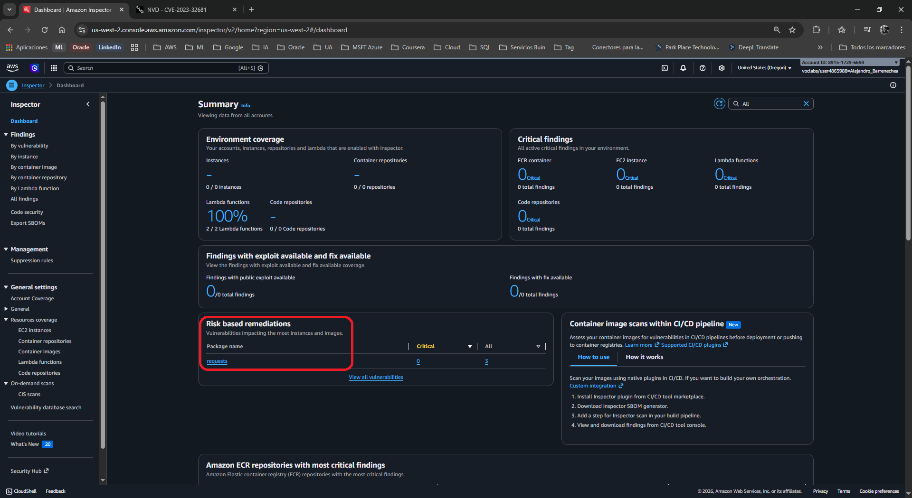
</p>

### 🔧 Tarea 3: Remediar las vulnerabilidades en AWS Lambda
Ahora aplicarás la solución recomendada directamente en el código de la función.

1. En la barra de búsqueda superior de la consola de AWS, escribe `Lambda` y selecciona el servicio **Lambda**.
2. En la lista de funciones, haz clic en el nombre de la función **get-request**.

<p align="center">
  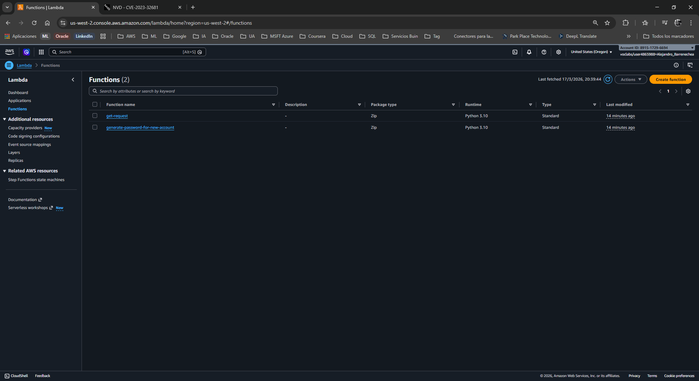
</p>

3. Desplázate hacia abajo hasta la pestaña **Code** (Código) para ver el editor de código integrado.
4. En el explorador de archivos del editor (panel izquierdo), haz doble clic en el archivo **requirements.txt** para abrirlo.
5. Verás la siguiente línea: `requests==2.20.0`.

<p align="center">
  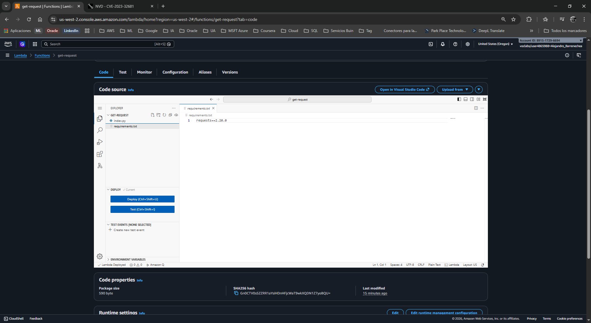
</p>

6. Elimina los signos de igual y el número de versión para que la línea quede **únicamente** como:
   ```text
   requests
   ```
   * *Nota Analítica:* El archivo `requirements.txt` le indica a AWS Lambda qué dependencias instalar. Al eliminar la versión estricta (`==2.20.0`), instruyes al sistema para que descargue e instale la **última versión disponible y parcheada** del paquete `requests` durante el proceso de construcción.

7. Haz clic en el botón **Deploy** (Desplegar) ubicado en la parte superior del editor de código.
8. Espera a que aparezca el banner verde con el mensaje: *Successfully updated the function get-request*.

<p align="center">
  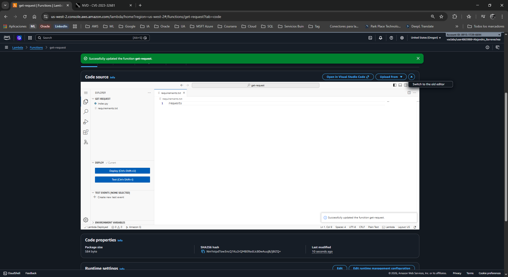
</p>

### ✅ Tarea 4: Verificar la mitigación de la vulnerabilidad
El reciente despliegue de Lambda genera un evento que Amazon Inspector intercepta, desencadenando un nuevo escaneo automático. Confirmaremos que la vulnerabilidad ha desaparecido.

1. Vuelve a la barra de búsqueda superior, escribe `Inspector` y ábrelo nuevamente.
2. En el panel de navegación izquierdo, bajo **Findings**, selecciona **All findings**.

<p align="center">
  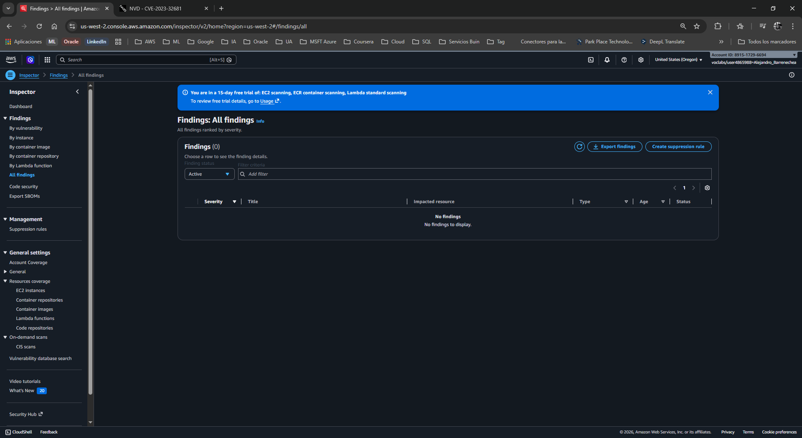
</p>

3. En la barra de filtros de la tabla de hallazgos, cambia el estado (**Finding status**) de **Active** (Activo) a **Closed** (Cerrado).
   * *Nota:* Puede tardar unos minutos en completarse el re-escaneo. Usa el botón de actualización (*Refresh*) si es necesario.
4. Verifica que el hallazgo **CVE-2023-32681 - requests** ahora aparece en la lista de hallazgos cerrados, confirmando la remediación exitosa.

<p align="center">
  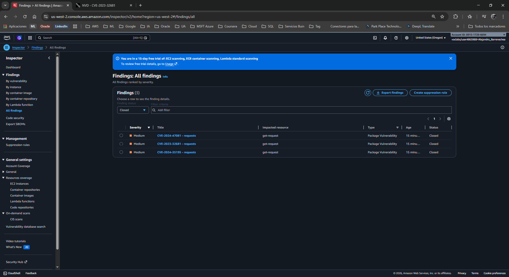
</p>

5. (Opcional) En el panel izquierdo, bajo **Account management** o **Environment coverage**, selecciona **Lambda functions** y revisa la columna **Last scanned** (Último escaneo) para confirmar que la marca de tiempo se ha actualizado al momento actual.

<p align="center">
  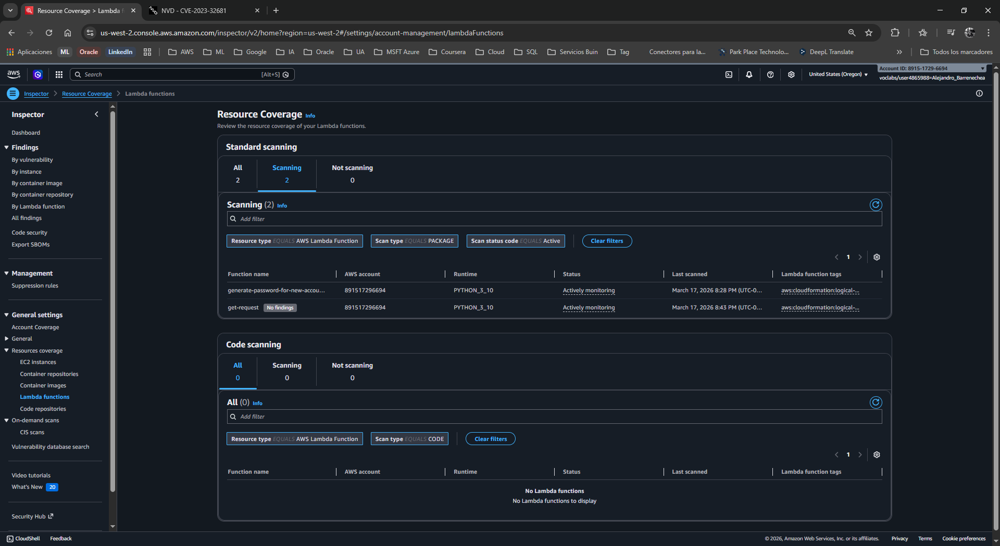
</p>

---

## 📧 Correo Formal de Respuesta al Cliente

**Asunto:** Resolución de Ticket: Implementación de Escaneo Continuo y Remediación en AWS Lambda  
**Para:** Equipo de Desarrollo, AnyCompany  

Estimado equipo,

Espero que se encuentren muy bien. 

Me comunico para informarles que hemos completado exitosamente la implementación de la herramienta de seguridad automatizada solicitada para su entorno de desarrollo *serverless*. 

Hemos activado **Amazon Inspector** en su cuenta de AWS. Este servicio ahora monitorea proactivamente y de forma continua todas sus funciones de AWS Lambda y paquetes de software, alertando sobre vulnerabilidades conocidas (CVEs). 

Durante nuestra auditoría inicial post-activación, Inspector detectó una vulnerabilidad de gravedad Media (CVE-2023-32681) en la función Lambda `get-request`, originada por el uso de una versión obsoleta de la librería `requests` de Python (v2.20.0).

**Acciones tomadas:**
1. Analizamos el vector de riesgo utilizando la base de datos NVD (NIST).
2. Modificamos el archivo `requirements.txt` en el código fuente de la función para eliminar la fijación de la versión vulnerable, asegurando que Lambda instale la versión más reciente y segura del paquete al momento de construirse.
3. Desplegamos la actualización. Inspector realizó un re-escaneo automatizado de la función, confirmando la mitigación exitosa y marcando el hallazgo como cerrado.

Su infraestructura ahora cuenta con un ciclo de vida de seguridad integrado (DevSecOps), donde cada nuevo despliegue de código será auditado automáticamente en busca de vulnerabilidades antes de llegar a producción.