# 🛡️ Endurecimiento de Sistemas (Systems Hardening) con AWS Systems Manager Patch Manager

📊 **Dificultad:** Intermedio  
⏳ **Tiempo Estimado:** 60 minutos  
🛠️ **Servicios Principales:** AWS Systems Manager (Patch Manager, Fleet Manager, Run Command), Amazon EC2.  

---

## 🎯 Resumen y Objetivos
En este laboratorio, automatizarás el proceso de actualización y parcheo de sistemas operativos (OS) a gran escala utilizando **AWS Systems Manager (SSM)**. Aprenderás a aplicar líneas base predeterminadas (*Default Baselines*) en instancias Linux y a crear líneas base personalizadas (*Custom Baselines*) con reglas estrictas de aprobación para instancias Windows.

**Objetivos alcanzados al finalizar:**
* ✅ Aplicar parches a instancias Linux utilizando la línea base por defecto de AWS.
* ✅ Crear una línea base de parches personalizada para Windows Server con reglas específicas de severidad y días de auto-aprobación.
* ✅ Utilizar etiquetas (*Patch Groups*) para agrupar y dirigir el despliegue de parches.
* ✅ Verificar el estado de cumplimiento (*Compliance*) de toda tu flota de servidores desde un panel centralizado.

---

## 🕵️‍♂️ Análisis del Escenario (Diagnóstico Inicial)
En organizaciones con cientos o miles de estaciones de trabajo y servidores, actualizar el software de forma manual es logísticamente imposible y representa un riesgo crítico de seguridad. Una política de endurecimiento (*Hardening*) requiere garantizar que todos los nodos ejecuten versiones de software seguras y aprobadas.

**Diagnóstico y Estrategia:** El entorno cuenta con una flota mixta (3 instancias Linux y 3 instancias Windows) que ya tienen configurado el agente de SSM y un rol de IAM adecuado. Como Ingeniero de Soporte Cloud, tu estrategia será centralizar la gestión utilizando **Patch Manager**. Aprovecharás las etiquetas de EC2 (`Patch Group`) para segregar los entornos lógicamente (`LinuxProd` y `WindowsProd`) y aplicar las actualizaciones de forma automatizada y sin intervención manual.

---

## 🏗️ Arquitectura del Laboratorio
1. **Nodos Gestionados:** Instancias de Amazon EC2 (Linux y Windows) preconfiguradas con el SSM Agent y perfiles de instancia (IAM Roles) habilitados para Systems Manager.
2. **Fleet Manager:** Componente de SSM que actúa como inventario visual de los nodos gestionados.
3. **Patch Baselines:** Reglas que definen qué parches son aprobados, rechazados o ignorados (tanto nativos de AWS como personalizados).
4. **Run Command:** Motor de ejecución que AWS Systems Manager utiliza por detrás (mediante el documento `AWS-RunPatchBaseline`) para instalar los parches en las instancias.

---

## ⚙️ Desarrollo de las Tareas (Paso a Paso)

### 🚀 Tarea 1: Parchear instancias Linux usando líneas base por defecto
En esta tarea, auditarás el inventario y parchearás las instancias Linux utilizando las configuraciones nativas que AWS provee.

1. En la barra de búsqueda de la consola, escribe `Systems Manager` y selecciónalo.
2. En el panel de navegación izquierdo, bajo **Node Management**, selecciona **Fleet Manager**.
   * *Nota Analítica:* Aquí verás tus 6 instancias preconfiguradas. Solo aparecen en esta lista porque tienen el agente SSM ejecutándose y los permisos de IAM correctos.

  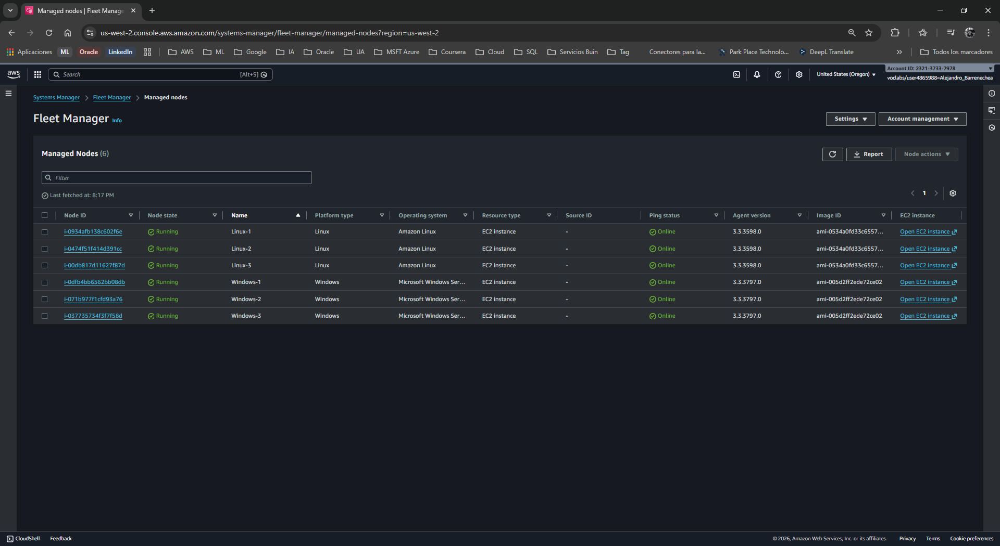

3. Selecciona la casilla de la instancia **Linux-1**, haz clic en el menú desplegable **Node actions** y selecciona **View details**. Observa el sistema operativo y el rol de IAM asociado, luego vuelve a la página principal de Systems Manager.

  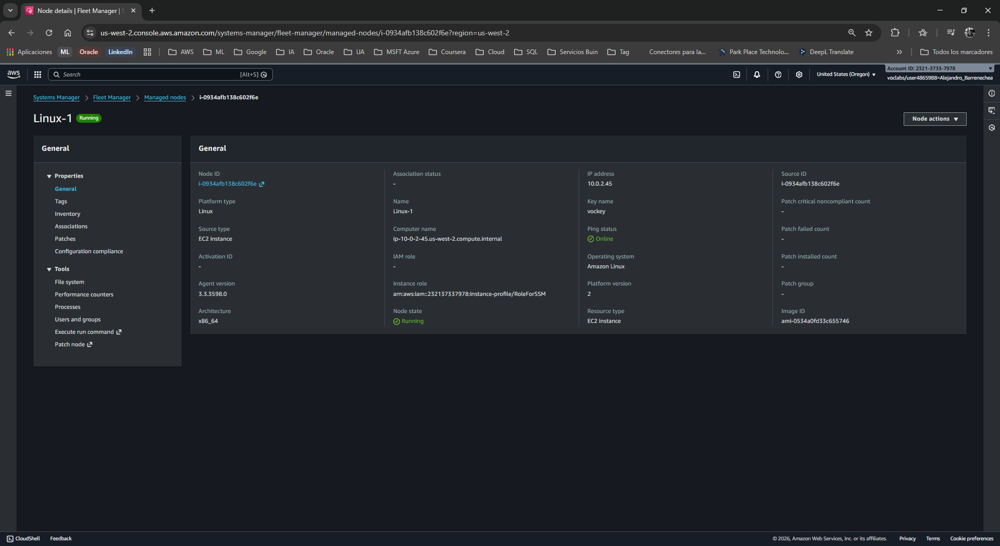

4. En el panel izquierdo, bajo **Node Management**, selecciona **Patch Manager**. (Si aparece una pantalla de bienvenida, haz clic en *Start with an overview*).

  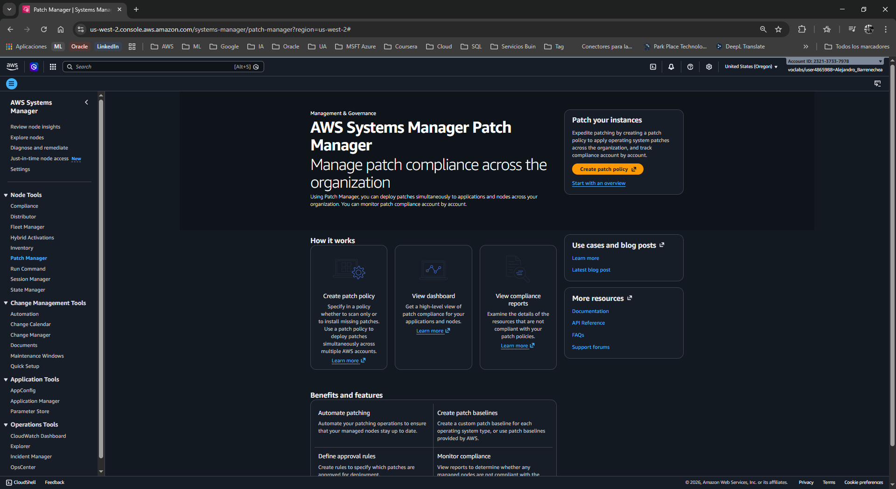

5. Haz clic en el botón **Patch now** (Parchear ahora).
6. Bajo **Basic configuration** (Configuración básica), establece lo siguiente:
   * **Patching operation:** `Scan and install` (Escanear e instalar).
   * **Reboot option:** `Reboot if needed` (Reiniciar si es necesario).
   * **Instances to patch:** `Patch only the target instances I specify` (Parchear solo instancias específicas).
   * **Target selection:** `Specify instance tags` (Especificar etiquetas de instancia).
   * **Tag key:** `Patch Group`
   * **Tag value:** `LinuxProd`
7. Haz clic en **Add** (Agregar) y luego en el botón inferior **Patch now**.

  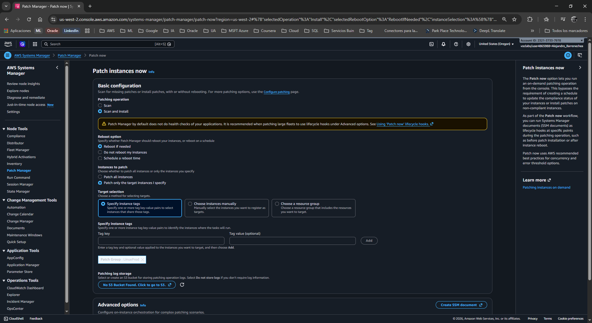

8.  Observa la nueva página (`AWS-PatchNowAssociation`). Monitoriza el panel visual **Scan/Install operation summary** hasta que la operación se complete en las 3 instancias Linux.

  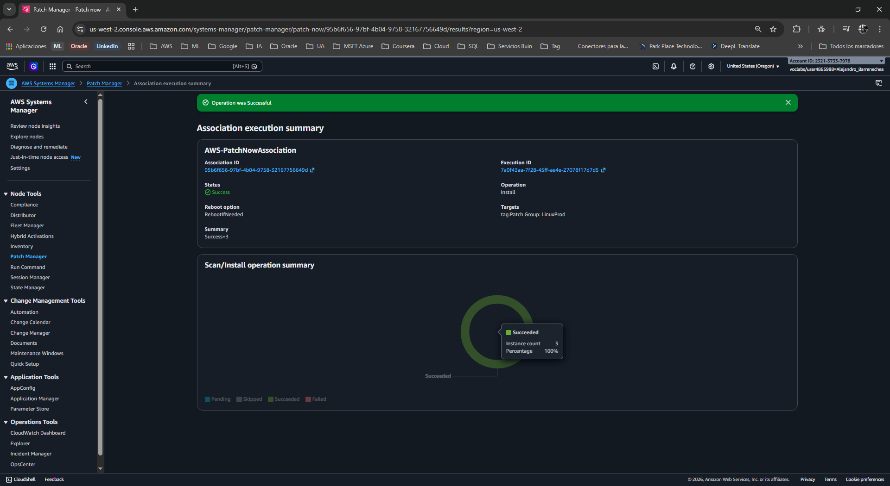

### 🛠️ Tarea 2: Crear una línea base de parches personalizada para Windows
Para Windows, crearás reglas específicas de actualizaciones de seguridad, requiriendo un periodo de gracia antes de instalarlas.

1. 🔙 Vuelve a la consola de **Systems Manager** > **Patch Manager**.
2. 탭 Selecciona la pestaña **Patch baselines** y haz clic en **Create patch baseline**.

  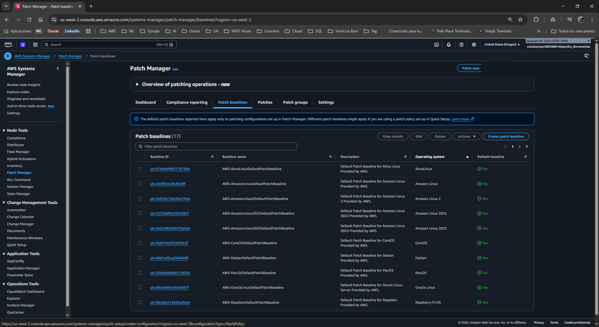

3. 📝 Completa los detalles de la línea base:
   * **Name:** `WindowsServerSecurityUpdates`
   * **Description:** `Windows security baseline patch`
   * **Operating system:** `Windows`
   * *Asegúrate de dejar desmarcada la casilla "Default patch baseline".*
4. ⚙️ En la sección **Approval rules for operating systems** (Reglas de aprobación), configura la **Regla 1**:
   * **Products:** Elige `WindowsServer2019`. (Asegúrate de deseleccionar "All" en el menú desplegable).
   * **Severity:** Selecciona `Critical`.
   * **Classification:** Selecciona `SecurityUpdates`.
   * **Auto-approval:** Escribe `3` days (Esto espera 3 días tras el lanzamiento del parche antes de instalarlo, evitando bugs de "Día Cero").
   * **Compliance reporting:** Selecciona `Critical`.

  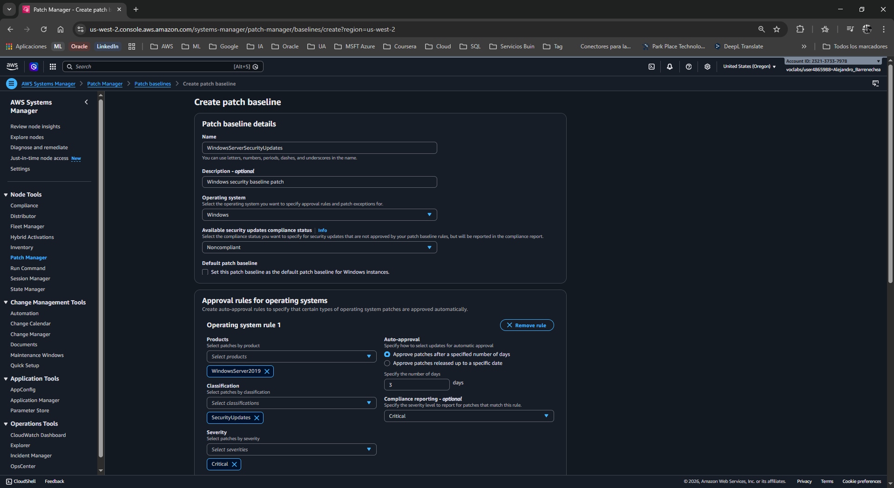

5. ➕ Haz clic en **Add rule** para añadir una **Regla 2** y configúrala así:
   * **Products:** Elige `WindowsServer2019` (Deseleccionando "All").
   * **Severity:** Selecciona `Important`.
   * **Classification:** Selecciona `SecurityUpdates`.
   * **Auto-approval:** Escribe `3` days.
   * **Compliance reporting:** Selecciona `High`.

  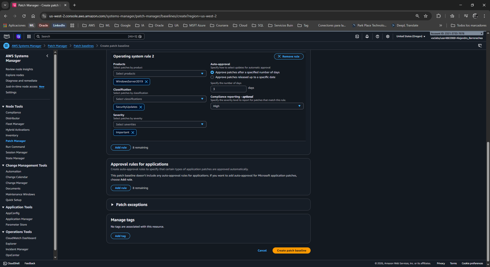

6. 💾 Haz clic en **Create patch baseline**.
7. 🔍 En la lista de *Patch baselines* (puedes usar la barra de búsqueda), selecciona el botón de opción circular junto a tu nueva línea base `WindowsServerSecurityUpdates`.
8. 🖱️ Haz clic en **Actions** > **Modify patch groups**.

  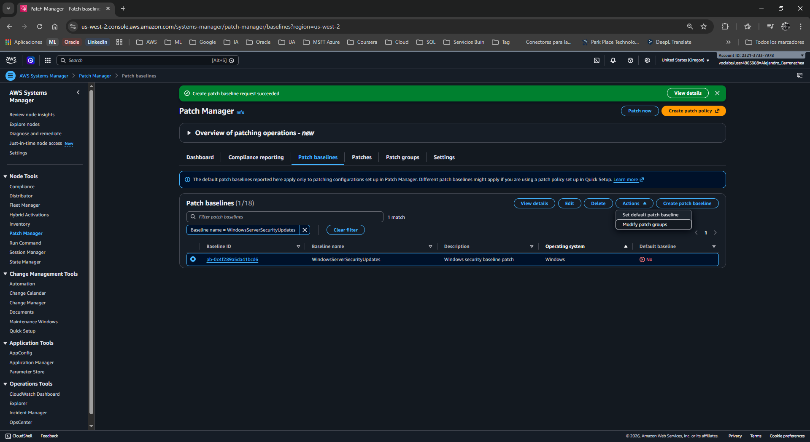

1.  ⌨️ En el campo *Patch groups*, escribe exactamente `WindowsProd` y haz clic en **Add**, luego en **Close**.

  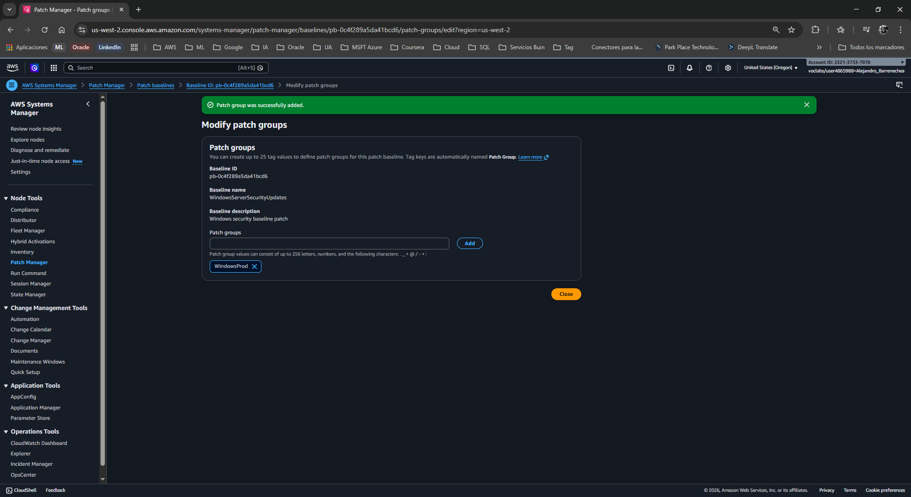

### 🏷️ Tarea 3: Etiquetar y parchear las instancias Windows
Para que la línea base funcione, las instancias EC2 deben tener la etiqueta correspondiente.

**Tarea 3.1: Etiquetar Instancias**
1. 🔎 En la barra de búsqueda superior, escribe `EC2` y ábrelo.
2. 📂 Ve a **Instances**, selecciona la instancia **Windows-1** y haz clic en la pestaña **Tags** (Etiquetas) en la parte inferior.

  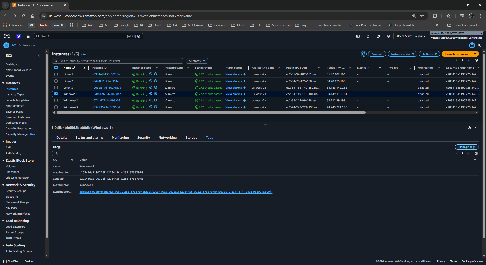

3. 🖱️ Haz clic en **Manage tags** > **Add new tag**:
   * **Key:** `Patch Group`
   * **Value:** `WindowsProd`
4. 💾 Haz clic en **Save**.
5. 🔄 **Repite** este proceso exactamente igual para las instancias **Windows-2** y **Windows-3**.

  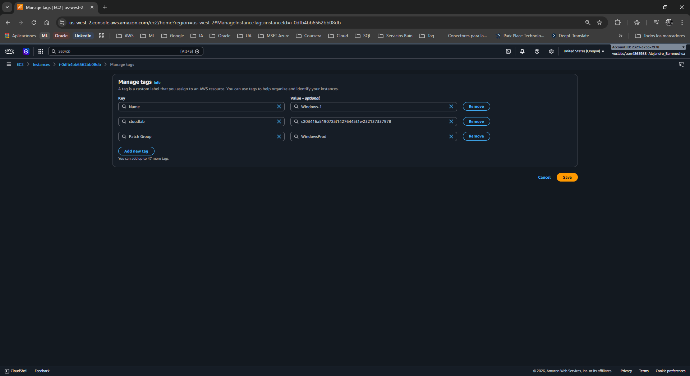

**Tarea 3.2: Ejecutar el parcheo**
1. 🔙 Vuelve a **Systems Manager** > **Patch Manager**.
2. 🖱️ Haz clic en **Patch now** y configura:
   * **Patching operation:** `Scan and install`
   * **Reboot option:** `Reboot if needed`
   * **Instances to patch:** `Patch only the target instances I specify`
   * **Target selection:** `Specify instance tags`
   * **Tag key:** `Patch Group`
   * **Tag value:** `WindowsProd`

  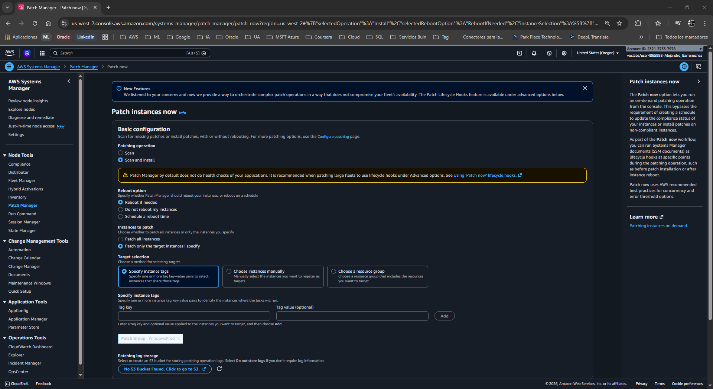

3. ➕ Haz clic en **Add** y luego en **Patch now**.

  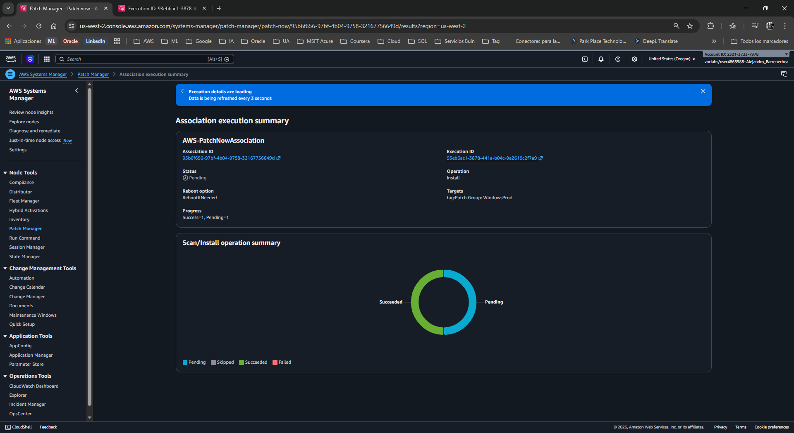

4. 🔗 En la nueva página, haz clic en el enlace del **Execution ID** (te llevará a *State Manager*).

  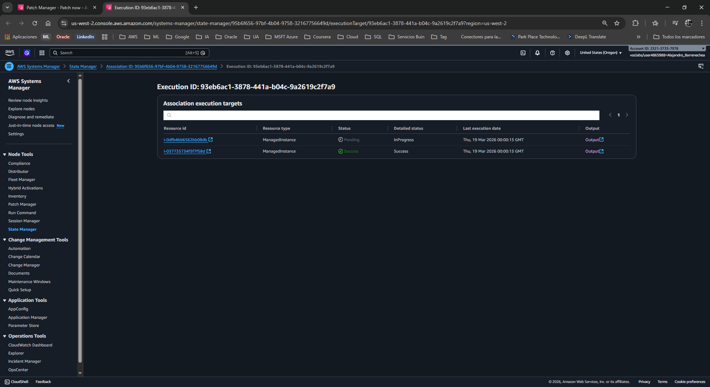

5. 📋 Haz clic en el enlace **Output** (Salida) de una de las instancias en estado *InProgress*.
6. 👁️ En la página de *Run Command*, expande el panel **Output**. Observarás el registro (log) de ejecución donde Patch Manager llama al documento de automatización y reconoce el *PatchGroup: WindowsProd*.

  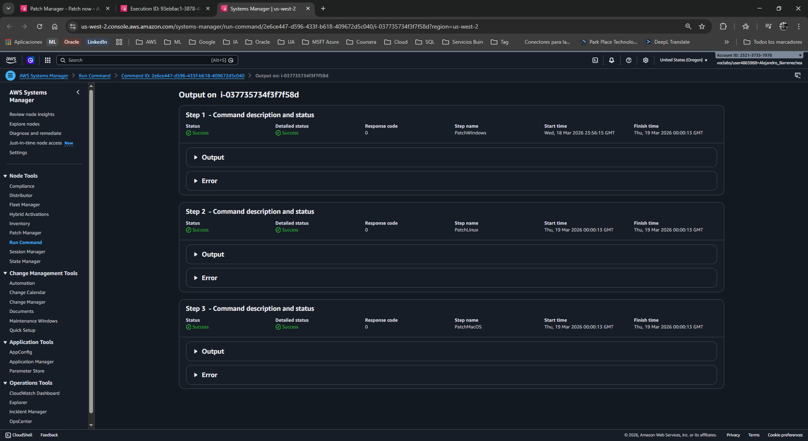

### ✅ Tarea 4: Verificar el cumplimiento (Compliance)
Finalmente, auditarás la salud de seguridad de toda la flota.

1. 🔙 Vuelve a **Systems Manager** > **Patch Manager**.
2. 탭 Selecciona la pestaña **Dashboard**.
3. 📊 Bajo **Compliance summary**, deberías ver un anillo verde indicando que tus instancias son **Compliant**. (Puede tardar unos minutos en actualizarse; asegúrate de que diga Compliant: 6).

  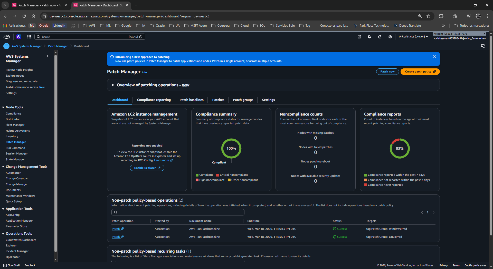

4. 탭 Cambia a la pestaña **Compliance reporting**. Aquí verás la lista detallada de cada nodo Linux y Windows.

  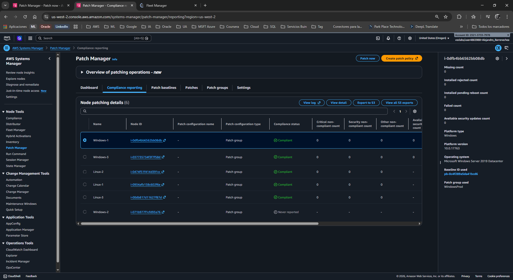

5. ➡️ Desplázate hacia la derecha en la tabla para observar el recuento de incumplimientos (Critical/Security noncompliant count = 0), la fecha de la última operación y el **Baseline ID** utilizado.
6. 🖱️ Haz clic en el **Node ID** de una de tus instancias Windows.
7. 탭 En la nueva ventana, selecciona la pestaña **Patch**. 
8. 👁️ Desplázate hacia abajo para ver la lista exacta de KBs (Knowledge Base) y parches instalados por Microsoft, junto con su fecha de instalación (*Installed Time*).

  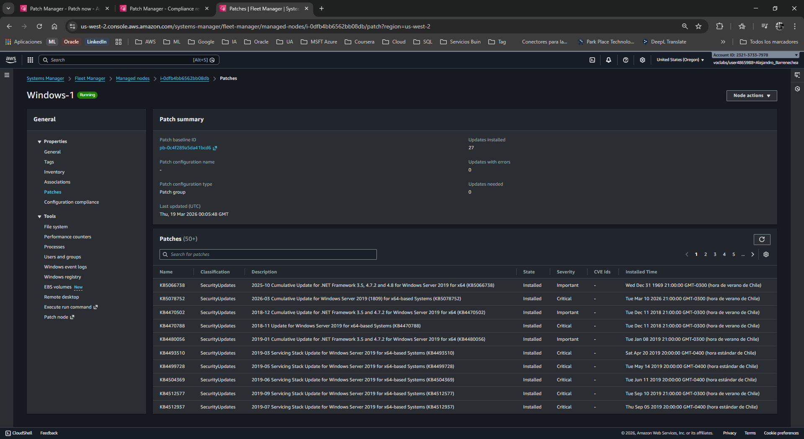

---

## 💡 Respuestas Analíticas al Caso

**¿Por qué utilizamos una línea base personalizada para Windows en lugar de la predeterminada?**
*   **Respuesta:** En entornos empresariales de Windows, instalar todos los parches inmediatamente ("Día Cero") puede causar caídas de aplicaciones por incompatibilidad. Al crear una *Custom Baseline*, le indicamos a SSM que evalúe y apruebe **únicamente** los parches de clasificación de Seguridad (Critical/Important) y que espere **3 días (Auto-approval delay)** antes de marcarlos como instalables. Esto otorga una ventana de tiempo para que la comunidad global de TI reporte posibles fallos en el parche de Microsoft antes de que afecte a nuestros servidores de producción.

**¿Cómo ejecuta realmente Systems Manager la instalación en los servidores?**
*   **Respuesta:** Patch Manager actúa como el orquestador de las reglas, pero la acción física de instalar el software la realiza el componente **Run Command**. Detrás de escena, SSM envía un documento de automatización predefinido llamado `AWS-RunPatchBaseline` al agente (SSM Agent) instalado en el sistema operativo EC2. Este agente ejecuta los comandos localmente como administrador (root/SYSTEM) y devuelve el registro de salida (Output) a la consola.

---

## 📧 Correo Formal de Respuesta al Cliente

**Asunto:** Resolución de Ticket: Implementación de Hardening y Parcheo Automatizado  
**Para:** Equipo de Infraestructura / Operaciones de TI  

Estimado equipo,

Me comunico para notificarles que hemos completado exitosamente la implementación de la nueva política de *Hardening* y gestión de parches en nuestra flota de servidores de AWS utilizando **AWS Systems Manager (Patch Manager)**.

**Acciones y mejoras implementadas:**
1. **Inventario Centralizado:** Las 6 instancias (Linux y Windows) han sido registradas exitosamente en *Fleet Manager* sin requerir apertura de puertos de entrada (Inbound ports), garantizando la máxima seguridad de red.
2. **Estandarización de Linux:** Se ha aplicado la línea base de seguridad recomendada por AWS de forma automatizada a todos los servidores de la flota `LinuxProd`.
3. **Línea Base Personalizada para Windows:** Para proteger la estabilidad de la plataforma Windows Server 2019 (`WindowsProd`), configuramos una línea base estricta. Ahora, solo los parches clasificados como Críticos e Importantes de seguridad serán aprobados automáticamente, aplicando un periodo de validación (retraso) de 3 días post-lanzamiento para evitar despliegues con *bugs* nativos del proveedor.
4. **Validación de Cumplimiento:** Actualmente, el panel de auditoría (Compliance) confirma que el 100% de la infraestructura se encuentra actualizada y cumple con nuestras directrices de ciberseguridad corporativas.

A partir de ahora, el esfuerzo operativo para mantener los sistemas actualizados se ha reducido prácticamente a cero. Quedo a su disposición si desean que agendemos la configuración de Ventanas de Mantenimiento (*Maintenance Windows*) para que estos escaneos se ejecuten automáticamente los fines de semana.