# 🛡️ Protección de Datos mediante Encriptación (AWS KMS y Encryption CLI)

📊 **Dificultad:** Intermedio  
⏳ **Tiempo Estimado:** 45 minutos  
🛠️ **Servicios Principales:** AWS Key Management Service (KMS), Amazon EC2, AWS Systems Manager (Session Manager), AWS CLI.  

---

## 🎯 Resumen y Objetivos
En este laboratorio, explorarás los fundamentos de la criptografía implementando encriptación simétrica para proteger información confidencial. Te conectarás a un servidor de archivos (Amazon EC2), crearás una clave criptográfica gestionada en AWS KMS y utilizarás la herramienta de línea de comandos **AWS Encryption CLI** para cifrar datos en texto plano y posteriormente descifrarlos, garantizando la privacidad e integridad de los archivos.

**Objetivos alcanzados al finalizar:**
* ✅ Crear una clave de encriptación simétrica en AWS KMS.
* ✅ Instalar y configurar AWS Encryption CLI en una instancia Linux.
* ✅ Encriptar texto plano (*Plaintext*) transformándolo en texto cifrado (*Ciphertext*).
* ✅ Descifrar datos para recuperar la información original legible.

---

## 🕵️‍♂️ Análisis del Escenario (Diagnóstico Inicial)
La protección de datos en reposo es un pilar fundamental de la ciberseguridad corporativa. En este escenario, el cliente necesita un mecanismo robusto para asegurar archivos confidenciales alojados localmente en sus servidores. 

**Diagnóstico y Estrategia:** En lugar de enviar los archivos a través de la red para ser cifrados por un servicio externo, implementarás una arquitectura de **Cifrado de Sobres (Envelope Encryption)** local. Proveerás al servidor con el *AWS Encryption CLI*, el cual se comunicará de forma segura con AWS KMS únicamente para obtener claves de datos (*Data Keys*). Estas claves cifrarán los archivos de forma ultra-rápida directamente en el almacenamiento local del servidor EC2.

---

## 🏗️ Arquitectura del Laboratorio
1. 🔐 **AWS KMS:** Repositorio centralizado de alta seguridad (validado por FIPS 140-2) donde se creará y almacenará la Clave Maestra de Cliente (CMK) Simétrica.
2. 💻 **Amazon EC2 (File Server):** Servidor Linux que aloja los archivos confidenciales. El acceso se realiza de forma segura mediante **SSM Session Manager** (sin abrir puertos SSH).
3. ⚙️ **AWS Encryption CLI:** Herramienta de software instalada en el servidor que interactúa con KMS y ejecuta los algoritmos matemáticos de cifrado/descifrado localmente.
4. 🛡️ **AWS IAM:** Rol y credenciales temporales (`voclabs`) que autorizan al servidor a utilizar la clave de KMS.

---

## ⚙️ Desarrollo de las Tareas (Paso a Paso)

### 🔑 Tarea 1: Crear una clave en AWS KMS
En esta tarea, generarás la clave maestra que protegerá tus datos.

1. 🔎 En la barra de búsqueda de la consola, escribe `KMS` y selecciona **Key Management Service**.
2. 🖱️ En el panel derecho, haz clic en el botón naranja **Create a key** (Crear una clave).

<p align="center">
  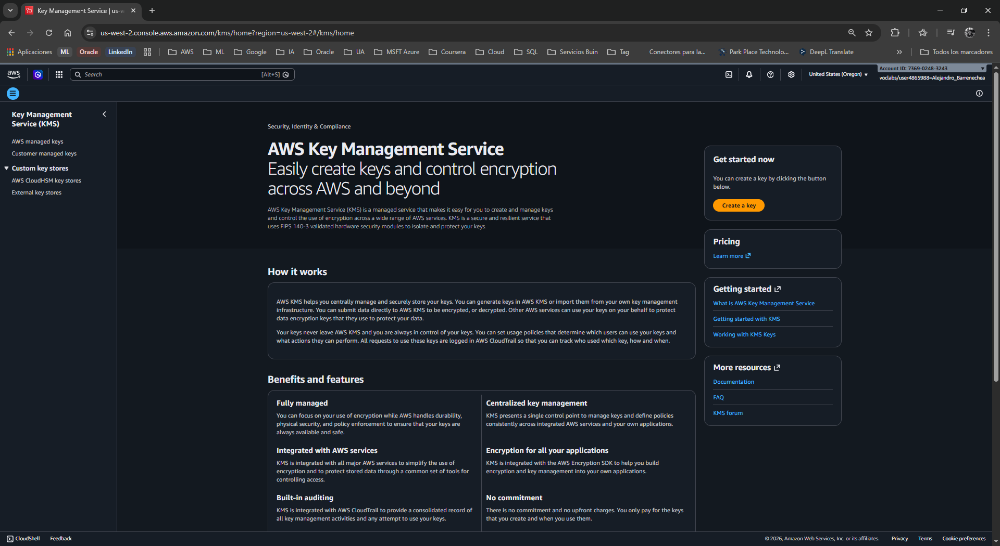
</p>

3. ⚙️ En **Key type** (Tipo de clave), selecciona **Symmetric** (Simétrica) y haz clic en **Next** (Siguiente).
   * *Nota analítica:* La encriptación simétrica utiliza la misma clave tanto para cifrar como para descifrar. Es extremadamente rápida e ideal para grandes volúmenes de datos.
  
<p align="center">
  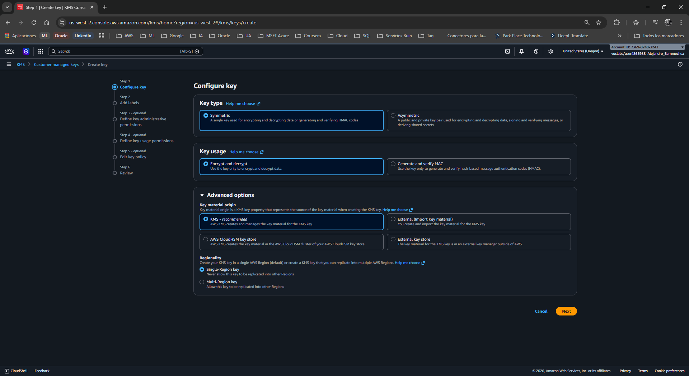
</p>

4. 📝 En la página **Add labels** (Agregar etiquetas), configura lo siguiente:
   * **Alias:** `MyKMSKey`
   * **Description:** `Key used to encrypt and decrypt data files.`
5. ➡️ Haz clic en **Next**.

<p align="center">
  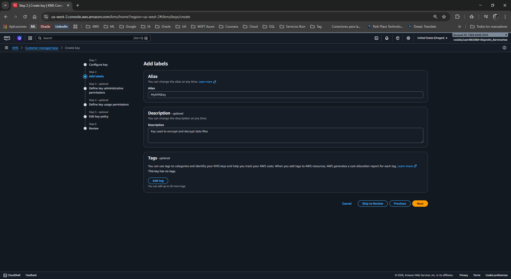
</p>

6. 👤 En **Define key administrative permissions** (Administradores de la clave), usa el buscador, marca la casilla del rol `voclabs` y haz clic en **Next**.

<p align="center">
  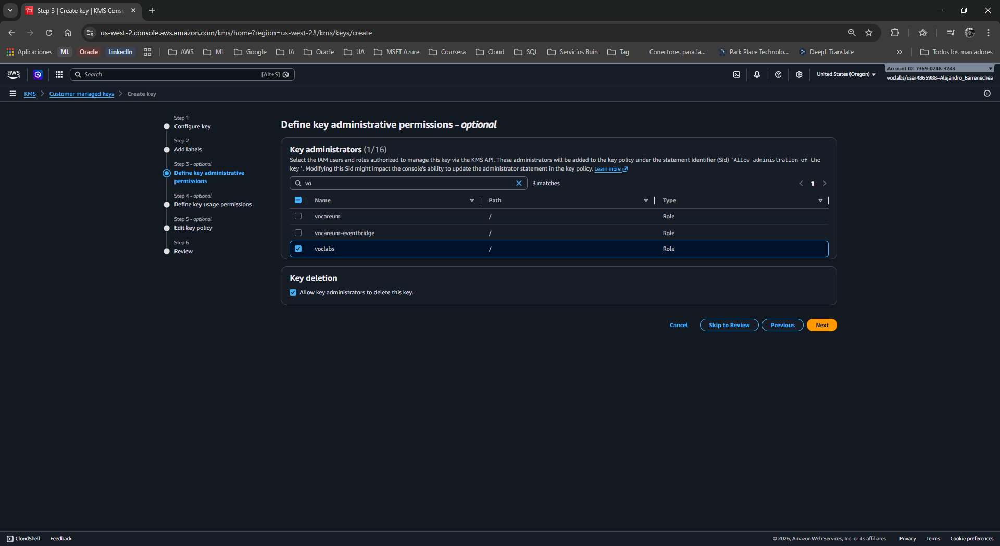
</p>

7. 👤 En **Define key usage permissions** (Usuarios de la clave), marca nuevamente la casilla del rol `voclabs` y haz clic en **Next**.

<p align="center">
  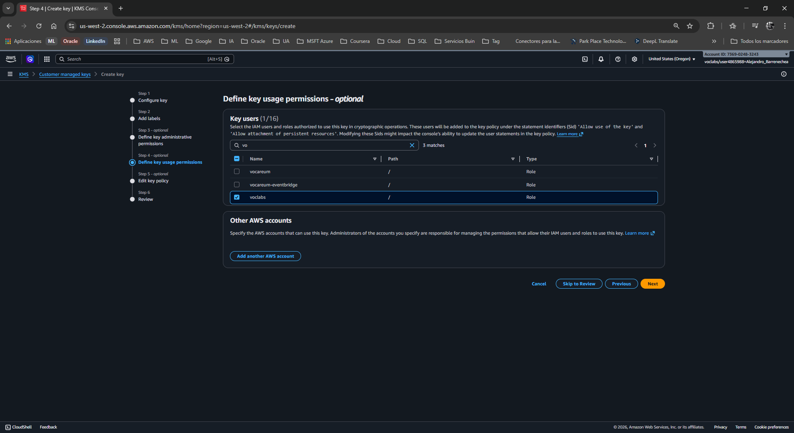
</p>

8. 👁️ Revisa la configuración (las políticas JSON generadas automáticamente) y haz clic en **Finish** (Finalizar).
  
<p align="center">
  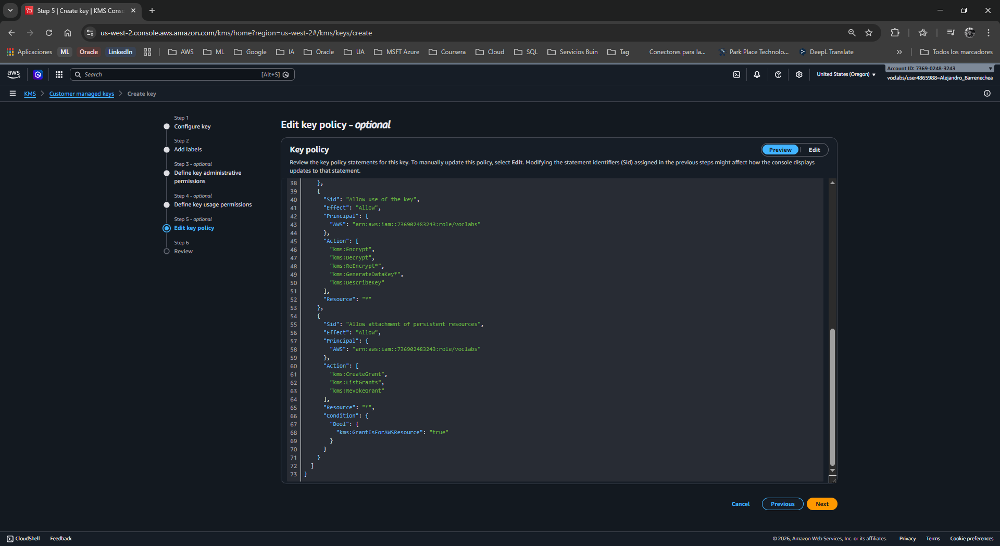
</p>

9.  📋 En la lista de claves (Customer managed keys), haz clic en el enlace de **MyKMSKey**. Copia el valor del **ARN** (Amazon Resource Name) y pégalo en un bloc de notas temporal en tu computadora. Lo necesitarás muy pronto.

<p align="center">
  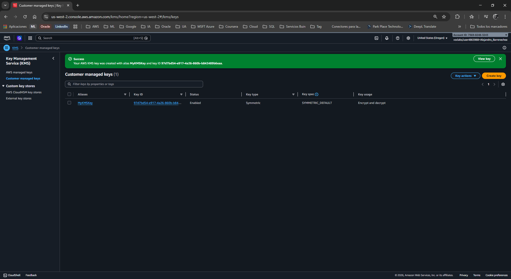
</p>
<p align="center">
  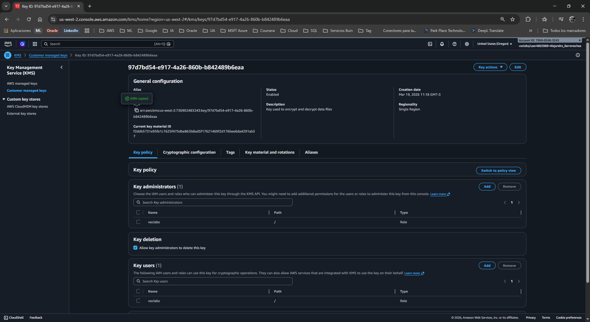
</p>

### ⚙️ Tarea 2: Configurar la instancia del Servidor de Archivos (File Server)
Ahora prepararás el servidor EC2 instalando las herramientas criptográficas y configurando las credenciales.

1. 🔎 En la barra de búsqueda superior, escribe `EC2` y ábrelo.
2. 📂 En el panel izquierdo, selecciona **Instances**.
3. ☑️ Selecciona la instancia llamada **File Server** y haz clic en el botón superior **Connect** (Conectar).
4. 탭 Selecciona la pestaña **Session Manager** y haz clic en **Connect**. Se abrirá una terminal negra de comandos en tu navegador.
5. ⌨️ Ejecuta los siguientes comandos para ir al directorio de inicio e inicializar la estructura de configuración de AWS:
   ```bash
   cd ~
   aws configure
   ```
6. ⌨️ Llena los datos solicitados de la siguiente manera (presiona *Enter* después de cada uno):
   * **AWS Access Key ID:** Escribe `1`
   * **AWS Secret Access Key:** Escribe `1`
   * **Default region name:** Copia y pega la región que aparece en tu panel de Vocareum (ej. `us-east-2`).
   * **Default output format:** Presiona *Enter* (déjalo en blanco).
   * *Nota:* Los valores "1" son marcadores temporales para que el sistema cree el archivo `~/.aws/credentials`.

<p align="center">
  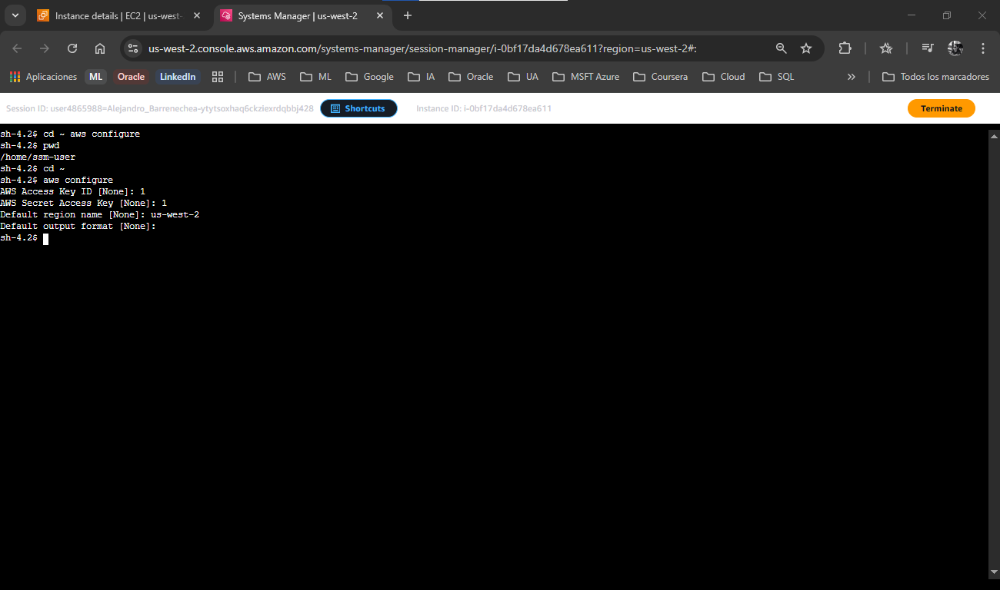
</p>

7. 📋 Regresa a la pestaña de tu plataforma de laboratorio (Vocareum), haz clic en el botón **AWS Details** (arriba de *Start Lab*) y junto a **AWS CLI**, haz clic en **Show**. Copia todo el bloque de texto (incluyendo `[default]`).
8. 🔙 Vuelve a la terminal de Session Manager. Abre el archivo de credenciales con el editor `vi`:
   ```bash
   vi ~/.aws/credentials
   ```
9. ⌨️ Presiona la letra `d` dos veces (`dd`) repetidamente para borrar todas las líneas existentes.
10. ⌨️ Presiona la tecla `i` para entrar en modo *Insert* (Insertar).
11. 📋 Pega el bloque de credenciales que copiaste de Vocareum (usa `Ctrl+Shift+V` o clic derecho > Pegar).
12. 💾 Presiona la tecla `Escape`, luego escribe `:wq` y presiona `Enter` para guardar y salir.

<p align="center">
  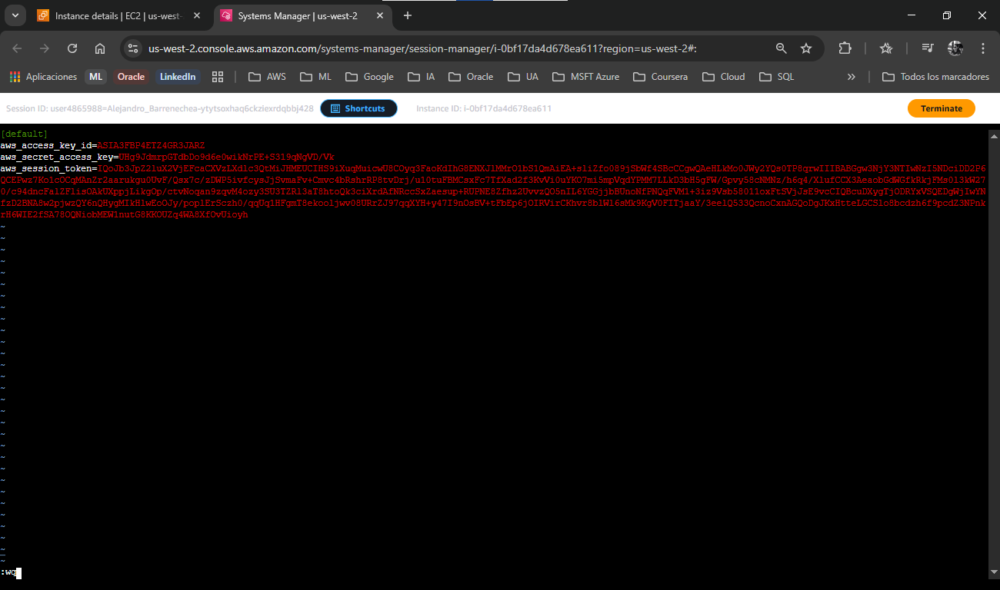
</p>

13. ⌨️ Verifica que el archivo se guardó correctamente:
    ```bash
    cat ~/.aws/credentials
    ```
14. 🛠️ Instala el **AWS Encryption CLI** y configura la variable de entorno PATH ejecutando:
    ```bash
    pip3 install aws-encryption-sdk-cli
    export PATH=$PATH:/home/ssm-user/.local/bin
    ```

<p align="center">
  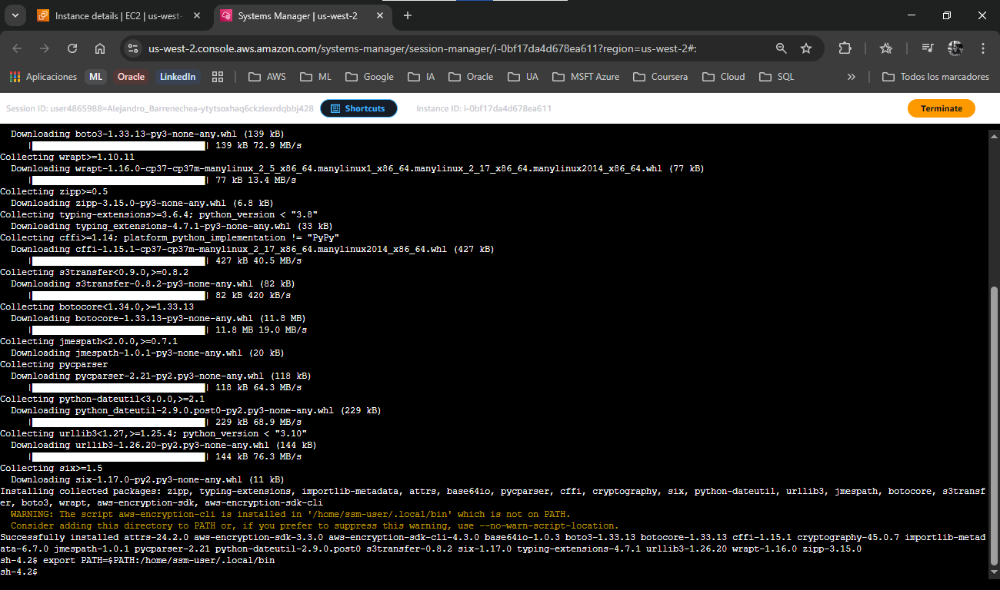
</p>

### 🔒 Tarea 3: Encriptar y descifrar datos
En esta fase final, crearás datos sensibles y probarás el motor criptográfico local.

1. ⌨️ Crea tres archivos de texto y añade contenido secreto al primero:
   ```bash
   touch secret1.txt secret2.txt secret3.txt
   echo 'TOP SECRET 1!!!' > secret1.txt
   ```
2. 👁️ Verifica el contenido en texto plano legible:
   ```bash
   cat secret1.txt
   ```
3. 📁 Crea un directorio para guardar los resultados cifrados:
   ```bash
   mkdir output
   ```

<p align="center">
  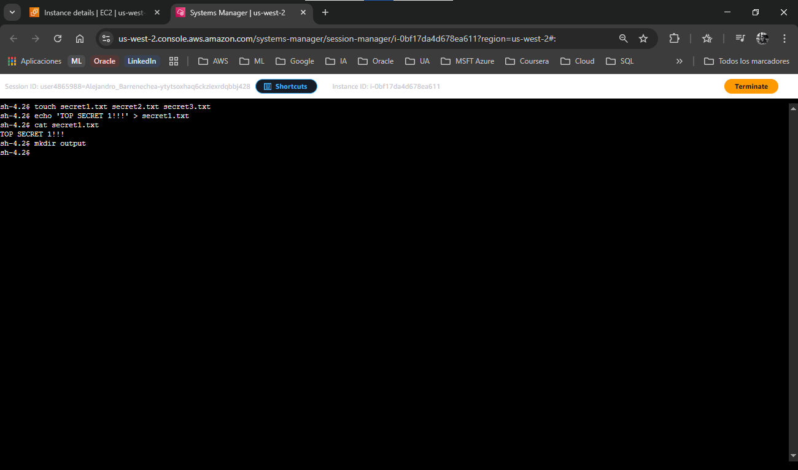
</p>

4. 🔑 Define una variable de entorno con el ARN de tu clave KMS (reemplaza `(KMS ARN)` con el ARN exacto que guardaste en tu bloc de notas en la Tarea 1):
   ```bash
   keyArn=(KMS ARN)
   ```
5. 🔐 **¡Encripta el archivo!** Ejecuta el siguiente comando bloque (cópialo y pégalo completo):
   ```bash
   aws-encryption-cli --encrypt \
                        --input secret1.txt \
                        --wrapping-keys key=$keyArn \
                        --metadata-output ~/metadata \
                        --encryption-context purpose=test \
                        --commitment-policy require-encrypt-require-decrypt \
                        --output ~/output/.
   ```
6. ⌨️ Valida si el comando fue exitoso (un resultado de `0` significa éxito):
   ```bash
   echo $?
   ```

<p align="center">
  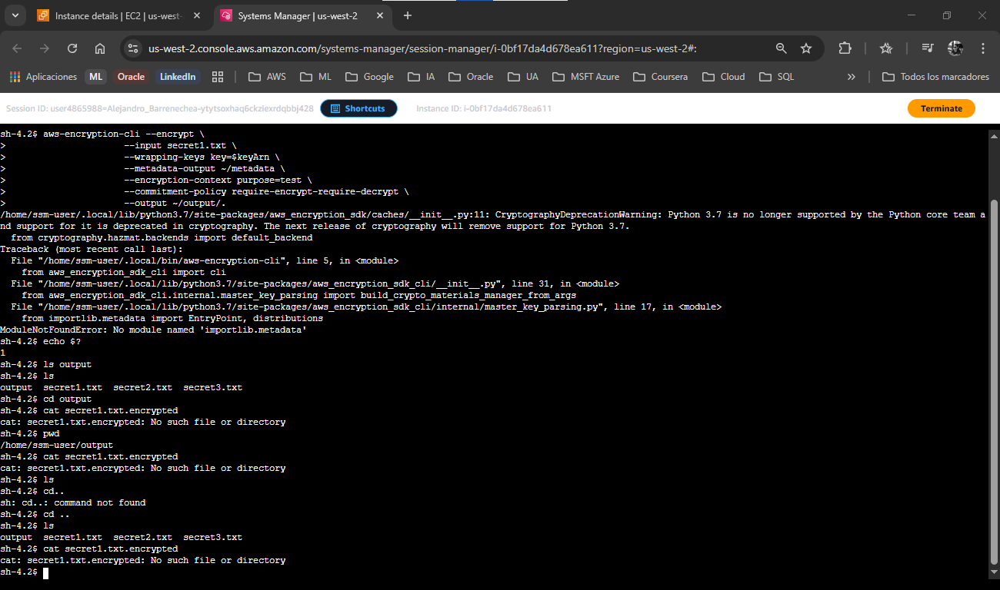
</p>

Durante la ejecución del laboratorio de protección de datos (Tarea 3, Paso 5), el comando de encriptación falló, arrojando un código de salida `1` (`echo $?`).

**Estrategia de Solución:** En un entorno de producción, la solución ideal sería actualizar el sistema operativo o la versión de Python. Sin embargo, en un entorno de laboratorio efímero, la solución más rápida es instalar manualmente el *backport* (parche de compatibilidad) de esa librería específica para que Python 3.7 pueda entenderla.

1. 👁️ Visualiza el archivo encriptado y trata de leerlo:
   ```bash
   cd output
   ls
   cat secret1.txt.encrypted
   ```
   * *Diagnóstico visual:* Observarás caracteres ilegibles y símbolos extraños. El texto original `TOP SECRET 1!!!` se ha transformado en un *Ciphertext* impenetrable.

2. 🔓 **¡Descifra el archivo!** Regresa el archivo a su estado original (presiona *Enter* primero si tu terminal quedó desordenada por los caracteres extraños). Ejecuta:
   ```bash
   aws-encryption-cli --decrypt \
                        --input secret1.txt.encrypted \
                        --wrapping-keys key=$keyArn \
                        --commitment-policy require-encrypt-require-decrypt \
                        --encryption-context purpose=test \
                        --metadata-output ~/metadata \
                        --max-encrypted-data-keys 1 \
                        --buffer \
                        --output .
   ```
3. 👁️ Verifica el resultado final listando y leyendo el nuevo archivo descifrado:
   ```bash
   ls
   cat secret1.txt.encrypted.decrypted
   ```
   * *Validación:* El texto `TOP SECRET 1!!!` volverá a aparecer perfectamente legible en tu pantalla.[📸 Inserta tu captura aquí: (Captura de la terminal mostrando el comando de descifrado exitoso y la lectura del archivo .decrypted restaurando el texto "TOP SECRET 1!!!")]

---

## 💡 Respuestas Analíticas al Caso

**¿Por qué utilizamos Encriptación Simétrica y no Asimétrica para los archivos?**
*   **Respuesta:** La criptografía simétrica (donde la misma clave cifra y descifra) utiliza algoritmos mucho más rápidos y menos intensivos en CPU (como AES-256). Es el estándar de la industria para cifrar grandes volúmenes de datos (archivos, bases de datos). La criptografía asimétrica (llave pública/privada) es matemáticamente lenta y se usa típicamente para establecer canales seguros (TLS/SSL) o firmar digitalmente, no para cifrar *Data at Rest* de forma masiva.

**¿Qué función cumple exactamente el AWS Encryption CLI y qué es el Cifrado de Sobres?**
*   **Respuesta:** Enviar Gigabytes de archivos a través de Internet hacia AWS KMS para ser cifrados sería ineficiente y costoso. El *AWS Encryption CLI* soluciona esto mediante el **Cifrado de Sobres (Envelope Encryption)**. En este modelo, el CLI le pide a KMS una "Clave de Datos" (*Data Key*). El CLI usa esa clave de datos en la memoria RAM del servidor local para cifrar el archivo a máxima velocidad. Luego, guarda el archivo cifrado y le "pega" como metadato la clave de datos (la cual viene envuelta/cifrada por la clave maestra de KMS).