# 🛡️ Introducción a la Gestión de Identidades y Accesos (AWS IAM)

📊 **Dificultad:** Principiante  
⏳ **Tiempo Estimado:** 60 minutos  
🛠️ **Servicios Principales:** AWS Identity and Access Management (IAM), Amazon EC2, Amazon S3.  

---

## 🎯 Resumen y Objetivos
En este laboratorio, explorarás y configurarás el núcleo de la seguridad en la nube: **AWS IAM**. Implementarás políticas de contraseñas estrictas a nivel de cuenta, auditarás identidades preexistentes y aplicarás el principio de menor privilegio (PoLP) utilizando un modelo de Control de Acceso Basado en Roles (RBAC) mediante Grupos de Usuarios. Finalmente, validarás el acceso efectivo de cada usuario iniciando sesión en la consola.

**Objetivos alcanzados al finalizar:**
* ✅ Configurar y aplicar una política de contraseñas robusta para la cuenta de AWS.
* ✅ Explorar Usuarios, Grupos de Usuarios y analizar la estructura JSON de las políticas de IAM.
* ✅ Asignar usuarios a grupos específicos para heredar permisos predefinidos.
* ✅ Iniciar sesión con URL dedicadas y experimentar los bloqueos de seguridad por falta de permisos (Implicit Deny).

---

## 🕵️‍♂️ Análisis del Escenario (Diagnóstico Inicial)
Tu empresa está expandiendo agresivamente su uso de AWS, gestionando múltiples instancias de Amazon EC2 y almacenando grandes volúmenes de datos en Amazon S3. Actualmente, el control de acceso no está estandarizado. 

**Diagnóstico y Estrategia:** Como Ingeniero de Soporte Cloud, debes garantizar que cada empleado (usuario) tenga acceso *única y exclusivamente* a los recursos necesarios para su puesto de trabajo. En lugar de asignar permisos individuales a cada persona (lo cual es inmanejable a escala), implementarás **Grupos de Usuarios**. Asignarás políticas de IAM a estos grupos y luego simplemente añadirás a los usuarios a sus grupos correspondientes, automatizando la herencia de permisos. Además, blindarás la cuenta forzando reglas de complejidad de contraseñas corporativas.

---

## 🏗️ Arquitectura del Laboratorio
El entorno ha sido pre-desplegado con la siguiente estructura lógica:
1. 👤 **Usuarios:** `user-1`, `user-2`, `user-3`.
2. 👥 **Grupos y Políticas:**
   * **S3-Support:** Política administrada `AmazonS3ReadOnlyAccess`.
   * **EC2-Support:** Política administrada `AmazonEC2ReadOnlyAccess`.
   * **EC2-Admin:** Política *Inline* (Personalizada) que permite ver, iniciar y detener instancias EC2.
3. ☁️ **Recursos:** Un *bucket* de S3 y una instancia EC2 de prueba.

  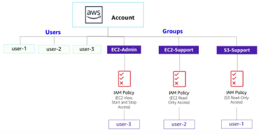

---

## ⚙️ Desarrollo de las Tareas

### 🔐 Tarea 1: Crear una Política de Contraseñas
Para cumplir con los estándares de ciberseguridad corporativos, endurecerás las reglas para la creación de contraseñas.

1. 🔎 En la barra de búsqueda superior, escribe `IAM` y abre el servicio.
2. 📂 En el panel de navegación izquierdo, selecciona **Account settings** (Configuración de la cuenta).
3. ⚙️ En la sección **Password policy** (Política de contraseñas), haz clic en el botón **Change password policy** (o *Edit*).
4. ☑️ Configura los siguientes requisitos estrictos:
   * **Enforce minimum password length** (Longitud mínima): Cambia de 8 a **10** caracteres.
   * Selecciona **todas** las casillas de verificación de complejidad (mayúsculas, minúsculas, números y símbolos), **EXCEPTO** la de *Password expiration requires administrator reset*.
   * **Enable password expiration** (Expiración de contraseña): Actívalo y déjalo en **90** días.
   * **Prevent password reuse** (Evitar reutilización): Déjalo en **5** contraseñas.
5. 💾 Haz clic en **Save changes**. Esta política ahora rige sobre toda tu cuenta de AWS.

  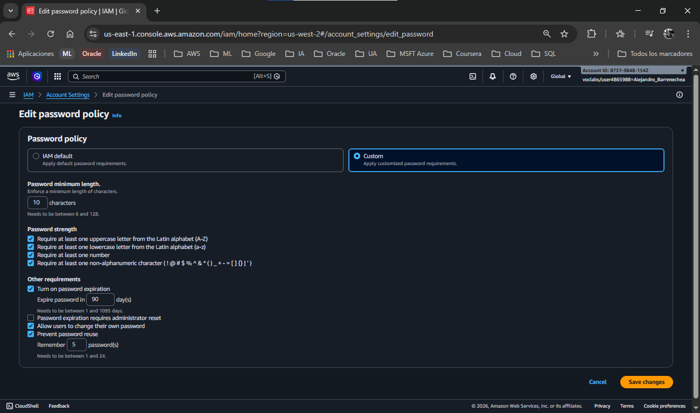

### 🕵️‍♂️ Tarea 2: Explorar Usuarios y Grupos
Auditarás los recursos preexistentes y analizarás la estructura de los permisos.

1. 📂 En el panel izquierdo, selecciona **Users** (Usuarios). Verás a `user-1`, `user-2` y `user-3`.
2. 🖱️ Haz clic en **user-1**.
   * 탭 En la pestaña **Permissions**, nota que no tiene políticas asignadas.
   *  탭 En la pestaña **Groups**, nota que no pertenece a ningún grupo. Por defecto, un nuevo usuario de IAM no puede hacer *absolutamente nada*.

  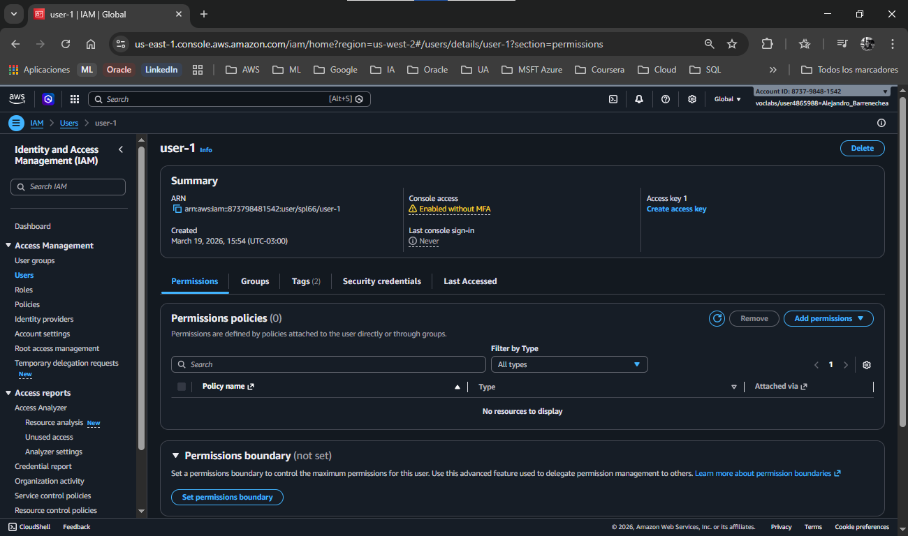

  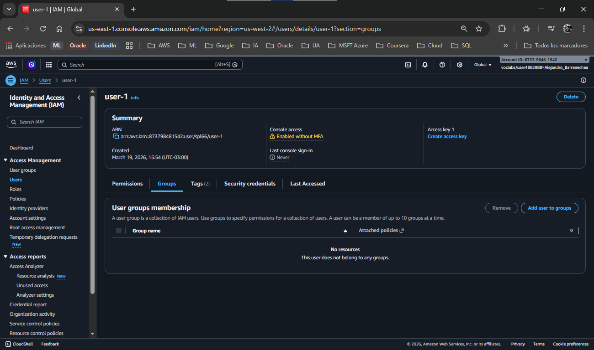

3. 📂 En el panel izquierdo, selecciona **User groups** (Grupos de usuarios).
4. 🖱️ Haz clic en el grupo **EC2-Support** y ve a la pestaña **Permissions**.
5. ➕ Haz clic en el signo **[+]** junto a la política administrada `AmazonEC2ReadOnlyAccess` para expandir el JSON.
   * *Análisis:* Observa la estructura: **Effect** (Allow/Deny), **Action** (ej. `ec2:Describe*`), y **Resource** (`*`). Esto significa que permite leer cualquier recurso de EC2, pero no modificarlo.

  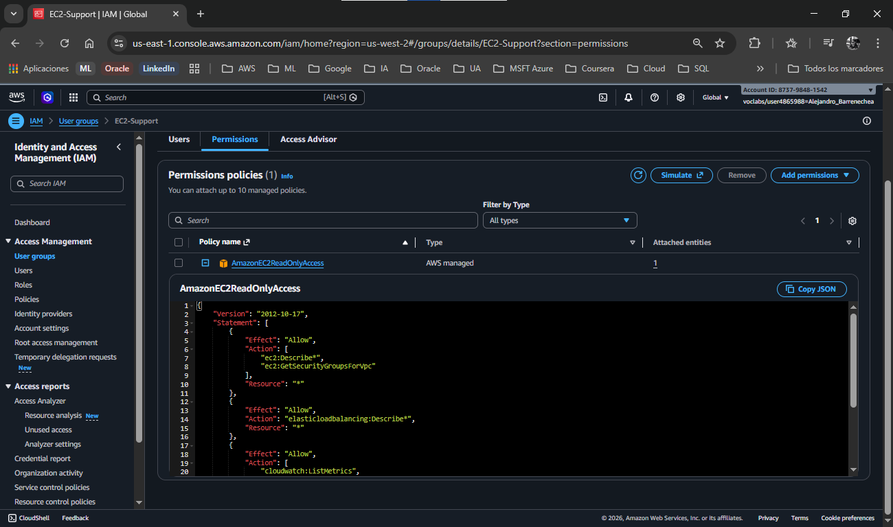

6. 🔙 Regresa a **User groups** y selecciona **EC2-Admin**. Ve a su pestaña **Permissions**.
7. ➕ Expande la política en línea (**Inline policy**) `EC2-Admin-Policy`.
   * *Análisis:* A diferencia del soporte, este JSON incluye permisos como `ec2:StartInstances` y `ec2:StopInstances`. Esta política fue escrita a medida para este administrador.

  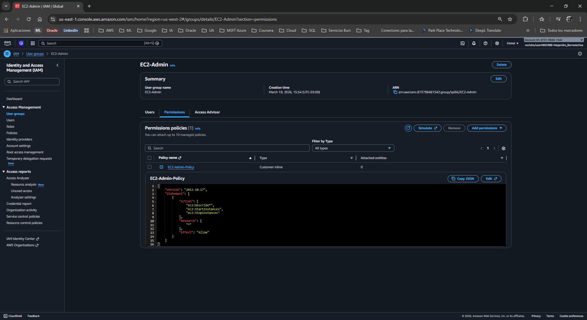

### 👥 Tarea 3: Asignar Usuarios a sus Grupos correspondientes
Ahora ejecutarás tu matriz de Control de Acceso Basado en Roles (RBAC).

**Añadir soporte de S3:**
1. 📂 En el panel izquierdo, selecciona **User groups** y entra al grupo **S3-Support**.
2. 탭 Ve a la pestaña **Users** y haz clic en **Add users**.
3. ☑️ Selecciona la casilla de **user-1** y haz clic en **Add users**.

  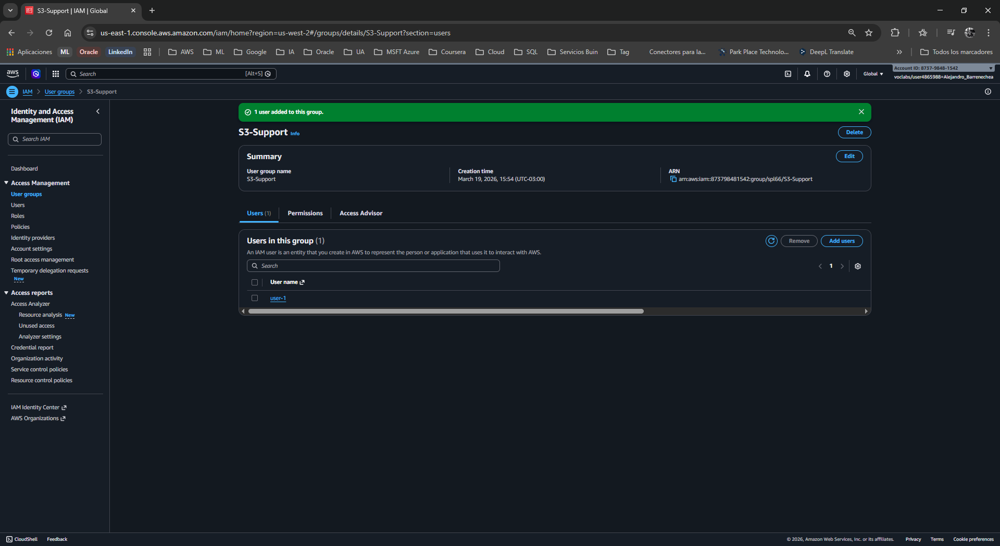

**Añadir soporte de EC2:**
1. 🔙 Regresa a **User groups** y entra a **EC2-Support**.
2. 탭 Ve a la pestaña **Users** > **Add users**.
3. ☑️ Selecciona a **user-2** y haz clic en **Add users**.

  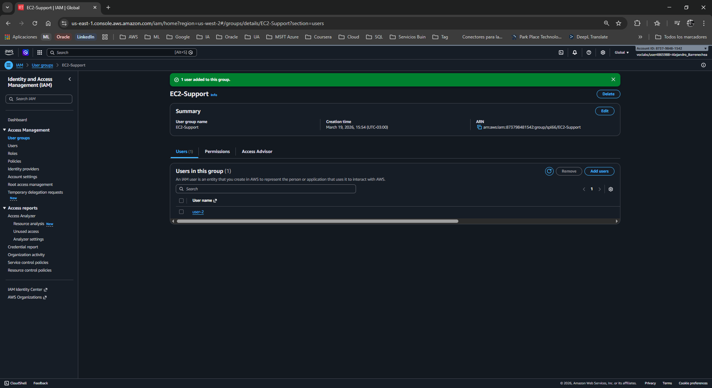

**Añadir Administrador de EC2:**
1. 🔙 Regresa a **User groups** y entra a **EC2-Admin**.
2. 탭 Ve a la pestaña **Users** > **Add users**.
3. ☑️ Selecciona a **user-3** y haz clic en **Add users**.
   * *Validación:* En el panel principal de **User groups**, la columna *Users* debe mostrar un `1` para cada uno de los tres grupos.

  

  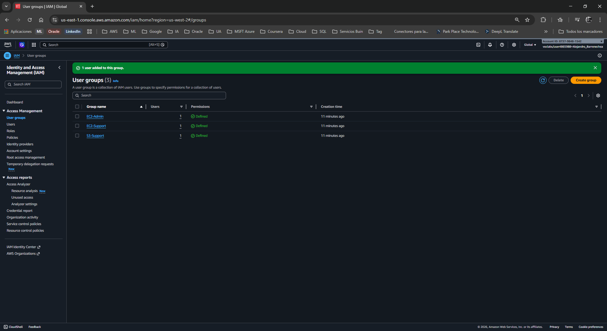

### 🧪 Tarea 4: Iniciar Sesión y Probar Permisos (Validación)
En esta fase, actuarás como los empleados para probar si tus políticas funcionan.

1. 📂 En el panel izquierdo de IAM, selecciona **Dashboard** (Panel de control).
2. 📋 En el panel derecho (sección *AWS Account*), copia la URL de inicio de sesión de IAM (**Sign-in URL**).

  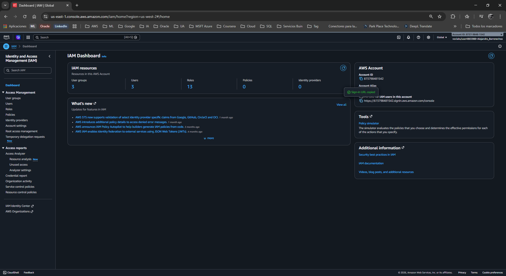

3. 🕵️ Abre una **Ventana de Incógnito / Navegación Privada** en tu navegador.
4. 🌐 Pega la URL y presiona Enter.

**Prueba 1: Soporte S3 (user-1)**
1. 🔑 Inicia sesión con:
   * **IAM user name:** `user-1`
   * **Password:** `Lab-Password1`

  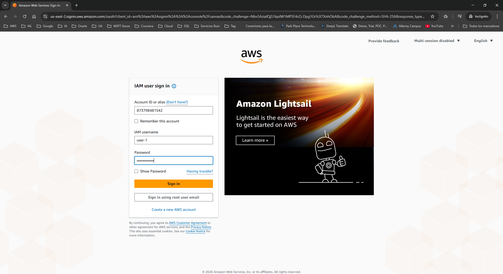

2. 🔎 Navega al servicio **S3**. Deberías poder ver la lista de *buckets* y entrar a explorarlos.

  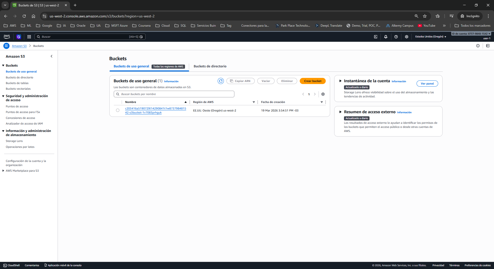

3. 🔎 Navega al servicio **EC2** > **Instances**.
   * *Validación:* Recibirás mensajes de error en rojo (*API Error / Not Authorized*). El usuario no tiene permisos sobre EC2.

  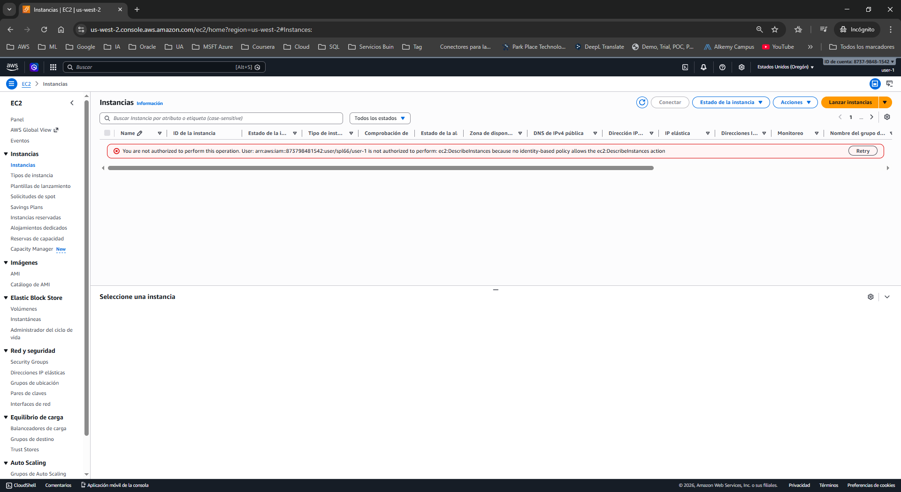

4. 🖱️ Cierra la sesión de `user-1` (Arriba a la derecha > **Sign out**).

**Prueba 2: Soporte EC2 (user-2)**
1. 🌐 Vuelve a entrar a la URL de inicio de sesión.
2. 🔑 Inicia sesión como `user-2` (Password: `Lab-Password2`).

  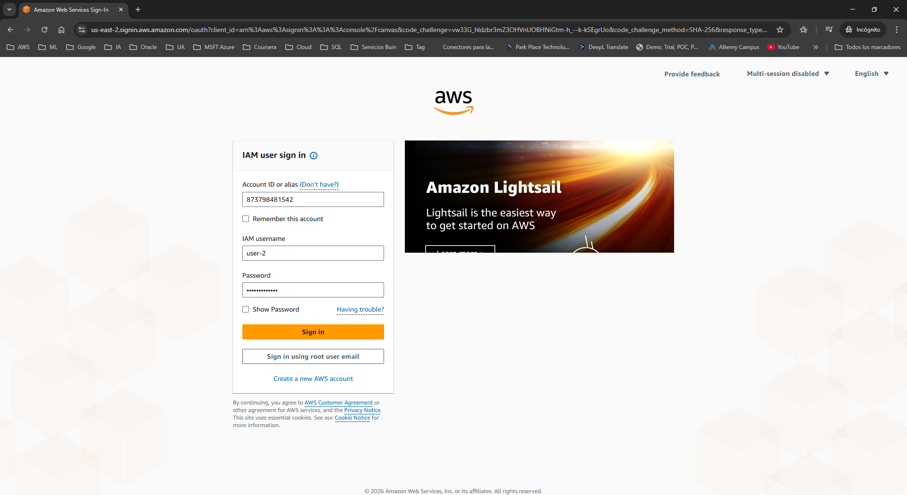

3. 🔎 Navega a **S3**. Verás un error de *You don't have permissions to list buckets*.

  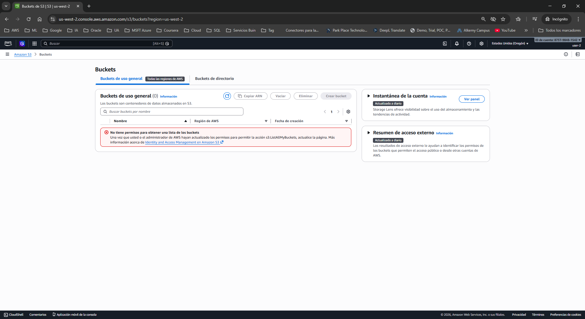

4. 🔎 Navega a **EC2** > **Instances**. Ahora SÍ puedes ver la instancia listada.

  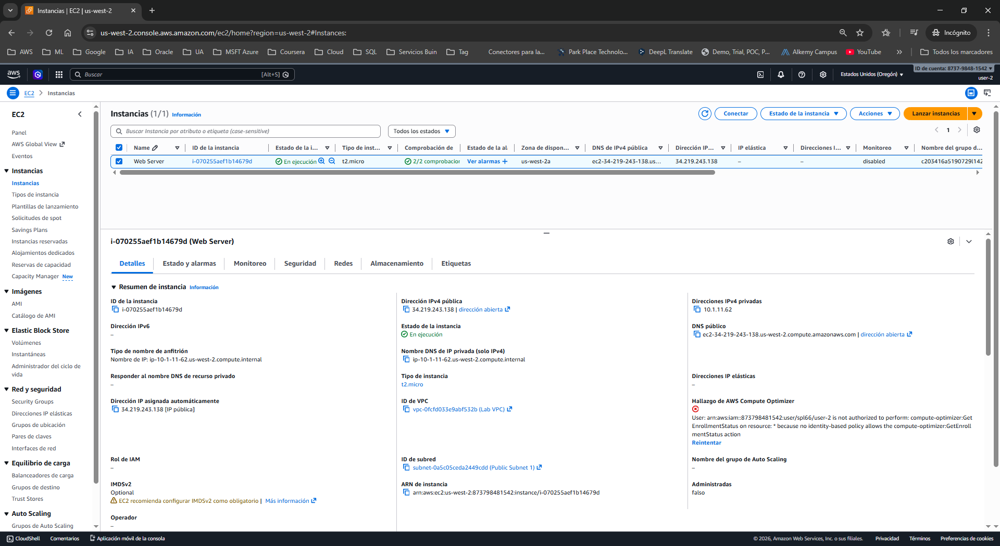

5. ☑️ Selecciona la instancia, haz clic en **Instance state** y selecciona **Stop instance**.
   * *Validación:* Obtendrás un error indicando *Failed to stop the instance... You are not authorized*. Tiene acceso de solo lectura.

  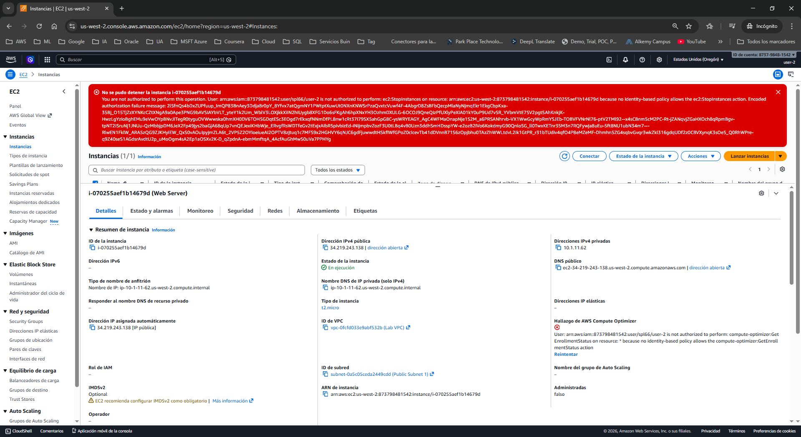

6. 🖱️ Cierra la sesión de `user-2`.

**Prueba 3: Administrador EC2 (user-3)**
1. 🌐 Vuelve a entrar a la URL de inicio de sesión.
2. 🔑 Inicia sesión como `user-3` (Password: `Lab-Password3`).

  

3. 🔎 Navega a **EC2** > **Instances** (asegúrate de estar en la región correcta).

  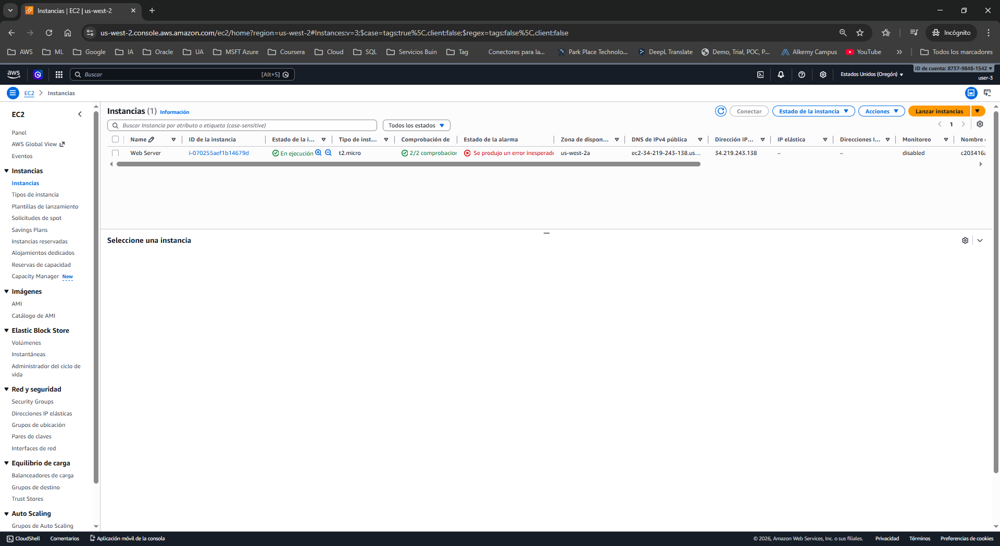

4. ☑️ Selecciona la instancia, haz clic en **Instance state** > **Stop instance** > **Stop**.
   * *Validación Exitosa:* La instancia cambiará al estado *Stopping* sin arrojar ningún error. El RBAC funciona a la perfección.

  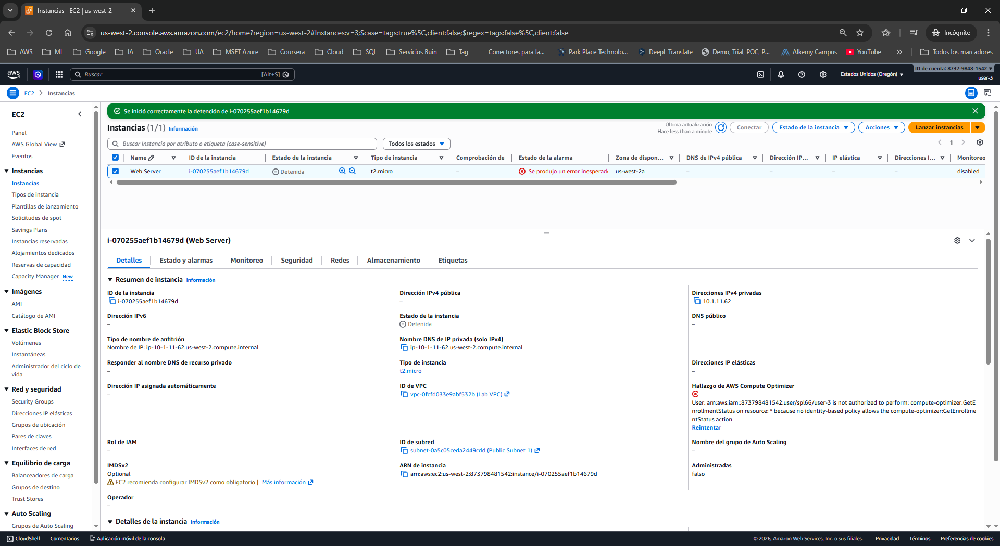

5. ❌ Cierra la ventana de incógnito.[📸 Inserta tu captura aquí: (Captura de la ventana de incógnito como user-3, mostrando el banner verde de éxito o el estado de la instancia cambiando a "Stopping")]

---

## 💡 Respuestas Analíticas al Caso

**¿Por qué utilizamos "Grupos de Usuarios" en lugar de asignar las políticas directamente a los usuarios?**
*   **Respuesta:** Por escalabilidad y reducción de errores. Si una empresa tiene 50 administradores de EC2 y cambia una política, actualizar 50 perfiles individuales tomaría horas y podría generar discrepancias (brechas de seguridad). Al usar grupos, gestionamos el permiso en un solo punto lógico. Si entra un nuevo empleado, simplemente lo agregamos al grupo; si se transfiere de departamento, lo movemos de grupo y sus permisos se reasignan instantáneamente.

**¿Por qué `user-1` y `user-2` recibían mensajes de error al intentar ver servicios no autorizados?**
*   **Respuesta:** Se debe al concepto de **Denegación Implícita (Implicit Deny)** de AWS. En IAM, todo está bloqueado por defecto. A menos que exista una declaración explícita de "Allow" (Permitir) en una política adjunta al usuario o a su grupo para ese recurso en particular, AWS denegará el acceso automáticamente, garantizando el Principio de Menor Privilegio.

---

## 📧 Correo Formal de Respuesta al Cliente

**Asunto:** Resolución de Ticket: Implementación de Políticas IAM y Endurecimiento de Accesos  
**Para:** Director de Seguridad de la Información (CISO) / Gerencia de TI  

Estimado equipo,

Me comunico con ustedes para informarles que hemos finalizado la estandarización y auditoría del sistema de Control de Accesos de AWS (IAM) de su entorno cloud.

**Principales acciones ejecutadas:**
1. **Endurecimiento de Contraseñas:** Hemos activado una nueva política de seguridad a nivel cuenta. A partir de ahora, todos los usuarios deberán crear contraseñas de al menos 10 caracteres, incluyendo requisitos de complejidad (alfanuméricos y símbolos). Además, implementamos la rotación obligatoria cada 90 días y bloqueamos la reutilización de las últimas 5 contraseñas.
2. **Implementación de Modelo RBAC (Roles de Negocio):** Agrupamos los permisos según las funciones laborales.
   * El personal de soporte de almacenamiento ha sido añadido al grupo `S3-Support` (Acceso exclusivo de lectura a S3).
   * El personal de soporte de cómputo fue asignado a `EC2-Support` (Monitoreo sin permisos de modificación).
   * Los administradores de infraestructura fueron ubicados en `EC2-Admin` (Privilegios operativos sobre instancias EC2).
3. **Validación Práctica:** Realizamos pruebas de "Denegación Implícita" con los perfiles `user-1`, `user-2` y `user-3`, garantizando que es criptográficamente imposible que un empleado acceda o modifique servicios que no corresponden estrictamente a su departamento.

La infraestructura ahora se alinea con las mejores prácticas del *AWS Well-Architected Framework* (Pilar de Seguridad). Les recordamos que sus equipos pueden iniciar sesión a través de la URL de autenticación dedicada de su cuenta.