# 🛡️ Protección contra Malware utilizando AWS Network Firewall

📊 **Dificultad:** Intermedio / Seguridad de Redes  
⏳ **Tiempo Estimado:** 45 minutos  
🛠️ **Servicios Principales:** AWS Network Firewall, Amazon VPC, Amazon EC2 (SSM Session Manager).  

---

## 🎯 Resumen y Objetivos
En este laboratorio, fortalecerás el perímetro de seguridad de una red corporativa implementando reglas de inspección profunda de paquetes (DPI) mediante **AWS Network Firewall**. Aprenderás a configurar el enrutamiento de tráfico desde un motor sin estado (*Stateless*) hacia un motor con estado (*Stateful*) y redactarás reglas IPS (Sistema de Prevención de Intrusiones) compatibles con el estándar **Suricata** para bloquear la descarga activa de *malware*.

**Objetivos alcanzados al finalizar:**
* ✅ Confirmar vulnerabilidades de red utilizando comandos de descarga (`wget`).
* ✅ Modificar las acciones predeterminadas de una política de AWS Network Firewall.
* ✅ Crear un grupo de reglas con estado (*Stateful Rule Group*) utilizando sintaxis Suricata.
* ✅ Validar la mitigación del ataque interceptando y bloqueando el tráfico malicioso.

---

## 🕵️‍♂️ Análisis del Escenario (Diagnóstico Inicial)
Has sido contratado como Ingeniero de Seguridad por **AnyCompany**. Recientemente, los sistemas de monitoreo han detectado que los empleados están descargando inadvertidamente *malware* (específicamente mineros de criptomonedas y troyanos basados en Java) al navegar por sitios web comprometidos. El equipo de TI te ha proporcionado las URLs exactas de origen. 

**Diagnóstico y Estrategia:** El entorno ya cuenta con un firewall de red (`LabFirewall`), pero actualmente permite el tráfico HTTP de salida sin inspeccionar el contenido de las peticiones (URI). Tu estrategia será reconfigurar la política del firewall para que envíe el tráfico a un motor *Stateful* y aplicar reglas IPS de Suricata que busquen coincidencias exactas con las rutas de los archivos maliciosos (`/data/js_crypto_miner.html`), "tirando" (Drop) la conexión antes de que el *payload* ingrese a la red corporativa.

---

## 🏗️ Arquitectura del Laboratorio
1. 💻 **TestInstance (Amazon EC2):** Un servidor aislado en una zona perimetral que utilizarás para simular el comportamiento de un usuario descargando archivos maliciosos.
2. 🧱 **AWS Network Firewall:** Cortafuegos administrado y escalable desplegado en la VPC para filtrar el tráfico de red en la capa 3 a la capa 7.
3. 📜 **Firewall Policy:** El documento central que define cómo el firewall procesa los paquetes (Stateless vs Stateful).
4. ⚙️ **Stateful Rule Group (Suricata):** Colección de reglas IPS que analizan el contexto y la carga útil (*payload*) del tráfico HTTP para bloquear amenazas específicas.

---

## ⚙️ Desarrollo de las Tareas

### 🐛 Tarea 1: Confirmar el alcance del malware (Prueba de Penetración)
Primero, simularás la vulnerabilidad actuando como un usuario interno para confirmar que la red actual permite la descarga del *malware*.

1. 🔎 En la barra de búsqueda superior, escribe `EC2` y abre el servicio.
2. 📂 En el panel izquierdo, selecciona **Instances**.
3. ☑️ Selecciona la instancia **TestInstance** y haz clic en el botón superior **Connect**.

<p align="center">
  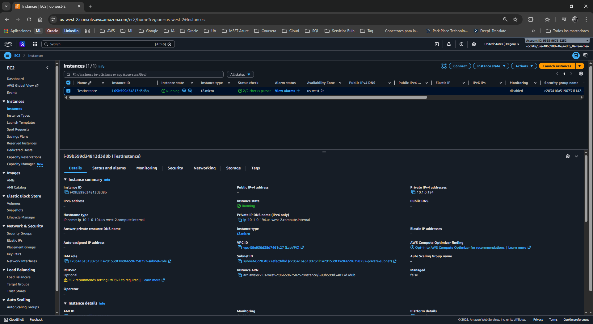
</p>

4. 탭 Selecciona la pestaña **Session Manager** y haz clic en **Connect** para abrir la terminal.
5. ⌨️ Navega a tu directorio de inicio:
   ```bash
   cd ~
   pwd
   ```
6. ⚠️ **Advertencia:** Los siguientes enlaces son inofensivos (archivos de prueba estandarizados), pero simulan *malware* real. Ejecuta los siguientes comandos para descargarlos en tu servidor:
   ```bash
   wget http://malware.wicar.org/data/js_crypto_miner.html
   wget http://malware.wicar.org/data/java_jre17_exec.html
   ```
7. 👁️ Observa que la consola responde con un código `200 OK`, confirmando que el firewall dejó pasar el tráfico.
8. ⌨️ Verifica que los archivos maliciosos ya están en tu disco duro:
   ```bash
   ls
   ```
<p align="center">
  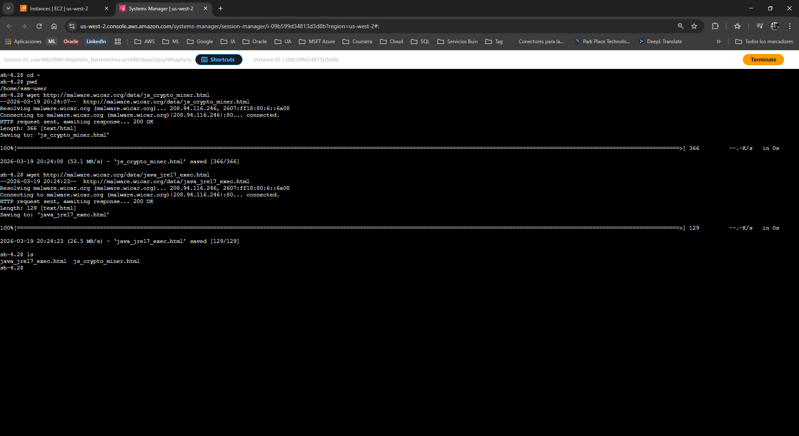
</p>

### 🔍 Tarea 2: Inspeccionar y configurar la Política del Firewall
Ajustarás el motor del firewall para que no solo mire las IPs (Stateless), sino que analice el flujo completo del tráfico (Stateful).

1. 🔎 En la barra de búsqueda superior, escribe `VPC` y abre el servicio.
2. 📂 En el panel de navegación izquierdo, desplázate hacia abajo hasta la sección **Network Firewall** y selecciona **Firewalls**.

<p align="center">
  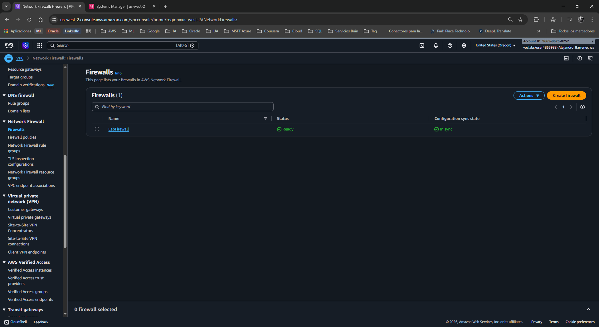
</p>

3. 🖱️ Haz clic en **LabFirewall**.
4. 🔗 Desplázate a la sección *Step 2: Configure the firewall policy* y haz clic en el enlace **LabFirewallPolicy**.
5. ⚙️ En la sección **Stateless default actions** (Acciones predeterminadas sin estado), haz clic en **Edit** (Editar).
6. ☑️ Configura las acciones para forzar la inspección profunda:
   * **Choose how to treat fragmented packets:** Selecciona `Use the same actions for all packets`.
   * **Action:** Abre el menú desplegable y cambia de *Pass* (Pasar) a `Forward to stateful rule groups` (Reenviar a grupos de reglas con estado).
7. 💾 Haz clic en **Save**.

<p align="center">
  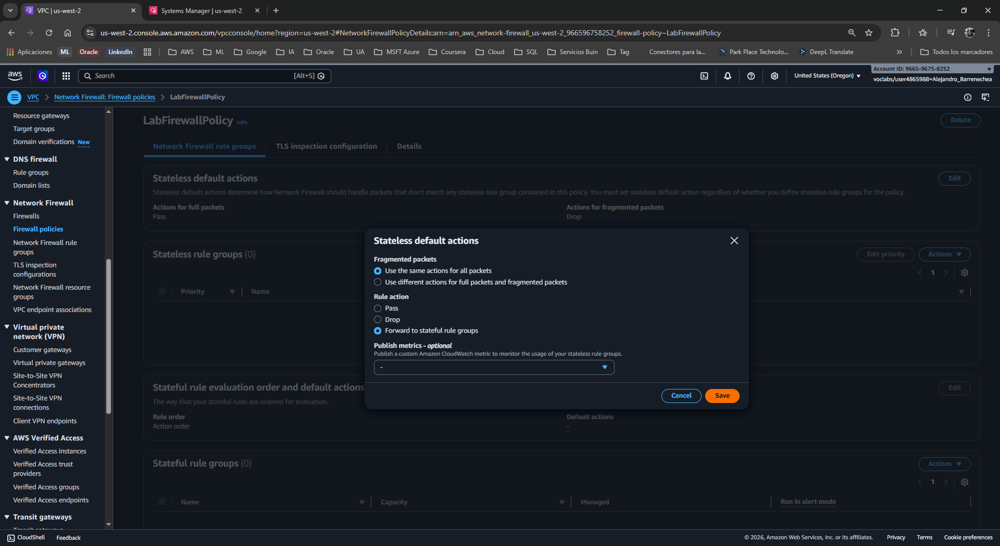
</p>

### 🛡️ Tarea 3: Crear el Grupo de Reglas (Suricata)
Aquí es donde reside la inteligencia del IPS. Crearás reglas que detecten las firmas exactas de los archivos maliciosos.

1. 📂 En el panel izquierdo (bajo *Network Firewall*), selecciona **Network Firewall rule groups**.
2. 🖱️ Haz clic en **Create Network Firewall rule group**.
3. ⚙️ En la sección *Create rule group*, configura:
   * **Rule group type:** `Stateful rule group`
   * **Rule group format:** `Suricata compatible rule string` (Cadena de reglas compatible con Suricata).
   * **Rule evaluation order:** `Action order`.
4. ➡️ Haz clic en **Next**.

<p align="center">
  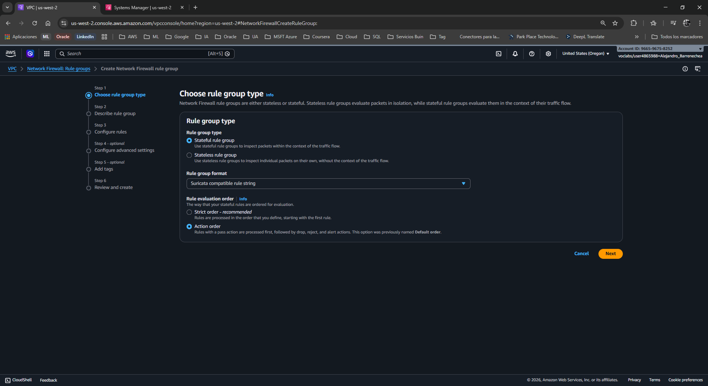
</p>

5. 📝 En *Rule group details*, define:
   * **Name:** `StatefulRuleGroup`
   * **Capacity:** `100` (Este es el límite de unidades de procesamiento que consumirá la regla).
6. ➡️ Haz clic en **Next**.

<p align="center">
  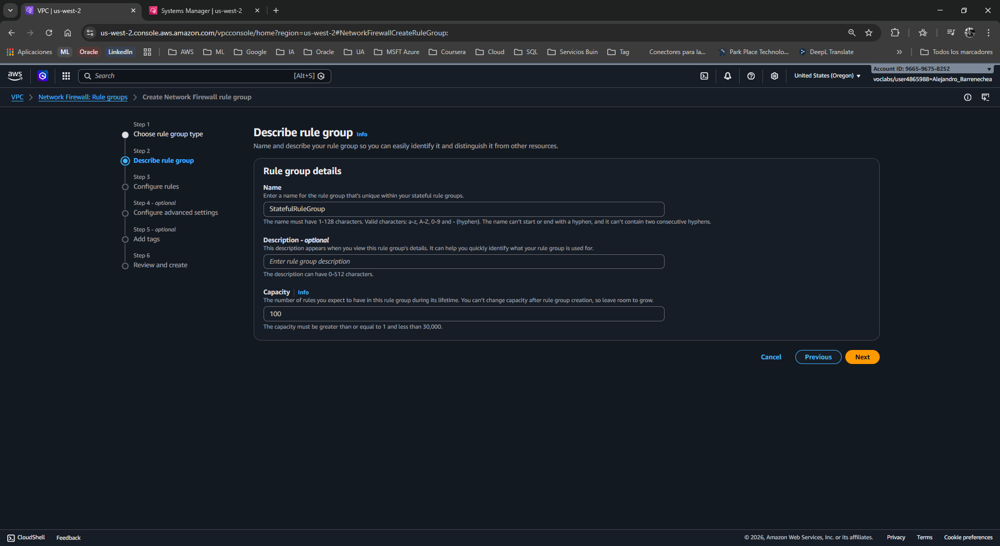
</p>

7. ⌨️ En la caja de texto **Suricata compatible IPS rules**, copia y pega exactamente el siguiente bloque de código:

   ```suricata
   drop http $HOME_NET any -> $EXTERNAL_NET 80 (msg:"MALWARE custom solution"; flow: to_server,established; classtype:trojan-activity; sid:2002001; content:"/data/js_crypto_miner.html";http_uri; rev:1;)

   drop http $HOME_NET any -> $EXTERNAL_NET 80 (msg:"MALWARE custom solution"; flow: to_server,established; classtype:trojan-activity; sid:2002002; content:"/data/java_jre17_exec.html";http_uri; rev:1;)
   ```
8. ➡️ Haz clic en **Next** repetidamente hasta llegar a la pantalla de revisión (*Review and create*).

<p align="center">
  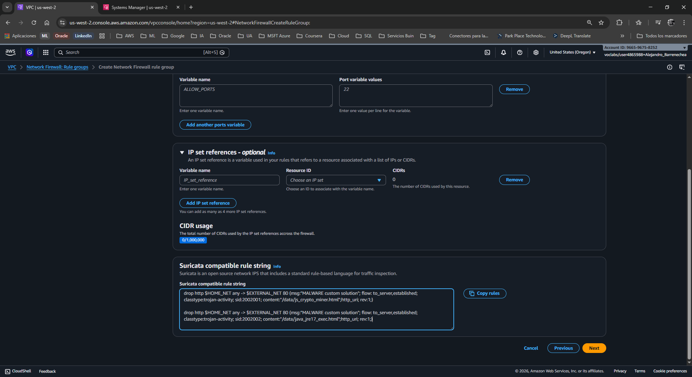
</p>

9.  💾 Haz clic en **Create stateful rule group**.

### 🔗 Tarea 4: Adjuntar el Grupo de Reglas al Firewall
Una regla no hace nada si no está asociada al firewall activo.

1. 📂 En el panel izquierdo, selecciona **Firewalls** y haz clic nuevamente en **LabFirewall**.
2. 🖱️ En la sección *Associated firewall policy*, haz clic en el enlace **LabFirewallPolicy**.
3. ⚙️ Desplázate hasta la sección **Stateful rule groups**.
4. 🖱️ Haz clic en el botón desplegable **Actions** o en **Add rule groups** (dependiendo de la interfaz) y selecciona `Add unmanaged stateful rule groups`.

<p align="center">
  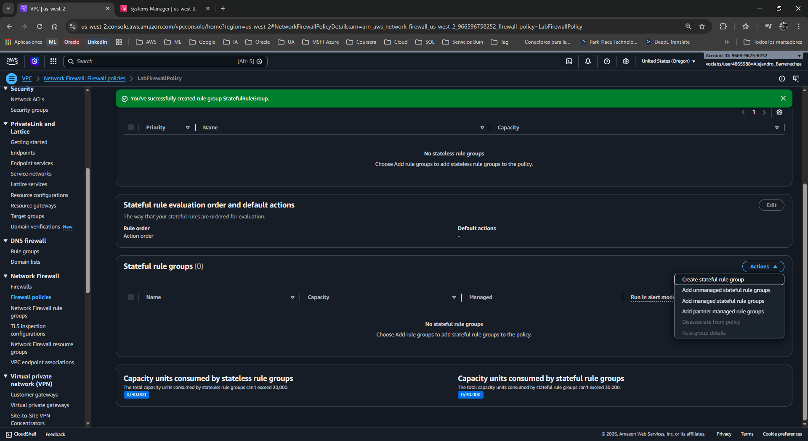
</p>

5. ☑️ Marca la casilla de **StatefulRuleGroup** que acabas de crear.
6. ➕ Haz clic en **Add stateful rule group**.
   * *Validación:* Verás un banner verde de éxito en la parte superior.

<p align="center">
  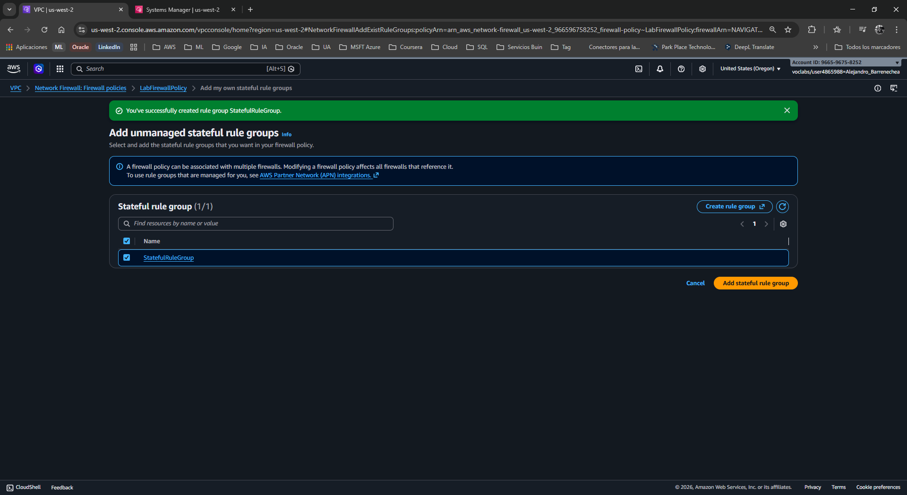
</p>
<p align="center">
  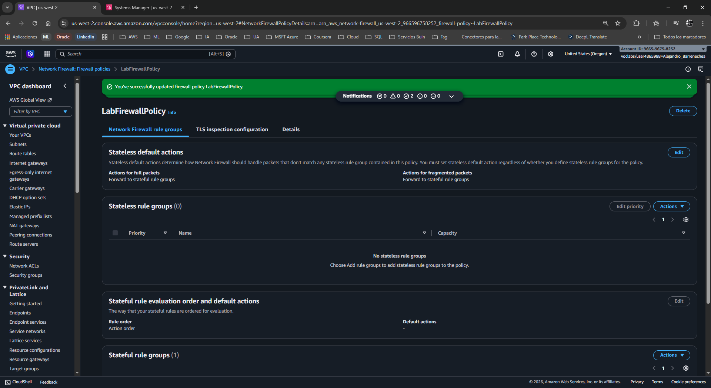
</p>

### ✅ Tarea 5: Validar la Solución (Test de Bloqueo)
Volverás al servidor para comprobar que las reglas IPS están interceptando el ataque.

1. 🔎 Regresa a la consola de **EC2** > **Instances**.
2. ☑️ Selecciona **TestInstance** > **Connect** > Pestaña **Session Manager** > **Connect**.
3. ⌨️ Intenta descargar el primer archivo malicioso nuevamente:
   ```bash
   wget http://malware.wicar.org/data/js_crypto_miner.html
   ```
4. 👁️ **Observación Crítica:** A diferencia de la Tarea 1, la terminal se quedará "colgada" mostrando el mensaje:
   `HTTP request sent, awaiting response...`
   * *Análisis:* El firewall está interceptando el paquete. Al coincidir la URI con tu regla Suricata, el firewall aplica la acción `drop` (tirar el paquete) de forma silenciosa, por lo que tu servidor se queda esperando una respuesta que nunca llegará.
5. ⌨️ Presiona `Ctrl + C` para cancelar el comando bloqueado.
6. ⌨️ Intenta descargar el segundo archivo:
   ```bash
   wget http://malware.wicar.org/data/java_jre17_exec.html
   ```
   * *Validación:* Igualmente bloqueado. Cancela con `Ctrl + C`.
7. 🧹 Limpia los archivos que descargaste en la Tarea 1 para sanitizar el servidor:
   ```bash
   rm java_jre17_exec.html js_crypto_miner.html
   ls
   ```

<p align="center">
  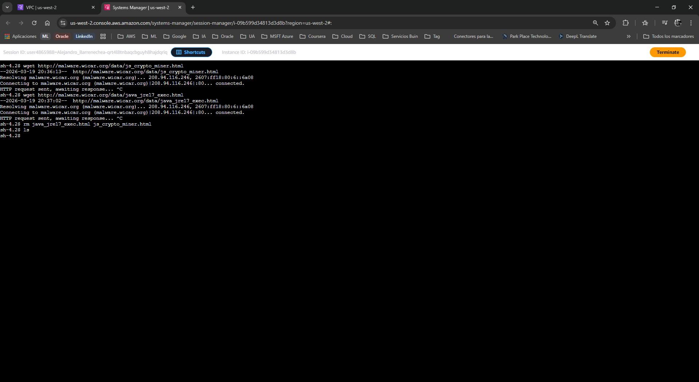
</p>

---

## 💡 Respuestas Analíticas al Caso

**¿Cuál es la diferencia técnica entre el motor Stateless y el Stateful en el Firewall?**
*   **Respuesta:** El motor **Stateless** (Sin estado) inspecciona cada paquete de forma aislada, es extremadamente rápido pero "ciego" al contexto; solo mira la IP de origen/destino y el puerto. El motor **Stateful** (Con estado) recuerda las conexiones, entiende la dirección del tráfico y, lo más importante, puede ensamblar los paquetes para inspeccionar la Capa 7 (Aplicación). Solo el motor Stateful puede "leer" una URL (`http_uri`) dentro del tráfico web. Por eso tuvimos que reenviar el tráfico al motor Stateful en la Tarea 2.

**¿Cómo funciona exactamente la regla Suricata que aplicamos?**
*   **Respuesta:** Analicemos la firma: `drop http $HOME_NET any -> $EXTERNAL_NET 80 ... content:"/data/js_crypto_miner.html";http_uri;`
    Esta regla le dice al firewall: "Tira (`drop`) cualquier conexión HTTP desde nuestra red interna (`$HOME_NET`) desde cualquier puerto (`any`) hacia internet (`$EXTERNAL_NET`) por el puerto `80`, SIEMPRE Y CUANDO el contenido exacto de la URI HTTP (`http_uri`) coincida con `/data/js_crypto_miner.html`".

---

## 📧 Correo Formal de Respuesta al Cliente

**Asunto:** Resolución de Incidente de Seguridad: Implementación de Reglas IPS y Bloqueo de Malware  
**Para:** Equipo de TI de AnyCompany  

Estimado equipo,

Me dirijo a ustedes para confirmar que hemos mitigado exitosamente la vulnerabilidad perimetral que estaba permitiendo la descarga inadvertida de archivos maliciosos por parte de los usuarios.

**Acciones correctivas implementadas en la red:**
1. **Configuración de Deep Packet Inspection (DPI):** Actualizamos la política principal de nuestro *AWS Network Firewall*. Ahora, en lugar de permitir el tráfico web ciegamente, el tráfico es reenviado a un motor de inspección con estado (*Stateful Inspection Engine*).
2. **Implementación de Reglas IPS (Suricata):** Diseñamos y desplegamos un nuevo grupo de reglas utilizando firmas del estándar de la industria (Suricata). Estas reglas buscan patrones exactos en el tráfico HTTP.
3. **Bloqueo Activo:** Hemos configurado una acción de "Drop" (Descarte silencioso). Si un usuario intenta acceder a las URLs que alojan los *scripts* de minería de criptomonedas o los troyanos de Java reportados, el firewall corta la conexión inmediatamente a nivel de red, impidiendo que el *payload* llegue al disco duro del usuario.

Las pruebas de intrusión ejecutadas en nuestro servidor aislado (`TestInstance`) validan que las descargas ahora fallan por "Timeout", confirmando que el perímetro de red está asegurado frente a estos vectores de ataque específicos.