# 📈 Supervisión y Alertas de Instancias EC2 con Amazon CloudWatch

📊 **Dificultad:** Intermedio / Operaciones y Seguridad  
⏳ **Tiempo Estimado:** 60 minutos  
🛠️ **Servicios Principales:** Amazon CloudWatch, Amazon Simple Notification Service (SNS), Amazon EC2.  

---

## 🎯 Resumen y Objetivos
En este laboratorio, implementarás una arquitectura de monitoreo reactivo para detectar comportamientos anómalos en tus servidores. Configurarás notificaciones automáticas mediante **Amazon SNS** y crearás alarmas en **Amazon CloudWatch** basadas en umbrales de uso de CPU. Finalmente, simularás un ataque de secuestro de recursos (como *cryptojacking* o *malware*) estresando la instancia al 100% para validar que el sistema de alertas funcione correctamente.

**Objetivos alcanzados al finalizar:**
* ✅ Crear un tema y una suscripción de correo electrónico en Amazon SNS.
* ✅ Configurar una alarma en CloudWatch basada en la métrica `CPUUtilization`.
* ✅ Ejecutar una prueba de estrés (*Stress Test*) en una instancia EC2 a través de una terminal segura.
* ✅ Validar la recepción de la alerta de seguridad por correo electrónico.
* ✅ Construir un Panel de Control (*Dashboard*) en CloudWatch para el monitoreo visual en tiempo real.

---

## 🕵️‍♂️ Análisis del Escenario (Diagnóstico Inicial)
El registro (Logging) y el monitoreo (Monitoring) son vitales para identificar "banderas rojas" de seguridad que a menudo pasan desapercibidas. 

**Diagnóstico y Estrategia:** Un pico repentino y sostenido de CPU en un servidor web que normalmente tiene baja carga no solo es un problema de rendimiento, a menudo es un indicador de compromiso (IoC). Un actor malintencionado podría haber inyectado *malware* para minar criptomonedas o ejecutar ataques de denegación de servicio (DDoS) desde tu infraestructura. Como Ingeniero Cloud, tu tarea es automatizar la visibilidad de este servidor. Crearás una alarma que, al superar el 60% de uso de CPU de forma anómala, dispare una alerta inmediata a los administradores.

---

## 🏗️ Arquitectura del Laboratorio
1. 💻 **Amazon EC2 ("Stress Test"):** Servidor Linux objetivo que emitirá telemetría constante (métricas).
2. 👁️ **Amazon CloudWatch:** El "cerebro" del monitoreo que recopila la métrica `CPUUtilization`. Contiene la Alarma que evalúa el umbral y el *Dashboard* visual.
3. 📨 **Amazon SNS:** Servicio de mensajería (Pub/Sub) que recibe el cambio de estado de la alarma de CloudWatch y "empuja" (Push) la notificación al correo del administrador.

---

## ⚙️ Desarrollo de las Tareas (Paso a Paso)

### 📨 Tarea 1: Configurar Amazon SNS (Notificaciones)
Primero, crearás el canal de comunicación que entregará las alertas.

1. 🔎 En la barra de búsqueda de la consola, escribe `SNS` y selecciona **Simple Notification Service**.
2. 📂 En el panel izquierdo, haz clic en el ícono de las tres líneas (menú), selecciona **Topics** (Temas) y haz clic en **Create topic** (Crear tema).
3. ⚙️ En la sección *Details*, configura lo siguiente:
   * **Type:** Selecciona **Standard** (Estándar).
   * **Name:** Escribe `MyCwAlarm`
4. 💾 Desplázate hacia abajo y haz clic en **Create topic**.

<p align="center">
  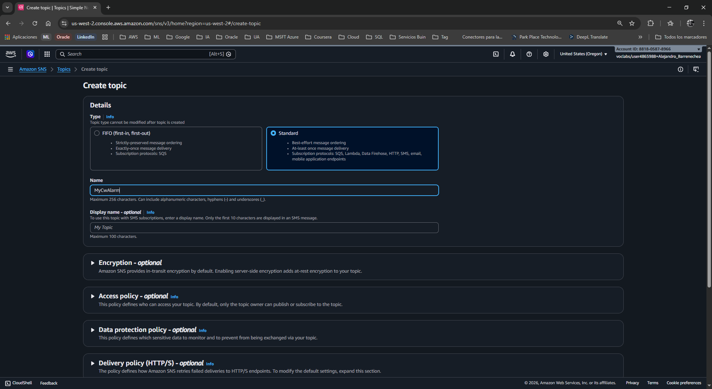
</p>
<p align="center">
  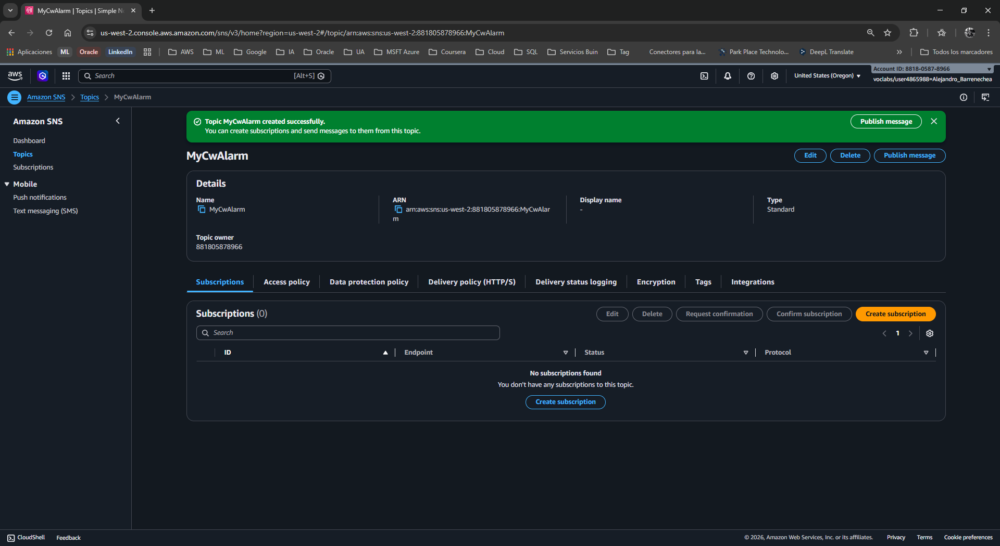
</p>

5. 탭 En la página de detalles de tu nuevo tema `MyCwAlarm`, selecciona la pestaña **Subscriptions** (Suscripciones) y haz clic en **Create subscription**.
6. ⚙️ En la nueva pantalla, configura la suscripción:
   * **Topic ARN:** Déjalo por defecto (ya está seleccionado tu tema).
   * **Protocol:** En el menú desplegable, selecciona **Email** (Correo electrónico).
   * **Endpoint:** Escribe una dirección de correo electrónico real a la que tengas acceso en este momento.
7. ➕ Haz clic en **Create subscription**.

<p align="center">
  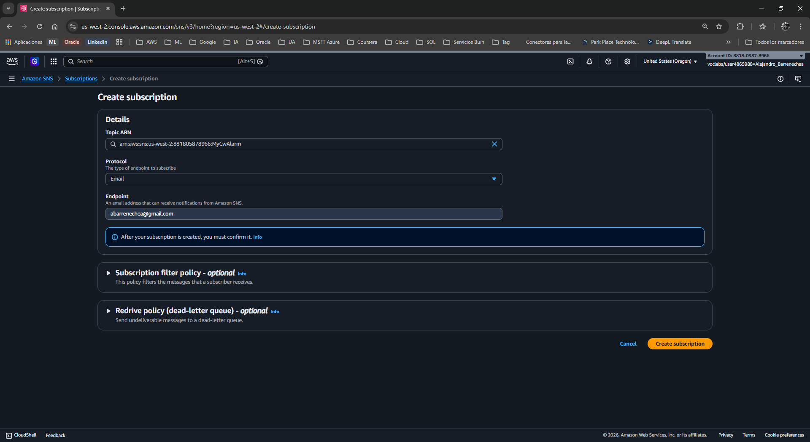
</p>

8. 👁️ Notarás que el estado (*Status*) dice *Pending confirmation* (Pendiente de confirmación).

<p align="center">
  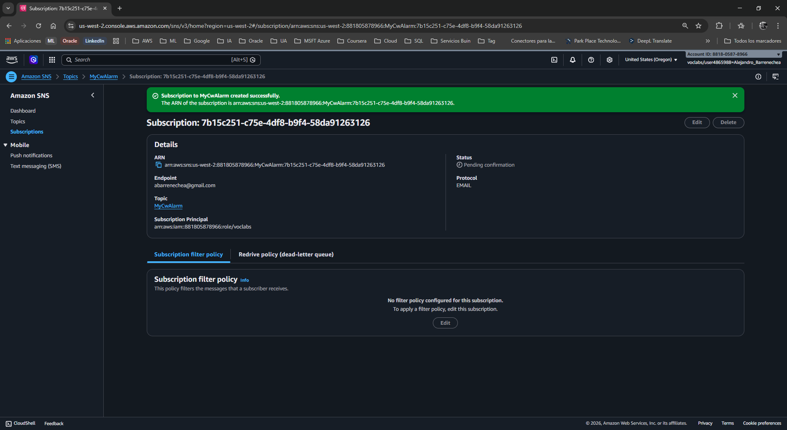
</p>

9.  📧 Abre tu correo electrónico en otra pestaña, busca el mensaje titulado **AWS Notification - Subscription Confirmation** y haz clic en el enlace **Confirm subscription**.

<p align="center">
  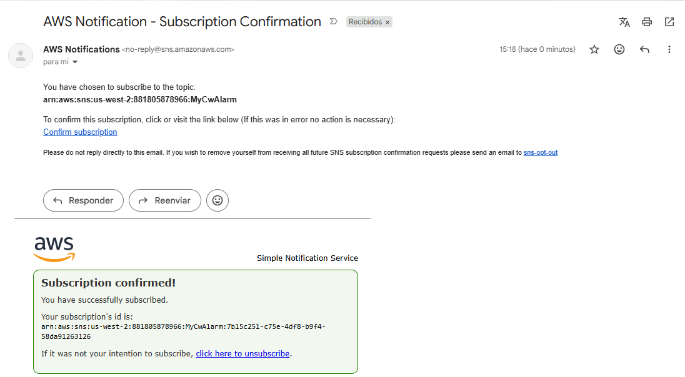
</p>

10. 🔙 Vuelve a la consola de AWS, ve al panel izquierdo, selecciona **Subscriptions** y verifica que el estado ahora sea verde y diga **Confirmed**.

<p align="center">
  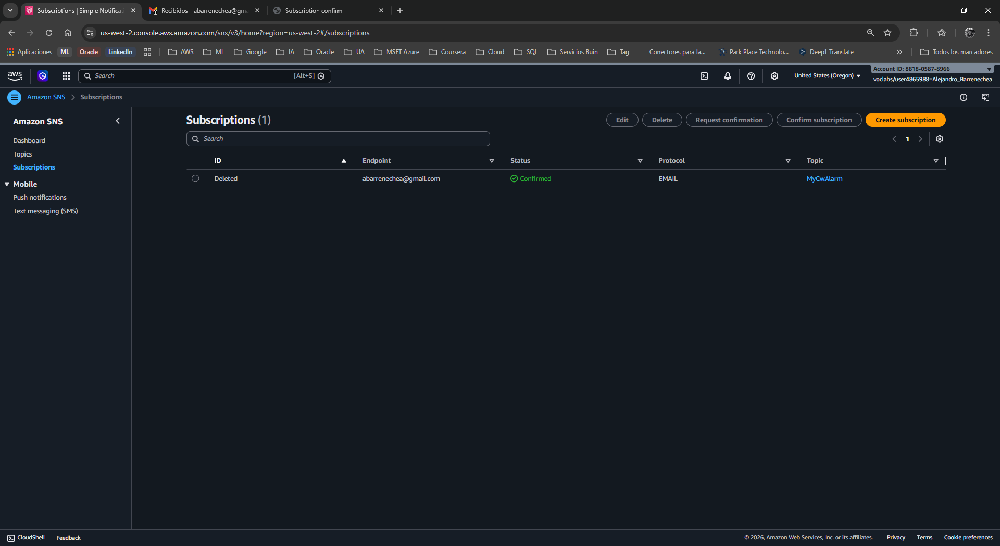
</p>

### 🚨 Tarea 2: Crear una alarma de CloudWatch
Ahora le dirás a AWS qué métrica observar y cuándo disparar la notificación.

1. 🔎 En la barra de búsqueda superior, escribe `CloudWatch` y abre el servicio.
2. 📂 En el panel izquierdo, despliega la sección **Metrics** (Métricas) y selecciona **All metrics** (Todas las métricas).
   * *Nota:* CloudWatch puede tardar unos 5 minutos en empezar a mostrar las métricas de una instancia recién creada.

<p align="center">
  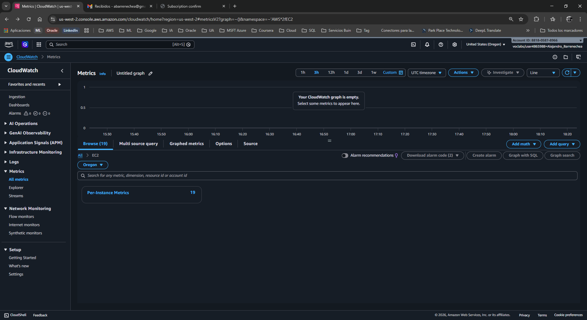
</p>

3. 🖱️ En la tarjeta de exploración, haz clic en **EC2** y luego en **Per-Instance Metrics** (Métricas por instancia).
4. ☑️ Utiliza el cuadro de búsqueda para encontrar la instancia llamada **Stress Test** y marca la casilla correspondiente a la métrica **CPUUtilization** (Uso de CPU). Verás un gráfico plano cerca del 0%.

<p align="center">
  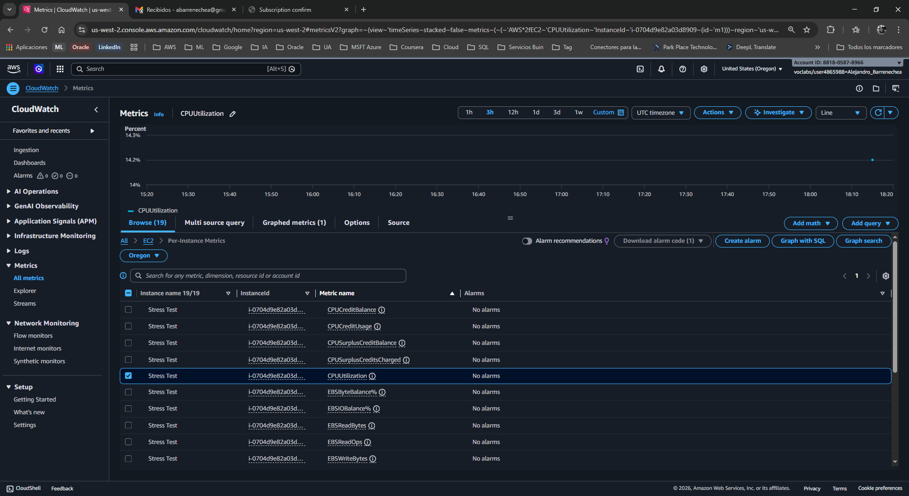
</p>

5. 📂 En el panel izquierdo, despliega la sección **Alarms** (Alarmas) y selecciona **All alarms**.

<p align="center">
  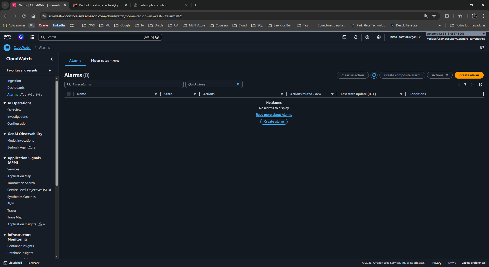
</p>

6. 🖱️ Haz clic en **Create alarm** (Crear alarma).
7. 🖱️ Haz clic en **Select metric** > **EC2** > **Per-Instance Metrics**, marca la casilla de **CPUUtilization** para la instancia "Stress Test" y haz clic nuevamente en **Select metric**.

<p align="center">
  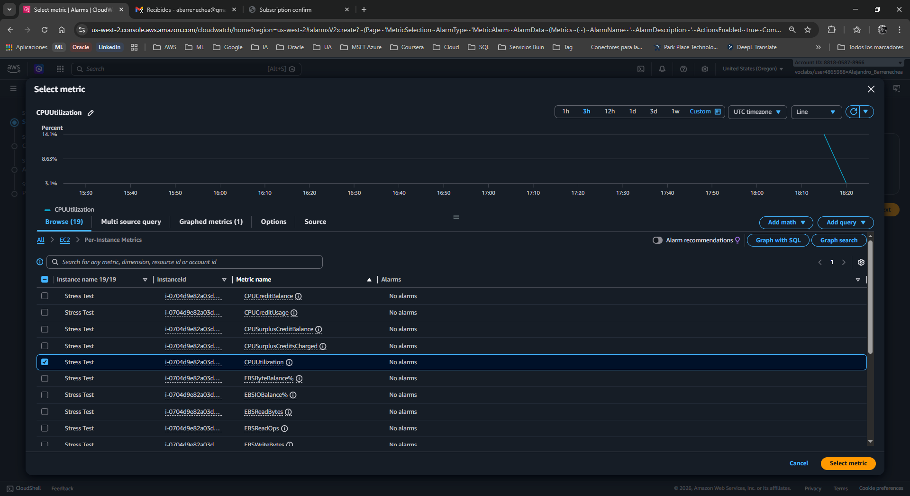
</p>

8. ⚙️ En la pantalla *Specify metric and conditions*, baja a la sección **Conditions** y configura el gatillo:
   * **Threshold type:** `Static`
   * **Whenever CPUUtilization is...:** Selecciona `Greater > threshold` (Mayor que).
   * **than...:** Escribe `60` (representa el 60%).
9.  ➡️ Haz clic en **Next**.

<p align="center">
  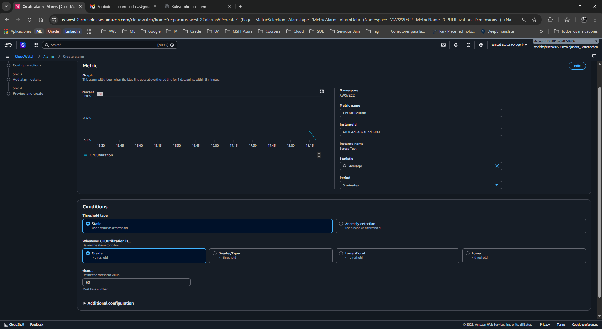
</p>

10. ⚙️ En la pantalla *Configure actions*, configura la notificación:
    * **Alarm state trigger:** `In alarm` (En alarma).
    * **Select an SNS topic:** Selecciona `Select an existing SNS topic`.
    * **Send a notification to...:** Haz clic en el cuadro y elige tu tema `MyCwAlarm`.
11. ➡️ Haz clic en **Next**.

<p align="center">
  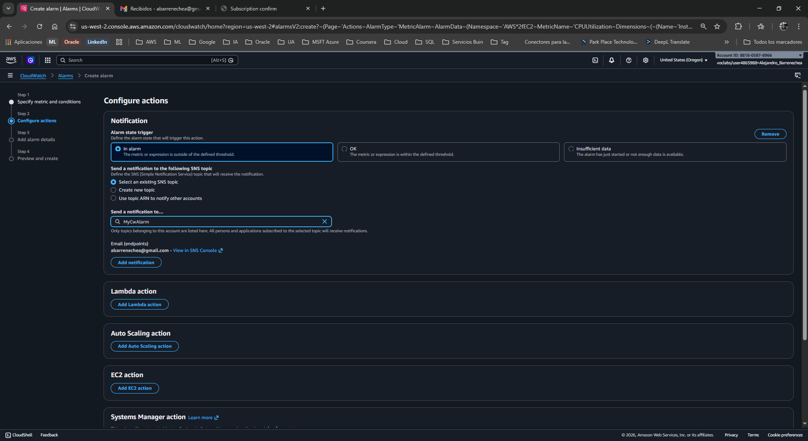
</p>

12. 📝 Asigna el nombre y descripción:
    * **Alarm name:** `LabCPUUtilizationAlarm`
    * **Alarm description:** `CloudWatch alarm for Stress Test EC2 instance CPUUtilization`
13. ➡️ Haz clic en **Next**, revisa la configuración y haz clic en **Create alarm**.

<p align="center">
  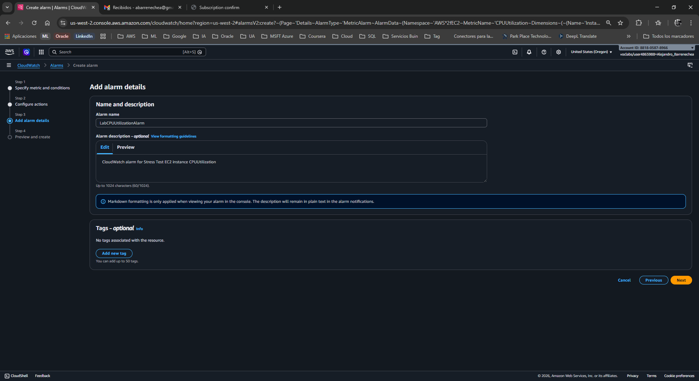
</p>
<p align="center">
  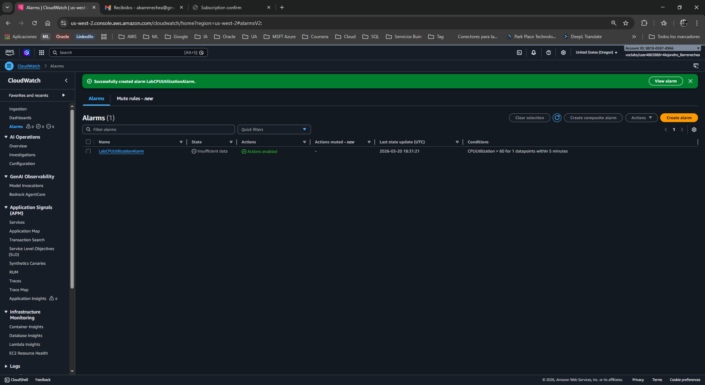
</p>

### 🧪 Tarea 3: Probar la Alarma (Simulación de Malware)
Simularás un ataque inyectando un comando que sature el procesador para validar que tu defensa reaccione.

1. 📋 Vuelve a la pestaña de tu plataforma (Vocareum) y haz clic en el botón **AWS Details**.
2. 🔗 Junto a **EC2InstanceURL**, copia el enlace provisto y pégalo en una nueva pestaña del navegador. Esto te conectará directamente a la terminal del servidor por *Session Manager*.

<p align="center">
  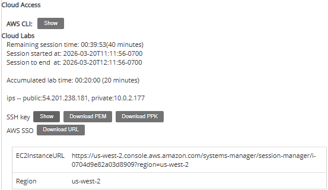
</p>

3. ⌨️ Para aumentar artificialmente la carga de la CPU, ejecuta el siguiente comando de prueba de estrés:
   ```bash
   sudo stress --cpu 10 -v --timeout 400s
   ```
   * *Diagnóstico:* Este comando generará 10 subprocesos (workers) saturando la CPU al 100% durante 400 segundos (casi 7 minutos).

<p align="center">
  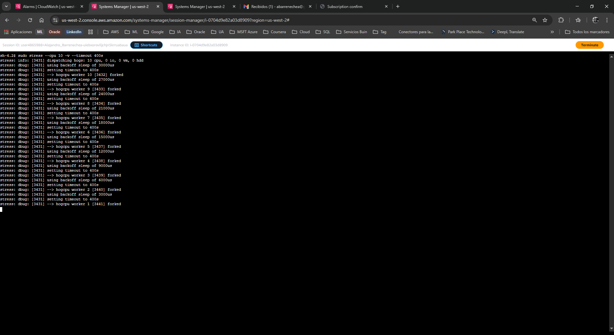
</p>

4. 🖥️ Abre una **segunda pestaña** en tu navegador pegando de nuevo el enlace de **EC2InstanceURL**.
5. ⌨️ En esta segunda terminal, monitorea el procesador en vivo ejecutando:
   ```bash
   top
   ```
   * *Verás los procesos "stress" consumiendo cerca del 100% del %CPU.*

<p align="center">
  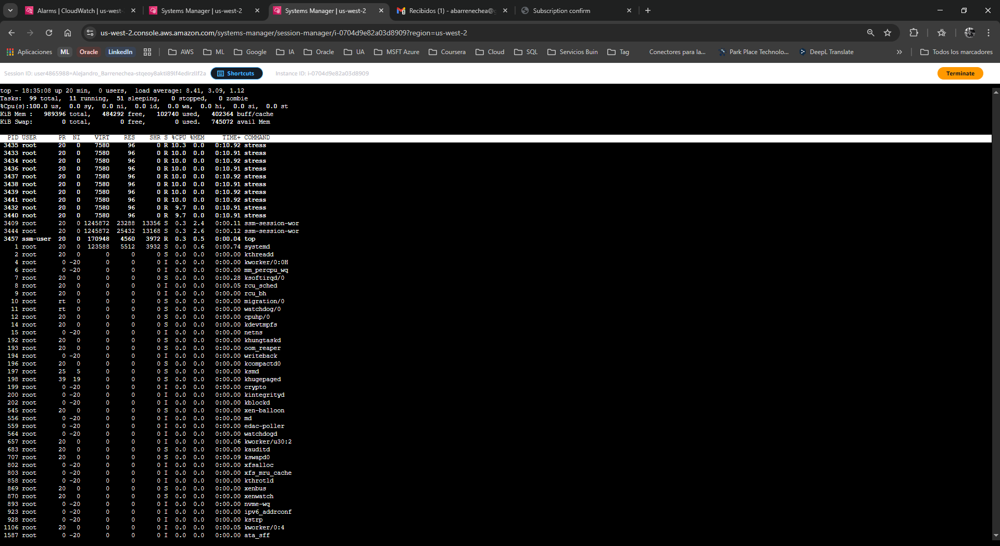
</p>

6. 🔙 Regresa a la consola de **CloudWatch** donde dejaste tu lista de alarmas.
7. 🖱️ Haz clic en el nombre de tu alarma **LabCPUUtilizationAlarm**.
8. 🔄 Monitoriza el gráfico haciendo clic en el botón de actualizar (Refresh) cada 1 minuto. Observarás cómo la línea azul de uso cruza violentamente la línea roja del umbral.
9.  🚨 El estado de la alarma cambiará de *OK* a **In alarm** (En alarma).

<p align="center">
  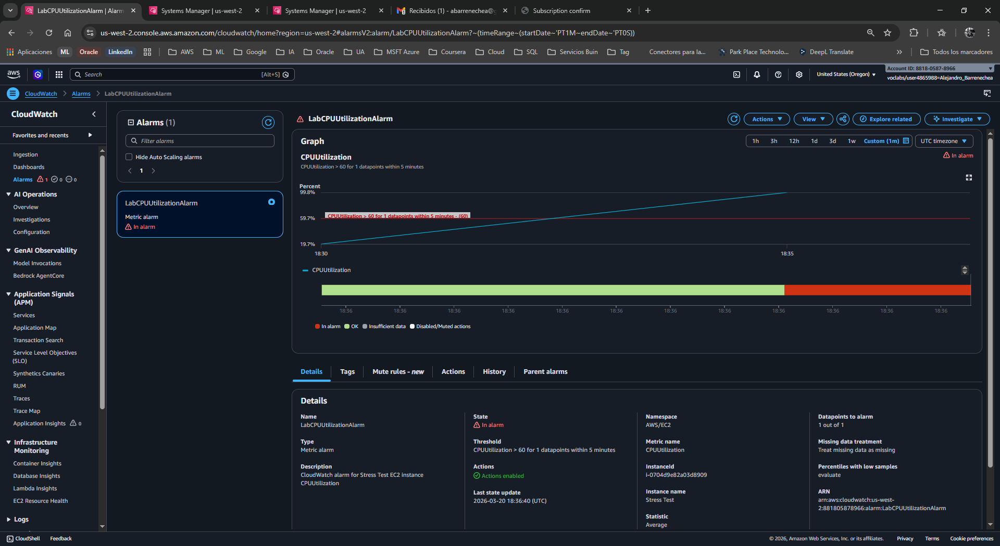
</p>

10. 📧 Revisa tu bandeja de entrada del correo electrónico. Deberías tener un mensaje de "ALARM: LabCPUUtilizationAlarm in [Región]" detallando el evento de seguridad.[📸 Inserta tu captura aquí: (Captura de pantalla de la consola de CloudWatch mostrando el estado de la alarma en rojo "In alarm" y el gráfico con el pico de CPU superando el 60%)]

<p align="center">
  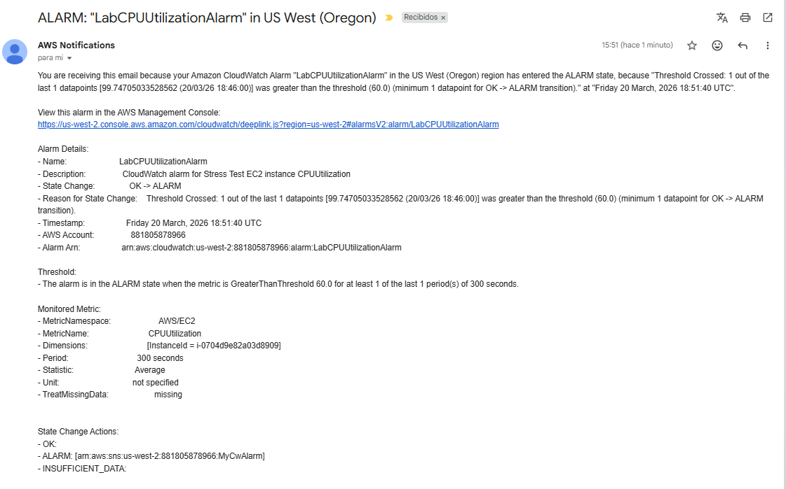
</p>

### 📊 Tarea 4: Crear un Panel de Control (Dashboard)
Centralizarás esta visualización para tu centro de operaciones (NOC/SOC).

1. 📂 En el panel izquierdo de **CloudWatch**, selecciona **Dashboards**.
2. 🖱️ Haz clic en **Create dashboard**.
3. 📝 En **Dashboard name**, escribe `LabEC2Dashboard` y haz clic en **Create dashboard**.
4. 📈 En la selección de *Widgets*, elige **Line** (Gráfico de líneas).
5. 🖱️ Selecciona **Metrics**.

<p align="center">
  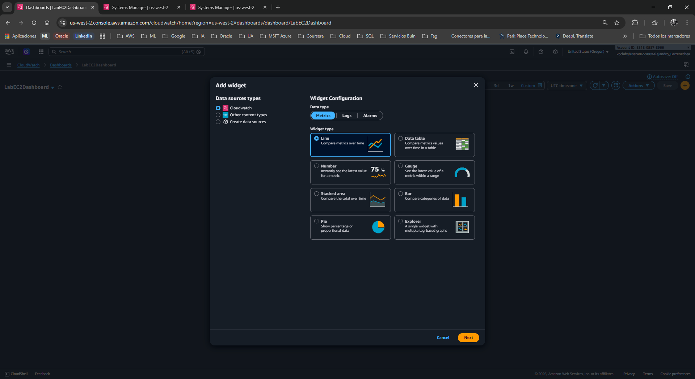
</p>

6. 🖱️ Navega a **EC2** > **Per-Instance Metrics**.
7. ☑️ Marca la casilla de la métrica **CPUUtilization** para la instancia **Stress Test**.
8. 💾 Haz clic en el botón naranja **Create widget** (Crear widget).

<p align="center">
  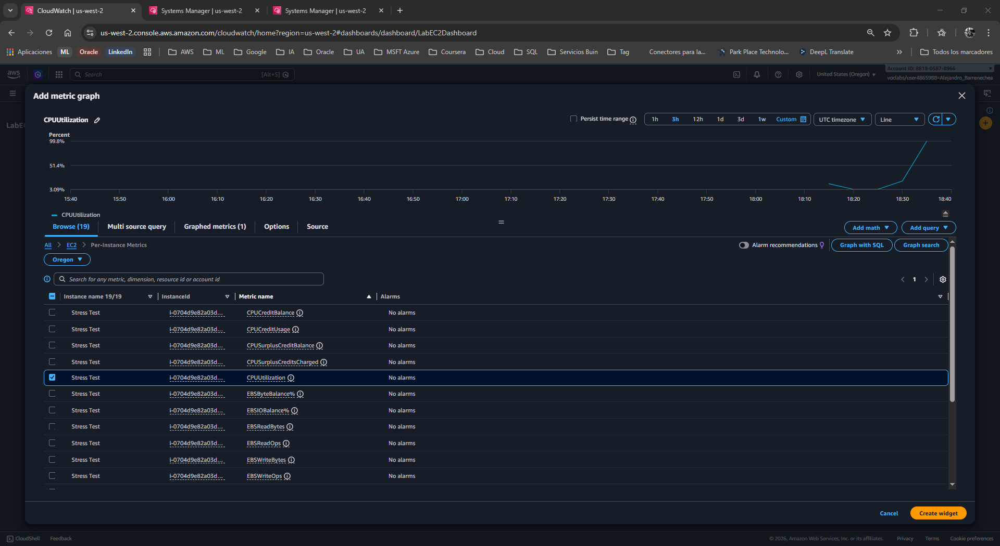
</p>

9.  💾 En la parte superior del Dashboard, asegúrate de hacer clic en **Save dashboard** (Guardar panel). Ahora tienes un centro de monitoreo visual en tiempo real.

<p align="center">
  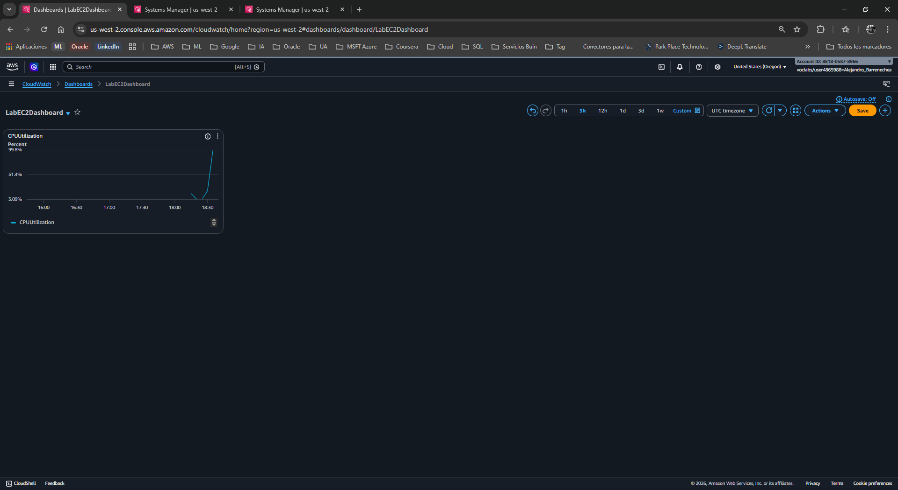
</p>

---

## 💡 Respuestas Analíticas al Caso

**¿Por qué es fundamental configurar alarmas sobre el pico de CPU y qué amenaza real simula el comando `stress`?**
*   **Respuesta:** En ciberseguridad, la disponibilidad es uno de los tres pilares fundamentales (Tríada CIA). Un pico de CPU del 100% sostenido causará Denegación de Servicio (DoS), haciendo que las aplicaciones legítimas de la instancia dejen de responder. El comando `stress` simula un ataque de *Cryptojacking* (donde un atacante inyecta *malware* para minar criptomonedas a costa de tu hardware) o un proceso de un troyano ejecutándose en segundo plano.

**¿Qué rol arquitectónico juega Amazon SNS en esta solución y cómo se podría mejorar?**
*   **Respuesta:** Amazon SNS actúa como el sistema nervioso del monitoreo. Desacopla la detección (CloudWatch) de la acción. En este laboratorio lo usamos para una comunicación de Aplicación a Persona (A2P) enviando un email. Sin embargo, en un entorno de producción avanzado, SNS podría activar una comunicación de Aplicación a Aplicación (A2A), disparando una función de **AWS Lambda** que aísle automáticamente la instancia infectada cambiándole el Security Group, logrando una remediación 100% automatizada.

---