# Laboratorio 160: Aprovisionamiento de Amazon RDS e Integración con Aplicación Web

| Atributo | Detalle |
| :--- | :--- |
| **Dificultad** | Intermedio |
| **Tiempo Estimado** | 45 minutos |
| **Servicios Principales** | Amazon RDS (MySQL), Amazon EC2, Amazon VPC |

---

## Resumen y Objetivos
Este laboratorio práctico tiene como objetivo desplegar un motor de base de datos relacional administrado mediante **Amazon RDS**, garantizando alta disponibilidad y seguridad perimetral. Configurarás una arquitectura de dos capas donde una aplicación web consume datos de una instancia de base de datos protegida en subredes privadas.

Al finalizar este laboratorio, serás capaz de:
1. Crear un **Security Group** con reglas de tráfico lateral para bases de datos.
2. Definir un **DB Subnet Group** para despliegues Multi-AZ.
3. Lanzar una instancia de **Amazon RDS MySQL** con replicación síncrona.
4. Conectar una aplicación externa mediante un **Endpoint** de base de datos.

---

## Análisis del Escenario
El equipo de desarrollo requiere una base de datos persistente que no requiera administración de parches de sistema operativo ni gestión de hardware. Para entornos productivos, es imperativo que la base de datos sea resiliente a fallos de infraestructura. Utilizaremos el modelo de **Responsabilidad Compartida**, donde AWS gestiona la alta disponibilidad (Multi-AZ) y nosotros configuramos el control de acceso (Security Groups) y el esquema lógico.

---

## Arquitectura de Referencia
La solución implementa una topología de red segmentada:
*   **Capa Web:** Instancia EC2 en subred pública con `Web Security Group`.
*   **Capa de Datos:** Instancia RDS primaria y secundaria (standby) en subredes privadas dentro de la **Lab VPC**.
*   **Conectividad:** Tráfico entrante permitido únicamente a través del puerto TCP 3306 desde el origen del grupo de seguridad web.

  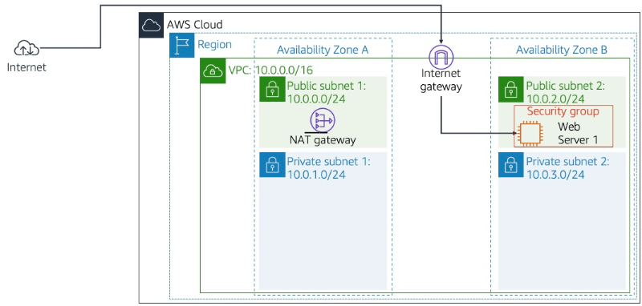

  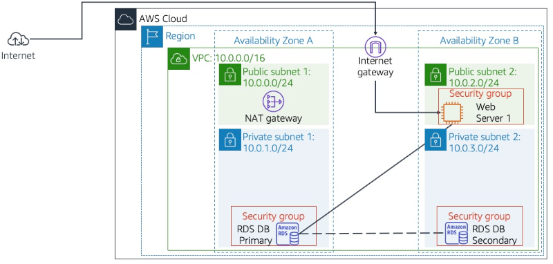

---

## Desarrollo de las Tareas (Interfaz Moderna de AWS)

### Tarea 1: Configuración del Grupo de Seguridad (VPC)
Define el firewall lógico que protegerá la instancia de base de datos.

1.  Navega a la consola de **VPC**.
2.  En el menú lateral izquierdo, bajo la sección **Security**, haz clic en **Security Groups**.
3.  Haz clic en el botón naranja **Create security group**.

  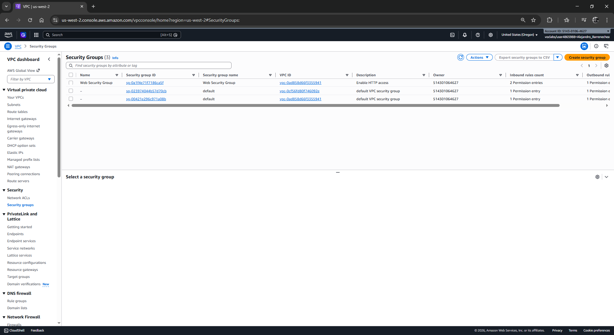

4.  En **Basic details**, escribe:
    *   **Security group name:** `DB Security Group`
    *   **Description:** `Permit access from Web Security Group`
    *   **VPC:** Asegúrate de seleccionar **Lab VPC**.
5.  En la sección **Inbound rules** (Reglas de entrada), haz clic en **Add rule**:
    *   **Type:** Selecciona `MySQL/Aurora (3306)`.
    *   **Source:** Haz clic en la barra de búsqueda y selecciona el ID del **Web Security Group** (puedes escribir `sg` para filtrar los grupos existentes).
6.  Desliza hasta el final y haz clic en **Create security group**.

  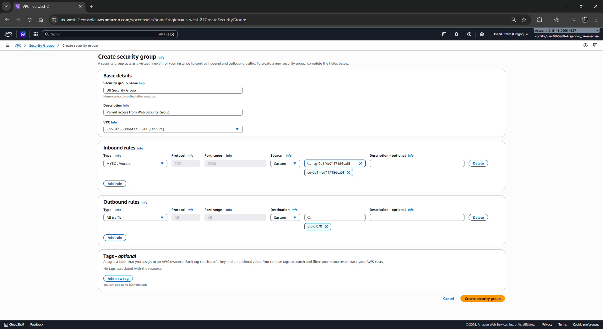

  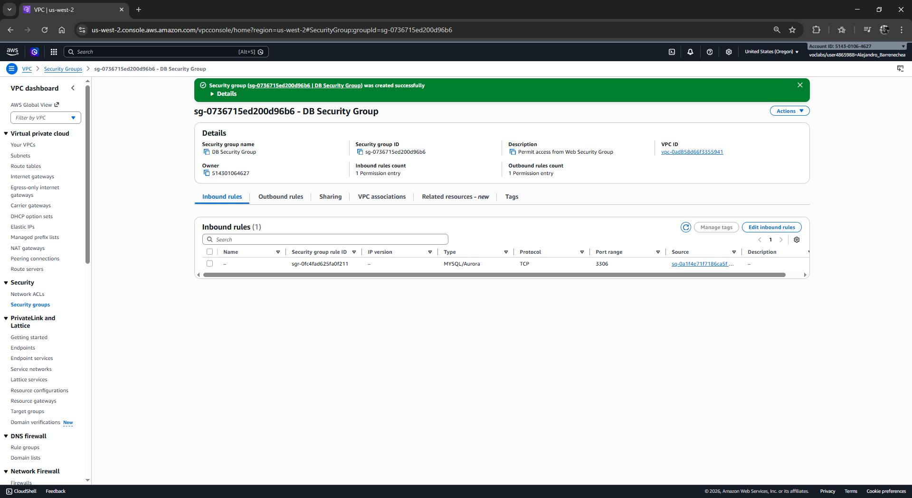

---

### Tarea 2: Creación del Grupo de Subredes de Base de Datos (RDS)
Este paso es crucial para indicar a RDS en qué zonas de disponibilidad (AZ) puede operar.

1.  Navega al servicio de **RDS**.
2.  En el panel de navegación izquierdo (usa el icono de tres líneas si está oculto), haz clic en **Subnet groups**.
3.  Haz clic en **Create DB subnet group**.
4.  Configura los detalles:
    *   **Name:** `DB Subnet Group`
    *   **Description:** `DB Subnet Group`
    *   **VPC:** Selecciona **Lab VPC**.
5.  En la sección **Add subnets**:
    *   **Availability Zones:** Selecciona las dos primeras zonas de la lista (ej. `us-east-1a` y `us-east-1b`).
    *   **Subnets:** Selecciona los IDs de subred que corresponden a los rangos `10.0.1.0/24` y `10.0.3.0/24`.
6.  Haz clic en **Create**.

  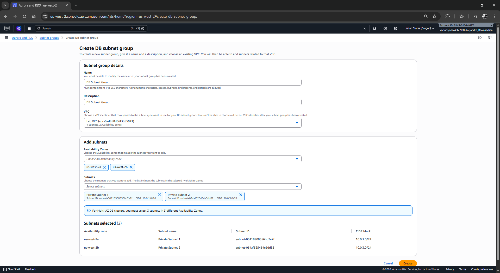

  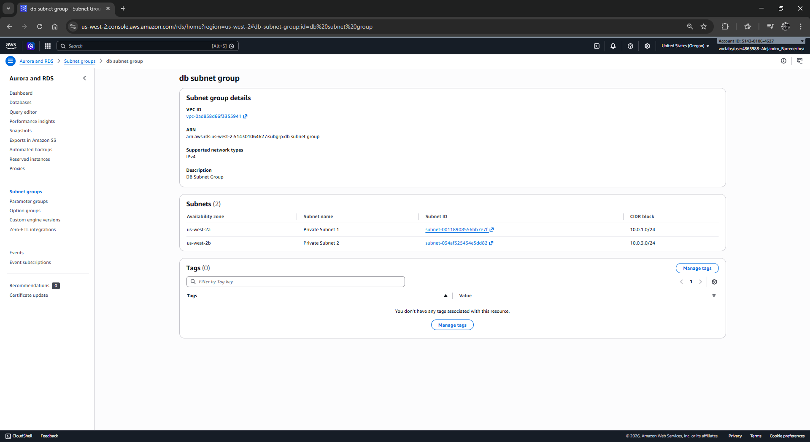

---

### Tarea 3: Lanzamiento de la Instancia de Base de Datos RDS
Aprovisiona el servidor administrado con redundancia Multi-AZ.

1.  En el panel izquierdo de RDS, haz clic en **Databases** y luego en **Create database**.
2.  Selecciona el método **Standard create**.
3.  **Engine options:** Selecciona **MySQL**.
4.  **Templates:** Elige **Dev/Test** (esto desbloquea las opciones de Alta Disponibilidad).
5.  **Availability and durability:** Selecciona **Multi-AZ DB Instance**.

  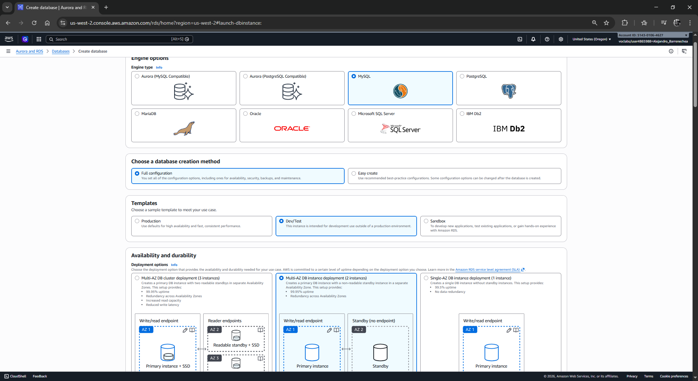

6.  **Settings:**
    *   **DB instance identifier:** `lab-db`
    *   **Master username:** `main`
    *   **Master password:** `lab-password`
    *   **Confirm password:** `lab-password`

  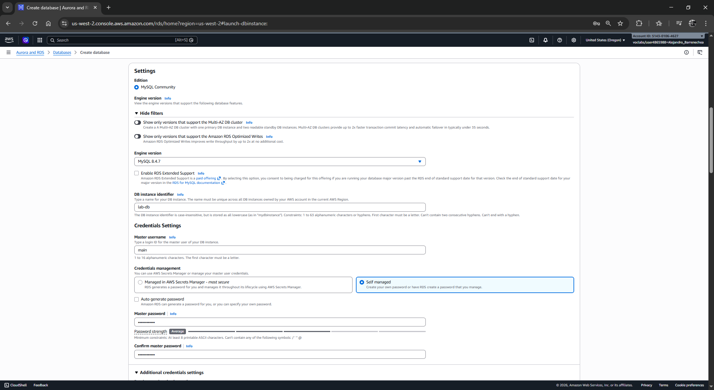

7.  **Instance configuration:** Selecciona **Burstable classes** y elige la opción `db.t3.medium`.

  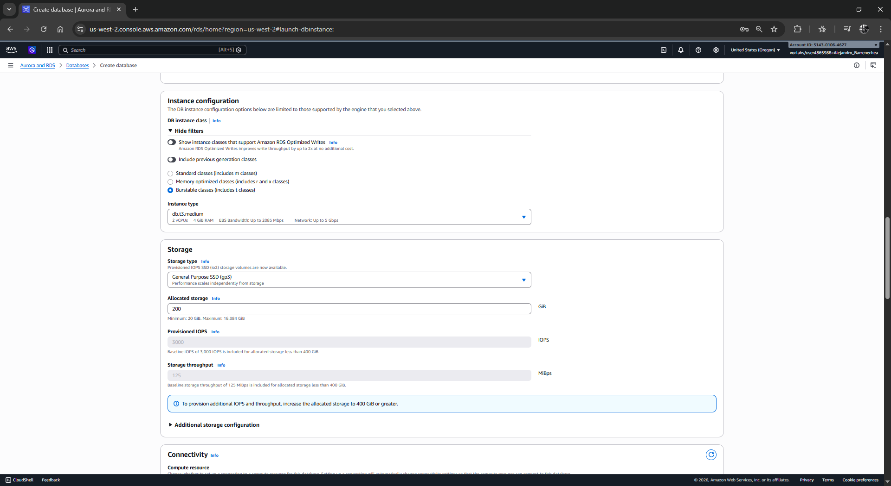

8.  **Connectivity:**
    *   **Virtual Private Cloud (VPC):** Selecciona **Lab VPC**.
    *   **VPC security group:** Selecciona **Choose existing**. **Importante:** Elimina el grupo `default` (clic en la X) y agrega el **DB Security Group**.

  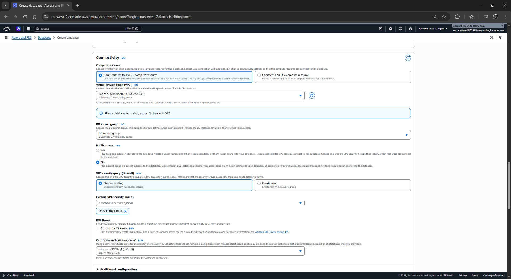

9.  **Additional configuration** (al final del formulario):
    *   **Initial database name:** `lab`
    *   **Backup:** Desmarca **Enable automated backups**.
    *   **Monitoring:** Desmarca **Enable Enhanced monitoring**.

  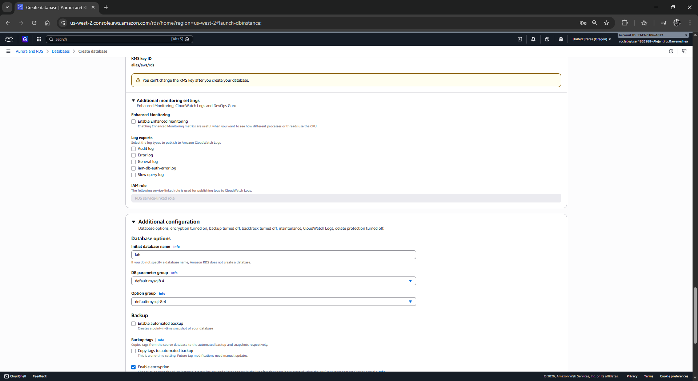

10. Haz clic en **Create database**.

  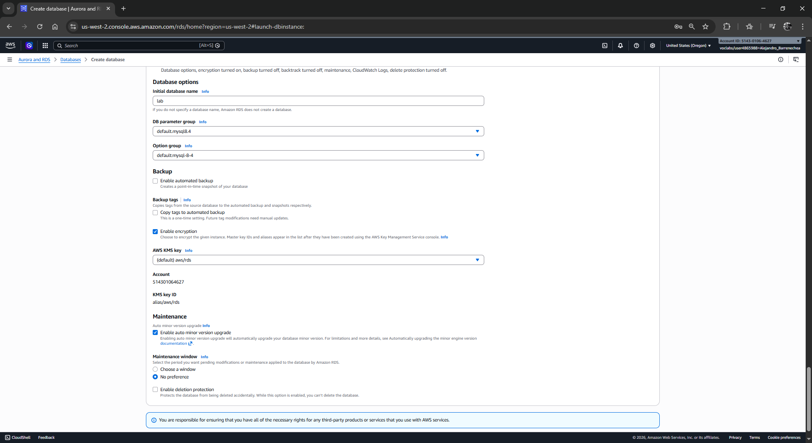

**Nota Técnica:** El proceso de creación tarda entre 4 y 7 minutos. Una vez que el estado sea **Available**, haz clic en el nombre `lab-db` y en la pestaña **Connectivity & security**, copia el **Endpoint**.

  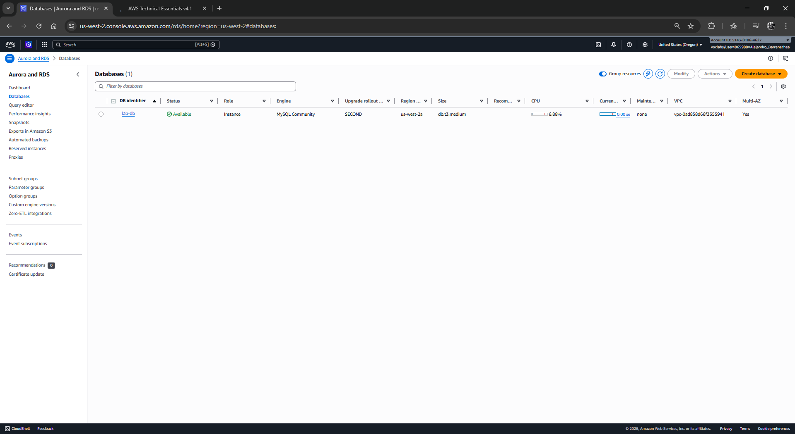

---

### Tarea 4: Integración con la Aplicación Web
Conecta la interfaz de usuario con tu nueva base de datos en la nube.

1.  Obtén la **IP Pública** de tu servidor web (disponible en la sección de detalles del laboratorio).
2.  En una nueva pestaña de tu navegador, ingresa la IP para cargar la aplicación.

  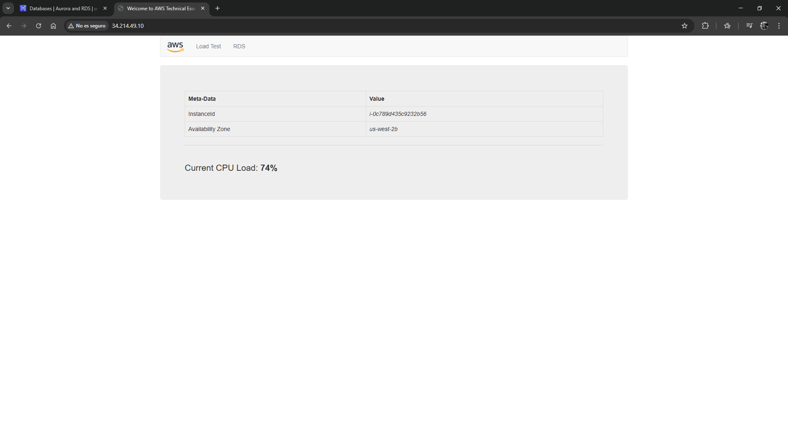

3.  Haz clic en el enlace **RDS** en la parte superior de la página.
4.  Ingresa los parámetros de conexión:
    *   **Endpoint:** Pega el valor copiado de la consola de RDS.
    Para localizar el **Endpoint**, sigue estos pasos técnicos dentro de la Consola de AWS:
        *   **Dirígete** al servicio de **RDS** desde el menú de servicios o la barra de búsqueda superior.
        *   En el panel de navegación izquierdo, **haz clic** en la opción **Databases** (Bases de datos).
        *   **Localiza** la tabla de instancias y **haz clic** directamente sobre el nombre (DB identifier) de tu base de datos, que en este laboratorio es `lab-db`.
        *   **Asegúrate** de estar posicionado en la pestaña inferior llamada * **Connectivity & security** (Conectividad y seguridad).
        *   **Ubica** la sección denominada **Endpoint & port**.
        *   **Copia** la cadena de texto que aparece bajo la columna **Endpoint**.
        *   **Pega** este valor en el campo "Endpoint" de tu aplicación web para establecer la comunicación.

  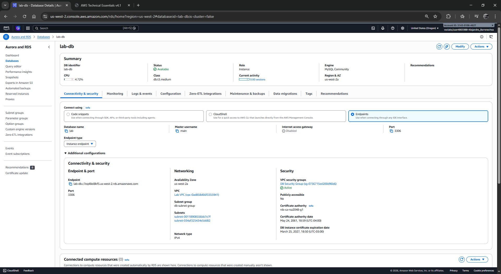

    *   **Database:** `lab`
    * **Username:** `main`
    * **Password:** `lab-password`
5.  Haz clic en **Submit**.

  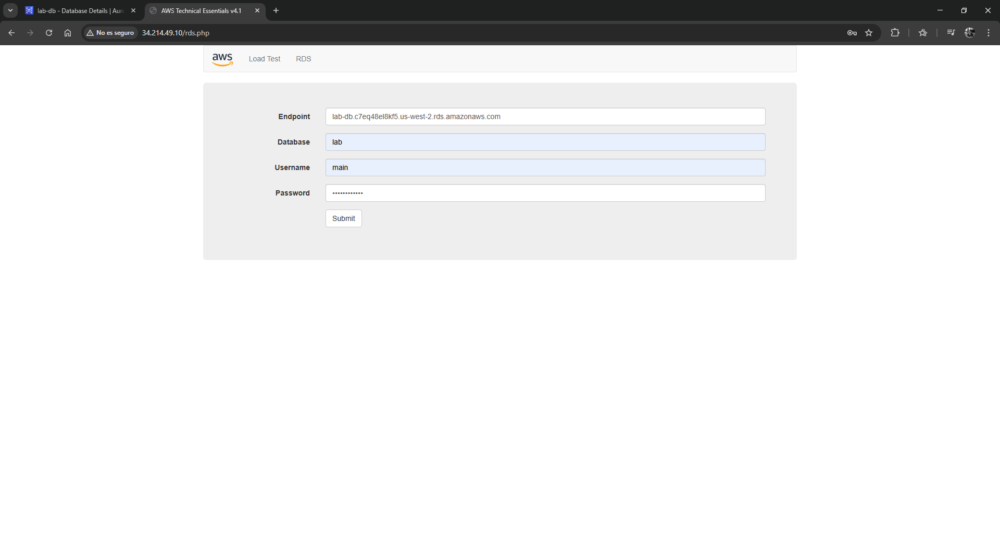

6.  Verifica que aparezca el **Address Book** y realiza pruebas agregando o editando contactos.
---

## Respuestas Analíticas y Conclusiones

*   **¿Cuál es la función del Endpoint en Amazon RDS?**
    A diferencia de un servidor EC2 donde se usa la IP, RDS utiliza un registro DNS (Endpoint). Esto permite que, en caso de un fallo en la zona primaria, AWS pueda redirigir el tráfico a la instancia standby actualizando el DNS sin que tú tengas que cambiar la configuración de tu aplicación.

*   **¿Por qué se segmentan las subredes para la base de datos?**
    Por seguridad (Seguridad en Capas). Las bases de datos nunca deben estar en subredes públicas. Al usar un `DB Subnet Group` con subredes privadas, garantizas que los datos solo sean accesibles desde dentro de la VPC por recursos autorizados (como tu servidor web).

*   **¿Qué garantiza la configuración Multi-AZ?**
    Garantiza la **Continuidad del Negocio**. RDS replica los datos de forma síncrona. Si ocurre un desastre en el centro de datos de la zona A, la instancia de la zona B toma el control automáticamente con un RPO (Objetivo de Punto de Recuperación) de cero.

**¡Felicidades!** Has desplegado una infraestructura de base de datos administrada bajo estándares de arquitectura AWS.