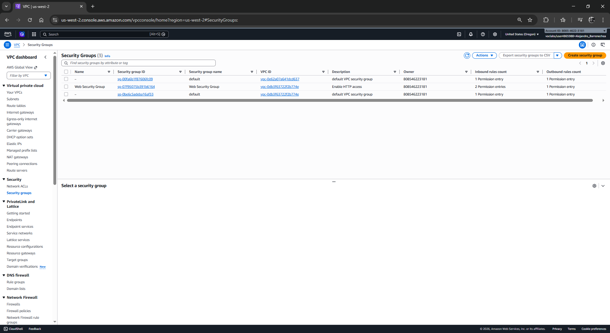
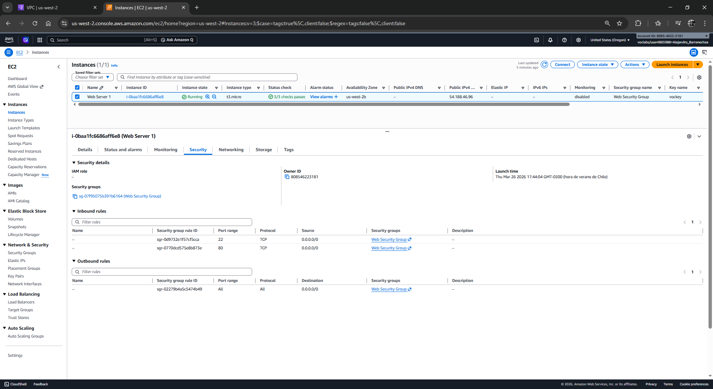
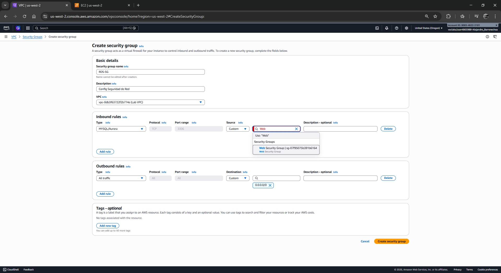
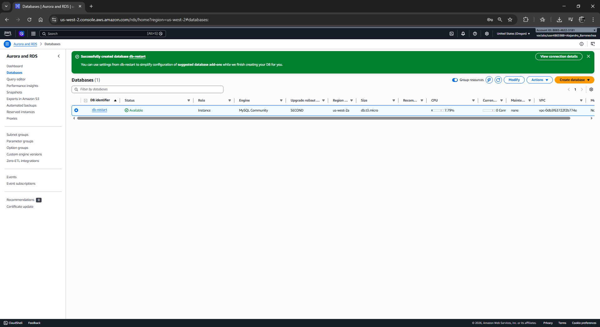
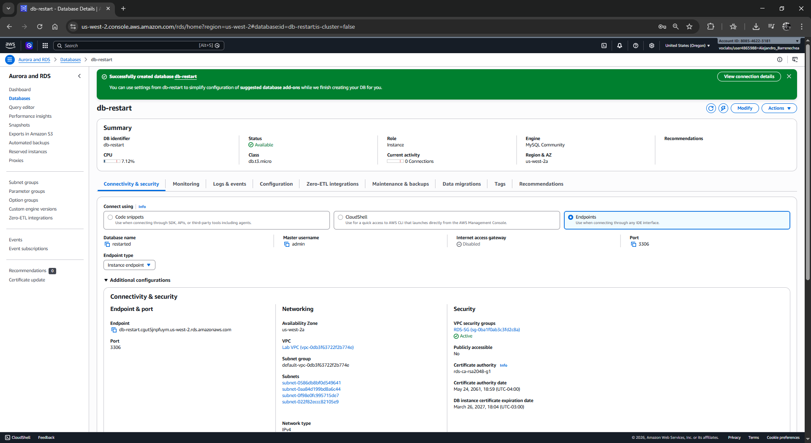
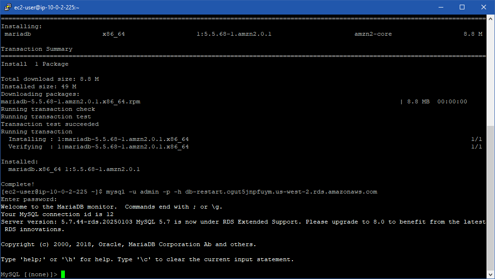
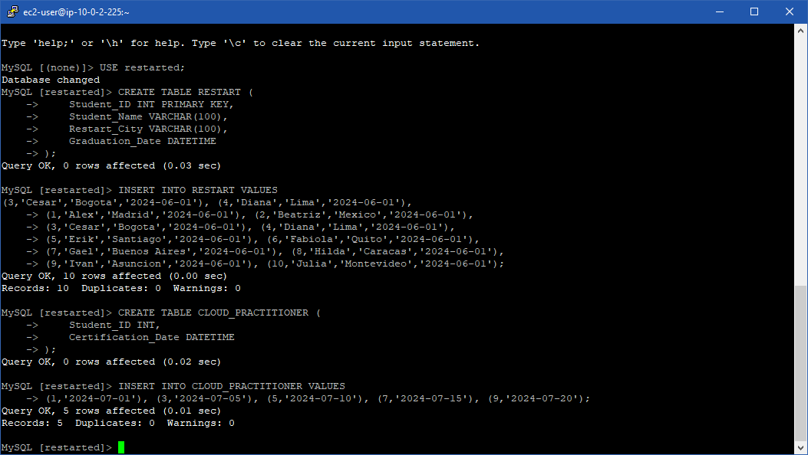
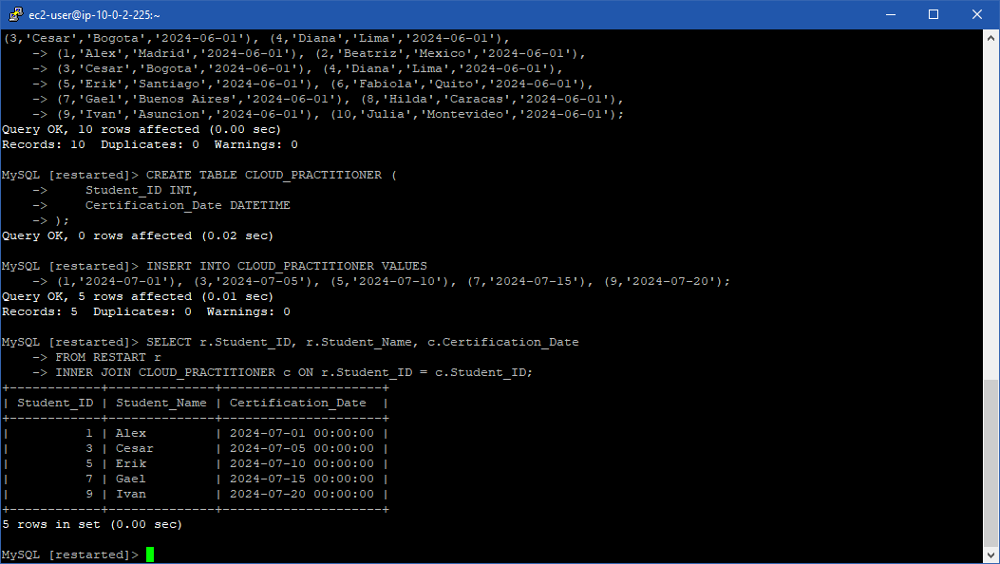

# 🏆 Laboratorio: Construcción e Interacción con RDS

| Atributo | Detalle |
| :--- | :--- |
| **Dificultad** | Intermedio (Reto) |
| **Tiempo Estimado** | 45 minutos |
| **Servicios Principales** | Amazon RDS (MySQL 5.7), Amazon EC2 (LinuxServer), VPC |

---

## 📋 Resumen y Objetivos
Este reto técnico valida la capacidad de desplegar una infraestructura de base de datos relacional segura y funcional. El objetivo es garantizar la compatibilidad entre el motor de base de datos y el cliente administrativo, permitiendo la manipulación de datos y la generación de reportes mediante operaciones de unión (JOIN).

Al finalizar, habrás demostrado:
*   Aprovisionamiento de **Amazon RDS MySQL 5.7** bajo criterios de compatibilidad.
*   Gestión de seguridad perimetral mediante **Security Groups**.
*   Administración de esquemas y datos mediante un cliente SQL remoto.
*   Resolución de problemas de autenticación a nivel de motor.

---

## 🔍 Análisis del Escenario
El diagnóstico previo reveló una incompatibilidad de protocolos entre MySQL 8.0 y el cliente del servidor Linux. Para mitigar esto sin añadir complejidad innecesaria (como la actualización de librerías compartidas en el SO), se ha decidido utilizar **MySQL 5.7**. Esta versión utiliza `mysql_native_password` de forma nativa, asegurando una conexión inmediata y estable con el cliente preinstalado en el `LinuxServer`.

---

## 🏗️ Arquitectura de la Solución
*   **Capa Web:** `LinuxServer` en subred pública con cliente MariaDB/MySQL.
*   **Capa de Datos:** Instancia RDS MySQL 5.7 en la subred privada de la `Lab VPC`.
*   **Aislamiento:** El tráfico solo se permite desde el SG del servidor Linux hacia el puerto 3306 del RDS.

---

## 🛠️ Desarrollo

### Tarea 1: Configuración del Grupo de Seguridad
1.  Navega a la consola de **VPC** -> **Security Groups**.

<p align="center">
  
</p>

2.  **Crea** un grupo llamado `RDS-SG` para la `Lab VPC`.
3.  En **Inbound Rules**, añade:
    *   **Type:** `MySQL/Aurora (3306)`.
    *   **Source:** Selecciona el ID del **Security Group** de tu `LinuxServer`.

<p align="center">
  
</p>

4.  **Guarda** el grupo.

<p align="center">
  
</p>
<p align="center">
  
</p>

### Tarea 2: Creación de la Instancia RDS
1.  Navega a **RDS** -> **Create database**.
2.  Selecciona **Standard create** y el motor **MySQL**.
3.  **Engine Version (CRÍTICO):** Despliega el menú y selecciona la versión **MySQL 5.7.xx** más reciente disponible.
4.  **Templates:** Selecciona **Dev/Test** o **Free Tier**.
5.  **Settings:**
    *   **DB instance identifier:** `db-restart`.
    *   **Master username:** `admin`.
    *   **Master password:** `password123`.
6.  **Instance configuration:** Elige `db.t3.micro` o `db.t3.small`.
7.  **Connectivity:**
    *   **VPC:** `Lab VPC`.
    *   **VPC security group:** Elige **Choose existing** y selecciona el `RDS-SG` (borra el `default`).
8.  **Additional configuration:**
    *   **Initial database name:** `restarted`.
    *   **Monitoring:** Desmarca **Enable Enhanced monitoring**.
9.  Haz clic en **Create database** y espera al estado **Available**. **Copia el Endpoint**.

<p align="center">
  
</p>

### Tarea 3: Conexión desde el LinuxServer
1.  Accede a tu `LinuxServer` vía SSH.
2.  Si aún no lo has hecho, instala el cliente: `sudo yum install mariadb -y`.
3.  Conéctate usando el nuevo endpoint:
    ```bash
    mysql -u admin -p -h <TU_NUEVO_ENDPOINT_RDS>
    ```
4.  Introduce la contraseña `password123`. Ahora accederás sin errores de plugin.

<p align="center">
  
</p>

### Tarea 4: Operaciones de Base de Datos
Ejecuta los siguientes bloques de código para cumplir con los requisitos del reto:

1.  **Entra a la base de datos:** `USE restarted;`
2.  **Crea la tabla RESTART:**
    ```sql
    CREATE TABLE RESTART (
        Student_ID INT PRIMARY KEY,
        Student_Name VARCHAR(100),
        Restart_City VARCHAR(100),
        Graduation_Date DATETIME
    );
    ```
3.  **Inserta 10 registros:** (Puedes copiar este bloque completo).
    ```sql
    INSERT INTO RESTART VALUES 
    (1,'Alex','Madrid','2024-06-01'), (2,'Beatriz','Mexico','2024-06-01'),
    (3,'Cesar','Bogota','2024-06-01'), (4,'Diana','Lima','2024-06-01'),
    (5,'Erik','Santiago','2024-06-01'), (6,'Fabiola','Quito','2024-06-01'),
    (7,'Gael','Buenos Aires','2024-06-01'), (8,'Hilda','Caracas','2024-06-01'),
    (9,'Ivan','Asuncion','2024-06-01'), (10,'Julia','Montevideo','2024-06-01');
    ```
4.  **Crea la tabla CLOUD_PRACTITIONER:**
    ```sql
    CREATE TABLE CLOUD_PRACTITIONER (
        Student_ID INT,
        Certification_Date DATETIME
    );
    ```
5.  **Inserta 5 registros certificados:**
    ```sql
    INSERT INTO CLOUD_PRACTITIONER VALUES 
    (1,'2024-07-01'), (3,'2024-07-05'), (5,'2024-07-10'), (7,'2024-07-15'), (9,'2024-07-20');
    ```

<p align="center">
  
</p>

### Tarea 5: Generación de Reporte (INNER JOIN)
Ejecuta la consulta final para mostrar solo a los estudiantes certificados:
```sql
SELECT r.Student_ID, r.Student_Name, c.Certification_Date
FROM RESTART r
INNER JOIN CLOUD_PRACTITIONER c ON r.Student_ID = c.Student_ID;
```

<p align="center">
  
</p>
---

## 💡 Respuestas Analíticas y Conclusiones

*   **¿Por qué el cambio de versión solucionó el error de conexión?**
    MySQL 8.0 introdujo `caching_sha2_password` como estándar de seguridad. Sin embargo, clientes SQL más antiguos no incluyen la librería compartida necesaria para procesar este desafío. Al bajar a la versión 5.7, forzamos el uso de `mysql_native_password`, el cual es el estándar de oro de compatibilidad universal.
*   **Importancia del INNER JOIN en el reporte:**
    Esta operación actúa como un filtro de intersección. Solo devuelve registros donde el `Student_ID` existe en ambas tablas, permitiendo al departamento de certificaciones identificar con precisión quién ha completado ambos procesos (estudio y examen).

**¡Reto completado!** Has demostrado resiliencia técnica al diagnosticar un error de autenticación y ajustar la arquitectura para garantizar la operatividad del sistema.