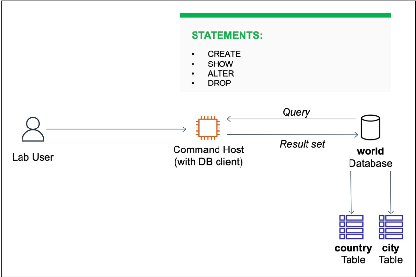
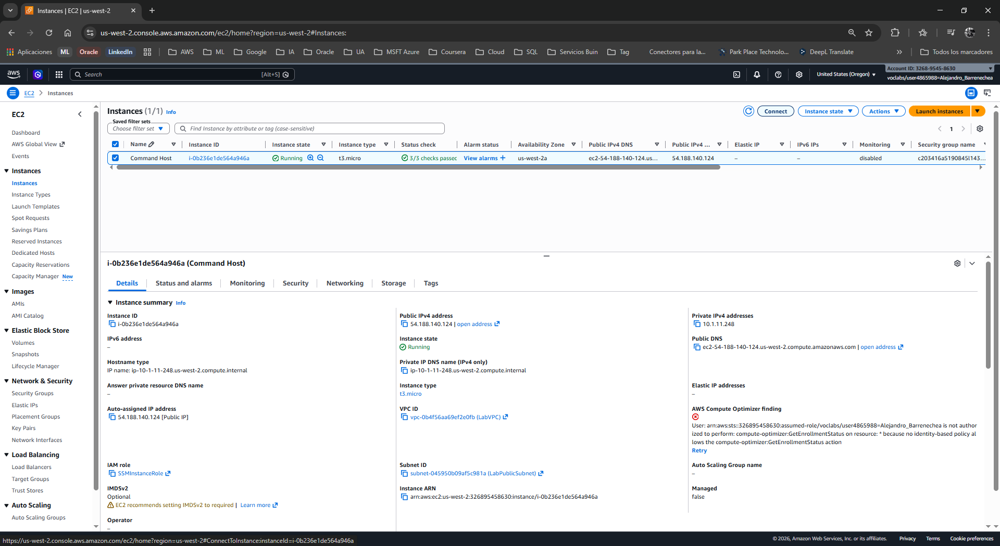
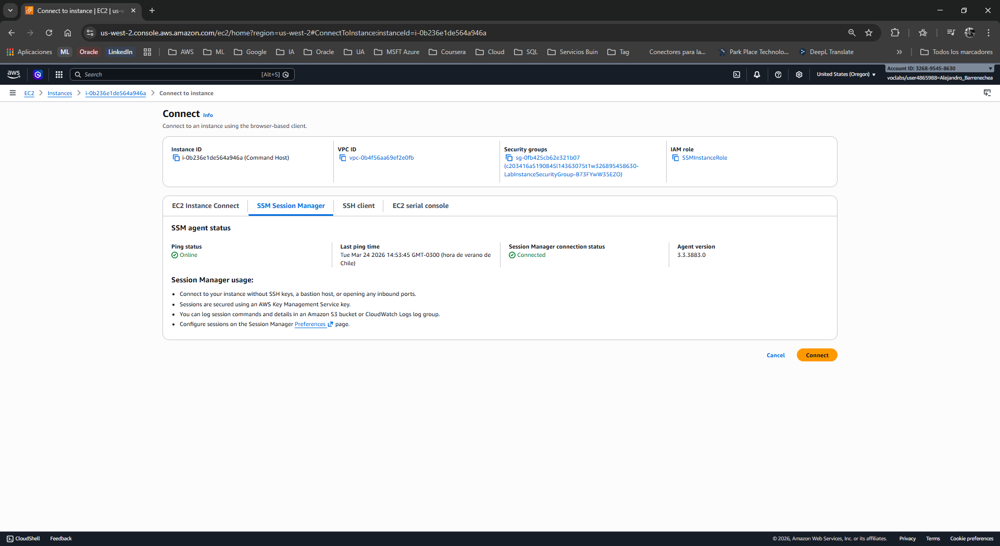
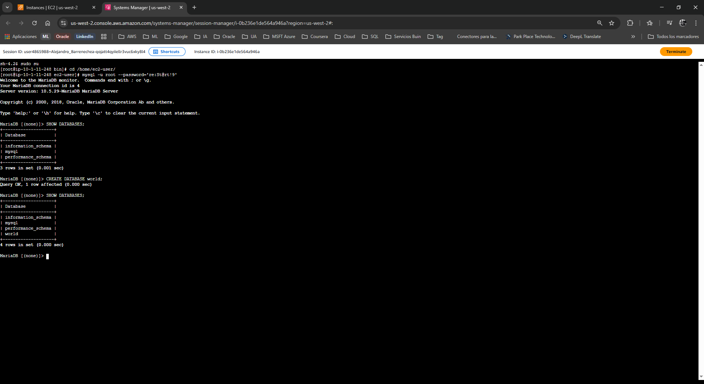
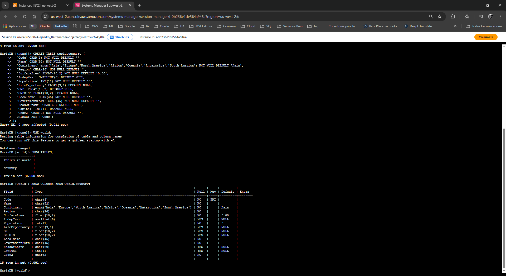
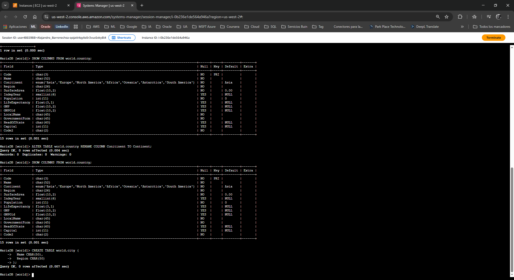
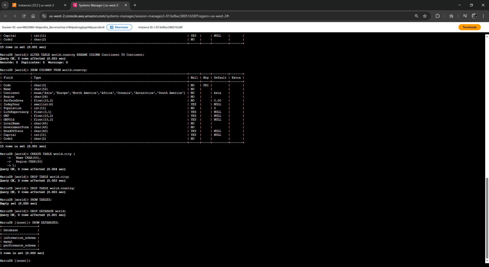

# Laboratorio: Operaciones de Tabla de Base de Datos (DDL)

| Atributo | Detalle |
| :--- | :--- |
| **Dificultad** | Introductorio / Intermedio |
| **Tiempo Estimado** | 45 minutos |
| **Servicios Principales** | Amazon EC2 (Command Host), MySQL Engine |

---

## Resumen y Objetivos
Este laboratorio práctico tiene como propósito fundamental familiarizarte con las operaciones de **Lenguaje de Definición de Datos (DDL)** dentro de un entorno de base de datos relacional. Aprenderás a interactuar con un motor de base de datos MySQL a través de una instancia de comando (Command Host) en AWS.

Al finalizar este laboratorio, serás capaz de:
1. Utilizar la sentencia `CREATE` para generar bases de datos y estructuras de tablas.
2. Emplear la sentencia `SHOW` para auditar la existencia de recursos.
3. Aplicar la sentencia `ALTER` para modificar esquemas de tablas existentes.
4. Ejecutar la sentencia `DROP` para eliminar de forma definitiva tablas y bases de datos.

---

## Análisis del Escenario
El equipo de operaciones de base de datos de tu organización ha desplegado una instancia relacional. Se te ha asignado la tarea de validar el entorno y realizar pruebas de gestión de ciclo de vida de los datos (Creación, Modificación y Eliminación). El diagnóstico inicial indica que el acceso se realizará mediante un **Command Host** (instancia EC2) que actúa como cliente SQL, garantizando que no se exponga la base de datos directamente a la red pública.

---

## Arquitectura
La infraestructura consta de los siguientes componentes:
1. **Lab User:** Usuario con permisos restringidos en la consola de AWS.
2. **Command Host (Amazon EC2):** Instancia Linux que contiene el cliente de MySQL preinstalado.
3. **Database Instance:** Motor de base de datos relacional que procesa las consultas SQL y devuelve los conjuntos de resultados (*Result Sets*).

<p align="center">
  
</p>

---

## Desarrollo

### Tarea 1: Conexión al Command Host
En esta fase, establecerás una sesión segura con el cliente de base de datos utilizando AWS Systems Manager.

1. Navega a la consola de **Amazon EC2**.
2. En el panel de navegación izquierdo, selecciona **Instances** (Instancias).
3. Localiza la instancia llamada **Command Host**, selecciónala y haz clic en el botón **Connect** (Conectar).

<p align="center">
  
</p>

4. Selecciona la pestaña **Session Manager** y haz clic en **Connect**. Se abrirá una terminal en una nueva pestaña.

<p align="center">
  
</p>

5. Eleva tus privilegios y posiciónate en el directorio del usuario ejecutando:
   ```bash
   sudo su
   cd /home/ec2-user/
   ```
6. Conéctate a la instancia de MySQL utilizando las credenciales proporcionadas:
   ```bash
   mysql -u root --password='re:St@rt!9'
   ```
   *Nota: Verás el prompt `mysql>` indicando que la conexión fue exitosa.*

---

### Tarea 2: Creación de Base de Datos y Tablas
A continuación, definirás la estructura lógica donde se almacenará la información.

1. Visualiza las bases de datos actuales para confirmar el estado del motor:
   ```sql
   SHOW DATABASES;
   ```

<p align="center">
  
</p>

2. Crea la base de datos denominada `world`:
   ```sql
   CREATE DATABASE world;
   ```
3. Verifica la creación consultando nuevamente la lista de bases de datos con `SHOW DATABASES;`.
4. Crea la tabla `country` dentro de la base de datos `world` ejecutando el siguiente bloque de código. Este define el esquema (tipos de datos, restricciones y llaves primarias):
   ```sql
   CREATE TABLE world.country (
     `Code` CHAR(3) NOT NULL DEFAULT '',
     `Name` CHAR(52) NOT NULL DEFAULT '',
     `Conitinent` enum('Asia','Europe','North America','Africa','Oceania','Antarctica','South America') NOT NULL DEFAULT 'Asia',
     `Region` CHAR(26) NOT NULL DEFAULT '',
     `SurfaceArea` FLOAT(10,2) NOT NULL DEFAULT '0.00',
     `IndepYear` SMALLINT(6) DEFAULT NULL,
     `Population` INT(11) NOT NULL DEFAULT '0',
     `LifeExpectancy` FLOAT(3,1) DEFAULT NULL,
     `GNP` FLOAT(10,2) DEFAULT NULL,
     `GNPOld` FLOAT(10,2) DEFAULT NULL,
     `LocalName` CHAR(45) NOT NULL DEFAULT '',
     `GovernmentForm` CHAR(45) NOT NULL DEFAULT '',
     `HeadOfState` CHAR(60) DEFAULT NULL,
     `Capital` INT(11) DEFAULT NULL,
     `Code2` CHAR(2) NOT NULL DEFAULT '',
     PRIMARY KEY (`Code`)
   );
   ```
5. Selecciona la base de datos en uso y lista las tablas para confirmar:
   ```sql
   USE world;
   SHOW TABLES;
   ```
6. Inspecciona las columnas de la tabla para validar el esquema:
   ```sql
   SHOW COLUMNS FROM world.country;
   ```

<p align="center">
  
</p>

#### Corrección del Esquema (Uso de ALTER)
Durante la inspección, notarás que la columna `Continent` fue escrita incorrectamente como `Conitinent`. Ejecuta la corrección:
```sql
ALTER TABLE world.country RENAME COLUMN Conitinent TO Continent;
```
*Verifica el cambio ejecutando nuevamente `SHOW COLUMNS FROM world.country;`.*

#### Challenge 1: Creación de tabla complementaria
**Instrucción:** Crea una tabla llamada `city` con dos columnas: `Name` y `Region` (ambas tipo CHAR).
**Solución Sugerida:**
```sql
CREATE TABLE world.city (
  Name CHAR(50),
  Region CHAR(50)
);
```
<p align="center">
  
</p>
---

### Tarea 3: Eliminación de Base de Datos y Tablas
Como parte del ciclo de vida, debes saber cómo remover recursos cuando ya no son necesarios.

1. Elimina la tabla `city` creada anteriormente:
   ```sql
   DROP TABLE world.city;
   ```

#### Challenge 2: Eliminación de tabla principal
**Instrucción:** Escribe la consulta para eliminar la tabla `country`.
**Solución Sugerida:**
```sql
DROP TABLE world.country;
```

2. Verifica que ya no existan tablas en la base de datos:
   ```sql
   SHOW TABLES;
   ```
3. Elimina definitivamente la base de datos `world`:
   ```sql
   DROP DATABASE world;
   ```
4. Confirma la eliminación final:
   ```sql
   SHOW DATABASES;
   ```

<p align="center">
  
</p>

---

## Respuestas Analíticas y Conclusiones

*   **¿Por qué es necesario el comando `USE` antes de `SHOW TABLES`?**
    El comando `USE` establece el contexto de la sesión. Sin él, el motor de base de datos no sabe sobre qué esquema realizar la consulta, a menos que se especifique de forma absoluta (ej. `SHOW TABLES FROM world`).

*   **¿Cuál es el impacto de la sentencia `DROP`?**
    Es una operación irreversible de nivel DDL. Elimina tanto los datos almacenados como la estructura del objeto (metadata) del diccionario de datos. En entornos productivos, esta acción debe precederse siempre de un Backup o Snapshot.

*   **Diferencia entre `CHAR` y `ENUM` observada en el Lab:**
    Mientras `CHAR` permite cualquier cadena de texto hasta el límite definido, `ENUM` actúa como una restricción de dominio, permitiendo solo valores predefinidos (en este caso, los nombres de los continentes), lo que mejora la integridad de los datos.

**¡Felicidades!** Has completado la gestión básica de objetos de base de datos en AWS siguiendo estándares de ingeniería.