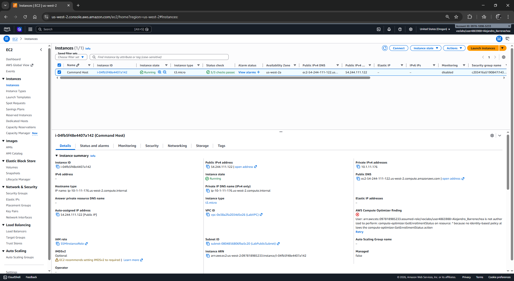
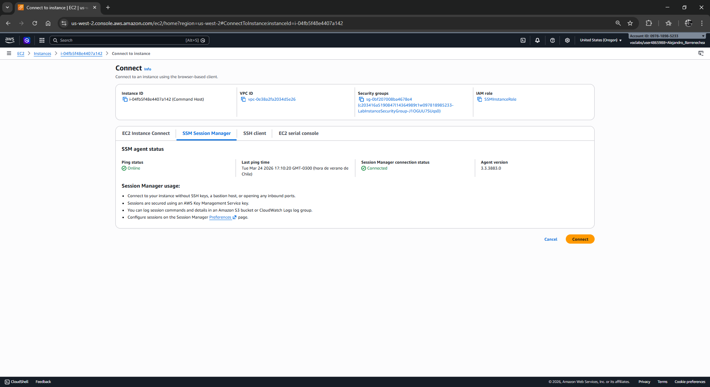
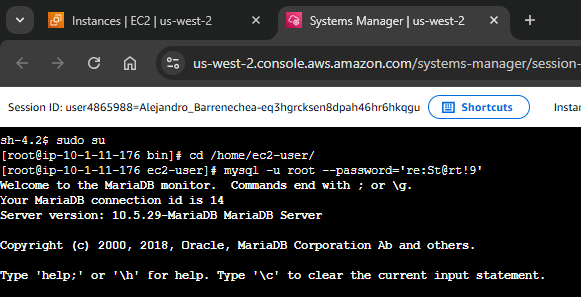
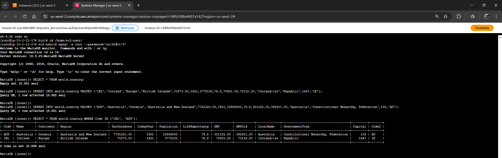
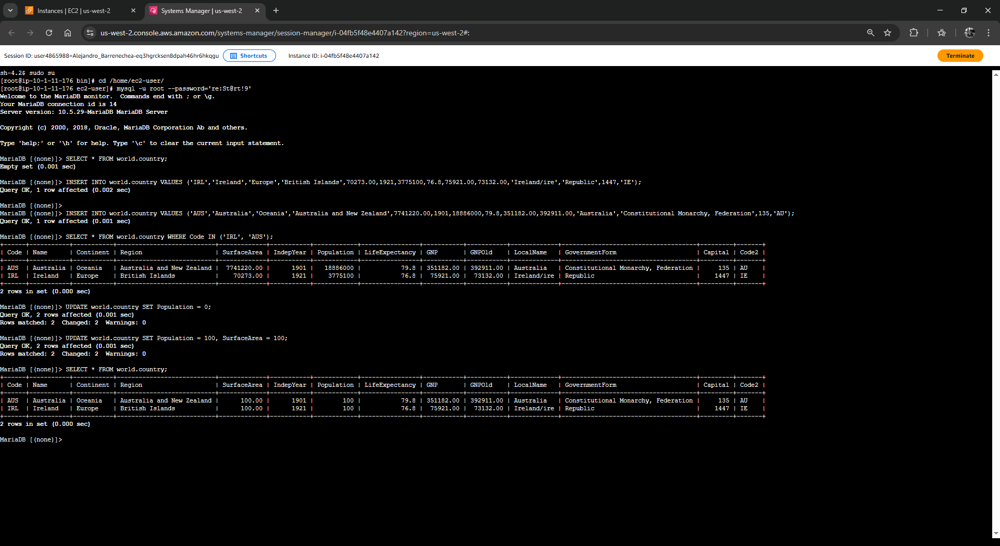
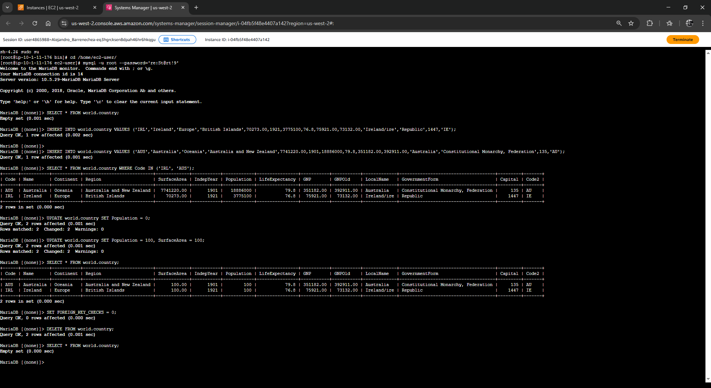
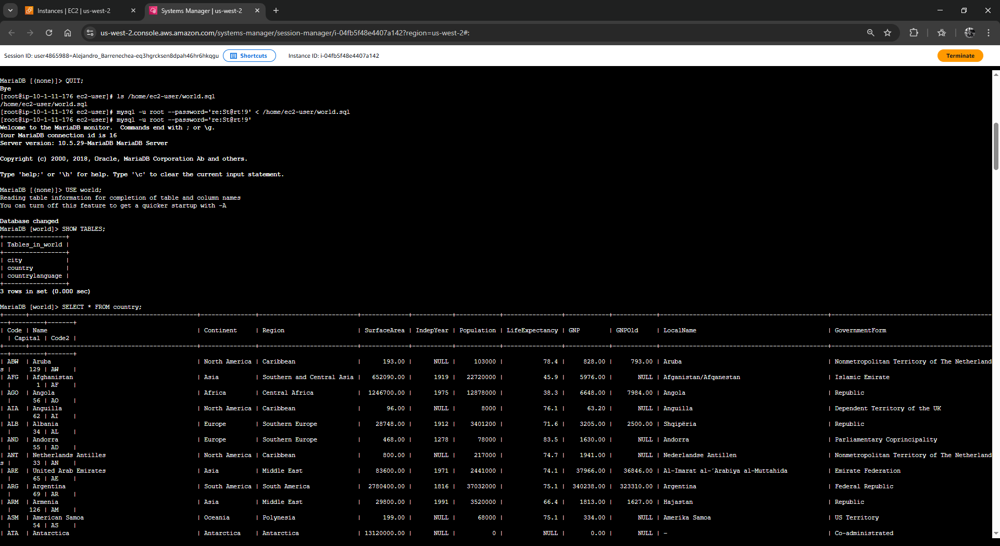
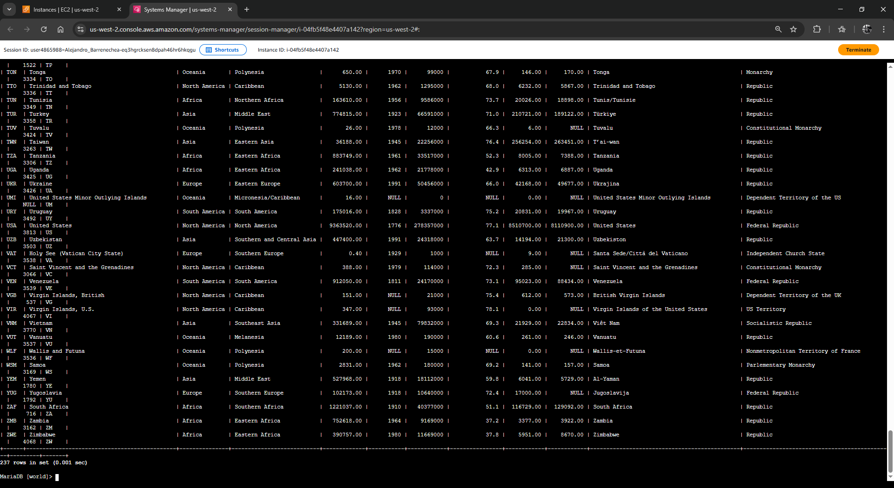

# Laboratorio: Manipulación de Datos en una Base de Datos (DML)

| Atributo | Detalle |
| :--- | :--- |
| **Dificultad** | Intermedio |
| **Tiempo Estimado** | 45 minutos |
| **Servicios Principales** | Amazon EC2, MySQL Engine, Data Manipulation Language (DML) |

---

## Resumen y Objetivos
Este laboratorio se enfoca en el **Lenguaje de Manipulación de Datos (DML)**. Tras haber definido la estructura de la base de datos en módulos anteriores, ahora procederás a gestionar el ciclo de vida de los registros. Aprenderás a poblar tablas, modificar datos existentes, realizar eliminaciones masivas y automatizar la carga de datos mediante scripts externos.

Al finalizar este laboratorio, serás capaz de:
1. Insertar registros de forma manual mediante la sentencia `INSERT`.
2. Modificar datos de forma masiva utilizando `UPDATE`.
3. Eliminar registros y gestionar restricciones de integridad con `DELETE`.
4. Importar estructuras y datos completos desde un archivo de respaldo SQL.

---

## Análisis del Escenario
El equipo de operaciones ha entregado una base de datos relacional denominada `world` con un esquema predefinido (`city`, `country`, `countrylanguage`). Tu misión es validar la funcionalidad del motor realizando operaciones de escritura y edición. Como ingeniero, debes prestar especial atención a la integridad referencial y al riesgo que suponen las sentencias globales (sin cláusula `WHERE`), las cuales pueden comprometer la totalidad de los datos en un entorno productivo.

---

## Arquitectura
El entorno operativo consiste en:
*   **Command Host:** Una instancia EC2 que actúa como bastión de administración.
*   **Motor MySQL:** Residente en el host, procesando transacciones DML.
*   **Archivo de Script (`world.sql`):** Un recurso local en el sistema de archivos de Linux que contiene sentencias SQL para la restauración masiva de datos.

---

## Desarrollo de las Tareas Paso a Paso

### Tarea 1: Conexión a la Base de Datos
Establece el canal de comunicación con el motor de base de datos desde la infraestructura de AWS.

1.  Navega a la consola de **Amazon EC2**.
2.  En el menú lateral, selecciona **Instances** (Instancias).
3.  Selecciona la casilla de la instancia **Command Host** y haz clic en **Connect** (Conectar).

<p align="center">
  
</p>

4.  Elige la pestaña **Session Manager** y pulsa **Connect**.

<p align="center">
  
</p>

5.  Configura el entorno de ejecución en la terminal:
    ```bash
    sudo su
    cd /home/ec2-user/
    ```
6.  Inicia la sesión en el cliente MySQL:
    ```bash
    mysql -u root --password='re:St@rt!9'
    ```
7.  Ejecuta `SHOW DATABASES;` para confirmar que la instancia está activa y lista.

<p align="center">
  
</p>

---

### Tarea 2: Inserción de Datos en una Tabla
Poblarás la tabla `country` con registros individuales.

1.  Verifica el estado actual de la tabla:
    ```sql
    SELECT * FROM world.country;
    ```
2.  Inserta dos nuevos registros (Irlanda y Australia) asegurándote de seguir el orden de columnas definido en el esquema:
    ```sql
    INSERT INTO world.country VALUES ('IRL','Ireland','Europe','British Islands',70273.00,1921,3775100,76.8,75921.00,73132.00,'Ireland/Éire','Republic',1447,'IE');

    INSERT INTO world.country VALUES ('AUS','Australia','Oceania','Australia and New Zealand',7741220.00,1901,18886000,79.8,351182.00,392911.00,'Australia','Constitutional Monarchy, Federation',135,'AU');
    ```
3.  Valida la inserción filtrando por los códigos de país:
    ```sql
    SELECT * FROM world.country WHERE Code IN ('IRL', 'AUS');
    ```

<p align="center">
  
</p>

---

### Tarea 3: Actualización de Registros
Aprenderás a modificar valores en columnas específicas de forma masiva.

1.  Actualiza la población de todos los registros a 0 para simular una limpieza de datos:
    ```sql
    UPDATE world.country SET Population = 0;
    ```
2.  Realiza una actualización múltiple (Población y Área) en una sola sentencia:
    ```sql
    UPDATE world.country SET Population = 100, SurfaceArea = 100;
    ```
3.  Ejecuta `SELECT * FROM world.country;` para auditar que los cambios se aplicaron a todas las filas existentes.

<p align="center">
  
</p>

---

### Tarea 4: Eliminación de Registros
En esta fase, realizarás una purga completa de los datos de la tabla.

1.  Desactiva temporalmente las verificaciones de llaves foráneas para evitar errores de integridad referencial durante la limpieza:
    ```sql
    SET FOREIGN_KEY_CHECKS = 0;
    ```
2.  Elimina todos los registros de la tabla:
    ```sql
    DELETE FROM world.country;
    ```
3.  Confirma que la tabla está vacía:
    ```sql
    SELECT * FROM world.country;
    ```

<p align="center">
  
</p>

---

### Tarea 5: Importación de Datos mediante Archivo SQL
Automatizarás la carga de un dataset completo utilizando un script de respaldo.

1.  Sal del prompt de MySQL:
    ```sql
    QUIT;
    ```
2.  Verifica la existencia del archivo de respaldo en el sistema de archivos de Linux:
    ```bash
    ls /home/ec2-user/world.sql
    ```
3.  Importa el contenido del archivo directamente al motor MySQL utilizando el redireccionador de entrada de Bash:
    ```bash
    mysql -u root --password='re:St@rt!9' < /home/ec2-user/world.sql
    ```
4.  Vuelve a conectarte a MySQL y verifica la restauración:
    ```bash
    mysql -u root --password='re:St@rt!9'
    ```
    ```sql
    USE world;
    SHOW TABLES;
    SELECT * FROM country;
    ```

<p align="center">
  
</p>
<p align="center">
  
</p>
---

## Respuestas Analíticas y Diagnóstico Técnico

*   **¿Cuál es el riesgo de omitir la cláusula `WHERE` en un `UPDATE` o `DELETE`?**
    En SQL, si no se especifica una condición `WHERE`, la operación se aplica a **todas las filas** de la tabla. En este laboratorio se hizo de forma intencional para demostración, pero en producción, esto resultaría en una pérdida masiva de datos o corrupción de información crítica.

*   **¿Por qué se ejecutó `SET FOREIGN_KEY_CHECKS = 0`?**
    La tabla `country` probablemente está relacionada con otras tablas (como `city`) mediante llaves foráneas. El motor de base de datos bloquea la eliminación de un país si existen ciudades asociadas a él para mantener la integridad. Desactivar esta opción permite al administrador forzar la eliminación, aunque debe hacerse con extrema precaución.

*   **Ventaja de la Importación vía Script (`.sql`):**
    Esta técnica garantiza la **idempotencia** y la **consistencia**. Es mucho más eficiente y menos propenso a errores humanos que escribir cientos de sentencias `INSERT` manualmente. Es el estándar para migraciones de datos y despliegues iniciales.

**¡Felicidades!** Has dominado las operaciones esenciales de manipulación de datos y la gestión de scripts en un entorno de base de datos AWS.