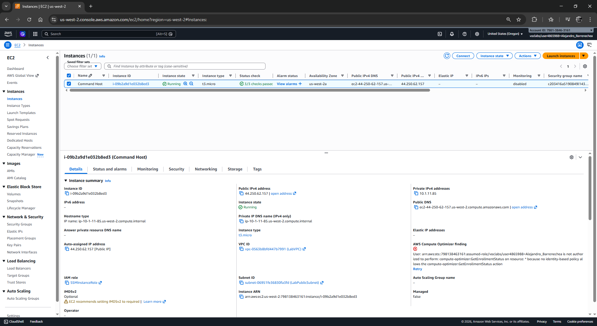
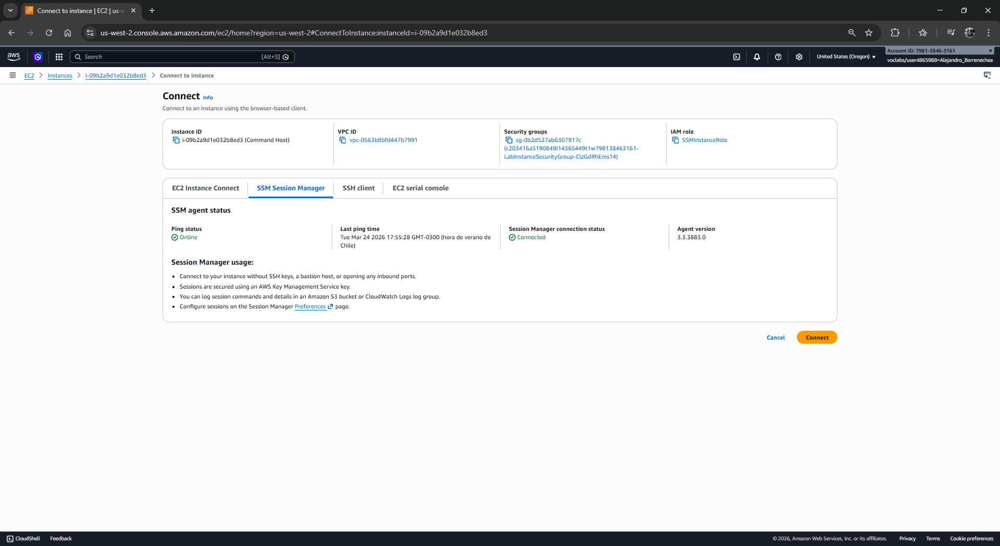
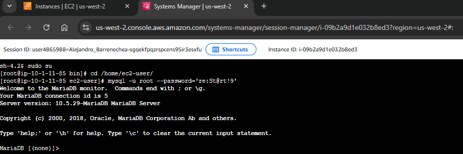
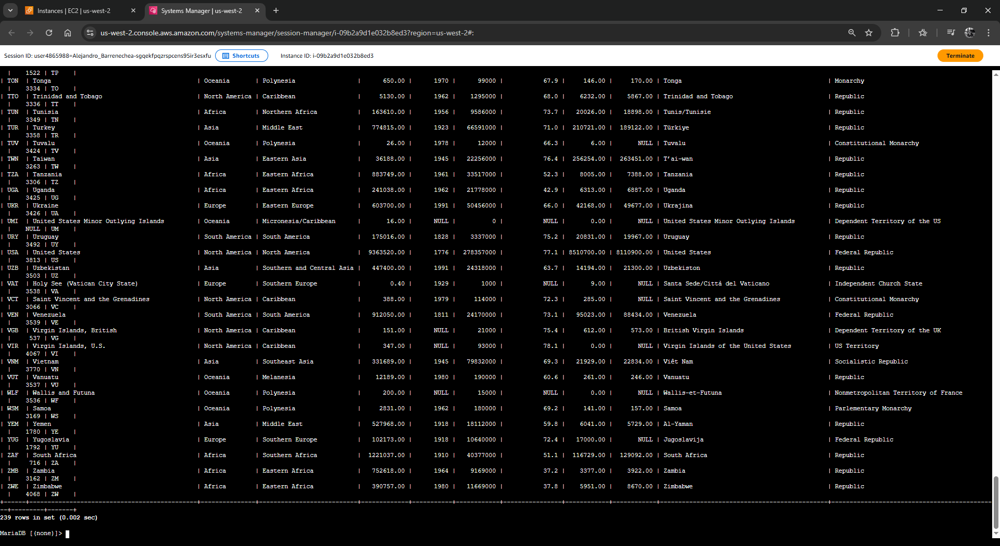
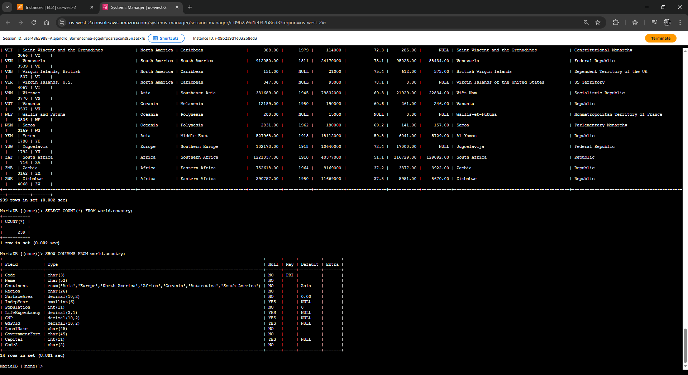
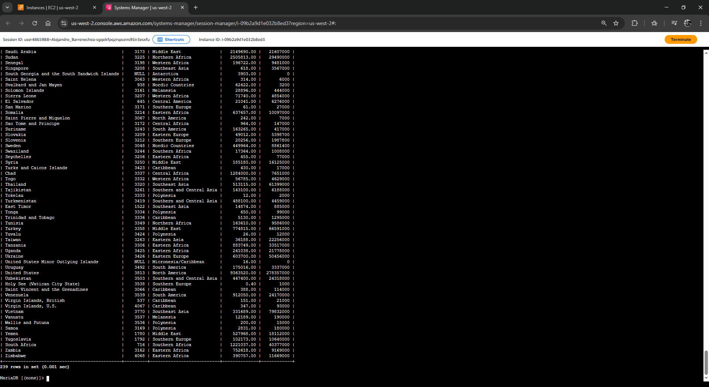
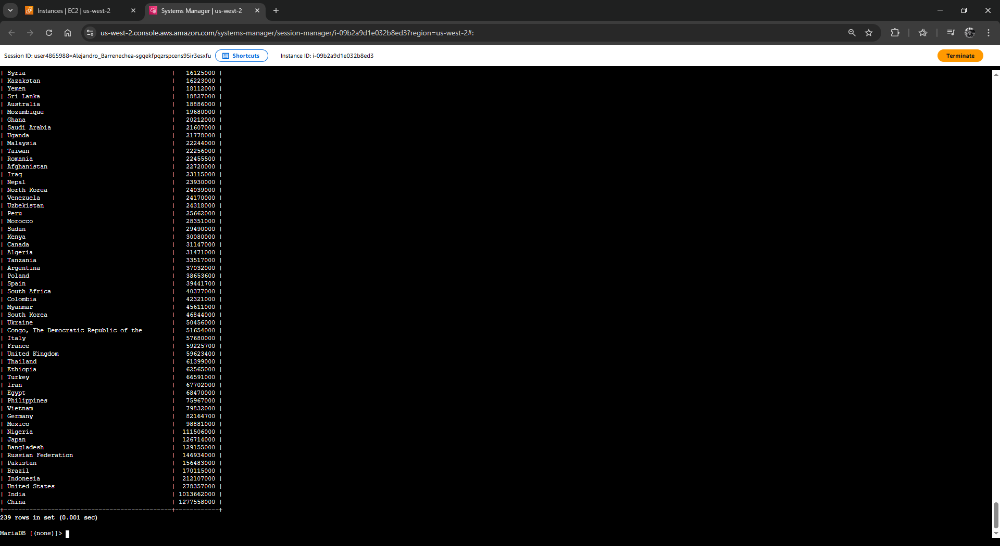
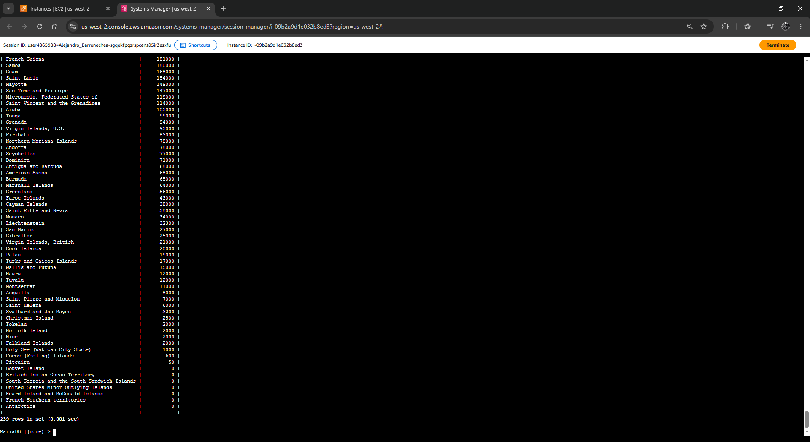
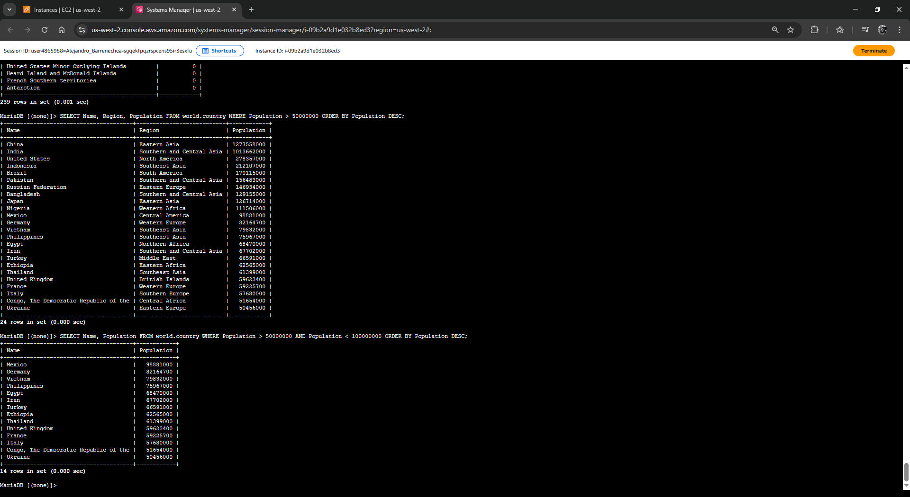
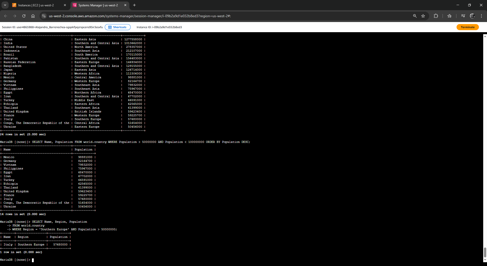

# Laboratorio: Selección y Consulta de Datos (DQL)

| Atributo | Detalle |
| :--- | :--- |
| **Dificultad** | Introductorio |
| **Tiempo Estimado** | 45 minutos |
| **Servicios Principales** | Amazon EC2 (Command Host), MySQL Engine, Data Query Language (DQL) |

---

## Resumen y Objetivos
Este laboratorio se centra en el **Lenguaje de Consulta de Datos (DQL)**. Utilizarás la sentencia `SELECT` como herramienta principal para extraer información específica de una base de datos relacional. Aprenderás a filtrar, ordenar y agregar datos para transformar registros crudos en información útil para la toma de decisiones.

Al finalizar este laboratorio, serás capaz de:
1. Emplear la sentencia `SELECT` para recuperar datos de tablas específicas.
2. Utilizar funciones de agregación como `COUNT()` para obtener métricas rápidas.
3. Aplicar operadores lógicos (`AND`) y de comparación (`>`, `<`, `=`) para filtrar resultados.
4. Implementar cláusulas de ordenamiento (`ORDER BY`) y alias de columna (`AS`) para mejorar la legibilidad de los reportes.

---

## Análisis del Escenario
El equipo de operaciones ya ha poblado la base de datos `world` con información global sobre países y ciudades. Tu rol como analista de datos es validar esta información y responder a solicitudes de negocio específicas mediante consultas SQL. El diagnóstico inicial indica que los datos están estructurados, pero requieren filtrado avanzado para responder preguntas complejas sobre demografía y geografía regional.

---

## Arquitectura
La infraestructura se mantiene bajo el modelo de administración segura:
*   **Command Host:** Instancia EC2 que sirve como punto de entrada para el administrador.
*   **Motor MySQL:** Procesa las consultas enviadas por el usuario y genera el *Result Set* (conjunto de resultados).
*   **Base de Datos `world`:** Contiene las tablas `country`, `city` y `countrylanguage`.

---

## Desarrollo de las Tareas Paso a Paso

### Tarea 1: Conexión al Command Host
Establece el entorno de trabajo seguro para interactuar con el motor de base de datos.

1.  Navega a la consola de **Amazon EC2**.
2.  En el panel izquierdo, selecciona **Instances**.
3.  Selecciona la instancia **Command Host**, haz clic en el botón **Connect** (Conectar).

<p align="center">
  
</p>

4.  Elige la pestaña **Session Manager** y presiona **Connect**.

<p align="center">
  
</p>

5.  En la terminal, prepara el entorno con los siguientes comandos:
    ```bash
    sudo su
    cd /home/ec2-user/
    ```
6.  Accede al shell de MySQL con las credenciales de laboratorio:
    ```bash
    mysql -u root --password='re:St@rt!9'
    ```

<p align="center">
  
</p>
---

### Tarea 2: Consulta de la Base de Datos `world`
Realizarás extracciones de datos incrementando la complejidad de los filtros.

1.  Confirma la disponibilidad de la base de datos:
    ```sql
    SHOW DATABASES;
    ```

<p align="center">
  
</p>

2.  Extrae la totalidad de los registros de la tabla de países para una inspección general:
    ```sql
    SELECT * FROM world.country;
    ```
3.  Utiliza la función de agregación para conocer el volumen total de registros:
    ```sql
    SELECT COUNT(*) FROM world.country;
    ```
4.  Inspecciona la estructura de las columnas para identificar los nombres técnicos de los campos:
    ```sql
    SHOW COLUMNS FROM world.country;
    ```

<p align="center">
  
</p>

5.  Refina la consulta para extraer solo columnas específicas y utiliza un **Alias** para mejorar la presentación:
    ```sql
    SELECT Name, Capital, Region, SurfaceArea AS "Surface Area", Population FROM world.country;
    ```

<p align="center">
  
</p>

6.  Ordena los resultados de forma ascendente y descendente según la población:
    *   **Ascendente (por defecto):**
        ```sql
        SELECT Name, Population FROM world.country ORDER BY Population;
        ```

<p align="center">
  
</p>

    *   **Descendente (más poblados primero):**
        ```sql
        SELECT Name, Population FROM world.country ORDER BY Population DESC;
        ```

<p align="center">
  
</p>

#### Uso de Filtrado Avanzado (Cláusula WHERE)
Para responder a criterios específicos de negocio, aplica filtros lógicos:

1.  Filtra países con población superior a 50 millones, ordenados del más grande al más pequeño:
    ```sql
    SELECT Name, Region, Population FROM world.country WHERE Population > 50000000 ORDER BY Population DESC;
    ```
2.  Aplica un rango de población utilizando el operador lógico `AND`:
    ```sql
    SELECT Name, Population FROM world.country WHERE Population > 50000000 AND Population < 100000000 ORDER BY Population DESC;
    ```

<p align="center">
  
</p>

---

### Challenge (Desafío Técnico)
**Pregunta:** ¿Qué país en "Southern Europe" (Europa del Sur) tiene una población mayor a 50,000,000?

**Procedimiento:** Debes combinar un filtro de cadena de texto (string) con un filtro numérico.

1.  Escribe y ejecuta la siguiente consulta:
    ```sql
    SELECT Name, Region, Population 
    FROM world.country 
    WHERE Region = 'Southern Europe' AND Population > 50000000;
    ```
    *Analiza el resultado: Deberías obtener a **Italy** (Italia) como el único registro que cumple ambos criterios.*

<p align="center">
  
</p>

---

## Respuestas Analíticas y Conclusiones

*   **¿Cuál es la diferencia entre `COUNT(*)` y `COUNT(Columna)`?**
    `COUNT(*)` cuenta todas las filas del conjunto de resultados, incluyendo aquellas que puedan tener valores nulos en algunas celdas. `COUNT(Population)`, por otro lado, solo contará los registros donde la columna "Population" no sea `NULL`.

*   **Importancia de los Alias (`AS`):**
    En el desarrollo de aplicaciones y reportes, los nombres de las columnas en la base de datos suelen ser técnicos o abreviados (ej. `SrfArea`). El uso de `AS` permite que el resultado entregado al usuario final o a la interfaz sea comprensible y profesional sin cambiar la estructura real de la tabla.

*   **Eficiencia del filtrado con `WHERE`:**
    Como ingeniero de AWS, debes saber que filtrar los datos en el motor de base de datos (lado del servidor) es mucho más eficiente que traer todos los datos a la aplicación y filtrarlos allí. Esto reduce la latencia de red y el consumo de memoria del cliente.

**¡Felicidades!** Has completado con éxito las operaciones de consulta y análisis de datos en un entorno MySQL gestionado.