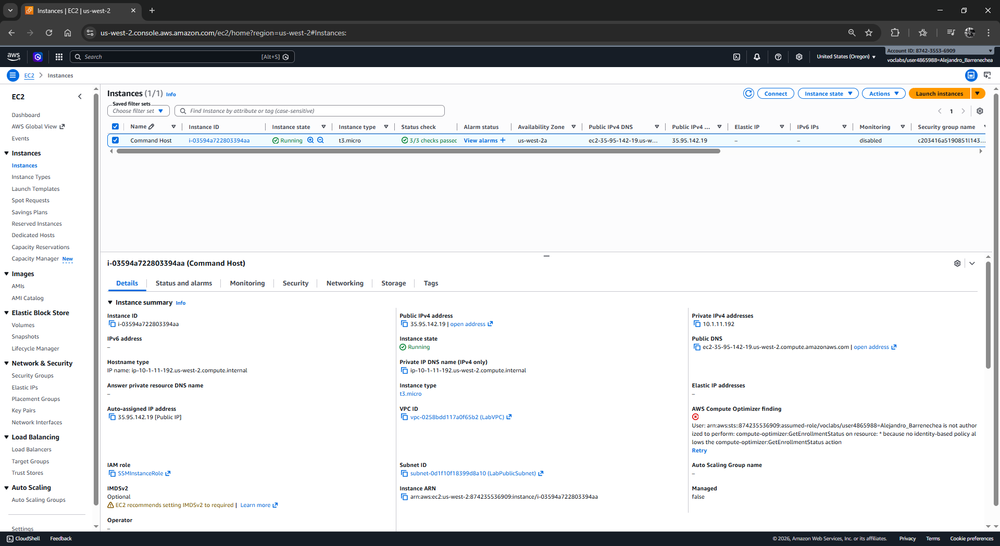
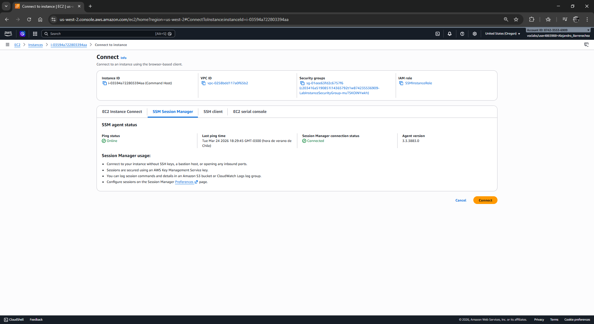
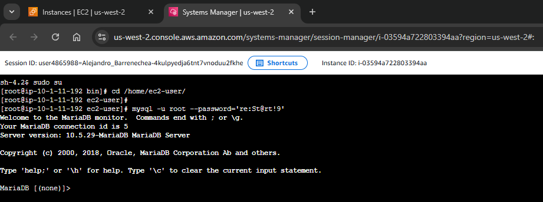
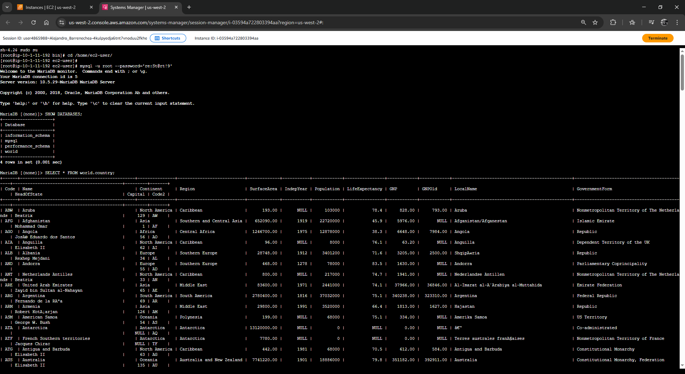
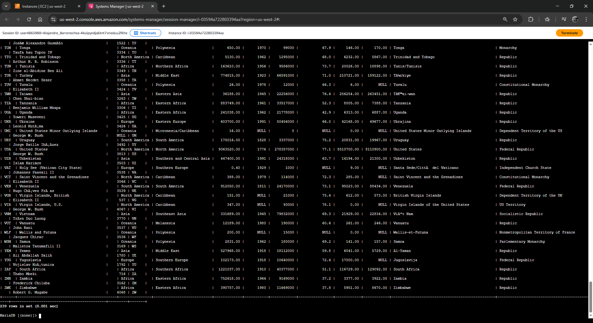
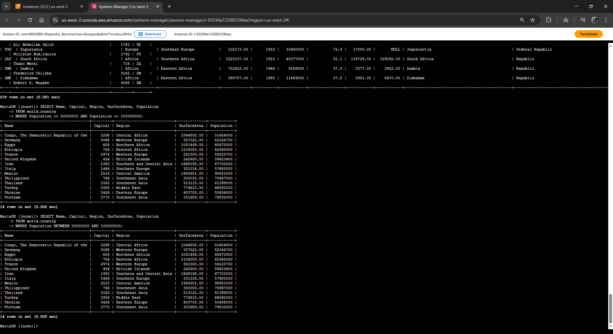
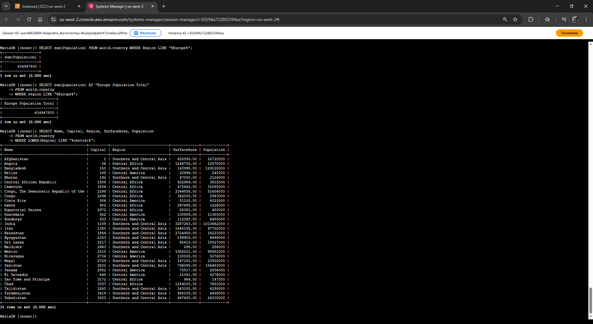
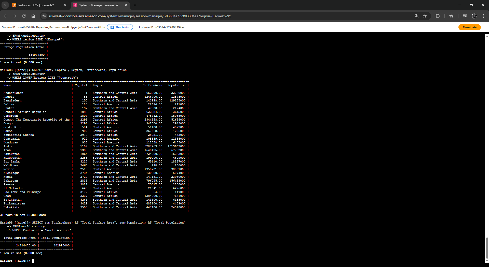

# Laboratorio: Realización de una Búsqueda Condicional (DQL Avanzado)

| Atributo | Detalle |
| :--- | :--- |
| **Dificultad** | Intermedio |
| **Tiempo Estimado** | 45 minutos |
| **Servicios Principales** | Amazon EC2 (Command Host), MySQL Engine |

---

## Resumen y Objetivos
Este laboratorio profundiza en el uso de la cláusula `WHERE` para realizar búsquedas granulares y precisas dentro de un conjunto de datos. Aprenderás a utilizar operadores lógicos y funciones integradas para filtrar registros basándote en rangos, patrones de texto y cálculos agregados.

Al finalizar este laboratorio, serás capaz de:
1. Escribir condiciones de búsqueda complejas utilizando la cláusula `WHERE`.
2. Implementar el operador `BETWEEN` para filtrado de rangos inclusivos.
3. Utilizar el operador `LIKE` con caracteres comodín (`%`) para búsqueda de patrones.
4. Aplicar alias de columna con `AS` y funciones de agregación como `SUM()`.
5. Manejar la sensibilidad a mayúsculas y minúsculas mediante la función `LOWER()`.

---

## Análisis del Escenario
Como parte del equipo de operaciones de base de datos, se te ha solicitado extraer métricas específicas de la tabla `country`. El diagnóstico inicial indica que las consultas simples ya no son suficientes; ahora se requiere consolidar datos demográficos por regiones geográficas y filtrar países dentro de umbrales poblacionales específicos. La precisión en el uso de operadores lógicos es crítica para evitar resultados erróneos o "ruido" en los reportes.

---

## Arquitectura
La estructura de trabajo se compone de:
*   **Command Host (EC2):** Tu estación de trabajo Linux con el cliente `mysql` instalado.
*   **Motor de Base de Datos:** Instancia local de MySQL que aloja la base de datos `world`.
*   **Lógica de Consulta:** Interacción mediante SQL Shell para procesar funciones de agregación y filtros condicionales.

---

## Desarrollo de las Tareas Paso a Paso

### Tarea 1: Conexión al Command Host
Establece la conexión segura con la infraestructura de base de datos.

1.  Ingresa a la consola de **Amazon EC2**.
2.  En el menú de navegación, haz clic en **Instances** (Instancias).
3.  Ubica el **Command Host**, selecciónalo y pulsa en **Connect**.

<p align="center">
  
</p>

4.  Selecciona la pestaña **Session Manager** y haz clic en el botón naranja **Connect**.

<p align="center">
  
</p>

5.  Prepara el shell ejecutando:
    ```bash
    sudo su
    cd /home/ec2-user/
    ```
6.  Inicia la sesión en MySQL:
    ```bash
    mysql -u root --password='re:St@rt!9'
    ```

<p align="center">
  
</p>
---

### Tarea 2: Consulta de la Base de Datos `world`
Ejecutarás filtros avanzados para extraer información de valor.

1.  Verifica la existencia de la base de datos: `SHOW DATABASES;`.
2.  Inspecciona los datos generales: `SELECT * FROM world.country;`.

<p align="center">
  
</p>
<p align="center">
  
</p>

#### Filtrado por Rangos (AND vs BETWEEN)
3.  Filtra países con una población entre 50 y 100 millones usando operadores de comparación:
    ```sql
    SELECT Name, Capital, Region, SurfaceArea, Population 
    FROM world.country 
    WHERE Population >= 50000000 AND Population <= 100000000;
    ```
4.  Optimiza la legibilidad de la consulta anterior utilizando el operador `BETWEEN`:
    ```sql
    SELECT Name, Capital, Region, SurfaceArea, Population 
    FROM world.country 
    WHERE Population BETWEEN 50000000 AND 100000000;
    ```

<p align="center">
  
</p>

#### Búsqueda de Patrones y Agregación
5.  Calcula la población total de todas las regiones que contengan la palabra "Europe" utilizando el comodín `%`:
    ```sql
    SELECT sum(Population) FROM world.country WHERE Region LIKE "%Europe%";
    ```
6.  Mejora la presentación del resultado anterior asignando un **Alias** a la columna calculada:
    ```sql
    SELECT sum(population) AS "Europe Population Total" 
    FROM world.country 
    WHERE region LIKE "%Europe%";
    ```

#### Normalización de Texto (LOWER)
7.  Realiza una búsqueda que ignore la capitalización (case-insensitive) forzando el campo a minúsculas para comparar con la cadena "central":
    ```sql
    SELECT Name, Capital, Region, SurfaceArea, Population 
    FROM world.country 
    WHERE LOWER(Region) LIKE "%central%";
    ```

<p align="center">
  
</p>
---

### Challenge (Desafío Técnico)
**Instrucción:** Escribe una consulta que devuelva la suma de la superficie (`SurfaceArea`) y la suma de la población (`Population`) de "North America".

**Solución Sugerida:**
```sql
SELECT sum(SurfaceArea) AS "Total Surface Area", sum(Population) AS "Total Population"
FROM world.country
WHERE Continent = 'North America';
```
*Nota: Antes de ejecutar, asegúrate de validar si el filtro debe aplicarse a la columna `Continent` o `Region` según los datos observados en la Tarea 2.*

<p align="center">
  
</p>

---

## Respuestas Analíticas y Diagnóstico Técnico

*   **¿Cuál es la ventaja de `BETWEEN` sobre `>=` y `<=`?**
    La principal ventaja es la **legibilidad y mantenimiento del código**. `BETWEEN` es un operador inclusivo que hace que la intención de la consulta sea clara para otros ingenieros, reduciendo el riesgo de errores lógicos al escribir múltiples condiciones `AND`.

*   **Uso del Carácter Comodín `%`:**
    En el operador `LIKE`, el símbolo `%` representa "cualquier cantidad de caracteres (incluyendo cero)". 
    - `%Europe%`: Busca "Europe" en cualquier parte de la cadena.
    - `Europe%`: Busca cadenas que *comiencen* con "Europe".
    - `%Europe`: Busca cadenas que *terminen* con "Europe".

*   **Importancia de la función `LOWER()`:**
    Aunque muchas configuraciones de MySQL son *case-insensitive* por defecto (dependiendo del *collation*), en entornos de ingeniería de software profesional no se debe asumir esto. Utilizar `LOWER(columna)` garantiza que la búsqueda sea consistente independientemente de cómo se hayan ingresado los datos originalmente, evitando que registros como "CENTRAL" o "Central" queden fuera del reporte.

**¡Felicidades!** Has fortalecido tus habilidades de análisis de datos aplicando filtros condicionales y funciones de agregación en AWS.