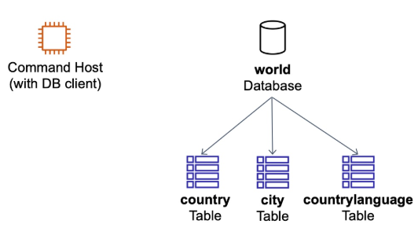
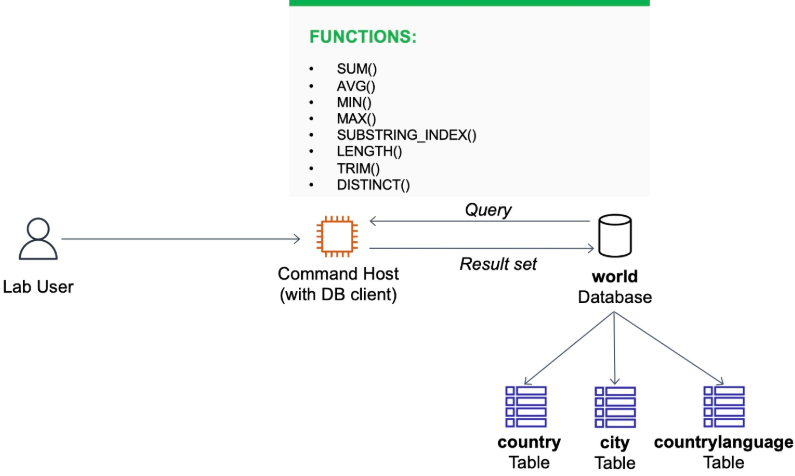
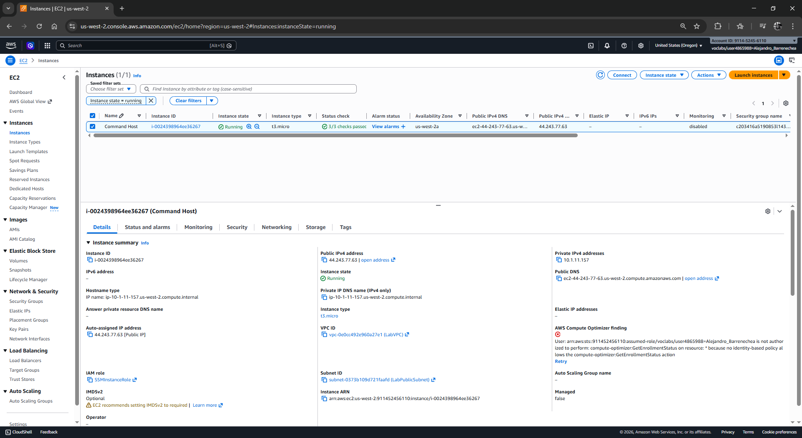
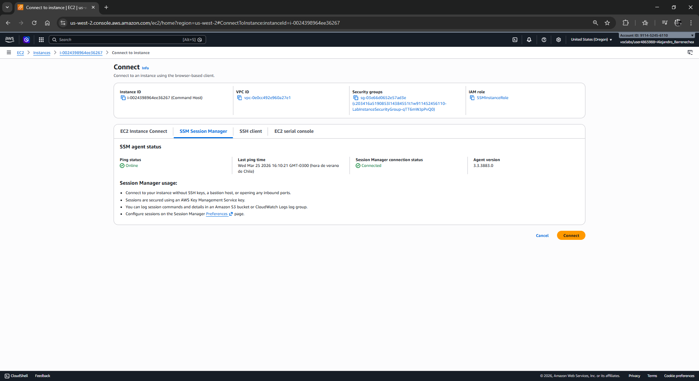
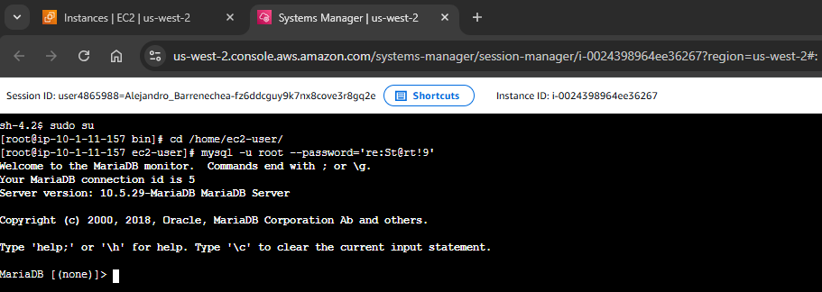
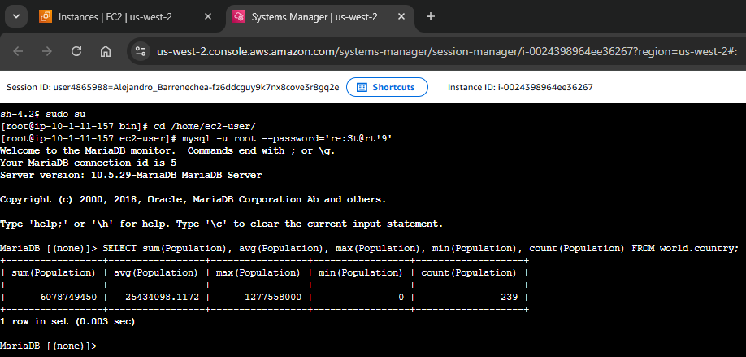
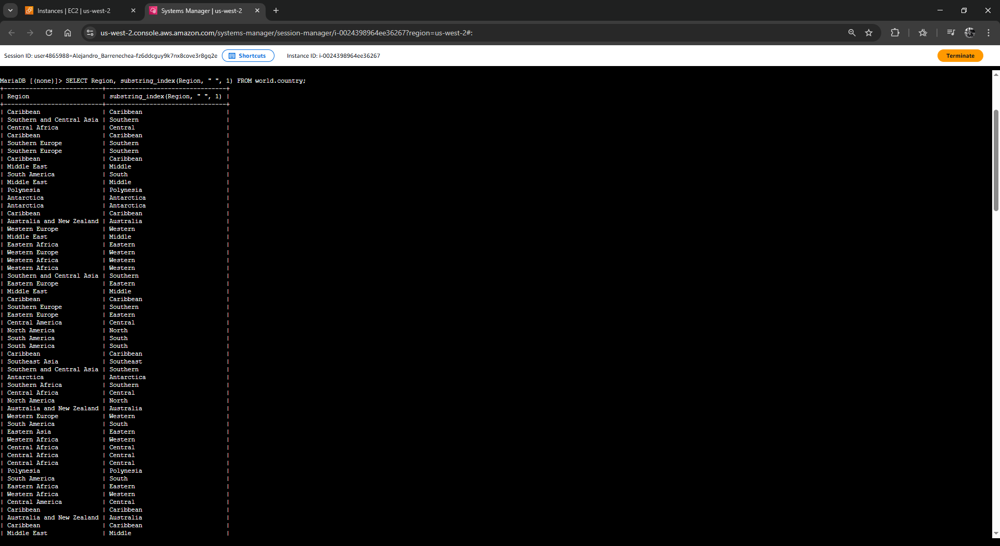
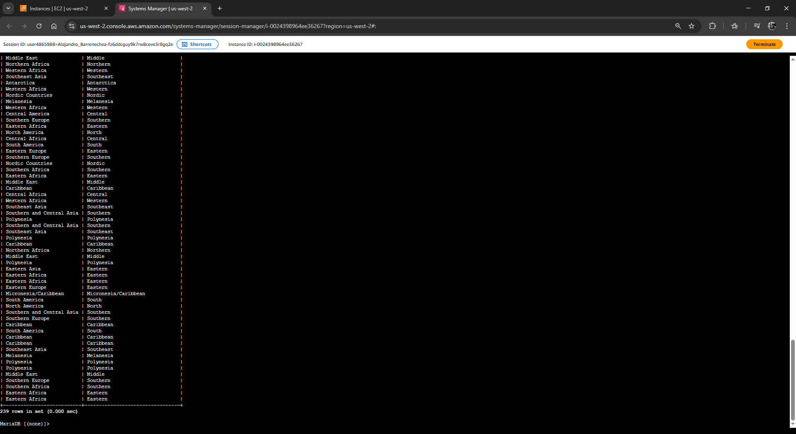
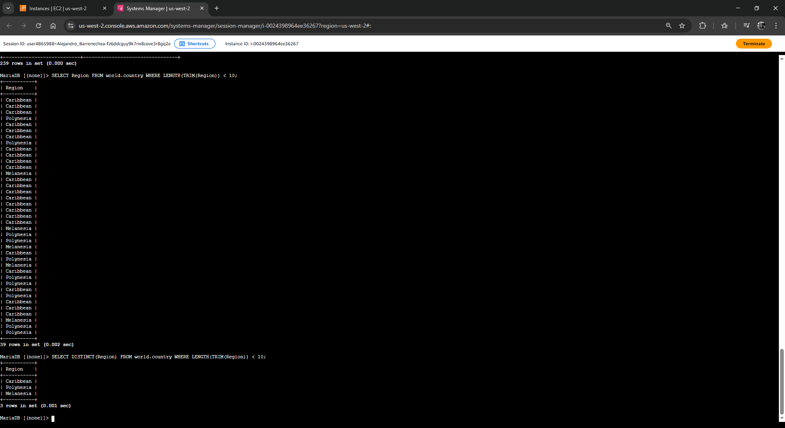
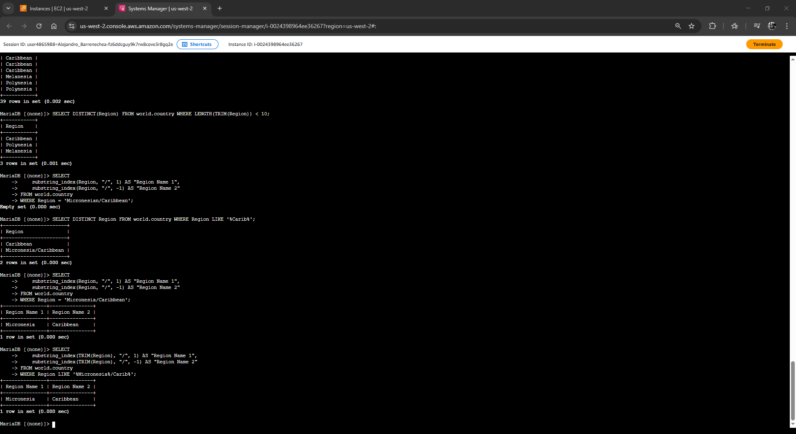

# Laboratorio: Trabajo con Funciones en Bases de Datos (SQL Functions)

| Atributo | Detalle |
| :--- | :--- |
| **Dificultad** | Intermedio |
| **Tiempo Estimado** | 45 minutos |
| **Servicios Principales** | Amazon EC2 (Command Host), MySQL Engine, SQL Functions |

---

## Resumen y Objetivos
Este laboratorio profundiza en el uso de funciones integradas de SQL para el procesamiento, manipulación y resumen de datos. Aprenderás a transformar información cruda en métricas de valor y a realizar limpiezas de cadenas de texto directamente desde el motor de base de datos.

Al finalizar este laboratorio, serás capaz de:
1. Utilizar funciones de agregación (`SUM`, `MIN`, `MAX`, `AVG`, `COUNT`) para generar reportes estadísticos.
2. Emplear `SUBSTRING_INDEX()` para segmentar datos complejos en columnas individuales.
3. Aplicar funciones de limpieza y medición como `TRIM()` y `LENGTH()`.
4. Eliminar redundancias en los resultados mediante la función `DISTINCT()`.
5. Integrar funciones tanto en la proyección de resultados (`SELECT`) como en los filtros (`WHERE`).

---

## Análisis del Escenario
El equipo de operaciones de base de datos requiere reportes avanzados sobre la base de datos `world`. El diagnóstico inicial indica que, además de las consultas básicas, es necesario realizar limpieza de datos (remover espacios en blanco) y segmentación de regiones geográficas que actualmente se encuentran concatenadas en una sola columna. Como ingeniero, tu tarea es utilizar el poder de procesamiento del motor de base de datos para entregar resultados ya formateados y calculados.

---

## Arquitectura
La infraestructura se basa en una arquitectura de cliente-servidor simplificada:
*   **Host de Comandos (EC2):** Actúa como la interfaz administrativa.
*   **Motor MySQL:** Ejecuta la lógica de las funciones solicitadas.
*   **Dataset:** Tablas `city`, `country` y `countrylanguage` con datos regionales de Finlandia y el mundo.

<p align="center">
  
</p>
<p align="center">
  
</p>
---

## Desarrollo de las Tareas Paso a Paso

### Tarea 1: Conexión al Command Host
Establece la comunicación con el entorno de base de datos a través de la consola de AWS.

1.  Navega a la consola de **Amazon EC2**.
2.  En el panel de navegación izquierdo, selecciona **Instances** (Instancias).
3.  Selecciona la instancia etiquetada como **Command Host** y haz clic en **Connect** (Conectar).

<p align="center">
  
</p>

4.  Elige la pestaña **Session Manager** y pulsa **Connect**.

<p align="center">
  
</p>

5.  Configura tu sesión de terminal:
    ```bash
    sudo su
    cd /home/ec2-user/
    ```
6.  Inicia la sesión en el cliente de base de datos:
    ```bash
    mysql -u root --password='re:St@rt!9'
    ```

<p align="center">
  
</p>
---

### Tarea 2: Consulta de la Base de Datos `world`
Ejecutarás las funciones para transformar la salida de los datos.

#### Uso de Funciones de Agregación
1.  Calcula el resumen demográfico global de la tabla `country`:
    ```sql
    SELECT sum(Population), avg(Population), max(Population), min(Population), count(Population) FROM world.country;
    ```
    *   **SUM():** Total de habitantes.
    *   **AVG():** Promedio de población por país.
    *   **MAX() / MIN():** Países con mayor y menor población.
    *   **COUNT():** Cantidad de registros con datos válidos.

<p align="center">
  
</p>

#### Manipulación de Cadenas de Texto (Strings)
2.  Divide la columna `Region` para obtener solo la primera palabra (delimitada por un espacio):
    ```sql
    SELECT Region, substring_index(Region, " ", 1) FROM world.country;
    ```

<p align="center">
  
</p>
<p align="center">
  
</p>

3.  Filtra registros utilizando una función dentro de la cláusula `WHERE` para encontrar regiones que comiencen con la palabra "Southern":
    ```sql
    SELECT Name, Region FROM world.country WHERE substring_index(Region, " ", 1) = "Southern";
    ```

#### Limpieza y Conteo de Caracteres
4.  Identifica regiones cuyos nombres tengan menos de 10 caracteres, eliminando espacios accidentales al inicio o final:
    ```sql
    SELECT Region FROM world.country WHERE LENGTH(TRIM(Region)) < 10;
    ```
5.  Notarás resultados duplicados. Aplica la función `DISTINCT()` para obtener una lista única de estas regiones:
    ```sql
    SELECT DISTINCT(Region) FROM world.country WHERE LENGTH(TRIM(Region)) < 10;
    ```

<p align="center">
  
</p>
---

### Challenge (Desafío Técnico)
**Instrucción:** Escribe una consulta para los registros que tengan "Micronesian/Caribbean" en la columna de región. El resultado debe dividir el nombre en dos columnas separadas: una llamada `Region Name 1` y otra `Region Name 2`.

**Procedimiento Sugerido:**
Debes identificar el delimitador (en este caso `/`) y usar la posición `1` para la primera parte y `-1` para la última.

**Solución:**
```sql
SELECT 
    substring_index(Region, "/", 1) AS "Region Name 1", 
    substring_index(Region, "/", -1) AS "Region Name 2" 
FROM world.country 
WHERE Region = 'Micronesian/Caribbean';
```

### Resolución del Challenge y Depuración de Consultas

En entornos de ingeniería de datos, es común enfrentarse al resultado `Empty set`. Esto indica que la consulta es sintácticamente válida pero no existen registros que coincidan exactamente con el criterio del `WHERE`.

#### Diagnóstico del Error "Empty set"
Si al ejecutar la consulta para `Micronesian/Caribbean` obtuviste un conjunto vacío, se debe a una discrepancia entre el valor literal escrito en la consulta y el valor almacenado en el motor MariaDB/MySQL.

#### Procedimiento de Depuración y Resolución

1.  **Identifica el valor real en la base de datos:**
    Ejecuta una búsqueda de patrón flexible para confirmar la escritura exacta de la región (notarás que el registro correcto es `Micronesia/Caribbean` sin la "n" final en Micronesia):
    ```sql
    SELECT DISTINCT Region FROM world.country WHERE Region LIKE '%Carib%';
    ```

2.  **Ejecuta la consulta corregida del Challenge:**
    Utiliza el nombre exacto identificado y aplica la lógica de segmentación con los alias solicitados:
    ```sql
    SELECT 
        substring_index(Region, "/", 1) AS "Region Name 1", 
        substring_index(Region, "/", -1) AS "Region Name 2" 
    FROM world.country 
    WHERE Region = 'Micronesia/Caribbean';
    ```

3.  **Implementa una consulta robusta (Buena Práctica de Ingeniería):**
    Para evitar fallos por espacios accidentales o variaciones mínimas, utiliza la función `TRIM()` y el operador `LIKE`. Esta es la forma más profesional de asegurar el resultado:
    ```sql
    SELECT 
        substring_index(TRIM(Region), "/", 1) AS "Region Name 1", 
        substring_index(TRIM(Region), "/", -1) AS "Region Name 2" 
    FROM world.country 
    WHERE Region LIKE '%Micronesia%/Carib%';
    ```

#### Resultado Esperado
Tras aplicar la corrección, el motor debe devolver el siguiente conjunto de resultados:

| Region Name 1 | Region Name 2 |
| :--- | :--- |
| Micronesia | Caribbean |

<p align="center">
  
</p>

---
**Nota del Instructor:** Como ingeniero, siempre valida tus datos con `LIKE` antes de realizar operaciones de transformación complejas. Esto garantiza que tus scripts de automatización no fallen por inconsistencias en el ingreso de datos manuales.

---

## Respuestas Analíticas y Diagnóstico Técnico

*   **¿Cuál es la ventaja de `TRIM()` antes de `LENGTH()`?**
    En bases de datos con ingresos manuales, es común que existan espacios en blanco accidentales (ej. `" Asia "` en lugar de `"Asia"`). `TRIM()` remueve estos caracteres invisibles antes de que `LENGTH()` realice el conteo, asegurando que el filtro sea exacto y profesional.

*   **Impacto de `DISTINCT()` en el rendimiento:**
    `DISTINCT()` requiere que el motor de base de datos ordene y compare los resultados antes de entregarlos. Aunque es extremadamente útil para reportes limpios, en tablas con millones de registros debe usarse con moderación o combinarse con índices para evitar latencia.

*   **Versatilidad de `SUBSTRING_INDEX()`:**
    Esta función es vital para procesar datos que no están en **Primera Forma Normal (1NF)**. Al poder usar índices negativos (como `-1`), permite extraer datos desde el final de la cadena hacia atrás, lo cual es ideal para extraer extensiones de archivos o apellidos en campos de nombre completo.

**¡Felicidades!** Has completado el laboratorio de funciones avanzadas de SQL, optimizando la extracción y formato de datos en AWS.