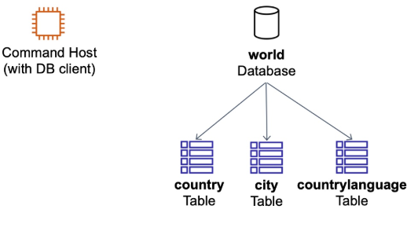
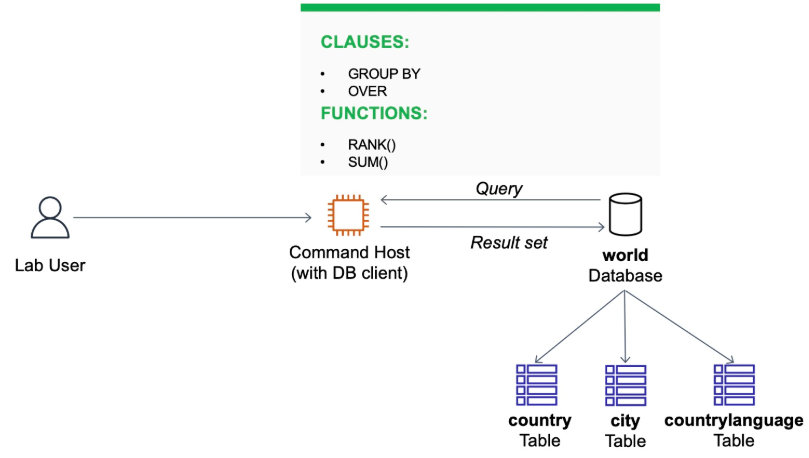
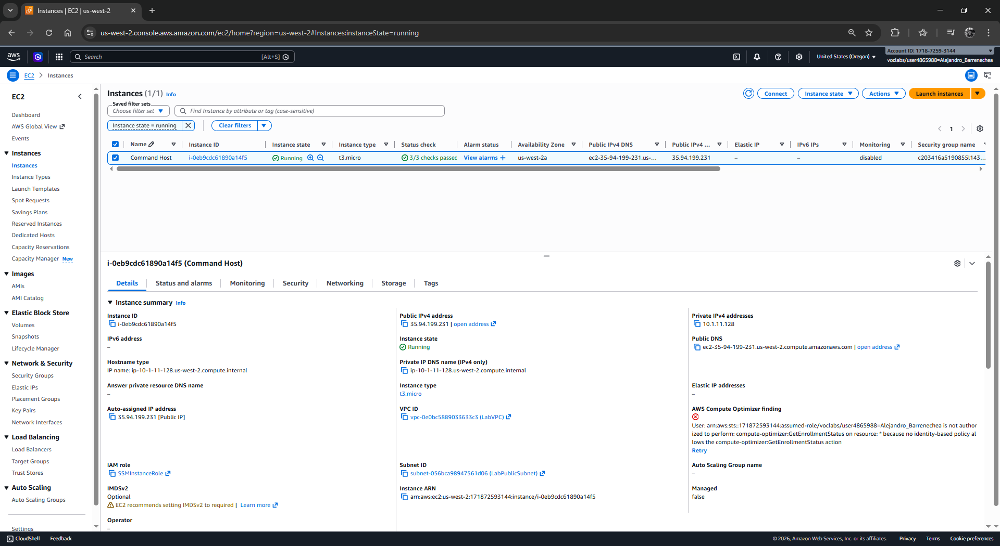
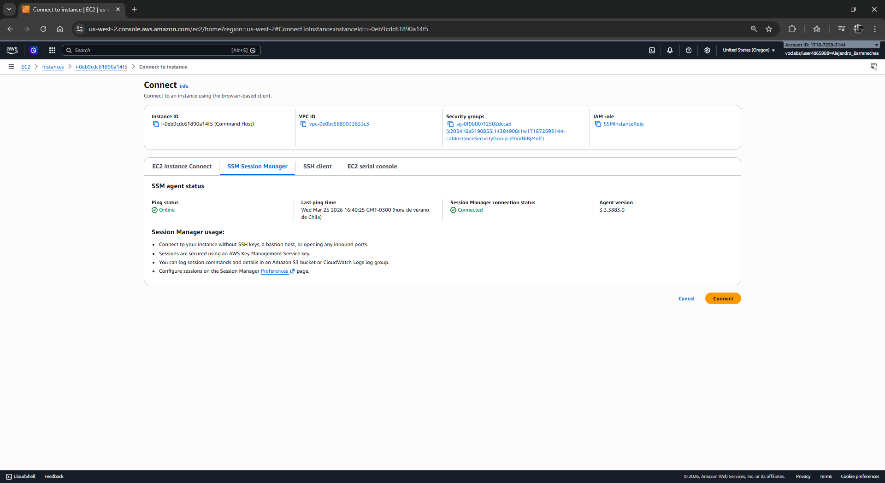
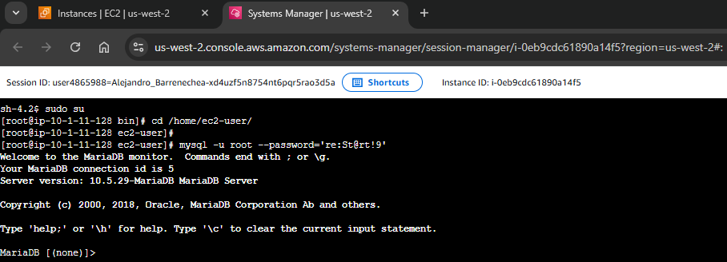
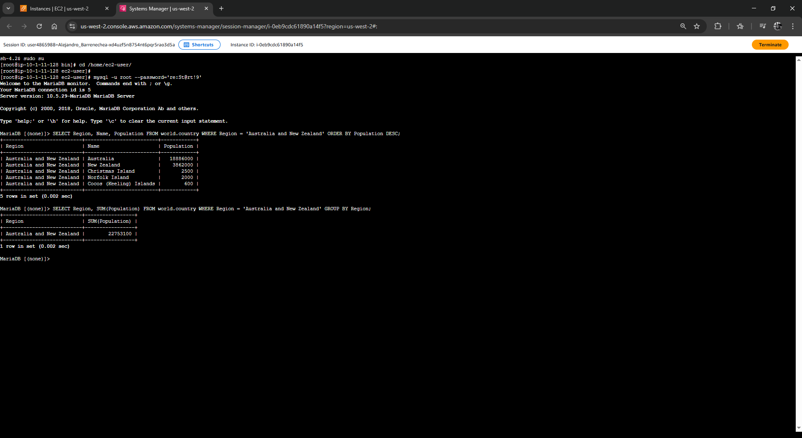
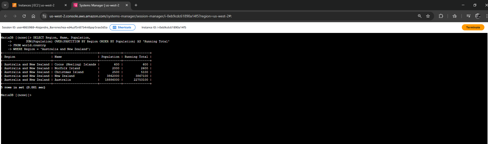
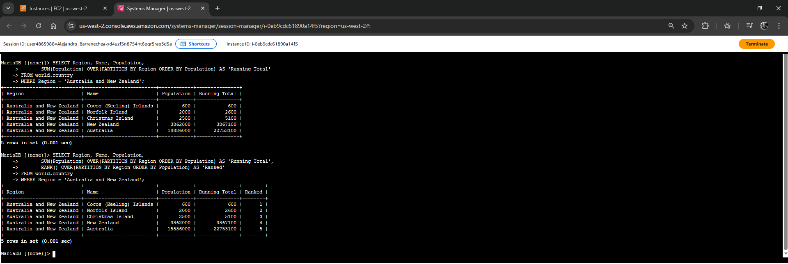
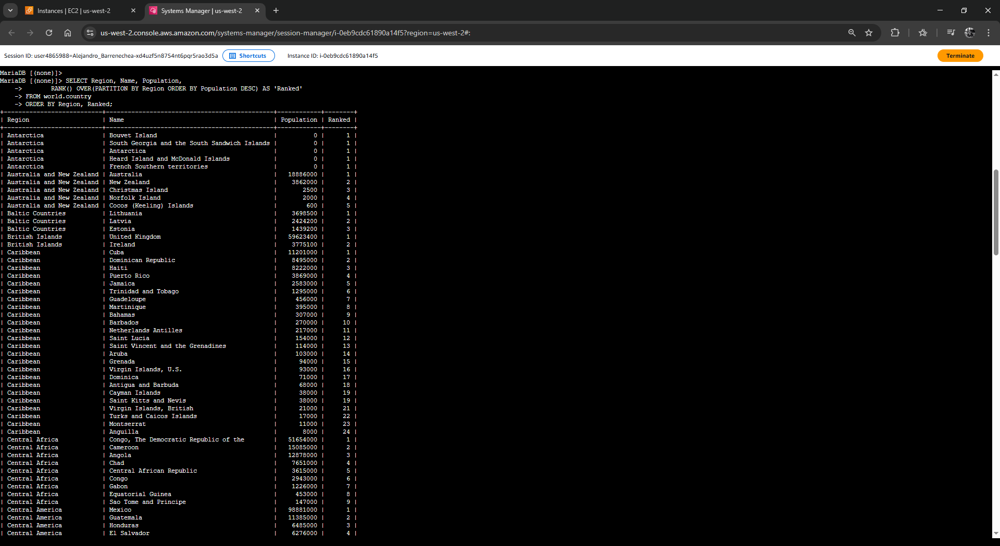
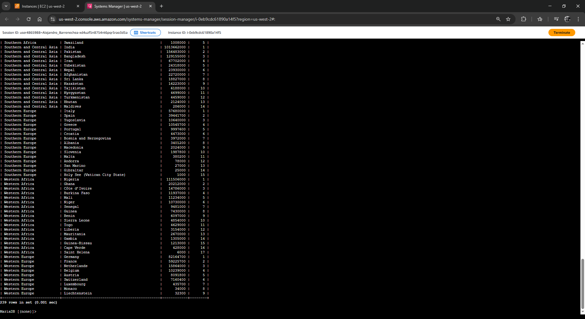

# Laboratorio: Organización y Agrupación de Datos (SQL Analytical Queries)

| Atributo | Detalle |
| :--- | :--- |
| **Dificultad** | Intermedio |
| **Tiempo Estimado** | 45 minutos |
| **Servicios Principales** | Amazon EC2 (Command Host), MySQL Engine, Window Functions |

---

## Resumen y Objetivos
Este laboratorio profundiza en las capacidades analíticas de SQL para organizar grandes volúmenes de datos. Aprenderás a diferenciar entre la agrupación tradicional, que colapsa registros, y las **Window Functions** (Funciones de Ventana), que permiten realizar cálculos complejos manteniendo la integridad de las filas individuales.

Al finalizar este laboratorio, serás capaz de:
1. Implementar la cláusula `GROUP BY` junto con funciones de agregación para resumir datos.
2. Utilizar la cláusula `OVER` y la partición de datos para realizar cálculos de contexto.
3. Aplicar la función `RANK()` para clasificar registros dentro de grupos específicos.
4. Generar totales acumulados (*Running Totals*) mediante funciones de ventana.

---

## Análisis del Escenario
El equipo de operaciones de base de datos requiere reportes de inteligencia de negocios sobre la tabla `country`. El diagnóstico inicial indica que las consultas simples ya no bastan; ahora se necesita saber cómo se posiciona un país respecto a sus vecinos de región (ranking) y cómo contribuye cada país al total poblacional regional. Como ingeniero, utilizarás técnicas de particionamiento para generar estos informes de alto valor sin necesidad de procesar los datos externamente.

---

## Arquitectura
El flujo de trabajo analítico se ejecuta en la siguiente infraestructura:
*   **Command Host (EC2):** Instancia de administración.
*   **Dataset `world`:** Contenedor de la lógica de negocio y datos geográficos.
*   **Motor de Consulta:** Utilización de MariaDB/MySQL con soporte para funciones de ventana (versiones modernas).

<p align="center">
  
</p>
<p align="center">
  
</p>
---

## Desarrollo de las Tareas Paso a Paso

### Tarea 1: Conexión al Command Host
Establece la conexión de terminal con la instancia EC2.

1. Navega a la consola de **Amazon EC2**.
2. En el panel izquierdo, haz clic en **Instances**.
3. Selecciona la instancia **Command Host**, pulsa en **Connect** y elige la pestaña **Session Manager**.

<p align="center">
  
</p>
<p align="center">
  
</p>
---
---

4. Haz clic en el botón naranja **Connect**.
5. Configura el entorno de ejecución:
   ```bash
   sudo su
   cd /home/ec2-user/
   ```
6. Accede al motor de base de datos:
   ```bash
   mysql -u root --password='re:St@rt!9'
   ```
7. TIP: En cualquier momento del laboratorio, si la ventana del Administrador de sesiones no responde o si necesitas volver a conectarte a la instancia de la base de datos, sigue estos pasos:
    * Cierra la ventana del Administrador de sesiones e intenta volver a conectarte siguiendo los pasos anteriores.
    * Ejecuta los siguientes comandos en el terminal.
     ```bash
    sudo su
    cd /home/ec2-user/
    mysql -u root --password='re:St@rt!9'
     ```

<p align="center">
  
</p>
---

### Tarea 2: Consulta y Organización de la Base de Datos `world`
Ejecutarás consultas que demuestran la evolución desde la agregación simple hasta el análisis de ventana.

#### Agrupación Tradicional (Colapsar Registros)
1. Ejecuta una consulta básica para visualizar países de una región específica:
   ```sql
   SELECT Region, Name, Population FROM world.country WHERE Region = 'Australia and New Zealand' ORDER BY Population DESC;
   ```
2. Resume la población total de dicha región utilizando `GROUP BY`. Observa cómo los registros individuales desaparecen para formar un único resumen:
   ```sql
   SELECT Region, SUM(Population) FROM world.country WHERE Region = 'Australia and New Zealand' GROUP BY Region;
   ```

<p align="center">
  
</p>

#### Funciones de Ventana (Mantener Registros + Cálculos)
3. Genera un **Total Acumulado (Running Total)**. Esta consulta muestra cada país y va sumando su población a la del país anterior dentro de la misma región:
   ```sql
   SELECT Region, Name, Population, 
          SUM(Population) OVER(PARTITION BY Region ORDER BY Population) AS 'Running Total' 
   FROM world.country 
   WHERE Region = 'Australia and New Zealand';
   ```

<p align="center">
  
</p>


#### Clasificación y Ranking
4. Clasifica los países según su población dentro de su región. La función `RANK()` asignará el número 1 al país con menor población (debido al `ORDER BY` por defecto) y aumentará progresivamente:
   ```sql
   SELECT Region, Name, Population, 
          SUM(Population) OVER(PARTITION BY Region ORDER BY Population) AS 'Running Total', 
          RANK() OVER(PARTITION BY Region ORDER BY Population) AS 'Ranked' 
   FROM world.country 
   WHERE Region = 'Australia and New Zealand';
   ```

<p align="center">
  
</p>
---

### Challenge (Desafío Técnico)
**Instrucción:** Escribe una consulta para clasificar (rank) los países de **cada región** según su población, de mayor a menor (Largest to Smallest).

**Análisis de la Solución:** 
Para lograr este objetivo, debes usar la cláusula `OVER` con `PARTITION BY Region` para agrupar lógicamente, y `ORDER BY Population DESC` dentro de la ventana para que el ranking 1 sea el país más poblado.

**Solución Sugerida:**
```sql
SELECT Region, Name, Population, 
       RANK() OVER(PARTITION BY Region ORDER BY Population DESC) AS 'Ranked' 
FROM world.country 
ORDER BY Region, Ranked;
```
<p align="center">
  
</p>
<p align="center">
  
</p>
---

## Respuestas Analíticas y Diagnóstico Técnico

*   **¿Cuál es la diferencia fundamental entre `GROUP BY` y `OVER`?**
    `GROUP BY` reduce el número de filas devueltas; si agrupas por región, obtendrás una sola fila por región. `OVER`, por el contrario, no reduce el número de filas; permite que cada registro mantenga su identidad mientras accede a datos agregados de su grupo (ventana).

*   **¿Para qué sirve el `PARTITION BY` dentro de una función de ventana?**
    Actúa como un "subgrupo" dinámico. Indica al motor que el cálculo (como el `SUM` o el `RANK`) debe reiniciarse cada vez que cambie el valor de la columna particionada (en este caso, cada vez que pasamos a una nueva región).

*   **Impacto de `ORDER BY` dentro de `OVER`:**
    Cuando se usa con `SUM()`, el `ORDER BY` instruye al motor para realizar una suma acumulativa fila por fila. Si se omite, el motor simplemente devolvería el total general de la región en cada fila.

**¡Felicidades!** Has dominado el uso de funciones analíticas avanzadas para organizar y clasificar datos de alto nivel en AWS.