# 🚀 Laboratorio: Introducción a Amazon Aurora (Interfaz Actualizada)

| Atributo | Detalle |
| :--- | :--- |
| **Dificultad** | Intermedio |
| **Tiempo Estimado** | 40 minutos |
| **Servicios Principales** | Amazon Aurora (MySQL Compatible), Amazon EC2, Amazon RDS |

---

## 📋 Resumen y Objetivos
Este laboratorio técnico se enfoca en el despliegue de **Amazon Aurora**, un motor de base de datos relacional nativo de la nube que ofrece alto rendimiento y disponibilidad. El objetivo es que domines el aprovisionamiento de clústeres Aurora y la gestión de conectividad segura desde capas de cómputo (EC2).

Al finalizar, habrás logrado:
*   Aprovisionar un clúster de Amazon Aurora mediante el flujo moderno de la consola.
*   Gestionar el acceso de red mediante Security Groups y Subnet Groups.
*   Establecer comunicación segura mediante el protocolo MySQL/MariaDB.
*   Validar la persistencia de datos y ejecución de consultas DDL/DML.

---

## 🔍 Análisis del Escenario
El cliente solicita una infraestructura de base de datos que soporte cargas de trabajo críticas con una latencia mínima. Se ha diagnosticado que Amazon Aurora es la solución ideal debido a su arquitectura de almacenamiento distribuido. La seguridad es una prioridad, por lo que el despliegue debe realizarse en subredes privadas dentro de una **VPC (LabVPC)**, permitiendo el acceso únicamente a través de un **Host de Comandos** autorizado, cumpliendo con el principio de defensa en profundidad.

---

## 🏗️ Arquitectura de la Solución
1.  **Capa de Datos:** Clúster de Amazon Aurora (1 instancia primaria) en subredes privadas.
2.  **Capa de Gestión:** Instancia EC2 (Command Host) con el cliente MariaDB instalado.
3.  **Red:** LabVPC con aislamiento de tráfico mediante Security Groups (puerto 3306).

---

## 🛠️ Desarrollo

### Tarea 1: Creación del Clúster de Amazon Aurora
Sigue estos pasos adaptados al nuevo flujo de creación de base de datos de AWS:

1.  Navega al servicio **RDS** desde la consola de administración.
2.  En el panel de navegación izquierdo, selecciona **Databases** y haz clic en el botón naranja **Create database**.

<p align="center">
  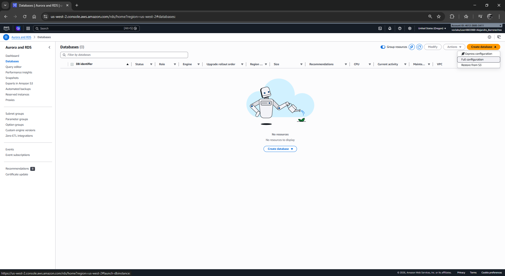
</p>

3.  En **Choose a database creation method**, asegúrate de seleccionar **Standard create**.
4.  En **Engine options**:
    *   **Engine type:** Selecciona **Amazon Aurora**.
    *   **Edition:** Elige **Amazon Aurora MySQL-Compatible Edition**.
    *   **Engine version:** Deja la versión por defecto (recomendada para Aurora MySQL 3 o superior).
5.  En **Templates**, selecciona **Dev/Test**.
6.  En la sección **Settings**:
    *   **DB cluster identifier:** Escribe `aurora`.
    *   **Master username:** Escribe `admin`.
    *   **Credentials management:** Selecciona **Self managed** y escribe `admin123` en el campo **Master password** y confírmalo.
7.  En **Instance configuration**:
    *   **DB instance class:** Selecciona **Burstable classes (includes t classes)** y elige `db.t3.medium`.
8.  En **Availability & durability**: Selecciona **Don't create an Aurora Replica**.
9.  En **Connectivity** (Sección crítica para el acceso):
    *   **Compute resource:** Selecciona **Don't connect to an EC2 compute resource** (la conectividad se gestionará manualmente).
    *   **Virtual private cloud (VPC):** Selecciona **LabVPC**.
    *   **DB subnet group:** Elige **dbsubnetgroup**.
    *   **Public access:** Selecciona **No**.
    *   **VPC security group:** Selecciona **Choose existing**. **Importante:** Haz clic en la "X" del grupo `default` y selecciona **DBSecurityGroup**.
10. Desliza hasta el final y expande **Additional configuration**:
    *   **Initial database name:** Escribe `world`.
    *   **Backup:** Desmarca **Enable automated backups**.
    *   **Encryption:** Desmarca **Enable encryption** (para fines didácticos del laboratorio).
    *   **Monitoring:** Desmarca **Enable Enhanced monitoring**.
    *   **Maintenance:** Desmarca **Enable auto minor version upgrade**.
11. Haz clic en **Create database**. El estado pasará de `Creating` a `Available` en unos minutos.

<p align="center">
  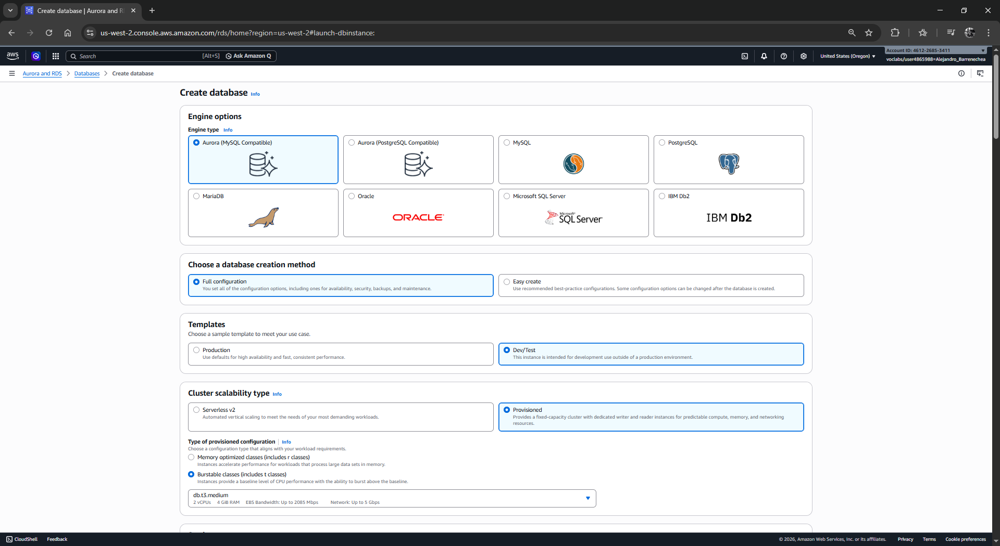
</p>
<p align="center">
  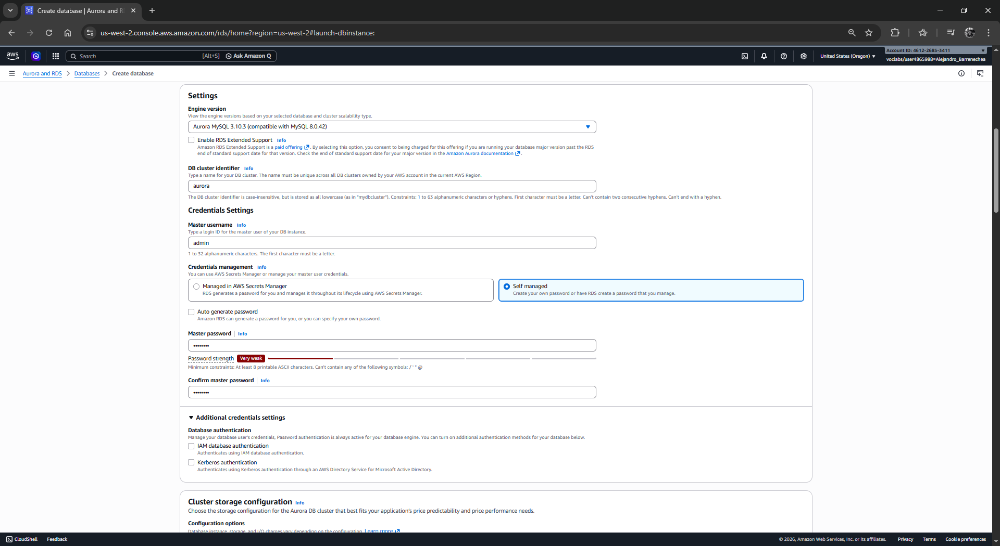
</p>
<p align="center">
  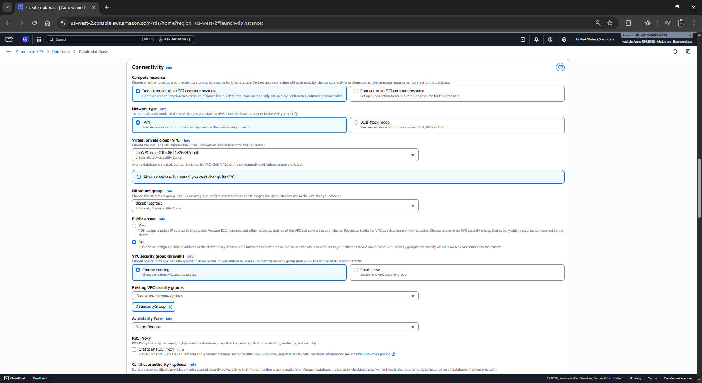
</p>
<p align="center">
  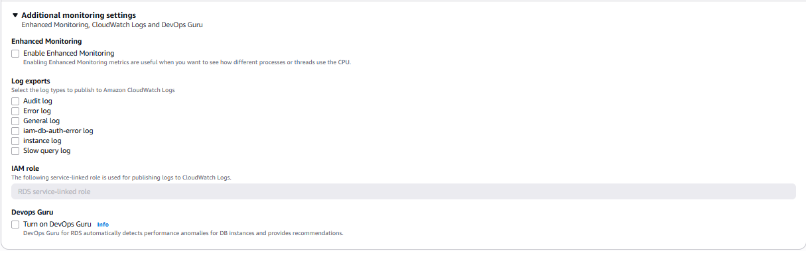
</p>
<p align="center">
  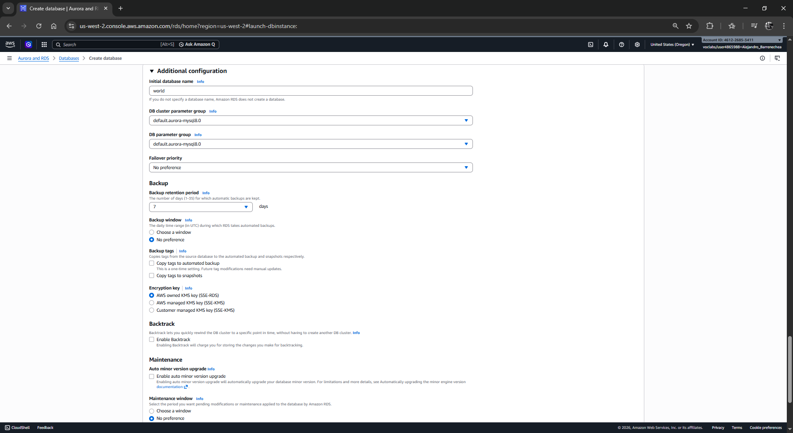
</p>
<p align="center">
  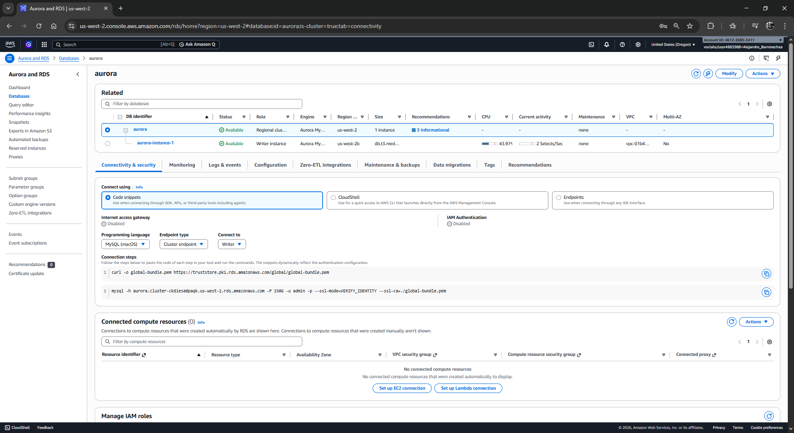
</p>
---

### Tarea 2: Conexión al Command Host
Establece la conexión al host administrativo para interactuar con la base de datos:

1.  Navega al servicio **EC2** y selecciona **Instances**.
2.  Marca la casilla del **Command Host**, haz clic en **Connect** y selecciona la pestaña **Session Manager**.
3.  Haz clic en el botón naranja **Connect**.

<p align="center">
  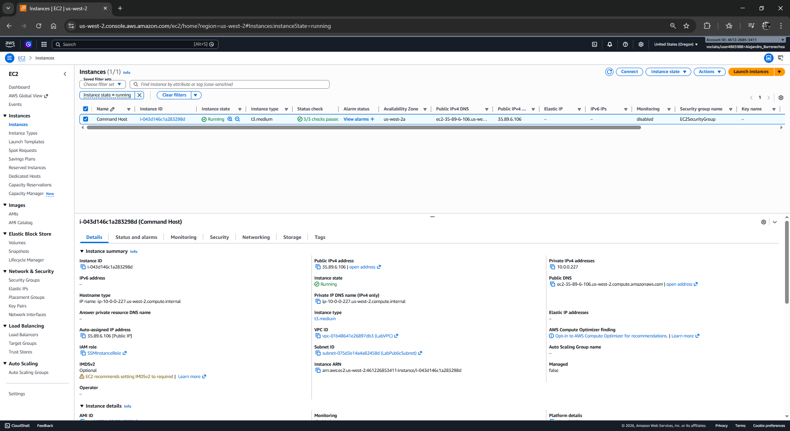
</p>
<p align="center">
  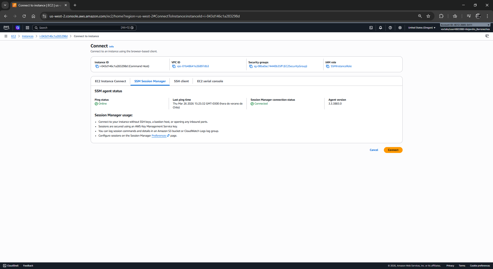
</p>
---

### Tarea 3: Configuración del Cliente e Interacción con Aurora
Configura el cliente y obtén el punto de enlace de la base de datos:

1.  En la terminal del Command Host, instala el cliente SQL:
    ```bash
    sudo yum install mariadb -y
    ```

<p align="center">
  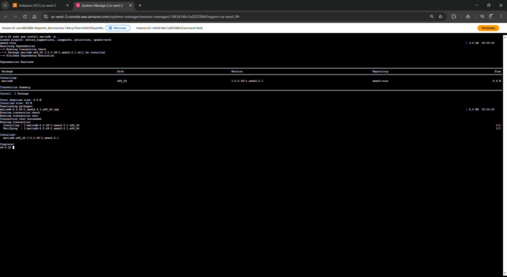
</p>

2.  Regresa a la consola de RDS, haz clic en el nombre de tu base de datos `aurora`.
3.  En la pestaña **Connectivity & security**, copia el **Endpoint** bajo la sección **Endpoint & port** (el tipo debe ser *Writer instance*).

<p align="center">
  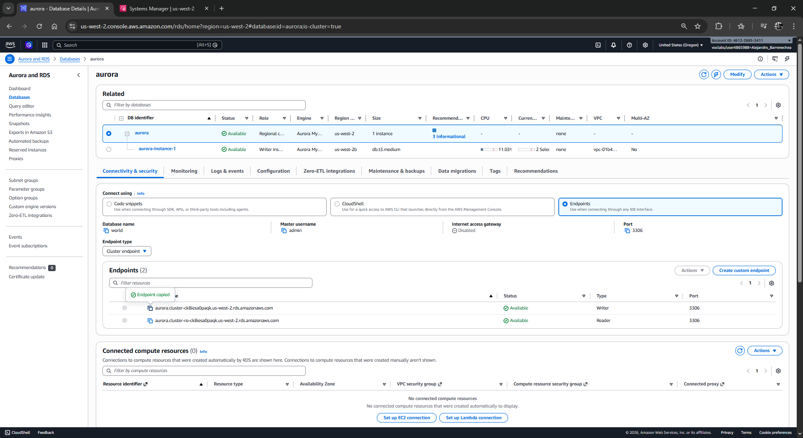
</p>

4.  Conéctate a Aurora usando el siguiente comando (reemplaza el endpoint):
    ```bash
    mysql -u admin --password='admin123' -h <TU_ENDPOINT_COPIADO>
    ```
<p align="center">
  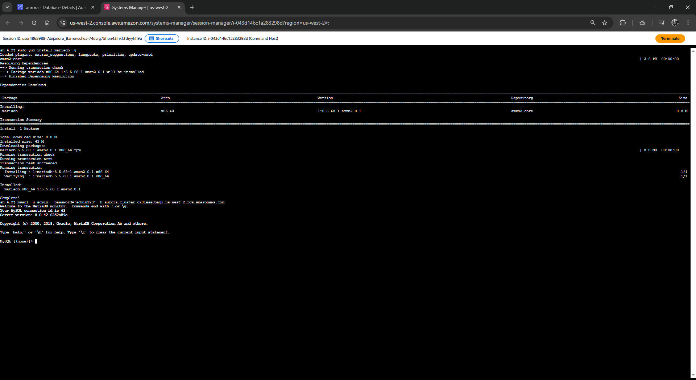
</p>
---

### Tarea 4: Gestión de Tablas y Consultas DDL/DML
Ejecuta la lógica de base de datos una vez conectado:

1.  Accede a la base de datos inicial:
    ```sql
    USE world;
    ```
2.  Crea la tabla de países:
    ```sql
    CREATE TABLE country (
      Code CHAR(3) PRIMARY KEY,
      Name CHAR(52) NOT NULL,
      Continent ENUM('Asia','Europe','North America','Africa','Oceania','Antarctica','South America') DEFAULT 'Asia',
      Population INT(11) DEFAULT 0,
      GNP FLOAT(10,2) DEFAULT 0.00
    );
    ```
3.  Inserta registros para validación:
    ```sql
    INSERT INTO country (Code, Name, Continent, Population, GNP) 
    VALUES ('IRL','Ireland','Europe',3775100,75921.00),
           ('AUS','Australia','Oceania',18886000,351182.00);
    ```
4.  Ejecuta una consulta de filtrado:
    ```sql
    SELECT Name, Population FROM country WHERE GNP > 50000;
    ```

<p align="center">
  
</p>
<p align="center">
  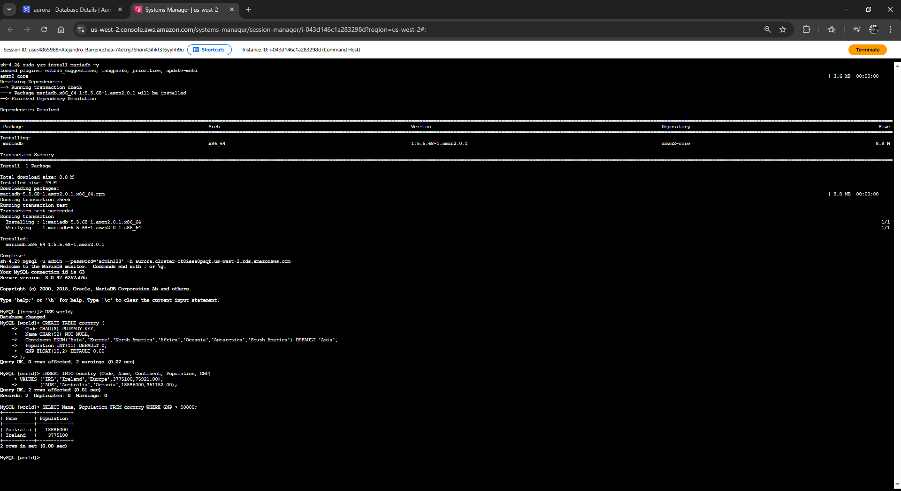
</p>
---

## 💡 Respuestas Analíticas y Diagnóstico Técnico

*   **¿Cuál es la diferencia entre el "Cluster Endpoint" y el "Reader Endpoint" en la nueva interfaz?**
    La consola moderna diferencia claramente estos puntos de enlace. El **Cluster Endpoint** (Writer) siempre dirigirá las conexiones a la instancia maestra para operaciones de escritura. El **Reader Endpoint** realiza un balanceo de carga automático entre todas las réplicas de lectura disponibles, optimizando el rendimiento de las consultas `SELECT` sin afectar al nodo principal.

*   **¿Por qué el cliente MariaDB es la opción preferida para Aurora MySQL?**
    Debido a que MariaDB es un *fork* compatible de MySQL, sus herramientas de CLI ofrecen una paridad total con Aurora MySQL. Es una opción ligera que no requiere licencias adicionales y está optimizada para repositorios de Amazon Linux 2/2023.

*   **¿Qué impacto tiene el "Public access: No" en la seguridad del clúster?**
    Al deshabilitar el acceso público, AWS garantiza que la base de datos no tenga una interfaz de red accesible desde internet. Esto mitiga ataques de fuerza bruta externos y asegura que el tráfico sea exclusivamente interno a través de la red de AWS, validado por las reglas de entrada del Security Group.

---
**¡Felicidades!** Has completado el laboratorio de Amazon Aurora utilizando la interfaz de consola más reciente y siguiendo estándares de arquitectura segura.