# Laboratorio 275: Introducción a Amazon DynamoDB

| Atributo | Detalle |
| :--- | :--- |
| **Dificultad** | Introductorio |
| **Tiempo Estimado** | 35 minutos |
| **Servicios Principales** | Amazon DynamoDB (NoSQL) |

---

## 📋 Resumen y Objetivos
Este laboratorio técnico introduce el uso de **Amazon DynamoDB**, un servicio de base de datos NoSQL de clave-valor y documentos, totalmente administrado y diseñado para ofrecer un rendimiento de milisegundos de un solo dígito a cualquier escala. A diferencia de las bases de datos relacionales tradicionales, DynamoDB permite esquemas flexibles, eliminando la necesidad de definir todas las columnas de antemano.

Al finalizar este laboratorio, habrás logrado:
*   Crear una tabla NoSQL con claves primarias compuestas.
*   Insertar y gestionar ítems con atributos heterogéneos (esquema flexible).
*   Diferenciar y ejecutar operaciones de **Query** (Consulta) y **Scan** (Exploración).
*   Modificar datos existentes y realizar la limpieza de recursos.

---

## 🔍 Análisis del Escenario
El equipo de desarrollo requiere un almacén de datos para una biblioteca musical. El diagnóstico técnico indica que los metadatos de las canciones varían significativamente (algunas tienen género, otras duración en segundos, otras solo el año). Una base de datos relacional (RDS) impondría una estructura rígida con demasiados campos nulos. Por lo tanto, se ha seleccionado **Amazon DynamoDB** por su naturaleza *schema-less*, permitiendo que cada registro (ítem) contenga solo los atributos necesarios, garantizando escalabilidad automática y baja latencia para los usuarios finales.

---

## 🏗️ Arquitectura de DynamoDB
La arquitectura en este laboratorio es puramente **Serverless**:
1.  **Tabla (Music):** El recurso principal.
2.  **Ítems:** Registros individuales dentro de la tabla (similares a filas).
3.  **Atributos:** Elementos de datos fundamentales (similares a columnas, pero dinámicas).
4.  **Partition Key (Artist):** Determina la distribución física de los datos.
5.  **Sort Key (Song):** Permite organizar y buscar ítems de un mismo artista de forma eficiente.

---

## 🛠️ Desarrollo

### Tarea 1: Creación de la Tabla NoSQL
1.  Navega al servicio **DynamoDB** desde el menú de servicios de la consola de AWS.
2.  Haz clic en el botón **Create table**.

  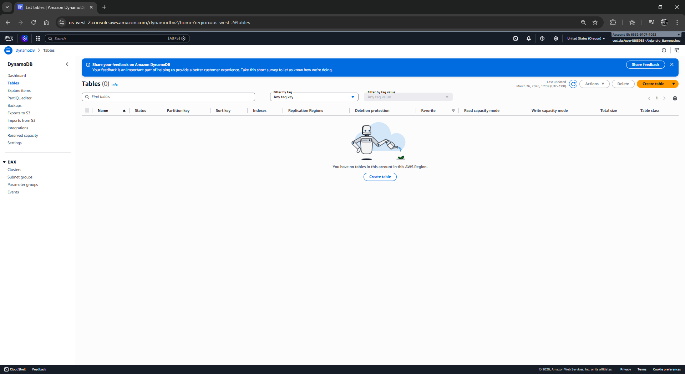

3.  Configura los parámetros base:
    *   **Table name:** Escribe `Music`.
    *   **Partition key:** Escribe `Artist` y asegúrate de que el tipo sea **String**.
    *   **Sort key - optional:** Escribe `Song` y selecciona **String**.
4.  En **Table settings**, mantén seleccionada la opción **Default settings**.
5.  Desliza hasta el final y haz clic en **Create table**.

  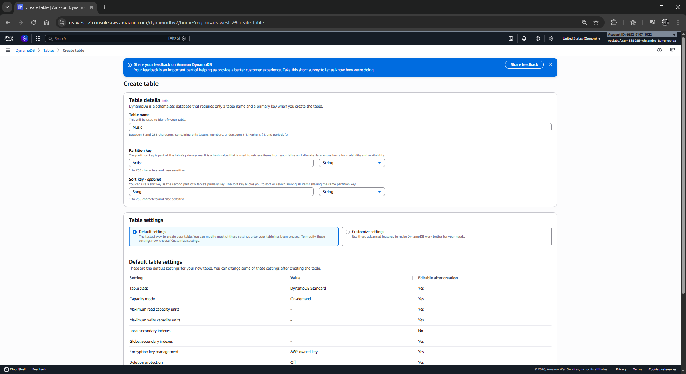

6.  **Espera** a que el estado de la tabla cambie de `Creating` a **Active**.

  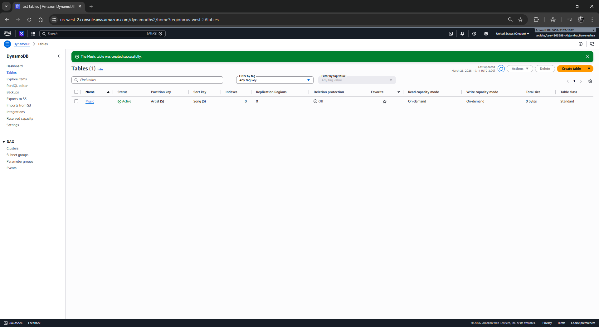

---

### Tarea 2: Inserción de Datos (Esquema Flexible)
En DynamoDB, un ítem solo requiere sus claves primarias; el resto de los atributos pueden variar entre registros.

1.  En la lista de tablas, haz clic en el nombre de la tabla **Music**.
2.  Haz clic en el botón naranja **Explore table items** (Explorar elementos de tabla).

  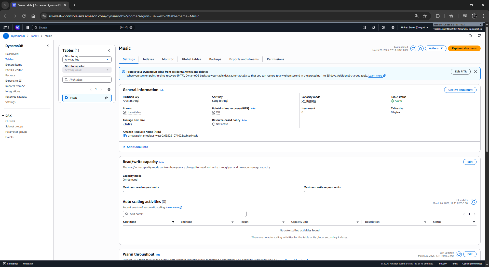

3.  Haz clic en **Create item**.

  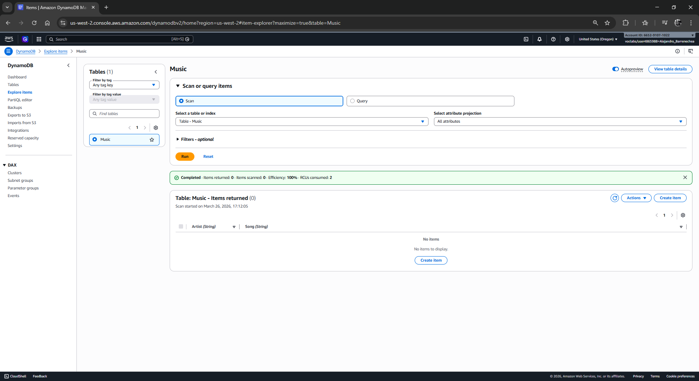

4.  Ingresa los valores obligatorios:
    *   **Artist:** `Pink Floyd`
    *   **Song:** `Money`
5.  Añade atributos adicionales dinámicos:
    *   Haz clic en **Add new attribute** y selecciona **String**. En *Attribute name* escribe `Album` y en *Value* `The Dark Side of the Moon`.
    *   Haz clic en **Add new attribute** y selecciona **Number**. En *Attribute name* escribe `Year` y en *Value* `1973`.
6.  Haz clic en **Create item**.

  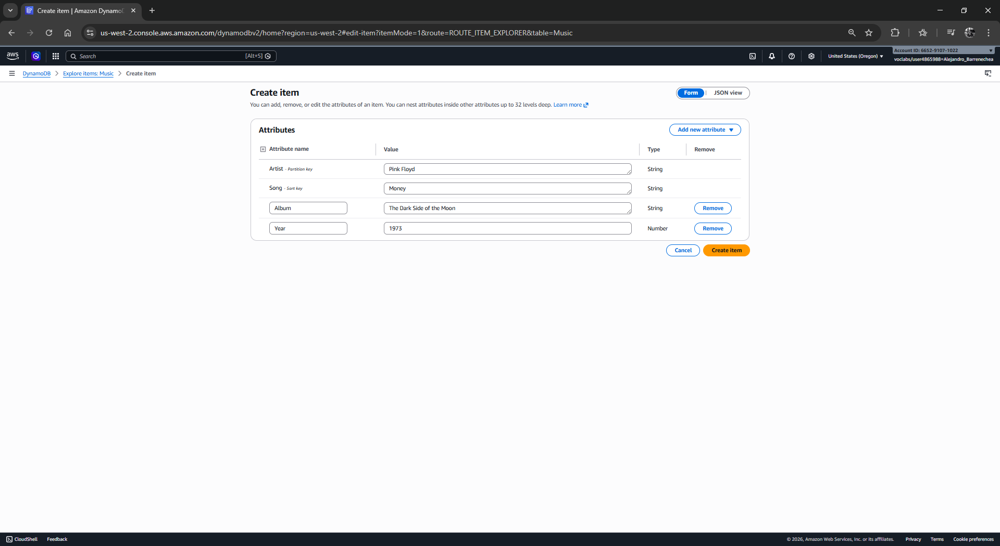

7.  **Repite** este proceso para crear dos ítems adicionales con los siguientes datos (observa cómo los atributos cambian):
    *   **Ítem 2:** Artist: `John Lennon` | Song: `Imagine` | Album (String): `Imagine` | Year (Number): `1971` | Genre (String): `Soft rock`.
    *   **Ítem 3:** Artist: `Psy` | Song: `Gangnam Style` | Album (String): `Psy 6 (Six Rules), Part 1` | Year (Number): `2011` | LengthSeconds (Number): `219`.

  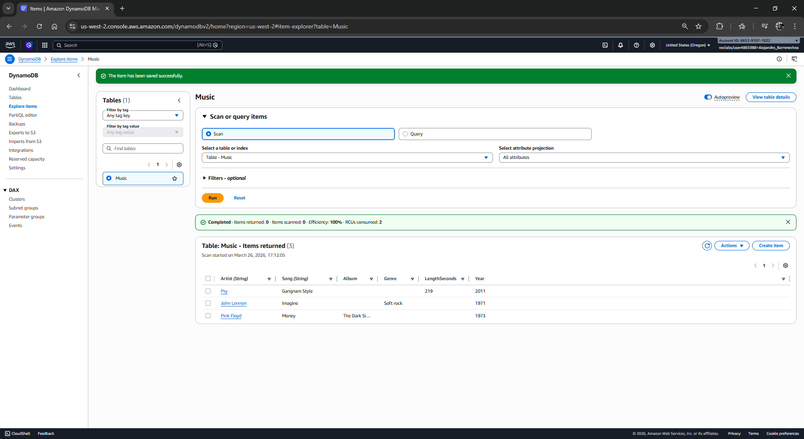

---

### Tarea 3: Modificación de Ítems
1.  En la vista **Explore items**, asegúrate de que la tabla `Music` esté seleccionada.
2.  Haz clic sobre el ítem cuyo artista es **Psy**.

  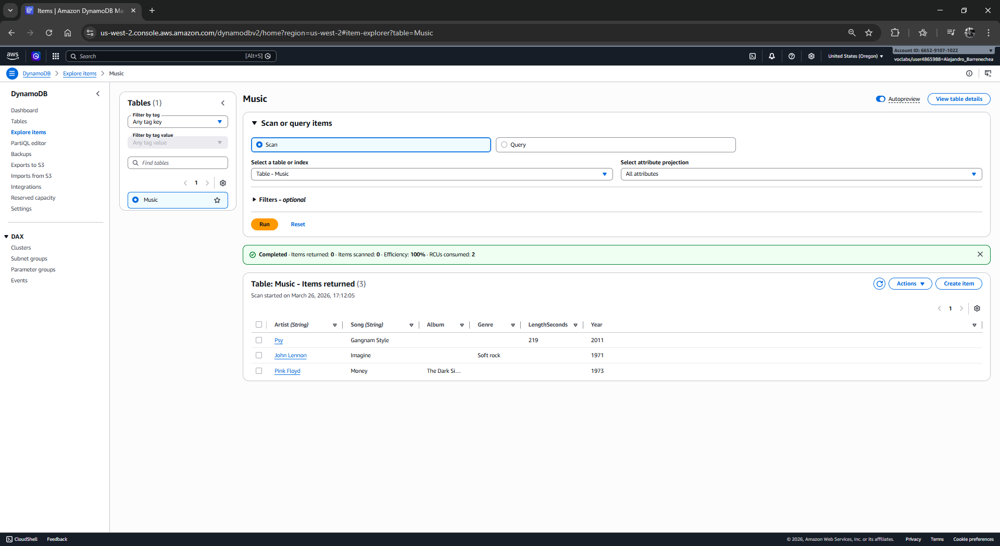

3.  Modifica el atributo **Year** cambiando el valor de `2011` a `2012`.
4.  Haz clic en **Save changes**.

  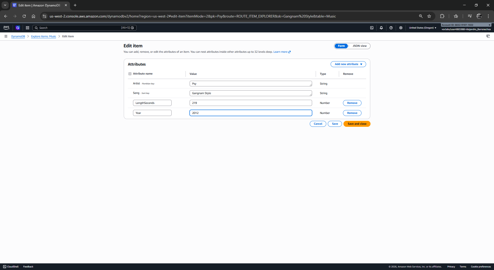

---

### Tarea 4: Consulta y Exploración (Query vs. Scan)
Es fundamental entender la diferencia técnica entre estas dos operaciones.

#### Operación de Query (Eficiente)
La operación **Query** utiliza la clave primaria para ir directamente a la ubicación física de los datos.
1.  En la sección **Explore items**, expande **Scan/Query items**.
2.  Cambia el selector de *Scan* a **Query**.
3.  Ingresa los criterios de búsqueda:
    *   **Artist (Partition key):** `Psy`
    *   **Song (Sort key):** `Gangnam Style`
4.  Haz clic en **Run**. Observa la velocidad de respuesta instantánea.

  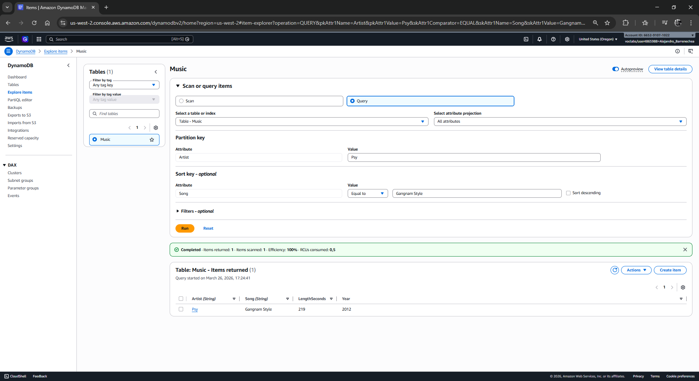

#### Operación de Scan (Intensiva)
La operación **Scan** lee todos los ítems de la tabla y luego aplica un filtro.
1.  Cambia el selector de nuevo a **Scan**.
2.  Expande la sección **Filters**.
3.  Configura el filtro:
    *   **Attribute name:** `Year`
    *   **Type:** `Number`
    *   **Value:** `1971`
4.  Haz clic en **Run**. DynamoDB leerá toda la tabla para encontrar los registros que coincidan.

  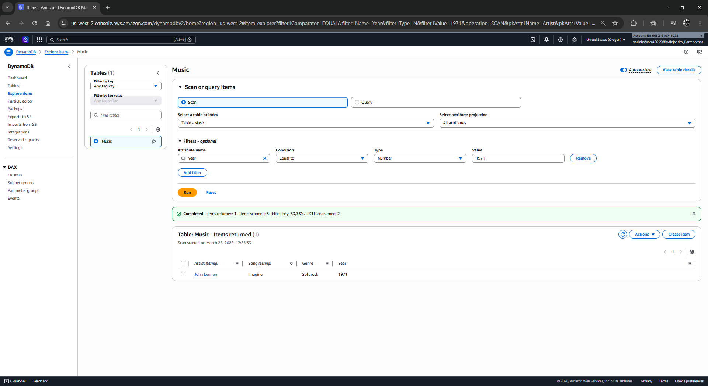

---

### Tarea 5: Eliminación de la Tabla
1.  Regresa al panel de **Tables**.
2.  Selecciona la casilla de la tabla **Music**.
3.  Haz clic en el botón **Delete**.
4.  Escribe la palabra `delete` (o la palabra de confirmación que solicite la consola actual) y confirma la eliminación.

  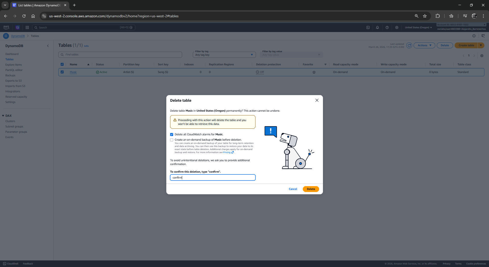

  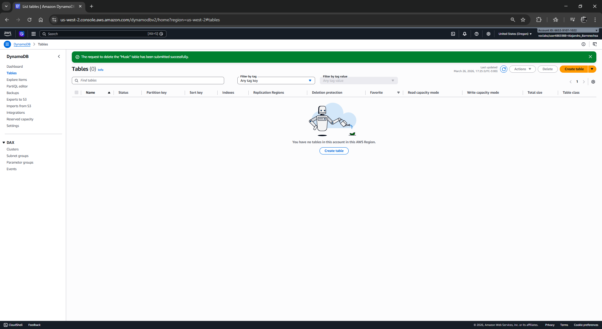

---

## 💡 Respuestas Analíticas y Diagnóstico Técnico

*   **¿Cuál es la diferencia de costo y rendimiento entre Query y Scan?**
    Una **Query** es predecible y eficiente porque utiliza los índices de la clave primaria; su consumo de RCU (Read Capacity Units) es bajo. Un **Scan** consume RCU por cada ítem leído en la tabla, sin importar si cumple con el filtro o no. En tablas grandes, el *Scan* puede ser extremadamente lento y costoso.

*   **¿Por qué DynamoDB se considera una base de datos "Schema-less"?**
    Aunque la tabla requiere una Clave de Partición definida, los demás atributos no necesitan ser declarados al crear la tabla. Como observamos en la Tarea 2, una canción puede tener el atributo `Genre` y otra no, sin afectar la integridad del sistema ni requerir sentencias `ALTER TABLE`.

*   **¿Para qué sirve la Sort Key (Clave de Ordenación)?**
    Permite realizar búsquedas más complejas dentro de una misma partición. Por ejemplo, podrías buscar todas las canciones de un artista cuyo nombre empiece por "A" o que hayan sido lanzadas en un rango de fechas, siempre que estos datos formen parte de la clave compuesta.

**¡Felicidades!** Has completado exitosamente la introducción a bases de datos NoSQL con Amazon DynamoDB.