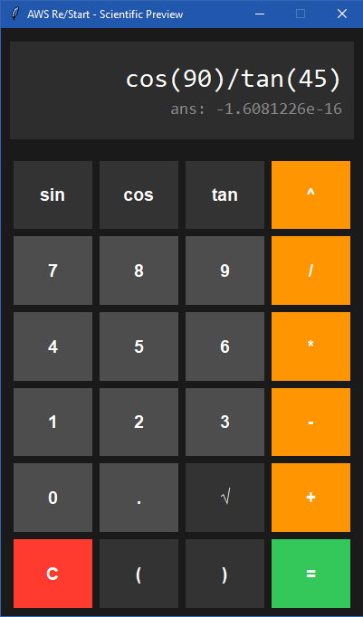
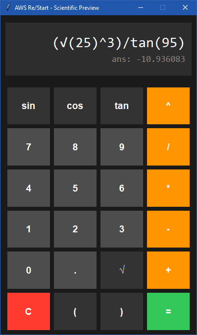

# Ejercicio 5: Calculadora "Casi Científica" con Interfaz Gráfica (GUI)

## Descripción
Este programa implementa una calculadora con entorno gráfico utilizando la librería estándar **Tkinter**. A diferencia de una calculadora básica, esta versión incluye funciones científicas (Seno, Coseno, Tangente, Raíz Cuadrada y Potencias) y una funcionalidad avanzada de **Preview en tiempo real**, que muestra el resultado sugerido automáticamente mientras el usuario construye la expresión matemática.

## Conceptos de Python utilizados
- **Tkinter**: Librería oficial de Python para la creación de interfaces gráficas (GUI). Uso de `StringVars` para la reactividad de la pantalla.
- **Módulo `math`**: Procesamiento de funciones trigonométricas y raíces.
- **Lógica de "Preview"**: Evaluación dinámica de la cadena de texto mediante `eval()` dentro de bloques de control de errores (`try-except`).
- **Manejo de Eventos**: Uso de funciones `lambda` para asignar comandos a los botones de forma dinámica.
- **Diseño con Grid**: Organización de widgets mediante una rejilla proporcional y responsiva.

## Código del Script (`ejercicio_05.py`)
```python
import tkinter as tk
from tkinter import messagebox
import math

class CalculadoraCientifica:
    def __init__(self, root):
        self.root = root
        self.root.title("AWS Re/Start - Scientific Preview")
        self.root.geometry("400x650")
        self.root.resizable(False, False)
        self.root.configure(bg="#1a1a1a")

        self.ecuacion = ""
        self.preview_valor = tk.StringVar()
        self.input_valor = tk.StringVar()

        self.crear_interfaz()

    def crear_interfaz(self):
        # Pantalla de visualización (Entrada y Preview)
        display_frame = tk.Frame(self.root, bg="#2d2d2d", pady=20, padx=10)
        display_frame.pack(fill="both", padx=10, pady=15)

        input_label = tk.Label(
            display_frame, textvariable=self.input_valor, font=("Consolas", 22),
            bg="#2d2d2d", fg="#ffffff", anchor="e"
        )
        input_label.pack(fill="x")

        preview_label = tk.Label(
            display_frame, textvariable=self.preview_valor, font=("Consolas", 14),
            bg="#2d2d2d", fg="#888888", anchor="e"
        )
        preview_label.pack(fill="x")

        # Contenedor de Botones
        botones_frame = tk.Frame(self.root, bg="#1a1a1a")
        botones_frame.pack(expand=True, fill="both", padx=10, pady=5)

        botones = [
            ('sin', 0, 0, "#333333"), ('cos', 0, 1, "#333333"), ('tan', 0, 2, "#333333"), ('^', 0, 3, "#ff9500"),
            ('7', 1, 0, "#4d4d4d"), ('8', 1, 1, "#4d4d4d"), ('9', 1, 2, "#4d4d4d"), ('/', 1, 3, "#ff9500"),
            ('4', 2, 0, "#4d4d4d"), ('5', 2, 1, "#4d4d4d"), ('6', 2, 2, "#4d4d4d"), ('*', 2, 3, "#ff9500"),
            ('1', 3, 0, "#4d4d4d"), ('2', 3, 1, "#4d4d4d"), ('3', 3, 2, "#4d4d4d"), ('-', 3, 3, "#ff9500"),
            ('0', 4, 0, "#4d4d4d"), ('.', 4, 1, "#4d4d4d"), ('√', 4, 2, "#333333"), ('+', 4, 3, "#ff9500"),
            ('C', 5, 0, "#ff3b30"), ('(', 5, 1, "#333333"), (')', 5, 2, "#333333"), ('=', 5, 3, "#34c759"),
        ]

        for (texto, fila, col, color) in botones:
            cmd = lambda x=texto: self.al_hacer_clic(x)
            btn = tk.Button(
                botones_frame, text=texto, font=("Arial", 14, "bold"),
                bg=color, fg="white", relief="flat", command=cmd,
                width=5, height=2
            )
            btn.grid(row=fila, column=col, padx=4, pady=4, sticky="nsew")

        for i in range(4): botones_frame.grid_columnconfigure(i, weight=1)
        for i in range(6): botones_frame.grid_rowconfigure(i, weight=1)

    def actualizar_preview(self):
        if not self.ecuacion:
            self.preview_valor.set("")
            return
        try:
            expr = self.ecuacion.replace('^', '**').replace('√', 'math.sqrt')
            if 'sin(' in expr: expr = expr.replace('sin(', 'math.sin(math.radians(') + ')' * expr.count('sin(')
            if 'cos(' in expr: expr = expr.replace('cos(', 'math.cos(math.radians(') + ')' * expr.count('cos(')
            if 'tan(' in expr: expr = expr.replace('tan(', 'math.tan(math.radians(') + ')' * expr.count('tan(')

            res = eval(expr)
            self.preview_valor.set(f"ans: {res:.8g}" if isinstance(res, float) else f"ans: {res}")
        except Exception:
            self.preview_valor.set("")

    def al_hacer_clic(self, boton):
        if boton == "=":
            if self.preview_valor.get():
                resultado = self.preview_valor.get().replace("ans: ", "")
                self.ecuacion = resultado
                self.input_valor.set(resultado)
                self.preview_valor.set("")
        elif boton == "C":
            self.ecuacion = ""; self.input_valor.set(""); self.preview_valor.set("")
        elif boton in ["sin", "cos", "tan", "√"]:
            self.ecuacion += f"{boton}("
            self.input_valor.set(self.ecuacion)
        else:
            self.ecuacion += str(boton)
            self.input_valor.set(self.ecuacion)
        
        if boton != "=":
            self.actualizar_preview()

if __name__ == "__main__":
    root = tk.Tk()
    CalculadoraCientifica(root)
    root.mainloop()
```

## Output Visual (Capturas de Pantalla)

<p align="center">
  
  
</p>