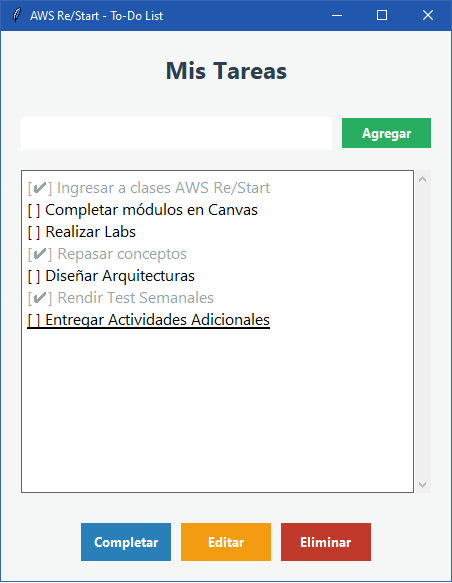

# Ejercicio 6: Lista de Tareas (To-Do List) con Interfaz Gráfica

## Descripción
Este programa consiste en una aplicación de gestión de tareas diarias. Permite al usuario organizar sus pendientes mediante una interfaz intuitiva que ofrece las funciones de: **Agregar**, **Editar**, **Eliminar** y **Marcar/Desmarcar** tareas como completadas. Es un excelente ejercicio para comprender el manejo de estados y la interacción dinámica con listas en Python.

## Conceptos de Python utilizados
- **Tkinter (Widgets Avanzados)**:
    - `Listbox`: Para mostrar y gestionar la colección de tareas.
    - `Scrollbar`: Para permitir la navegación cuando la lista excede el tamaño de la ventana.
    - `simpledialog`: Para abrir ventanas emergentes que solicitan datos (usado en la edición).
    - `messagebox`: Para confirmaciones de seguridad (borrado) y advertencias.
- **Event Binding**: Uso de `.bind("<Return>")` para permitir que el usuario agregue tareas simplemente presionando la tecla "Enter".
- **Lógica de Prefijos**: Implementación de una lógica de strings para alternar entre estados `[ ]` y `[✔]`.
- **Manejo de Índices**: Uso de `curselection()` para identificar qué elemento de la lista ha sido interactuado por el usuario.

## Código del Script (`ejercicio_06.py`)
```python
import tkinter as tk
from tkinter import messagebox, simpledialog

class TodoApp:
    def __init__(self, root):
        self.root = root
        self.root.title("AWS Re/Start - To-Do List")
        self.root.geometry("450x550")
        self.root.configure(bg="#f4f7f6")

        self.font_task = ("Segoe UI", 12)
        self.bg_color = "#f4f7f6"
        
        self.setup_ui()

    def setup_ui(self):
        # Título
        tk.Label(self.root, text="Mis Tareas", font=("Segoe UI", 18, "bold"),
                 bg=self.bg_color, fg="#2c3e50", pady=20).pack()

        # Marco de entrada
        input_frame = tk.Frame(self.root, bg=self.bg_color)
        input_frame.pack(pady=10, padx=20, fill="x")

        self.task_entry = tk.Entry(input_frame, font=self.font_task)
        self.task_entry.pack(side="left", fill="x", expand=True, padx=(0, 10))
        self.task_entry.bind("<Return>", lambda e: self.add_task())

        tk.Button(input_frame, text="Agregar", bg="#27ae60", fg="white",
                  command=self.add_task, padx=15).pack(side="right")

        # Lista de Tareas
        list_frame = tk.Frame(self.root, bg=self.bg_color)
        list_frame.pack(pady=10, padx=20, fill="both", expand=True)

        self.scrollbar = tk.Scrollbar(list_frame)
        self.scrollbar.pack(side="right", fill="y")

        self.tasks_listbox = tk.Listbox(list_frame, font=self.font_task, yscrollcommand=self.scrollbar.set)
        self.tasks_listbox.pack(side="left", fill="both", expand=True)
        self.scrollbar.config(command=self.tasks_listbox.yview)

        # Botones de Acción
        action_frame = tk.Frame(self.root, bg=self.bg_color)
        action_frame.pack(pady=20)

        btns = [("Completar", self.mark_task, "#2980b9"),
                ("Editar", self.edit_task, "#f39c12"),
                ("Eliminar", self.delete_task, "#c0392b")]

        for text, cmd, color in btns:
            tk.Button(action_frame, text=text, bg=color, fg="white",
                      command=cmd, width=10, pady=5).pack(side="left", padx=5)

    def add_task(self):
        task = self.task_entry.get().strip()
        if task:
            self.tasks_listbox.insert(tk.END, f"[ ] {task}")
            self.task_entry.delete(0, tk.END)

    def mark_task(self):
        try:
            idx = self.tasks_listbox.curselection()[0]
            task = self.tasks_listbox.get(idx)
            new_task = task.replace("[ ]", "[✔]", 1) if "[ ]" in task else task.replace("[✔]", "[ ]", 1)
            self.tasks_listbox.delete(idx)
            self.tasks_listbox.insert(idx, new_task)
        except: messagebox.showwarning("Aviso", "Selecciona una tarea.")

    def edit_task(self):
        try:
            idx = self.tasks_listbox.curselection()[0]
            old = self.tasks_listbox.get(idx)
            clean = old.replace("[ ] ", "").replace("[✔] ", "")
            new = simpledialog.askstring("Editar", "Modifica la tarea:", initialvalue=clean)
            if new:
                pref = "[ ]" if "[ ]" in old else "[✔]"
                self.tasks_listbox.delete(idx)
                self.tasks_listbox.insert(idx, f"{pref} {new}")
        except: pass

    def delete_task(self):
        try:
            idx = self.tasks_listbox.curselection()[0]
            if messagebox.askyesno("Confirmar", "¿Eliminar tarea?"):
                self.tasks_listbox.delete(idx)
        except: pass

if __name__ == "__main__":
    root = tk.Tk()
    TodoApp(root); root.mainloop()
```

## Output Visual (Captura de pantalla)

<p align="center">
  
</p>