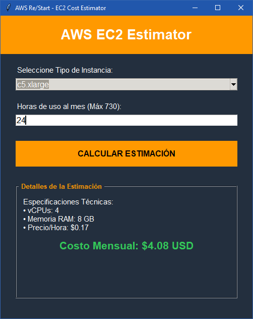

# Ejercicio 7: Estimador de Costos EC2 de AWS (Proyecto Final)

## Descripción
Este proyecto final consiste en una herramienta de escritorio orientada al rol de **Cloud Practitioner**. La aplicación permite seleccionar diferentes tipos de instancias de **Amazon EC2** (como t3.micro, m5.large, etc.) y calcular automáticamente el costo mensual estimado basado en las horas de uso. Además, muestra las especificaciones técnicas (vCPUs y RAM) de cada recurso seleccionado, utilizando la identidad visual oficial de AWS.

## Conceptos de Python utilizados
- **Interfaz Gráfica Avanzada (Tkinter + TTK)**:
    - `ttk.Combobox`: Implementación de menús desplegables para la selección de tipos de instancia.
    - `LabelFrame`: Agrupación visual de los resultados para una mejor experiencia de usuario.
- **Estructuras de Datos (Diccionarios)**: Uso de un diccionario centralizado para mapear tipos de instancias con sus precios por hora, vCPUs y memoria RAM.
- **Lógica de Facturación Cloud**: Cálculo de costos operativos mensuales basados en el estándar de 730 horas (24/7).
- **Validación de Entradas**: Control de errores para asegurar que el usuario ingrese un número de horas válido (entre 0 y 744 horas máximas al mes).
- **Branding Institucional**: Uso de paleta de colores hexadecimales de Amazon Web Services (`#232f3e` para el fondo y `#ff9900` para los acentos).

## Código del Script (`ejercicio_07.py`)
```python
import tkinter as tk
from tkinter import ttk, messagebox

class AWSEstimator:
    def __init__(self, root):
        self.root = root
        self.root.title("AWS Re/Start - EC2 Cost Estimator")
        self.root.geometry("500x600")
        self.root.configure(bg="#232f3e")

        # Base de datos simulada de instancias (Tipo: [Precio_Hora, vCPU, RAM_GB])
        self.instancias = {
            "t3.nano": [0.0052, 2, 0.5],
            "t3.micro": [0.0104, 2, 1],
            "t3.small": [0.0208, 2, 2],
            "t3.medium": [0.0416, 2, 4],
            "m5.large": [0.096, 2, 8],
            "m5.xlarge": [0.192, 4, 16],
            "c5.xlarge": [0.170, 4, 8],
            "p3.2xlarge": [3.06, 8, 61]
        }

        self.setup_ui()

    def setup_ui(self):
        style = ttk.Style()
        style.theme_use('clam')
        
        header = tk.Label(self.root, text="AWS EC2 Estimator", font=("Arial", 20, "bold"),
                          bg="#ff9900", fg="white", pady=20)
        header.pack(fill="x")

        main_frame = tk.Frame(self.root, bg="#232f3e", padx=30, pady=20)
        main_frame.pack(fill="both", expand=True)

        tk.Label(main_frame, text="Seleccione Tipo de Instancia:", bg="#232f3e", fg="white").pack(anchor="w")
        self.combo_instancia = ttk.Combobox(main_frame, values=list(self.instancias.keys()), state="readonly")
        self.combo_instancia.pack(fill="x", pady=(5, 20))
        self.combo_instancia.current(0)

        tk.Label(main_frame, text="Horas de uso al mes (Máx 744):", bg="#232f3e", fg="white").pack(anchor="w")
        self.horas_entry = tk.Entry(main_frame, font=("Arial", 12))
        self.horas_entry.insert(0, "730")
        self.horas_entry.pack(fill="x", pady=(5, 20))

        tk.Button(main_frame, text="CALCULAR ESTIMACIÓN", bg="#ff9900", fg="black",
                  font=("Arial", 12, "bold"), command=self.calcular).pack(fill="x", pady=10)

        self.res_frame = tk.LabelFrame(main_frame, text=" Detalles ", bg="#232f3e", fg="#ff9900", padx=10, pady=10)
        self.res_frame.pack(fill="both", expand=True, pady=20)

        self.lbl_specs = tk.Label(self.res_frame, text="vCPU: -\nRAM: -", bg="#232f3e", fg="white", justify="left")
        self.lbl_specs.pack(anchor="w")

        self.lbl_precio = tk.Label(self.res_frame, text="Costo Mensual: $0.00", bg="#232f3e", fg="#34c759", font=("Arial", 16, "bold"))
        self.lbl_precio.pack(pady=10)

    def calcular(self):
        try:
            tipo = self.combo_instancia.get()
            horas = float(self.horas_entry.get())
            if not (0 <= horas <= 744): raise ValueError

            datos = self.instancias[tipo]
            total = datos[0] * horas

            self.lbl_specs.config(text=f"Especificaciones:\n• vCPUs: {datos[1]}\n• RAM: {datos[2]} GB\n• $/Hora: ${datos[0]}")
            self.lbl_precio.config(text=f"Costo Mensual: ${total:.2f} USD")
        except ValueError:
            messagebox.showerror("Error", "Ingrese horas válidas (0-744).")

if __name__ == "__main__":
    root = tk.Tk()
    AWSEstimator(root); root.mainloop()
```

## Output Visual (Captura de pantalla)

<p align="center">
  
</p>