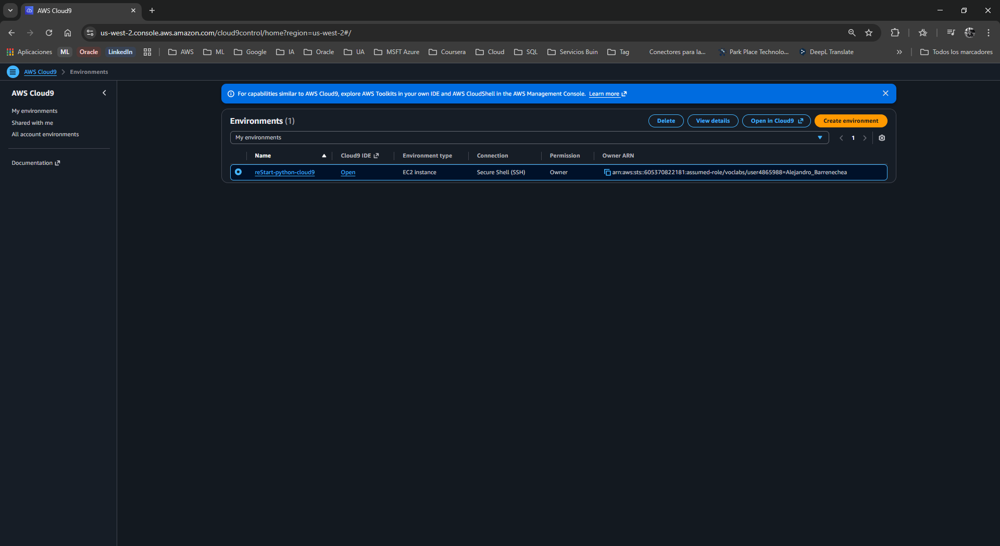
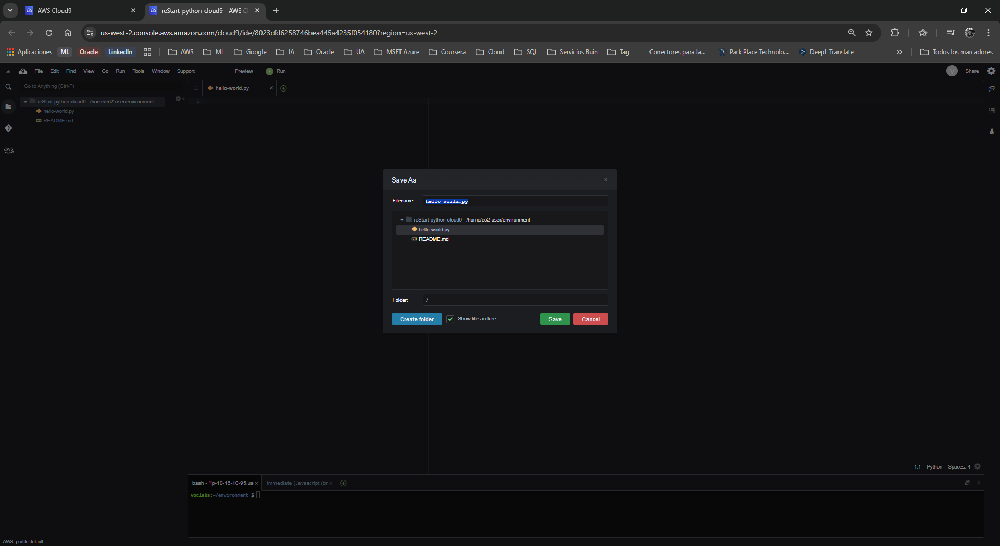
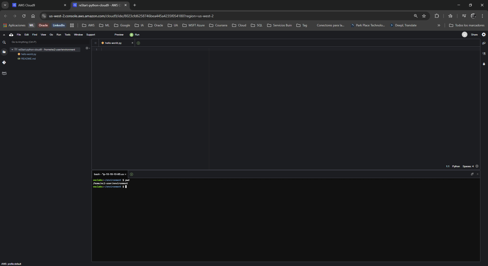
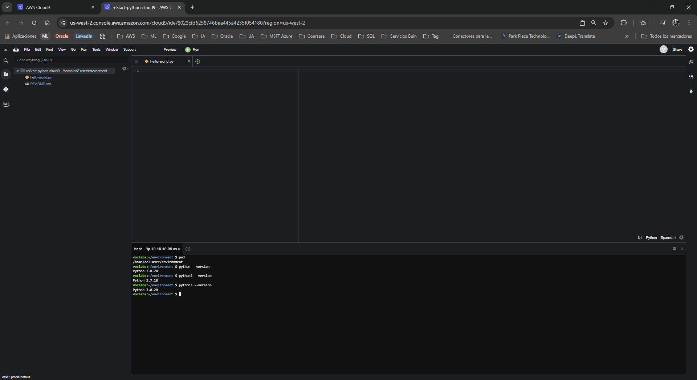
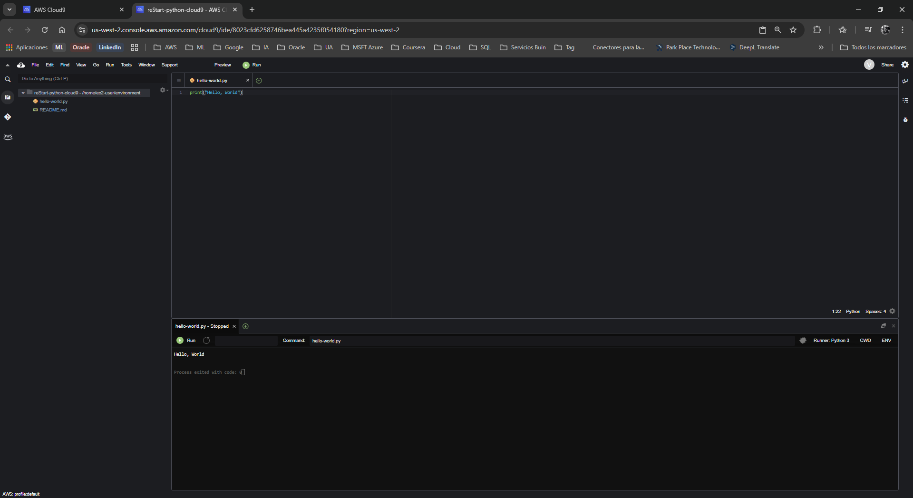

# Laboratorio: Creando un Programa "Hola, Mundo" en Python

**Dificultad:** Introductoria

**Tiempo Estimado:** 45 minutos

**Servicios Principales:** AWS Cloud9, AWS Management Console

---

## 🎯 Resumen y Objetivos

En este laboratorio darás tus primeros pasos con el lenguaje de programación Python utilizando un entorno de desarrollo integrado (IDE) en la nube. Al finalizar esta práctica, serás capaz de:
* Acceder y navegar de forma segura por el entorno de AWS Cloud9.
* Crear, editar y guardar archivos de scripts de Python en la estructura de directorios del IDE.
* Utilizar la terminal integrada de Linux para navegar por el sistema de archivos y comprobar las versiones de software.
* Escribir, ejecutar y validar el clásico programa de prueba "Hola, Mundo" en Python.

---

## 🔬 Análisis del Escenario

Como Ingeniero de Soporte, el diagnóstico de esta solicitud indica que es necesario aprovisionar y validar el entorno de desarrollo base del cliente antes de comenzar con la escritura de código complejo. AWS Cloud9 ofrece un IDE preconfigurado con las herramientas necesarias, pero es imperativo verificar las versiones del intérprete de Python (2.x vs 3.x) para evitar futuras incompatibilidades de sintaxis, ya que Python 3 introdujo cambios sin retrocompatibilidad estricta (backward compatibility) respecto a las versiones mayores anteriores. 

---

## 🛠️ Desarrollo de las Tareas

### Tarea 1: Acceder al IDE de AWS Cloud9

1. **Inicia** el entorno de laboratorio desde tu plataforma de aprendizaje (botón **Start Lab**) y espera a que el estado cambie a *Lab status: ready*.
2. **Haz clic** en el botón **AWS** para abrir la Consola de Administración de AWS en una nueva pestaña (asegúrate de permitir las ventanas emergentes si el navegador las bloquea).
3. **Navega** a la barra de búsqueda superior en la consola de AWS, **escribe** `Cloud9` y **selecciona** el servicio **Cloud9**.
4. En el panel de entornos (Your environments), **localiza** la tarjeta denominada `reStart-python-cloud9` y **haz clic** en **Open IDE** (o *Abrir* dependiendo de la interfaz actual).
5. **Espera** a que el entorno de AWS Cloud9 se cargue. Si aparece una ventana emergente indicando que *.c9/project.settings have been changed on disk*, **haz clic** en **Discard**. Si te solicita mostrar contenido de terceros (Show third-party content), **elige** **No**.

<p align="center">
  
</p>

### Tarea 2: Crear el archivo de ejercicio de Python

1. En la barra de menú superior de AWS Cloud9, **navega** a **File** > **New From Template** > **Python File**. Esto generará un archivo sin título con código de muestra.
2. **Elimina** todo el código de muestra proporcionado en la plantilla para tener un lienzo en blanco.
3. **Selecciona** **File** > **Save As...**.
4. **Escribe** el nombre `hello-world.py` y **guarda** el archivo bajo el directorio predeterminado `/home/ec2-user/environment`. 
   > *Nota de soporte:* La extensión `.py` es fundamental para que el IDE y el sistema operativo reconozcan el archivo como un script de Python y apliquen el resaltado de sintaxis correcto.

<p align="center">
  
</p>

### Tarea 3: Acceder a la sesión de terminal

1. En la parte inferior de la interfaz de Cloud9, **haz clic** en el ícono **+** junto a las pestañas existentes y **selecciona** **New Terminal**.
2. En la nueva pestaña de terminal, **escribe** el siguiente comando para verificar tu directorio de trabajo actual (Present Working Directory):
   ```bash
   pwd
   ```
3. **Verifica** que la salida por pantalla sea exactamente `/home/ec2-user/environment`. En este directorio es donde reside tu archivo `hello-world.py`.

<p align="center">
  
</p>

### Tarea 4: Ejercicio 1 - Verificación de versiones de Python

1. Para comprobar la versión predeterminada de Python instalada y configurada en tu variable de entorno, **ejecuta**:
   ```bash
   python --version
   ```
2. Para comprobar las versiones específicas de las ramas 2.x y 3.x, **ejecuta** los siguientes comandos secuencialmente:
   ```bash
   python2 --version
   python3 --version
   ```

<p align="center">
  
</p>

### Tarea 5: Ejercicio 2 - Escribir y ejecutar tu primer programa

1. En el panel de navegación izquierdo de Cloud9 (Environment), **haz doble clic** en tu archivo `hello-world.py` si no lo tienes ya abierto en el editor principal.
2. **Escribe** exactamente la siguiente línea de código en la línea 1:
   ```python
   print("Hello, World")
   ```
3. **Guarda** los cambios navegando a **File** > **Save** (o usa el atajo de teclado `Ctrl+S` / `Cmd+S`).
4. En la parte superior del IDE, **haz clic** en el botón verde **Run** (Play).
5. **Observa** el panel inferior que se abre automáticamente; debes confirmar que el programa ha impreso exitosamente las palabras `Hello, World`.

<p align="center">
  
</p>

---

## 💡 Respuestas Analíticas

Aunque este laboratorio es introductorio y no plantea preguntas directas de resolución, a nivel arquitectónico y de desarrollo es vital aclarar los siguientes puntos expuestos en el texto:

* **¿Por qué el sistema muestra diferentes versiones (ej. Python 2.7.18 y Python 3.6.12)?**
  *Análisis:* Los sistemas operativos basados en Linux (como la instancia EC2 subyacente de Cloud9) suelen incluir Python 2 por razones de legado (scripts del propio sistema operativo que aún dependen de él). Sin embargo, Python 3 es el estándar actual de la industria. Al invocar `python3` explícitamente, garantizamos que nuestro código se ejecute con el intérprete moderno, evitando las *incompatibilidades de sintaxis* mencionadas en el texto base del laboratorio.
* **¿Qué hace exactamente la función `print()`?**
  *Análisis:* Es una función integrada (built-in function) de alto nivel en Python que envía un flujo de datos (en este caso, la cadena de caracteres/string `"Hello, World"`) hacia la salida estándar (Standard Output o *stdout*), que por defecto es la terminal o consola de ejecución.

---