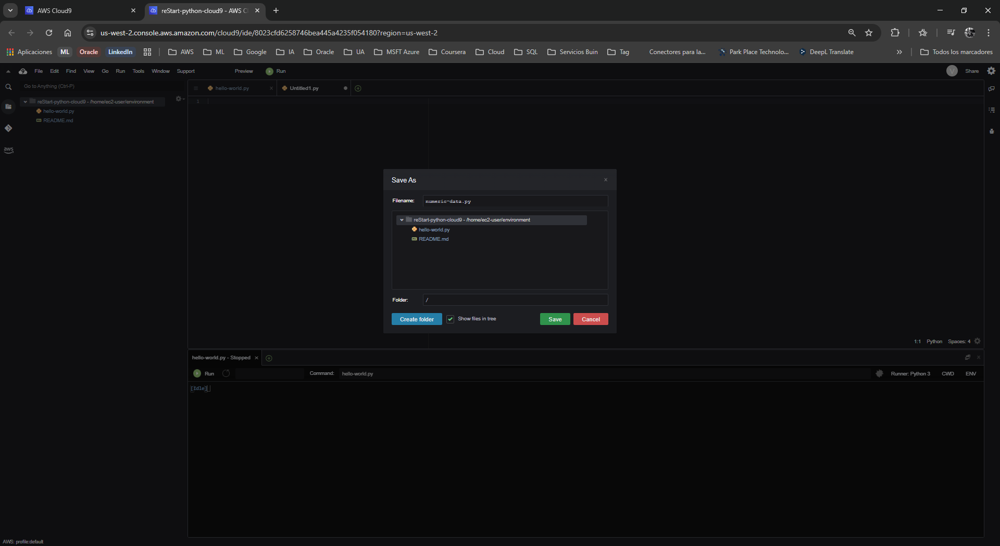
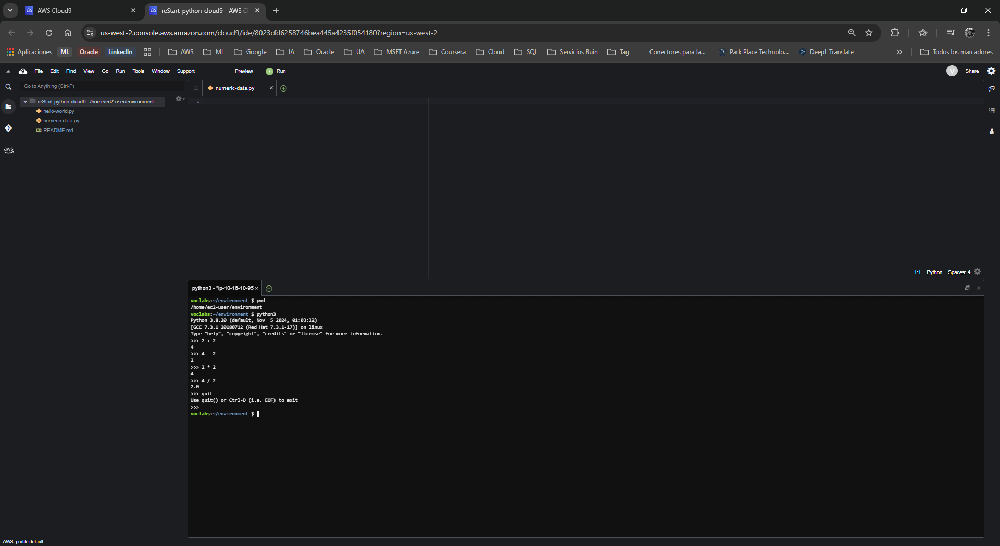
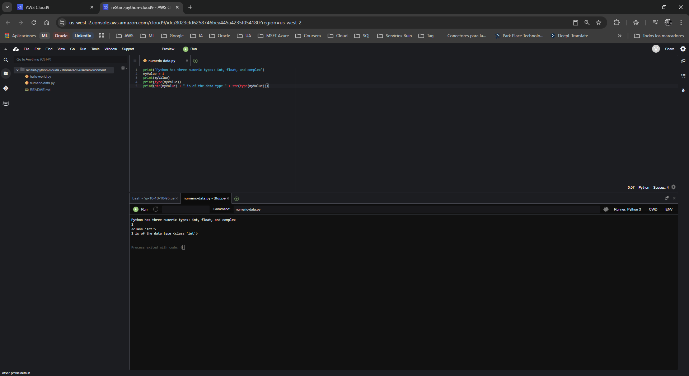
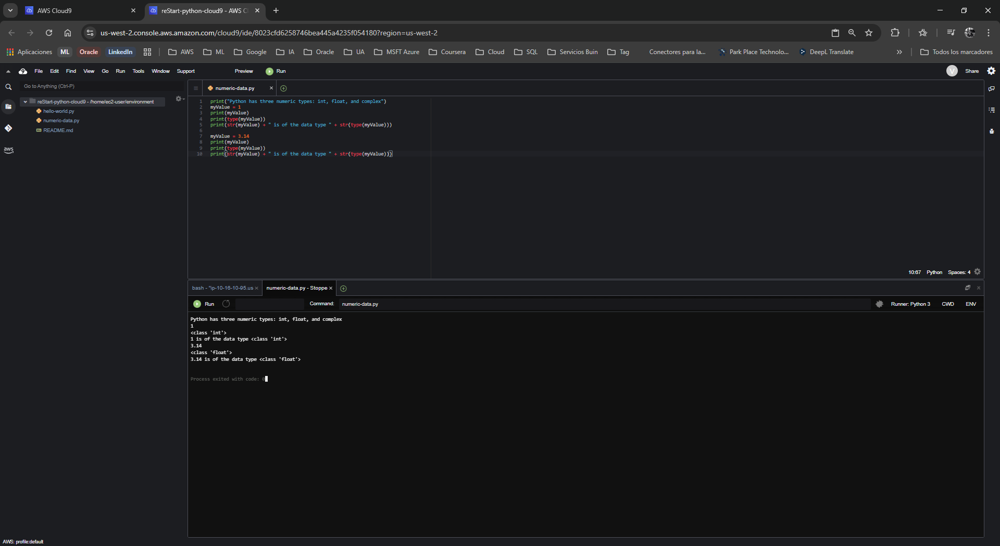
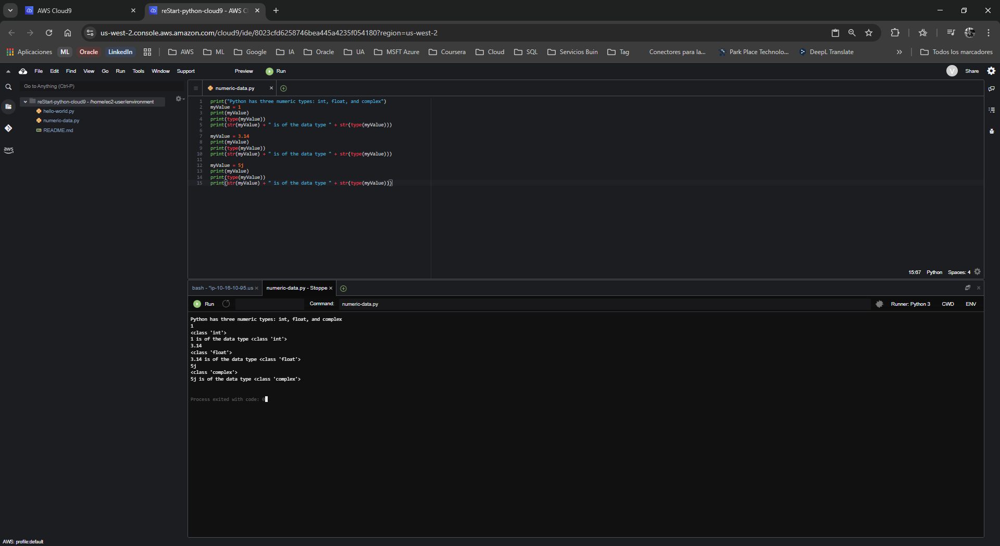
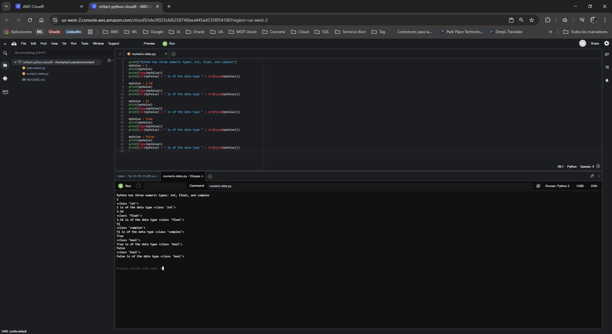

# Laboratorio: Trabajando con Tipos de Datos Numéricos en Python

**Dificultad:** Introductoria

**Tiempo Estimado:** 60 minutos

**Servicios Principales:** AWS Cloud9, AWS Management Console

---

## 🎯 Resumen y Objetivos

Python es un lenguaje ampliamente adoptado por científicos de datos e ingenieros de software debido a su eficiencia para realizar cálculos matemáticos y procesar grandes volúmenes de información. En este laboratorio, explorarás los tipos de datos básicos utilizados para almacenar valores numéricos. Al finalizar esta práctica, serás capaz de:
* Interactuar de forma interactiva con el intérprete de comandos (Shell o REPL) de Python.
* Declarar y utilizar el tipo de dato numérico entero (`int`).
* Declarar y utilizar el tipo de dato de coma flotante (`float`).
* Declarar y utilizar el tipo de dato complejo (`complex`).
* Declarar y utilizar el tipo de dato booleano (`bool`).

---

## 🔬 Análisis del Escenario

Como Ingeniero de Soporte Cloud, el diagnóstico de este ejercicio indica que el cliente necesita validar cómo Python gestiona la asignación de memoria y la tipificación dinámica de las variables numéricas dentro del entorno de AWS Cloud9. Comprender la diferencia entre números enteros, flotantes, complejos y booleanos es fundamental, ya que el manejo incorrecto de tipos (por ejemplo, omitir la conversión o "casting") es una de las causas más comunes de errores en la automatización de infraestructura y procesamiento de datos.

---

## 🛠️ Desarrollo de las Tareas

### Tarea 1: Acceso al entorno y creación del archivo

1. **Inicia** tu entorno de laboratorio desde tu plataforma y espera a que el estado indique *Lab status: ready*.
2. **Abre** la Consola de Administración de AWS y **navega** al servicio **Cloud9**.
3. En el panel, **localiza** el entorno `reStart-python-cloud9` y **haz clic** en **Open IDE**. (Descarta cualquier ventana emergente de advertencia sobre configuraciones de disco o contenido de terceros).
4. En la barra de menú del IDE, **navega** a **File** > **New From Template** > **Python File**.
5. **Elimina** el código de muestra, **selecciona** **File** > **Save As...**, **escribe** el nombre `numeric-data.py` y **guárdalo** en el directorio `/home/ec2-user/environment`.

<p align="center">
  
</p>

6. **Abre** una nueva sesión de terminal haciendo clic en el ícono **+** (zona inferior) y **selecciona** **New Terminal**.
7. **Verifica** que te encuentras en el directorio correcto ejecutando el comando `pwd`.

### Tarea 2: Uso interactivo de la Shell de Python (REPL)

La Shell de Python te permite ejecutar comandos en tiempo real, lo cual es útil para pruebas rápidas.

1. En la terminal, **inicia** el intérprete interactivo ejecutando:
   ```bash
   python3
   ```
   *(Notarás que el prompt cambia a `>>>`, indicando que el sistema ahora espera comandos de Python).*
2. **Suma:** Escribe `2 + 2` y presiona ENTER. Confirma que la salida es `4`.
3. **Resta:** Escribe `4 - 2` y presiona ENTER. Confirma que la salida es `2`.
4. **Multiplicación:** *(Nota técnica: el manual original contiene un error tipográfico en este punto. Usa el asterisco)*. Escribe `2 * 2` y presiona ENTER. Confirma que la salida es `4`.
5. **División:** Escribe `4 / 2` y presiona ENTER. Confirma que la salida es `2.0`.
6. **Sal** de la Shell de Python escribiendo la función de salida:
   ```python
   quit()
   ```

<p align="center">
  
</p>


### Tarea 3: Trabajando con el tipo de dato `int` (Entero)

Ahora escribirás un script permanente en lugar de usar la consola interactiva.

1. **Abre** tu archivo `numeric-data.py` en el editor.
2. **Escribe** la siguiente línea para imprimir un mensaje inicial:
   ```python
   print("Python has three numeric types: int, float, and complex")
   ```
3. **Crea** una variable llamada `myValue` y asígnale un número entero, luego **imprime** su valor y su tipo de dato. Para combinar texto con números, **utiliza** la función de conversión `str()`. **Añade** el siguiente bloque de código:
   ```python
   myValue = 1
   print(myValue)
   print(type(myValue))
   print(str(myValue) + " is of the data type " + str(type(myValue)))
   ```
4. **Guarda** el archivo y **ejecútalo** haciendo clic en el botón **Run** (Play) en la parte superior del IDE. Verifica que la consola indique que es de la clase `<class 'int'>`.

<p align="center">
  
</p>

### Tarea 4: Trabajando con el tipo de dato `float` (Coma Flotante)

El tipo `float` permite almacenar números con decimales.

1. En el mismo archivo `numeric-data.py`, **añade** un par de líneas en blanco al final y **agrega** este bloque reasignando la variable:
   ```python
   myValue = 3.14
   print(myValue)
   print(type(myValue))
   print(str(myValue) + " is of the data type " + str(type(myValue)))
   ```
2. **Guarda** y **ejecuta** nuevamente. Verifica en la salida que Python ahora reconoce la variable como `<class 'float'>`.

<p align="center">
  
</p>

### Tarea 5: Trabajando con el tipo de dato `complex` (Complejo)

Los números complejos se utilizan en matemáticas avanzadas y consisten en una parte real y una imaginaria (representada por la letra `j` en Python).

1. Al final de tu archivo, **añade** el siguiente código:
   ```python
   myValue = 5j
   print(myValue)
   print(type(myValue))
   print(str(myValue) + " is of the data type " + str(type(myValue)))
   ```
2. **Guarda** y **ejecuta**. Observa cómo la salida refleja la clase `<class 'complex'>`.

<p align="center">
  
</p>

### Tarea 6: Trabajando con el tipo de dato `bool` (Booleano)

Los booleanos representan los estados lógicos Verdadero (`True`) o Falso (`False`). En Python, internamente se manejan como un subconjunto de los enteros (1 y 0).

1. Al final del archivo, **agrega** el código para probar el valor `True`:
   ```python
   myValue = True
   print(myValue)
   print(type(myValue))
   print(str(myValue) + " is of the data type " + str(type(myValue)))
   ```
2. A continuación, **añade** el bloque para probar el valor `False`:
   ```python
   myValue = False
   print(myValue)
   print(type(myValue))
   print(str(myValue) + " is of the data type " + str(type(myValue)))
   ```
3. **Guarda** el archivo de forma definitiva y **ejecuta** el script completo. Verifica en el panel inferior (Runner) que toda la secuencia se haya procesado y que los booleanos muestren la clase `<class 'bool'>`.

<p align="center">
  
</p>

---

## 💡 Respuestas Analíticas

Al analizar las instrucciones de este laboratorio, surgen varios conceptos técnicos clave que vale la pena documentar para tu aprendizaje:

* **¿Por qué el resultado de `4 / 2` fue `2.0` (un *float*) en la terminal y no `2` (un *int*)?**
  *Análisis:* A partir de Python 3, el operador de división tradicional (`/`) siempre devuelve un número de coma flotante (`float`) de forma predeterminada para evitar la pérdida de precisión en divisiones no exactas. Si desearas una división estrictamente entera, tendrías que usar el operador de doble barra (`//`), lo cual devolvería `2`.
* **¿Por qué fue obligatorio usar la función `str()` al imprimir "1 is of the data type..."?**
  *Análisis:* Python es un lenguaje de tipado dinámico pero *fuertemente tipado*. Esto significa que no convertirá automáticamente un número en texto para concatenarlo con el signo `+`. Si intentas sumar un texto (string) y un número (int/float), el intérprete lanzará un error de tipo (`TypeError`). La función `str()` realiza un "Type Casting", transformando el número en una cadena de caracteres temporalmente para permitir la concatenación segura.
* **¿Es el tipo `bool` realmente un tipo numérico?**
  *Análisis:* Sí. En Python, la clase `bool` hereda directamente de la clase `int`. De forma subyacente, `True` es evaluado computacionalmente como `1` y `False` como `0`. Por esta razón el laboratorio los clasifica dentro de las estructuras numéricas, a diferencia de otros lenguajes donde los booleanos están completamente aislados.

---